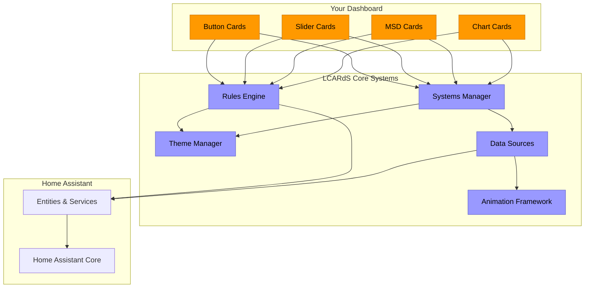
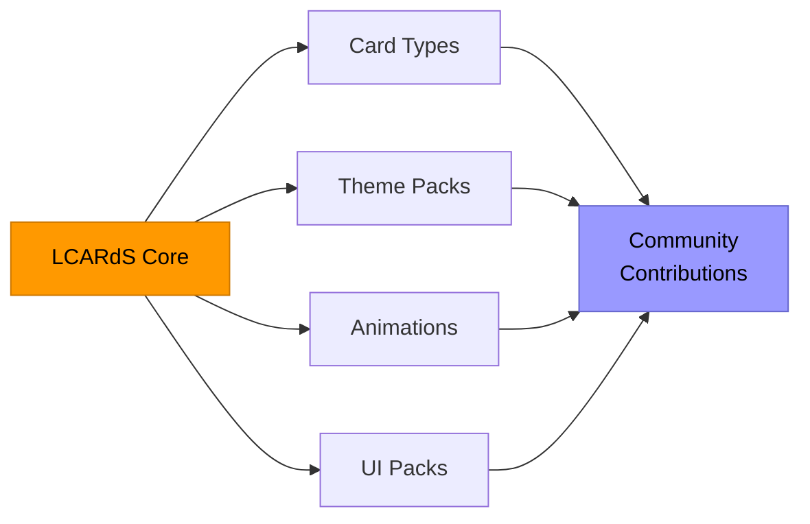

# LCARdS
*A STAR TREK FAN PRODUCTION*

<!--
IMAGE PLACEHOLDER: Hero banner
Suggested: Animated MSD showing cards, lines, animations, and effects
File: docs/assets/lcards-banner.gif
-->

**A unified card ecosystem for Home Assistant inspired by the iconic LCARS interface from Star Trek.
 Build your own LCARS-style dashboards and Master Systems Display (MSD) with realistic controls and animations.**

 

> [!IMPORTANT]
> **LCARdS** is a work in progress and not a fully commissioned Starfleet product — expect some tribbles!
>
> This is a **hobby** project, with great community support and contribution.  This is not professional, and should be used for personal use only.
>
> AI coding tools have been leveraged in this project - please see AI disclaimer section below.

 

## What is LCARdS?

LCARdS is the next evolution of dedicated LCARS-inspired cards for Home Assistant.
 It originates from, and supercedes the  [CB-LCARS](https://github.com/snootched/cb-lcars) project.
 Although deployed and used as custom cards - it's built upon common core platform that work to provide a **more complete and cohesive LCARS-like dashboard experience.**

- **Unified architecture** - Every card shares powerful reactivity, cross-card rules, and unified actions
- **Studio editors** - Advanced card editing interfaces with live previews - augmented with schema-backed yaml editors.
- **Extensible design** - Content can be enhanced and distrbuted (future) via content packs - adding button types, sliders styles, animaiton definitions, and more.

 

## Feature Parity with CB-LCARS

If coming from CB-LCARS, use this table to quickly see what the equivalent card/feature is in LCARdS.  Not all features and functions may be available yet, but will be added over time.

Legend:  ✅ Present | ❌ Not present | ⚠️ Partial

| Feature | CB-LCARS | LCARdS | Notes |
|---|:---:|:---:|---|
| Button Card | ✅  cb-lcars-button-card | ✅  lcards-button | Builtin `preset` collection provides all the standard LCARS buttons. |
| D-PAD Card | ✅  cb-lcars-dpad-card | ✅  lcards-button | Uses new  `component` feature of `lcards-button` card - complex SVGs can be turned into advanced multi-touch controls with use of `segements` concept. |
| Label Card | ✅  cb-lcars-label-card | ✅  lcards-button | Label functionality can by used with `lcards-button`.  Addional presets available for text labels with or without decoration. |
| Elbow Card | ✅  cb-lcars-elbow-card | ✅  lcards-elbow | Equivalent in LCARdS. |
| Double Elbow Card | ✅  cb-lcars-double-elbow-card | ✅  lcards-elbow | Double Elbow now consolidated into a single unified `lcards-elbow` card. |
| Slider Card | ✅  cb-lcars-multimeter-card | ⚠️  lcards-slider | Picard slider missing |
| Cascade Data Grid | ⚠️ | ✅ lcards-data-grid | CB-LCARS provided decorative only version as background animation.    In LCARdS, `lcards-data-grid` is full featured tabular/cell-based grid that can show real entity data - but also supports decorative mode equivalent to CB-LCARS version if desired.  |
| Chart / Graph Card | ❌ | ✅  lcards-chart | Embedded ApexCharts library providing access to a variety of charts/graphs types to plot entity/data against. |
| MSD (Master Systems Display) Card | ❌ | ✅  lcards-msd | Full MSD system in a card.  Embed controls (other HA cards), connect and route lines, add animations to reflect statuses, etc. |
| Background Animations | ✅  GRID, ALERT, GEO Array, Pulsewave| ❌ | Not yet implmented. |
| Element Animations | ❌ | ✅ | Embedded Anime.js v4 library enabling capability to animate any SVG element (cards, lines/stroke, text, etc.) |
| Symbiont (embedded cards) | ✅ | ❌ | Not yet implmented. |
| State-based Styling | ✅ | ✅✅ | CB-LCARS has a limited set of states to control styles.  LCARdS uses both common states, but any state can be added to the list for customized styling. |
| Custom States | ✅ | ✅✅ | LCARdS has global 'rules engine providing advanced rules to control changes to cards. |

 

## LCARdS Features and Design

### 🎯 Unified Architecture & Core Systems
- LCARdS is now based on Lit - moving away from the custom-button-card base of CB-LCARS.
- Cards share a set of common core systems:
  - **Systems Manager** - centralized entity subrcriptions and smart card notifications.
  - **Rules Engine** — conditional styling and cross-card behaviors targetable by tags, types, IDs, etc.
  - **Theme Manager** — token-based theming with live switching
  - **Animation Framework** — anime.js v4 integration for rich effects
  - **DataSource Manager** — entity subscriptions and browser-side transformations
- Template support (JavaScript, tokens, Jinja2)
- Unified action handlers and lifecycle

### 🎨 Visual Editors
- Card editors have been upgraded with immersive configuration studios
- Live WYSIWGY configuration.
- Schema-backed YAML editing with inline auto-complete for card options
- Provenance tracking for configuration layer debugging

----

 

## System Architecture

LCARdS is built on a layered architecture that keeps cards simple while providing powerful shared features:

 

## Installation

<b>With HACS (Recommended)</b>

 

1. Open HACS in your Home Assistant instance
2. Go to **Frontend** → Click **⊕** button
3. Search for **LCARdS** and install
4. Restart Home Assistant
5. Refresh your browser cache
6. Add LCARdS cards from the dashboard editor

<b>Manual Installation</b>

 

1. Download `lcards.js` from the [latest release](https://github.com/snootched/LCARdS/releases)
2. Copy to `<config>/www/`
3. Add as a resource in your dashboard (Settings → Dashboards → Resources)
4. Use `/local/lcards.js` as the URL, type: **JavaScript Module**
5. Refresh your browser
6. LCARdS cards are now available in the card picker

 

**Need help?** Check the [Getting Started Guide →](doc/user-guide/getting-started/)

 

---

## The Fleet

> [!NOTE]
> All LCARdS cards share the same powerful base: rules, actions, templates, animations, and theming. Choose the right card for your UI, then customize with the full platform's capabilities.

---

### Button Card

<!--
IMAGE PLACEHOLDER: Button card varieties
Show: Lozenge, bullet, capped, Picard variants in active/inactive states
File: docs/assets/card-button-samples.png
-->

Provides all standard LCARS buttons.

<b>Key Features</b>

- Multiple preset styles (lozenge, bullet, capped, Picard, dense)
- Dynamic state styling and response.
- Full rules engine and template support
- Custom SVG backgrounds and interactive segments

**[→ Full Documentation](doc/user-guide/)**

---

### Slider / Multimeter Card

<!--
IMAGE PLACEHOLDER: Slider/multimeter samples
Show: Horizontal pills, vertical gauge, Picard style in 2-3 examples
File: docs/assets/card-slider-samples.png
-->

Interactive controls and gauges for lights, covers, fans, and sensors.

<b>Key Features</b>

- Automatic entity detection (lights, media players, covers, fans, climate)
- Pills and gauge visual modes
- Horizontal, vertical, and Picard multimeter styles
- Range gradients and color matching to light entities
- Read-only sensor mode or interactive controls

**[→ Full Documentation](doc/user-guide/)**

---

### Elbow Card

<!--
IMAGE PLACEHOLDER: Elbow card varieties
Show: Header-left, header-right, footer variants, simple and segmented styles
File: docs/assets/card-elbow-samples.png
-->

Classic LCARS corner designs for authentic interface aesthetics.

<b>Key Features</b>

- Header/footer positioning with left/right orientation
- Simple (single elbow) and segmented (Picard double elbow) modes
- LCARS arc formula-based geometry for authentic curves
- Full button functionality (actions, rules, animations, templates)

**[→ Full Documentation](doc/user-guide/)**

---

### MSD (Multi-Status Display) Card
**✨ The Crown Jewel**

<!--
IMAGE PLACEHOLDER: MSD card in action
Show: Animated MSD with multiple blocks, dynamic lines, embedded animations
File: docs/assets/card-msd-sample.gif
-->

<!--
IMAGE PLACEHOLDER: MSD Studio editor
Show: Studio editor open with config overlay, block diagram, provenance panel visible
File: docs/assets/msd-studio-editor.png
-->

The flagship card. Sophisticated multi-card displays with **immersive visual editor**.

<b>Key Features</b>

- Multiple controls per MSD (controls are other HA cards.)
- Dynamic connecting lines and animations
- **Studio Editor**: Drag-and-drop visual configuration with live preview.

**[→ Full Documentation](doc/user-guide/advanced/msd-controls.md)**

---

### Chart Card

<!--
IMAGE PLACEHOLDER: Chart card examples
Show: Line chart, area chart, bar chart with LCARS theming
File: docs/assets/card-chart-samples.png
-->

Powerful standalone charting with 15+ chart types powered by ApexCharts.

<b>Key Features</b>

- 15+ chart types (line, area, bar, pie, scatter, heatmap, radar)
- Real-time entity updates with multi-series support
- Advanced data sources with history preload
- 50+ style properties with full theme integration
- Works standalone or embedded in MSD

**[→ Full Documentation](doc/user-guide/configuration/overlays/apexcharts-overlay.md)**

---

### Data Grid Card

<!--
IMAGE PLACEHOLDER: Data grid with cascade animation
Show: Grid with cascade animation and entity data updates
File: docs/assets/card-data-grid-sample.gif
-->

Authentic LCARS data grids with cascade animations.

<b>Key Features</b>

- Decorative mode (random data) and data mode (real entities)
- Cascade animations with LCARS color cycling
- Change detection with highlight animations
- Grid and timeline layouts
- Auto-detection of static text, entities, or templates

**[→ Full Documentation](doc/user-guide/)**

---

**[→ View Full Documentation](doc/user-guide/)**

 

---

## Editing with Studio

> [!IMPORTANT]
> LCARdS features **immersive, wizard-driven editors** that bring the "Main Engineering" experience to your dashboard configuration.

<!--
IMAGE PLACEHOLDER: Studio editor showcase
Show: MSD studio open with:
- Config overlay panel
- Live preview
- Provenance dialog
- Theme selector
- Rules builder visible in background
File: docs/assets/studio-editing-ui.png
-->

### What Makes Studio Different?

All LCARdS cards have in-place editors, but advanced cards (like MSD) get the **full Studio experience**:

- **Visual, live editing** - See changes as you make them
- **Schema-driven helpers** - Context-aware inputs and wizards
- **Undo/Redo history** - Never lose your work
- **Provenance tracking** - See who changed what and when
- **Theme live-switching** - Test themes without leaving the editor
- **Main Engineering access** - Global dialogs for rules, alerts, animations

> [!TIP]
> **Edit like a Starfleet engineer.** Studio editors make complex configurations intuitive, powerful features discoverable, and mistakes reversible.

 

---

## Main Engineering

<!--
IMAGE PLACEHOLDER: Main Engineering UI
Show: Screenshots of alert mode selector, theme browser, provenance tracker dialogs
File: docs/assets/main-engineering-dialogs.png
-->

LCARdS isn't just cards—it's a platform with **centralized system-level features**:

<table>
<tr>
<td width="33%">

### Global Alert Modes
Switch your entire dashboard to:
- 🔴 **Red Alert**
- 🔵 **Blue Alert**
- 🟡 **Yellow Alert**

Coordinated styles, sounds, and animations across all cards instantly.

</td>
<td width="33%">

### Theme Browser
- Browse and switch themes live
- Token-based system extends HA-LCARS
- Create and share theme packs
- Real-time preview

</td>
<td width="33%">

### Provenance Tracking
- See change history for each card
- Track who modified what
- Rollback to previous versions
- Export/import configurations

</td>
</tr>
<tr>
<td width="33%">

### Systems Manager
- Real-time card-to-card communication
- Centralized notification system
- Context overlays
- Tag-based targeting

</td>
<td width="33%">

### Rules Engine
- Define conditions and actions once
- Apply across multiple cards
- Cross-card reactivity
- Event-driven behaviors

</td>
<td width="33%">

### Animation Framework
- Rich, customizable effects
- LCARS-authentic presets
- Lifecycle management
- Performance-optimized

</td>
</tr>
</table>

> [!NOTE]
> **Main Engineering features are accessible from any Studio editor.** Create a rule, apply it to tagged cards. Switch alert modes, see all cards respond. One system, infinite possibilities.

 

---

## Built to Extend

LCARdS is designed for **community contribution and extensibility**:

- **Modern architecture** - Built with LitElement web components
- **Card APIs** - Extend `LCARdSCard` base for new card types
- **UI Packs** - Community can author and share packs (coming soon)
- **Token-based theming** - Create themes that extend HA-LCARS
- **Open source** - PRs, issues, and suggestions welcome

**Want to contribute?** Check out the [Developer Documentation →](doc/architecture/)

 

---

## Documentation

| Resource | Description |
|----------|-------------|
| [📖 User Guide](doc/user-guide/) | Complete guide to using LCARdS |
| [🚀 Getting Started](doc/user-guide/getting-started/) | Installation and first card tutorial |
| [🎨 Configuration](doc/user-guide/configuration/) | All card types and configuration |
| [🎭 Theming](doc/user-guide/advanced/theme_creation_tutorial.md) | Themes and token system |
| [⚙️ Rules Engine](doc/user-guide/configuration/rules.md) | Cross-card rules and automation |
| [🏗️ Architecture](doc/architecture/) | Developer docs and system design |
| [❓ Getting Started](doc/user-guide/getting-started/) | Common questions and solutions |

 

---

## Acknowledgements & Thanks

A very sincere thanks to these projects and their authors, contributors and communities for doing what they do, and making it available.  It really does make this a fun hobby to tinker with.

[**ha-lcars theme**](https://github.com/th3jesta/ha-lcars) (the definitive LCARS theme for HA!)

[**lovelace-layout-card**](https://github.com/thomasloven/lovelace-layout-card)

[**lovelace-card-mod**](https://github.com/thomasloven/lovelace-card-mod)

 
As well, some shout-outs and attributions to these great projects:
  

[LCARSlad London](https://twitter.com/lcarslad) for excellent LCARS images and diagrams for reference.

[meWho Titan.DS](https://www.mewho.com/titan) for such a cool interactive design demo and colour reference.

[TheLCARS.com]( https://www.thelcars.com) a great LCARS design reference, and the original base reference for Data Cascade and Pulsewave animations.

[lcars](https://github.com/joernweissenborn/lcars) for the SVG used inline in the dpad control.

- **All Star Trek & LCARS fans** - Your passion drives this project 🖖

 

---

## License & Disclaimers

This project uses the MIT License. For more details see [LICENSE](LICENSE)

---
A STAR TREK FAN PRODUCTION

This project is a non-commercial fan production. Star Trek and all related marks, logos, and characters are solely owned by CBS Studios Inc.
This fan production is not endorsed by, sponsored by, nor affiliated with CBS, Paramount Pictures, or any other Star Trek franchise.

No commercial exhibition or distribution is permitted. No alleged independent rights will be asserted against CBS or Paramount Pictures.
This work is intended for personal and recreational use only.

---

### AI-Assisted Development Notice (AIG‑2)

This project is heavily developed with the assistance of AI tools.  Most implementation code and portions of the documentation were generated by AI models.
 All architectural decisions, design direction, integration strategy, and project structure are human-led.
 All AI-generated components are reviewed, validated, tested, and refined by human contributors to ensure accuracy, coherence, and consistency with project standards.

This is a human-directed, AI-assisted project. AI acts as an implementation accelerator; humans remain responsible for decisions, quality control, and final output.

---

🖖 **Live long and prosper** 🖖
