# LCARdS
*A STAR TREK FAN PRODUCTION*

<!--
IMAGE PLACEHOLDER: Hero banner
Suggested: Animated MSD showing cards, lines, animations, and effects
File: docs/assets/lcards-banner.gif
-->

**A unified card system for Home Assistant inspired by the iconic LCARS interface from Star Trek.
<br>Build your own LCARS-style dashboards and Master Systems Display (MSD) with realistic controls and animations.**

[](https://github.com/snootched/LCARdS/releases)
[](LICENSE)
[](https://github.com/snootched/LCARdS/commits/main)

<br>

> [!IMPORTANT]
> **LCARdS** is a work in progress and not a fully commissioned Starfleet product — expect some tribbles!
>
> This is a **hobby** project, with great community support and contribution.  This is not professional, and should be used for personal use only.
>
> AI coding tools have been leveraged in this project - please see the [AI Usage](#ai-usage) section below for details.

<br>

## What is LCARdS?

LCARdS is the evolution of dedicated LCARS-inspired cards for Home Assistant.
<br>It originates from, and supercedes the  [CB-LCARS](https://github.com/snootched/cb-lcars) project - and is meant to accompany [**HA-LCARS themes**](https://github.com/th3jesta/ha-lcars).
<br>Although deployed and used as individual custom cards - it's built upon common core components that aim to provide a **more complete and cohesive LCARS-like dashboard experience.**

- **Unified architecture** - Every card has access to centralized data sources with entity subcription and notification, cross-card rules, and unified actions.
- **Studio editors** - Most cards now have dedicated editing studio interfaces with live previews - augmented with schema-backed yaml editors for context-aware autocomplete and validation.
- **Extensible design** - Content can be enhanced and distrbuted (future) via content packs - adding button types, sliders styles, animation definitions, and more.

<br>

## Feature Parity with CB-LCARS

If coming from CB-LCARS, use this table to quickly see what the equivalent card/feature is in LCARdS.  Not all features and functions may be available yet, but will be added over time.


Legend:  ✅ Present | ❌ Not present | ⚠️ Partial

| Feature | CB-LCARS | LCARdS | Notes |
|---|:---:|:---:|---|
| Buttons | ✅ <br>`cb-lcars-button-card` | ✅ <br>`lcards-button` | Builtin `preset` collection provides the standard LCARS buttons which are completely configurable. |
| Multi-Segment Buttons | ❌ | ✅ <br>`lcards-button` | Allows for complex card designs (`component`) to be used as advanced multi-segment/multi-touch controls.  The controls are configured with use of new `segements` configurations. |
| DPAD  | ✅ <br>`cb-lcars-dpad-card` | ✅ <br>`lcards-button` | First advanced button to use `component` feature of `lcards-button` card. |
| ALERT | ⚠️ <br>background animation | ✅ <br>`lcards-button` | Promoted to a button card component - allows full interactive configurations. |
| Labels | ✅ <br>`cb-lcars-label-card` | ✅ <br>`lcards-button` | Label functionality can by used with `lcards-button`.  Addional presets available for text labels with or without decoration. |
| Elbows | ✅ <br>`cb-lcars-elbow-card` | ✅ <br>`lcards-elbow` | Equivalent in LCARdS - enhanced with more corner styles (ie. straight cut with configurable angles) |
| Double Elbows | ✅ <br>`cb-lcars-double-elbow-card` | ✅ <br>`lcards-elbow` | Double Elbow functionality is now consolidated into a single unified `lcards-elbow` card.  Available elbow styles will allow for double mode if supported. |
| Sliders | ✅ <br>`cb-lcars-multimeter-card` | ✅ <br>`lcards-slider` | Completely replacing former multimeter card.  Enhanced with much better configuration options for direction, inversion, display min/max, control min/max etc. |
| Cascade Data Grid | ⚠️ <br>background animation | ✅ `lcards-data-grid` | CB-LCARS provided decorative only version as background animation.  <br><br>In LCARdS, `lcards-data-grid` is full featured tabular/cell-based grid that can show real entity data, text, etc.  It still supports a decorative mode (generated data) equivalent to CB-LCARS version if desired.  |
| Charts / Graphs | ❌ | ✅ <br>`lcards-chart` | Embedded ApexCharts library providing access to a variety of charts/graphs types to plot entity/data against. |
| MSD (Master Systems Display) Card | ❌ | ✅ <br>`lcards-msd` | Full MSD system in a card.  Embed controls (other HA cards), connect and route lines, add animations to reflect statuses, etc. |
| Background Animations | ✅ <br>GRID, ALERT, GEO Array, Pulsewave| ⚠️ |GRID (enhanced)<br><br>ALERT (now a button card component like DPAD)<br><br>GEO Array, Pulsewave (pending) |
| Element Animations | ❌ | ✅ | Embedded Anime.js v4 library enabling capability to animate any SVG element (cards, lines/stroke, text, etc.) |
| Symbiont (embedded cards) | ✅ | ❌ | Not yet implmented. |
| State-based Styling / Custom States | ✅ | ✅✅ | CB-LCARS has a limited set of states to control styles.  LCARdS uses both common state groupings [`default`|`active`|`inactive`|`unavailable`] and the ability to definte any state to the list for customized styling.  Integrates with core rules engine for hot-patching card styles. |
| Sounds | ❌ | ✅ | Customizable sounds enabled for many UI and Card event types (tap, double tap, hold, hover, sidebar expand/collapse, and more...) |

<br>

## Installation

<details>
<summary><b>Install from HACS</b></summary>

<br>

1. Open HACS in your Home Assistant instance
2. Search for **LCARdS** and install
3. Refresh your browser cache
4. Add LCARdS cards from the dashboard editor

</details>


<details>
<summary><b>Enable the LCARdS Config Panel (Recommended)</b></summary>

<br>

The LCARdS Config Panel adds a dedicated sidebar entry in Home Assistant for managing themes, sounds, helpers, and packs — accessible outside of any card editor.

Add the following to your `configuration.yaml` and restart Home Assistant:

```yaml
panel_custom:
  - name: lcards-config-panel
    sidebar_title: LCARdS Config
    sidebar_icon: mdi:space-invaders
    url_path: lcards-config-panel
    module_url: /hacsfiles/lcards/lcards.js
```

See [LCARdS Config Panel →](doc/user/config-panel.md) for full documentation.

</details>

<br>

[](https://my.home-assistant.io/redirect/hacs_repository/?owner=snootched&repository=LCARdS&category=frontend)

<br>

---
## LCARdS Features and Design

### 🎯 Unified Architecture & Core Systems
- LCARdS is built on Lit — moving away from the custom-button-card base of CB-LCARS.
- LCARdS integrates popular libraries: **[ApexCharts](https://apexcharts.com)** for charting and **[Anime.js v4](https://animejs.com)** for animations.
- The cards share a set of common core systems:
  - **Systems Manager** — centralized entity subscriptions and smart card notifications (reducing duplicate subscriptions on the same entities)
  - **Rules Engine** — centralized conditional styling and cross-card behaviors; target cards by tags, types, or IDs
  - **Theme Manager** — token-based theming; themes define colors, spacing, borders, and more
  - **Animation Framework** — fully integrated Anime.js v4 with helper methods and a built-in preset library
  - **DataSource Manager** — centralized data buffers with runtime entity history and processing pipelines (moving average, min/max, aggregation, etc.)
  - **Sound System** — LCARS-style audio feedback for card interactions and UI events; configurable per event type
  - **Pack Manager** — content distribution system for themes, presets, animations, and assets
- **Template system** — four syntaxes supported in any text field: JavaScript `[[[...]]]`, Jinja2 `{{...}}`, token `{entity.state}`, and DataSource `{ds:name}`

### 🎨 Visual Editors
- Card editors have been upgraded with immersive configuration studios.
- Live WYSIWYG configuration with instant preview.
- Schema-backed YAML editing with inline auto-complete and validation for all card options.
- **Main Engineering tab** — per-card access to data sources, rules, theme browser, and provenance tracking.
- Provenance tracking — inspect the effective runtime config and see which system contributed each value.

----

<br>

## System Architecture

LCARdS is built on a layered architecture that aims keeps cards simple.  The cards leverage the shared core for accessing powerful features:

```mermaid
graph LR
    subgraph HA["Home Assistant"]
        HACore[HA Core]
    end

    subgraph CORE["LCARdS Core"]
       subgraph CoreSystems["window.lcards.core.*"]
            direction LR
            CoreRules[Rules Engine]:::coreStyle
            CoreThemes[Theme Manager]:::coreStyle
            CoreData[Data Source Manager]:::coreStyle
            CoreSystemsMgr[Systems Manager]:::coreStyle
            CoreAnim[Animation Manager]:::coreStyle
            CoreOther[...other core systems]:::coreStyle
        end
    end

    subgraph DASHBOARD["Dashboard"]
        Button([LCARdS Button Card]):::lcardsStyle
        Elbow(["LCARdS Elbow Card"]):::lcardsStyle
        Slider([LCARdS Slider Card]):::lcardsStyle
        Chart([LCARdS Chart Card]):::lcardsStyle
        Grid([LCARdS Data Grid Card]):::lcardsStyle
        subgraph MSD[LCARdS MSD Card]
            Card1([HA Cards]):::lcardsStyle
            MSDLCARdS([LCARdS Cards]):::lcardsStyle
        end
    end

    HACore 0@-..-CoreSystems
    CoreSystems 1@-...- Button
    CoreSystems 2@-.- Slider
    CoreSystems 3@-.- Chart
    CoreSystems 4@-.- Elbow
    CoreSystems 5@-.- Grid
    CoreSystems 6@-.- MSD
    CoreSystems 7@-.- MSDLCARdS

    0@{ animate: slow }
    1@{ animate: slow }
    2@{ animate: slow }
    3@{ animate: slow }
    4@{ animate: slow }
    5@{ animate: slow }
    6@{ animate: slow }
    7@{ animate: slow }

    linkStyle 0,1,2,3,4,5,6,7 stroke:#00eeee,stroke-width:3px

    classDef lcardsStyle fill:#ffb399,stroke:#e7442a,color:#000
    classDef coreStyle fill:#6d748c,stroke:#d2d5df

    style HA fill:#1c3c55,stroke:#37a6d1,color:#fff
    style HACore fill:#37a6d1,stroke:#93e1ff,color:#fff

    style CORE fill:#1e2229,stroke:#2f3749
    style CoreSystems fill:#2f3749,stroke:#52596e

    style DASHBOARD fill:#2f3749,stroke:#52596e
    style MSD fill:#e7442a,stroke:#ffb399,color:#fff
```



---

## The Fleet


### Button Card [`lcards-button`]


Provides all standard LCARS buttons, plus advanced multi-segment/multi-function buttons.

<details>
<summary><b>Key Features</b></summary>

- Built-in preset library: lozenge, bullet, capped, outline, pill, text, and more
- **Component mode** — embed SVG components (D-pad, Alert, custom shapes) with individually configurable interactive `segments`
- **Alert component** — animated red/yellow alert with `ranges` config; coordinates across all registered cards
- State-based styling with `default`, `active`, `inactive`, `unavailable`, and any custom state
- Multiple independent text fields, each with full template and style control
- Canvas-based **background animations** (grid, zoom, starfield, and more)
- Rules Engine integration — styles can be hot-patched by global rules at runtime

**[Button Documentation](doc/user/cards/button/README.md)**

</details>

---

### Slider Card [`lcards-slider`]


<!--
IMAGE PLACEHOLDER: Slider/multimeter samples
Show: Horizontal pills, vertical gauge, Picard style in 2-3 examples
File: docs/assets/card-slider-samples.png
-->

Interactive sliders for display of sensors, and control of entities.

<details>
<summary><b>Key Features</b></summary>

- Built-in presets: pills (horizontal/vertical) and gauge styles
- Horizontal and vertical orientations with independent display and control inversion
- Separate min/max for display range vs. control range
- Domain auto-detection — entities from `light`, `climate`, `cover`, etc. map automatically to the correct control domain
- Configurable tick marks, labels, and track fill styling
- Read-only mode for sensor display

**[Slider Documentation](doc/user/cards/slider/README.md)**

</details>

---

### Elbow Card [`lcards-elbow`]


<!--
IMAGE PLACEHOLDER: Elbow card varieties
Show: Header-left, header-right, footer variants, simple and segmented styles
File: docs/assets/card-elbow-samples.png
-->

Classic LCARS corner designs for authentic interface aesthetics.

<details>
<summary><b>Key Features</b></summary>

- Header and footer types with left/right orientation
- **Simple** (single-section) and **segmented** (two-section) styles
- Standard LCARS arc formula (`outer_curve: auto`) or straight-cut corners with configurable angles
- Inherits the full `lcards-button` feature set: multi-text fields, actions, rules, animations, templates
- Optional **HA-LCARS theme helper binding** — `bar_width: theme` / `bar_height: theme` links sizing to `input_number.lcars_horizontal/vertical` helpers for dashboard-wide control

**[Elbow Documentation](doc/user/cards/elbow/README.md)**

</details>

---

### MSD (Master Systems Display) Card [`lcards-msd`]


<!--
IMAGE PLACEHOLDER: MSD card in action
Show: Animated MSD with multiple blocks, dynamic lines, embedded animations
File: docs/assets/card-msd-sample.gif
-->


<!--
IMAGE PLACEHOLDER: MSD Studio editor
Show: Studio editor open with config overlay, block diagram, provenance panel visible
File: docs/assets/msd-studio-editor.png
-->

Highly configurable canvas with multi-card and routing line support.

<details>
<summary><b>Key Features</b></summary>

- Embed any HA card or LCARdS card as a positioned **control overlay** within the MSD canvas
- **Line overlays** with automatic smart routing between anchors — avoids obstacles, respects channel guides
- **Anchor system** — named connection points on the base SVG that lines route to/from
- **Routing channels** — define preferred, avoided, or forced routing corridors
- Animate lines and controls independently based on entity state
- Fully configurable base SVG: built-in assets, local files, or external URLs
- **Studio Editor**: Drag-and-drop visual configuration with live preview

**[MSD Documentation](doc/user/cards/msd/README.md)**

</details>

---

### Chart Card [`lcards-chart`]


<!--
IMAGE PLACEHOLDER: Chart card examples
Show: Line chart, area chart, bar chart with LCARS theming
File: docs/assets/card-chart-samples.png
-->

LCARdS integrated charting card powered by ApexCharts library.

<details>
<summary><b>Key Features</b></summary>

- 15+ chart types: line, area, bar, pie, scatter, heatmap, radar, and more
- Three data config levels: direct entity (`source`), multiple entities (`sources`), or LCARdS DataSources with processor buffers (`data_sources`)
- DataSource integration gives access to history, moving averages, min/max, and other transformations
- Multi-series with independent colors, stroke styles, and fill
- Multi-axis support — different y-axes for different series
- Real-time entity updates with configurable history preload

**[Chart Documentation](doc/user/cards/chart/README.md)**

</details>

---

### Data Grid Card [`lcards-data-grid`]


<!--
IMAGE PLACEHOLDER: Data grid with cascade animation
Show: Grid with cascade animation and entity data updates
File: docs/assets/card-data-grid-sample.gif
-->

LCARS data grids with configurable data modes and cascade animations.

<details>
<summary><b>Key Features</b></summary>

- **Data mode** — display real entity states, attributes, or template values in each cell
- **Decorative mode** — randomly generated cascading data for pure aesthetics (equivalent to CB-LCARS background animation)
- LCARS-style **cascade animation** with configurable patterns (column, row, random, spiral) and color cycling
- **Change highlight** — cells flash when their entity value updates
- Cell values support static text, entity IDs, Jinja2 templates, and DataSource references — auto-detected
- CSS Grid layout for full control over columns and row sizing
- Hierarchical style cascading: table → column → row → cell

**[Data Grid Documentation](doc/user/cards/data-grid/README.md)**

</details>

<br>

---

## Card Editors and Configuration Studios

The aim is for LCARdS to have as much UI-based configuration as it can - but also to be easy to learn and navigate.  Of course, YAML is always available - and UI-editors have a schema-enhanced YAML editing tab to help with validation and auto-complete.


Above the standard HA editor - some cards feature a more immersive graphical environment — *Configuration Studio*. You can use these editors to quickly get set up and out of spacedock.


> [!TIP]
> Look for the ***[Open Configuration Studio]*** launcher button in the card's main configuration tab.


<!--
IMAGE PLACEHOLDER: Studio editor showcase
Show: MSD studio open
File: docs/assets/studio-editing-ui.png
-->


<br>

---

## Main Engineering


<!--
IMAGE PLACEHOLDER: Main Engineering UI
Show: Screenshots of alert mode selector, theme browser, provenance tracker dialogs
File: docs/assets/main-engineering-dialogs.png
-->

Every LCARdS card editor has a **Main Engineering** tab — a per-card window into the core systems. Use it to manage this card's data sources, inspect its runtime configuration, and browse live theme tokens.

<table>

<tr>
<td width="40%">

### Data Sources
- View all registered LCARdS data sources: local (this card) and global (other cards)
- Create, edit, and remove data sources and processing buffers
- Browse any data source's live values and processor output

</td>

<td width="60%">


</td>
</tr>

<tr>
<td width="40%">

### Theme Browser
- Browse theme tokens and CSS variables live
- View and configure alert mode settings

</td>

<td width="60%">


</td>

</tr>

<tr>
<td width="40%">

### Provenance Tracking
- Inspect the effective runtime card configuration
- See which system contributed the final value for each config option
- Identify when a rule has overridden a card style at runtime

</td>

<td width="60%">


</td>

</tr>

<tr>
<td width="40%">

### Rules Engine
- View all rules currently in the system
- See which rules are affecting this card
- (future) Access Rule Builder studio

</td>

<td width="60%">


</td>

</tr>
</table>

<br>

---

## LCARdS Config Panel

The **LCARdS Config Panel** is a standalone sidebar entry in Home Assistant — a central hub for managing LCARdS settings outside of any individual card editor.

> [!TIP]
> See the [Installation](#installation) section above for the one-time `configuration.yaml` setup required to enable the sidebar panel.

| Tab | What it does |
|-----|--------------|
| **Helpers** | Create all required HA input helpers in one click (sound, alert, HA-LCARS sizing) |
| **Theme Browser** | Browse all live theme tokens and CSS variables from LCARdS and HA-LCARS |
| **Sound** | Configure the active sound scheme and set per-event overrides |
| **Pack Explorer** | Browse installed packs; view available presets, themes, and animations |
| **YAML Export** | Generate a full `configuration.yaml` snippet for all LCARdS helpers |

Alert mode (red/yellow alert) can also be triggered from the Config Panel — it coordinates animated responses across all registered cards simultaneously.

**[Full Config Panel Documentation →](doc/user/config-panel.md)**

<br>

---

## Built to Extend

LCARdS design is aiming to have an extensbile architecture that can enable **customization and community contribution** by way of a *pack system*.

```mermaid
flowchart TB
    subgraph BuiltinPacks["<b>Builtin Packs</b>"]
        P1["lcards_buttons<br/>v2026.x.y<br/><br/><code>- style_presets [buttons]</code>"]:::builtinPacksStyle
        P2["lcards_sliders<br/>v2026.x.y<br/><br/><code>- style_presets [sliders]</code>"]:::builtinPacksStyle
        P3["builtin_themes<br/>v2026.x.y<br/><br/><code>- themes</code>"]:::builtinPacksStyle
        P4["lcars_fx<br/>v2026.x.y<br/><br/><code>- animations<br/>- rules</code>"]:::builtinPacksStyle
    end

    subgraph ExternalPacks["<b>External/User Packs</b>"]
        E1["ds9_pack<br/>v2.0.0<br/><br/><code>- themes<br/>- style_presets<br/>- svg_assets<br/>- animations</code>"]:::externalPacksStyle
        E2["voyager_pack<br/>v1.5.0<br/><br/><code>- themes<br/>- font_assets<br/>- rules</code>"]:::externalPacksStyle
        E3["msd_collection<br/>v1.0.0<br/><br/><code>- svg_assets<br/>- animations</code>"]:::externalPacksStyle
    end

    subgraph PackMgr["<b>PackManager</b>"]
        PM[Pack Loader &<br/>Content Distributor]
    end

    subgraph CoreSystems["<b>Core Systems</b>"]
        TM[ThemeManager<br/>Theme tokens]:::coreStyle
        SPM[StylePresetManager<br/>Button & slider presets]:::coreStyle
        AR[AnimationRegistry<br/>Animation definitions]:::coreStyle
        RE[RulesEngine<br/>Conditional rules]:::coreStyle
        AM[AssetManager<br/>SVG & font assets]:::coreStyle
    end

    P1 0@--- PM
    P2 1@--- PM
    P3 2@--- PM
    P4 3@--- PM
    E1 4@--- PM
    E2 5@--- PM
    E3 6@--- PM

    PM 7@---|themes| TM
    PM 8@---|style_presets| SPM
    PM 9@---|animations| AR
    PM 10@---|rules| RE
    PM 11@---|svg_assets<br/>font_assets| AM

    TM 12@-.- Cards([LCARdS Cards])
    SPM 13@-.- Cards
    AR 14@-.- Cards
    RE 15@-.- Cards
    AM 16@-.- Cards



    0@{ animate: slow }
    1@{ animate: slow }
    2@{ animate: slow }
    3@{ animate: slow }
    4@{ animate: slow }
    5@{ animate: slow }
    6@{ animate: slow }
    7@{ animate: slow }
    8@{ animate: slow }
    9@{ animate: slow }
    10@{ animate: slow }
    11@{ animate: slow }
    12@{ animate: slow }
    13@{ animate: slow }
    14@{ animate: slow }
    15@{ animate: slow }
    16@{ animate: slow }

    linkStyle 0,1,2,3 stroke:#67caf0,stroke-width:3px
    linkStyle 4,5,6 stroke:#f9ef97,stroke-width:3px
    linkStyle 7,8,9,10,11 stroke:#00eeee,stroke-width:3px,color:#fff
    linkStyle 12,13,14,15,16 stroke:#ffb399,stroke-width:3px

    style BuiltinPacks fill:#2f3749,stroke:#52596e
    style ExternalPacks fill:#2f3749,stroke:#52596e
    style CoreSystems fill:#1e2229,stroke:#2f3749
    style Cards fill:#e7442a,stroke:#ffb399,color:#fff
    style PM fill:#1c3c55,stroke:#37a6d1,color:#fff
    style PackMgr fill:#2f3749,stroke:#52596e

    classDef builtinPacksStyle fill:#2a7193,stroke:#67caf0,color:#fff
    classDef externalPacksStyle fill:#ac943b,stroke:#f9ef97,color:#fff
    classDef coreStyle fill:#2f3749,stroke:#52596e
```




**Key Concepts:**
- **Packs are content distribution units** containing any combination of: `themes`, `style_presets`, `animations`, `rules`, `svg_assets`, `font_assets`, and future types.
- **Single packs can contain multiple content types** (e.g., lcars_buttons has both style_presets and components)
- **PackManager orchestrates the merge and distribution** at core initialization - registering content to appropriate managers
- **Cards consume from managers**, not packs directly — enabling clean separation from the cards
- **Community extensibility** — custom packs will be able to extend LCARdS with new themes, button styles, animations, and more

Check out the [Developer Documentation →](doc/architecture/)

<br>

---
## AI Usage

<details>
<summary>AI-Assisted Development Notice (AIG‑2)</summary>

<i>This project is heavily developed with the assistance of AI tools.  Most implementation code and portions of the documentation were generated by AI models.
<br>All architectural decisions, design direction, integration strategy, and project structure are human-led.
<br>AI-generated components are reviewed, validated/tested, and refined by human contributors to ensure accuracy, coherence, and consistency with project standards.

This is a human-directed, AI-assisted project. AI acts as an implementation accelerator; humans remain responsible for decisions, testing for quality control, and final output.</i>
</details>

<br>
This project is as much as an experimentation with various AI-enabled tools and learning about different software designs as it is about the creation of the actual custom cards.

<br>
Different models are used throughout the process to plan, create, and (ultimately) refactor the cards and systems.  As we gain more experience, and develop more ideas, then systems are revisited.  We attempt to further standardize, simplify, and optimize where we can as we go.

---

## Acknowledgements & Thanks

A very sincere thanks to these projects and their authors, contributors and communities for doing what they do, and making it available.  It really does make this a fun hobby to tinker with.

[**ha-lcars theme**](https://github.com/th3jesta/ha-lcars) (the definitive LCARS theme for HA!)

[**lovelace-layout-card**](https://github.com/thomasloven/lovelace-layout-card)

[**lovelace-card-mod**](https://github.com/thomasloven/lovelace-card-mod)

<br>
As well, some shout-outs and attributions to these great projects:
<br><br>

[LCARSlad London](https://twitter.com/lcarslad) for excellent LCARS images and diagrams for reference.

[meWho Titan.DS](https://www.mewho.com/titan) for such a cool interactive design demo and colour reference.

[TheLCARS.com]( https://www.thelcars.com) a great LCARS design reference, and the original base reference for colours, Data Cascade and Pulsewave animations.

[lcars](https://github.com/joernweissenborn/lcars) for the SVG used inline in the dpad control.

- **All Star Trek & LCARS fans** - Your passion drives this project 🖖

<br>

---

## License & Disclaimers

This project uses the MIT License. For more details see [LICENSE](LICENSE)

---
A STAR TREK FAN PRODUCTION

This project is a non-commercial fan production. Star Trek and all related marks, logos, and characters are solely owned by CBS Studios Inc.
This fan production is not endorsed by, sponsored by, nor affiliated with CBS, Paramount Pictures, or any other Star Trek franchise.

No commercial exhibition or distribution is permitted. No alleged independent rights will be asserted against CBS or Paramount Pictures.
This work is intended for personal and recreational use only.

---

🖖 **Live long and prosper** 🖖
