<!--
IMAGE PLACEHOLDER: Hero banner
Suggested: Animated MSD showing cards, lines, animations, and effects
File: docs/assets/lcards-banner.gif
-->

**A unified card system for Home Assistant inspired by the iconic Star Trek LCARS interfaces.
<br>Build your own LCARS-style dashboards and Master Systems Display (MSD) with realistic controls, reactivity and animations.**

[](https://github.com/snootched/LCARdS/releases)
[](LICENSE)
[](https://github.com/snootched/LCARdS/commits/main)
[](https://github.com/snootched/LCARdS/commits/msd-globalisation)

<br>

> [!IMPORTANT]
> **LCARdS** is a work in progress and not a fully commissioned Starfleet product — expect some tribbles!
>
> This is a **hobby** project, with great community support and contribution.  This is not professional, and should be used for personal use only.
>
> AI coding tools have been leveraged in this project - please see the [AI Usage](#ai-usage) section below for details.

<br>

## What is LCARdS?

LCARdS is the evolution of dedicated LCARS-inspired cards for Home Assistant.
<br>It originates from, and supercedes the  [CB-LCARS](https://github.com/snootched/cb-lcars) project.  LCARdS is meant to accompany and complement [**HA-LCARS themes**](https://github.com/th3jesta/ha-lcars).
<br>Although deployed and used as individual custom cards - it's built upon common core components that aim to provide a more complete and cohesive LCARS-like dashboard experience.

- **Unified architecture** — Each LCARd share core services that centralized data sources, provide a cross-card rules engine, theme tokens, sounds, a coordinated animation framework, and much more.
- **State-aware styling** — Cards respond dynamically to entity states via a rules engine that hot-patches styles across multiple cards simultaneously — including coordinated alert modes.
- **Built to animate** — Embedded Anime.js v4 enables per-element animations on any SVG shape, line, or text — driven by entity state or triggered globally.
- **Living data** — Entities can be subscribed, buffered, and processed (moving averages, min/max, history) and referenced in any card field using a flexible four-syntax template system.
- **Extensible by design** — Themes, button presets, animations, and other assets can be distributed via a content pack system.

<br>

## Coming from CB-LCARS

If coming from CB-LCARS, use this table to quickly see what the equivalent card/feature is in LCARdS.  Not all features and functions may be available yet, but will be added over time.

> [!TIP]
> You may run CB-LCARS and LCARdS together while transitioning over to LCARdS.  All new features and fixes will be made in LCARdS only going forward.

<details>
<summary><b>Feature Comparison</b></summary>

✅ Present | ❌ Not present | ⚠️ Partial

| Feature | CB-LCARS | LCARdS | Notes |
|---|:---:|:---:|---|
| Buttons | ✅ <br>`cb-lcars-button-card` | ✅ <br>`lcards-button` | Builtin `preset` collection provides the standard LCARS button styles which are completely configurable. |
| Multi-Segment Buttons | ❌ | ✅ <br>`lcards-button` | Allows for complex button designs (known as `component`) to be used as advanced multi-segment/multi-touch controls.<br>The controls are configured with use of new `segements` configurations. |
| DPAD  | ✅ <br>`cb-lcars-dpad-card` | ✅ <br>`lcards-button` | First advanced button to use `component` feature of `lcards-button` card. |
| ALERT | ⚠️ <br>background animation | ✅ <br>`lcards-button` | Promoted to a button card component - allows full interactive configurations. |
| Labels | ✅ <br>`cb-lcars-label-card` | ✅ <br>`lcards-button` | Label functionality can by used with `lcards-button`  Additional presets available for text labels with or without decoration. |
| Elbows | ✅ <br>`cb-lcars-elbow-card` | ✅ <br>`lcards-elbow` | Equivalent in LCARdS - enhanced with more corner styles (ie. straight cut with configurable angles) |
| Double Elbows | ✅ <br>`cb-lcars-double-elbow-card` | ✅ <br>`lcards-elbow` | Double Elbow functionality is now consolidated into a single unified `lcards-elbow` card.  Available elbow styles will allow for double mode if supported. |
| Sliders | ✅ <br>`cb-lcars-multimeter-card` | ✅ <br>`lcards-slider` | Completely replacing former multimeter card.  Vastly improved with much better configuration options for direction, inversion, display min/max, control min/max and much more.  Uses extensible design to support more complex slider styles in the future. |
| Cascade Data Grid | ⚠️ <br>background animation | ✅ `lcards-data-grid` | CB-LCARS provided decorative only version as background animation.  <br><br>In LCARdS, `lcards-data-grid` is full featured tabular/cell-based grid that can show real entity data, text, etc.  It still supports a decorative mode (generated data) equivalent to CB-LCARS version if desired.  |
| Charts / Graphs | ❌ | ✅ <br>`lcards-chart` | Embedded ApexCharts library providing access to a variety of charts/graphs types to plot entity/data against. |
| MSD (Master Systems Display) Card | ❌ | ✅ <br>`lcards-msd` | Full MSD system in a card.  Embed controls (other HA cards), connect and route lines, add animations to reflect statuses, etc. |
| Background Animations | ✅ <br>GRID, ALERT, GEO Array, Pulsewave| ⚠️✅ | Background animations have been split out into *stackable layers* <br>You can now mix and match various animation building blocks to create your desired effect.  ie. Add a starfield and a grid layer.<br><br>✅ **GRID** enhanced version<br><br>✅ **ALERT** now a button card component like DPAD<br><br>✅ **Starfield** & **Nebula** Enhanced with some new options.<br><br>⚠️ GEO Array, Pulsewave (pending) |
| Element Animations | ❌ | ✅ | Embedded Anime.js v4 library enabling capability to animate any SVG element (cards, lines/stroke, text, etc.) |
| Symbiont (embedded cards) | ✅ | ✅ | Available in Elbow card - attempts native card injection for basic style imprinting.  Add your own `card_mod` config for advanced styling. |
| State-based Styling / Custom States | ✅ | ✅✅ | CB-LCARS has a limited set of states to control styles.  LCARdS uses both common state groupings [`default`\|`active`\|`inactive`\|`unavailable`] and the ability to definte ***any state*** to the list for customized styling.  Integrates with core rules engine for hot-patching card styles. |
| Sounds | ❌ | ✅ | Customizable sounds enabled for many UI and Card event types (tap, double tap, hold, hover, sidebar expand/collapse, and more...) |
| Alert Overlay | ❌ | ✅ <br>`lcards-alert-overlay` | New dashboard-level card that reacts to `input_select.lcards_alert_mode` and displays a full-screen configurable backdrop (blur + tint) with an embedded content card.  By default the ALERT button is overlaid and configured for the alert level triggered. |

</details>

<br>

## Installation

[](https://my.home-assistant.io/redirect/hacs_repository/?owner=snootched&repository=LCARdS&category=frontend)

<details>
<summary><b>Install from HACS</b></summary>

<br>

There are no external dependencies or prerequisites for LCARdS - just use with [**HA-LCARS themes**](https://github.com/th3jesta/ha-lcars) for the best experience.

> :dizzy: tl;dr: Express Startup Sequence
>
> - _Clear All Moorings and Open Starbase Doors_
>   - Open HACS in your Home Assistant instance
> - _Thrusters Ahead, Take Us Out_
>   - Search for **LCARdS**
> - _Bring Warp Core Online, Engines to Full Power_
>   - Install and hard-refresh to clear browser cache
> - _Engage!_
>

</details>


<details>
<summary><b>Enable the LCARdS Config Panel (Highly Recommended)</b></summary>

<br>

The **LCARdS Config Panel** is a standalone sidebar entry in Home Assistant — a central hub for managing LCARdS settings and exploring content.  From here you can configure alert modes, sounds, helpers, and more.

| Tab | What it does |
|-----|--------------|
| **Helpers** | Create all required HA input helpers in one click (sound, alert, HA-LCARS sizing) |
| **Theme Browser** | Browse all live theme tokens and CSS variables from LCARdS and HA-LCARS, as well as inspect any CSS variable |
| **Sound** | Configure the active sound scheme and set per-event overrides |
| **Pack Explorer** | Browse installed packs; view and inspect all available presets, themes, sounds, and more. |
| **YAML Export** | Generate a full `configuration.yaml` snippet for all LCARdS helpers if you prefer to define them via YAML. |

To enable the panel, add the following to `configuration.yaml` and restart Home Assistant:


```yaml
panel_custom:
  - name: lcards-config-panel
    sidebar_title: LCARdS Config
    sidebar_icon: mdi:space-invaders
    url_path: lcards-config-panel
    module_url: /hacsfiles/lcards/lcards.js
```

See [LCARdS Config Panel](doc/user/config-panel.md) for details.

</details>

<br>

---

## The Fleet


<table>
<tr>
<td width="40%">

### Button Card [`lcards-button`]

Provides all standard LCARS buttons, plus advanced multi-segment/multi-function buttons.

<details>
<summary><b>Key Features</b></summary>

- Built-in preset library: lozenge, bullet, capped, outline, pill, text, and more
- **Component mode** — embed SVG components (D-pad, Alert, custom shapes) with individually configurable interactive `segments`
- State-based styling with `default`, `active`, `inactive`, `unavailable`, and any custom state
- Multiple independent text fields, each with full template, positioning, and rotation control
- Canvas-based **background animations** (grid, starfield, nebula) — stackable layers with zoom and pan support
- Rules Engine integration — styles can be hot-patched by global rules at runtime
- **Ranges** — map entity value thresholds to named presets; components like the Alert button use this to change visual state automatically as values change

</details>

**[Button Documentation](doc/user/cards/button/README.md)**

</td>
<td width=60%>


</td>
</tr>
</table>

<br>

<table>
<tr>
<td width="40%">

### Elbow Card [`lcards-elbow`]

Classic LCARS corner designs for authentic interface aesthetics.

<details>
<summary><b>Key Features</b></summary>

- Builtin presets and positions like: `header-left`, `header-right`, `footer-left`, `footer-right`
- **Simple** (single elbow) and **segmented** (Picard-style concentric double elbow) styles
- Authentic LCARS arc geometry (`outer_curve: auto`) or diagonal-cut corners with configurable angle; angle can bind to `input_number.lcars_elbow_angle` helper for dashboard-wide control
- Inherits the full `lcards-button` feature set: multi-text fields, actions, rules, animations, templates
- **HA-LCARS theme helper binding** — `bar_width: theme` / `bar_height: theme` links elbow dimensions to `input_number.lcars_horizontal/vertical` helpers
- Symbiont support — embed other HA cards inside the elbow area with native style imprinting

</details>

**[Elbow Documentation](doc/user/cards/elbow/README.md)**

</td>
<td width="60%">


<!--
IMAGE PLACEHOLDER: Elbow card varieties
Show: Header-left, header-right, footer variants, simple and segmented styles
File: docs/assets/card-elbow-samples.png
-->

</td>
</tr>
</table>

<br>

<table>
<tr>
<td width="40%">

### Slider Card [`lcards-slider`]

Interactive sliders for display of sensors, and control of entities.

<details>
<summary><b>Key Features</b></summary>

- Built-in, fully customizable presets: **pills** (segmented bar) and **gauge** (ruler with tick marks) styles
- Horizontal and vertical orientations; with independent value and fill inversion settings
- Separate min/max for display range vs. control range
- Domain auto-detection — slider is interactive for domains that support control.  For others like `sensor` will default to display-only (locked)
- Advanced slider types like Picard Vertical and other shaped sliders (filling lozenge)

</details>

**[Slider Documentation](doc/user/cards/slider/README.md)**

</td>
<td width="60%">


<!--
IMAGE PLACEHOLDER: Slider/multimeter samples
Show: Horizontal pills, vertical gauge, Picard style in 2-3 examples
File: docs/assets/card-slider-samples.png
-->

</td>
</tr>
</table>

<br>

<table>
<tr>
<td width="40%">

### Data Grid Card [`lcards-data-grid`]

LCARS data grids with configurable data modes and cascade animations.

<details>
<summary><b>Key Features</b></summary>

- **Data mode** — display real entity states, attributes, or template values in each cell
- **Decorative mode** — randomly generated cascading data for pure aesthetics (equivalent to CB-LCARS background animation)
- LCARS-style **cascade animation** — row-by-row colour cycling with built-in speed presets (`default`, `niagara`, `fast`)
- Cell value auto-detection: static text, entity IDs, Jinja2 templates, and DataSource references
- CSS Grid layout — supports most CSS grid options: configure column count, column widths, row sizing, etc.
- Hierarchical style cascading: grid → column → row → cell

</details>

**[Data Grid Documentation](doc/user/cards/data-grid/README.md)**

</td>
<td width="60%">


<!--
IMAGE PLACEHOLDER: Data grid with cascade animation
Show: Grid with cascade animation and entity data updates
File: docs/assets/card-data-grid-sample.gif
-->

</td>
</tr>
</table>

<br>

<table>
<tr>
<td width="40%">

### Chart Card [`lcards-chart`]

LCARdS integrated charting card powered by ApexCharts library.

<details>
<summary><b>Key Features</b></summary>

- 15+ chart types via ApexCharts: line, area, bar, pie, scatter, heatmap, radar, and more
- Three data config levels: single entity (`source`), multiple entities (`sources`), or LCARdS DataSources with processor buffers (`data_sources`)
- DataSource integration gives access to buffered history, moving averages, min/max, rolling statistics aggregations, and other transformations
- Multi-series with independent colours, stroke styles, and fill

</details>

**[Chart Documentation](doc/user/cards/chart/README.md)**

</td>
<td width="60%">


<!--
IMAGE PLACEHOLDER: Chart card examples
Show: Line chart, area chart, bar chart with LCARS theming
File: docs/assets/card-chart-samples.png
-->

</td>
</tr>
</table>

<br>

<table>
<tr>
<td width="40%">

### MSD (Master Systems Display) Card [`lcards-msd`]

Highly configurable canvas with multi-card and routing line support.

<details>
<summary><b>Key Features</b></summary>

- Embed any HA card or LCARdS card as a positioned **control overlay** within the MSD canvas
- **Line overlays** — SVG lines with automatic smart routing between named anchor points; routes avoid obstacles and respect defined corridors
- **Anchor system** — named connection points derived from the SVG and overlay edges; lines attach to anchors by name
- Animate lines independently with rules
- Fully configurable base SVG: built-in assets, local paths, or external URLs
- **Studio Editor** — visual configuration dialog with live preview, drag-to-reposition overlays and anchors

</details>

**[MSD Documentation](doc/user/cards/msd/README.md)**

</td>
<td width="60%">


<!--
IMAGE PLACEHOLDER: MSD card in action
Show: Animated MSD with multiple blocks, dynamic lines, embedded animations
File: docs/assets/card-msd-sample.gif
-->


<!--
IMAGE PLACEHOLDER: MSD Studio editor
Show: Studio editor open with config overlay, block diagram, provenance panel visible
File: docs/assets/msd-studio-editor.png
-->

</td>
</tr>
</table>

<br>

<table>
<tr>
<td width="40%">

### Alert Overlay Card [`lcards-alert-overlay`]

A small non-visible helper card to configure full-screen dashboard overlays that react to `input_select.lcards_alert_mode`  The core will activate the configured overlay(s) when the system enters an alert state (yellow | red | blue | gray | black).

<details>
<summary><b>Key Features</b></summary>

- Activates automatically when `input_select.lcards_alert_mode` changes to any non-normal alert state
- Full-screen **backdrop** with independent blur layer and tint layer — each independently configurable (colour, opacity, blur radius)
- **Content card** — embed any HA or LCARdS card at a configurable position and size when the alert fires; built-in defaults for each alert condition if none is specified
- **Per-condition overrides** — individual backdrop, content card, position, width, and height per alert condition
- **Position control** — nine-point placement system (`center`, `top-left`, `bottom-right`, etc.)
- **Dismiss mode** — tap the backdrop to dismiss; `reset` mode additionally resets `input_select.lcards_alert_mode` back to `green_alert`
- **Portal rendering** — overlay is appended directly to `document.body`, ensuring it is never subject to the CSS stacking context or filter effects applied during theme/palette transitions

</details>

**[Alert Overlay Documentation](doc/user/cards/alert-overlay/README.md)**

</td>
<td width="60%">


<!--
IMAGE PLACEHOLDER
-->

</td>
</tr>
</table>

<br>

---
## LCARdS Features and Design

### 🎯 Unified Architecture & Core Systems

LCARdS is built on **Lit** web components and embeds **[Anime.js v4](https://animejs.com)** for animations and **[ApexCharts](https://apexcharts.com)** for charting.  Each LCARd shares a common set of core services that work behind the scenes — the cards do not need to implement any of this themselves:

```mermaid
graph LR
    subgraph HA["Home Assistant"]
        HACore[HA Core]
    end

    subgraph CORE["LCARdS Core"]
       subgraph CoreSystems["window.lcards.core.*"]
            direction LR
            CoreRules[Rules Engine]:::coreStyle
            CoreThemes[Theme Manager]:::coreStyle
            CoreData[Data Source Manager]:::coreStyle
            CoreSystemsMgr[Systems Manager]:::coreStyle
            CoreAnim[Animation Manager]:::coreStyle
            CoreOther[...other core systems]:::coreStyle
        end
    end

    subgraph DASHBOARD["Dashboard"]
        Button([LCARdS Button Card]):::lcardsStyle
        Elbow(["LCARdS Elbow Card"]):::lcardsStyle
        Slider([LCARdS Slider Card]):::lcardsStyle
        Chart([LCARdS Chart Card]):::lcardsStyle
        Grid([LCARdS Data Grid Card]):::lcardsStyle
        AlertOverlay([LCARdS Alert Overlay Card]):::lcardsStyle
        subgraph MSD[LCARdS MSD Card]
            Card1([HA Cards]):::lcardsStyle
            MSDLCARdS([LCARdS Cards]):::lcardsStyle
        end
    end

    HACore 0@-..-CoreSystems
    CoreSystems 1@-...- Button
    CoreSystems 2@-.- Slider
    CoreSystems 3@-.- Chart
    CoreSystems 4@-.- Elbow
    CoreSystems 5@-.- Grid
    CoreSystems 6@-.- AlertOverlay
    CoreSystems 7@-.- MSD
    CoreSystems 8@-.- MSDLCARdS

    0@{ animate: slow }
    1@{ animate: slow }
    2@{ animate: slow }
    3@{ animate: slow }
    4@{ animate: slow }
    5@{ animate: slow }
    6@{ animate: slow }
    7@{ animate: slow }
    8@{ animate: slow }

    linkStyle 0,1,2,3,4,5,6,7,8 stroke:#00eeee,stroke-width:3px

    classDef lcardsStyle fill:#ffb399,stroke:#e7442a,color:#000
    classDef coreStyle fill:#6d748c,stroke:#d2d5df

    style HA fill:#1c3c55,stroke:#37a6d1,color:#fff
    style HACore fill:#37a6d1,stroke:#93e1ff,color:#fff

    style CORE fill:#1e2229,stroke:#2f3749
    style CoreSystems fill:#2f3749,stroke:#52596e

    style DASHBOARD fill:#2f3749,stroke:#52596e
    style MSD fill:#e7442a,stroke:#ffb399,color:#fff
```



<details>
<summary><b>LCARdS Core Services</b></summary>

<br>

These core services start on page load and become accessible for use by all LCARdS cards on the dashboard view.
Interaction is behind the scenes, but all the core systems APIs are accessible via **`window.lcards.core.*`**

<br>

| Service | What it does |
|---|---|
| **Systems Manager** | Centralized entity state subscriptions; LCARdS register interest and receive smart push notifications — no duplicate subscriptions |
| **DataSource Manager** | Named data buffers tied to entities; records history, runs processing pipelines (moving average, min/max, aggregation) and notifies subscribers |
| **Rules Engine** | Evaluate conditions and hot-patch LCARd styles at runtime; target any LCARd by tag, type, or ID |
| **Theme Manager** | Token-based theming (colours, spacing, borders, and more); resolves theme tokens in any LCARd field |
| **Alert Mode** | Coordinated alert states (green / red / yellow / blue / gray / black); drives visual colour palette shifts and trigger sounds; driven by HA helper that can be used in automations |
| **Animation Manager** | Coordinates Anime.js v4 animations used by LCARdS; provides a built-in library of configurable presets, or provide your own animejs custom parameters |
| **Sound Manager** | LCARS-style audio feedback for card interactions and UI events; configurable scheme with per-event overrides |
| **Style Preset Manager** | Central registry of named style presets for buttons, sliders, elbows, and more; consumed from packs |
| **Component Manager** | Registry of SVG component definitions (D-pad, Alert, custom shapes) used in button component mode |
| **Asset Manager** | Loads and caches SVG and font assets for use across cards |
| **Pack Manager** | Loads and distributes content from packs (themes, presets, animations, assets, etc.) to the appropriate managers at startup |
| **Helper Manager** | Manages LCARdS and HA-LCARS `input_*` helper entities (alert mode selector, sound config, sizing helpers); auto-create any helper from LCARdS Config Panel |

**Template Support** — any text field in any card supports four syntaxes:
JavaScript `[[[return ...]]]`, LCARdS tokens `{entity.state}` / `{theme:colors.card.button}`, DataSource `{ds:sensor_name}`, and Jinja2 `{{states("sensor.temp")}}` (Jinja2 is evaluated by HA server).

</details>

---

### 🚨 Alert Mode — Coordinated Dashboard-Wide States

Alert mode is more than a colour change — it shifts the entire dashboard UI together:
- **Theme colours transform** — the whole HA UI palette shifts; hues, saturation, and token values rotate to match the alert level across every element on screen; all transform parameters are fully configurable per alert mode via the **Alert Mode Lab** in the LCARdS Config Panel
- **Sound plays** — the Sound Manager fires the matching alert audio scheme automatically
- **Alert Overlay activates** — the `lcards-alert-overlay` card reacts and displays its full-screen backdrop and content card for the triggered alert condition
- **Rules-driven animations** — cards and MSD overlays can be configured to pulse, flash, or animate when a specific alert level is active; this is opt-in via the Rules Engine, not automatic
- **HA helpers stay in sync** — the `input_select.lcards_alert_mode` helper always reflects the current state, so HA automations can both trigger and react to alert level changes

Multiple modes available: `green` (normal), `red`, `yellow`, `blue`, `gray`, `black`.  Can be triggered from the Config Panel, a card action, a HA automation, or the browser console.

---

### 🔗 Cross-Card Rules Engine

Define rules once — apply them across many cards simultaneously.  Rules evaluate HA entity state conditions and hot-patch card styles at runtime without reloading:
- Target cards by **type** (all buttons), **tag** (cards you label), or **ID** (a specific card)
- **Patch any style property** — colour, opacity, border, background, text — on any matching card
- Changes are **instant and reactive** — as entity states change, styles update automatically
- Example: turn all indicators tagged as *engineering* red when any *engineering* alarm fires.

---

### 📊 DataSource Pipelines

LCARdS DataSources give cards access to richer data than a plain entity state:
- **Subscribe to any HA entity** and buffer its values over time
- **Processing pipelines** — apply moving average, min/max normalization, aggregation, or custom transforms to the buffered data
- **Reference in any field** via the `{ds:name}` template syntax — charts, labels, sliders, rules all consume the same source
- **Shared across cards** — one DataSource can feed multiple cards, one subscription
- Buffers stored in the browser session and clear on page refresh - recording in HA server not required.

---

### 🎨 Card Editors & Configuration Studios

The aim is for LCARdS to have as much UI-based configuration as it can - but also to be easy to learn and navigate.  Of course, YAML is always available - and UI-editors have a schema-enhanced YAML editing tab to help with validation and auto-complete.

- Card editors are enhanced with immersive **Configuration Studios** — purpose-built visual environments for complex cards like MSD, Data Grid and Charts
- **Live WYSIWYG** preview with instant feedback as you configure
- **Schema-backed YAML** editing tab with inline auto-complete and validation for card configuration options
- **Main Engineering tab** — per-card access to data sources, the rules browser, the theme token browser, and provenance tracking
- **Provenance tracking** — inspect the effective runtime config and see which system (card config, preset, rules, etc) contributed each value


> [!TIP]
> Look for the ***[Open Configuration Studio]*** launcher button in the card's main configuration tab.

---

### Main Engineering


<!--
IMAGE PLACEHOLDER: Main Engineering UI
Show: Screenshots of alert mode selector, theme browser, provenance tracker dialogs
File: docs/assets/main-engineering-dialogs.png
-->

LCARdS card editors have a **Main Engineering** tab — a per-card window into the core systems. Use it to manage this card's data sources, inspect its runtime configuration, and browse live theme tokens.

<table>

<tr>
<td width="40%">

### Data Sources
- View all registered LCARdS data sources: local (this card) and global (other cards)
- Create, edit, and remove data sources and processing buffers
- Browse any data source's live values and processor output

</td>

<td width="60%">


</td>
</tr>

<tr>
<td width="40%">

### Theme Browser
- Browse theme tokens and CSS variables live
- View and configure alert mode settings

</td>

<td width="60%">


</td>

</tr>

<tr>
<td width="40%">

### Provenance Tracking
- Inspect the effective runtime card configuration
- See which system contributed the final value for each config option
- Identify when a rule has overridden a card style at runtime

</td>

<td width="60%">


</td>

</tr>

<tr>
<td width="40%">

### Rules Engine
- View all rules currently in the system
- See which rules are affecting this card
- (future) Access Rule Builder studio

</td>

<td width="60%">


</td>

</tr>
</table>

<br>

---

## Built to Extend

LCARdS design is aiming to have an extensbile architecture that can enable **customization and community contribution** by way of a *pack system*.


**Key Concepts:**
- **Packs are content distribution units** containing any combination of: `themes`, `style_presets`, `animations`, `rules`, `svg_assets`, `font_assets`, and future types.
- **Single packs can contain multiple content types** (e.g., lcars_buttons has both style_presets and components)
- **PackManager orchestrates the merge and distribution** at core initialization - registering content to appropriate managers
- **Cards consume from managers**, not packs directly — enabling clean separation from the cards
- **Community extensibility** — custom packs will be able to extend LCARdS with new themes, button styles, animations, and more

Check out the [Developer Documentation →](doc/architecture/)

<br>

---
## AI Usage

<details>
<summary>AI-Assisted Development Notice (AIG‑2)</summary>

<i>This project is heavily developed with the assistance of AI tools.  Most implementation code and portions of the documentation were generated by AI models.
<br>All architectural decisions, design direction, integration strategy, and project structure are human-led.
<br>AI-generated components are reviewed, validated/tested, and refined by human contributors to ensure accuracy, coherence, and consistency with project standards.

This is a human-directed, AI-assisted project. AI acts as an implementation accelerator; humans remain responsible for decisions, testing for quality control, and final output.</i>
</details>

<br>
This project is as much as an experimentation with various AI-enabled tools and learning about different software designs as it is about the creation of the actual custom cards.

<br>
Different models are used throughout the process to plan, create, and (ultimately) refactor the cards and systems.  As we gain more experience, and develop more ideas, then systems are revisited.  We attempt to further standardize, simplify, and optimize where we can as we go.

---

## Acknowledgements & Thanks

A very sincere thanks to these projects and their authors, contributors and communities for doing what they do, and making it available.  It really does make this a fun hobby to tinker with.

[**ha-lcars theme**](https://github.com/th3jesta/ha-lcars) (the definitive LCARS theme for HA!)

[**lovelace-layout-card**](https://github.com/thomasloven/lovelace-layout-card)

[**lovelace-card-mod**](https://github.com/thomasloven/lovelace-card-mod)

<br>
As well, some shout-outs and attributions to these great projects:
<br><br>

[LCARSlad London](https://twitter.com/lcarslad) for excellent LCARS images and diagrams for reference.

[meWho Titan.DS](https://www.mewho.com/titan) for such a cool interactive design demo and colour reference.

[TheLCARS.com]( https://www.thelcars.com) a great LCARS design reference, and the original base reference for colours, Data Cascade and Pulsewave animations.

[lcars](https://github.com/joernweissenborn/lcars) for the SVG used inline in the dpad control.

- **All Star Trek & LCARS fans** - Your passion drives this project 🖖

<br>

---

## License & Disclaimers

This project uses the MIT License. For more details see [LICENSE](LICENSE)

---
A STAR TREK FAN PRODUCTION

This project is a non-commercial fan production. Star Trek and all related marks, logos, and characters are solely owned by CBS Studios Inc.
This fan production is not endorsed by, sponsored by, nor affiliated with CBS, Paramount Pictures, or any other Star Trek franchise.

No commercial exhibition or distribution is permitted. No alleged independent rights will be asserted against CBS or Paramount Pictures.
This work is intended for personal and recreational use only.

---

🖖 **Live long and prosper** 🖖
