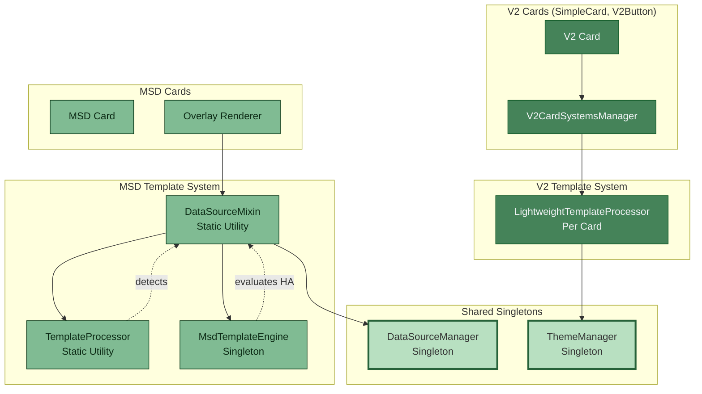

Excellent question! Let me do a comprehensive analysis of template processing across the codebase.Excellent question! Let me map out the template processing landscape - it's currently fragmented across multiple systems. Here's the complete analysis:

---

# Template Processing Architecture Analysis

## Current State: Multiple Template Systems

### 1. **MSD TemplateProcessor** (`src/msd/utils/TemplateProcessor.js`)

**Purpose**: **Template detection and parsing utility** (not actual evaluation)

**What it does**:
- ✅ Detects templates: `hasTemplates()`, `hasMSDTemplates()`, `hasHATemplates()`
- ✅ Extracts references: `extractReferences()` - parses `{datasource.key:format}`
- ✅ Extracts dependencies: `extractEntityDependencies()` - finds datasource/entity IDs
- ✅ Validates syntax: `validate()` - checks braces, format specs
- ✅ Caches parsed results for performance

**What it does NOT do**:
- ❌ Does NOT evaluate templates (no actual substitution)
- ❌ Does NOT access HASS data
- ❌ Does NOT resolve values

**Pattern**: Static utility class (no instances)

---

### 2. **MSD DataSourceMixin** (`src/msd/renderer/DataSourceMixin.js`)

**Purpose**: **Actual template evaluation and value resolution** for MSD overlays

**What it does**:
- ✅ Evaluates MSD templates: `{datasource}`, `{datasource.key}`, `{datasource:format}`
- ✅ Resolves DataSource values via DataSourceManager singleton
- ✅ Applies format specifications (`.2f`, `int`, etc.)
- ✅ Handles transformations/aggregations: `{temp.transformations.celsius}`
- ✅ Processes HA templates via MsdTemplateEngine: `{{states('sensor.temp')}}`
- ✅ Provides unified content resolution: `resolveContent()`

**Uses**:
- Uses `TemplateProcessor` for detection/parsing
- Uses `MsdTemplateEngine` for HA template evaluation
- Accesses `DataSourceManager` singleton for values

**Pattern**: Static utility mixin (no instances, used by overlay renderers)

---

### 3. **MsdTemplateEngine** (`src/msd/templates/MsdTemplateEngine.js`)

**Purpose**: **Home Assistant template evaluation** (`{{...}}` syntax)

**What it does**:
- ✅ Evaluates HA templates: `{{states('entity.id')}}`
- ✅ Supports HA template functions: `states()`, `state_attr()`, `is_state()`, etc.
- ✅ Caches compiled templates
- ✅ Tracks entity dependencies
- ✅ Provides safe evaluation context

**Pattern**: Singleton instance (one for MSD)

---

### 4. **V2 LightweightTemplateProcessor** (`src/base/LightweightTemplateProcessor.js`)

**Purpose**: **Template processing for V2 cards** (SimpleCard, V2Button, etc.)

**What it does**:
- ✅ Evaluates `[[[JavaScript]]]` syntax (button-card style)
- ✅ Token replacement: `{{entity.state}}`, `{{variables.color}}`
- ✅ Provides rich evaluation context (entity, hass, theme, variables)
- ✅ Supports recursive processing
- ✅ Safe JavaScript evaluation

**Pattern**: Instantiated per card via V2CardSystemsManager

---

## Architecture Diagram



---

## The Problem: Fragmentation

### Current Issues

1. **No Shared Foundation**
   - MSD has its own template system (TemplateProcessor + DataSourceMixin + MsdTemplateEngine)
   - V2 cards have their own system (LightweightTemplateProcessor)
   - SimpleCard has inline template handling
   - No common base

2. **Duplicated Logic**
   - Template detection in multiple places
   - Entity dependency extraction duplicated
   - Format specifications parsed in multiple ways

3. **Inconsistent Syntax**
   - MSD: `{datasource}`, `{datasource.key:format}`, `{{states('entity')}}`
   - V2: `[[[JavaScript]]]`, `{{token}}`
   - SimpleCard: Both patterns (tries to support button-card templates)

4. **DataSourceMixin is Misnamed**
   - It's not really a "mixin" (no class mixing involved)
   - It's a static utility for **template evaluation**, not just datasource access
   - Contains critical template processing logic but name doesn't reflect this

---

## Recommendation: Consolidation Strategy

### ✅ **Create Core Template System**

**Proposed Structure:**

```
src/core/templates/
├── TemplateDetector.js       # Detect template types (from MSD TemplateProcessor)
├── TemplateParser.js          # Parse references (from MSD TemplateProcessor)
├── TemplateEvaluator.js       # NEW: Base evaluator interface
├── MSDTemplateEvaluator.js    # MSD-style evaluation (from DataSourceMixin)
├── HATemplateEvaluator.js     # HA-style evaluation (from MsdTemplateEngine)
└── V2TemplateEvaluator.js     # V2-style evaluation (from LightweightTemplateProcessor)
```

---

## Detailed Refactor Plan

### Phase 1: Extract Core Detection/Parsing

**Move to Core:**

````javascript name=src/core/templates/TemplateDetector.js
/**
 * TemplateDetector - Unified template detection for all card types
 * 
 * Detects:
 * - MSD templates: {datasource}, {datasource.key:format}
 * - HA templates: {{states('entity')}}
 * - V2 templates: [[[JavaScript]]], {{token}}
 */
export class TemplateDetector {
  /**
   * Detect what types of templates are present
   * @returns {{ hasMSD: boolean, hasHA: boolean, hasV2: boolean }}
   */
  static detectTemplateTypes(content) {
    return {
      hasMSD: this.hasMSDTemplates(content),
      hasHA: this.hasHATemplates(content),
      hasV2JS: this.hasV2JavaScript(content),
      hasV2Token: this.hasV2Tokens(content)
    };
  }

  static hasMSDTemplates(content) {
    return /\{[^{][^}]+\}/.test(content);  // Single braces
  }

  static hasHATemplates(content) {
    return /\{\{[^}]+\}\}/.test(content);  // Double braces
  }

  static hasV2JavaScript(content) {
    return /\[\[\[[^\]]+\]\]\]/.test(content);  // Triple brackets
  }

  static hasV2Tokens(content) {
    return /\{\{[^}]+\}\}/.test(content);  // V2 also uses double braces for tokens
  }
}
````

````javascript name=src/core/templates/TemplateParser.js
/**
 * TemplateParser - Parse template references
 * 
 * Extracts structured information from template strings
 */
export class TemplateParser {
  /**
   * Parse MSD template reference
   * @example parseMSDReference('datasource.key:format')
   * @returns {{ source, path, format }}
   */
  static parseMSDReference(reference) {
    // Extract from current TemplateProcessor
    const [dataSourceRef, formatSpec] = reference.split(':');
    const parts = dataSourceRef.split('.');
    
    return {
      source: parts[0],
      path: parts.slice(1),
      format: formatSpec || null
    };
  }

  /**
   * Parse HA template
   * @example parseHATemplate('{{states("sensor.temp")}}')
   * @returns {{ expression, entities: [] }}
   */
  static parseHATemplate(template) {
    // Delegate to MsdTemplateEngine for now
    // Could be extracted later
  }

  /**
   * Parse V2 JavaScript template
   * @example parseV2JavaScript('[[[return entity.state]]]')
   * @returns {{ code, tokens: [] }}
   */
  static parseV2JavaScript(template) {
    const code = template.slice(3, -3);  // Remove [[[ ]]]
    const tokens = this._extractV2Tokens(code);
    return { code, tokens };
  }
}
````

---

### Phase 2: Create Evaluator Base Class

````javascript name=src/core/templates/TemplateEvaluator.js
/**
 * TemplateEvaluator - Base class for template evaluation
 * 
 * All template evaluators extend this and implement evaluate()
 */
export class TemplateEvaluator {
  constructor(context) {
    this.context = context;  // Shared context (hass, entities, theme, etc.)
  }

  /**
   * Evaluate template string
   * @abstract
   * @param {string} content - Template content
   * @returns {string} Evaluated content
   */
  evaluate(content) {
    throw new Error('Subclass must implement evaluate()');
  }

  /**
   * Get dependencies (entities/datasources)
   * @abstract
   * @param {string} content - Template content
   * @returns {Array<string>} Dependencies
   */
  getDependencies(content) {
    throw new Error('Subclass must implement getDependencies()');
  }
}
````

---

### Phase 3: Refactor Existing Systems

**MSD System:**

````javascript name=src/msd/templates/MSDTemplateEvaluator.js
import { TemplateEvaluator } from '../../core/templates/TemplateEvaluator.js';
import { TemplateParser } from '../../core/templates/TemplateParser.js';

/**
 * MSDTemplateEvaluator - Evaluates MSD {datasource} templates
 * 
 * Extracted from DataSourceMixin.processEnhancedTemplateStrings()
 */
export class MSDTemplateEvaluator extends TemplateEvaluator {
  constructor(dataSourceManager) {
    super({ dataSourceManager });
    this.dataSourceManager = dataSourceManager;
  }

  evaluate(content) {
    return content.replace(/\{([^}]+)\}/g, (match, reference) => {
      const { source, path, format } = TemplateParser.parseMSDReference(reference);
      
      const dataSource = this.dataSourceManager.getSource(source);
      if (!dataSource) return match;
      
      let value = dataSource.getCurrentData()?.value;
      
      // Apply path (transformations, aggregations)
      if (path.length > 0) {
        value = this._resolvePath(dataSource, path);
      }
      
      // Apply format
      if (format) {
        value = this._applyFormat(value, format);
      }
      
      return String(value);
    });
  }

  getDependencies(content) {
    const matches = content.matchAll(/\{([^}]+)\}/g);
    return Array.from(matches, m => TemplateParser.parseMSDReference(m[1]).source);
  }
}
````

**V2 System:**

````javascript name=src/base/V2TemplateEvaluator.js
import { TemplateEvaluator } from '../core/templates/TemplateEvaluator.js';
import { TemplateParser } from '../core/templates/TemplateParser.js';

/**
 * V2TemplateEvaluator - Evaluates V2 [[[JavaScript]]] and {{token}} templates
 * 
 * Extracted from LightweightTemplateProcessor
 */
export class V2TemplateEvaluator extends TemplateEvaluator {
  constructor(context) {
    super(context);  // context = { entity, hass, theme, variables, config }
  }

  evaluate(content) {
    // Process [[[JavaScript]]]
    content = this._evaluateJavaScript(content);
    
    // Process {{tokens}}
    content = this._evaluateTokens(content);
    
    return content;
  }

  _evaluateJavaScript(content) {
    return content.replace(/\[\[\[(.*?)\]\]\]/gs, (match, code) => {
      const { code: cleanCode } = TemplateParser.parseV2JavaScript(match);
      return this._safeEval(cleanCode);
    });
  }

  _evaluateTokens(content) {
    return content.replace(/\{\{([^}]+)\}\}/g, (match, token) => {
      return this._resolveToken(token.trim());
    });
  }

  _safeEval(code) {
    // Safe evaluation with context
    const { entity, hass, theme, variables, config } = this.context;
    
    try {
      const fn = new Function('entity', 'hass', 'theme', 'variables', 'config', `return ${code}`);
      return fn(entity, hass, theme, variables, config);
    } catch (error) {
      return `[Error: ${error.message}]`;
    }
  }
}
````

---

### Phase 4: Rename DataSourceMixin

**Current Name**: `DataSourceMixin`  
**New Name**: `MSDContentResolver` or `MSDTemplateResolver`

**Rationale**:
- It's not a mixin (no class mixing)
- It's primarily about template evaluation, not just datasource access
- Name should reflect its actual purpose

````javascript name=src/msd/renderer/MSDContentResolver.js
/**
 * MSDContentResolver - Content and template resolution for MSD overlays
 * 
 * Provides:
 * - Content resolution from various sources
 * - MSD template evaluation via MSDTemplateEvaluator
 * - HA template evaluation via HATemplateEvaluator
 * - Format application and value formatting
 */
export class MSDContentResolver {
  /**
   * Resolve content from overlay configuration
   */
  static resolveContent(source, style, rendererName) {
    // Unified resolution using core template system
  }

  /**
   * Evaluate templates in content
   */
  static evaluateTemplates(content, rendererName) {
    const detector = new TemplateDetector();
    const types = detector.detectTemplateTypes(content);
    
    if (types.hasMSD) {
      const evaluator = new MSDTemplateEvaluator(this._getDataSourceManager());
      content = evaluator.evaluate(content);
    }
    
    if (types.hasHA) {
      const evaluator = new HATemplateEvaluator(this._getHass());
      content = evaluator.evaluate(content);
    }
    
    return content;
  }
}
````

---

## Summary & Recommendations

### Current State Problems

| Issue | Description |
|-------|-------------|
| **Fragmentation** | 4 different template systems across MSD/V2/SimpleCard |
| **Duplication** | Detection, parsing, evaluation logic duplicated |
| **Inconsistency** | Different syntax, different evaluation contexts |
| **Misnamed** | DataSourceMixin is really a template evaluator |
| **No Abstraction** | No shared base for template processing |

### Proposed Solution

| Phase | Action | Benefit |
|-------|--------|---------|
| **1** | Extract TemplateDetector + TemplateParser to Core | Unified detection/parsing |
| **2** | Create TemplateEvaluator base class | Extensible abstraction |
| **3** | Refactor MSD → MSDTemplateEvaluator | Clean separation |
| **4** | Refactor V2 → V2TemplateEvaluator | Consistent pattern |
| **5** | Rename DataSourceMixin → MSDContentResolver | Accurate naming |

### Benefits

✅ **Unified Architecture** - All template systems follow same pattern  
✅ **Shared Detection** - One place to detect template types  
✅ **Extensible** - Easy to add new template types  
✅ **Testable** - Clear separation of concerns  
✅ **Maintainable** - Reduced duplication  
✅ **Clear Naming** - Components named for what they do  

---

### Priority Recommendation

**🔥 HIGH PRIORITY - This should be done soon**

**Why**:
1. Currently causing confusion (DataSourceMixin name is misleading)
2. Blocking future card development (no clear pattern to follow)
3. SimpleCard/V2 migration needs unified template system
4. Will prevent future technical debt accumulation

**Effort**: Medium (2-3 days)  
**Risk**: Low (mostly code movement, behavior stays same)  
**Impact**: High (cleaner architecture for all future work)

Would you like me to create the detailed refactored files for this consolidation?
