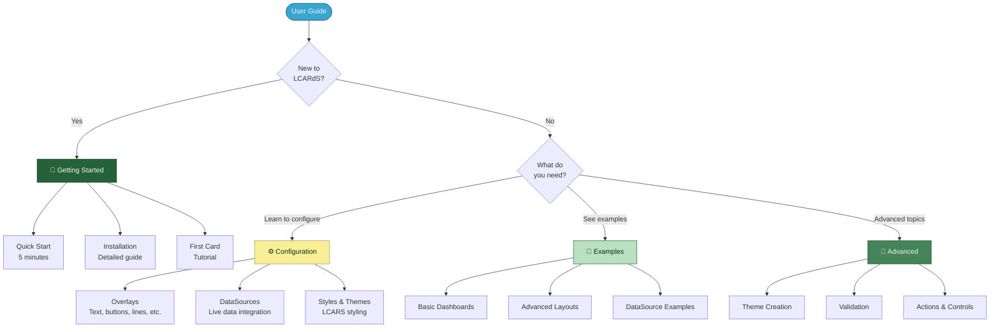
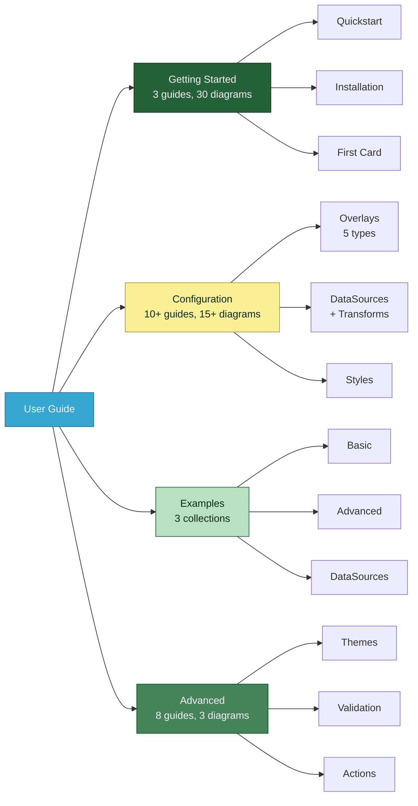
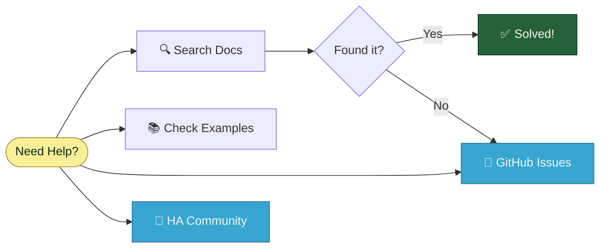

# LCARdS User Guide

> **Complete guide to creating LCARS dashboards**
> Everything you need to build beautiful, functional LCARS interfaces in Home Assistant.

---

## 🎯 Quick Navigation

---

## 🚀 Getting Started

**New to LCARdS?** Start here:

### Quick Paths

| If you want to... | Go here |
|-------------------|---------|
| ⚡ **Get started fast** | [Quick Start](getting-started/quickstart.md) - 5 minute setup |
| 📦 **Install LCARdS** | [Installation Guide](getting-started/installation.md) - HACS or manual |
| 🎓 **Learn step-by-step** | [First Card Tutorial](getting-started/first-card.md) - Build your first interface |

### Getting Started Guides

1. **[Quick Start Guide](getting-started/quickstart.md)** ⚡
   - 5-minute installation and first card
   - Prerequisites and dependencies
   - Troubleshooting quick fixes
   - **7 diagrams** showing the process

2. **[Installation Guide](getting-started/installation.md)** 📦
   - Complete HACS and manual installation
   - All dependencies explained
   - Theme setup and configuration
   - File structure overview
   - **12 diagrams** with detailed flows

3. **[First Card Tutorial](getting-started/first-card.md)** 🎓
   - Step-by-step card creation
   - Progressive enhancement approach
   - Real entity integration
   - Color and styling basics
   - **11 diagrams** guiding each step

---

## ⚙️ Configuration

Learn how to configure every aspect of LCARdS.

### Card Types

**Native LCARdS cards** for standalone use:

| Card Type | Description | Guide |
|-----------|-------------|-------|
| 🔘 **[Simple Button](configuration/simple-button-card.md)** | SVG-based button card | Entity binding, state-aware styling, computed tokens |

**Testing Guides:**
- **[Simple Button Testing](testing/simple-button-testing.md)** - 20 systematic tests with configs

### Overlay System

**Overlays** are visual elements on your dashboard:

| Overlay Type | Description | Guide |
|--------------|-------------|-------|
| 📝 **[Text](configuration/overlays/text-overlay.md)** | Display dynamic text and values | Labels, sensors, status |
| 🔘 **[Button](configuration/overlays/button-overlay.md)** | Interactive controls | Toggle, navigate, actions |
| ➖ **[Line](configuration/overlays/line-overlay.md)** | Connect overlays visually | Flowcharts, diagrams |
| 📊 **[Status Grid](configuration/overlays/status-grid-overlay.md)** | Multi-cell status display | Organized data grids |
| 📈 **[ApexCharts](configuration/overlays/apexcharts-overlay.md)** | Advanced charts | 15 chart types |

**[Overlay System Guide](configuration/overlays/README.md)** - Complete overview with decision tree

### Data Integration

| Topic | Description | Guide |
|-------|-------------|-------|
| 📡 **[DataSources](configuration/datasources.md)** | Connect to Home Assistant entities | Real-time subscriptions, history |
| 🔄 **[Transformations](configuration/datasource-transformations.md)** | Process data | 50+ conversions, scaling, smoothing |
| 📊 **[Aggregations](configuration/datasource-aggregations.md)** | Statistical analysis | Averages, trends, statistics |
| 🧮 **[Computed Sources](configuration/computed-sources.md)** | Multi-source calculations | Formulas and derived values |

**DataSources Guide** includes:
- **5 diagrams** showing data flow, lifecycle, and buffer system
- Real-time update mechanics
- Performance tuning guide

### Styling & Appearance

| Topic | Guide |
|-------|-------|
| 🎨 **Styles & Themes** | [Style configuration](configuration/styles-and-themes.md) |
| 📦 **Packs** | [Reusable configuration](configuration/packs.md) |
| 🎬 **Animations** | [Anime.js integration](configuration/animations.md) |

---

## 🎨 Examples

Copy-paste ready configurations:

### Example Collections

1. **[Basic Dashboard](examples/basic-dashboard.md)**
   - Simple starter dashboard
   - Header, buttons, and text
   - Good for learning

2. **[Advanced Layouts](examples/advanced-layouts.md)**
   - Complex multi-panel designs
   - Line connections
   - LCARS frames and elbows

3. **[DataSource Examples](examples/datasource-examples.md)** 📊
   - Temperature monitoring with transformations
   - Power/energy dashboard with aggregations
   - Environmental sensors with trends
   - **1 diagram** showing transformation flow
   - Complete copy-paste configs

---

## 🔧 Advanced Topics

Deep dives into LCARdS features:

### System Understanding

| Topic | Description | Guide |
|-------|-------------|-------|
| 🎨 **[Theme Creation](advanced/theme_creation_tutorial.md)** | Create custom themes | Step-by-step with **2 diagrams** |
| ⚖️ **[Configuration Layers](advanced/configuration-layers.md)** | Style priority & resolution | **1 diagram** showing priority |
| 🎯 **[Style Priority](advanced/style-priority.md)** | How styles resolve | Presets vs explicit styles |
| ✅ **[Validation](advanced/validation_guide.md)** | Config validation system | Error prevention |

### Integration Features

| Topic | Guide |
|-------|-------|
| 🎮 **[MSD Controls](advanced/msd-controls.md)** | Control system integration |
| ⚡ **[MSD Actions](advanced/msd-actions.md)** | Action system & flows |
| 🔑 **[Token Reference](advanced/token_reference_card.md)** | Theme token reference |

---

## 📚 Complete Documentation Index

### By Topic

### All Guides by Directory

#### 🚀 Getting Started (3 files, 30 diagrams)
- [quickstart.md](getting-started/quickstart.md) - 5-minute setup
- [installation.md](getting-started/installation.md) - Complete installation
- [first-card.md](getting-started/first-card.md) - Tutorial

#### ⚙️ Configuration (10+ files, 15+ diagrams)

**Overlays:**
- [README.md](configuration/overlays/README.md) - System overview (1 diagram)
- [text-overlay.md](configuration/overlays/text-overlay.md) - Text configuration
- [button-overlay.md](configuration/overlays/button-overlay.md) - Buttons (2 diagrams)
- [line-overlay.md](configuration/overlays/line-overlay.md) - Lines (3 diagrams)
- [status-grid-overlay.md](configuration/overlays/status-grid-overlay.md) - Status grids
- [apexcharts-overlay.md](configuration/overlays/apexcharts-overlay.md) - Charts

**Data Integration:**
- [datasources.md](configuration/datasources.md) - Main guide (5 diagrams)
- [datasource-transformations.md](configuration/datasource-transformations.md) - Transformations
- [datasource-aggregations.md](configuration/datasource-aggregations.md) - Aggregations
- [computed-sources.md](configuration/computed-sources.md) - Computed sources

**Styling:**
- [styles-and-themes.md](configuration/styles-and-themes.md) - Style guide
- [packs.md](configuration/packs.md) - Configuration packs
- [animations.md](configuration/animations.md) - Anime.js

#### 🎨 Examples (3 files, 1 diagram)
- [basic-dashboard.md](examples/basic-dashboard.md) - Starter dashboard
- [advanced-layouts.md](examples/advanced-layouts.md) - Complex layouts
- [datasource-examples.md](examples/datasource-examples.md) - Data examples (1 diagram)

#### 🔧 Advanced (8 files, 3 diagrams)
- [README.md](advanced/README.md) - Advanced topics hub
- [theme_creation_tutorial.md](advanced/theme_creation_tutorial.md) - Themes (2 diagrams)
- [configuration-layers.md](advanced/configuration-layers.md) - Layers (1 diagram)
- [style-priority.md](advanced/style-priority.md) - Style resolution
- [validation_guide.md](advanced/validation_guide.md) - Validation
- [msd-controls.md](advanced/msd-controls.md) - Controls
- [msd-actions.md](advanced/msd-actions.md) - Actions
- [token_reference_card.md](advanced/token_reference_card.md) - Tokens

---

## 📊 Documentation Statistics

### User Guide Coverage

| Section | Files | Diagrams | Status |
|---------|-------|----------|--------|
| **Getting Started** | 3 | 30 | ✅ Complete |
| **Configuration** | 10+ | 15+ | ✅ Complete |
| **Examples** | 3 | 1 | ✅ Complete |
| **Advanced** | 8 | 3 | ✅ Complete |
| **Total** | **24+** | **49+** | ✅ Comprehensive |

### Diagram Types Used

- 🔄 **Flow Diagrams** - Process flows, lifecycles
- 🎯 **Decision Trees** - "Which option?" guides
- 📊 **Sequence Diagrams** - Interaction flows
- 🏗️ **Architecture Diagrams** - System structure
- 🎨 **Visual Examples** - Before/after, layouts

---

## 🆘 Getting Help

### Quick Troubleshooting

| Problem | Solution |
|---------|----------|
| Card not loading | Check [Installation Guide](getting-started/installation.md#troubleshooting) |
| Entity not updating | See [DataSources Guide](configuration/datasources.md#troubleshooting) |
| Style not applying | Review [Style Priority](advanced/style-priority.md) |
| YAML errors | Check [Validation Guide](advanced/validation_guide.md) |

### Help Resources

**Resources:**
- 📖 **This User Guide** - Comprehensive documentation
- 🏗️ **[Architecture Docs](../architecture/)** - System design (for developers)
- 🐛 **[GitHub Issues](https://github.com/snootched/cb-lcars/issues)** - Bug reports, questions
- 💬 **[HA Community](https://community.home-assistant.io/)** - General Home Assistant help

---

## 🚀 Your LCARS Journey

**Recommended Path:**
1. ✅ [Quick Start](getting-started/quickstart.md) - Get up and running
2. 📖 [First Card Tutorial](getting-started/first-card.md) - Learn the basics
3. 🎨 [Example Gallery](examples/) - See what's possible
4. ⚙️ [Configuration Guides](configuration/) - Master the system
5. 🔧 [Advanced Topics](advanced/) - Become an expert

---

**Welcome to LCARdS!** 🖖

Start your journey with the [Quick Start Guide](getting-started/quickstart.md) and build your own LCARS interface today!

---

**Navigation:**
- 🏠 [Main Documentation](../README.md)
- 🏗️ [Architecture Docs](../architecture/)
- 📋 [Proposals](../proposals/)
- 🔧 [Maintenance](../maintenance/)
