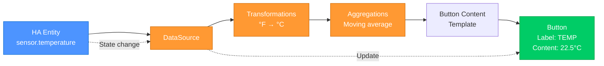
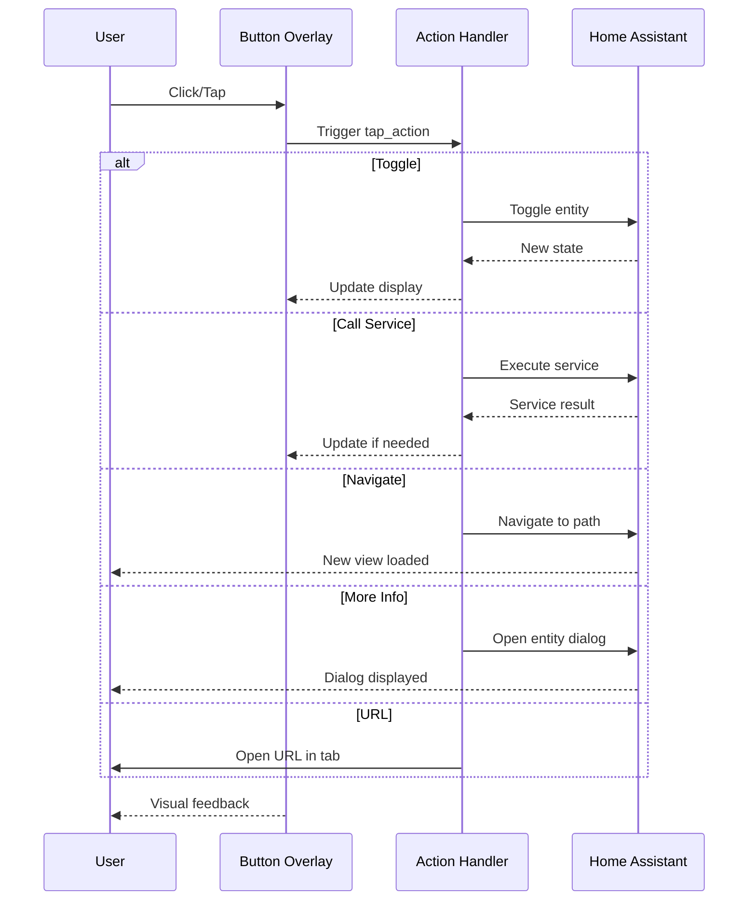
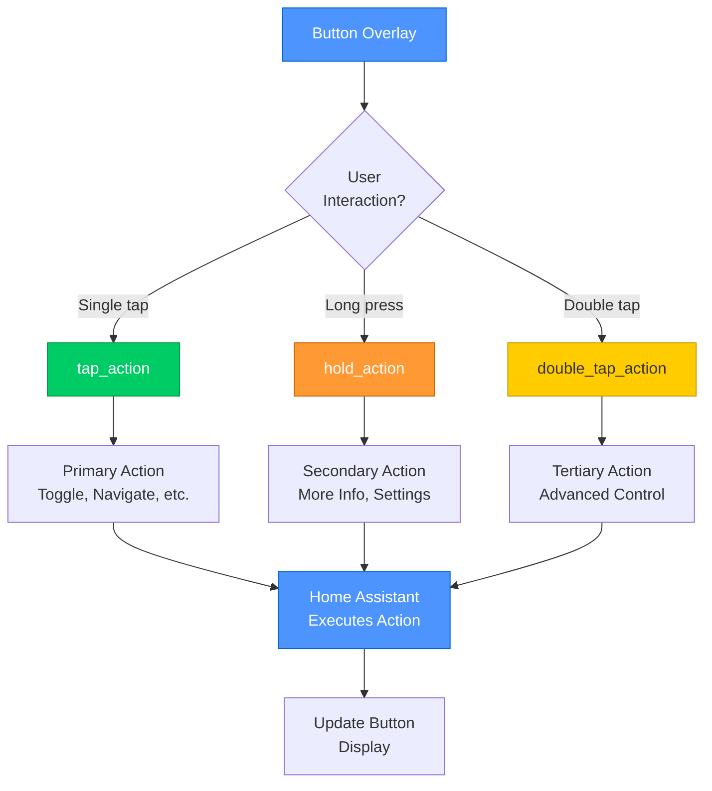

# Button Overlay Configuration Guide

> **Interactive buttons with full Home Assistant action support**
> Create clickable controls with dynamic content, LCARS styling, and real-time datasource integration.

---

## 📋 Table of Contents

1. [Overview](#overview)
2. [Quick Start](#quick-start)
3. [Core Configuration](#core-configuration)
4. [DataSource Integration](#datasource-integration)
5. [Interactive Actions](#interactive-actions)
6. [Styling & Appearance](#styling--appearance)
7. [Text Layout & Positioning](#text-layout--positioning)
8. [LCARS Features](#lcars-features)
9. [Hover & Animation](#hover--animation)
10. [Complete Property Reference](#complete-property-reference)
11. [Real-World Examples](#real-world-examples)
12. [Troubleshooting](#troubleshooting)

---

## Overview

The **Button Overlay** is the primary interactive control element in LCARdS, providing sophisticated button capabilities with:

✅ **Interactive actions** - Full Home Assistant action support (toggle, call-service, navigate, etc.)
✅ **Real-time updates** - Dynamic content from datasources and entities
✅ **Template integration** - Access datasource transformations and aggregations
✅ **LCARS styling** - Authentic LCARS brackets, corners, and status indicators
✅ **Flexible text layout** - Multiple positioning modes including LCARdS presets
✅ **Visual effects** - Gradients, glows, shadows, and hover animations
✅ **Responsive scaling** - ViewBox-aware sizing with MSD Defaults integration
✅ **Performance optimized** - Immediate action attachment for reliable interaction

### When to Use Button Overlays

- **Entity controls** - Toggle switches, lights, climate controls
- **Navigation buttons** - Switch between dashboards or views
- **Service triggers** - Execute Home Assistant services or scripts
- **Status displays** - Show sensor values with tap-to-details
- **Action panels** - Multi-action controls (tap, hold, double-tap)

---

## Quick Start

### Minimal Configuration

The absolute minimum needed for a button:

```yaml
overlays:
  - id: simple_button
    type: button
    position: [100, 50]
    size: [120, 40]
    label: "ENGAGE"
    tap_action:
      action: toggle
      entity: switch.warp_drive
```

**Result:** Interactive button at (100, 50) that toggles a switch.

### With DataSource

Display real-time sensor data:

```yaml
data_sources:
  temperature:
    type: entity
    entity: sensor.reactor_temperature

overlays:
  - id: temp_button
    type: button
    position: [100, 50]
    size: [140, 60]
    label: "REACTOR"
    content: "{temperature:.1f}°C"
    tap_action:
      action: more-info
      entity: sensor.reactor_temperature
    style:
      color: var(--lcars-orange)
```

**Result:** Button showing "REACTOR" with live temperature that opens more-info on tap.

### LCARS Styled

Create an authentic LCARS button:

```yaml
overlays:
  - id: lcars_button
    type: button
    position: [100, 50]
    size: [160, 70]
    label: "PLASMA RELAY"
    content: "ONLINE"
    tap_action:
      action: toggle
      entity: switch.plasma_relay
    style:
      color: var(--lcars-blue)
      lcars_corners: true
      bracket_style: true
      status_indicator: var(--lcars-green)
      font_family: "Antonio, sans-serif"
```

**Result:** LCARS-styled button with cut corners, brackets, and status indicator.

---

## Core Configuration

### Required Properties

Every button overlay must have these properties:

| Property | Type | Description | Example |
|----------|------|-------------|---------|
| `id` | string | Unique identifier | `"warp_button"` |
| `type` | string | Must be `"button"` | `"button"` |
| `position` | [x, y] | Top-left corner coordinates | `[100, 50]` |
| `size` | [width, height] | Button dimensions | `[140, 60]` |

### Optional Core Properties

| Property | Type | Description | Default |
|----------|------|-------------|---------|
| `label` | string | Top/label text | `""` |
| `content` | string | Bottom/value text | `""` |
| `source` | string | DataSource reference | `null` |

### Content Sources

You have **three ways** to specify button content:

#### 1. Static Content

```yaml
label: "WARP DRIVE"
content: "ENGAGED"
```

Use for fixed text that never changes.

#### 2. Template Strings (Recommended)

```yaml
label: "TEMPERATURE"
content: "{temperature:.1f}°C"
```

Access datasource values with formatting:
- `{datasource_name}` - Raw value
- `{datasource_name:.1f}` - 1 decimal place
- `{datasource_name.transformations.key:.2f}` - Access transformations
- `{datasource_name.aggregations.avg.value:.0f}` - Access aggregations

#### 3. DataSource Reference

```yaml
source: temperature_sensor
```

Automatically updates when datasource changes.

### Basic Example

```yaml
overlays:
  - id: power_button
    type: button
    position: [100, 50]
    size: [140, 60]
    label: "MAIN POWER"
    content: "ONLINE"
    tap_action:
      action: toggle
      entity: switch.main_power
    style:
      color: var(--lcars-blue)
      font_size: 16
```

---

## DataSource Integration

Button overlays have **deep integration** with the datasource system for real-time content updates.

### DataSource → Button Flow



**Real-time Updates:**
- 🔄 Button automatically updates when datasource emits new values
- ⚡ No polling - event-driven updates
- 📊 Access raw values, transformations, or aggregations
- 🎨 Dynamic styling based on data values

### Direct Value Display

Show a datasource's current value:

```yaml
data_sources:
  reactor_temp:
    type: entity
    entity: sensor.reactor_temperature

overlays:
  - id: temp_button
    type: button
    position: [100, 50]
    size: [140, 60]
    source: reactor_temp
    label: "REACTOR TEMP"
    content: "{reactor_temp:.0f}°C"
    tap_action:
      action: more-info
      entity: sensor.reactor_temperature
    style:
      color: var(--lcars-orange)
```

### Transformation Access

Display transformed values:

```yaml
data_sources:
  outdoor_temp:
    type: entity
    entity: sensor.outdoor_temperature_f
    transformations:
      - type: unit_conversion
        from: "°F"
        to: "°C"
        key: "celsius"
      - type: smooth
        method: "exponential"
        alpha: 0.3
        key: "smoothed"

overlays:
  - id: outdoor_button
    type: button
    position: [100, 50]
    size: [140, 60]
    label: "OUTDOOR"
    content: "{outdoor_temp.transformations.celsius:.1f}°C"
    tap_action:
      action: more-info
      entity: sensor.outdoor_temperature_f
```

### Aggregation Display

Show aggregated statistics:

```yaml
data_sources:
  power:
    type: entity
    entity: sensor.house_power
    transformations:
      - type: unit_conversion
        conversion: "w_to_kw"
        key: "kilowatts"
    aggregations:
      moving_average:
        window: "15m"
        key: "avg_15m"

overlays:
  - id: power_button
    type: button
    position: [100, 50]
    size: [160, 80]
    label: "POWER"
    content: "{power.aggregations.avg_15m.value:.2f} kW"
    tap_action:
      action: navigate
      navigation_path: /lovelace/energy
    style:
      color: var(--lcars-blue)
      font_size: 18
```

### Conditional Content

Use conditional logic in templates:

```yaml
data_sources:
  system_status:
    type: entity
    entity: sensor.system_status

overlays:
  - id: status_button
    type: button
    position: [100, 50]
    size: [140, 60]
    label: "SYSTEM"
    # Conditional content based on value
    content: >
      {system_status == 'critical' ? '⚠️ ALERT' :
       system_status == 'warning' ? '⚡ CAUTION' :
       '✓ NORMAL'}
    tap_action:
      action: more-info
      entity: sensor.system_status
```

### Multi-Source Content

Combine multiple datasources:

```yaml
data_sources:
  temp:
    type: entity
    entity: sensor.temperature
  humidity:
    type: entity
    entity: sensor.humidity

overlays:
  - id: climate_button
    type: button
    position: [100, 50]
    size: [160, 80]
    label: "CLIMATE"
    content: "{temp:.1f}°C / {humidity:.0f}%"
    tap_action:
      action: navigate
      navigation_path: /lovelace/climate
```

---

## Interactive Actions

Button overlays provide **comprehensive Home Assistant action support** with immediate attachment for reliable interaction.

### Action Flow



### Multi-Action System



### Action Types

Buttons support three interaction types:

| Action Type | Trigger | Common Uses |
|-------------|---------|-------------|
| `tap_action` | Single click/tap | Primary action (toggle, navigate, more-info) |
| `hold_action` | Long press | Secondary action (settings, context menu) |
| `double_tap_action` | Double click/tap | Tertiary action (advanced controls) |

### Toggle Entity

The most common action - toggle a switch or light:

```yaml
overlays:
  - id: light_button
    type: button
    position: [100, 50]
    size: [140, 60]
    label: "LIGHTS"
    content: "LIVING ROOM"
    tap_action:
      action: toggle
      entity: light.living_room
    style:
      color: var(--lcars-yellow)
```

### More Info Dialog

Show entity details:

```yaml
overlays:
  - id: sensor_button
    type: button
    position: [100, 50]
    size: [140, 60]
    label: "TEMPERATURE"
    content: "{temperature:.1f}°C"
    tap_action:
      action: more-info
      entity: sensor.temperature
```

### Call Service

Execute any Home Assistant service:

```yaml
overlays:
  - id: climate_button
    type: button
    position: [100, 50]
    size: [140, 60]
    label: "CLIMATE"
    content: "SET 22°C"
    tap_action:
      action: call-service
      service: climate.set_temperature
      service_data:
        entity_id: climate.living_room
        temperature: 22
```

### Navigation

Navigate to different dashboards:

```yaml
overlays:
  - id: nav_button
    type: button
    position: [100, 50]
    size: [140, 60]
    label: "ENGINEERING"
    content: "GO →"
    tap_action:
      action: navigate
      navigation_path: /lovelace/engineering
    style:
      color: var(--lcars-orange)
```

### URL Actions

Open external links:

```yaml
overlays:
  - id: link_button
    type: button
    position: [100, 50]
    size: [140, 60]
    label: "DOCUMENTATION"
    content: "OPEN →"
    tap_action:
      action: url
      url_path: https://github.com/snootched/cb-lcars
      new_tab: true
```

### Multiple Actions

Combine tap, hold, and double-tap:

```yaml
overlays:
  - id: multi_action_button
    type: button
    position: [100, 50]
    size: [160, 70]
    label: "CLIMATE"
    content: "{temperature:.1f}°C"

    # Tap: Show more info
    tap_action:
      action: more-info
      entity: sensor.temperature

    # Hold: Open climate controls
    hold_action:
      action: navigate
      navigation_path: /lovelace/climate

    # Double-tap: Set temperature
    double_tap_action:
      action: call-service
      service: climate.set_temperature
      service_data:
        entity_id: climate.living_room
        temperature: 22
```

### Confirmation Dialogs

Add confirmation for critical actions:

```yaml
overlays:
  - id: restart_button
    type: button
    position: [100, 50]
    size: [140, 60]
    label: "SYSTEM"
    content: "RESTART"
    tap_action:
      action: call-service
      service: homeassistant.restart
      confirmation:
        text: "Are you sure you want to restart Home Assistant?"
    style:
      color: var(--lcars-red)
```

### Template Actions

Use Home Assistant templates in actions:

```yaml
overlays:
  - id: dynamic_button
    type: button
    position: [100, 50]
    size: [140, 60]
    label: "ADJUST"
    content: "+1°C"
    tap_action:
      action: call-service
      service: climate.set_temperature
      service_data:
        entity_id: climate.living_room
        # Template: Set to current + 1
        temperature: "{{ states('sensor.living_room_temperature') | float + 1 }}"
```

### Action Best Practices

✅ **DO:**
- Use tap for primary actions (most discoverable)
- Use hold for secondary/settings actions
- Provide visual feedback (automatic cursor changes)
- Test on both desktop and mobile devices
- Add confirmations for destructive actions

❌ **DON'T:**
- Don't hide critical actions behind double-tap (harder to discover)
- Don't use complex templates in actions (keep them simple)
- Don't forget to test hold actions on touch devices

---

## Styling & Appearance

Button overlays provide comprehensive styling options for creating beautiful, functional controls.

### Background & Colors

#### Solid Colors

```yaml
style:
  color: var(--lcars-blue)      # Background color
  opacity: 1.0                  # Overall transparency (0-1)
```

**Common LCARS colors:**
- `var(--lcars-blue)` - Standard blue
- `var(--lcars-orange)` - Alert orange
- `var(--lcars-red)` - Critical red
- `var(--lcars-yellow)` - Caution yellow
- `var(--lcars-green)` - Success green
- `var(--lcars-purple)` - Accent purple

#### Gradient Backgrounds

Create gradient buttons:

```yaml
style:
  gradient:
    type: linear
    direction: vertical        # horizontal, vertical, diagonal
    stops:
      - offset: "0%"
        color: var(--lcars-blue)
      - offset: "100%"
        color: var(--lcars-cyan)
```

### Borders & Corners

#### Basic Borders

```yaml
style:
  border_radius: 12            # Corner radius (default: 8)
  border_color: var(--lcars-gray)
  border_width: 2              # Border thickness
```

#### Individual Border Sides

```yaml
style:
  border_top: 3               # Top border
  border_right: 2             # Right border
  border_bottom: 1            # Bottom border
  border_left: 2              # Left border
```

#### Individual Corner Radius

```yaml
style:
  border_radius_top_left: 0
  border_radius_top_right: 12
  border_radius_bottom_right: 12
  border_radius_bottom_left: 0
```

### Text Styling

#### Basic Text Properties

```yaml
style:
  # Text colors
  label_color: var(--lcars-white)    # Label text color
  value_color: var(--lcars-cyan)     # Content text color

  # Font properties
  font_size: 16                      # Global font size
  font_family: "Antonio, sans-serif" # Font family
  font_weight: bold                  # Font weight
```

#### Individual Text Sizing

```yaml
style:
  label_font_size: 18          # Label-specific size
  value_font_size: 16          # Content-specific size
```

#### Scalable Font Sizing

For responsive designs:

```yaml
style:
  label_font_size:
    value: 18
    scale: viewbox             # Scale with viewport
    unit: px

  value_font_size:
    value: 16
    scale: viewbox
    unit: px
```

### Visual Effects

#### Glow Effect

Create glowing buttons:

```yaml
style:
  glow:
    color: var(--lcars-blue)
    blur: 4                   # Glow radius
    intensity: 0.8            # Glow strength (0-1)
```

#### Drop Shadow

Add depth with shadows:

```yaml
style:
  shadow:
    offset_x: 2               # Horizontal offset
    offset_y: 2               # Vertical offset
    blur: 4                   # Shadow blur
    color: "rgba(0,0,0,0.5)"  # Shadow color
```

#### Blur Effect

Useful for disabled states:

```yaml
style:
  blur:
    radius: 2                 # Blur amount
```

### Complete Styling Example

```yaml
overlays:
  - id: styled_button
    type: button
    position: [100, 50]
    size: [180, 80]
    label: "WARP CORE"
    content: "ONLINE"
    tap_action:
      action: toggle
      entity: switch.warp_core
    style:
      # Background
      color: var(--lcars-blue)
      opacity: 0.95

      # Borders
      border_radius: 12
      border_color: var(--lcars-cyan)
      border_width: 2

      # Text
      label_color: var(--lcars-white)
      value_color: var(--lcars-yellow)
      label_font_size: 20
      value_font_size: 18
      font_family: "Antonio, sans-serif"
      font_weight: bold

      # Effects
      glow:
        color: var(--lcars-blue)
        blur: 6
        intensity: 0.7

      shadow:
        offset_x: 2
        offset_y: 2
        blur: 4
        color: "rgba(0,0,0,0.6)"
```

---

## Text Layout & Positioning

Button overlays provide flexible text positioning to create custom layouts and recreate LCARdS button styles.

### Show/Hide Text Elements

Control which text elements display:

```yaml
style:
  show_labels: true           # Show label text (default: true)
  show_values: true           # Show content text (default: true)
```

### LCARdS Preset Styles

Quickly recreate LCARdS button card layouts:

```yaml
style:
  # Lozenge: label top-left, content bottom-right
  lcars_button_preset: "lozenge"
```

**Available presets:**
- `"lozenge"` - Label top-left, content bottom-right (classic LCARS)
- `"bullet"` - Label left, content right (side by side)
- `"corner"` - Both elements in corner, stacked
- `"badge"` - Label top-center, content centered

### Predefined Positions

Use named positions for consistent placement:

```yaml
style:
  label_position: "top-left"       # Label position
  value_position: "bottom-right"   # Content position
```

**Available positions:**
- `center`, `center-top`, `center-bottom`
- `top-left`, `top-right`, `bottom-left`, `bottom-right`
- `left`, `right`, `top`, `bottom`

### Custom Position Objects

Define precise positioning:

```yaml
style:
  label_position:
    x: "15%"                  # X position (% or px)
    y: "25%"                  # Y position (% or px)
    anchor: "start"           # Text anchor: start, middle, end
    baseline: "hanging"       # Baseline: hanging, middle, baseline

  value_position:
    x: "85%"
    y: "75%"
    anchor: "end"
    baseline: "baseline"
```

### Layout Modes

Control overall text arrangement:

```yaml
style:
  text_layout: "stacked"      # stacked, side-by-side, custom
  text_alignment: "center"    # top, center, bottom
  text_justify: "center"      # left, center, right
```

### Spacing & Padding

Control text spacing:

```yaml
style:
  text_padding: 8             # Padding from button edges
  text_margin: 2              # Space between label and content
```

**Note:** Padding automatically adjusts for rounded corners!

### Complete Layout Example

```yaml
overlays:
  - id: custom_layout_button
    type: button
    position: [100, 50]
    size: [200, 100]
    label: "REACTOR STATUS"
    content: "NOMINAL"

    style:
      # Use lozenge preset for classic LCARS look
      lcars_button_preset: "lozenge"

      # Or use custom positioning
      label_position: "top-left"
      value_position: "bottom-right"

      # Spacing
      text_padding: 12
      text_margin: 4

      # Text styling
      label_font_size: 14
      value_font_size: 20
      label_color: var(--lcars-white)
      value_color: var(--lcars-green)
```

---

## LCARS Features

Add authentic LCARS visual elements to your buttons.

### LCARS Corners

Add characteristic LCARS cut corners:

```yaml
style:
  lcars_corners: true          # Enable cut corners
  lcars_corner_size: 8         # Corner cut size (default: 8)
```

### LCARS Brackets

Add decorative brackets around buttons:

```yaml
style:
  bracket_style: true                    # Enable brackets
  bracket_color: var(--lcars-orange)     # Bracket color
  bracket_width: 2                       # Line thickness
  bracket_gap: 4                         # Distance from button
  bracket_extension: 12                  # Arm length
  bracket_opacity: 1.0                   # Transparency
```

**Advanced bracket control:**

```yaml
style:
  bracket_corners: "both"      # both, top, bottom
  bracket_sides: "both"        # both, left, right
```

### Status Indicators

Add status dots to indicate state:

```yaml
style:
  status_indicator: var(--lcars-green)   # Enable with color
  status_indicator_size: 6               # Dot size
  status_indicator_position: "top-right" # Position
```

**Available positions:**
- `top-left`, `top-right`
- `bottom-left`, `bottom-right`
- `left`, `right`, `top`, `bottom`

### Complete LCARS Example

```yaml
overlays:
  - id: full_lcars_button
    type: button
    position: [100, 50]
    size: [180, 80]
    label: "PLASMA RELAY"
    content: "ACTIVE"

    tap_action:
      action: toggle
      entity: switch.plasma_relay

    style:
      # Core LCARS styling
      color: var(--lcars-blue)
      font_family: "Antonio, sans-serif"

      # LCARS corners
      lcars_corners: true
      lcars_corner_size: 10

      # LCARS brackets
      bracket_style: true
      bracket_color: var(--lcars-orange)
      bracket_width: 2
      bracket_gap: 6
      bracket_extension: 15

      # Status indicator
      status_indicator: var(--lcars-green)
      status_indicator_position: "top-right"
      status_indicator_size: 8

      # Text layout (lozenge style)
      lcars_button_preset: "lozenge"
      label_font_size: 16
      value_font_size: 20
```

---

## Hover & Animation

Add interactivity and motion to your buttons.

### Hover Effects

Enable hover state changes:

```yaml
style:
  hover_enabled: true                 # Enable hover (default: true)
  hover_color: var(--lcars-yellow)    # Hover background color
  hover_scale: 1.05                   # Scale factor on hover
  hover_opacity: 0.9                  # Hover transparency
```

**Disable hover:**

```yaml
style:
  hover_enabled: false                # Disable all hover effects
```

### Animation Support

Enable anime.js targeting:

```yaml
style:
  animatable: true                    # Enable anime.js (default: true)
  reveal_animation: true              # Initial reveal animation
  pulse_on_change: true               # Pulse when data changes
```

### CSS Transitions

Control transition timing:

```yaml
style:
  transition: "all 0.3s ease"        # CSS transition property
```

### Transform Effects

Apply CSS transforms:

```yaml
style:
  transform: "rotate(-2deg)"         # CSS transform
```

### Complete Animation Example

```yaml
overlays:
  - id: animated_button
    type: button
    position: [100, 50]
    size: [160, 70]
    label: "SHIELDS"
    content: "ENGAGED"

    tap_action:
      action: toggle
      entity: switch.shields

    style:
      color: var(--lcars-blue)

      # Hover effects
      hover_enabled: true
      hover_color: var(--lcars-yellow)
      hover_scale: 1.1

      # Animation
      animatable: true
      reveal_animation: true
      pulse_on_change: true
      transition: "all 0.3s cubic-bezier(0.4, 0, 0.2, 1)"

      # Glow effect enhances hover
      glow:
        color: var(--lcars-blue)
        blur: 4
        intensity: 0.6
```

---

## Complete Property Reference

### Button Overlay Schema

```yaml
overlays:
  - id: string                    # Required: Unique identifier
    type: button                  # Required: Must be "button"
    position: [x, y]              # Required: [x, y] coordinates
    size: [width, height]         # Optional: Dimensions (default: [120, 40])

    # Content
    label: string                 # Optional: Label text
    content: string               # Optional: Content/value text
    source: string                # Optional: DataSource reference

    # Interactive Actions
    tap_action: object            # Optional: Tap/click action
    hold_action: object           # Optional: Hold/long press action
    double_tap_action: object     # Optional: Double-tap action

    style:                        # Optional styling
      # Background & Borders
      color: string               # Background color (default: var(--lcars-blue))
      opacity: number             # Opacity (default: 1.0)
      border_radius: number       # Corner radius (default: 8)
      border_color: string        # Border color (default: var(--lcars-gray))
      border_width: number        # Border width (default: 2)

      # Individual Border Sides
      border_top: number          # Top border width
      border_right: number        # Right border width
      border_bottom: number       # Bottom border width
      border_left: number         # Left border width

      # Individual Corner Radius
      border_radius_top_left: num     # Top-left corner
      border_radius_top_right: num    # Top-right corner
      border_radius_bottom_right: num # Bottom-right corner
      border_radius_bottom_left: num  # Bottom-left corner

      # Text Styling
      show_labels: boolean        # Show label text (default: true)
      show_values: boolean        # Show content text (default: true)
      label_color: string         # Label color (default: var(--lcars-white))
      value_color: string         # Content color (default: var(--lcars-white))
      font_size: number           # Global font size (default: 16)
      font_family: string         # Font family (default: Antonio)
      font_weight: string         # Font weight (default: normal)
      label_font_size: number|obj # Label-specific size
      value_font_size: number|obj # Content-specific size

      # Text Layout
      lcars_button_preset: string # Preset: lozenge, bullet, corner, badge
      label_position: string|obj  # Label position (default: center-top)
      value_position: string|obj  # Content position (default: center-bottom)
      text_layout: string         # Layout mode (default: stacked)
      text_alignment: string      # Vertical align (default: center)
      text_justify: string        # Horizontal align (default: center)
      text_padding: number        # Edge padding (default: 8)
      text_margin: number         # Inter-element margin (default: 2)

      # Effects
      gradient: object            # Gradient definition
      glow: object                # Glow effect
      shadow: object              # Shadow effect
      blur: object                # Blur effect

      # LCARS Features
      lcars_corners: boolean      # Cut corners (default: false)
      lcars_corner_size: number   # Corner cut size (default: 8)
      bracket_style: boolean      # Enable brackets (default: false)
      bracket_color: string       # Bracket color
      bracket_width: number       # Bracket thickness (default: 2)
      bracket_gap: number         # Gap from button (default: 4)
      bracket_extension: number   # Arm length (default: 8)
      bracket_opacity: number     # Transparency (default: 1.0)
      bracket_corners: string     # Which corners: both, top, bottom
      bracket_sides: string       # Which sides: both, left, right
      status_indicator: bool|str  # Status indicator
      status_indicator_size: num  # Indicator size
      status_indicator_position: str # Indicator position

      # Interaction
      hover_enabled: boolean      # Enable hover (default: true)
      hover_color: string         # Hover color (default: var(--lcars-yellow))
      hover_scale: number         # Hover scale (default: 1.05)
      hover_opacity: number       # Hover opacity

      # Animation
      animatable: boolean         # Enable anime.js (default: true)
      reveal_animation: boolean   # Initial reveal (default: false)
      pulse_on_change: boolean    # Pulse on update (default: false)
      transition: string          # CSS transition
      transform: string           # CSS transform
```

---

## Real-World Examples

### Example 1: Light Control Button

```yaml
data_sources:
  living_lights:
    type: entity
    entity: light.living_room

overlays:
  - id: light_button
    type: button
    position: [100, 100]
    size: [160, 70]
    label: "LIVING ROOM"
    content: "{living_lights == 'on' ? 'ON' : 'OFF'}"

    tap_action:
      action: toggle
      entity: light.living_room

    hold_action:
      action: more-info
      entity: light.living_room

    style:
      # Dynamic color based on state
      color: "{living_lights == 'on' ? 'var(--lcars-yellow)' : 'var(--lcars-gray)'}"

      # LCARS styling
      lcars_corners: true
      bracket_style: true
      bracket_color: var(--lcars-orange)

      # Status indicator
      status_indicator: "{living_lights == 'on' ? 'var(--lcars-green)' : 'var(--lcars-red)'}"
      status_indicator_position: "top-right"

      # Text
      font_family: "Antonio, sans-serif"
      label_font_size: 16
      value_font_size: 22

      # Hover
      hover_color: var(--lcars-orange)
      hover_scale: 1.08
```

### Example 2: Climate Control

```yaml
data_sources:
  thermostat:
    type: entity
    entity: climate.living_room

  current_temp:
    type: entity
    entity: sensor.living_room_temperature
    transformations:
      - type: smooth
        method: exponential
        alpha: 0.3
        key: smoothed

overlays:
  - id: climate_button
    type: button
    position: [300, 100]
    size: [180, 90]
    label: "CLIMATE"
    content: "{current_temp.transformations.smoothed:.1f}°C"

    # Tap: Open climate controls
    tap_action:
      action: more-info
      entity: climate.living_room

    # Hold: Quick set to 22°C
    hold_action:
      action: call-service
      service: climate.set_temperature
      service_data:
        entity_id: climate.living_room
        temperature: 22

    # Double-tap: Toggle HVAC
    double_tap_action:
      action: toggle
      entity: climate.living_room

    style:
      color: var(--lcars-blue)
      lcars_button_preset: "lozenge"

      # Text styling
      label_font_size: 18
      value_font_size: 28
      value_color: var(--lcars-cyan)

      # Effects
      glow:
        color: var(--lcars-blue)
        blur: 5
        intensity: 0.7

      # Hover
      hover_color: var(--lcars-cyan)
      hover_scale: 1.05
```

### Example 3: Power Monitoring

```yaml
data_sources:
  house_power:
    type: entity
    entity: sensor.house_power
    transformations:
      - type: unit_conversion
        conversion: "w_to_kw"
        key: "kilowatts"
      - type: smooth
        method: moving_average
        window_size: 5
        key: "smoothed"
    aggregations:
      moving_average:
        window: "15m"
        key: "avg_15m"

overlays:
  - id: power_button
    type: button
    position: [500, 100]
    size: [180, 90]
    label: "POWER USAGE"
    content: "{house_power.transformations.smoothed:.2f} kW"

    tap_action:
      action: navigate
      navigation_path: /lovelace/energy

    style:
      # Dynamic color based on usage
      color: >
        {house_power.transformations.kilowatts > 5 ? 'var(--lcars-red)' :
         house_power.transformations.kilowatts > 3 ? 'var(--lcars-orange)' :
         'var(--lcars-green)'}

      # LCARS features
      lcars_corners: true
      lcars_corner_size: 12

      # Text
      font_family: "Antonio, sans-serif"
      label_font_size: 14
      value_font_size: 24
      value_color: var(--lcars-white)

      # Layout
      text_layout: "stacked"
      text_padding: 12

      # Glow based on usage level
      glow:
        color: >
          {house_power.transformations.kilowatts > 5 ? 'var(--lcars-red)' :
           house_power.transformations.kilowatts > 3 ? 'var(--lcars-orange)' :
           'var(--lcars-green)'}
        blur: 6
        intensity: 0.8
```

### Example 4: Navigation Panel

```yaml
overlays:
  # Main panel
  - id: nav_main
    type: button
    position: [100, 300]
    size: [140, 60]
    label: "MAIN"
    content: "BRIDGE"
    tap_action:
      action: navigate
      navigation_path: /lovelace/main
    style:
      color: var(--lcars-blue)
      lcars_corners: true
      bracket_style: true

  # Engineering
  - id: nav_engineering
    type: button
    position: [100, 380]
    size: [140, 60]
    label: "SYSTEMS"
    content: "ENGINEERING"
    tap_action:
      action: navigate
      navigation_path: /lovelace/engineering
    style:
      color: var(--lcars-orange)
      lcars_corners: true
      bracket_style: true

  # Security
  - id: nav_security
    type: button
    position: [100, 460]
    size: [140, 60]
    label: "TACTICAL"
    content: "SECURITY"
    tap_action:
      action: navigate
      navigation_path: /lovelace/security
    style:
      color: var(--lcars-red)
      lcars_corners: true
      bracket_style: true

  # Medical
  - id: nav_medical
    type: button
    position: [100, 540]
    size: [140, 60]
    label: "HEALTH"
    content: "MEDICAL"
    tap_action:
      action: navigate
      navigation_path: /lovelace/medical
    style:
      color: var(--lcars-green)
      lcars_corners: true
      bracket_style: true
```

---

## Troubleshooting

### Actions Not Working

**Symptoms:** Button doesn't respond to clicks/taps

**Solutions:**
1. ✅ Verify action syntax in YAML
2. ✅ Check console for action attachment logs
3. ✅ Ensure entity exists in Home Assistant
4. ✅ Test with simple toggle action first
5. ✅ Verify card instance is available

```javascript
// Debug action attachment
const button = document.querySelector('[data-overlay-id="my_button"]');
console.log('Button action status:', {
  hasActions: button.getAttribute('data-has-actions'),
  actionsAttached: button.getAttribute('data-actions-attached'),
  pointerEvents: button.style.pointerEvents,
  cursor: button.style.cursor
});
```

### DataSource Not Updating

**Symptoms:** Button content doesn't change when data updates

**Solutions:**
1. ✅ Verify datasource configuration
2. ✅ Check template string syntax: `{datasource_name:.1f}`
3. ✅ Test datasource access in console
4. ✅ Ensure datasource is started and has data

```javascript
// Check datasource
const dsm = window.lcards.debug.msd?.pipelineInstance?.systemsManager?.dataSourceManager;
const source = dsm.getSource('temperature');
console.log('Source data:', source?.getCurrentData());
```

### Styling Not Applied

**Symptoms:** Button appearance doesn't match configuration

**Solutions:**
1. ✅ Check CSS variable availability
2. ✅ Verify color syntax (check for quotes)
3. ✅ Test with simple colors first (`"#FF0000"`)
4. ✅ Check for CSS conflicts
5. ✅ Verify button size is adequate

### Text Not Visible

**Symptoms:** Text appears cut off or missing

**Solutions:**
1. ✅ Increase button size (`size: [width, height]`)
2. ✅ Check `text_padding` values
3. ✅ Verify `show_labels` and `show_values` are true
4. ✅ Check font size vs button dimensions
5. ✅ Test with predefined positions first

### LCARS Features Not Showing

**Symptoms:** Brackets, corners, or status indicators not visible

**Solutions:**
1. ✅ Verify `lcars_corners: true` or `bracket_style: true`
2. ✅ Check bracket colors are visible against background
3. ✅ Increase `bracket_gap` or `bracket_extension`
4. ✅ Verify status indicator color is set
5. ✅ Check z-index/stacking order

### Debug Commands

#### Inspect Button

```javascript
// Find all buttons
const buttons = document.querySelectorAll('[data-overlay-type="button"]');
console.log('Found buttons:', buttons.length);

// Check specific button
const button = document.querySelector('[data-overlay-id="my_button"]');
console.log('Button details:', {
  id: button.getAttribute('data-overlay-id'),
  hasActions: button.getAttribute('data-has-actions'),
  size: {
    width: button.getAttribute('width'),
    height: button.getAttribute('height')
  }
});
```

#### Test DataSource Access

```javascript
// Get button's datasource
const dsm = window.lcards.debug.msd?.pipelineInstance?.systemsManager?.dataSourceManager;
const source = dsm.getSource('temperature');
console.log('DataSource:', {
  exists: source !== null,
  value: source?.getCurrentData(),
  transformations: source?.getAllTransformations(),
  aggregations: source?.getAllAggregations()
});
```

---

## 📚 Related Documentation

- **[DataSources Configuration Guide](../datasources.md)** - Learn about datasource system
- **[Text Overlay](text-overlay.md)** - Text display and formatting
- **[Line Overlay](line-overlay.md)** - Connect buttons with lines
- **[DataSource Examples](../../examples/datasource-examples.md)** - Complete real-world examples
- **[Transformation Reference](../datasource-transformations.md)** - 50+ unit conversions
- **[Aggregation Reference](../datasource-aggregations.md)** - Statistical aggregations

---

**Last Updated:** October 26, 2025
**Version:** 2025.10.1-fuk.42-69
