# MSD System Flow & Singleton Architecture

> **Complete data flow from configuration to rendering with singleton intelligence layer**
> A detailed guide to how LCARdS initializes shared systems, processes configuration, and coordinates multi-card rendering.

---

## 📋 Table of Contents

1. [Overview](#overview)
2. [Complete Pipeline Flow](#complete-pipeline-flow)
3. [Initialization Sequence](#initialization-sequence)
4. [Configuration Processing](#configuration-processing)
5. [Pack System](#pack-system)
6. [Model Building](#model-building)
7. [Systems Initialization](#systems-initialization)
8. [DataSource Lifecycle](#datasource-lifecycle)
9. [Rendering Pipeline](#rendering-pipeline)
10. [Runtime Updates](#runtime-updates)
11. [Template Processing](#template-processing)
12. [Rules Engine Evaluation](#rules-engine-evaluation)
13. [Line Routing](#line-routing)
14. [Debug & Introspection](#debug--introspection)

---

## Overview

The MSD (Master Systems Display) system follows a **singleton architecture** with global intelligence systems shared across multiple cards and lightweight per-card rendering pipelines.

### Singleton Architecture Flow

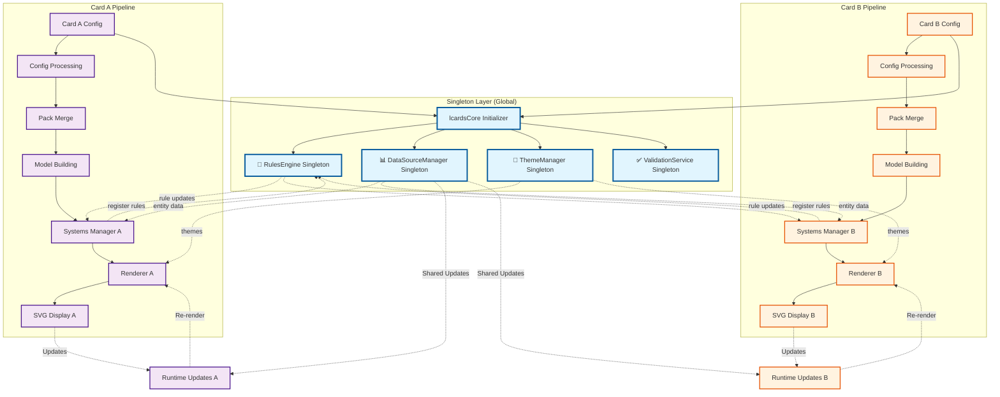

**Key Characteristics:**
- 🌐 **Singleton Intelligence** - Shared systems across all cards (RulesEngine, DataSourceManager, ThemeManager)
- 🎯 **Multi-Card Support** - Multiple MSD cards can coexist with shared rule evaluation
- 🔄 **Event-driven** - Responds to HA entity changes through singleton distribution
- 📦 **Modular** - Clear separation between global intelligence and per-card rendering
- ⚡ **Efficient** - Shared processing, incremental updates, coordinated cross-card updates
- 🎯 **Declarative** - Configuration-first approach with singleton-aware targeting
- 🔍 **Debuggable** - Comprehensive introspection tools with singleton state visibility

---

## Complete Pipeline Flow

### End-to-End Singleton System Flow

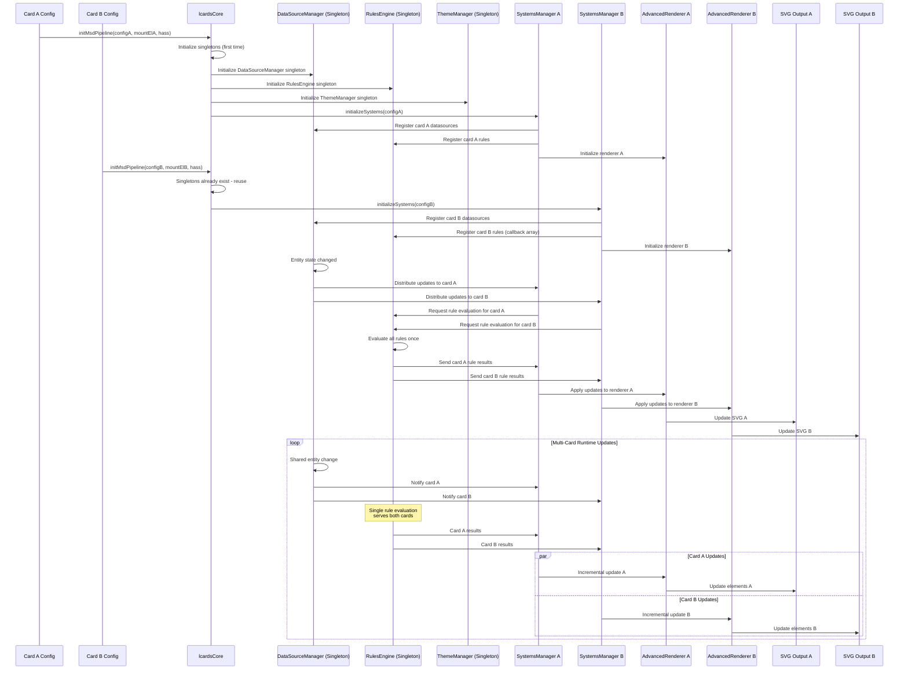

**Singleton Flow Summary:**
1. **Singleton Initialization** - lcardsCore creates shared intelligence systems (first card only)
2. **Card Registration** - Each card registers its datasources and rules with singletons
3. **Configuration Processing** - Per-card config validation and pack merging
4. **Model Building** - Each card builds its internal representation
5. **Systems Coordination** - SystemsManager connects cards to singletons
6. **Shared Processing** - Singletons process data once, distribute to all cards
7. **Distributed Rendering** - Each card renders independently with shared intelligence
8. **Coordinated Runtime** - Entity changes trigger singleton evaluation, distributed updates


---

## Initialization Sequence

### Singleton Architecture Initialization

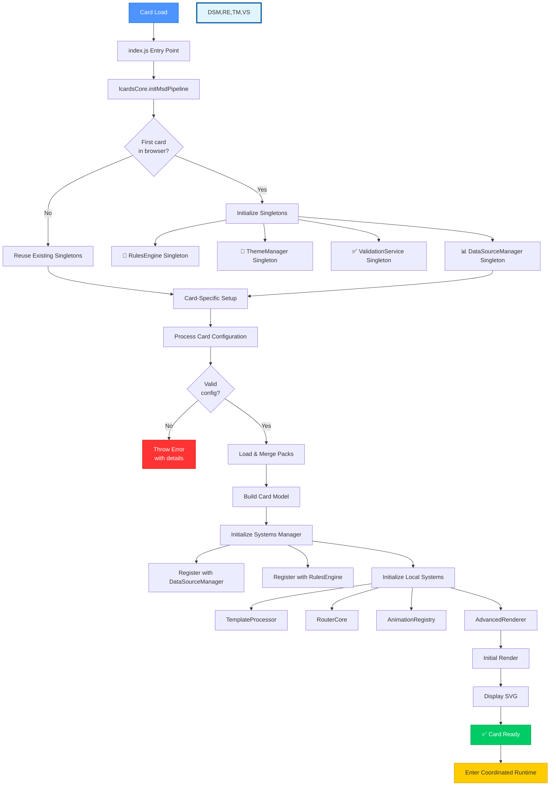

**Singleton Initialization Steps:**
1. **Entry Point** - `index.js` exports `initMsdPipeline`, calls `lcardsCore`
2. **Singleton Check** - First card creates global singletons, subsequent cards reuse
3. **Singleton Creation** - DataSourceManager, RulesEngine, ThemeManager, ValidationService
4. **Card Registration** - Register datasources and rules with appropriate singletons
5. **Config Processing** - Per-card validation and pack merging
6. **Local Systems** - Initialize card-specific systems (TemplateProcessor, Renderer)
7. **Initial Render** - Generate first SVG output with singleton intelligence
8. **Coordinated Runtime** - Enter multi-card event-driven mode with shared processing

---

## Configuration Processing

### Config Validation & Normalization

```mermaid
graph TD
    Raw[Raw User Config] --> Validator[Configuration Validator]

    Validator --> Schema{Schema<br/>valid?}
    Schema -->|No| Issues[Collect Issues]
    Schema -->|Yes| Normalize[Normalize Values]

    Issues --> Severity{Critical?}
    Severity -->|Yes| Throw[Throw Error]
    Severity -->|No| Warn[Log Warnings]

    Normalize --> Defaults[Apply Defaults]
    Defaults --> Expand[Expand Shorthand]
    Expand --> Resolved[Resolved Config]

    Warn --> Resolved
    Resolved --> Provenance[Track Provenance]
    Provenance --> Output[{mergedConfig, issues, provenance}]

    style Raw fill:#4d94ff,stroke:#0066cc,color:#fff
    style Throw fill:#ff3333,stroke:#cc0000,color:#fff
    style Warn fill:#ff9933,stroke:#cc6600,color:#fff
    style Output fill:#00cc66,stroke:#009944,color:#fff
```

**Configuration Stages:**
1. **Schema Validation** - Check against JSON schema
2. **Normalization** - Convert shorthand to full format
3. **Default Application** - Fill in missing values
4. **Issue Collection** - Track warnings and errors
5. **Provenance Tracking** - Record where each value came from

**Validation Features:**
- Required field checking
- Type validation
- Range validation
- Dependency validation
- Custom validators per overlay type

---

## Pack System

### Pack Loading & Merging

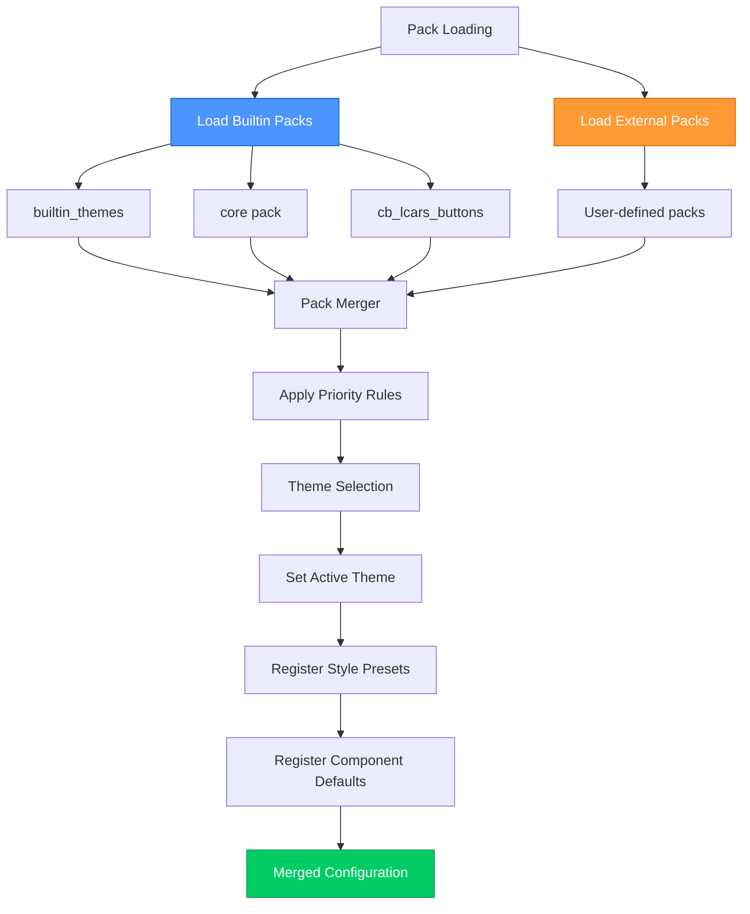

**Pack Types:**
- **builtin_themes** - Theme definitions (always loaded)
- **core** - Core overlays and defaults
- **cb_lcars_buttons** - LCARS button presets
- **external** - User-provided packs from URLs

**Merge Priority:**
1. Builtin packs (lowest priority)
2. External packs
3. User configuration (highest priority)

**What Packs Provide:**
- Theme tokens and component defaults
- Style presets (e.g., LCARS button styles)
- Reusable overlay templates
- Animation definitions

---

## Model Building

### Card Model Construction

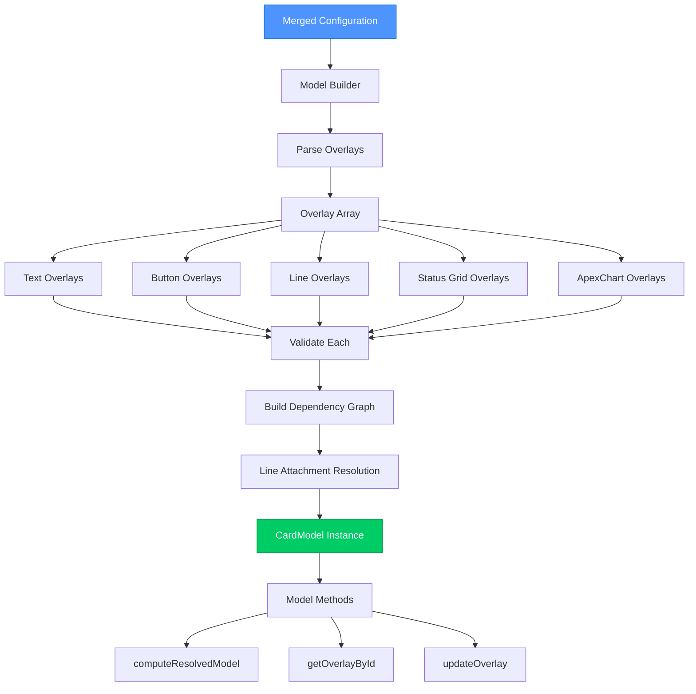

**Model Building Process:**
1. **Parse Overlays** - Convert config to overlay objects
2. **Type Validation** - Ensure each overlay has valid type
3. **Dependency Analysis** - Build graph of overlay relationships
4. **Line Resolution** - Resolve line attachment points
5. **Model Creation** - Instantiate CardModel with all overlays

**CardModel Features:**
- Stores all overlay definitions
- Tracks overlay dependencies (e.g., lines attached to overlays)
- Provides query methods (getOverlayById, getOverlaysByType)
- Caches resolved model for performance
- Supports incremental updates


---

## Systems Initialization

### Singleton + SystemsManager Coordination

```mermaid
graph TD
    subgraph "Singleton Layer (Global - First Card Only)"
        LC[lcardsCore] --> DSM[📊 DataSourceManager Singleton]
        LC --> RE[🧠 RulesEngine Singleton]
        LC --> TM[🎨 ThemeManager Singleton]
        LC --> VS[✅ ValidationService Singleton]

        DSM --> Entities[Subscribe to HA Entities]
        DSM --> History[Preload History]
        DSM --> Buffer[Initialize Entity Buffers]

        RE --> RuleStore[Initialize Rule Store]
        RE --> Callbacks[Setup Callback Arrays]

        TM --> Tokens[Load Theme Tokens]
        TM --> Defaults[Component Defaults]
    end

    subgraph "Card Layer (Per Card)"
        Manager[SystemsManager] --> RegisterDS[Register DataSources with Singleton]
        Manager --> RegisterRE[Register Rules with Singleton]
        Manager --> LocalInit[Initialize Local Systems]

        RegisterDS --> DSM
        RegisterRE --> RE

        LocalInit --> Template[TemplateProcessor]
        LocalInit --> Router[RouterCore]
        LocalInit --> Anim[AnimationRegistry]
        LocalInit --> Renderer[AdvancedRenderer]

        Template --> Registry[Register Built-in Functions]
        Router --> PathLib[Initialize Path Library]
        Anim --> AnimeJS[Load Anime.js v4]
        Renderer --> SVG[Setup SVG Namespace]
        Renderer --> OverlayRenderers[Initialize Overlay Renderers]
    end

    Renderer --> Ready[✅ Card Systems Ready]

    classDef singleton fill:#e1f5fe,stroke:#01579b,stroke-width:3px
    classDef cardLocal fill:#f3e5f5,stroke:#4a148c,stroke-width:2px

    class LC,DSM,RE,TM,VS,Entities,History,Buffer,RuleStore,Callbacks,Tokens,Defaults singleton
    class Manager,RegisterDS,RegisterRE,LocalInit,Template,Router,Anim,Renderer,Registry,PathLib,AnimeJS,SVG,OverlayRenderers cardLocal
```

**Singleton SystemsManager Role:**
- **Global Coordination** - First card creates shared intelligence singletons
- **Registration Bridge** - Each card registers its datasources/rules with singletons
- **Local System Management** - Manages card-specific systems (TemplateProcessor, Renderer)
- **Singleton Access** - Provides card access to shared intelligence systems
- **Multi-Card Cleanup** - Handles card removal without affecting other cards

**System Types:**
**Singleton Systems (Shared):**
1. **DataSourceManager** - Entity subscriptions shared across all cards
2. **RulesEngine** - Rule evaluation with callback distribution to all cards
3. **ThemeManager** - Theme tokens and defaults available to all cards
4. **ValidationService** - Schema validation shared across all cards

**Local Systems (Per Card):**
1. **TemplateProcessor** - Card-specific template resolution
2. **RouterCore** - Card-specific line path calculation
3. **AnimationRegistry** - Card-specific animation management
4. **AdvancedRenderer** - Card-specific SVG generation
7. **AdvancedRenderer** - SVG rendering

---

## DataSource Lifecycle

### Singleton DataSourceManager Multi-Card Coordination

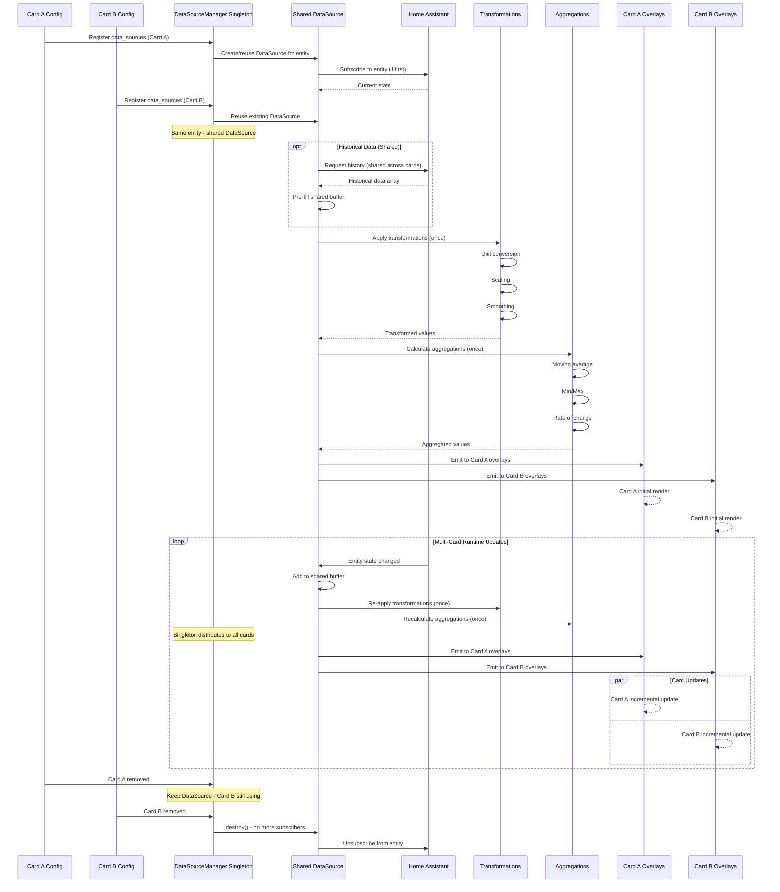

**Singleton DataSource Features:**
- **Shared Subscriptions** - One entity subscription serves multiple cards
- **Coordinated Processing** - Single transformation/aggregation pipeline per entity
- **Multi-Card Distribution** - Processed data distributed to all subscribers
- **Reference Counting** - DataSources destroyed when no cards using them
- **Efficient Resource Usage** - Shared buffers, transformations, and HA connections
- **Historical preload** - Load past data once, share across all cards
- **Time-windowed buffers** - Efficient shared memory management
- **Transformation pipeline** - 50+ processors applied once per entity
- **Aggregation engine** - Statistics calculated once, distributed to all cards

---

## Rendering Pipeline

### SVG Generation Process

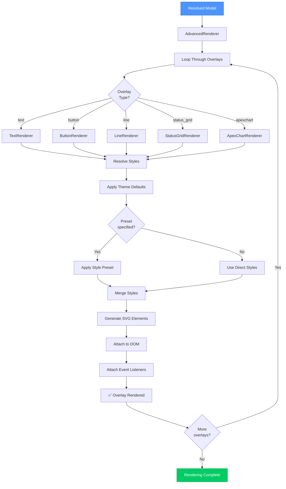

**Rendering Steps:**
1. **Loop Overlays** - Process each overlay in order
2. **Type Detection** - Identify overlay type
3. **Style Resolution** - Resolve styles from theme, presets, and user config
4. **SVG Generation** - Create SVG elements
5. **DOM Attachment** - Add elements to SVG container
6. **Event Binding** - Attach click handlers, hover effects
7. **Return to Loop** - Process next overlay

**Renderer Features:**
- **Incremental updates** - Only re-render changed overlays
- **Efficient DOM manipulation** - Minimize reflows
- **Event delegation** - Centralized event handling
- **Style caching** - Avoid redundant calculations
- **ViewBox scaling** - Responsive sizing


---

## Runtime Updates

### Multi-Card Singleton Coordinated Updates

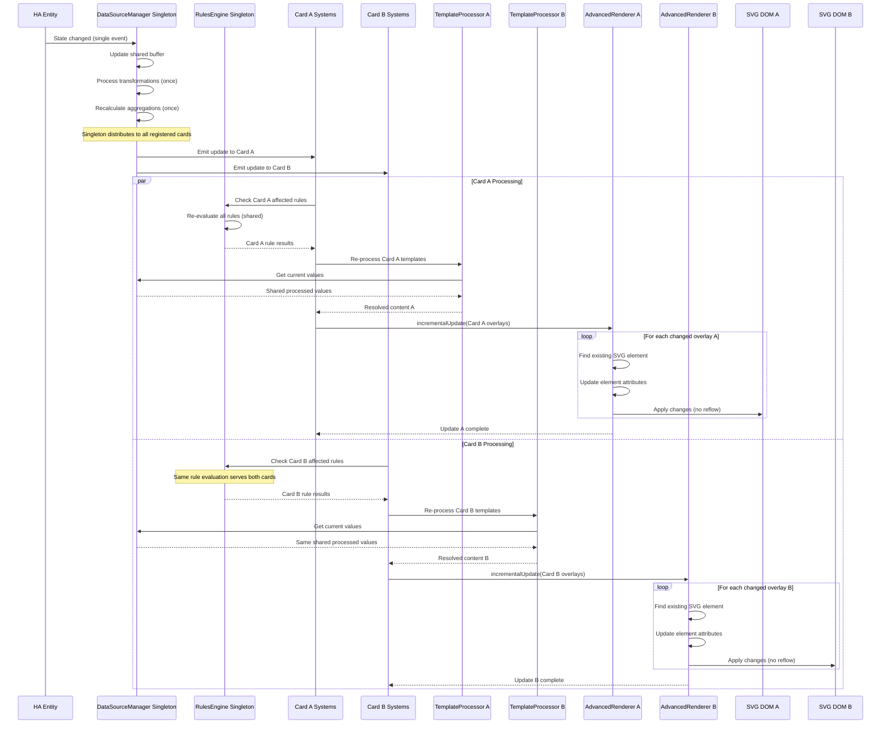

**Singleton Update Optimization:**
- ✅ **Shared Processing** - Single entity processing serves all cards
- ✅ **Coordinated Rule Evaluation** - Rules evaluated once, distributed to all cards
- ✅ **No full re-renders** - Only update changed overlays per card
- ✅ **Parallel Card Updates** - Multiple cards update simultaneously
- ✅ **Minimal DOM manipulation** - Batch updates per card
- ✅ **Efficient diffing** - Track what changed per card
- ✅ **Event coalescing** - Batch rapid updates across all cards
- ✅ **Async processing** - Non-blocking coordinated updates

**Multi-Card Update Triggers:**
- Single entity state change affects multiple cards
- Shared DataSource computed value changes
- Singleton rule re-evaluation distributed to relevant cards
- Cross-card targeting (overlay updates in different cards)
- User interactions with card-to-card effects
- Timer-based updates coordinated across cards

---

## Template Processing

### Template Resolution Flow

```mermaid
graph TD
    Template[Template String<br/>\{datasource.value\}] --> Processor[TemplateProcessor]

    Processor --> Parse[Parse Template]
    Parse --> Tokens[Extract Tokens]

    Tokens --> Type{Token<br/>Type?}

    Type -->|datasource| DS[DataSourceManager]
    Type -->|function| Func[Built-in Function]
    Type -->|expression| Expr[JavaScript Expression]

    DS --> Get[Get DataSource Value]
    Get --> Trans{Transformation<br/>specified?}
    Trans -->|Yes| TransValue[Get Transformation Value]
    Trans -->|No| RawValue[Get Raw Value]

    TransValue --> Format[Apply Formatting]
    RawValue --> Format

    Func --> Eval[Evaluate Function]
    Eval --> Format

    Expr --> Safe[Safe Eval Context]
    Safe --> Format

    Format --> Replace[Replace Token]
    Replace --> More{More<br/>tokens?}
    More -->|Yes| Tokens
    More -->|No| Result[Resolved String]

    style Template fill:#4d94ff,stroke:#0066cc,color:#fff
    style Result fill:#00cc66,stroke:#009944,color:#fff
```

**Template Features:**
- **DataSource references** - `{datasource.value}`, `{datasource.transformations.key}`
- **Aggregation access** - `{datasource.aggregations.avg.value}`
- **Built-in functions** - `{@round(datasource.value, 1)}`
- **Expressions** - `{datasource.value * 2 + 10}`
- **Formatting** - `{datasource.value:.2f}` (2 decimal places)
- **Safe evaluation** - Sandboxed JavaScript execution

---

## Rules Engine Evaluation

### Rule Processing

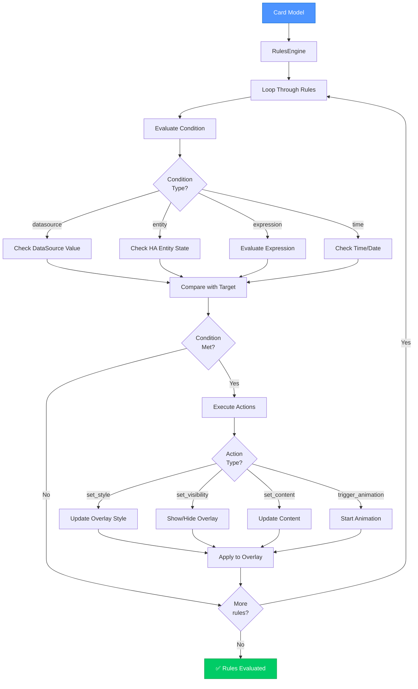

**Rule Types:**
- **Conditional styling** - Change colors based on value ranges
- **Visibility control** - Show/hide overlays based on conditions
- **Content updates** - Dynamic text based on state
- **Animation triggers** - Start animations on conditions
- **Multi-condition rules** - AND/OR logic

**Evaluation Timing:**
- Initial render
- DataSource updates
- Entity state changes
- Manual trigger (user action)

---

## Line Routing

### Path Calculation

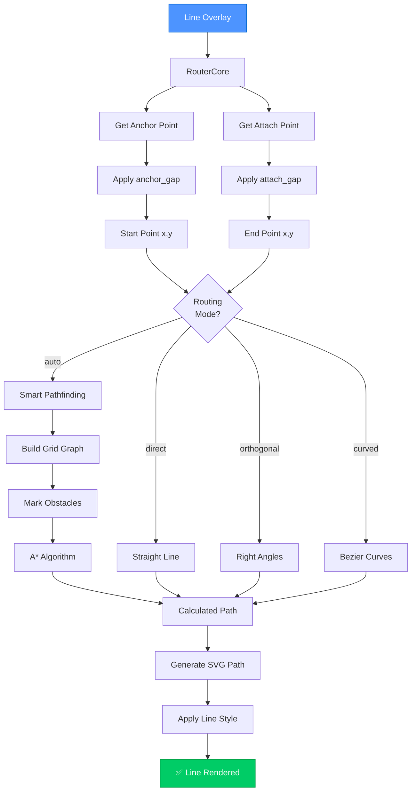

**Line Routing Features:**
- **9-point attachment** - Any side or corner of any overlay
- **Gap system** - Offset from attachment point
- **Auto routing** - Obstacle avoidance with A*
- **Multiple algorithms** - Direct, orthogonal, curved
- **Dynamic updates** - Recalculate on overlay movement
- **Style control** - Width, color, dashes, arrows

---

## Debug & Introspection

### Debug System

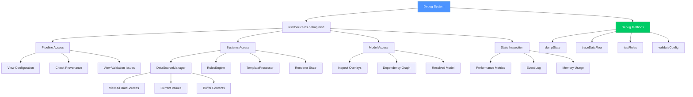

**Debug Features:**

**Console Access:**
```javascript
// Access debug interface
window.lcards.debug.msd

// View configuration
window.lcards.debug.msd.config

// Inspect datasources
window.lcards.debug.msd.systems.dataSourceManager.dataSources

// View resolved model
window.lcards.debug.msd.model.computeResolvedModel()

// Dump full state
window.lcards.debug.msd.dumpState()
```

**Debug Methods:**
- `dumpState()` - Export complete system state
- `traceDataFlow(overlayId)` - Track data flow to overlay
- `testRules()` - Dry-run rule evaluation
- `validateConfig()` - Re-validate configuration
- `inspectDataSource(id)` - View datasource details
- `reRender()` - Force full re-render

**Debug Renderers:**
- **MsdDebugRenderer** - Overlay bounds, attachment points
- **MsdControlsRenderer** - Runtime controls, config editor

---

## Performance Characteristics

### System Performance

| Aspect | Performance | Notes |
|--------|-------------|-------|
| **Initial Load** | ~100-200ms | Depends on pack count, theme complexity |
| **First Render** | ~50-100ms | Depends on overlay count |
| **DataSource Update** | ~1-5ms | Per datasource, includes transformations |
| **Incremental Render** | ~2-10ms | Per changed overlay |
| **Rule Evaluation** | ~0.5-2ms | Per rule |
| **Template Processing** | ~1-3ms | Per template |
| **Line Routing (auto)** | ~5-20ms | Depends on path complexity |
| **Memory Usage** | 5-20 MB | Depends on history buffer size |

**Optimization Techniques:**
- Event coalescing (batch rapid updates)
- Incremental rendering (no full re-renders)
- Style caching (avoid redundant calculations)
- Buffer windowing (automatic old data cleanup)
- Lazy evaluation (compute only when needed)
- Efficient DOM manipulation (minimize reflows)

---

## Summary

### Key Pipeline Stages

1. **Configuration** → Process and validate user config
2. **Packs** → Load and merge themes, presets, external config
3. **Model** → Build internal card representation
4. **Systems** → Initialize all subsystems
5. **DataSources** → Subscribe to HA entities, preload history
6. **Resolution** → Resolve templates, evaluate rules
7. **Rendering** → Generate SVG from resolved model
8. **Runtime** → Handle updates incrementally

### System Characteristics

- ✅ **Event-driven** - React to HA state changes
- ✅ **Declarative** - Configuration-first approach
- ✅ **Modular** - Clear subsystem boundaries
- ✅ **Efficient** - Incremental updates only
- ✅ **Debuggable** - Comprehensive introspection
- ✅ **Extensible** - Pack system, custom renderers
- ✅ **Performant** - Optimized for real-time dashboards

### Architecture Benefits

**For Users:**
- Fast, responsive dashboards
- Real-time data updates
- Rich visual effects
- Easy configuration

**For Developers:**
- Clear separation of concerns
- Easy to debug and test
- Extensible architecture
- Well-documented pipeline

---

**Related Documentation:**
- [Systems Manager](subsystems/systems-manager.md) - Central orchestration
- [DataSource System](subsystems/datasource-system.md) - Data processing
- [Advanced Renderer](subsystems/advanced-renderer.md) - SVG generation
- [Pack System](subsystems/pack-system.md) - Configuration merging
- [Rules Engine](subsystems/rules-engine.md) - Conditional logic
- [Template Processor](subsystems/template-processor.md) - String resolution
