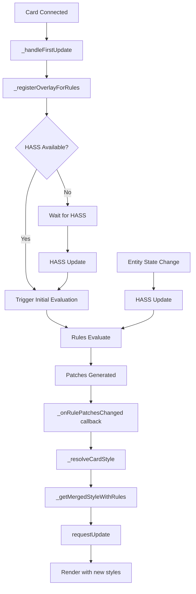

# LCARdS Card Architecture

## Overview

The LCARdS Card foundation provides a minimal, clear base for building single-purpose Home Assistant cards that leverage LCARdS singleton systems without MSD complexity.

## Philosophy

**Explicit Over Magic**
- Card explicitly requests what it needs
- No auto-subscriptions or hidden behavior
- Clear, predictable lifecycle

**Minimal Foundation**
- Only essential helpers provided
- Card owns its rendering logic
- Simple template processing

**Singleton Integration**
- Direct access to CoreSystemsManager, theme, rules, animations
- Entity caching for significantly faster access with multiple cards
- Reactive subscriptions via `subscribeToEntity()` API
- No intermediate abstraction layers
- Cards use what they need

## Class Hierarchy

```
LitElement
    ↓
LCARdSNativeCard (HA integration, shadow DOM, actions)
    ↓
LCARdSCard (singleton access, helpers)
    ↓
[Your LCARdS Card] (rendering, logic)
```

## When to Use

### Use LCARdS Card For:
- ✅ Single-purpose cards (buttons, labels, status)
- ✅ Cards with 1-3 entities
- ✅ Template-driven content
- ✅ Action-based interactions
- ✅ Simple state displays

### Use MSD Card For:
- ✅ Multi-overlay displays
- ✅ Complex navigation/routing
- ✅ Grid-based layouts
- ✅ Custom SVG composition
- ✅ Advanced animation sequences

## Creating an LCARdS Card

### Basic Structure

```javascript
import { html } from 'lit';
import { LCARdSCard } from '../base/LCARdSCard.js';

export class MyLCARdSCard extends LCARdSCard {

    // 1. Define reactive properties
    static get properties() {
        return {
            ...super.properties,
            _myState: { type: String, state: true }
        };
    }

    // 2. Initialize state
    constructor() {
        super();
        this._myState = 'initial';
    }

    // 3. Handle HASS updates (optional)
    _handleHassUpdate(newHass, oldHass) {
        // Process entity changes
        this._myState = this._entity?.state || 'unknown';
    }

    // 4. Render your content
    _renderCard() {
        return html`
            <div class="my-card">
                <!-- Your rendering here -->
            </div>
        `;
    }
}
```

### Available Helpers

#### CoreSystemsManager Integration

**Cached Entity Access** - significantly faster with multiple cards:
```javascript
// Automatic caching with fallback
const entity = this.getEntityState('light.bedroom');
// Uses CoreSystemsManager cache first, falls back to direct HASS
```

**Reactive Entity Subscriptions** - Get notified when entities change:
```javascript
// Subscribe to entity changes
const unsubscribe = this.subscribeToEntity(
  'sensor.temperature',
  (entityId, newState, oldState) => {
    console.log(`Temperature changed: ${oldState.state} -> ${newState.state}`);
    this.requestUpdate(); // Trigger re-render
  }
);

// Cleanup (handled automatically in _onDisconnected)
unsubscribe();
```

**Automatic Lifecycle Management**:
- Card registration on connect (automatic)
- Entity cache population (automatic)
- Subscription cleanup on disconnect (automatic)
- Memory leak prevention (automatic)

#### Template Processing

```javascript
// Process all 4 template types: [[[JS]]], {token}, {datasource:name}, {{ Jinja2 }}
const result = await this.processTemplate(template);
```

See [Templates](../../core/templates/) for the full syntax reference. Note: tokens use **single** braces (`{entity.state}`) — double braces (`{{ }}`) are Jinja2.

#### Theme Access

```javascript
// Get theme token value
const color = this.getThemeToken('colors.accent.primary', '#ff9900');

// Get style preset
const preset = this.getStylePreset('button', 'lozenge');
```

#### Style Resolution

```javascript
// Combine base + theme + state
const style = this.resolveStyle(
    baseStyle,                    // Base styles
    ['colors.primary'],           // Theme tokens to apply
    { opacity: 0.8 }              // State overrides
);
```

#### Entity Access

`this._entity` holds the card's configured entity (auto-populated when `config.entity` is set, cached via CoreSystemsManager). For any other entity, use `getEntityState()` / `subscribeToEntity()` as shown above.

#### Service Calls

```javascript
// Call HA service
await this.callService('light', 'turn_on', {
    entity_id: 'light.bedroom',
    brightness: 255
});
```

#### Actions

```javascript
// Setup action handlers (3rd arg: optional options — animationManager, elementId, entity, disableHover, etc.)
this._actionCleanup = this.setupActions(element, {
    tap_action: { action: 'toggle' },
    hold_action: { action: 'more-info' }
});
```

### RulesEngine Integration

LCARdSCard provides first-class RulesEngine support for dynamic styling and behavior based on entity states.

#### Overview

The RulesEngine allows cards to react to entity state changes with style patches that have **highest priority** in the style resolution chain:

```
Style Resolution Priority:
1. Base config style (lowest)
2. Preset styles
3. Theme token resolution
4. State overrides
5. Rule patches (highest)
```

#### Basic Setup

```javascript
export class MyLCARdSCard extends LCARdSCard {

    constructor() {
        super();
        this._cardStyle = {}; // Your card's style state
    }

    // 1. Register overlay with RulesEngine
    _handleFirstUpdate() {
        super._handleFirstUpdate();

        // Register this card as an overlay for rules
        // Parameters: overlayId (string), type (string), tags (array, optional)
        const overlayId = this.config.id || `my-card-${this._cardGuid}`;
        const tags = ['button']; // Tags for rule targeting
        this._registerOverlayForRules(overlayId, 'button', tags);
    }

    // 2. Implement the patch changed hook
    _onRulePatchesChanged(patches) {
        // Called when rules re-evaluate and patches change
        // Re-resolve style to pick up new rule patches
        this._resolveCardStyle();
    }

    // 3. Merge rule patches into style
    _resolveCardStyle() {
        let style = { ...(this.config.style || {}) };

        // Apply preset
        if (this.config.preset) {
            const preset = this.getStylePreset('card', this.config.preset);
            style = { ...preset, ...style };
        }

        // Apply theme tokens
        style = this.resolveStyle(style, ['colors.primary']);

        // ⭐ Merge with rule patches (highest priority)
        style = this._getMergedStyleWithRules(style);

        // Only update if changed (prevents unnecessary re-renders)
        if (JSON.stringify(this._cardStyle) !== JSON.stringify(style)) {
            this._cardStyle = style;
            this.requestUpdate(); // ⚠️ CRITICAL: Trigger re-render
        }
    }
}
```

#### YAML Configuration

```yaml
type: custom:my-simple-card
entity: light.bedroom
style:
  primary: '#ff9900'
  textColor: '#ffffff'
rules:
  - id: light_on_green
    when:
      entity: light.bedroom
      conditions:
        - attribute: state
          operator: '=='
          value: 'on'
    apply:
      style:
        primary: '#00ff00'  # Green when on
        textColor: '#000000'
```

#### Critical Implementation Details

**1. Always call `requestUpdate()` after applying patches** — Lit won't re-render without it (see `_resolveCardStyle()` above).

**2. Use inline styles, not CSS classes:**

```javascript
// ❌ WRONG: CSS classes are static and cached
return html`
    <svg>
        <style>
            .button-bg { fill: ${primary}; }
        </style>
        <rect class="button-bg" />
    </svg>
`;

// ✅ CORRECT: Inline styles update dynamically
return html`
    <svg>
        <rect style="fill: ${primary};" />
    </svg>
`;
```

**3. Never use `!important` in static CSS:**

```css
/* ❌ WRONG: Blocks inline style updates */
.button-bg {
    fill: #ff9900 !important;
}

/* ✅ CORRECT: Let inline styles override */
.button-bg {
    fill: #ff9900;
}
```

**4. Trigger initial evaluation when HASS available:**

Handled automatically by `_registerOverlayForRules()` — see the Complete Flow diagram below.

#### Performance Optimization

**Entity-Specific Rule Evaluation**

LCARdSCards use the same efficient entity-based monitoring as MSD cards:

```javascript
// Automatically called in _onConnected() after rules are loaded
await this._rulesManager.setupHassMonitoring(this._hass);
```

**How it works:**

1. **WebSocket Subscription**: Subscribes directly to HASS `state_changed` events — shared across all cards
2. **Dependency Tracking**: Only listens to entities referenced in your rules
3. **Selective Dirty-Marking**: Only marks rules dirty when their entities change (O(1) lookup via cached Set)
4. **Efficient Callbacks**: Only triggers re-evaluation when rules are actually dirty

**Example:**

```yaml
# Rule only re-evaluates when sensor.cpu_temp changes
# Ignores changes to sensor.memory, light.bedroom, etc.
rules:
  - id: cpu_hot_red
    when:
      entity: sensor.cpu_temp
      conditions:
        - attribute: state
          operator: '>'
          value: 80
    apply:
      style:
        primary: '#ff0000'
```

**Debug Logging:**

```javascript
// Enable to see entity-specific evaluation
lcardsLog.setLogLevel('debug');

// Look for these messages:
// "[RulesEngine] Processing entity change: sensor.cpu_temp -> 85"
// "[RulesEngine] Marked 1 rules dirty for entity sensor.cpu_temp"
```

#### Complete Flow



#### Debugging Rules Integration

Common issues and solutions:

| Issue | Symptom | Solution |
|-------|---------|----------|
| Rules evaluate but no visual change | Console shows patches applied but colors don't change | Add `this.requestUpdate()` after style changes |
| Styles computed but not displayed | Logs show correct colors but DOM shows old colors | Use inline styles, not CSS classes |
| Inline styles ignored | DOM shows correct style attribute but wrong rendering | Remove `!important` from static CSS |
| Rules don't evaluate on load | Button shows default style when light already ON | Base class handles this automatically |

#### Performance Notes

- Style comparison uses JSON stringify - only triggers re-render if style actually changed
- Patches are **reference-compared** - identical patches don't trigger callbacks
- Initial evaluation happens once on registration if HASS available

#### Advanced: Multiple Overlays

`_registerOverlayForRules()` can only be called **once per card** — it's what wires up the card's single rules-re-evaluation callback. If your card has multiple sub-components that each need independent rule targeting (like a button with a separate icon), register the first through `_registerOverlayForRules()` and any additional ones directly with `SystemsManager` (this is the same pattern `LCARdSMSDCard` uses for its overlays):

```javascript
_handleFirstUpdate() {
    super._handleFirstUpdate();

    // Main component — this call sets up the rules callback
    this._registerOverlayForRules(`button-${this._cardGuid}`, 'button', ['button']);

    // Additional sub-component — register directly, _registerOverlayForRules() is used up
    this._singletons.systemsManager.registerOverlay(`icon-${this._cardGuid}`, {
        id: `icon-${this._cardGuid}`,
        type: 'icon',
        tags: ['icon'],
        sourceCardId: this._cardGuid
    });
}

// Apply patches to correct component
_onRulePatchesChanged(patches) {
    // Patches include overlayId - check which component they're for
    if (patches.overlayId.startsWith('button-')) {
        this._resolveButtonStyle();
    } else if (patches.overlayId.startsWith('icon-')) {
        this._resolveIconStyle();
    }
    this.requestUpdate();
}
```

## HASS Distribution Integration

LCARdSCard integrates with the singleton HASS distribution system and CoreSystemsManager:

### Automatic HASS Updates
- Inherits from `LCARdSNativeCard` which gets HASS from HA
- `_onHassChanged()` called automatically when HASS updates
- Entity references updated automatically via CoreSystemsManager cache

### Entity Tracking
- Card's `entity` is automatically tracked for HASS change detection
- Additional entities can be tracked via `this._trackedEntities` array
- `_shouldUpdateOnHassChange()` checks tracked entities to determine if re-render needed
- **Example**: LCARdS Button tracks segment entities for multi-entity cards

```javascript
// In card constructor or config processing:
this._trackedEntities = [];

// Collect entities to track (e.g., from segments):
segments.forEach(segment => {
    const entityId = segment.entity || this.config.entity;
    if (entityId && !this._trackedEntities.includes(entityId)) {
        this._trackedEntities.push(entityId);
    }
});

// Now card re-renders when ANY tracked entity changes
```

### Feeding HASS to Singletons

LCARdSCard calls `window.lcards.core.ingestHass(hass)` on every HASS update, enabling cross-card coordination and shared entity state — see the flow below.

### Entity Caching via CoreSystemsManager

CoreSystemsManager maintains a single global entity-state cache shared by all LCARdSCards:
- First access to an entity: cache miss → direct HASS lookup → cache populated
- Subsequent accesses: cache hit — no repeated HASS lookups
- Cache is updated automatically on HASS changes
- With N cards reading the same entity, this collapses N HASS lookups down to one cache update plus N cheap cache reads

### HASS Flow
```
Home Assistant
    ↓
Card.hass = hass (automatic via LCARdSNativeCard)
    ↓
_onHassChanged() (LCARdSCard override)
    ↓
window.lcards.core.ingestHass(hass) (feed to singletons)
    ↓  ↓  ↓
    ↓  ↓  └─> CoreSystemsManager.updateHass(hass)
    ↓  ↓         ├─> Detect changed entities
    ↓  ↓         ├─> Update entity cache
    ↓  ↓         └─> Notify subscribers
    ↓  └─> RulesEngine, ThemeManager, etc.
    └─> All other cards get updated via singleton system
```

## API Reference

### LCARdSCard Properties

| Property | Type | Description |
|----------|------|-------------|
| `_entity` | Object | Current entity state (if config.entity set) |
| `_singletons` | Object | Singleton system references (coordinator, theme, rules, etc.) |
| `_initialized` | Boolean | Whether card is fully initialized |
| `_entitySubscriptions` | Set | Tracked entity subscriptions for cleanup |
| `_cardContext` | — | Removed — cards use `this._singletons` for all manager access |
| `_overlayRegistered` | Boolean | Whether overlay is registered with RulesEngine |
| `_currentRulePatches` | Object | Cached rule patches for this overlay |

### LCARdSCard Methods

| Method | Parameters | Returns | Description |
|--------|------------|---------|-------------|
| `processTemplate(template, options)` | template: string, options?: Object | `Promise<string>` | Process all 4 template types — [[[JS]]], {token}, {datasource:name}, {{ Jinja2 }} — via `UnifiedTemplateEvaluator.evaluateAsync()` |
| `getThemeToken(path, fallback)` | path: string, fallback: any | any | Get theme token value |
| `getStylePreset(type, name)` | type: string, name: string | Object\|null | Get style preset config |
| `resolveStyle(base, tokens, overrides)` | base: Object, tokens: Array, overrides: Object | Object | Resolve combined styles |
| `getEntityState(entityId)` | entityId?: string | Object\|null | Get entity state (cached via CoreSystemsManager) |
| `subscribeToEntity(entityId, callback)` | entityId: string, callback: Function | Function | Subscribe to entity changes (returns unsubscribe function) |
| `callService(domain, service, data)` | domain: string, service: string, data?: Object | Promise | Call HA service |
| `setupActions(element, actions, options)` | element: HTMLElement, actions: Object, options?: Object | Function | Setup action handlers (options: animationManager, elementId, entity, animations, soundOverride, disableHover) |
| `_registerOverlayForRules(overlayId, type, tags)` | overlayId: string, type: string, tags?: `Array<string>` | void | Register overlay with RulesEngine for rule-based styling. Callable **once per card** — subsequent calls warn and no-op; for additional sub-component overlays call `this._singletons.systemsManager.registerOverlay()` directly (tags default to []) |
| `_getMergedStyleWithRules(baseStyle)` | baseStyle: Object | Object | Merge base style with active rule patches (rules have highest priority). Call last, from your own card-specific resolve method (e.g. `_resolveButtonStyle()`) — see the Basic Setup example above. |
| `_applyRulePatches(patches)` | patches: Object | void | Internal method to apply rule patches and trigger callback |

### Lifecycle Hooks

| Hook | When Called | Purpose |
|------|-------------|---------|
| `_handleHassUpdate(newHass, oldHass)` | HASS updates | React to entity changes |
| `_handleFirstUpdate(changedProps)` | First render | Initial setup |
| `_renderCard()` | Every render | Return card content HTML |
| `_onRulePatchesChanged(patches)` | Rule patches change | React to rule-based style changes (implement in subclass) |


## See Also

- [Rules Engine](../subsystems/rules-engine.md)
- [Theme System](../subsystems/theme-system.md)
- [Template System](../subsystems/template-system.md)
- [Animation Manager](../subsystems/animation-manager.md)
- [Systems Manager](../subsystems/systems-manager.md)
