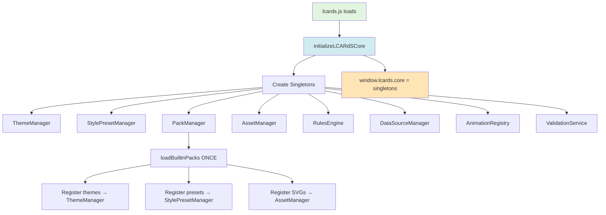
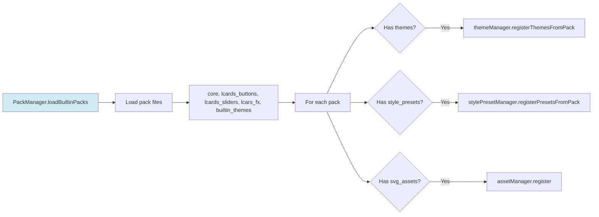

# Core Initialization Flow

**When:** Module load (before any cards instantiated)  
**Where:** `src/core/lcards-core.js`  
**What:** Create all singletons once, load builtin packs

---

## Initialization Sequence



**Key Facts:**
- ✅ Runs **once** at module load
- ✅ All cards access `window.lcards.core.*` (never create singletons)
- ✅ PackManager loads builtin packs immediately

---

## PackManager Flow



**Key Facts:**
- ✅ Packs loaded from `src/core/packs/`
- ✅ Each pack registers to appropriate managers
- ✅ No per-card pack loading

---

## Singleton Access Pattern

```javascript
// In any card or system:
const core = window.lcards?.core;

// Use singletons:
const theme = core.themeManager.getActiveTheme();
const preset = core.stylePresetManager.getPreset('button', 'lozenge');
const svg = await core.assetManager.get('svg', 'ncc-1701-a-blue');
```

---

## Singleton Registry

| Singleton | Purpose | Created By |
|-----------|---------|------------|
| `themeManager` | Theme tokens, activation | `lcards-core.js` |
| `stylePresetManager` | Style preset registry | `lcards-core.js` |
| `packManager` | Pack loading/registration | `lcards-core.js` |
| `assetManager` | SVG/font/audio assets | `lcards-core.js` |
| `rulesManager` | Rules engine | `lcards-core.js` |
| `dataSourceManager` | Entity subscriptions | `lcards-core.js` |
| `animationRegistry` | Animation caching | `lcards-core.js` |
| `validationService` | Config validation | `lcards-core.js` |
| `actionHandler` | Unified actions | `lcards-core.js` |
| `configManager` | Config processing | `lcards-core.js` |

**Access:** `window.lcards.core.<singleton>`

---

## References
- Implementation: `src/core/lcards-core.js`
- Pack loading: `src/core/PackManager.js`
- Asset management: `src/core/assets/AssetManager.js`
