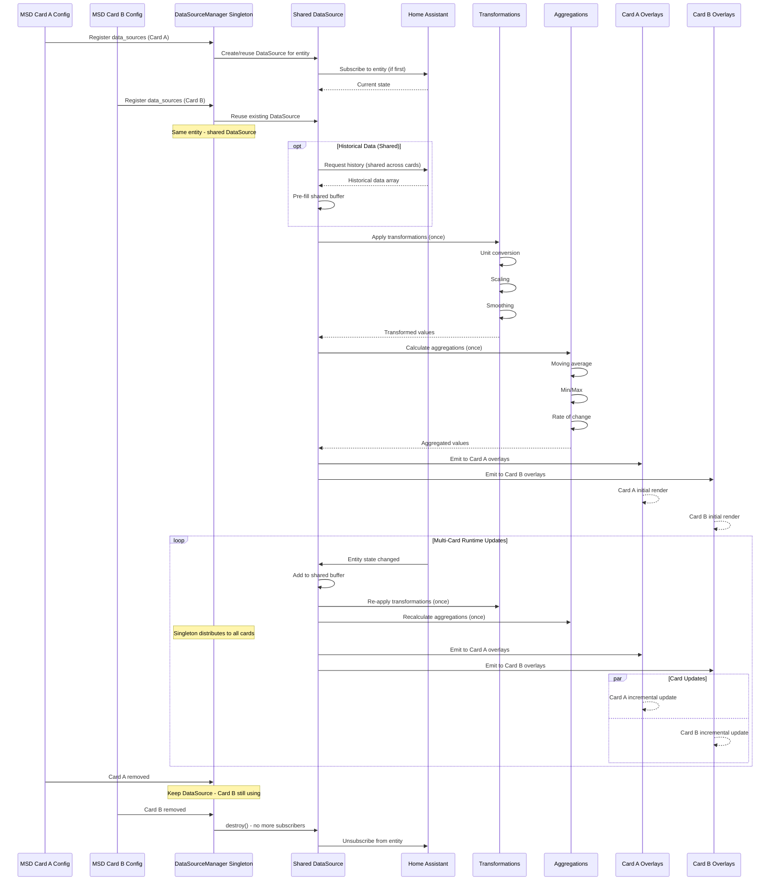
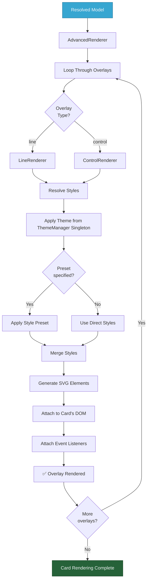
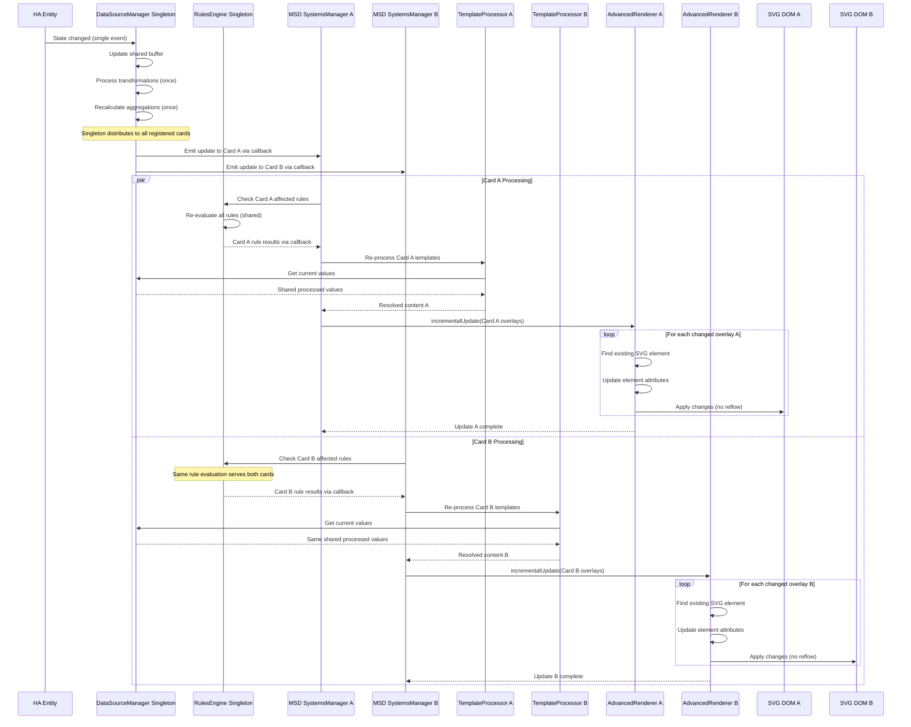
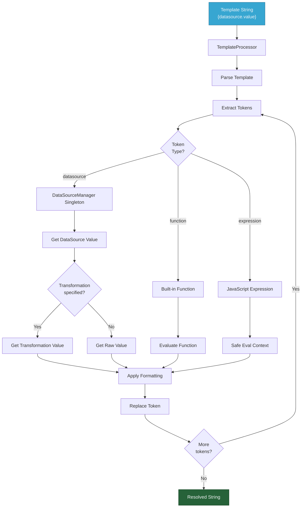
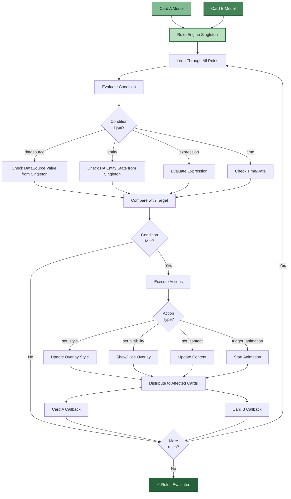
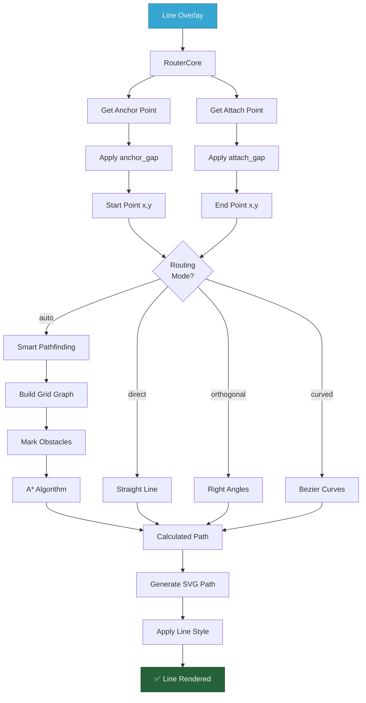

# MSD System Flow & Architecture (Part 2: Runtime & Operations)

> **Runtime operations, rendering, and debugging**
> Continuation of MSD flow documentation covering datasources, rendering, updates, and introspection.

---

## 📋 Table of Contents

### Part 1 (See MSD-flow-part1.md)
1-8. Overview, Architecture, Initialization, Configuration, Packs, Model, Systems

### Part 2 (This Document)
9. [DataSource Lifecycle](#datasource-lifecycle)
10. [Rendering Pipeline](#rendering-pipeline)
11. [Runtime Updates](#runtime-updates)
12. [Template Processing](#template-processing)
13. [Rules Engine Evaluation](#rules-engine-evaluation)
14. [Line Routing](#line-routing)
15. [Debug & Introspection](#debug--introspection)
16. [Performance Characteristics](#performance-characteristics)
17. [Summary](#summary)

---

## DataSource Lifecycle

### Singleton DataSourceManager Multi-Card Coordination



**Singleton DataSource Features:**
- **Shared Subscriptions** - One entity subscription serves multiple cards
- **Coordinated Processing** - Single transformation/aggregation pipeline per entity
- **Multi-Card Distribution** - Processed data distributed to all subscribers
- **Reference Counting** - DataSources destroyed when no cards using them
- **Efficient Resource Usage** - Shared buffers, transformations, and HA connections
- **Historical preload** - Load past data once, share across all cards
- **Time-windowed buffers** - Efficient shared memory management
- **Transformation pipeline** - 50+ processors applied once per entity
- **Aggregation engine** - Statistics calculated once, distributed to all cards

---

## Rendering Pipeline

### SVG Generation Process (Per Card)



**Rendering Steps (Per Card):**
1. **Loop Overlays** - Process each overlay in order for this card
2. **Type Detection** - Identify overlay type
3. **Style Resolution** - Resolve styles from ThemeManager singleton, presets, and user config
4. **SVG Generation** - Create SVG elements for this card
5. **DOM Attachment** - Add elements to this card's SVG container
6. **Event Binding** - Attach click handlers, hover effects
7. **Return to Loop** - Process next overlay

**Renderer Features:**
- **Incremental updates** - Only re-render changed overlays
- **Efficient DOM manipulation** - Minimize reflows
- **Event delegation** - Centralized event handling per card
- **Style caching** - Avoid redundant calculations
- **ViewBox scaling** - Responsive sizing per card

---

## Runtime Updates

### Multi-Card Singleton Coordinated Updates



**Singleton Update Optimization:**
- ✅ **Shared Processing** - Single entity processing serves all cards
- ✅ **Coordinated Rule Evaluation** - Rules evaluated once, distributed via callbacks to all cards
- ✅ **No full re-renders** - Only update changed overlays per card
- ✅ **Parallel Card Updates** - Multiple cards update simultaneously
- ✅ **Minimal DOM manipulation** - Batch updates per card
- ✅ **Efficient diffing** - Track what changed per card
- ✅ **Event coalescing** - Batch rapid updates across all cards
- ✅ **Async processing** - Non-blocking coordinated updates

**Multi-Card Update Triggers:**
- Single entity state change affects multiple cards
- Shared DataSource computed value changes
- Singleton rule re-evaluation distributed to relevant cards
- Cross-card targeting (overlay updates in different cards)
- User interactions with card-to-card effects
- Timer-based updates coordinated across cards

---

## Template Processing

### Template Resolution Flow (Per Card)



**Template Features:**
- **DataSource references** - `{datasource.value}`, `{datasource.transformations.key}` (via DataSourceManager singleton)
- **Aggregation access** - `{datasource.aggregations.avg.value}` (via DataSourceManager singleton)
- **Built-in functions** - `{@round(datasource.value, 1)}`
- **Expressions** - `{datasource.value * 2 + 10}`
- **Formatting** - `{datasource.value:.2f}` (2 decimal places)
- **Safe evaluation** - Sandboxed JavaScript execution

---

## Rules Engine Evaluation

### Singleton Rule Processing with Multi-Card Distribution



**Rule Types:**
- **Conditional styling** - Change colors based on value ranges
- **Visibility control** - Show/hide overlays based on conditions
- **Content updates** - Dynamic text based on state
- **Animation triggers** - Start animations on conditions
- **Multi-condition rules** - AND/OR logic
- **Cross-card targeting** - Rules can affect overlays on any card

**Evaluation Timing:**
- Initial render (per card)
- DataSource updates (singleton distribution)
- Entity state changes (singleton distribution)
- Manual trigger (user action per card)

**Multi-Card Coordination:**
- Rules evaluated once by singleton
- Results distributed to all registered card callbacks
- Each card applies only its relevant rule results

---

## Line Routing

### Path Calculation (Per Card)



**Line Routing Features (Per Card):**
- **9-point attachment** - Any side or corner of any overlay on this card
- **Gap system** - Offset from attachment point
- **Auto routing** - Obstacle avoidance with A*
- **Multiple algorithms** - Direct, orthogonal, curved
- **Dynamic updates** - Recalculate on overlay movement within this card
- **Style control** - Width, color, dashes, arrows

---

## Debug & Introspection

### Debug System (Per Card + Singleton Access)

```mermaid
graph TD
    Debug[Debug System] --> CardDebug[Per-Card Debug]
    Debug --> SingletonDebug[Singleton Debug]

    CardDebug --> Expose[window.lcards.debug.msd]
    Expose --> Pipeline[Pipeline Access]
    Expose --> Systems[Systems Access]
    Expose --> Model[Model Access]
    Expose --> State[State Inspection]

    Pipeline --> ConfigAccess[View Configuration]
    Pipeline --> Provenance[Check Provenance]
    Pipeline --> Issues[View Validation Issues]

    Systems --> MSM[MSD SystemsManager]
    Systems --> Renderer[AdvancedRenderer]
    Systems --> Router[RouterCore]
    Systems --> Template[TemplateProcessor]

    Model --> Overlays[Inspect Overlays]
    Model --> Dependencies[Dependency Graph]
    Model --> Resolved[Resolved Model]

    SingletonDebug --> SingletonAccess[window.lcardsCore]
    SingletonAccess --> DSM[DataSourceManager]
    SingletonAccess --> RE[RulesEngine]
    SingletonAccess --> TM[ThemeManager]
    SingletonAccess --> AM[AnimationManager]

    DSM --> DSSources[View All DataSources]
    DSM --> DSValues[Current Values]
    DSM --> DSHistory[Buffer Contents]

    RE --> AllRules[All Registered Rules]
    RE --> RuleResults[Rule Evaluation Results]

    Debug --> Methods[Debug Methods]
    Methods --> Dump[dumpState]
    Methods --> Trace[traceDataFlow]
    Methods --> Test[testRules]
    Methods --> Validate[validateConfig]

    style Debug fill:#37a6d1,stroke:#2a7193,color:#f3f4f7
    style Methods fill:#266239,stroke:#083717,color:#f3f4f7
```



**Debug Features:**

**Per-Card Console Access:**
```javascript
// Access specific MSD card debug interface
const cardDebug = window.lcards.debug.msd;

// View card configuration
cardDebug.config

// Inspect card's MSD SystemsManager
cardDebug.pipelineInstance.systemsManager

// View card's resolved model
cardDebug.model.computeResolvedModel()

// Inspect card's datasources (registered with singleton)
cardDebug.pipelineInstance.systemsManager.dataSourceManager.dataSources

// View card's overlays
cardDebug.pipelineInstance.systemsManager.renderer.getAllOverlays()

// Dump card's full state
cardDebug.dumpState()
```

**Singleton Console Access:**
```javascript
// Access global singletons
const core = window.lcardsCore;

// View all datasources across all cards
core.dataSourceManager.getAllSources();

// View all rules across all cards
core.rulesEngine.getAllRules();

// Check theme tokens
core.themeManager.getActiveTheme();

// View all registered cards
core.getAllCardInstances();
```

**Debug Methods:**
- `dumpState()` - Export complete card state
- `traceDataFlow(overlayId)` - Track data flow to overlay
- `testRules()` - Dry-run rule evaluation for this card
- `validateConfig()` - Re-validate card configuration
- `inspectDataSource(id)` - View datasource details (singleton)
- `reRender()` - Force full re-render for this card

**Debug Renderers (Per Card):**
- **MsdDebugRenderer** - Overlay bounds, attachment points for this card
- **MsdControlsRenderer** - Runtime controls, config editor for this card

---

## Performance Characteristics

### System Performance

| Aspect | Performance | Notes |
|--------|-------------|-------|
| **First Card Load** | ~150-250ms | Includes singleton initialization |
| **Additional Card Load** | ~50-100ms | Singletons already exist, faster |
| **Initial Render (per card)** | ~50-100ms | Depends on overlay count |
| **DataSource Update (singleton)** | ~1-5ms | Shared processing for all cards |
| **Rule Evaluation (singleton)** | ~0.5-2ms | Single evaluation, distributed to all cards |
| **Incremental Render (per card)** | ~2-10ms | Per changed overlay |
| **Template Processing (per card)** | ~1-3ms | Per template |
| **Line Routing (per card)** | ~5-20ms | Depends on path complexity |
| **Memory Usage (singletons)** | 5-10 MB | Shared across all cards |
| **Memory Usage (per card)** | 3-8 MB | Depends on overlay count |

### Memory Comparison

**Global Singleton Systems (Created Once)**:
- DataSourceManager: ~3 MB (includes all entity buffers)
- RulesEngine: ~2 MB (all rules + evaluation cache)
- ThemeManager: ~1 MB (themes + tokens)
- AnimationManager: ~1 MB (animation registry)
- ValidationService: ~0.5 MB (schemas)
- **Total shared**: ~7.5 MB (one-time cost)

**Per MSD Card Instance**:
- MSD SystemsManager: ~1 MB (coordination)
- AdvancedRenderer: ~1.5 MB (overlay instances + DOM)
- RouterCore: ~0.5 MB (path cache)
- TemplateProcessor: ~0.3 MB (template cache)
- Debug/Control systems: ~0.5 MB
- CardModel: ~0.5 MB (overlay definitions)
- **Total per card**: ~4-5 MB

**Scaling Examples**:
- 1 MSD card: ~7.5 MB (singletons) + ~4.5 MB (card) = **~12 MB**
- 2 MSD cards: ~7.5 MB (singletons) + ~9 MB (cards) = **~16.5 MB**
- 3 MSD cards: ~7.5 MB (singletons) + ~13.5 MB (cards) = **~21 MB**

**Comparison to Legacy Architecture (Pre-Singleton)**:
- 1 MSD card: ~12 MB (no singletons) = **~12 MB** (same)
- 2 MSD cards: ~24 MB (duplicate systems) = **~24 MB** (1.5x more than singleton)
- 3 MSD cards: ~36 MB (duplicate systems) = **~36 MB** (1.7x more than singleton)

**Optimization Techniques:**
- **Shared entity subscriptions** - One HASS subscription per entity across all cards
- **Shared processing** - Transformations/aggregations calculated once
- **Distributed results** - Rule evaluation once, distributed to all cards
- **Event coalescing** - Batch rapid updates
- **Incremental rendering** - No full re-renders per card
- **Style caching** - Avoid redundant calculations per card
- **Buffer windowing** - Automatic old data cleanup (singleton)
- **Lazy evaluation** - Compute only when needed per card

---

## Summary

### Key Pipeline Stages (MSD Cards Only)

1. **Configuration** → Process and validate user config (per MSD card)
2. **Packs** → Load and merge themes, presets, external config (per MSD card)
3. **Model** → Build internal card representation (per MSD card)
4. **Singleton Connection** → Connect to global intelligence systems (per MSD card)
5. **Local Systems** → Initialize card-specific rendering pipeline (per MSD card)
6. **DataSource Integration** → Direct connection to DataSourceManager singleton (MSD cards only)
7. **Rendering** → AdvancedRenderer generates SVG (per MSD card)
8. **Runtime Updates** → Singleton-coordinated entity changes, multi-card distribution

### Architecture Clarifications

**MSD Card Systems (Per-Card):**
- MSD SystemsManager (orchestrator)
- AdvancedRenderer (SVG generation)
- RouterCore (line routing)
- TemplateProcessor (template resolution)
- MsdDebugRenderer (debug overlays)
- MsdControlsRenderer (control overlays)
- MsdHudManager (HUD management)
- BaseOverlayUpdater (incremental updates)

**Shared Singleton Systems (Global):**
- DataSourceManager (entity data, buffers, transformations) - **Used by MSD cards**
- RulesEngine (rule evaluation, distribution) - **Used by all cards**
- ThemeManager (themes, tokens) - **Used by all cards**
- AnimationManager (animation coordination) - **Used by all cards**
- ValidationService (schema validation) - **Used by all cards**
- CoreSystemsManager (entity caching) - **Only used by Simple Cards, NOT MSD**

**Card Type Comparison:**

| Feature | MSD Cards | Simple Cards |
|---------|-----------|-------------------|
| **Systems Manager** | MSD SystemsManager (per-card) | Uses CoreSystemsManager (singleton) |
| **Entity Access** | DataSourceManager (full pipeline) | CoreSystemsManager (cached) |
| **Rendering** | AdvancedRenderer (SVG) | Simple HTML/Lit templates |
| **Memory** | ~4-5 MB per card | ~5 KB per card |
| **Complexity** | High (multi-overlay) | Low (single purpose) |
| **Use Case** | Master systems displays | Buttons, labels, status |

---

**Status:** ✅ MSD/Simple Card architecture clarified
6. **DataSources** → Register with singleton, share entity subscriptions (coordinated)
7. **Resolution** → Resolve templates, evaluate rules (per card + singleton)
8. **Rendering** → Generate SVG from resolved model (per card)
9. **Runtime** → Handle updates incrementally with coordination (multi-card)

### Two-Tier Architecture Benefits

**For Users:**
- ✅ Fast, responsive dashboards
- ✅ Real-time coordinated data updates across all cards
- ✅ Rich visual effects
- ✅ Easy configuration
- ✅ Multiple cards work together efficiently

**For Developers:**
- ✅ Clear separation of concerns (global vs. local)
- ✅ Easy to debug and test
- ✅ Extensible architecture
- ✅ Well-documented pipeline
- ✅ Efficient resource usage

### System Characteristics

- ✅ **Singleton Intelligence** - Shared processing for efficiency
- ✅ **Per-Card Rendering** - Independent, coordinated visual output
- ✅ **Event-driven** - React to HA state changes through singleton distribution
- ✅ **Declarative** - Configuration-first approach
- ✅ **Modular** - Clear subsystem boundaries
- ✅ **Efficient** - Shared subscriptions, incremental updates
- ✅ **Debuggable** - Comprehensive per-card and singleton introspection
- ✅ **Extensible** - Pack system, custom renderers, plugin architecture
- ✅ **Performant** - Optimized for real-time multi-card dashboards

### Multi-Card Coordination Highlights

- **Single Entity Subscription** - One HASS connection serves all cards using that entity
- **Shared Rule Evaluation** - Rules evaluated once, results distributed to all cards
- **Coordinated Updates** - All cards receive updates simultaneously but render independently
- **Cross-Card Targeting** - Rules can affect overlays on any card
- **Efficient Cleanup** - Card removal doesn't affect singletons or other cards
- **Resource Pooling** - Shared caches, buffers, and processing pipelines

---

## 🎨 MSD + Simple Cards Together

### Hybrid Dashboard Pattern

The recommended architecture combines MSD cards for complex layouts with embedded Simple Cards for interactive elements:

```yaml
# MSD card with embedded Simple Cards
type: custom:lcards-msd-card
base_svg:
  source: "none"
view_box: [0, 0, 1200, 800]

# Shared data sources (registered globally)
data_sources:
  temperature:
    entity: sensor.temperature
    window_seconds: 3600
    history: { preload: true, hours: 6 }

overlays:
  # Complex chart using SimpleChart
  - id: temp_chart
    type: control
    position: [50, 50]
    size: [400, 250]
    card:
      type: custom:lcards-simple-chart
      source: sensor.temperature    # Can use entity directly
      chart_type: area
      height: 250

  # Interactive button using SimpleButton
  - id: hvac_control
    type: control
    position: [500, 50]
    size: [200, 80]
    card:
      type: custom:lcards-simple-button
      entity: climate.hvac
      label: "HVAC Control"
      preset: lozenge

  # Status indicator
  - id: status_button
    type: control
    position: [500, 150]
    size: [150, 50]
    card:
      type: custom:lcards-simple-button
      entity: binary_sensor.system_ok
      label: "Status"

  # Line connecting chart to controls
  - id: chart_to_hvac
    type: line
    anchor: temp_chart
    anchor_side: right
    anchor_gap: 10
    attach_to: hvac_control
    attach_side: left
    attach_gap: 10
    style:
      color: var(--lcars-cyan)
      width: 2
      corner_style: round
      corner_radius: 12

# Shared rules (apply to all cards)
rules:
  - id: high_temp_alert
    when:
      all:
        - entity: sensor.temperature
          above: 80
    apply:
      overlays:
        - id: chart_to_hvac
          style:
            color: var(--lcars-red)
            width: 4
```

### Architecture Diagram

```mermaid
graph TB
    subgraph "Dashboard"
        subgraph "MSD Card"
            MSD[MSD Container<br/>SVG viewBox]
            L1[Line Overlay]
            L2[Line Overlay]

            subgraph "Control Overlays (foreignObject)"
                C1[SimpleChart<br/>(lightweight)]
                C2[SimpleButton<br/>(lightweight)]
                C3[SimpleButton<br/>(lightweight)]
            end

            L1 --> C1
            L1 --> C2
            L2 --> C3
        end

        subgraph "Standalone Simple Cards"
            S1[SimpleButton]
            S2[SimpleButton]
        end
    end

    subgraph "Global Singletons"
        DSM[DataSourceManager<br/>Shared data sources]
        RE[RulesEngine<br/>Shared rules]
        TM[ThemeManager<br/>Shared themes]
    end

    MSD --> DSM
    C1 --> DSM
    C2 --> RE
    S1 --> RE
    S2 --> TM

    style MSD fill:#80bb93,stroke:#083717
    style C1,C2,C3 fill:#458359,stroke:#095320
    style S1,S2 fill:#458359,stroke:#095320
    style DSM,RE,TM fill:#b8e0c1,stroke:#266239
```

### Benefits of Hybrid Approach

| Feature | MSD Alone | Simple Cards Alone | MSD + Simple Cards |
|---------|-----------|--------------------|--------------------|
| **Layout Control** | ✅ Full SVG layout | ❌ HA grid only | ✅ Full SVG layout |
| **Line Routing** | ✅ Intelligent routing | ❌ Not supported | ✅ Connect to embedded cards |
| **Memory Per Card** | ~4-5 MB | ~5 KB | ~4-5 MB + minimal overhead |
| **Interactive Elements** | ✅ Control overlays | ✅ Native | ✅ Best of both |
| **Performance** | Good | Excellent | Good + lightweight elements |
| **Complexity** | High | Low | Moderate |

### When to Use

**Use MSD for:**
- Overall dashboard layout and structure
- SVG-based backgrounds and decoration
- Line routing between components
- Complex multi-overlay displays

**Use Simple Cards (embedded or standalone) for:**
- Interactive buttons and controls
- Charts and data visualization
- Status displays
- Anything that benefits from lightweight rendering

---

**Related Documentation:**
- **[MSD SystemsManager](../subsystems/msd-systems-manager.md)** - Per-card orchestration
- **[DataSource System](../subsystems/datasource-system.md)** - Data processing
- **[Advanced Renderer](../subsystems/advanced-renderer.md)** - SVG generation
- **[Pack System](../subsystems/pack-system.md)** - Configuration merging
- **[Rules Engine](../subsystems/rules-engine.md)** - Conditional logic
- **[Template Processor](../subsystems/template-processor.md)** - String resolution
- **[Architecture Overview](../overview.md)** - Complete system architecture

---

**Status:** ✅ MSD/Simple Card architecture clarified
