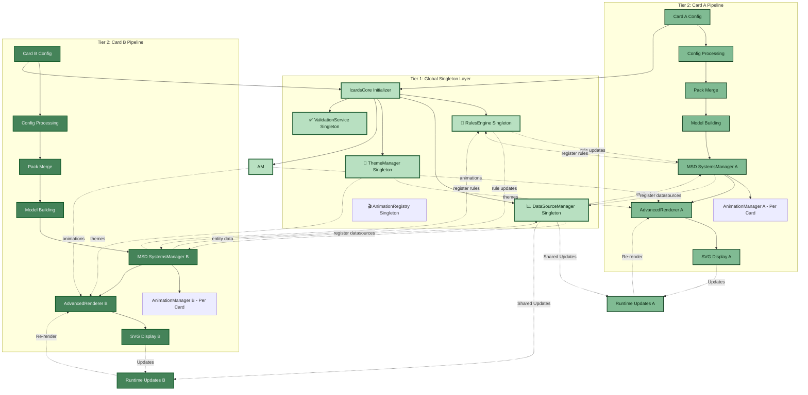
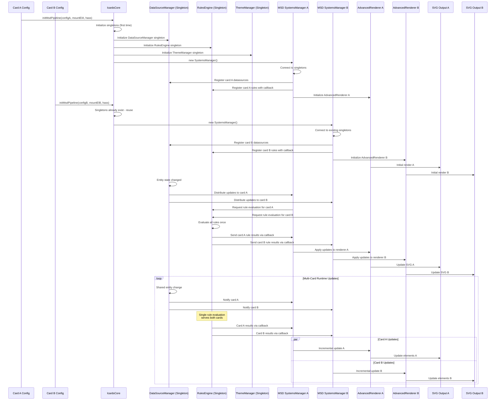
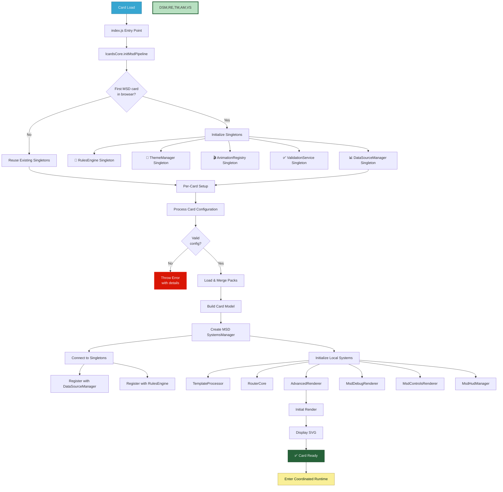
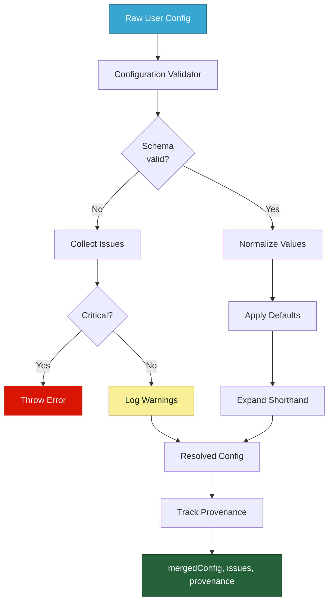
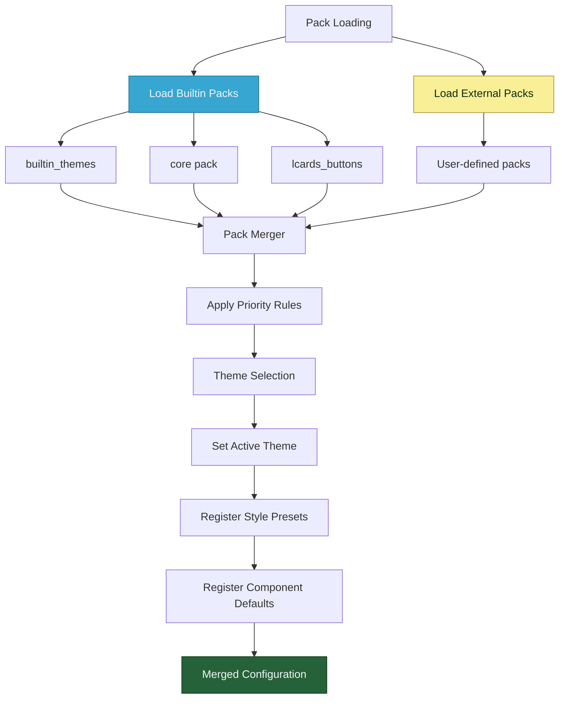
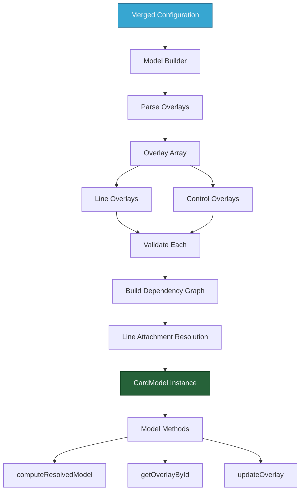
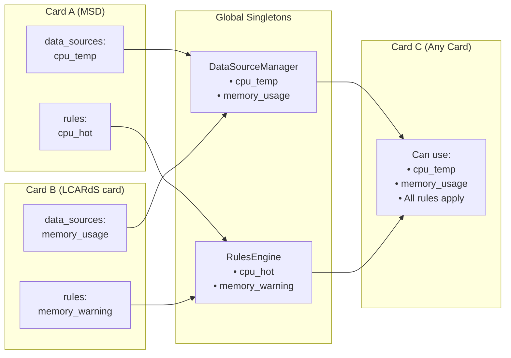

# MSD System Flow & Architecture (Part 1: Core & Initialization)

> **Complete data flow from configuration to rendering with singleton coordination**
> A detailed guide to how LCARdS MSD cards initialize, connect to shared systems, and coordinate multi-card rendering.

---

## 📋 Table of Contents

### Part 1 (This Document)
1. [Overview](#overview)
2. [Two-Tier Architecture](#two-tier-architecture)
3. [Complete Pipeline Flow](#complete-pipeline-flow)
4. [Initialization Sequence](#initialization-sequence)
5. [Configuration Processing](#configuration-processing)
6. [Pack System](#pack-system)
7. [Model Building](#model-building)
8. [Systems Initialization](#systems-initialization)

### Part 2 (See MSD-flow-part2.md)
9. DataSource Lifecycle
10. Rendering Pipeline
11. Runtime Updates
12. Template Processing
13. Rules Engine Evaluation
14. Line Routing
15. Debug & Introspection
16. Performance Characteristics

---

## Overview

The MSD (Master Systems Display) system follows a **two-tier architecture**: global singleton intelligence systems shared across all cards, and per-card MSD SystemsManagers that orchestrate individual card rendering.

### Architecture Summary

**Tier 1: Global Singleton Layer**
- Shared intelligence systems (RulesEngine, DataSourceManager, ThemeManager, AnimationRegistry)
- CoreSystemsManager (for LCARdS Cards only - MSD cards do NOT use this)
- Created once on first card initialization (MSD or LCARdS Card)
- Serves all cards simultaneously
- Efficient resource usage through shared processing

**Tier 2: Per-Card Instance Layer**
- Each MSD card creates its own MSD SystemsManager (per-card instance)
- Each card creates its own AnimationManager (per-card instance)
- LCARdS Cards do NOT use MSD SystemsManager
- Card-specific rendering pipeline (AdvancedRenderer, RouterCore, etc.) - MSD cards only
- Connects to singleton layer for shared intelligence
- Independent rendering but coordinated updates

**Important Distinction:**
- **MSD Cards** → Use DataSourceManager singleton directly (bypass CoreSystemsManager)
- **LCARdS Cards** → Use CoreSystemsManager singleton for entity caching (lighter weight)
- Both leverage shared RulesEngine singleton, ThemeManager singleton, AnimationRegistry singleton
- AnimationManager is per-card (not singleton) - works with singleton AnimationRegistry for caching

### Key Characteristics

- 🌐 **Singleton Intelligence** - Shared systems across all cards
- 🎯 **Multi-Card Support** - Multiple MSD cards coexist with coordinated updates
- 🔄 **Event-driven** - Responds to HA entity changes through singleton distribution
- 📦 **Modular** - Clear separation between global intelligence and per-card rendering
- ⚡ **Efficient** - Shared processing, incremental updates, coordinated cross-card updates
- 🎯 **Declarative** - Configuration-first approach with singleton-aware targeting
- 🔍 **Debuggable** - Comprehensive introspection tools with singleton state visibility

---

## Two-Tier Architecture

### Architecture Diagram



---

## Complete Pipeline Flow

### End-to-End Multi-Card System Flow



**Pipeline Flow Summary:**
1. **Singleton Initialization** - lcardsCore creates shared intelligence systems (first card only)
2. **Card Registration** - Each card creates MSD SystemsManager, registers with singletons
3. **Configuration Processing** - Per-card config validation and pack merging
4. **Model Building** - Each card builds its internal overlay representation
5. **Systems Coordination** - MSD SystemsManager connects to singletons, creates local systems
6. **Shared Processing** - Singletons process data once, distribute to all cards
7. **Distributed Rendering** - Each card renders independently with shared intelligence
8. **Coordinated Runtime** - Entity changes trigger singleton evaluation, distributed updates

---

## Initialization Sequence

### Two-Tier Initialization



**Initialization Steps:**
1. **Entry Point** - `index.js` exports `initMsdPipeline`, calls `lcardsCore`
2. **Singleton Check** - First card creates global singletons, subsequent cards reuse
3. **Singleton Creation** - DataSourceManager, RulesEngine, ThemeManager, AnimationManager, ValidationService (first card only)
4. **Per-Card Setup** - Each card creates its own MSD SystemsManager instance
5. **Singleton Connection** - MSD SystemsManager connects to existing singletons
6. **Card Registration** - Register datasources and rules with appropriate singletons
7. **Local Systems** - Initialize card-specific systems (TemplateProcessor, AdvancedRenderer, RouterCore, etc.)
8. **Initial Render** - Generate first SVG output with singleton intelligence
9. **Coordinated Runtime** - Enter multi-card event-driven mode with shared processing

---

## Configuration Processing

### Config Validation & Normalization



**Configuration Stages:**
1. **Schema Validation** - Check against JSON schema (ValidationService singleton)
2. **Normalization** - Convert shorthand to full format
3. **Default Application** - Fill in missing values
4. **Issue Collection** - Track warnings and errors
5. **Provenance Tracking** - Record where each value came from

**Validation Features:**
- Required field checking
- Type validation
- Range validation
- Dependency validation
- Custom validators per overlay type

---

## Pack System

### Pack Loading & Merging



**Pack Types:**
- **builtin_themes** - Theme definitions (always loaded, managed by ThemeManager singleton)
- **core** - Core overlays and defaults
- **lcards_buttons** - LCARS button presets
- **external** - User-provided packs from URLs

**Merge Priority:**
1. Builtin packs (lowest priority)
2. External packs
3. User configuration (highest priority)

**What Packs Provide:**
- Theme tokens and component defaults (via ThemeManager singleton)
- Style presets (e.g., LCARS button styles)
- Reusable overlay templates
- Animation definitions (via AnimationManager singleton)

---

## Model Building

### Card Model Construction



**Model Building Process:**
1. **Parse Overlays** - Convert config to overlay objects
2. **Type Validation** - Ensure each overlay has valid type
3. **Dependency Analysis** - Build graph of overlay relationships
4. **Line Resolution** - Resolve line attachment points
5. **Model Creation** - Instantiate CardModel with all overlays

**CardModel Features:**
- Stores all overlay definitions for this card
- Tracks overlay dependencies (e.g., lines attached to overlays)
- Provides query methods (getOverlayById, getOverlaysByType)
- Caches resolved model for performance
- Supports incremental updates

---

## Systems Initialization

### MSD SystemsManager + Singleton Coordination

```mermaid
graph TD
    subgraph "Global Singleton Layer (First Card Only)"
        LC[lcardsCore] --> DSM[📊 DataSourceManager Singleton]
        LC --> RE[🧠 RulesEngine Singleton]
        LC --> TM[🎨 ThemeManager Singleton]
        LC --> AR[🎬 AnimationRegistry Singleton]
        LC --> VS[✅ ValidationService Singleton]

        DSM --> Entities[Subscribe to HA Entities]
        DSM --> History[Preload History]
        DSM --> Buffer[Initialize Entity Buffers]

        RE --> RuleStore[Initialize Rule Store]
        RE --> Callbacks[Setup Callback Arrays]

        TM --> Tokens[Load Theme Tokens]
        TM --> Defaults[Component Defaults]

        AR --> Cache[Initialize Animation Cache]
        AR --> Presets[Load Animation Presets]
    end

    subgraph "Per-Card Layer (Each MSD Card)"
        MSM[MSD SystemsManager] --> RegisterDS[Register DataSources with Singleton]
        MSM --> RegisterRE[Register Rules with Singleton]
        MSM --> AnimMgr[Create AnimationManager - Per Card]
        MSM --> LocalInit[Initialize Local Systems]

        RegisterDS --> DSM
        RegisterRE --> RE
        AnimMgr --> AR

        LocalInit --> Template[TemplateProcessor]
        LocalInit --> Router[RouterCore]
        LocalInit --> Renderer[AdvancedRenderer]
        LocalInit --> Debug[MsdDebugRenderer]
        LocalInit --> Controls[MsdControlsRenderer]
        LocalInit --> HUD[MsdHudManager]
        LocalInit --> Updater[BaseOverlayUpdater]

        Template --> BuiltInFuncs[Register Built-in Functions]
        Router --> PathLib[Initialize Path Library]
        Renderer --> SVG[Setup SVG Namespace]
        Renderer --> OverlayRenderers[Initialize Overlay Renderers]
    end

    Renderer --> Ready[✅ Card Systems Ready]

    classDef singleton fill:#b8e0c1,stroke:#266239,stroke-width:3px,color:#0c2a15
    classDef cardLocal fill:#80bb93,stroke:#083717,stroke-width:2px,color:#0c2a15

    class LC,DSM,RE,TM,AM,VS,Entities,History,Buffer,RuleStore,Callbacks,Tokens,Defaults,Registry,Triggers singleton
    class MSM,RegisterDS,RegisterRE,RegisterAM,LocalInit,Template,Router,Renderer,Debug,Controls,HUD,Updater,BuiltInFuncs,PathLib,SVG,OverlayRenderers cardLocal
```



**MSD SystemsManager Role:**
- **Singleton Connection** - Connects to existing global singletons (does NOT create them)
- **Registration Bridge** - Registers card's datasources/rules with singletons
- **Local System Management** - Creates and manages card-specific rendering systems
- **Callback Coordination** - Receives updates from singletons via registered callbacks
- **Per-Card Cleanup** - Handles card removal without affecting singletons or other cards

**System Types:**

**Global Singleton Systems (Shared):**
1. **DataSourceManager** - Entity subscriptions shared across all MSD cards
2. **RulesEngine** - Rule evaluation with callback distribution to all MSD cards
3. **ThemeManager** - Theme tokens and defaults available to all MSD cards
4. **AnimationManager** - Animation coordination shared across all MSD cards
5. **ValidationService** - Schema validation shared across all MSD cards

**Per-Card Local Systems:**
1. **TemplateProcessor** - Card-specific template resolution
2. **RouterCore** - Card-specific line path calculation
3. **AdvancedRenderer** - Card-specific SVG generation
4. **MsdDebugRenderer** - Card-specific debug overlays
5. **MsdControlsRenderer** - Card-specific control overlays
6. **MsdHudManager** - Card-specific HUD management
7. **BaseOverlayUpdater** - Card-specific incremental updates

**Key Point**: MSD cards do **NOT** use CoreSystemsManager. They bypass it entirely and connect directly to the singleton layer (DataSourceManager, RulesEngine, etc.). CoreSystemsManager is only for LCARdS Cards.

---

## 🔗 Global Data Source and Rules Publication

### Any Card Can Define Data Sources and Rules

A key architectural feature: **data sources and rules defined in any card are registered with global singletons**, making them available system-wide.



**How It Works:**

1. **Card defines data sources** → Registered with `DataSourceManager` singleton
2. **Card defines rules** → Registered with `RulesEngine` singleton
3. **All cards receive** → Updates from shared data sources and rule evaluations
4. **No duplication** → Same entity subscription serves all cards

**Example: Shared Data Source**

```yaml
# Card A (MSD) defines a data source
type: custom:lcards-msd-card
data_sources:
  temperature:
    entity: sensor.temperature
    window_seconds: 3600
    history:
      preload: true
      hours: 6

# Card B (LCARdS card) can reference the same data
# via template syntax: {temperature.v} or {temperature.aggregations.avg}
```

**Example: Cross-Card Rules**

```yaml
# Card A defines a rule
rules:
  - id: global_alert
    when:
      all:
        - entity: binary_sensor.alarm
          state: 'on'
    apply:
      base_svg:
        filter_preset: red-alert

# This rule affects Card A directly
# Other cards on the dashboard get rule updates too
# Each card applies its own applicable rules
```

**Benefits:**

- ✅ **No duplicate subscriptions** - One Home Assistant connection per entity
- ✅ **Consistent state** - All cards see the same entity state
- ✅ **Shared processing** - Transformations and aggregations computed once
- ✅ **Flexible architecture** - Define data sources where convenient, use anywhere

---

## 📚 Related Documentation

- **[MSD SystemsManager](../subsystems/msd-systems-manager.md)** - Per-card orchestrator for MSD cards
- **[CoreSystemsManager](../subsystems/core-systems-manager.md)** - Lightweight singleton for LCARdS Cards
- **[Architecture Overview](../overview.md)** - Complete system architecture
- **[DataSource System](../subsystems/datasource-system.md)** - Data processing pipeline
- **[Advanced Renderer](../subsystems/advanced-renderer.md)** - SVG rendering engine

---

**Status:** ✅ Singleton extraction complete, CoreSystemsManager integrated with LCARdS Cards
