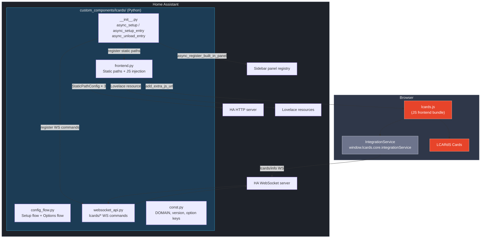

# HA Integration Architecture

LCARdS ships as a **HACS Integration** (`custom_components/lcards/`). This page covers the Python-side architecture — how the integration boots, what it registers in Home Assistant, and how it hands off to the JavaScript frontend.

---

## Two-Layer Architecture



---

## Python Component Files

| File | Responsibility |
|------|---------------|
| `__init__.py` | Entry point — wires up static paths, JS injection, sidebar panel, storage init, WS commands, log level, and options update listener |
| `frontend.py` | Registers static HTTP paths and injects `lcards.js` (with `?log=` param) into every HA frontend session |
| `config_flow.py` | Initial setup flow (single-instance, no user input) + options flow (panel, log level, sidebar customisation) |
| `websocket_api.py` | Registers `lcards/info` and all `lcards/storage/*` WebSocket commands |
| `storage.py` | `LCARdSStorage` — HA Store-backed flat key/value persistence (`.storage/lcards`) |
| `const.py` | Shared constants: `DOMAIN`, `DOMAIN_VERSION`, option keys, `_LOG_LEVEL_MAP` |
| `manifest.json` | HACS/HA integration manifest — domain, version (HA CalVer), dependencies |
| `strings.json` + `translations/en.json` | UI strings for the config and options dialog |

---

## Boot Sequence

HA calls the integration in two phases:

### Phase 1 — `async_setup()` (HA start, before config entry)

Runs at HA startup before any config entry is loaded. Registers infrastructure that must be available immediately:

1. **Static paths** (via `frontend.py`) — three paths registered:
   - `/lcards/lcards.js` → `custom_components/lcards/lcards.js`
   - `/lcards/lcards.js.map` → `custom_components/lcards/lcards.js.map`
   - `/hacsfiles/lcards/` → `custom_components/lcards/` (alias for asset URLs)
2. **WebSocket commands** — `lcards/info` registered so the JS probe works even before setup

### Phase 2 — `async_setup_entry()` (config entry active)

Runs when the integration is configured (after initial setup or on restart):

1. **Log level** — maps the `log_level` option to a Python `logging` level and calls `setLevel()` on the `custom_components.lcards` parent logger, cascading to all child loggers
2. **Storage init** — creates `LCARdSStorage`, loads `.storage/lcards` from disk, stores the instance at `hass.data["lcards"]["storage"]`
3. **JS injection** — `add_extra_js_url` loads `lcards.js?v=...&log=<level>` on every HA page; the `?log=` param lets `lcards.js` read the configured level at module load time via `import.meta.url`
4. **Lovelace resource** — registers the script for Cast / kiosk support
5. **Sidebar panel** — `async_register_built_in_panel` with the configured title and icon, if `show_panel` option is `True`
6. **Options listener** — `entry.add_update_listener()` triggers an entry reload when the user saves new options, applying changes without an HA restart

### Unload — `async_unload_entry()`

Called on HA restart, explicit reload (triggered by options change), or removal:

1. Removes `add_extra_js_url` injection
2. Removes the Lovelace resource
3. Removes the sidebar panel

`async_remove_entry()` is a no-op — `async_unload_entry` handles all cleanup.

---

## Static Paths

Three paths are served from the same `custom_components/lcards/` directory:

| URL path | Serves | Purpose |
|----------|--------|---------|
| `/lcards/lcards.js` | `lcards.js` | Main JS bundle — loaded by `add_extra_js_url` |
| `/lcards/lcards.js.map` | `lcards.js.map` | Source map for browser devtools stack traces |
| `/hacsfiles/lcards/*` | Whole `custom_components/lcards/` dir | Asset alias — all hardcoded font/SVG/sound URLs in the JS bundle reference this prefix |

The `/hacsfiles/lcards/` alias means the JS bundle's asset URLs (`/hacsfiles/lcards/fonts/...`, `/hacsfiles/lcards/msd/...`, `/hacsfiles/lcards/sounds/...`) resolve without any JS changes, regardless of whether HACS itself is installed.

---

## Config & Options Flow

LCARdS enforces a single-instance constraint (`async_set_unique_id(DOMAIN)`). The initial setup form requires no user input — clicking through is sufficient.

After setup, users configure options via **Settings → Integrations → LCARdS → Configure**:

| Option key | `const.py` constant | Default | Effect |
|------------|---------------------|---------|--------|
| `show_panel` | `CONF_SHOW_PANEL` | `True` | Register or remove the sidebar panel |
| `sidebar_title` | `CONF_SIDEBAR_TITLE` | `"LCARdS Config"` | Sidebar label text |
| `sidebar_icon` | `CONF_SIDEBAR_ICON` | `"mdi:space-invaders"` | Sidebar icon (MDI name) |
| `log_level` | `CONF_LOG_LEVEL` | `"warn"` | Frontend + backend verbosity — see [Logging](#logging) below |

All changes applied immediately via entry reload — no HA restart required.

---

## WebSocket API

The integration registers WebSocket commands under the `lcards/*` namespace via `websocket_api.py`. Commands registered in `async_setup()` (before the config entry) are available immediately after HA start.

### `lcards/info`

Backend probe — registered in `async_setup()` so it is always available.

| Command | Registered | Response |
|---|---|---|
| `lcards/info` | `async_setup()` | `{ available: true, version: "..." }` |

Used by `IntegrationService` on the JS side to detect backend presence. → See [Integration Service](subsystems/integration-service).

### `lcards/storage/*`

Persistent key/value store — registered in `async_setup()`, but requires the storage instance (initialised in `async_setup_entry()`) to respond.

| Command | Parameters | Response |
|---|---|---|
| `lcards/storage/get` | `key?: string` | `{ key, value }` — value is `null` for missing key |
| `lcards/storage/set` | `data: { [key]: value }` | `{ ok: true, keys: [...] }` |
| `lcards/storage/delete` | `key: string` | `{ ok: true, existed: bool }` |
| `lcards/storage/reset` | — | `{ ok: true }` |
| `lcards/storage/dump` | — | `{ version: 1, data: { ... } }` |

→ Full reference including browser console test snippets: [Persistent Storage](subsystems/storage).

---

## Logging

All integration Python files use `logging.getLogger(__name__)` — the logger hierarchy is `custom_components.lcards.*`.

The `log_level` option controls **both** frontend and backend verbosity:

- **Frontend** — `log_level` is appended as `?log=<level>` to the `add_extra_js_url` script URL. `lcards.js` reads it from `import.meta.url` at module load time (before the banner). The page URL parameter `?lcards_log_level=` overrides it for the current session.
- **Backend** — `async_setup_entry()` maps the level string to a Python `logging` level via `_LOG_LEVEL_MAP` and calls `setLevel()` on `custom_components.lcards`, cascading to all child loggers.

| lcards level | Python level |
|---|---|
| `off` | `CRITICAL + 1` (effectively silent) |
| `error` | `ERROR` |
| `warn` | `WARNING` |
| `info` | `INFO` |
| `debug` | `DEBUG` |
| `trace` | `DEBUG` |

You can also override the Python log level independently via `configuration.yaml`:

```yaml
logger:
  logs:
    custom_components.lcards: debug
```

---

## Build & Dev Workflow

The integration build outputs directly into `custom_components/lcards/`:

```bash
npm run build:integration
# = vite build --mode integration && node scripts/copy-assets.js
# Outputs:
#   custom_components/lcards/lcards.js
#   custom_components/lcards/lcards.js.map
#   custom_components/lcards/fonts/   (from src/assets/fonts/)
#   custom_components/lcards/msd/     (from src/assets/msd/)
#   custom_components/lcards/sounds/  (from src/assets/sounds/)
```

In the devcontainer, `custom_components/lcards/` is bind-mounted into the HA core workspace, so a build is picked up immediately. A browser hard-refresh (`Ctrl+Shift+R`) applies JS changes; Python changes require a full HA restart.

---

## CI / Release Pipeline

The `release.yml` GitHub Actions workflow handles versioning and packaging:

1. Tag push or `workflow_dispatch` with a version string triggers the workflow
2. Version is normalised to HA CalVer (no leading zeros, no pre-release suffix) and stamped into `manifest.json`; the full tag is kept in `const.py`
3. `npm run build:integration` produces the complete integration directory
4. `custom_components/lcards/` is zipped as `lcards.zip` (excluding `__pycache__`, `.pyc`)
5. A GitHub release is created with the zip attached

HACS downloads this zip and extracts it into `custom_components/lcards/` on the user's HA instance.
