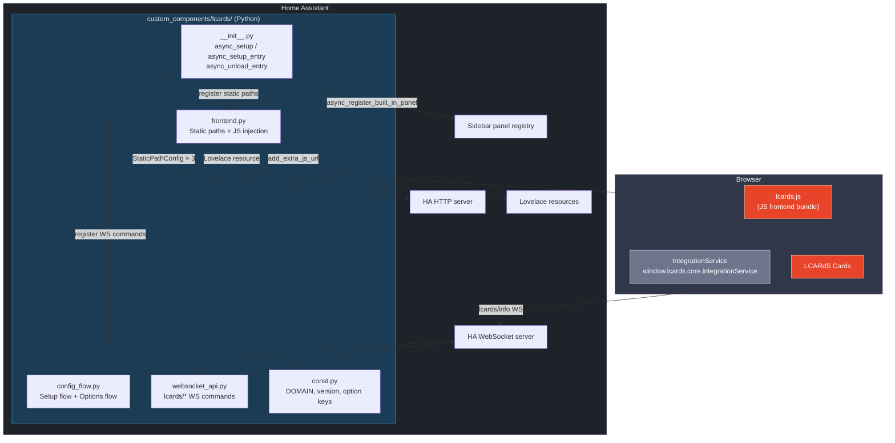
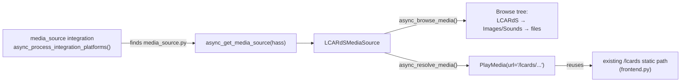
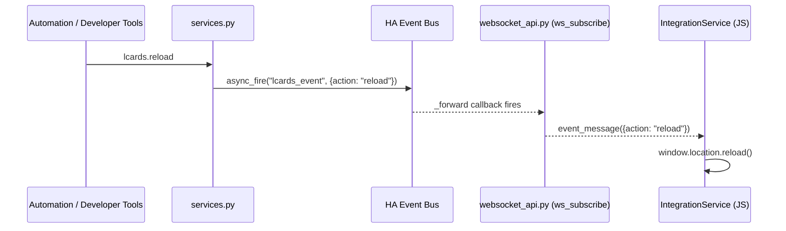

# HA Integration Architecture

LCARdS ships as a **HACS Integration** (`custom_components/lcards/`). This page covers the Python-side architecture — how the integration boots, what it registers in Home Assistant, and how it hands off to the JavaScript frontend.

---

## Two-Layer Architecture


```mermaid
graph TB
    subgraph HA["Home Assistant"]
        subgraph Integration["custom_components/lcards/ (Python)"]
            Init["__init__.py\nasync_setup / async_setup_entry\nasync_unload_entry"]
            Frontend["frontend.py\nStatic paths + JS injection"]
            ConfigFlow["config_flow.py\nSetup flow + Options flow"]
            WS["websocket_api.py\nlcards/* WS commands"]
            Const["const.py\nDOMAIN, version, option keys"]
        end
        HTTP["HA HTTP server"]
        WSSrv["HA WebSocket server"]
        Lovelace["Lovelace resources"]
        Sidebar["Sidebar panel registry"]
    end

    subgraph Browser["Browser"]
        lcards_js["lcards.js\n(JS frontend bundle)"]
        IntSvc["IntegrationService\nwindow.lcards.core.integrationService"]
        Cards["LCARdS Cards"]
    end

    Init -->|"register static paths"| Frontend
    Init -->|"register WS commands"| WS
    Frontend -->|"StaticPathConfig × 3"| HTTP
    Frontend -->|"add_extra_js_url"| lcards_js
    Frontend -->|"Lovelace resource"| Lovelace
    Init -->|"async_register_built_in_panel"| Sidebar
    WS --> WSSrv

    lcards_js --> IntSvc
    IntSvc -->|"lcards/info WS"| WSSrv
    WSSrv --> WS
    lcards_js --> Cards

    style Integration fill:#1c3c55,stroke:#37a6d1,color:#eee
    style Browser fill:#2f3749,stroke:#52596e,color:#eee
    style HA fill:#1e2229,stroke:#2f3749,color:#eee
    style lcards_js fill:#e7442a,stroke:#ffb399,color:#fff
    style IntSvc fill:#6d748c,stroke:#d2d5df,color:#fff
    style Cards fill:#e7442a,stroke:#ffb399,color:#fff
```

---

## Python Component Files

| File | Responsibility |
|------|---------------|
| `__init__.py` | Entry point — wires up static paths, JS injection, sidebar panel, storage init, WS commands, services, log level, and options update listener |
| `frontend.py` | Registers static HTTP paths and injects `lcards.js` (with `?log=` param) into every HA frontend session |
| `config_flow.py` | Initial setup flow (single-instance, no user input) + options flow (panel, log level, sidebar customisation) |
| `websocket_api.py` | Registers `lcards/info`, `lcards/subscribe`, and all `lcards/storage/*` WebSocket commands |
| `media_source.py` | `MediaSource` platform — exposes bundled `images/`/`sounds/` as a browsable "LCARdS" folder in HA's native media browser (auto-discovered, no explicit wiring) |
| `storage.py` | `LCARdSStorage` — HA Store-backed flat key/value persistence (`.storage/lcards`) |
| `services.py` | Registers the `lcards.*` HA action namespace — 16 services covering alert modes, frontend control, screen effects, sound, portal overlays, and the Borg Easter egg |
| `services.yaml` | Action descriptions and field selectors shown in Developer Tools → Actions |
| `const.py` | Shared constants: `DOMAIN`, `DOMAIN_VERSION`, option keys, `_LOG_LEVEL_MAP` |
| `manifest.json` | HACS/HA integration manifest — domain, version (HA CalVer), dependencies |
| `strings.json` + `translations/en.json` | UI strings for the config and options dialog |

---

## Boot Sequence

HA calls the integration in two phases:

### Phase 1 — `async_setup()` (HA start, before config entry)

Runs at HA startup before any config entry is loaded. Registers infrastructure that must be available immediately:

1. **Static paths** (via `frontend.py`) — single directory registration:
   - `/lcards/` → `custom_components/lcards/` (serves bundle, source map, and all asset subdirectories)
2. **WebSocket commands** — `lcards/info` registered so the JS probe works even before setup

### Phase 2 — `async_setup_entry()` (config entry active)

Runs when the integration is configured (after initial setup or on restart):

1. **Log level** — maps the `log_level` option to a Python `logging` level and calls `setLevel()` on the `custom_components.lcards` parent logger, cascading to all child loggers
2. **Storage init** — creates `LCARdSStorage`, loads `.storage/lcards` from disk, stores the instance at `hass.data["lcards"]["storage"]`
3. **Services** — `async_setup_services(hass)` registers the full `lcards.*` action namespace (16 services)
4. **JS injection** — `add_extra_js_url` loads `lcards.js?v=...&log=<level>` on every HA page; the `?log=` param lets `lcards.js` read the configured level at module load time via `import.meta.url`
5. **Lovelace resource** — registers the script for Cast / kiosk support
6. **Sidebar panel** — `async_register_built_in_panel` with the configured title and icon, if `show_panel` option is `True`
7. **Options listener** — `entry.add_update_listener()` triggers an entry reload when the user saves new options, applying changes without an HA restart

### Unload — `async_unload_entry()`

Called on HA restart, explicit reload (triggered by options change), or removal:

1. **Services** — `async_remove_services(hass)` deregisters all `lcards.*` services
2. Removes `add_extra_js_url` injection
3. Removes the Lovelace resource
4. Removes the sidebar panel

`async_remove_entry()` is a no-op — `async_unload_entry` handles all cleanup.

---

## Static Paths

A single directory registration serves the entire `custom_components/lcards/` directory:

| URL path | Serves | Purpose |
|----------|--------|---------|
| `/lcards/lcards.js` | `lcards.js` | Main JS bundle — loaded by `add_extra_js_url` |
| `/lcards/lcards.js.map` | `lcards.js.map` | Source map for browser devtools stack traces |
| `/lcards/fonts/*` | `fonts/` | LCARS typography assets |
| `/lcards/sounds/*` | `sounds/` | Bundled audio packs |
| `/lcards/msd/*` | `msd/` | Ship SVG files for MSD cards |
| `/lcards/images/*` | `images/` | Built-in image library |
| `/lcards/brand/*` | `brand/` | Brand icons and graphics |

All asset URLs in the JS bundle reference the `/lcards/` prefix, which maps directly to `custom_components/lcards/` via the integration's static path registration.

---

## Media Source Platform

`media_source.py` exposes the bundled `images/` and `sounds/` directories as a browsable, read-only **"LCARdS"** folder inside Home Assistant's native media browser — the Media sidebar panel, any media-picker dialog, and every `ha-selector` of type `media` (including the ones LCARdS's own editors use, see [Asset Manager — media-source:// Resolution Flow](subsystems/asset-manager#media-source-resolution-flow)).

**Discovery is automatic and requires no explicit registration call** — HA's `media_source` integration scans every loaded integration for a `media_source.py` module exposing `async_get_media_source(hass)` (via `homeassistant.helpers.integration_platform.async_process_integration_platforms`), which sets `hass.data[MEDIA_SOURCE_DATA]["lcards"]`. No `manifest.json` dependency is strictly required for discovery; LCARdS declares `"after_dependencies": ["media_source"]` defensively, purely to order its own setup after `media_source`'s HTTP views/WS commands are ready.


```mermaid
graph LR
    Discover["media_source integration\nasync_process_integration_platforms()"] -->|"finds media_source.py"| Get["async_get_media_source(hass)"]
    Get --> Src["LCARdSMediaSource"]
    Src -->|"async_browse_media()"| Browse["Browse tree:\nLCARdS → Images/Sounds → files"]
    Src -->|"async_resolve_media()"| Resolve["PlayMedia(url='/lcards/...')"]
    Resolve -->|"reuses"| StaticPath["existing /lcards static path\n(frontend.py)"]
```

`LCARdSMediaSource` (extends `MediaSource`) is deliberately simple and read-only — no upload/delete machinery, unlike HA core's `local_source.py`:

- **`async_browse_media()`** walks the two allowed root directories (`images/`, `sounds/`) one level at a time, mapping each file's identifier to its path relative to `custom_components/lcards/` (e.g. `images/bedroom.jpg`, `sounds/lcards_alerts/alert_klaxon_1.mp3`). Only `image/*` and `audio/*` MIME types are surfaced (via `mimetypes.guess_type`).
- **`async_resolve_media()`** does **not** serve files itself — it returns `PlayMedia(url=f"/lcards/{identifier}", ...)`, pointing straight at the static path `frontend.py` already registers. No new HTTP view is needed.
- Path-traversal is guarded by resolving the requested identifier and checking it stays under the integration's own directory (`Path.relative_to()`), mirroring the check in HA core's `local_source.py`.

This is intentionally scoped to LCARdS's own **bundled, read-only** assets. It does not expose user-uploaded or `/local/`-registered images — those already live in HA's own `media_source.local` tree.

---

## Config & Options Flow

LCARdS enforces a single-instance constraint (`async_set_unique_id(DOMAIN)`). The initial setup form requires no user input — clicking through is sufficient.

After setup, users configure options via **Settings → Integrations → LCARdS → Configure**:

| Option key | `const.py` constant | Default | Effect |
|------------|---------------------|---------|--------|
| `show_panel` | `CONF_SHOW_PANEL` | `True` | Register or remove the sidebar panel |
| `sidebar_title` | `CONF_SIDEBAR_TITLE` | `"LCARdS Config"` | Sidebar label text |
| `sidebar_icon` | `CONF_SIDEBAR_ICON` | `"mdi:space-invaders"` | Sidebar icon (MDI name) |
| `log_level` | `CONF_LOG_LEVEL` | `"warn"` | Frontend + backend verbosity — see [Logging](#logging) below |

All changes applied immediately via entry reload — no HA restart required.

---

## WebSocket API

The integration registers WebSocket commands under the `lcards/*` namespace via `websocket_api.py`. Commands registered in `async_setup()` (before the config entry) are available immediately after HA start.

### `lcards/subscribe`

Non-admin push-channel subscription — registered in `async_setup()`. Clients subscribe once and receive `lcards_event` bus events forwarded as WS event messages. This replaces the HA-native `subscribeEvents` API for this purpose, which is restricted to admin users for custom event types.

| Command | Registered | Response |
|---|---|---|
| `lcards/subscribe` | `async_setup()` | `{}` result immediately, then event messages as `lcards_event` fires |

Used by `IntegrationService` after a successful `lcards/info` probe. → See [Integration Service — Push Channel](subsystems/integration-service#push-channel).

### `lcards/info`

Backend probe — registered in `async_setup()` so it is always available.

| Command | Registered | Response |
|---|---|---|
| `lcards/info` | `async_setup()` | `{ available: true, version: "..." }` |

Used by `IntegrationService` on the JS side to detect backend presence. → See [Integration Service](subsystems/integration-service).

### `lcards/storage/*`

Persistent key/value store — registered in `async_setup()`, but requires the storage instance (initialised in `async_setup_entry()`) to respond.

| Command | Parameters | Response |
|---|---|---|
| `lcards/storage/get` | `key?: string` | `{ key, value }` — value is `null` for missing key |
| `lcards/storage/set` | `data: { [key]: value }` | `{ ok: true, keys: [...] }` |
| `lcards/storage/delete` | `key: string` | `{ ok: true, existed: bool }` |
| `lcards/storage/reset` | — | `{ ok: true }` |
| `lcards/storage/dump` | — | `{ version: 1, data: { ... } }` |

→ Full reference including browser console test snippets: [Persistent Storage](internals/storage).

---

## Logging

All integration Python files use `logging.getLogger(__name__)` — the logger hierarchy is `custom_components.lcards.*`.

The `log_level` option controls **both** frontend and backend verbosity:

- **Frontend** — `log_level` is appended as `?log=<level>` to the `add_extra_js_url` script URL. `lcards.js` reads it from `import.meta.url` at module load time (before the banner). The page URL parameter `?lcards_log_level=` overrides it for the current session.
- **Backend** — `async_setup_entry()` maps the level string to a Python `logging` level via `_LOG_LEVEL_MAP` and calls `setLevel()` on `custom_components.lcards`, cascading to all child loggers.

| lcards level | Python level |
|---|---|
| `off` | `CRITICAL + 1` (effectively silent) |
| `error` | `ERROR` |
| `warn` | `WARNING` |
| `info` | `INFO` |
| `debug` | `DEBUG` |
| `trace` | `DEBUG` |

You can also override the Python log level independently via `configuration.yaml`:

```yaml
logger:
  logs:
    custom_components.lcards: debug
```

---

## HA Services (Actions)

The integration registers a `lcards.*` action namespace in `async_setup_entry()`, handled by `services.py` — 16 services in total.

| Service | Parameters | Effect |
|---------|-----------|--------|
| `lcards.set_alert_mode` | `mode: string` | Sets `input_select.lcards_alert_mode` to the supplied mode (or fires a targeted event if targeting fields are given) |
| `lcards.red_alert` | — | Sets alert mode to `red_alert` |
| `lcards.yellow_alert` | — | Sets alert mode to `yellow_alert` |
| `lcards.blue_alert` | — | Sets alert mode to `blue_alert` |
| `lcards.gray_alert` | — | Sets alert mode to `gray_alert` |
| `lcards.black_alert` | — | Sets alert mode to `black_alert` |
| `lcards.clear_alert` | — | Sets alert mode to `green_alert` (normal) |
| `lcards.reload` | — | Fires `lcards_event {action: reload}` to connected browser tabs |
| `lcards.set_log_level` | `level: string` | Updates Python loggers + fires `lcards_event {action: set_log_level}` |
| `lcards.trigger_effect` | `layers: dict`, `duration?: int` | Fires a full-screen effect (backdrop/color/canvas layers) via the push channel |
| `lcards.clear_effect` | `slot?: string` | Clears active screen effect(s); omit `slot` to clear all |
| `lcards.play_sound` | `event_type?: string`, `asset_key?: string` | Plays a sound effect on target frontends |
| `lcards.show_portal_card` | `content: dict`, `layers?`, `position?`, `width?`, `height?`, `duration?`, `dismiss?` | Shows a portal card overlay via `PortalOverlayManager` (slot `'ha-service'`) |
| `lcards.clear_portal_card` | — | Clears the `'ha-service'` portal overlay |
| `lcards.borg_assimilate` | `intro_duration?`, `transition_style?`, `site_count?`, `tendrils_per_site?`, `tendril_length?`, `particle_count?`, `intro_layers?`, `persistent_layers?`, `suppress_persistent?`, `font_swap?` | Easter egg — triggers the Borg palette-swap + canvas intro sequence |
| `lcards.borg_deassimilate` | `with_outro?`, `outro_layers?`, `revert_transition_style?` | Easter egg — reverses `borg_assimilate`, restoring normal state |

### Targeting (all services)

Every service accepts four optional targeting fields, resolved server-side and combinable:

| Field | Resolves to |
|---|---|
| `target_device_ids` | Browser device UUIDs (as stored in the `lcards_device_id` localStorage key) — used as-is |
| `target_device_names` | Device display names (set in the LCARdS config panel or `?lcards_device=` URL param) — matched case-insensitively against LCARdS backend storage; non-unique names hit every matching device |
| `target_user_ids` | HA user IDs — used as-is |
| `target_user_names` | HA user display names — matched case-insensitively against HA auth |

When none are supplied, a service broadcasts to all connected frontends (or, for the alert-mode services, writes the shared `input_select.lcards_alert_mode` — see below). When any are supplied, the service instead fires a targeted `lcards_event`; each JS client self-filters on its own device/user identity.

Alert mode services delegate to `input_select.select_option` on `input_select.lcards_alert_mode` **only when no targeting fields are given** — this fires the full LCARdS pipeline (ThemeManager, SoundManager, alert overlays) via the existing HelperManager subscriptions in JS, with no separate JS wiring required. When targeting fields *are* given, the shared helper is left untouched (global state must not change) and a targeted `set_alert_mode` event is fired instead, applied as a transient, non-persistent state change on matching devices only.

Schema validation is handled by `voluptuous`; invalid values are rejected before the handler fires. If `input_select.lcards_alert_mode` doesn't exist, a `WARNING` is logged and the service exits without raising.

→ Full reference including automation examples: [HA Services](internals/ha-services)

---

## Python → JS Push Channel

Nine services (`reload`, `set_log_level`, `trigger_effect`, `clear_effect`, `play_sound`, `show_portal_card`, `clear_portal_card`, `borg_assimilate`, `borg_deassimilate`) always push instructions directly to connected browser tabs via `_fire_targeted_event()`, without a page reload or WS request/response cycle. The 7 alert-mode services (`set_alert_mode`, `red_alert`, `yellow_alert`, `blue_alert`, `gray_alert`, `black_alert`, `clear_alert`) use the same channel only when a targeting field is supplied — otherwise they write directly to `input_select.lcards_alert_mode` instead (see [Targeting](#targeting-all-services) above).

### How it works


```mermaid
sequenceDiagram
    participant Auto as Automation / Developer Tools
    participant PY as services.py
    participant Bus as HA Event Bus
    participant WS as websocket_api.py (ws_subscribe)
    participant JS as IntegrationService (JS)

    Auto->>PY: lcards.reload
    PY->>Bus: async_fire("lcards_event", {action: "reload"})
    Bus-->>WS: _forward callback fires
    WS-->>JS: event_message({action: "reload"})
    JS->>JS: window.location.reload()
```

### Event payload shapes

| `action` | Additional fields | JS handler (`IntegrationService._handleLcardsEvent`) |
|----------|-------------------|------------|
| `reload` | — | `window.location.reload()` |
| `set_log_level` | `level: string` | `window.lcards.setGlobalLogLevel(level)` |
| `set_alert_mode` | `mode: string` | `window.lcards.setAlertMode(mode, { skipHelperSync: true })` — targeted alert changes only; never fired as a broadcast |
| `trigger_effect` | `layers: object`, `duration?: number` | `screenEffectManager.applySlot(...)` per layer; auto-clears after `duration` |
| `clear_effect` | `slot?: string` | `screenEffect.clearSlot(slot)` or `.clear()` if `slot` omitted |
| `play_sound` | `event_type?: string`, `asset_key?: string` | `soundManager.play(event_type)` or `.playAsset(asset_key)` |
| `show_portal_card` | `content, layers?, position?, width?, height?, duration?, dismiss?` | `portalOverlayManager.show('ha-service', {...})` |
| `clear_portal_card` | — | `portalOverlayManager.hide('ha-service')` |
| `borg_assimilate` | `intro_duration?, transition_style?, intro_layers?, persistent_layers?, ...` | `borgAssimilationManager.assimilate(opts)` |
| `borg_deassimilate` | `with_outro?, outro_layers?, revert_transition_style?` | `borgAssimilationManager.deassimilate(opts)` |

### Subscription lifecycle

`IntegrationService` subscribes via the `lcards/subscribe` WS command **after** the `lcards/info` probe succeeds — so the push channel is only open when the backend is confirmed active. This command is non-admin-gated, so all users (including non-admin dashboards) receive push events:

```
async_setup_entry → backend online → IntegrationService.initialize() succeeds
    → _startEventListener() → hass.connection.subscribeMessage(handler, { type: 'lcards/subscribe' })
        → stores unsub fn as _eventUnsubscribe

async_unload_entry → integration unloaded (tab navigates away / WS closes)
    → WebSocket disconnect → subscription cleaned up automatically
```

On the Python side, `ws_subscribe` registers a `@callback`-decorated listener on the HA event bus for `lcards_event`. When the event fires, it forwards `event.data` directly to the WS connection via `connection.send_message(event_message(...))`. The `@callback` decorator ensures the forward runs on the event loop thread, not in an executor.

Transport is always a **broadcast** — every open tab subscribed via `lcards/subscribe` receives every event. Targeting (`target_device_ids` / `target_device_names` / `target_user_ids` / `target_user_names`) is enforced client-side: each `IntegrationService` checks the event's target lists against its own device/user identity and silently drops events not addressed to it. Events with no target lists (the default) are acted on by every tab.

→ JS implementation details: [Integration Service — Push Channel](subsystems/integration-service#push-channel)

---

## Build & Dev Workflow

The integration build outputs directly into `custom_components/lcards/`:

```bash
npm run build:integration
# = vite build --mode integration && node scripts/copy-assets.js
# Outputs:
#   custom_components/lcards/lcards.js
#   custom_components/lcards/lcards.js.map
#   custom_components/lcards/fonts/   (from src/assets/fonts/)
#   custom_components/lcards/msd/     (from src/assets/msd/)
#   custom_components/lcards/sounds/  (from src/assets/sounds/)
```

In the devcontainer, `custom_components/lcards/` is bind-mounted into the HA core workspace, so a build is picked up immediately. A browser hard-refresh (`Ctrl+Shift+R`) applies JS changes; Python changes require a full HA restart.

---

## CI / Release Pipeline

The `release.yml` GitHub Actions workflow handles versioning and packaging:

1. `workflow_dispatch`, run manually against the desired branch, triggers the workflow
2. Version (`YYYY.MM.SEQ[-dev.N]`, read from `package.json`; sequence resets each month) is normalised to HA CalVer (no leading zeros, no pre-release suffix) and stamped into `manifest.json`; the full version string (including any `-dev.N` suffix) is kept in `const.py`
3. `npm run build:integration` produces the complete integration directory
4. `custom_components/lcards/` is zipped as `lcards.zip` (excluding `__pycache__`, `.pyc`)
5. A GitHub release is created with the zip attached

HACS downloads this zip and extracts it into `custom_components/lcards/` on the user's HA instance.
