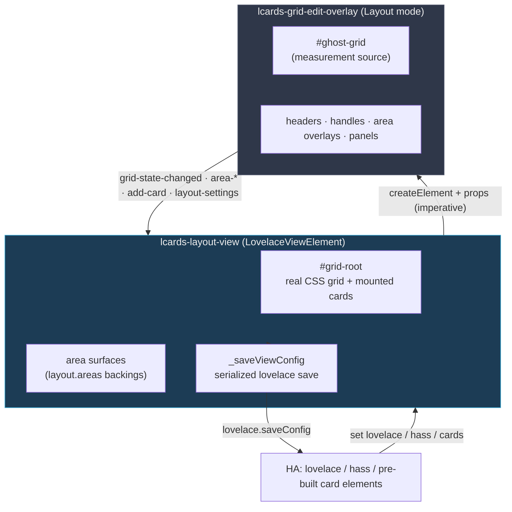

# Layout View Architecture

The **Layout View** (`custom:lcards-layout-view`) is a `LovelaceViewElement` that renders a CSS Grid and provides an in-view WYSIWYG editor. This page covers how it's built and the non-obvious constraints behind its design.

All code lives in `src/views/`:

| File | Role |
|------|------|
| `lcards-layout-view.js` | The view element — renders the grid, mounts HA-provided cards, owns config + persistence, manages the editor overlay. |
| `lcards-grid-edit-overlay.js` | The in-view editor chrome (Layout mode): track handles, headers, area overlays, toolbars, settings panels. |
| `layout-grid-utils.js` | Pure, DOM-free functions: track-list parsing, 2D area manipulation, area-settings reconciliation. |
| `layout-render.js` | Shared render helpers (`buildGridStyle`, `applyCardPlacement`, `renderAreaSurfaces`, `resolveColorValue`) used by both the view and the card. |
| `layout-edit-dialogs.js` | Shared `ha-dialog` confirmation helper (destructive actions). |

The **card** version (`custom:lcards-layout-card`) reuses all of the above:

| File | Role |
|------|------|
| `cards/lcards-layout-card.js` | Container card: renders the same grid, builds its own children as `hui-card` wrappers (so native Visibility works), propagates hass. Read-only on the dashboard. |
| `editor/cards/lcards-layout-card-editor.js` | The card's GUI editor — a thin launcher that opens the Layout Studio and relays its `config-changed` to HA. |
| `editor/dialogs/lcards-layout-studio-dialog.js` | Full-screen studio: a single live preview + grid overlay on a large canvas, a Layout tab (global settings), and a tab per card with an inline `hui-card-element-editor` + placement. |

---

## Component model

The view holds the parsed grid state (`_columns`, `_rows`, `_areas`, `_gap`) and the raw `_config`. The overlay is **stateless about persistence** — it edits a copy of the grid passed in as properties and emits events; the view is the single writer.

---

## Imperative overlay creation (scoped-registry constraint)

The view does **not** put `<lcards-grid-edit-overlay>` in its Lit template. HA builds custom view elements through a *scoped* custom-element registry (`create-view-element.ts`). A globally-registered element nested via a Lit template tag inside that view throws:

> `Failed to construct 'HTMLElement': This instance is already constructed`

So `_syncEditOverlay()` (called from `updated()`) creates the overlay with `document.createElement('lcards-grid-edit-overlay')` (the **global** registry), wires events with `addEventListener`, sets state via properties, and appends it to `renderRoot`. It is removed when leaving Layout mode and on disconnect.

The **layout card** uses the same imperative pattern, but inside the **Layout Studio** dialog rather than HA's cramped card-edit dialog: the studio creates a single preview card *and* a single grid overlay via `document.createElement` on a large canvas. Because the studio owns one of each for its lifetime (and is destroyed on close), the duplicate-overlay/alignment problems of in-dialog editing don't arise. Editing needs **no edit-mode detection** and no nested-path `saveConfig` — overlay events recompute a working config and the studio fires `config-changed`, which the card's GUI editor relays to HA. New cards use HA's `hui-card-picker`; each card is edited inline with `hui-card-element-editor` in its tab.

---

## The ghost-grid measurement pattern

The editor chrome is **not** laid out with CSS grid. Instead the overlay renders a transparent `#ghost-grid` with the same `grid-template-*`, and after each render `_measure()` (in a `requestAnimationFrame`) calls `getBoundingClientRect()` on every ghost cell to build `_cells[r][c]` pixel rects. All chrome (column/row headers, resize handles, area overlays, cell targets, popovers) is then **positioned absolutely** from those measurements via `_positionElements()`.

This avoids the offset bug that occurs when header/ruler tracks consume grid space. A `ResizeObserver` on the overlay re-measures whenever the view resizes (e.g. the HA sidebar expands/collapses), keeping the chrome aligned with the real grid.

### Header gutter

`GRID_EDIT_GUTTER` (28px, from `layout-grid-utils.js`) does **not** pad `#grid-root` — both the view and the card call `buildGridStyle(..., { withGutter: false })`, so the grid keeps its natural size in Layout mode. The overlay imports the same constant as `HEADER_OVERLAP` and instead sizes/positions its column/row headers, add-row/add-col buttons, and corner controls to float over the first `HEADER_OVERLAP`px of the real grid. `buildGridStyle`'s `withGutter` option still exists (reserves `padding-top`/`padding-left`) but neither call site passes `true` today.

### Unified pointer dispatch

`connectedCallback` binds a single `pointermove`/`pointerup` pair to the overlay element (not `document` — shadow-DOM boundaries and `setPointerCapture` on cells both break there). `_onAnyPointerMove`/`_onAnyPointerUp` route to whichever drag is active: track resize, header reorder, rubber-band area selection, toolbar drag, or the area-settings-panel drag.

---

## Card placement & per-area surfaces

`_placeCards()` rebuilds `#grid-root` whenever cards or layout change:

1. **Area surfaces** (`renderAreaSurfaces()`, from `layout-render.js`) — for each entry in `layout.areas`, a non-interactive `.area-surface` div is appended first (so cards paint above it by DOM order), styled by `applyAreaSurfaceStyle()`. `theme:` tokens in colors are resolved via `window.lcards.core.themeManager.resolver`.
2. **Cards** — each HA-provided card element gets placement applied by `applyCardPlacement(gridItem, cardEl, viewLayout, cardMargin, cardOverflow, areaSettings)` (also from `layout-render.js`).

**Precedence:** global (`card_margin` / `card_overflow`) → per-area (`layout.areas[name]`) → per-card (`view_layout`). Grid placement and alignment land on the *grid item* (the card, or its edit-mode wrapper); `overflow` lands on the card so content clips regardless of the wrapper.

In Card mode each card is wrapped in a `.card-edit-wrap` (the grid item) carrying edit / placement / remove handles; empty areas get an **Add card** placeholder.

Cards are **always placed** — per-card visibility is not the view's concern. HA hands the view `hui-card` wrappers, which evaluate each card's native **Visibility** conditions and hide themselves reactively. The view therefore implements no `view_layout.show` handling (unlike upstream layout-card, whose card mode bypasses the `hui-card` wrapper).

---

## Visibility-driven row sizing

HA's `hui-card` wrapper hides cards by setting `display: none`. In a standard CSS Grid, a `display: none` item does not contribute to track sizing — so a row with only hidden cards collapses to `0px` naturally. In practice, HA's layout context does not provide the grid engine with a definite available block-size, so `fr` tracks expand to the max-content of their items rather than filling the remaining space. This makes `minmax(0,auto)` tracks collapse correctly but `1fr` tracks wrong.

The view solves this entirely in JS:

### `_baseRows` and `_visibilityRows`

`_baseRows` holds the row tracks as parsed from config (never modified at runtime). After every card placement, `_collectVisibilityRows()` scans the placed cards for `state` Visibility conditions. For each matching card — one that has a definite `layout.height` on a `custom:lcards-layout-card` and a single-row `grid-area` — it records `{ rowIndex, entity, expectedState, targetHeight }` in `_visibilityRows`.

### `_applyVisibilityRowHeights()`

Called from three places: end of `_placeCards()`, every `updated()` (after Lit renders), and every `set hass()` (entity state changes):

1. **Build candidate rows** — start from `_baseRows`, override visibility rows with `targetHeight` or `'0px'` based on current entity state.
2. **Identify `fr` tracks** — locate all `Nfr` tracks in the candidate rows.
3. **Resolve non-fr sizes** — temporarily write the rows with every `fr` replaced by `0px` and force a reflow (`getComputedStyle`), so the browser evaluates all `clamp()`, `vh`, `px`, and `min()`/`max()` tracks to their actual pixel sizes.
4. **Compute fr allocation** — `frSpace = hostHeight - sum(non-fr rows) - sum(gaps)`. This is exact regardless of what the CSS Grid engine would have done.
5. **Final write** — replace every `Nfr` track with `round(frSpace × N / totalFR)px` and write `grid.style.gridTemplateRows` directly (bypassing Lit to avoid a re-render feedback loop).

### `ResizeObserver`

A `ResizeObserver` on the host element (created in `connectedCallback`, torn down in `disconnectedCallback`) fires `_applyVisibilityRowHeights()` via a `requestAnimationFrame` debounce whenever the host's bounding box changes — window resize, HA sidebar toggle, devtools open/close. This keeps row allocations correct across all viewport changes without polling.

---

## Persistence & event flow

HA hands the view three inputs via setters: `hass`, `lovelace`, and `cards` (pre-built card elements). The view never pushes config to HA except through one funnel.

### Serialized saves

`_saveViewConfig()` coalesces concurrent edits into a single in-flight chain and **always rebases on the latest `lovelace.config`** at the moment each write runs. This prevents the *"Dashboard updated in another session"* error that stale-snapshot saves caused when several edits (resize commit, area create, card add) fired in quick succession.

### Card add / edit interception

HA's create-card and edit-card dialogs save **directly via `lovelace.saveConfig()`**, bypassing events. The view's `lovelace` setter diffs `prevCards` against the new cards:

- **Add** (length grew) with a pending area → injects `view_layout.grid-area` into the new card, then re-saves.
- **Edit** (same length) with a pending edit → restores `view_layout` if HA stripped it.

### Area lifecycle reconciliation

Per-area settings (`layout.areas`) are keyed by area name, so they must track renames and deletions:

- **Rename** — the overlay emits `area-renamed {from,to}` *before* `grid-state-changed`; the view migrates the key (`renameAreaSettings`) without saving, and the following grid-state save persists it.
- **Delete / track removal** — `_onGridStateChanged` prunes orphans via `pruneAreaSettings` against the current area names.

All of these route back through `_saveViewConfig`.

---

## Drop-in compatibility

The schema mirrors `custom:grid-layout` (lovelace-layout-card): `layout.{grid-template-*, grid-gap, height, margin, padding, card_margin, card_overflow, mediaquery}` plus flat `cards[]` with `view_layout`. The grid renderer is ~50 lines of CSS plumbing replicated trivially; the value-add is the visual editor. Two intentional differences:

- **`layout.areas`** (surface decoration) is an LCARdS-only, optional, additive namespace that `custom:grid-layout` ignores — so configs stay portable in both directions.
- **`view_layout.show` is not implemented.** Per-card conditions defer to HA's native card Visibility (`hui-card`); a migrated config using `show` ignores that key.
