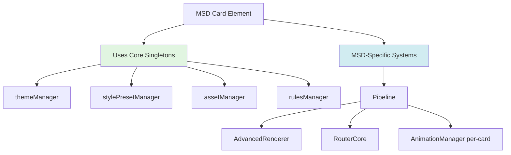
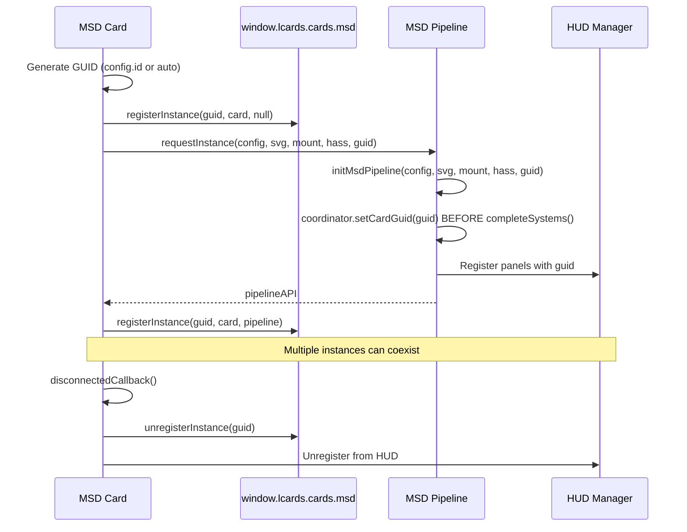
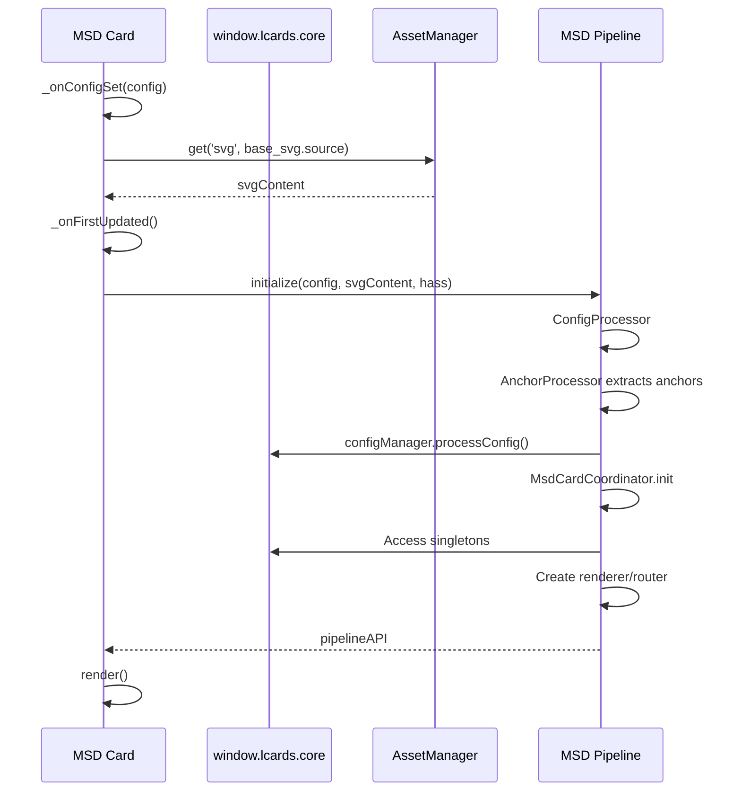
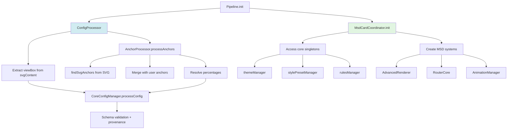
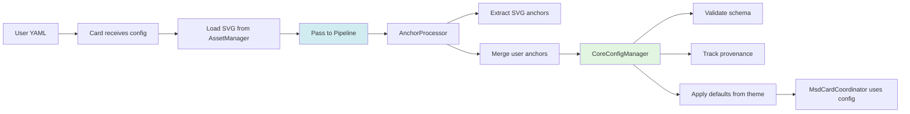
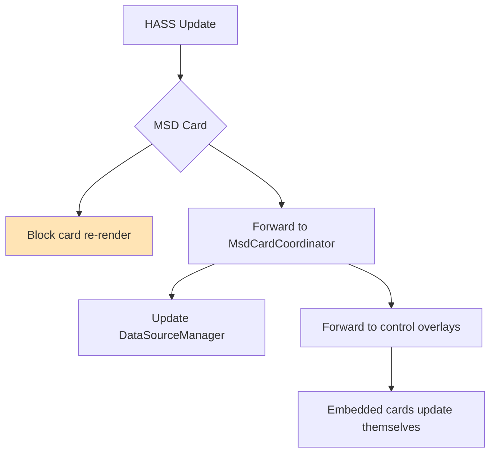

# MSD Card Architecture

**Type:** Advanced coordinator card  
**Purpose:** Canvas-based multi-overlay system  
**Base:** `LCARdSCard` (v1.17.0+) → unified architecture with provenance tracking

---

## High-Level Architecture



**Key Concept:** MSD uses core singletons for intelligence, creates pipeline for rendering/routing.

---

## Unified Architecture (v1.17.0+)

**Status:** ✅ MSD cards now extend `LCARdSCard` for unified architecture

MSD cards have been migrated to extend `LCARdSCard` instead of `LCARdSNativeCard`, providing unified provenance and theme access while preserving all MSD-specific systems.

### Inheritance Hierarchy

```
LitElement (Lit web component)
    ↓
LCARdSNativeCard (HA integration, shadow DOM, actions)
    ↓
LCARdSCard (Unified architecture, provenance, theme helpers)
    ↓
LCARdSMSDCard (Multi-overlay display with pipeline)
```

### Provenance Access

MSD cards now have access to standard provenance APIs inherited from `LCARdSCard`:

```javascript
// Console debugging
const card = document.querySelector('lcards-msd');

// Get full provenance (like Button cards)
card.getProvenance();
// → { config: {...}, merge_order: [...], field_sources: {...} }

// Get config tree
card.printConfigTree();
// → Prints hierarchical config tree to console

// Get specific field source
card.getFieldSource('overlays.0.style.fill');
// → 'user_config' | 'preset' | 'pack_defaults' | 'schema_defaults'

// Check user overrides
card.hasUserOverride('overlays.0');
// → true (user modified this overlay)

// Debug provenance (formatted output)
card.debugProvenance();
// → Prints formatted provenance to console
```

### Theme Token Resolution

MSD cards inherit theme token resolution from `LCARdSCard`:

```javascript
// In MSD card or overlay code
const color = this.getThemeToken('colors.accent.primary', '#ff9900');
// → Resolves to current theme's accent color

// In templates
'background: {theme:palette.moonlight}'
// → Resolved automatically
```

### Multi-Instance Support

No global registry needed - use standard DOM queries:

```javascript
// Get all MSD cards
const allMsdCards = document.querySelectorAll('lcards-msd');

// Get specific card by ID
const card = document.querySelector('lcards-msd[id="engineering"]');

// Access pipeline
const pipeline = card._msdPipeline;
const routing = pipeline?.coordinator?.router;
```

### Lifecycle Methods

MSD cards implement standard `LCARdSCard` lifecycle methods:

```javascript
export class LCARdSMSDCard extends LCARdSCard {
  
  // Get card type for CoreConfigManager
  getCardType() {
    return 'msd';
  }

  // Process config (called automatically)
  async _processConfig(config) {
    // Extract MSD config
    // Load SVG
    // Prepare for pipeline init
    return config;
  }

  // Initialize on first update (called automatically)
  async _onFirstUpdated(changedProps) {
    await super._onFirstUpdated(changedProps);
    // Initialize MSD pipeline
    await this._initializeMsdPipeline();
  }

  // Handle HASS updates (called automatically)
  _handleHassUpdate(newHass, oldHass) {
    // Forward to MSD coordinator
    this._msdPipeline?.systemsManager?.ingestHass(newHass);
  }

  // Render card content (called automatically)
  _renderCard() {
    // Return HTML for card
    return html`${this._renderSvgContainer()}`;
  }
}
```

### Migration from v1.16.x

**No config changes required!** All changes are internal:

✅ **Works immediately:**
- All MSD features work exactly the same
- Overlays render correctly
- Routing works
- Rules apply
- HASS updates propagate

✅ **New capabilities:**
- `card.getProvenance()` now works (previously broken)
- `card.debugProvenance()` now available (previously unavailable)
- `card.getFieldSource()` works for debugging
- Theme tokens resolved via inherited helpers
- Multi-instance via standard DOM queries

**Breaking changes:** None for users!

---

## Multi-Instance Support (v1.17.0+)

**Status:** ✅ Full multi-instance support enabled

MSD cards now support multiple instances on the same dashboard with proper isolation and management.

### Architecture Changes

#### Namespace Structure

```
window.lcards.cards.msd.*          → Production APIs
window.lcards.debug.msd.*          → Debug tools (backward compatible)
```

**Production API** (`window.lcards.cards.msd`):
- `registerInstance(guid, card, pipeline)` - Register new MSD card instance
- `unregisterInstance(guid)` - Remove instance from registry
- `getInstance(guid)` - Get instance data by GUID
- `listInstances()` - List all registered instances
- `getInstanceRegistry()` - Access the Map-based registry

**Debug API** (`window.lcards.debug.msd`):
- `pipelineInstance` - Legacy single-instance reference (backward compat)
- `getThemeProvenance()` - Theme debugging
- `getPackInfo()` - Pack loading information
- `listTrackedOverlays()` - Overlay provenance
- All production methods (delegated)

#### Card Identification

Each MSD card has a unique GUID:

```yaml
type: custom:lcards-msd
id: "engineering-display"    # User-provided stable ID (recommended)
msd:
  base_svg:
    source: "builtin:ncc-1701-d"
  overlays: [...]
```

**GUID Resolution:**
1. **User-provided `config.id`** (e.g., `"engineering-display"`) → `msd-engineering-display`
2. **Auto-generated** (if no `config.id`) → `msd_1704587423156_a3f9c2b1`

**Why `config.id` matters:**
- ✅ **Stable identity** across dashboard reloads
- ✅ **Rules targeting** by card ID
- ✅ **HUD panel** association
- ✅ **Debug** via `window.lcards.cards.msd.getInstance('msd-engineering-display')`

### Multi-Instance Lifecycle



**Critical Fix (v1.17.0):** 
- GUID now passed through: Card → MsdInstanceManager → PipelineCore → Coordinator
- `coordinator.setCardGuid(cardGuid)` called **BEFORE** `completeSystems()`
- HUD panels register with correct GUID (no longer undefined)

### Rules Targeting

MSD cards can now be targeted by rules using their `config.id`:

```yaml
# Rule targeting specific MSD card
rules:
  - condition:
      entity: "binary_sensor.alert"
      state: "on"
    targets:
      - id: "engineering-display"    # Matches MSD card with config.id
    patches:
      - path: "overlays[0].style.stroke"
        value: "var(--lcars-alert-red)"
```

### HUD Panel Integration

HUD Manager now tracks multiple MSD cards:

```javascript
// Get specific card's pipeline
const instance = window.lcards.cards.msd.getInstance('msd-engineering-display');
const pipeline = instance?.pipelineInstance;

// List all MSD cards
window.lcards.cards.msd.listInstances();
// Output: [{ guid: 'msd-engineering-display', ... }, { guid: 'msd-bridge', ... }]

// Switch HUD to specific card
window.lcards.core.hudManager.setActiveCard('msd-engineering-display');
```

### Migration Guide

**For Users:**
- ✅ No config changes required
- ✅ Multiple MSD cards work automatically
- ✅ Optional: Add `id` field for stable identity and rule targeting

**For Developers:**
```javascript
// ❌ OLD: Legacy debug namespace
window.lcards.debug.msd.registerInstance(...)

// ✅ NEW: Production namespace
window.lcards.cards.msd.registerInstance(...)

// ✅ RECOMMENDED: Get instance by GUID
const instance = window.lcards.cards.msd.getInstance(cardGuid);
const router = instance.pipelineInstance.coordinator?.router;
```

---

## Card Initialization Flow



**Key Facts:**
- ✅ Card loads SVG from AssetManager
- ✅ Card passes **raw config** to pipeline (no preprocessing)
- ✅ Pipeline extracts anchors, validates config
- ✅ Pipeline accesses core singletons, creates MSD-specific systems

---

## Pipeline Initialization



**Key Facts:**
- ✅ Anchor extraction happens in pipeline (not card)
- ✅ CoreConfigManager provides provenance tracking
- ✅ MsdCardCoordinator accesses singletons (doesn't create them)

---

## MSD-Specific Systems

| System | Purpose | Instance Type |
|--------|---------|---------------|
| `AdvancedRenderer` | SVG overlay rendering | Per-card |
| `RouterCore` | Line path calculation | Per-card |
| `AnimationManager` | Animation orchestration | Per-card |
| `MsdControlsRenderer` | Embedded card management | Per-card |

**Why Per-Card:**
- Each MSD card has unique overlays, routes, animations
- Canvas rendering is card-specific
- Core singletons handle shared intelligence (themes, rules, presets)

---

## Configuration Flow



**Key Facts:**
- ✅ Raw config → pipeline
- ✅ Anchors extracted from SVG (not card)
- ✅ Full provenance tracked

---

## Overlay Types

**MSD supports 2 overlay types:**

1. **`line`** - SVG paths with intelligent routing
   - Uses RouterCore for path calculation
   - Themes applied via themeManager
   - Rules targetable via rulesManager

2. **`control`** - Embedded HA cards
   - Any HA card (including LCARdS cards)
   - 9-point attachment system for lines
   - Self-managing (own HASS updates)

---

## HASS Update Handling



**Why Block MSD Re-render:**
- MSD canvas doesn't need re-render on HASS changes
- Control overlays (embedded cards) handle own updates
- Only re-render when config or overlays change

---

## References
- Card implementation: `src/cards/lcards-msd.js`
- Pipeline: `src/msd/pipeline/PipelineCore.js`
- Config processing: `src/msd/pipeline/ConfigProcessor.js`
- Anchor processing: `src/msd/pipeline/AnchorProcessor.js`
- Card coordinator: `src/msd/pipeline/MsdCardCoordinator.js`
- Renderer: `src/msd/renderer/AdvancedRenderer.js`
- Router: `src/msd/routing/RouterCore.js`
- Core singletons: [core-initialization.md](./core-initialization.md)
