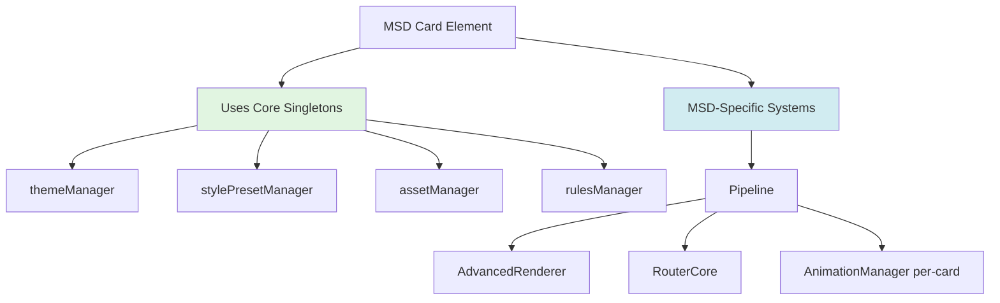
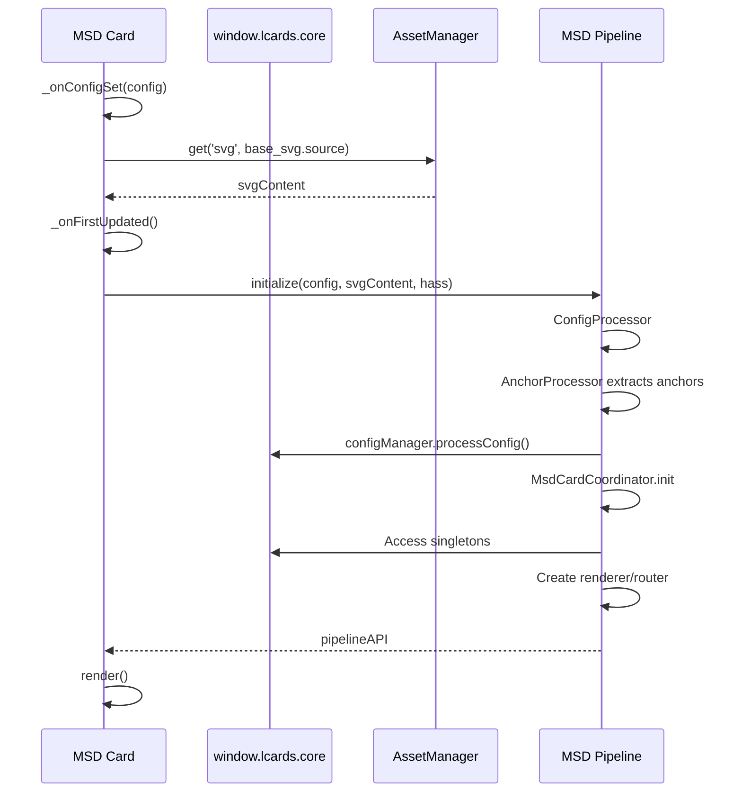
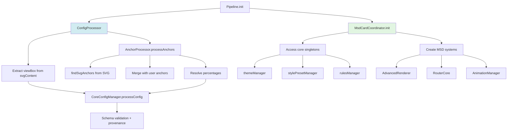
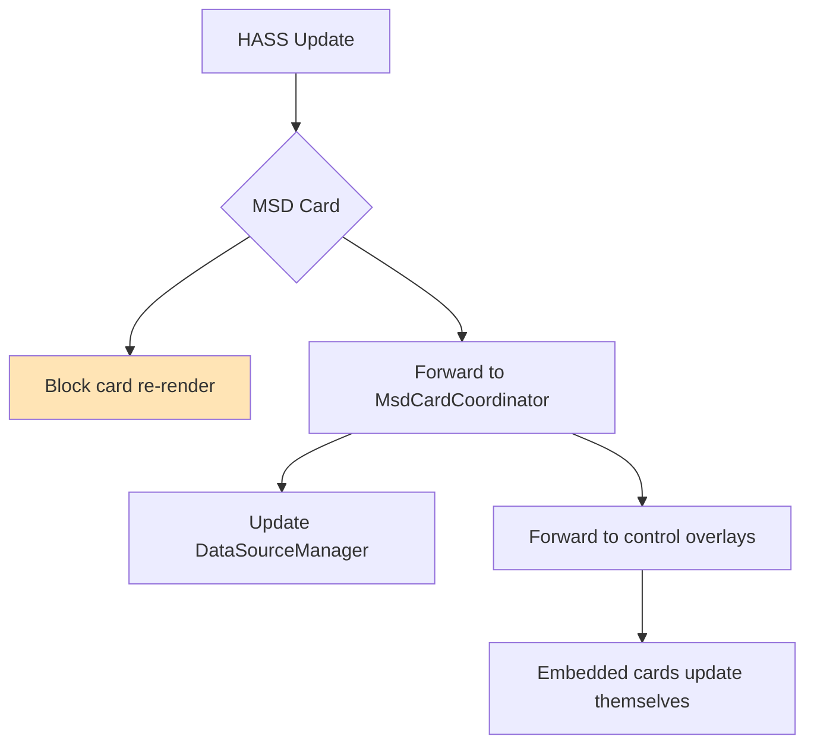

# MSD Card Architecture

**Type:** Advanced coordinator card  
**Purpose:** Canvas-based multi-overlay system  
**Base:** `LCARdSNativeCard` → custom initialization

---

## High-Level Architecture

**Key Concept:** MSD uses core singletons for intelligence, creates pipeline for rendering/routing.

---

## Card Initialization Flow

**Key Facts:**
- ✅ Card loads SVG from AssetManager
- ✅ Card passes **raw config** to pipeline (no preprocessing)
- ✅ Pipeline extracts anchors, validates config
- ✅ Pipeline accesses core singletons, creates MSD-specific systems

---

## Pipeline Initialization

**Key Facts:**
- ✅ Anchor extraction happens in pipeline (not card)
- ✅ CoreConfigManager provides provenance tracking
- ✅ MsdCardCoordinator accesses singletons (doesn't create them)

---

## MSD-Specific Systems

| System | Purpose | Instance Type |
|--------|---------|---------------|
| `AdvancedRenderer` | SVG overlay rendering | Per-card |
| `RouterCore` | Line path calculation | Per-card |
| `AnimationManager` | Animation orchestration | Per-card |
| `MsdControlsRenderer` | Embedded card management | Per-card |

**Why Per-Card:**
- Each MSD card has unique overlays, routes, animations
- Canvas rendering is card-specific
- Core singletons handle shared intelligence (themes, rules, presets)

---

## Configuration Flow

**Key Facts:**
- ✅ Raw config → pipeline
- ✅ Anchors extracted from SVG (not card)
- ✅ Full provenance tracked

---

## Overlay Types

**MSD supports 2 overlay types:**

1. **`line`** - SVG paths with intelligent routing
   - Uses RouterCore for path calculation
   - Themes applied via themeManager
   - Rules targetable via rulesManager

2. **`control`** - Embedded HA cards
   - Any HA card (including LCARdS cards)
   - 9-point attachment system for lines
   - Self-managing (own HASS updates)

---

## HASS Update Handling

**Why Block MSD Re-render:**
- MSD canvas doesn't need re-render on HASS changes
- Control overlays (embedded cards) handle own updates
- Only re-render when config or overlays change

---

## References
- Card implementation: `src/cards/lcards-msd.js`
- Pipeline: `src/msd/pipeline/PipelineCore.js`
- Config processing: `src/msd/pipeline/ConfigProcessor.js`
- Anchor processing: `src/msd/pipeline/AnchorProcessor.js`
- Card coordinator: `src/msd/pipeline/MsdCardCoordinator.js`
- Renderer: `src/msd/renderer/AdvancedRenderer.js`
- Router: `src/msd/routing/RouterCore.js`
- Core singletons: [core-initialization.md](./core-initialization.md)
