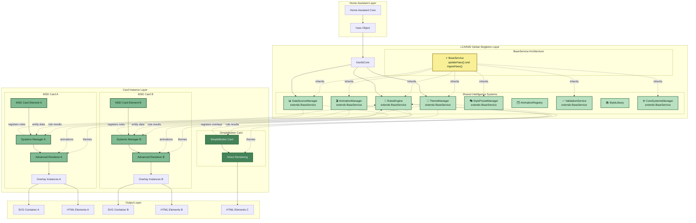

# Architecture Overview

> **LCARdS System Architecture**
> High-level overview of the singleton-based rendering system, card types, and component relationships.

---

## 🎯 Core Philosophy

LCARdS is a Home Assistant custom card system built on a **singleton-based, data-driven architecture** that supports multiple card instances with shared resources.

**Key Principle:** Shared intelligence, distributed presentation.
- Global singleton systems (RulesEngine, DataSourceManager, ThemeManager) provide shared intelligence
- Individual cards focus solely on presentation and user interaction
- Entity caching provides 80-90% faster access with multiple cards

---

## 🏗️ Card Architecture

LCARdS provides two card foundation types, both built on a common base:

```
LitElement (Lit web component)
    ↓
LCARdSNativeCard (HA integration, shadow DOM, actions)
    ↓
    ├─→ LCARdSSimpleCard → Simple Cards (SimpleButton, etc.)
    │   • Lightweight, single-purpose cards
    │   • Direct singleton integration
    │   • Template processing & action handling
    │   • **Go-forward architecture** ⭐
    │
    └─→ LCARdSMSDCard → MSD Cards
        • Multi-overlay complex displays
        • Advanced rendering pipeline
        • Navigation & routing
        • **Future: Will be refactored to use Simple Cards for overlays**
```

### Current State

- ✅ **SimpleCard Foundation**: New, clean architecture - all new cards use this
- ✅ **SimpleButton Card**: First production Simple Card (v1.14+)
- ⏳ **MSD Cards**: Current implementation, will be refactored to leverage Simple Cards

**See:** [Simple Card Foundation](simple-card-foundation.md) for details on the go-forward architecture.

---

## 🎨 Architecture Layers



**Layers:**
1. **Home Assistant Layer** - Provides `hass` object with entity states
2. **Singleton Layer** - Shared intelligence systems (rules, data, themes)
3. **Card Instance Layer** - Individual card instances with their rendering
4. **Output Layer** - Final SVG/HTML output to shadow DOM

---

## 🔑 Key Concepts

### Singleton Systems
All intelligence is shared across card instances:
- **RulesEngine** - Conditional logic evaluation
- **DataSourceManager** - Entity subscriptions and data processing (MSD cards)
- **CoreSystemsManager** - Entity caching (Simple Cards)
- **ThemeManager** - Color schemes and styling
- **AnimationManager** - Animation coordination

**See:** [Core Components](core-components.md) for detailed singleton documentation.

### BaseService Pattern
Most singletons extend `BaseService` for consistent lifecycle:
- `updateHass(hass)` - Receive new `hass` object from Home Assistant
- `ingestHass()` - Process and react to hass updates
- Guaranteed lifecycle methods eliminate runtime type checking

### Multi-Card Coordination
- Multiple MSD or Simple cards can coexist on same dashboard
- Singletons provide consistent behavior across all cards
- Entity subscriptions shared (no duplicate subscriptions)
- Rules can target overlays across cards

---

## 📚 Detailed Documentation

### Architecture Details
- **[Core Components](core-components.md)** - All singleton systems explained
- **[Rendering Pipeline](rendering-pipeline.md)** - How MSD cards render overlays
- **[Data Flow](data-flow.md)** - Entity data processing pipeline
- **[Multi-Card Architecture](multi-card-architecture.md)** - Cross-card coordination
- **[Design Patterns](design-patterns.md)** - Key architectural patterns

### Card Types
- **[Simple Card Foundation](simple-card-foundation.md)** ⭐ Go-forward architecture
- **[MSD Flow Diagrams](diagrams/)** - MSD initialization and rendering

### Systems
- **[Subsystems](subsystems/)** - Detailed docs for each singleton
- **[Schemas](schemas/)** - Configuration schemas
- **[API Reference](api/)** - Runtime and debug APIs

---

**Last Updated:** November 22, 2025
**Status:** Current - reflects singleton architecture with Simple Card foundation
