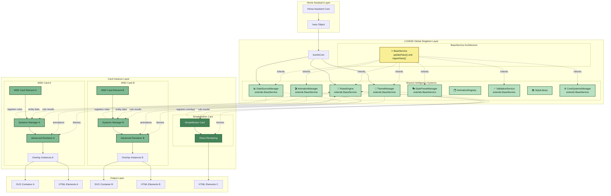

# Architecture Overview

> **LCARdS System Architecture**  
> High-level overview of the singleton-based rendering system, card types, and component relationships.

---

## 🎯 Core Philosophy

LCARdS is a Home Assistant custom card system built on a **singleton-based, data-driven architecture** that supports multiple card instances with shared resources.

**Key Principle:** Shared intelligence, distributed presentation.
- Global singleton systems (RulesEngine, DataSourceManager, ThemeManager) provide shared intelligence
- Individual cards focus solely on presentation and user interaction
- Entity caching provides 80-90% faster access with multiple cards

---

## 🏗️ Card Architecture

LCARdS provides two card foundation types, both built on a common base:

```
LitElement (Lit web component)
    ↓
LCARdSNativeCard (HA integration, shadow DOM, actions)
    ↓
    ├─→ LCARdSSimpleCard → Simple Cards (SimpleButton, etc.)
    │   • Lightweight, single-purpose cards
    │   • Direct singleton integration
    │   • Template processing & action handling
    │   • **Go-forward architecture** ⭐
    │
    └─→ LCARdSMSDCard → MSD Cards
        • Multi-overlay complex displays
        • Advanced rendering pipeline
        • Navigation & routing
        • **Future: Will be refactored to use Simple Cards for overlays**
```

### Current State

- ✅ **SimpleCard Foundation**: Clean architecture - all new cards use this
- ✅ **SimpleButton Card**: Production Simple Card
- ✅ **MSD Cards**: Complex multi-overlay displays

**See:** [Simple Card Foundation](cards/simple-card-foundation.md) for details on the Simple Card architecture.

---

## 🎨 Architecture Layers



**Layers:**
1. **Home Assistant Layer** - Provides `hass` object with entity states
2. **Singleton Layer** - Shared intelligence systems (rules, data, themes)
3. **Card Instance Layer** - Individual card instances with their rendering
4. **Output Layer** - Final SVG/HTML output to shadow DOM

---

## 🔑 Key Concepts

### Singleton Systems
All intelligence is shared across card instances:
- **RulesEngine** - Conditional logic evaluation
- **DataSourceManager** - Entity subscriptions and data processing (MSD cards)
- **CoreSystemsManager** - Entity caching (Simple Cards)
- **ThemeManager** - Color schemes and styling
- **AnimationManager** - Animation coordination

**See:** [Core Components](core-components.md) for detailed singleton documentation.

### BaseService Pattern
Most singletons extend `BaseService` for consistent lifecycle:
- `updateHass(hass)` - Receive new `hass` object from Home Assistant
- `ingestHass()` - Process and react to hass updates
- Guaranteed lifecycle methods eliminate runtime type checking

### Multi-Card Coordination
- Multiple MSD or Simple cards can coexist on same dashboard
- Singletons provide consistent behavior across all cards
- Entity subscriptions shared (no duplicate subscriptions)
- Rules can target overlays across cards

### Global Data Source and Rules Publication

**Any card can define data sources and rules that become globally available:**

```yaml
# MSD card defines a data source
type: custom:lcards-msd-card
data_sources:
  cpu_temperature:
    entity: sensor.cpu_temp
    window_seconds: 3600
    history: { preload: true, hours: 6 }

# The data source is registered with DataSourceManager singleton
# Any other card can now reference 'cpu_temperature' in templates
```

```yaml
# Simple card defines rules
type: custom:lcards-simple-button
entity: light.bedroom
rules:
  - id: light_on_style
    when:
      entity: light.bedroom
      state: 'on'
    apply:
      style:
        primary: '#00ff00'

# These rules are registered with RulesEngine singleton
# Rule evaluation is shared and distributed to all cards
```

**Benefits:**
- ✅ Define data sources in one place, use everywhere
- ✅ No duplicate Home Assistant subscriptions
- ✅ Shared data processing (transformations, aggregations)
- ✅ Consistent rule evaluation across all cards

---

## 📊 MSD + Simple Cards: Hybrid Architecture

The recommended approach combines MSD cards for layout with embedded Simple Cards for interactions:

| Component | Responsibility |
|-----------|----------------|
| **MSD Card** | Layout, line routing, SVG backgrounds |
| **Simple Cards (embedded)** | Buttons, charts, interactive elements |
| **Simple Cards (standalone)** | Individual controls outside MSD |

**See:** [MSD Flow Part 2](diagrams/MSD%20Flow%20-%20Part%202.md#-msd--simple-cards-together) for detailed examples.

---

## 📚 Detailed Documentation

### Card Types
- **[Simple Card Foundation](cards/simple-card-foundation.md)** - Simple Card architecture
- **[MSD Flow Diagrams](diagrams/)** - MSD initialization and rendering

### Systems
- **[Subsystems](subsystems/)** - Detailed docs for each singleton
- **[Schemas](schemas/)** - Configuration schemas
- **[API Reference](api/)** - Runtime and debug APIs

---

**Status:** Current - reflects singleton architecture with Simple Card foundation
