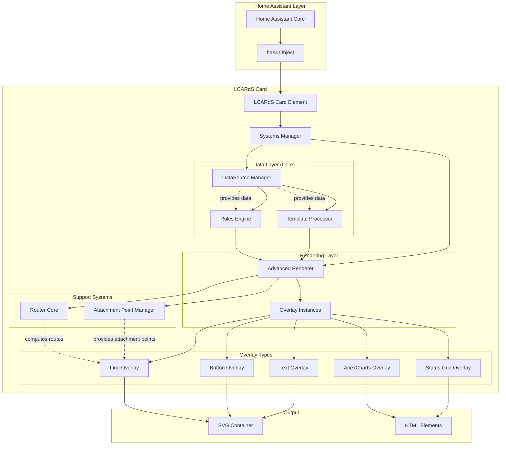
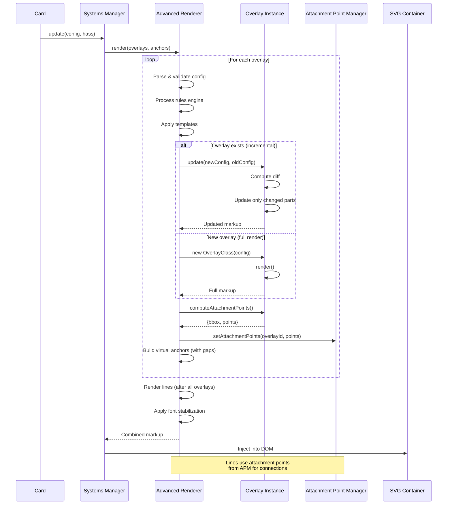
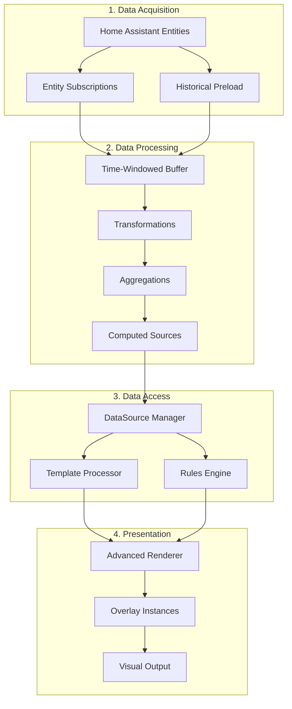
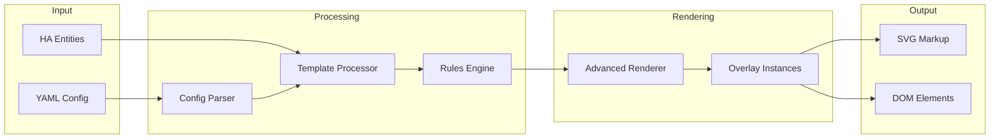
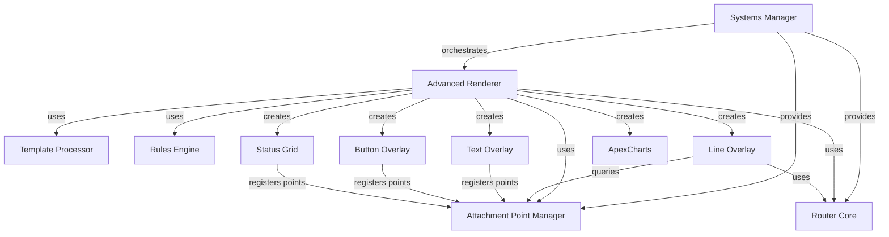

# Architecture Overview

> **LCARdS System Architecture**
> A comprehensive overview of the LCARdS rendering system, component relationships, and data flow.

---

## 🎯 High-Level Architecture

LCARdS is a Home Assistant custom card built on a **data-driven, overlay-based rendering system**.

**Core Philosophy:** Everything is driven by data. The datasource system sits at the center of the architecture, transforming Home Assistant entity states into processed values that power dynamic overlays.

The architecture consists of several key layers:

---

## 🏗️ Core Components

### 1. DataSource Manager
**Central data processing hub** that connects Home Assistant entities to the overlay system.

**Responsibilities:**
- Subscribe to Home Assistant entity state changes
- Maintain time-windowed data buffers
- Apply transformation pipelines (unit conversion, scaling, smoothing)
- Calculate aggregations (averages, rates, trends)
- Generate computed values from expressions
- Provide processed data to templates and rules engine

**Key Features:**
- Real-time reactive updates
- Historical data preloading
- 50+ predefined transformations
- Statistical aggregation engines
- Memory-efficient circular buffers
- Performance optimization (coalescing, throttling)

**Key Files:**
- `src/msd/datasource/DataSourceManager.js`
- `src/msd/datasource/DataSourceMixin.js`
- `src/msd/datasource/processors/`
- `src/msd/datasource/aggregations/`

**See:** [DataSource System Architecture](subsystems/datasource-system.md)

### 2. Systems Manager
**Central orchestration hub** that coordinates all systems.

**Responsibilities:**
- Initialize all subsystems (renderer, router, attachment manager)
- Manage card lifecycle (connect, update, disconnect)
- Handle entity subscriptions
- Coordinate incremental updates
- Manage animation system

**Key Files:**
- `src/msd/SystemsManager.js`

### 2. Advanced Renderer
**Main rendering engine** that processes overlays and produces SVG/HTML output.

**Responsibilities:**
- Parse and validate configuration
- Render overlays in correct order
- Manage overlay instances (reuse vs. recreate)
- Compute attachment points
- Build virtual anchors for overlay-to-overlay connections
- Handle font stabilization
- Process rules engine conditions
- Manage incremental vs. full rendering

**Key Files:**
- `src/msd/renderer/AdvancedRenderer.js`

**See:** [Advanced Renderer Documentation](components/advanced-renderer.md)

### 4. Template Processor
**Dynamic content resolution** using datasource values and entity states.

**Responsibilities:**
- Parse template syntax (e.g., `{datasource.value}`, `{entity.state}`)
- Resolve datasource values with dot notation
- Substitute entity attributes
- Handle nested templates
- Provide formatted output

**Template Syntax:**
- `{datasource_name.value}` - Datasource current value
- `{datasource_name.aggregates.key}` - Aggregation results
- `{datasource_name.transformations.key}` - Transformation results
- `{entity.state}` - Entity state value
- `{entity.attributes.name}` - Entity attributes

**See:** [Template Processor Documentation](subsystems/template-processor.md)

### 5. Rules Engine
**Conditional rendering** based on datasource values and entity states.

**Responsibilities:**
- Evaluate condition expressions
- Support complex logic (AND/OR/NOT)
- Query datasource values
- Apply conditional properties
- Filter overlays based on rules

**Integration:**
- Datasource dot-notation access
- Entity state comparisons
- Threshold detection
- Range checking

**See:** [Rules Engine Documentation](subsystems/rules-engine.md)

### 6. Overlay System
**Modular overlay architecture** where each overlay type has its own renderer.

**Overlay Types:**
- **Text**: Dynamic text rendering with font stabilization
- **Button**: Interactive buttons with LCARS presets
- **Line**: Connection lines with routing and gaps
- **Status Grid**: Multi-cell grids with individual cell control
- **ApexCharts**: Chart integration with dynamic data

**Key Pattern:**
Each overlay has:
- Instance class (e.g., `TextOverlay`)
- `render()` method that returns SVG/HTML markup
- `update()` method for incremental updates
- `computeAttachmentPoints()` for connection system

**See:** [Overlay System Documentation](components/overlay-system.md)

### 7. Attachment Point Manager
**Connection system** that manages attachment points for overlay-to-overlay connections.

**Responsibilities:**
- Store attachment points (center, top, bottom, left, right, corners)
- Provide attachment point lookup for lines
- Manage virtual anchors (e.g., `button1.top`, `text1.left`)
- Handle gap-adjusted anchors

**Key Concepts:**
- **Attachment Points**: Named coordinates on an overlay's bbox
- **Virtual Anchors**: Dynamic anchors like `overlayId.side`
- **Gap System**: `anchor_gap` and `attach_gap` for offset control

**See:** [Attachment Point Manager Documentation](components/attachment-point-manager.md)

### 8. Router Core
**Line routing system** that computes paths between points.

**Responsibilities:**
- Compute orthogonal routes (horizontal/vertical segments)
- Avoid obstacles
- Cache computed routes
- Support route invalidation and recomputation

**Routing Modes:**
- `auto`: Automatic orthogonal routing with obstacle avoidance
- `direct`: Straight line between points
- Manual: Explicit waypoints

**See:** [Router Core Documentation](components/router-core.md)

---

## 🔄 Rendering Pipeline

---

## 🔀 Data Flow Pipeline

**LCARdS is fundamentally data-driven.** Understanding the data flow is key to understanding the system.

**Data Flow Steps:**

1. **Acquisition**: Entity states flow from Home Assistant
2. **Processing**: Transformations and aggregations applied
3. **Access**: Templates and rules query processed data
4. **Presentation**: Overlays rendered with dynamic content

**See:** [DataSource System Architecture](subsystems/datasource-system.md) for detailed data flow

---

## 🔀 Data Flow (Legacy Section)

**Data Flow Steps:**

1. **Configuration Parsing**
   - YAML config parsed into JavaScript objects
   - Schema validation
   - Defaults applied

2. **Template Processing**
   - Entity values extracted from `hass` object
   - Templates evaluated (e.g., `{entity.state}`)
   - Dynamic content substituted

3. **Rules Engine**
   - Conditions evaluated
   - Conditional properties applied
   - Overlays filtered based on rules

4. **Rendering**
   - Overlays rendered in order
   - Attachment points computed
   - Virtual anchors created

5. **Output Generation**
   - SVG markup for visual elements
   - HTML for interactive elements (grids, charts)
   - Combined into final output

---

## 🔧 Key Subsystems

### DataSource System
**Problem:** Need real-time, processed data from Home Assistant with transformations and aggregations.

**Solution:** Comprehensive data processing pipeline with subscriptions, buffers, transformations, and aggregations.

**See:** [DataSource System Documentation](subsystems/datasource-system.md)

### Font Stabilization
**Problem:** During font loading, text bounding boxes are temporarily invalid (width=0, height=0), causing lines to jump to incorrect positions.

**Solution:** Multi-pass stabilization with bbox validation.

**See:** [Font Stabilization Documentation](subsystems/font-stabilization.md)

### Incremental Updates
**Problem:** Full re-render on every state change is expensive.

**Solution:** Diff-based updates that only modify changed properties.

**Supported:**
- Text content and style changes
- Button content and style changes
- Status grid cell updates
- ApexCharts data updates

**See:** [Incremental Updates Documentation](components/incremental-updates.md)

### Rules Engine
**Purpose:** Conditional rendering based on entity states.

**Features:**
- Show/hide overlays based on conditions
- Apply conditional styles
- Support complex conditions (AND/OR/NOT)

**See:** [Rules Engine Documentation](subsystems/rules-engine.md)

### Template Processor
**Purpose:** Dynamic content using entity data.

**Syntax:**
- `{entity.state}` - Entity state value
- `{entity.attributes.friendly_name}` - Entity attributes
- `{entity.last_changed}` - Timestamp data

**See:** [Template Processor Documentation](subsystems/template-processor.md)

---

## 📊 Component Relationships

---

## 🎨 Rendering Strategies

### Full Render
Used when:
- Initial card load
- Configuration changes
- Overlay structure changes

**Process:**
1. Parse full configuration
2. Create all overlay instances
3. Render all overlays
4. Compute all attachment points
5. Build all virtual anchors
6. Font stabilization passes

### Incremental Update
Used when:
- Entity state changes
- Minimal configuration updates

**Process:**
1. Identify changed overlays
2. Call `update()` on affected instances
3. Update only changed attachment points
4. Recompute affected lines
5. Skip font stabilization if bbox unchanged

---

## 🔑 Key Design Patterns

### 1. Instance-Based Rendering
Overlay instances persist between updates for efficient incremental updates.

### 2. Attachment Point System
Standardized connection points allow flexible overlay-to-overlay connections.

### 3. Virtual Anchors
Dynamic anchors (e.g., `button1.left`) created on-the-fly with gap offsets.

### 4. Two-Phase Rendering
- **Phase 1**: Render overlays, compute attachment points
- **Phase 2**: Render lines using computed attachment points

### 5. Multi-Pass Stabilization
Font loading handled through multiple validation passes with bbox checking.

---

## 📚 Further Reading

- [Advanced Renderer Details](components/advanced-renderer.md)
- [Overlay System Architecture](components/overlay-system.md)
- [Attachment Point System](components/attachment-point-manager.md)
- [Incremental Updates](components/incremental-updates.md)
- [Rendering Pipeline Diagram](diagrams/rendering-pipeline.md)
- [Overlay Lifecycle Diagram](diagrams/overlay-lifecycle.md)

---

**Last Updated:** October 26, 2025
**Version:** 2025.10.1-fuk.42-69
