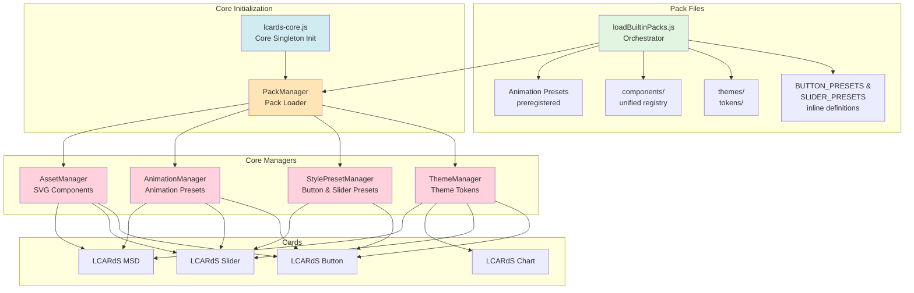
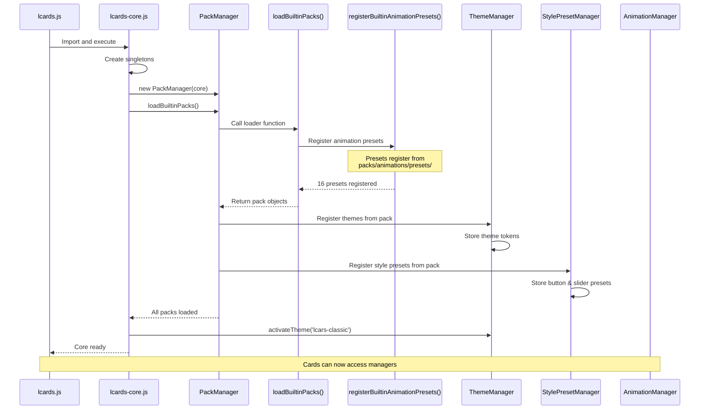

# LCARdS Pack System - Developer Guide

**Version:** 1.23.0  
**Status:** ✅ Production Ready  
**Last Updated:** January 13, 2026

> **Recent Changes**: PR #195 (January 12, 2026) standardized all components to use unified inline SVG format, eliminating the legacy shapes registry. All component examples in this guide reflect the current unified structure.

## Overview

The LCARdS Pack System is a modular framework for distributing **themes**, **style presets**, **components**, and **animation presets** to cards. Think of it as a plugin architecture where each pack provides reusable building blocks.

```
Packs → Core Managers → Cards
```

**Key Principle**: Packs are loaded **once** at core initialization. Cards consume from singleton managers, never load packs directly.

---

## Architecture Diagram



---

## Pack System Components

### 1. Pack Files (Source Data)

**Location**: Organized into modular directories under `src/core/packs/`

**Structure** (After PR #196 Refactor):
```
src/core/packs/
├── loadBuiltinPacks.js          # Pure orchestrator (115 lines, 90% reduction)
├── style-presets/               # ✨ NEW: Extracted style presets
│   ├── buttons/
│   │   └── index.js             # 740 lines - BUTTON_PRESETS export
│   ├── sliders/
│   │   └── index.js             # 195 lines - SLIDER_PRESETS export
│   └── index.js                 # Unified style preset exports
├── themes/                      # ✨ NEW: Extracted theme definitions
│   ├── builtin-themes.js        # 172 lines - BUILTIN_THEMES_PACK
│   ├── tokens/                  # Theme token files (relocated from core/themes/tokens)
│   │   ├── lcarsClassicTokens.js
│   │   ├── lcarsDs9Tokens.js
│   │   ├── lcarsVoyagerTokens.js
│   │   └── lcarsHighContrastTokens.js
│   └── index.js                 # Unified theme exports
├── animations/                  # ✨ NEW: Extracted animation presets
│   ├── presets/
│   │   └── index.js             # 683 lines - registerBuiltinAnimationPresets()
│   └── index.js                 # Unified animation exports
├── components/                  # ✅ Already structured (unchanged from PR #195)
│   ├── buttons/
│   ├── sliders/
│   ├── dpad/
│   ├── index.js                 # Unified component registry
│   └── README.md
├── externalPackLoader.js        # External pack loading
└── mergePacks.js                # Pack merging utilities
```

**Refactor Summary**: PR #196 extracted **~1,716 lines** from monolithic files into organized directories:
- `loadBuiltinPacks.js`: 1,188 → 115 lines (90% reduction)
- `core/animation/presets.js`: 710 → 67 lines (91% reduction)
- Components already structured from PR #195 (legacy shapes registry removed)

**Pack Structure Example**:
```javascript
// LCARDS_BUTTONS_PACK (from loadBuiltinPacks.js)
import { BUTTON_PRESETS } from './style-presets/buttons/index.js';

{
  id: 'lcards_buttons',
  version: '1.14.18',
  description: 'Button style presets',
  style_presets: {
    button: BUTTON_PRESETS  // ← Imported from extracted file
  }
}
```

**Extraction Pattern** (PR #196):
- Button presets: `src/core/packs/style-presets/buttons/index.js` exports `BUTTON_PRESETS`
- Slider presets: `src/core/packs/style-presets/sliders/index.js` exports `SLIDER_PRESETS`
- Themes: `src/core/packs/themes/builtin-themes.js` exports `BUILTIN_THEMES_PACK`
- Animation presets: `src/core/packs/animations/presets/index.js` exports `registerBuiltinAnimationPresets()`

---

### 2. Pack Loader (Orchestrator)

**File**: `src/core/packs/loadBuiltinPacks.js` (115 lines after PR #196 refactor)

**Responsibilities**:
- Import extracted pack components from organized directories
- Assemble pack objects from imported modules
- Register animation presets during loading
- Return pack objects for PackManager registration

**Code** (After PR #196):
```javascript
import * as componentsRegistry from './components/index.js';
import { BUTTON_PRESETS } from './style-presets/buttons/index.js';
import { SLIDER_PRESETS } from './style-presets/sliders/index.js';
import { BUILTIN_THEMES_PACK } from './themes/builtin-themes.js';
import { registerBuiltinAnimationPresets } from './animations/index.js';

// Assemble packs from extracted modules
const LCARDS_BUTTONS_PACK = {
  id: 'lcards_buttons',
  version: '1.14.18',
  style_presets: {
    button: BUTTON_PRESETS  // ← Imported from style-presets/buttons/
  }
};

const LCARDS_SLIDERS_PACK = {
  id: 'lcards_sliders',
  version: '1.22.0',
  style_presets: {
    slider: SLIDER_PRESETS  // ← Imported from style-presets/sliders/
  }
};

// BUILTIN_THEMES_PACK imported directly from themes/builtin-themes.js

export function loadBuiltinPacks(requested = ['core', 'lcards_buttons', 'lcards_sliders']) {
  // ✅ Register animation presets during pack loading
  registerBuiltinAnimationPresets();
  
  // Always include builtin_themes
  const packsToLoad = [...new Set([...requested, 'builtin_themes'])];
  
  return packsToLoad.map(id => BUILTIN_REGISTRY[id]).filter(Boolean);
}
```

**Key Change**: Animation presets now register during `loadBuiltinPacks()` call (line 192 in lcards-core.js), not on module import.

---

### 3. Core Managers (Consumption Layer)

**File**: `src/core/lcards-core.js`

**Initialization Flow**:
```javascript
// 1. Create core singletons
this.systemsManager = new CoreSystemsManager();
this.dataSourceManager = new DataSourceManager(hass);
this.rulesManager = new RulesEngine();
this.themeManager = new ThemeManager();
this.animationManager = new AnimationManager(null);
this.validationService = new CoreValidationService();
this.stylePresetManager = new StylePresetManager();
this.animationRegistry = new AnimationRegistry();
this.actionHandler = new LCARdSActionHandler();
this.assetManager = new AssetManager();

// 2. Create PackManager and load builtin packs (happens ONCE)
this.packManager = new PackManager(this);
await this.packManager.loadBuiltinPacks(['core', 'lcards_buttons', 'lcards_sliders', 'lcars_fx', 'builtin_themes']);

// 3. Activate default theme
await this.themeManager.activateTheme('lcars-classic');
```

**What Each Manager Does**:

| Manager | Registers From Packs | Provides To Cards |
|---------|---------------------|-------------------|
| **ThemeManager** | `pack.themes` | `getToken()`, `getActiveTheme()` |
| **StylePresetManager** | `pack.style_presets` | `getPreset('button', 'lozenge')` |
| **AnimationManager** | Animation preset functions | `play()`, animation coordination |
| **AnimationRegistry** | Animation instances | Animation caching and reuse |
| **AssetManager** | Component registry | `get('svg', 'component-name')` |

---

### 4. Cards (Consumers)

**Pattern**:
```javascript
export class LCARdSButton extends LCARdSCard {
  async _initialize() {
    // Access core singletons
    const core = window.lcards?.core;
    
    // Get style preset from pack
    if (this.config.preset) {
      const preset = core.stylePresetManager.getPreset('button', this.config.preset);
      // Apply preset styles...
    }
    
    // Get theme token
    const bgColor = core.themeManager.getToken('components.button.background.active');
    
    // Play animation from pack
    if (this.config.animations) {
      core.animationManager.play({
        preset: 'pulse',  // From builtin animation presets
        trigger: 'on_load'
      });
    }
  }
}
```

---

## Pack Contents Deep Dive

### Style Presets (Button & Slider)

**Purpose**: Named style bundles that cards apply via `preset: "name"`

**Location**: Extracted into organized directories (PR #196)
- Buttons: `src/core/packs/style-presets/buttons/index.js` (740 lines)
- Sliders: `src/core/packs/style-presets/sliders/index.js` (195 lines)

**Example**:
```javascript
// src/core/packs/style-presets/buttons/index.js
export const BUTTON_PRESETS = {
  base: {
    height: 'theme:components.button.layout.height.standard',
    show_icon: false,
    // ... base configuration
  },
  lozenge: {
    extends: 'button.base',
    border: {
      radius: {
        top_left: 'theme:components.button.radius.full',
        top_right: 'theme:components.button.radius.full',
        bottom_left: 'theme:components.button.radius.full',
        bottom_right: 'theme:components.button.radius.full'
      }
    },
    text: {
      name: {
        position: 'bottom-right',
        padding: { right: 24 }
      }
    }
  }
  // ... 12 more button presets
};
```

**Import Pattern**:
```javascript
// src/core/packs/loadBuiltinPacks.js
import { BUTTON_PRESETS } from './style-presets/buttons/index.js';

const LCARDS_BUTTONS_PACK = {
  style_presets: {
    button: BUTTON_PRESETS  // ← Imported preset definitions
  }
};
```

**Card Usage**:
```yaml
type: custom:lcards-button
preset: lozenge  # ← Applies preset from pack
entity: light.bedroom
```

**Resolution**: `StylePresetManager.getPreset('button', 'lozenge')` → returns merged preset object

---

### Themes (Token-Based Styling)

**Purpose**: Provide token-based defaults for components

**Location**: Extracted into dedicated module (PR #196)
- Theme pack: `src/core/packs/themes/builtin-themes.js` (172 lines)
- Token files: `src/core/packs/themes/tokens/` (relocated from `core/themes/tokens/`)

**Example**:
```javascript
// src/core/packs/themes/builtin-themes.js
import { lcarsClassicTokens } from './tokens/lcarsClassicTokens.js';
import { lcarsDs9Tokens } from './tokens/lcarsDs9Tokens.js';
import { lcarsVoyagerTokens } from './tokens/lcarsVoyagerTokens.js';
import { lcarsHighContrastTokens } from './tokens/lcarsHighContrastTokens.js';

export const BUILTIN_THEMES_PACK = {
  id: 'builtin_themes',
  version: '1.0.0',
  themes: {
    'lcars-classic': {
      id: 'lcars-classic',
      name: 'LCARS Classic',
      description: 'Classic TNG-era LCARS styling',
      tokens: lcarsClassicTokens  // ← Token object
    },
    // ... ds9, voyager, high-contrast themes
  },
  defaultTheme: 'lcars-classic',
  chartAnimationPresets: { /* ApexCharts presets */ }
};
```

**Import Pattern**:
```javascript
// src/core/packs/loadBuiltinPacks.js
import { BUILTIN_THEMES_PACK } from './themes/builtin-themes.js';

const BUILTIN_REGISTRY = {
  builtin_themes: BUILTIN_THEMES_PACK  // ← Direct import, no assembly needed
};
```

**Token Structure**:
```javascript
// src/core/packs/themes/tokens/lcarsClassicTokens.js (relocated in PR #196)
export const lcarsClassicTokens = {
  colors: {
    accent: { primary: 'var(--lcars-orange)' }
  },
  components: {
    button: {
      background: {
        active: 'var(--lcars-orange)',
        inactive: 'var(--lcars-gray)'
      },
      radius: {
        full: 34,
        large: 20,
        none: 0
      }
    }
  },
  typography: {
    fontSize: {
      base: 16,
      '2xl': 24
    },
    fontFamily: {
      primary: 'Antonio, sans-serif'
    }
  }
};
```

**Card Usage**:
```javascript
const bgColor = themeManager.getToken('components.button.background.active');
// Returns: 'var(--lcars-orange)'
```

**Special**: Chart animation presets also live in themes pack (ApexCharts-specific)

---

### Animation Presets (Anime.js)

**Purpose**: Pre-built animation functions for anime.js v4

**Location**: Extracted into pack structure (PR #196)
- Preset registrations: `src/core/packs/animations/presets/index.js` (683 lines)
- Registry infrastructure: `src/core/animation/presets.js` (67 lines, 91% reduction)

**Registration**: Animation presets register during `loadBuiltinPacks()` call (not on module import)

**Example**:
```javascript
// src/core/packs/animations/presets/index.js
import { registerAnimationPreset } from '../../../animation/presets.js';

export function registerBuiltinAnimationPresets() {
  registerAnimationPreset('pulse', (def) => {
    const p = def.params || def;
    return {
      anime: {
        scale: [1, p.max_scale || 1.15],
        filter: [`brightness(1)`, `brightness(${p.max_brightness || 1.4})`],
        duration: p.duration || 1200,
        easing: p.easing || 'easeInOutSine',
        loop: p.loop !== undefined ? p.loop : true,
        alternate: p.alternate !== undefined ? p.alternate : true
      },
      styles: {
        transformOrigin: 'center'
      }
    };
  });
  
  // ... 15 more animation presets
}
```

**Import Pattern**:
```javascript
// src/core/packs/loadBuiltinPacks.js
import { registerBuiltinAnimationPresets } from './animations/index.js';

export function loadBuiltinPacks(requested) {
  // ✅ Register animation presets during pack loading
  registerBuiltinAnimationPresets();
  // ... rest of pack loading
}
```
  return {
    anime: {
      scale: [1, p.max_scale || 1.15],
      filter: [`brightness(1)`, `brightness(${p.max_brightness || 1.4})`],
      duration: p.duration || 1200,
      easing: p.easing || 'easeInOutSine',
      loop: p.loop !== undefined ? p.loop : true,
      alternate: p.alternate !== undefined ? p.alternate : true
    },
    styles: {
      transformOrigin: 'center'
    }
  };
});
```

**Available Presets** (from presets.js):
- `pulse` - Breathing effect with scale and brightness
- `fade` - Opacity transition
- `glow` - Brightness and box-shadow pulsing
- `draw` - SVG path drawing animation
- `march` - Marching animation effect
- `blink` - Rapid on/off blinking
- `shimmer` - Subtle shimmer effect
- `strobe` - Strobe light effect
- `flicker` - Random flicker animation
- `cascade` - Cascading animation
- `cascade-color` - Color cascade effect
- `ripple` - Ripple effect
- `scale` - Scale transformation
- `scale-reset` - Scale with reset to original
- `set` - Set properties directly (no animation)
- `motionpath` - Follow motion path

**Card Usage**:
```yaml
type: custom:lcards-button
entity: light.bedroom
animations:
  - preset: pulse     # ← From animation presets
    trigger: on_hover
    max_scale: 1.2
    duration: 1000
```

**Resolution**: `AnimationManager.play()` → calls `getAnimationPreset('pulse')` → executes preset function

---

### Components (SVG Shells)

**Purpose**: SVG-based visual shells for cards using unified inline SVG format

**Location**: `src/core/packs/components/`

**Structure** (unified format as of PR #195):
```
components/
├── buttons/
│   └── index.js        # Button component metadata
├── sliders/
│   ├── picard-vertical.js
│   └── index.js        # Slider component metadata
├── dpad/
│   └── index.js        # D-pad component (inline SVG)
├── index.js            # Unified component registry
└── README.md           # Component system documentation
```

**Unified Component Format** (all components use this structure):
```javascript
// Components now use inline SVG with metadata
export const dpadComponents = {
  'dpad': {
    svg: `<svg>...</svg>`,           // Inline SVG (no external shapes)
    orientation: 'auto',              // Layout handling
    features: ['interactive'],        // Component capabilities
    name: 'D-Pad Control',
    description: '9-segment directional control',
    category: 'navigation',
    segments: {                       // Pre-configured segments with theme tokens
      'up': { fill: 'theme:colors.accent.primary' },
      'down': { fill: 'theme:colors.accent.primary' },
      // ... more segments
    }
  }
};
```

**Component Registry** (`components/index.js`):
```javascript
import { dpadComponents } from './dpad/index.js';
import { sliderComponents } from './sliders/index.js';

export const components = {
  ...dpadComponents,    // D-Pad components
  ...sliderComponents   // Slider components (basic, picard, picard-vertical)
};
```

**Key Change**: Legacy shapes registry removed in PR #195. All components now use unified inline SVG format.

**Card Usage**:
```yaml
type: custom:lcards-button
component: lozenge  # ← SVG component from pack
```

**Resolution**: `AssetManager.get('button', 'lozenge')` → returns component metadata

---

## Initialization Sequence



**Critical Points** (After PR #196):
1. **Animation presets register** during `loadBuiltinPacks()` call (line ~192 in lcards-core.js)
2. **Packs load ONCE** during core initialization from organized directories
3. **~1,716 lines extracted** into modular files (90% reduction in loadBuiltinPacks.js)
4. **Import pattern**: Pack loader imports from extracted modules, assembles pack objects
5. **Default theme activated** after pack loading
6. **Cards access** via `window.lcards.core.<manager>`

---

## Card Consumption Pattern

### Button Card Example

```javascript
export class LCARdSButton extends LCARdSCard {
  async _initialize() {
    super._initialize();
    
    const core = window.lcards?.core;
    
    // 1. Get style preset from pack
    if (this.config.preset) {
      const preset = core.stylePresetManager.getPreset('button', this.config.preset);
      this._mergedConfig = deepMerge(preset, this.config);
    }
    
    // 2. Get component from pack (via AssetManager)
    if (this.config.component) {
      const component = core.assetManager.get('button', this.config.component);
      this._component = component;
    }
    
    // 3. Resolve theme tokens
    this._backgroundColor = core.themeManager.getToken('components.button.background.active');
  }
  
  firstUpdated() {
    super.firstUpdated();
    
    const core = window.lcards?.core;
    
    // 4. Setup animations from pack
    if (this.config.animations) {
      this.config.animations.forEach(animDef => {
        core.animationManager.play({
          targets: this.shadowRoot.querySelector('.button'),
          preset: animDef.preset,  // e.g., 'pulse'
          params: animDef.params
        });
      });
    }
  }
}
```

---

## For Users (YAML Config)

### Using Style Presets

```yaml
type: custom:lcards-button
preset: lozenge          # ← Pack provides preset
entity: light.bedroom
```

**Available Button Presets**:
- `base` - Foundation for all buttons
- `lozenge` - Fully rounded (icon left)
- `lozenge-right` - Fully rounded (icon right)
- `bullet` - Half-rounded right
- `bullet-right` - Half-rounded left
- `capped` - Single side rounded left
- `capped-right` - Single side rounded right
- `barrel` - Square filled button
- `filled` - Large text filled button
- `outline` - Border-only large text
- `icon` - Icon-only square button
- `text-only` - Pure text label
- `bar-label-*` - Horizontal bar labels (left/center/right/square/lozenge/bullet)

**Available Slider Presets**:
- `base` - Foundation slider
- `pills-basic` - Segmented pill slider
- `gauge-basic` - Ruler-style gauge

### Using Themes

```yaml
# Dashboard-level theme selection
theme: lcars-classic     # ← Pack provides theme

# Cards inherit theme automatically
cards:
  - type: custom:lcards-button
    entity: light.bedroom
    # Colors resolve from theme tokens
```

**Available Themes**:
- `lcars-classic` - Classic TNG-era LCARS styling (default)
- `lcars-ds9` - Deep Space Nine variant
- `lcars-voyager` - Voyager styling
- `lcars-high-contrast` - Accessibility-focused high contrast

### Using Animation Presets

```yaml
type: custom:lcards-button
entity: light.bedroom
animations:
  - preset: pulse        # ← Pack provides animation
    trigger: on_hover
    max_scale: 1.2
    duration: 1000
```

**Available Animation Presets**:
- `pulse` - Scale + brightness breathing
- `fade` - Opacity transition
- `glow` - Brightness + shadow pulsing
- `draw` - SVG path drawing animation
- `march` - Marching effect
- `blink` - Rapid on/off blinking
- `shimmer` - Subtle shimmer effect
- `strobe` - Strobe light effect
- `flicker` - Random flicker
- `cascade` - Cascading animation
- `cascade-color` - Color cascade
- `ripple` - Ripple effect
- `scale` - Scale animation
- `scale-reset` - Scale with reset
- `set` - Set properties directly
- `motionpath` - Motion path animation

### Using Components

```yaml
type: custom:lcards-slider
component: picard        # ← Pack provides SVG shell
preset: pills-basic      # ← Pack provides style preset
entity: light.bedroom_brightness
```

---

## For Developers (Adding to Packs)

### Adding a New Button Preset

**File**: `src/core/packs/style-presets/buttons/index.js` (after PR #196)

```javascript
// Add to BUTTON_PRESETS export
export const BUTTON_PRESETS = {
  // ... existing presets (base, lozenge, bullet, etc.)
  
  'my-custom-button': {
    extends: 'button.base',
    border: {
      radius: {
        top_left: 20,
        top_right: 20,
        bottom_left: 20,
        bottom_right: 20
      }
    },
    text: {
      default: {
        color: {
          active: 'var(--my-custom-color)'
        }
      }
    }
  }
};
```

**No changes needed** in `loadBuiltinPacks.js` - preset is automatically included via import:
```javascript
import { BUTTON_PRESETS } from './style-presets/buttons/index.js';
```

**Usage**:
```yaml
type: custom:lcards-button
preset: my-custom-button
entity: light.bedroom
```

### Adding a New Animation Preset

**File**: `src/core/packs/animations/presets/index.js` (after PR #196)

```javascript
// Add to registerBuiltinAnimationPresets() function
export function registerBuiltinAnimationPresets() {
  // ... existing presets
  
  registerAnimationPreset('shake', (def) => {
    const p = def.params || def;
    return {
      anime: {
        translateX: [0, -10, 10, -10, 10, 0],
        duration: p.duration || 500,
        easing: 'easeInOutQuad',
        loop: p.loop || false
      },
      styles: {}
    };
  });
}
```

**No changes needed** in `loadBuiltinPacks.js` - function is called automatically during pack loading.

**Usage**:
```yaml
animations:
  - preset: shake
    trigger: on_tap
    duration: 400
```

### Adding a New Theme

**Step 1**: Create token file in `src/core/packs/themes/tokens/` (relocated in PR #196)

**File**: `src/core/packs/themes/tokens/lcarsEnterpriseTokens.js`
```javascript
export const lcarsEnterpriseTokens = {
  colors: {
    accent: { primary: '#FF9900' }
  },
  components: {
    button: {
      background: {
        active: '#FF9900',
        inactive: '#666666'
      }
    }
  },
  typography: {
    fontSize: { base: 16 },
    fontFamily: { primary: 'Antonio, sans-serif' }
  }
};
```

**Step 2**: Register in `src/core/packs/themes/builtin-themes.js` (not loadBuiltinPacks.js)

```javascript
// Import at top
import { lcarsEnterpriseTokens } from './tokens/lcarsEnterpriseTokens.js';

// Add to BUILTIN_THEMES_PACK.themes
export const BUILTIN_THEMES_PACK = {
  themes: {
    // ... existing themes
    'lcars-enterprise': {
      id: 'lcars-enterprise',
      name: 'LCARS Enterprise',
      description: 'Enterprise-D era styling',
      tokens: lcarsEnterpriseTokens
    }
  }
};
```

**No changes needed** in `loadBuiltinPacks.js` - BUILTIN_THEMES_PACK is imported directly.
}
```

**Step 3**: Build and use

```bash
npm run build
```

```yaml
theme: lcars-enterprise
```

### Adding a New Component

**Note**: All components now use unified inline SVG format (no external shapes registry).

**Step 1**: Create component file in appropriate subdirectory

**File**: `src/core/packs/components/mycard/index.js`
```javascript
/**
 * My Custom Component (Unified Format)
 *
 * Description of what this component provides.
 * Uses inline SVG with theme token integration.
 */

const myComponentSvg = `<?xml version="1.0" encoding="UTF-8"?>
<svg width="100" height="50" viewBox="0 0 100 50" xmlns="http://www.w3.org/2000/svg">
  <!-- SVG content with id attributes for segments -->
  <rect id="background" width="100" height="50" fill="none" />
  <rect id="segment1" x="0" y="0" width="50" height="50" />
  <rect id="segment2" x="50" y="0" width="50" height="50" />
</svg>`;

export const myComponentRegistry = {
  'my-component': {
    svg: myComponentSvg,
    orientation: 'auto',  // or 'horizontal', 'vertical'
    features: ['interactive', 'themeable'],
    name: 'My Custom Component',
    description: 'Custom component description',
    category: 'custom',
    segments: {
      'segment1': {
        fill: 'theme:colors.accent.primary',
        hover: { opacity: 0.8 }
      },
      'segment2': {
        fill: 'theme:colors.accent.secondary',
        hover: { opacity: 0.8 }
      }
    }
  }
};
```

**Step 2**: Register in unified index

**File**: `src/core/packs/components/index.js`
```javascript
import { dpadComponents } from './dpad/index.js';
import { sliderComponents } from './sliders/index.js';
import { myComponentRegistry } from './mycard/index.js';  // Add import

export const components = {
  ...dpadComponents,
  ...sliderComponents,
  ...myComponentRegistry  // Add to registry
};
```

**Step 3**: Build and use

```bash
npm run build
```

```yaml
type: custom:lcards-mycard
component: my-component
```

**Benefits of Unified Format**:
- ✅ No external shape files to manage
- ✅ Self-contained component definitions
- ✅ Consistent structure across all components
- ✅ Theme token integration built-in
- ✅ Automatic zone and segment processing via base class

---

## Key Takeaways

### For Users
- ✅ Packs provide **presets** (button styles, slider styles)
- ✅ Packs provide **themes** (colors, fonts, tokens)
- ✅ Packs provide **animations** (pulse, fade, glow)
- ✅ Packs provide **components** (SVG shells)
- ✅ Use via simple YAML config (`preset: lozenge`)

### For Developers (After PR #196 Refactor)
- ✅ **Organized structure**: Packs extracted into modular directories under `src/core/packs/`
- ✅ **90% size reduction**: `loadBuiltinPacks.js` from 1,188 → 115 lines
- ✅ **Loaded once**: During core initialization (line ~192 in lcards-core.js)
- ✅ **Accessed via singletons**: `window.lcards.core.*Manager`
- ✅ **No card-level pack loading**: Cards consume from managers only
- ✅ **Extensible**: Add presets in dedicated files, no need to modify orchestrator
- ✅ **Animation presets**: Add to `packs/animations/presets/index.js`
- ✅ **Style presets**: Add to `packs/style-presets/{type}/index.js`
- ✅ **Theme tokens**: Add to `packs/themes/tokens/` and register in `builtin-themes.js`

### Architecture Benefits
- ✅ **Modularity**: Packs organized in focused directories
- ✅ **Reusability**: One preset → many cards
- ✅ **Consistency**: Central theme system
- ✅ **Performance**: Load once, use everywhere
- ✅ **Maintainability**: ~1,716 lines extracted into organized files (90% reduction)
- ✅ **Separation of concerns**: Orchestrator (115 lines) vs content (organized files)

---

## Related Documentation

- **Pack System Structure**: `doc/architecture/subsystems/pack-system.md`
- **Component System**: `src/core/packs/components/README.md`
- **Component Standardization**: `COMPONENT_STANDARDIZATION_COMPLETE.md` (PR #195)
- **Pack Refactor Complete**: `PACK_REFACTOR_COMPLETE.md` (PR #196)
- **Theme System**: `doc/architecture/subsystems/theme-system.md`
- **Animation System**: `doc/architecture/subsystems/animation-registry.md`
- **Pack Refactor Summary**: `PACK_REFACTOR_SUMMARY.md`

---

## Comparison: Old vs New Architecture

### Before Pack Refactor (Pre-PR #196)
```
❌ Monolithic pack files: 1,188 lines in loadBuiltinPacks.js + 710 in animation/presets.js
❌ Style presets, themes, animations all inline in single file
❌ Hard to navigate and maintain large files
❌ Difficult to find specific preset definitions
❌ No clear separation of concerns
```

### After PR #196 Extraction (Current State)
```
✅ Organized directory structure: packs/style-presets/, packs/themes/, packs/animations/
✅ loadBuiltinPacks.js: 1,188 → 115 lines (90% reduction)
✅ animation/presets.js: 710 → 67 lines (91% reduction)
✅ Total extracted: ~1,716 lines into focused modules
✅ Each file has single responsibility:
   - style-presets/buttons/index.js (740 lines) - BUTTON_PRESETS
   - style-presets/sliders/index.js (195 lines) - SLIDER_PRESETS
   - themes/builtin-themes.js (172 lines) - BUILTIN_THEMES_PACK
   - animations/presets/index.js (683 lines) - registerBuiltinAnimationPresets()
✅ Pure orchestration in loadBuiltinPacks.js (import + assemble)
✅ Easy to add new presets - edit specific file, auto-imported
✅ Clear separation: content → orchestrator → PackManager → managers → cards
```

### Combined with PR #195 Component Standardization
```
✅ All components use unified inline SVG format
✅ Shapes registry removed (legacy system eliminated)
✅ Consistent component structure across all card types
✅ Zone/segment processing moved to base class (LCARdSCard)
✅ ~300 lines of duplicate code eliminated from component handling
✅ Self-contained component definitions with theme tokens
✅ Total refactor impact: ~2,016 lines reorganized/eliminated
```

---

**Last Updated**: 2026-01-13  
**Version**: 1.23.0  
**Status**: Production Ready
