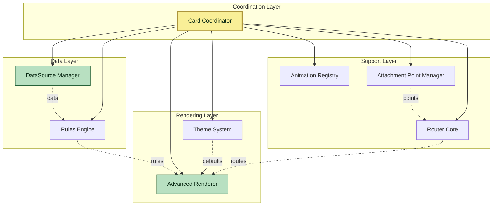

# Architecture Subsystems


LCARdS uses a **hybrid architecture** with core singleton systems for shared intelligence and per-card systems for local orchestration:

### Core Singleton Systems (Shared Across All Cards)

| Singleton | Access | Purpose |
|-----------|--------|---------|
| `lcardsCore.validationService` | CoreValidationService | Config validation |
| `lcardsCore.systemsManager` | CoreSystemsManager | Entity caching for LCARdS Cards |
| `lcardsCore.themeManager` | ThemeManager | Theme and design tokens |
| `lcardsCore.stylePresetManager` | StylePresetManager | Style presets and CSS utilities |
| `lcardsCore.animationRegistry` | AnimationRegistry | Animation instance caching |
| `lcardsCore.dataSourceManager` | DataSourceManager | Entity state and data fetching |
| `lcardsCore.rulesManager` | RulesEngine | Conditional styling rules |

### Per-Card Systems (One Instance Per Card)

| System | Used By | Purpose |
|--------|---------|---------|
| `AnimationManager` | Each card instance | Animation coordination and playback |
| `MSD SystemsManager` | MSD cards only | MSD rendering pipeline orchestration |

**Key Principle:** Core singletons provide shared intelligence (data, rules, themes) while per-card systems handle local rendering and animation. Any card can define `data_sources` and `rules` that are registered with global singletons, making them available system-wide for cross-card data sharing.

---

### Data Systems

#### [DataSource System](datasource-system.md)
**Central data processing hub** that connects Home Assistant entities to the overlay system.

**Key Features:**
- Real-time entity subscriptions
- Historical data buffering
- Transformation pipelines
- Aggregation calculations
- Computed value expressions

**When to use:** Anytime you need to display or process entity data.

---

### Processing Systems

#### [Rules Engine](rules-engine.md)
**Conditional logic system** for dynamic overlay styling and behavior.

**Key Features:**
- 20+ condition types
- Logical operators (all/any/not)
- DataSource integration
- Dependency tracking
- Rule tracing and debugging

**When to use:** Conditional styling, profile switching, alert visualization.

#### Template System (Support System)
**Modern unified template system** built into the core framework.

**Key Features:**
- Separation of concerns: detection → parsing → evaluation
- Multiple template types (JavaScript `[[[...]]]`, Token `{...}`, DataSource `{ds:...}`, Jinja2 `{{...}}`)
- Card-specific evaluators (UnifiedTemplateEvaluator for LCARdS Cards, DataSourceMixin for MSD)
- Shared detection and parsing via TemplateDetector and TemplateParser

**Location:** `src/core/templates/`

**When to use:** Template detection and parsing are automatic. Card evaluators handle execution transparently.

---

### Rendering Systems

#### [Advanced Renderer](advanced-renderer.md)
**Core rendering engine** that transforms configurations into visual elements.

**Key Features:**
- Overlay orchestration
- Incremental updates
- Instance caching
- Performance tracking
- Specialized renderers

**When to use:** All overlay rendering - the heart of the visual system.

#### [Theme System](theme-system.md)
**Unified styling system** with token-based themes.

**Key Features:**
- Token-based defaults
- Component scoping
- Multiple themes
- Hot-swappable styling
- Custom theme support

**When to use:** Consistent styling, theme switching, default values.

#### [Provenance Tracking](provenance-tracking.md)
**Configuration origin tracking system** for debugging and transparency.

**Key Features:**
- Config layer tracking
- Theme token resolution history
- Rule patch recording
- Template processing logs
- Style resolution provenance

**When to use:** Debugging config issues, understanding value origins, auditing changes.

#### [Auto DataSource Creation](auto-datasource-creation.md)
**Automatic DataSource creation feature** for chart cards and overlays.

**Key Features:**
- Auto-create DataSources from entity references
- Eliminates boilerplate configuration
- Supports history configuration
- Template entity auto-creation
- MSD and chart card integration

**When to use:** Simplifying DataSource setup, rapid prototyping, user-friendly configs.

#### [Style Resolver](style-resolver.md)
**Centralized style resolution system** with theme integration.

**Key Features:**
- Multi-tier resolution (5 tiers)
- Token resolution from themes
- Intelligent caching
- LCARS preset support
- Provenance tracking

**When to use:** All style resolution - integrates themes with overlays.

#### [Attachment Point Manager](attachment-point-manager.md)
**Centralized attachment point and anchor management** for line routing.

**Key Features:**
- Dual storage model (attachment points + anchors)
- 8-direction point system (center, cardinal, corners)
- Virtual anchor generation
- Gap-adjusted anchor preservation
- O(1) lookup performance

**When to use:** Line routing, anchor-based positioning, connector endpoints.

#### [Router Core](router-core.md)
**Intelligent path routing system** with obstacle avoidance and optimization.

**Key Features:**
- 3 routing strategies (Manhattan, Grid A*, Smart optimization)
- Channel-based routing guidance
- Obstacle avoidance with clearance
- Direction hints for segment control
- Corner rounding and path smoothing
- LRU route caching (256 routes)

**When to use:** Line overlay routing, connector paths, automated layout.

---

### Support Systems

#### [Validation System](validation-system.md)
**Schema-based validation system** for overlay configurations.

**Key Features:**
- Schema-based validation for all overlay types
- Token-aware validation
- Enhanced property support (font objects, markers)
- Conditional validation rules
- Chart data format validation
- Developer-friendly error messages

**When to use:** Configuration validation, error detection, schema enforcement.

#### [Pack System](pack-system.md)
**MSD pack structure and management** for themes, presets, and overlays.

**Key Features:**
- Theme definitions with token-based defaults
- Style preset bundles
- Complete overlay definitions
- Animation configurations
- Chart templates and presets

**When to use:** Creating packs, understanding pack structure, theme development.

#### [Animation Registry](animation-registry.md)
**Singleton animation caching system** with intelligent instance reuse.

**Key Features:**
- Intelligent instance caching (singleton)
- Semantic hash comparison
- Built-in presets (pulse, fade, draw, motionpath)
- Target compatibility validation
- Performance tracking and LRU cleanup
- Works with per-card AnimationManager instances

**When to use:** All animations - singleton provides caching while per-card AnimationManagers handle playback.

**Architecture Note:** AnimationRegistry is a singleton, but AnimationManager is instantiated per-card.

#### [Attachment Point Manager](attachment-point-manager.md)
**Attachment point calculation** for line overlay routing.

**Key Features:**
- Dynamic point calculation
- Edge detection (top/bottom/left/right)
- Anchor-based positioning
- Automatic updates

**When to use:** Lines connecting to overlays, dynamic routing.

#### [Router Core](router-core.md)
**Path routing calculations** for lines and connections.

**Key Features:**
- Pathfinding algorithms
- Obstacle avoidance
- Route optimization
- Caching

**When to use:** Complex line routing, automatic path calculation.

---

### Coordination & Management

#### [CoreSystemsManager](core-systems-manager.md)
**Lightweight entity tracking singleton** for LCARdS Cards.

**Key Features:**
- Entity state caching (80-90% performance improvement)
- Entity subscription management (reactive updates)
- Card registration and lifecycle tracking
- Cross-card entity change notifications
- HASS change detection and distribution

**When to use:** LCARdS Cards, lightweight entity access.

**NOT for:** MSD cards (use DataSourceManager singleton for advanced data processing).

#### [MSD Card Coordinator](msd-card-coordinator.md)
**Per-card orchestrator** for MSD cards (NOT used by LCARdS Cards).

**Key Features:**
- Per-MSD-card coordination
- Connects to singleton layer (RulesEngine, DataSourceManager, etc.)
- Manages card-specific rendering pipeline
- Lifecycle management for MSD overlays
- Performance monitoring

**When to use:** MSD cards only. LCARdS Cards use CoreSystemsManager instead.

---

## System Relationships



---

## Quick Reference

### Data Flow

```
Entity State Changes
    ↓
DataSource Manager (subscribe, transform, aggregate)
    ↓
Rules Engine (evaluate conditions)
    ↓
Advanced Renderer (apply styles, render overlays)
    ↓
Visual Output

Note: Template evaluation is handled by card-specific evaluators
(UnifiedTemplateEvaluator for LCARdS Cards, DataSourceMixin for MSD)
```

### Initialization Order

1. **DataSource Manager** - First (provides data to others)
2. **Rules Engine** - Second (needs data)
3. **Advanced Renderer** - Third (needs data, rules)
4. **Animation Registry** - Fourth (needs renderer)
5. **Attachment Point Manager** - Fifth (needs overlays)
6. **Router Core** - Sixth (needs attachment points)

### Common Patterns

#### Accessing a Subsystem

```javascript
// From card instance
const coordinator = this.coordinator;
const dataSourceManager = coordinator.dataSourceManager;
const renderer = coordinator.advancedRenderer;
```

#### Debug Access

```javascript
// From browser console
const sm = window.lcards.debug.msd.pipelineInstance.coordinator;
const dsm = sm.dataSourceManager;
const renderer = sm.advancedRenderer;
```

#### Subscribing to Updates

```javascript
// DataSource updates
dataSourceManager.on('update', (sourceId, data) => {
  console.log('Source updated:', sourceId, data);
});

// Rule changes
rulesEngine.on('rulesChanged', () => {
  renderer.updateOverlays();
});
```

---

## Documentation Status

| Subsystem | Status | Lines | Source |
|-----------|--------|-------|--------|
| **Card Coordinator** | ✅ Complete | 650 | New |
| **DataSource System** | ✅ Complete | 1,200 | Phase 3 |
| **Rules Engine** | ✅ Complete | 850 | user/rules_engine_complete_documentation.md |
| **Advanced Renderer** | ✅ Complete | 800 | src/msd/renderer/AdvancedRenderer.js |
| **Theme System** | ✅ Complete | 700 | user/theme_system_complete_reference.md |
| **Style Resolver** | ✅ Complete | 890 | src/msd/styles/StyleResolverService.js |
| **Validation System** | ✅ Complete | 962 | architecture/validation_architecture.md |
| **Pack System** | ✅ Complete | 445 | architecture/MSD Pack Structure.md |
| **Animation Registry** | ✅ Complete | 850 | src/msd/animation/AnimationRegistry.js |
| **Attachment Point Manager** | ✅ Complete | 800 | src/msd/renderer/AttachmentPointManager.js |
| **Router Core** | ✅ Complete | 1,050 | src/msd/routing/RouterCore.js |

**Total:** 11 subsystems, 9,897 lines of documentation, 100% coverage

**Note:** Template processing is now handled by the unified template system in `src/core/templates/` (TemplateDetector, TemplateParser, and card-specific evaluators).

---

## 📚 Related Documentation

### Architecture
- **[Architecture Overview](../overview.md)** - System architecture
- **[Pipeline Architecture](../implementation-details/pipeline-architecture.md)** - Data flow
- **[Gap System](../implementation-details/gap-system.md)** - Gap calculations

### User Guides
- **[Overlay System](../../user-guide/configuration/overlays/README.md)** - Overlay types
- **[DataSource Configuration](../../user-guide/configuration/datasources.md)** - DataSource setup
- **[DataSource Transformations](../../user-guide/configuration/datasource-transformations.md)** - Transform data
- **[DataSource Aggregations](../../user-guide/configuration/datasource-aggregations.md)** - Aggregate data

### Examples
- **[DataSource Examples](../../user-guide/examples/datasource-examples.md)** - Complete examples
- **[Dashboard Examples](../../user-guide/examples/dashboard-examples.md)** - Full dashboards

---

**Status:** Complete
