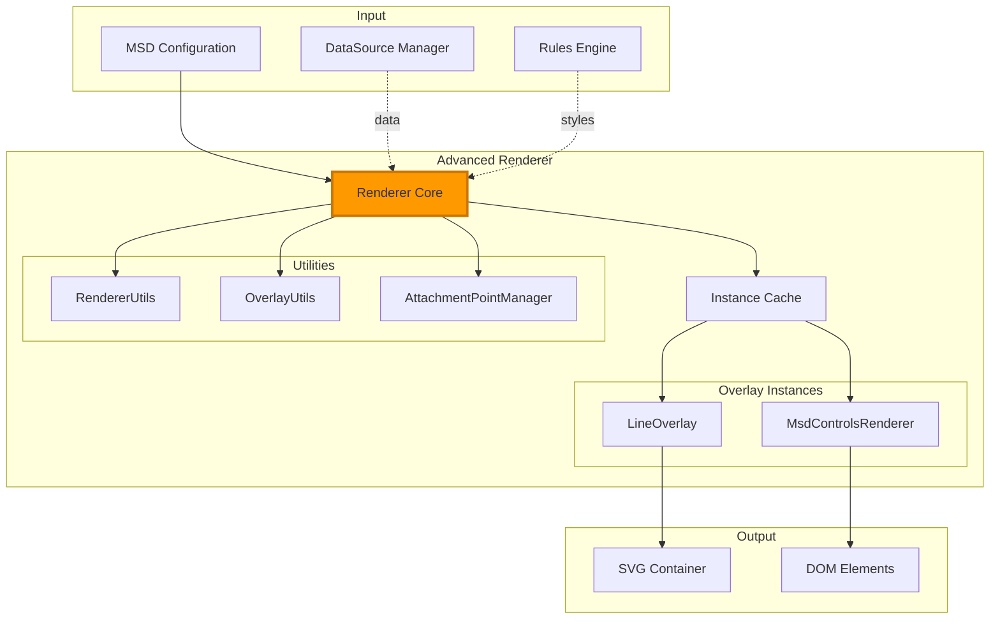
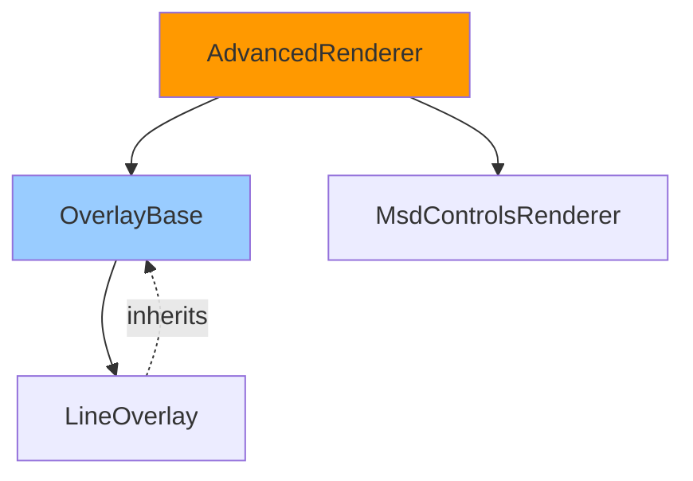
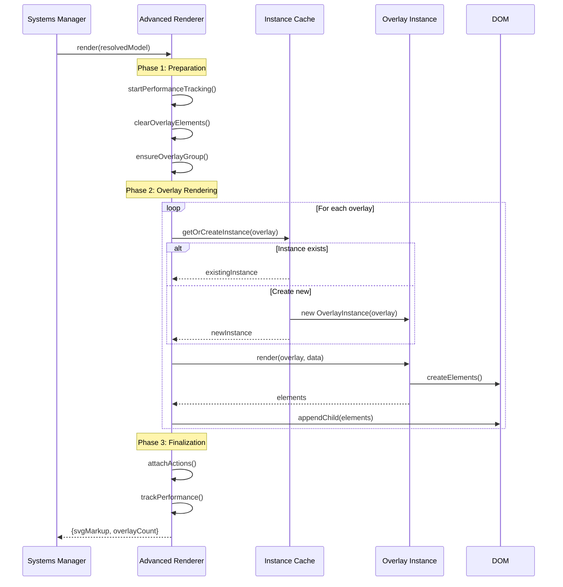
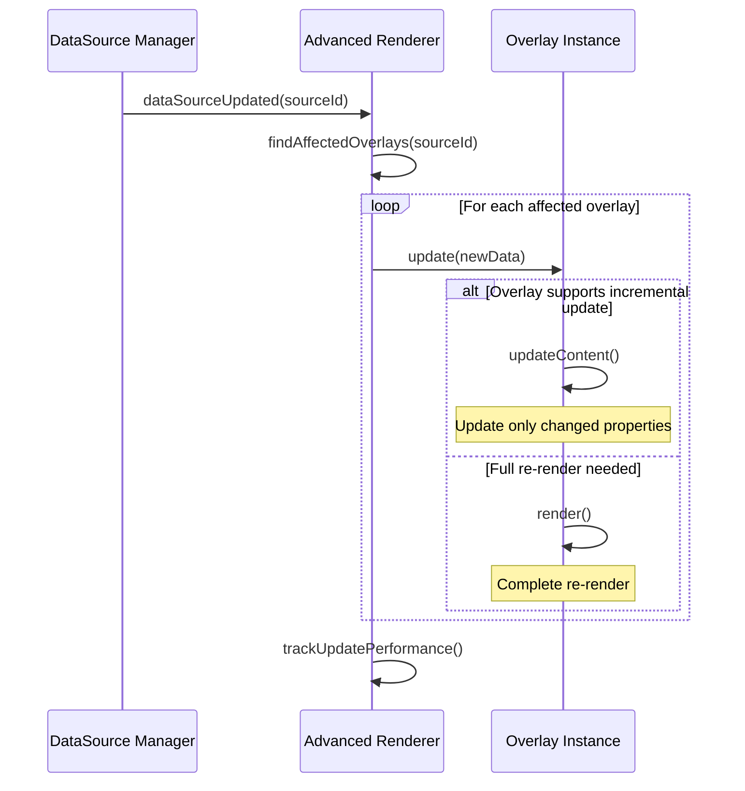
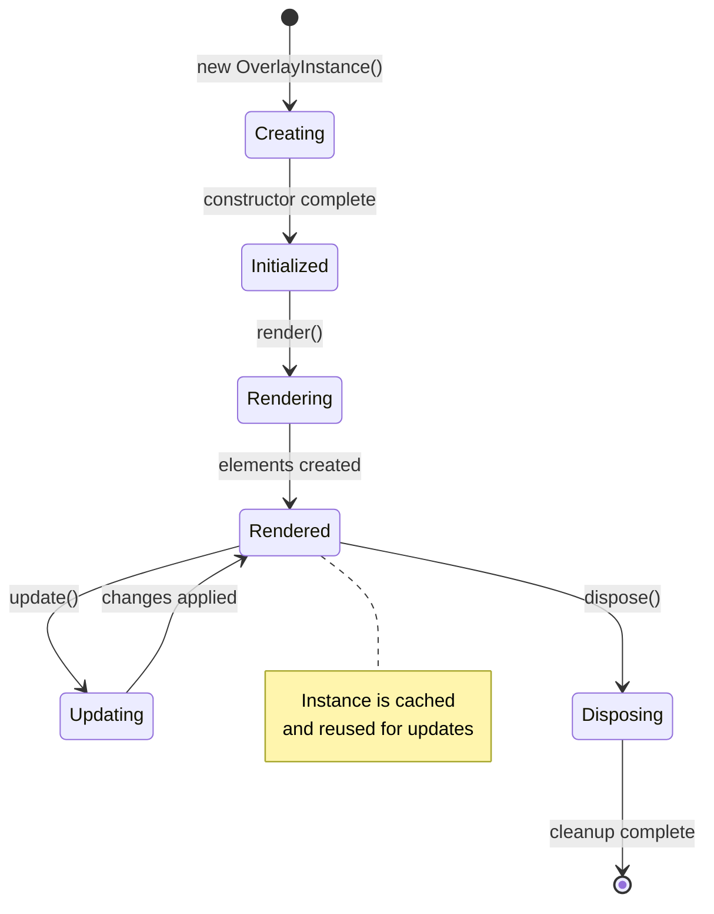

# Advanced Renderer

> **Core rendering engine for the overlay system**
> Orchestrates overlay rendering, manages DOM updates, and coordinates with specialized renderers.

---

## 📋 Table of Contents

1. [Overview](#overview)
2. [Architecture](#architecture)
3. [Rendering Pipeline](#rendering-pipeline)
4. [Overlay Lifecycle](#overlay-lifecycle)
5. [Incremental Updates](#incremental-updates)
6. [Specialized Renderers](#specialized-renderers)
7. [Performance](#performance)
8. [API Reference](#api-reference)
9. [Debugging](#debugging)

---

## Overview

The **Advanced Renderer** is the core rendering engine that transforms overlay configurations into visual elements. It coordinates specialized renderers, manages the overlay lifecycle, and implements efficient incremental update strategies.

### Responsibilities

- ✅ **Overlay orchestration** - Coordinate rendering of all overlay types
- ✅ **DOM management** - Create, update, and remove overlay elements
- ✅ **Incremental updates** - Efficiently update only changed overlays
- ✅ **Instance caching** - Maintain overlay instances for reuse
- ✅ **Performance tracking** - Monitor rendering performance
- ✅ **Dependency management** - Track overlay dependencies
- ✅ **Action attachment** - Bind interactive behaviors

### Overlay Types

The renderer handles these overlay types:

| Type | Renderer | Element | Description |
|------|----------|---------|-------------|
| **line** | LineOverlay | SVG line/path | Visual dividers and connectors |
| **card** / **control** | MsdControlsRenderer | SVG foreignObject | Embedded HA cards (SimpleCards, custom cards) |

> **Note:** Previous overlay types (`text`, `button`, `status_grid`, `apexchart`, etc.) were removed in v1.16.22+. Use SimpleCards or embedded HA cards instead.

---

## Architecture

### System Integration



### Renderer Hierarchy



---

## Rendering Pipeline

### Full Render Flow



### Incremental Update Flow



---

## Overlay Lifecycle

### Instance Creation

```javascript
// First render - create instance
const overlay = {
  id: 'temp_display',
  type: 'text',
  source: 'temperature',
  position: [100, 100]
};

// Renderer creates instance
const instance = new TextOverlay(overlay, systemsManager);
overlayRenderers.set('temp_display', instance);

// Render initial state
const element = instance.render(overlay, data);
```

### Instance Reuse

```javascript
// Subsequent renders - reuse instance
const cached = overlayRenderers.get('temp_display');

// Update with new data
cached.update(element, overlay, newData);
```

### Instance Disposal

```javascript
// Remove overlay
const instance = overlayRenderers.get('temp_display');
instance.dispose();
overlayRenderers.delete('temp_display');
```

### Lifecycle States



---

## Incremental Updates

### Update Strategies

The renderer implements efficient update strategies based on what changed:

| Change Type | Strategy | Cost |
|-------------|----------|------|
| **Data only** | Update content | Low |
| **Style only** | Update attributes | Low |
| **Position/size** | Update transform | Low |
| **Type change** | Full re-render | High |
| **Add/remove** | DOM manipulation | Medium |

### Data-Only Updates

```javascript
// DataSource value changes
dataSourceManager.on('update', (sourceId, newValue) => {
  // Find overlays using this source
  const affected = renderer.getOverlaysUsingSource(sourceId);

  // Update only content, not structure
  affected.forEach(overlayId => {
    const instance = overlayRenderers.get(overlayId);
    const element = overlayElementCache.get(overlayId);

    // Incremental update
    instance.update(element, overlay, newValue);
  });
});
```

### Style-Only Updates

```javascript
// Rules engine applies style changes
rulesEngine.on('stylesChanged', (changes) => {
  changes.forEach(change => {
    const { overlayId, style } = change;
    const instance = overlayRenderers.get(overlayId);
    const element = overlayElementCache.get(overlayId);

    // Update only styles
    instance.updateStyle(element, style);
  });
});
```

### Full Re-render

```javascript
// Configuration changes require full re-render
function updateConfiguration(newConfig) {
  // Clear instance cache
  overlayRenderers.forEach(instance => instance.dispose());
  overlayRenderers.clear();

  // Full render with new config
  renderer.render(newConfig);
}
```

---

## BaseRenderer Base Class

**Abstract base class** providing common functionality for all MSD overlay renderers.

### Purpose

BaseRenderer consolidates shared functionality to eliminate code duplication and provide consistent patterns across all specialized renderers.

### Benefits

- ✅ **Eliminates 200-300 lines** of duplicate code per renderer
- ✅ **Consistent theme integration** patterns
- ✅ **Unified logging** with minification-safe renderer names
- ✅ **Single source of truth** for ThemeManager resolution
- ✅ **Easy to extend** with new renderers

### Architecture

```
BaseRenderer (abstract base class)
├── ThemeManager Integration
│   ├── _resolveThemeManager()
│   └── _getThemeManager()
├── Default Value Resolution
│   └── _getDefault(path, fallback)
├── Token System
│   ├── _resolveStyleProperty()
│   └── _isTokenReference()
├── Scaling Context
│   └── _getScalingContext(fallbackViewBox)
├── Logging Utilities
│   ├── _logDebug(message, ...args)
│   ├── _logWarn(message, ...args)
│   └── _logError(message, ...args)
└── Container Resolution
    └── _resolveContainerElement()

Current Renderers:
└── LineOverlay (extends OverlayBase)

Card-based overlays are handled by MsdControlsRenderer.
```

### Core Features

#### ThemeManager Integration

Automatically resolves ThemeManager instance from multiple sources:

```javascript
class MyRenderer extends BaseRenderer {
  constructor() {
    super(); // themeManager is now available
    this.rendererName = 'MyRenderer';
  }
}
```

#### Default Value Resolution

Get component-specific defaults from active theme:

```javascript
// Get status grid text padding
const padding = this._getDefault('statusGrid.textPadding', 8);

// Get text default color
const color = this._getDefault('text.defaultColor', '#FFFFFF');

// Get line default width
const width = this._getDefault('line.defaultWidth', 2);
```

#### Token System Integration

Resolve token references and style properties:

```javascript
const color = this._resolveStyleProperty(
  style.color,                    // User value
  'defaultColor',                 // Token path
  resolveToken,                   // Token resolver
  this._getDefault('line.defaultColor', '#FF9900'), // Fallback
  scalingContext                  // Context
);
```

#### Consistent Logging

Minification-safe logging with explicit renderer names:

```javascript
class StatusGridRenderer extends BaseRenderer {
  constructor() {
    super();
    this.rendererName = 'StatusGridRenderer'; // Explicit name
  }

  render(overlay) {
    this._logDebug('Rendering overlay', overlay);
    this._logWarn('Performance concern', metrics);
    this._logError('Render failed', error);
  }
}
```

### API Reference

| Method | Description |
|--------|-------------|
| `_getDefault(path, fallback)` | Get theme default value |
| `_isTokenReference(value)` | Check if value is token reference |
| `_resolveStyleProperty(...)` | Resolve style with token support |
| `_getScalingContext(viewBox)` | Get scaling context for calculations |
| `_logDebug(msg, ...args)` | Log debug message with renderer name |
| `_logWarn(msg, ...args)` | Log warning with renderer name |
| `_logError(msg, ...args)` | Log error with renderer name |

### Extending BaseRenderer

**Template for new renderer:**

```javascript
import BaseRenderer from '../BaseRenderer.js';

export class MyOverlayRenderer extends BaseRenderer {
  constructor() {
    super();
    this.rendererName = 'MyOverlayRenderer'; // Explicit name
  }

  static render(overlay, anchors, viewBox, svgContainer) {
    const instance = new MyOverlayRenderer();
    return instance._render(overlay, anchors, viewBox, svgContainer);
  }

  _render(overlay, anchors, viewBox, svgContainer) {
    // Use BaseRenderer features:
    const defaultColor = this._getDefault('myOverlay.defaultColor', '#FF9900');
    this._logDebug('Rendering with color', defaultColor);

    // ... render logic ...

    return svgMarkup;
  }

  updateMyOverlayData(element, overlay, resolvedValue, themeManager) {
    this._logDebug('Updating data', resolvedValue);
    // ... update logic ...
  }
}
```

---

## Current Overlay Renderers

### LineOverlay

Renders SVG lines with attachment point support:

```javascript
class LineOverlay extends OverlayBase {
  render(overlay, data) {
    if (overlay.attach_start || overlay.attach_end) {
      // Use path for attachment points
      return this.renderAttachedLine(overlay);
    } else {
      // Simple line element
      return this.renderSimpleLine(overlay);
    }
  }
}
```

**Location:** `src/msd/overlays/LineOverlay.js`

### MsdControlsRenderer (Card-based overlays)

Renders Home Assistant cards and SimpleCards in foreignObject:

```javascript
class MsdControlsRenderer {
  renderControlOverlay(overlay, svgContainer) {
    const fo = document.createElementNS(SVG_NS, 'foreignObject');
    // Position and size from overlay config
    fo.setAttribute('x', overlay.position[0]);
    fo.setAttribute('y', overlay.position[1]);
    fo.setAttribute('width', overlay.size[0]);
    fo.setAttribute('height', overlay.size[1]);
    
    // Create and embed HA card
    const cardElement = this.createControlElement(overlay);
    fo.appendChild(cardElement);
    
    return fo;
  }
}
```

**Location:** `src/msd/controls/MsdControlsRenderer.js`

> **Note:** Previous specialized renderers (TextOverlay, ButtonOverlay, StatusGridOverlay, ApexChartsOverlay) were removed in v1.16.22+. Their functionality is now provided through SimpleCards or embedded HA cards.

---

## Performance

### Performance Tracking

The renderer tracks detailed performance metrics:

```javascript
const metrics = renderer.getPerformanceMetrics();

console.log('Metrics:', metrics);
// {
//   totalRenderTime: 45.2,
//   stages: {
//     preparation: 2.1,
//     overlayRendering: 38.5,
//     domInjection: 3.2,
//     actionAttachment: 1.4
//   },
//   overlayTimings: Map {
//     'temp_display' => 2.3,
//     'temp_chart' => 15.7,
//     ...
//   },
//   overlayCount: 12,
//   lastRenderTimestamp: 1234567890
// }
```

### Optimization Strategies

**1. Instance Caching**

```javascript
// Reuse instances across renders
const cached = overlayRenderers.get(overlayId);
if (cached) {
  cached.update(element, overlay, data);
} else {
  const instance = new OverlayInstance(overlay);
  overlayRenderers.set(overlayId, instance);
  instance.render(overlay, data);
}
```

**2. Batch DOM Updates**

```javascript
// Collect all elements first
const elements = overlays.map(overlay => renderOverlay(overlay));

// Single DOM update
const fragment = document.createDocumentFragment();
elements.forEach(el => fragment.appendChild(el));
overlayGroup.appendChild(fragment);
```

**3. Selective Updates**

```javascript
// Only update overlays affected by data change
const affected = getOverlaysUsingSource(sourceId);
affected.forEach(overlayId => updateOverlay(overlayId));
```

**4. Defer Expensive Operations**

```javascript
// Defer chart rendering
requestAnimationFrame(() => {
  renderApexChart(overlay);
});
```

### Performance Best Practices

✅ **Limit overlay count** - Keep under 50 overlays per dashboard
✅ **Use incremental updates** - Enable for text and status grid overlays
✅ **Batch updates** - Group multiple changes into single render
✅ **Cache instances** - Reuse overlay instances across renders
✅ **Minimize re-renders** - Only render when config or data changes
✅ **Profile performance** - Use browser dev tools to identify bottlenecks

---

## Implementation Patterns

### Creating a New Overlay Renderer

**Complete workflow** for implementing a new overlay type:

#### Step 1: Create Renderer Class

**File:** `src/msd/renderer/{Type}OverlayRenderer.js`

```javascript
import BaseRenderer from '../BaseRenderer.js';

export class MyOverlayRenderer extends BaseRenderer {
  constructor() {
    super();
    this.rendererName = 'MyOverlayRenderer';
  }

  /**
   * Initial render - static method returns SVG markup
   */
  static render(overlay, anchors, viewBox, svgContainer) {
    const instance = new MyOverlayRenderer();
    return instance._render(overlay, anchors, viewBox, svgContainer);
  }

  _render(overlay, anchors, viewBox, svgContainer) {
    // Use BaseRenderer features
    const defaultColor = this._getDefault('myOverlay.defaultColor', '#FF9900');
    this._logDebug('Rendering overlay', overlay.id);

    // Process templates for initial render
    const content = this._processTemplatesForInitialRender(
      overlay,
      overlay.style,
      overlay.style.content
    );

    // Build SVG markup
    const markup = `
      <g data-overlay-id="${overlay.id}">
        <text data-updatable="true">${content}</text>
      </g>
    `;

    return markup;
  }

  /**
   * Dynamic data update - called by BaseOverlayUpdater
   */
  static updateMyOverlayData(overlayElement, overlay, sourceData) {
    try {
      const targetElement = overlayElement.querySelector('[data-updatable]');
      if (!targetElement) return false;

      const renderer = new MyOverlayRenderer();
      const content = overlay.style.content || '';
      const newContent = renderer._processTemplates(content, sourceData);

      if (newContent !== targetElement.textContent) {
        targetElement.textContent = newContent;
        console.log(`[MyOverlayRenderer] ✅ Updated ${overlay.id}`);
        return true;
      }

      return false;
    } catch (error) {
      console.error(`[MyOverlayRenderer] Update failed:`, error);
      return false;
    }
  }

  /**
   * Template processing for initial render
   */
  _processTemplatesForInitialRender(overlay, style, content) {
    if (!this._hasTemplates(content)) return content;

    // Try multiple approaches to get DataSource data
    let sourceData = null;

    if (overlay.dataSource && this.systemsManager) {
      sourceData = this.systemsManager.getDataSourceData?.(overlay.dataSource);
    }

    if (!sourceData) {
      sourceData = window.__msdDataContext || overlay._dataContext;
    }

    if (sourceData) {
      return this._processTemplates(content, sourceData);
    }

    return content;
  }

  /**
   * Template processing logic
   */
  _processTemplates(content, sourceData) {
    if (!sourceData || typeof content !== 'string' || !content.includes('{')) {
      return content;
    }

    return content.replace(/\{([^}]+)\}/g, (match, template) => {
      const [fieldPath, format] = template.split(':');
      const value = fieldPath.split('.').reduce((obj, key) => obj?.[key], sourceData);

      if (value !== undefined && value !== null) {
        if (format?.includes('f')) {
          const decimals = format.match(/\.(\d+)f/)?.[1];
          if (decimals) return Number(value).toFixed(parseInt(decimals));
        } else if (format === '%') {
          return `${value}%`;
        }
        return String(value);
      }

      return match;
    });
  }

  _hasTemplates(content) {
    return content && typeof content === 'string' && content.includes('{');
  }
}
```

#### Step 2: Register in AdvancedRenderer

**File:** `src/msd/renderer/AdvancedRenderer.js`

```javascript
import { MyOverlayRenderer } from './MyOverlayRenderer.js';

// In renderOverlay() method:
renderOverlay(overlay, anchors, viewBox, svgContainer) {
  switch (overlay.type) {
    case 'my_overlay':
      return MyOverlayRenderer.render(overlay, anchors, viewBox, svgContainer);
    // ... other cases
  }
}

// In updateOverlayData() method:
updateOverlayData(overlayId, sourceData) {
  const overlayElement = this.overlayElementCache.get(overlayId);
  const overlay = this.findOverlayById(overlayId);

  switch (overlay.type) {
    case 'my_overlay':
      MyOverlayRenderer.updateMyOverlayData(overlayElement, overlay, sourceData);
      break;
    // ... other cases
  }
}
```

#### Step 3: Register in BaseOverlayUpdater

**File:** `src/msd/BaseOverlayUpdater.js`

```javascript
_registerUpdaters() {
  this.overlayUpdaters.set('my_overlay', {
    needsUpdate: (overlay, sourceData) => this._hasTemplateContent(overlay),
    update: (overlayId, overlay, sourceData) =>
      this._updateMyOverlay(overlayId, overlay, sourceData),
    hasTemplates: (overlay) => this._hasTemplateContent(overlay)
  });
}

_updateMyOverlay(overlayId, overlay, sourceData) {
  this.advancedRenderer.updateOverlayData(overlayId, sourceData);
}
```

### Rendering Code Paths

**Three distinct update flows:**

#### 1. Initial Render Flow

```
MSD Pipeline
  → AdvancedRenderer.render()
  → AdvancedRenderer.renderOverlay()
  → MyOverlayRenderer.render()
  → SVG markup returned
```

#### 2. Data Update Flow (BaseOverlayUpdater)

```
DataSource Entity Change
  → BaseOverlayUpdater.updateOverlaysForDataSourceChanges()
  → BaseOverlayUpdater._updateMyOverlay()
  → AdvancedRenderer.updateOverlayData()
  → MyOverlayRenderer.updateMyOverlayData()
  → DOM element updated
```

#### 3. Style Update Flow (Incremental)

```
Rules Engine Entity Change
  → SystemsManager._handleEntityChange()
  → RulesEngine.evaluateDirty()
  → SystemsManager._applyIncrementalUpdates()
  → MyOverlayRenderer.updateIncremental()
  → DOM element updated
```

### Implementation Checklist

When implementing a new overlay renderer:

- ✅ **Extend BaseRenderer** - Inherit common functionality
- ✅ **Set rendererName** - Explicit name for logging
- ✅ **Implement static render()** - Initial SVG generation
- ✅ **Implement static updateData()** - Dynamic content updates
- ✅ **Add data-updatable attributes** - Mark updatable DOM elements
- ✅ **Process templates** - Support DataSource templates
- ✅ **Use _getDefault()** - Get theme defaults
- ✅ **Use logging methods** - Consistent debug output
- ✅ **Register in AdvancedRenderer** - Add to switch statements
- ✅ **Register in BaseOverlayUpdater** - Enable dynamic updates
- ✅ **Test initial render** - Verify SVG generation
- ✅ **Test data updates** - Verify DataSource changes propagate
- ✅ **Test style updates** - Verify Rules Engine updates work

---

## API Reference

### Constructor

```javascript
new AdvancedRenderer(mountEl, routerCore, systemsManager)
```

**Parameters:**
- `mountEl` (Element) - DOM element containing SVG
- `routerCore` (RouterCore) - Router for line calculations
- `systemsManager` (SystemsManager) - Access to all systems

### Methods

#### `render(resolvedModel)`

Perform full render of all overlays.

```javascript
const result = renderer.render(resolvedModel);
// {
//   svgMarkup: '<svg>...</svg>',
//   overlayCount: 12,
//   errors: [],
//   provenance: {...}
// }
```

**Parameters:**
- `resolvedModel` (Object) - Complete configuration with overlays

**Returns:** Object with render results

#### `updateOverlay(overlayId, newData)`

Update single overlay incrementally.

```javascript
renderer.updateOverlay('temp_display', { value: 25 });
```

**Parameters:**
- `overlayId` (string) - Overlay identifier
- `newData` (Object) - New data values

#### `getOverlaysUsingSource(sourceId)`

Find overlays that use a DataSource.

```javascript
const affected = renderer.getOverlaysUsingSource('temperature');
// ['temp_display', 'temp_chart']
```

**Parameters:**
- `sourceId` (string) - DataSource identifier

**Returns:** Array of overlay IDs

#### `getPerformanceMetrics()`

Get rendering performance metrics.

```javascript
const metrics = renderer.getPerformanceMetrics();
```

**Returns:** Object with performance data

#### `dispose()`

Clean up all overlay instances.

```javascript
renderer.dispose();
```

### Properties

| Property | Type | Description |
|----------|------|-------------|
| `mountEl` | Element | Mount point DOM element |
| `overlayRenderers` | Map | Cached overlay instances |
| `overlayElementCache` | Map | Cached DOM elements |
| `attachmentManager` | AttachmentPointManager | Attachment point manager |
| `systemsManager` | SystemsManager | Systems access |

---

## Debugging

### Browser Console Access

```javascript
// Access renderer
const renderer = window.lcards.debug.msd.pipelineInstance.systemsManager.advancedRenderer;

// Check overlay instances
console.log('Cached instances:', renderer.overlayRenderers.size);
console.log('Instance IDs:', [...renderer.overlayRenderers.keys()]);

// Get specific instance
const instance = renderer.overlayRenderers.get('temp_display');
console.log('Instance:', instance);

// Check performance
const metrics = renderer.getPerformanceMetrics();
console.log('Last render:', metrics.totalRenderTime, 'ms');
```

### Overlay Inspection

```javascript
// Find overlay element
const element = renderer.overlayElementCache.get('temp_display');
console.log('Element:', element);
console.log('Position:', element.getAttribute('transform'));

// Check overlay data
const instance = renderer.overlayRenderers.get('temp_display');
console.log('Current data:', instance.currentData);
```

### Performance Profiling

```javascript
// Enable detailed tracking
renderer.setOption('trackPerformance', true);

// Trigger render
renderer.render(resolvedModel);

// Check timings
const metrics = renderer.getPerformanceMetrics();
console.log('Stage timings:', metrics.stages);
console.log('Slowest overlays:',
  [...metrics.overlayTimings.entries()]
    .sort((a, b) => b[1] - a[1])
    .slice(0, 5)
);
```

---

## 📚 Related Documentation

- **[Overlay System Hub](../../user-guide/configuration/overlays/README.md)** - Overlay types
- **[DataSource System](datasource-system.md)** - Data integration
- **[Systems Manager](systems-manager.md)** - System coordination
- **[Rules Engine](rules-engine.md)** - Conditional styling

---

**Last Updated:** October 26, 2025
**Version:** 2025.10.1-fuk.42-69
**Source:** `/src/msd/renderer/AdvancedRenderer.js` (2,784 lines)
