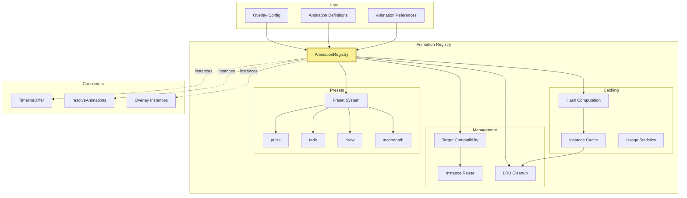
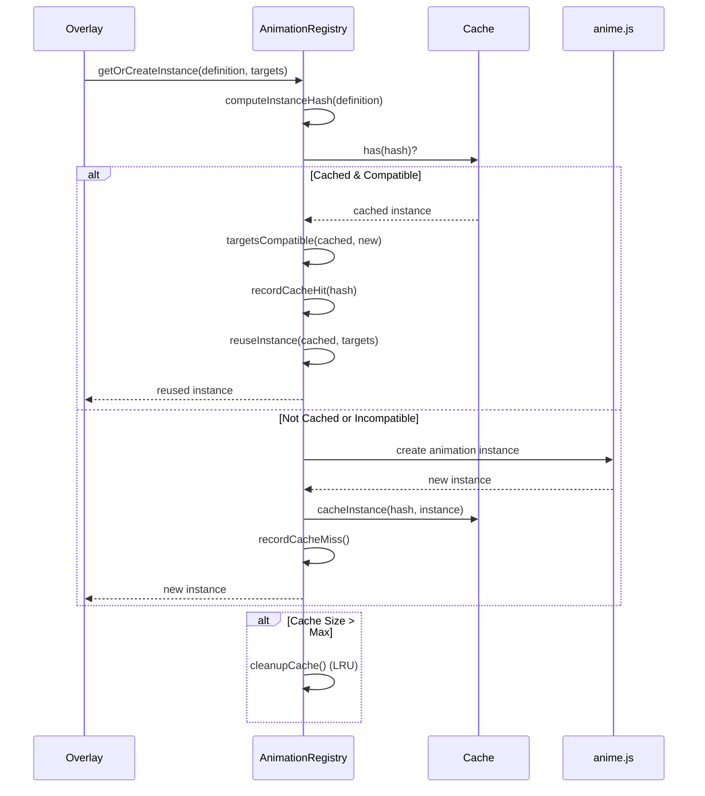

# Animation Registry (Singleton)

> **Shared animation management system across all LCARdS cards**
> Singleton registry for anime.js animations with intelligent caching, semantic comparison, and multi-card coordination.

---

## 📋 Table of Contents

1. [Overview](#overview)
2. [Architecture](#architecture)
3. [Animation Presets](#animation-presets)
4. [Instance Caching](#instance-caching)
5. [Target Compatibility](#target-compatibility)
6. [Performance](#performance)
7. [Configuration](#configuration)
8. [API Reference](#api-reference)
9. [Examples](#examples)
10. [Debugging](#debugging)

---

## Overview

The **Animation Registry** is a **singleton service** that provides centralized animation caching across all card instances. It works in conjunction with per-card **AnimationManager** instances to enable animation sharing, prevent duplicate instances, and coordinate animations across cards.

### Key Features

- 🌐 **Singleton Architecture** - Single animation registry serves all card instances
- ✅ **Multi-Card Coordination** - Animations can target elements across different cards
- ✅ **Intelligent caching** - Reuse animation instances with semantic comparison
- ✅ **Preset system** - Built-in animation presets (pulse, fade, draw, motionpath)
- ✅ **Target compatibility** - Automatic target validation and retargeting
- ✅ **Cross-Card Targeting** - Animations can reference elements in other cards
- ✅ **Performance tracking** - Cache hits, misses, reuse rates across all cards
- ✅ **LRU cleanup** - Automatic cache management
- ✅ **Debug access** - Global debug interface

### Architecture: Singleton Registry + Per-Card Managers

**AnimationRegistry (Singleton):**
- Animation instance creation and caching across all cards
- Semantic hash computation for definitions
- Target compatibility validation (including cross-card targets)
- Instance reuse and retargeting between cards
- Cache cleanup and optimization
- Performance statistics across all cards

**AnimationManager (Per-Card):**
- Created once per card instance
- Coordinates animations within its card
- Accesses the singleton AnimationRegistry for caching
- Manages local animation playback and state
- Handles card-specific animation triggers

**Does NOT handle (delegated to other systems):**
- Timeline coordination (delegated to `TimelineDiffer`)
- Animation resolution (delegated to `resolveAnimations`)
- Preset definitions (delegated to `presets.js`)

---

## Architecture

### System Integration



### Instance Lifecycle



---

## Animation Presets

### Built-in Presets

The Animation Registry includes 4 built-in presets:

#### 1. Pulse

Pulsing scale and opacity animation.

```javascript
registerAnimationPreset('pulse', (def) => {
  const p = def.params || {};
  return {
    anime: {
      duration: p.duration || 1600,
      loop: p.loop !== false,
      direction: p.alternate ? 'alternate' : 'normal',
      easing: p.easing || 'easeInOutSine',
      scale: [1, p.max_scale || 1.1],
      opacity: p.min_opacity != null ? [{ value: p.min_opacity }, { value: 1 }] : undefined
    }
  };
});
```

**Parameters:**
- `duration` (number) - Animation duration (default: 1600ms)
- `loop` (boolean) - Loop animation (default: true)
- `alternate` (boolean) - Alternate direction (default: false)
- `easing` (string) - Easing function (default: 'easeInOutSine')
- `max_scale` (number) - Maximum scale (default: 1.1)
- `min_opacity` (number) - Minimum opacity (optional)

#### 2. Fade

Fade in/out animation.

```javascript
registerAnimationPreset('fade', (def) => {
  const p = def.params || {};
  return {
    anime: {
      duration: p.duration || 600,
      easing: p.easing || 'linear',
      opacity: p.to != null ? p.to : [0, 1],
      loop: p.loop || false
    }
  };
});
```

**Parameters:**
- `duration` (number) - Animation duration (default: 600ms)
- `easing` (string) - Easing function (default: 'linear')
- `to` (number|Array) - Target opacity (default: [0, 1])
- `loop` (boolean) - Loop animation (default: false)

#### 3. Draw

SVG path drawing animation.

```javascript
registerAnimationPreset('draw', (def) => {
  const p = def.params || {};
  return {
    anime: {
      duration: p.duration || 1200,
      easing: p.easing || 'easeInOutSine',
      strokeDashoffset: [anime => anime.setDashoffset, 0],
      loop: p.loop || false,
      direction: p.alternate ? 'alternate' : 'normal'
    }
  };
});
```

**Parameters:**
- `duration` (number) - Animation duration (default: 1200ms)
- `easing` (string) - Easing function (default: 'easeInOutSine')
- `loop` (boolean) - Loop animation (default: false)
- `alternate` (boolean) - Alternate direction (default: false)

#### 4. MotionPath

Motion path following animation.

```javascript
registerAnimationPreset('motionpath', (def) => {
  const p = def.params || {};
  return {
    anime: {
      duration: p.duration || 4000,
      loop: p.loop !== false,
      easing: p.easing || 'linear',
      update: p.update
    }
  };
});
```

**Parameters:**
- `duration` (number) - Animation duration (default: 4000ms)
- `loop` (boolean) - Loop animation (default: true)
- `easing` (string) - Easing function (default: 'linear')
- `update` (function) - Update callback (optional)

### Custom Presets

Register custom animation presets:

```javascript
import { registerAnimationPreset } from './animation/presets.js';

registerAnimationPreset('bounce', (def) => {
  const p = def.params || {};
  return {
    anime: {
      duration: p.duration || 1000,
      easing: 'easeOutBounce',
      translateY: [0, p.distance || -50, 0],
      loop: p.loop || false
    }
  };
});
```

---

## Instance Caching

### Hash Computation

The registry computes **semantic hashes** to identify equivalent animations:

```javascript
computeInstanceHash(definition) {
  const semantic = {
    preset: definition.preset,
    params: this.normalizeParams(definition.params),
    duration: this.normalizeNumber(definition.duration),
    easing: definition.easing,
    loop: definition.loop,
    alternate: definition.alternate,
    delay: this.normalizeNumber(definition.delay)
    // Excludes: targets, callbacks, DOM references
  };

  return computeObjectHash(semantic);
}
```

### Normalization

Numbers are normalized to prevent floating-point churn:

```javascript
normalizeNumber(value) {
  if (typeof value === 'number') {
    return Math.round(value * 1000) / 1000; // 3 decimal places
  }
  return value;
}
```

### Cache Strategy

```javascript
// Cache structure
cache = new Map(); // hash -> {instance, definition, targets, createdAt}
usageStats = new Map(); // hash -> {count, lastUsed}
instanceToHash = new WeakMap(); // instance -> hash
```

### LRU Cleanup

Automatic cleanup when cache exceeds max size:

```javascript
cleanupCache() {
  const entries = Array.from(this.usageStats.entries());

  // Sort by last used time (oldest first)
  entries.sort(([, a], [, b]) => a.lastUsed - b.lastUsed);

  // Remove oldest entries
  const toRemove = entries.slice(0, entries.length - this.maxCacheSize);

  toRemove.forEach(([hash]) => {
    this.cache.delete(hash);
    this.usageStats.delete(hash);
  });
}
```

**Cache Limits:**
- `maxCacheSize`: 500 instances
- `cleanupThreshold`: 600 instances
- Cleanup triggered when size > maxCacheSize

---

## Target Compatibility

### Compatibility Check

Before reusing an instance, targets are validated:

```javascript
targetsCompatible(cachedTargets, newTargets) {
  // Convert to arrays
  const cached = Array.isArray(cachedTargets) ? cachedTargets : [cachedTargets];
  const newOnes = Array.isArray(newTargets) ? newTargets : [newTargets];

  if (cached.length !== newOnes.length) return false;

  for (let i = 0; i < cached.length; i++) {
    const cachedTarget = cached[i];
    const newTarget = newOnes[i];

    // String selectors must match exactly
    if (typeof cachedTarget === 'string' && typeof newTarget === 'string') {
      if (cachedTarget !== newTarget) return false;
      continue;
    }

    // DOM elements - compare by id
    if (cachedTarget?.id && newTarget?.id) {
      if (cachedTarget.id !== newTarget.id) return false;
      continue;
    }

    // Default: incompatible
    return false;
  }

  return true;
}
```

### Retargeting

Compatible instances are retargeted to new targets:

```javascript
reuseInstance(cachedInstance, newTargets) {
  // If animation system supports retargeting
  if (cachedInstance.retarget) {
    return cachedInstance.retarget(newTargets);
  }

  // Otherwise, shallow copy with new targets
  return {
    ...cachedInstance,
    targets: Array.isArray(newTargets) ? [...newTargets] : [newTargets],
    id: `${cachedInstance.id}_reused_${Date.now()}`
  };
}
```

---

## Performance

### Performance Statistics

```javascript
perfStats = {
  cacheHits: 0,        // Successful cache lookups
  cacheMisses: 0,      // Cache misses
  instancesCreated: 0, // New instances created
  instancesReused: 0,  // Instances reused
  cleanupRuns: 0       // Cache cleanup executions
};
```

### Computed Metrics

```javascript
getStats() {
  return {
    ...this.perfStats,
    cacheSize: this.cache.size,
    hitRate: this.perfStats.cacheHits / (this.perfStats.cacheHits + this.perfStats.cacheMisses),
    reuseRate: this.perfStats.instancesReused / (this.perfStats.instancesReused + this.perfStats.instancesCreated)
  };
}
```

### Performance Tracking

```javascript
import { perfTime, perfCount } from '../util/performance.js';

// Measure operation timing
getOrCreateInstance(definition, targets) {
  return perfTime('animation.getInstance', () => {
    // ... implementation
  });
}

// Track operation counts
perfCount('animation.instance.reuse', 1);
perfCount('animation.instance.new', 1);
```

### Performance Impact

- **With caching:** ~0.01ms per instance retrieval
- **Without caching:** ~1-5ms per instance creation
- **Improvement:** 100-500x faster for repeated animations
- **Typical hit rate:** 85-95%
- **Typical reuse rate:** 80-90%

---

## Configuration

### Registry Configuration

```javascript
const registry = new AnimationRegistry();

// Configure cache limits
registry.maxCacheSize = 500;       // Max cached instances
registry.cleanupThreshold = 600;   // Cleanup trigger
```

### Global Registry

The global registry is automatically created:

```javascript
import { globalAnimationRegistry } from './animation/AnimationRegistry.js';

// Use global registry
const instance = globalAnimationRegistry.getOrCreateInstance(definition, targets);
```

---

## API Reference

### Constructor

```javascript
new AnimationRegistry()
```

Creates a new animation registry with default configuration.

### Methods

#### `getOrCreateInstance(definition, targets)`

Get or create animation instance with intelligent reuse.

```javascript
const instance = registry.getOrCreateInstance({
  preset: 'pulse',
  params: { duration: 1000, max_scale: 1.2 }
}, ['#my-overlay']);
```

**Parameters:**
- `definition` (Object) - Animation definition
  - `preset` (string) - Preset name
  - `params` (Object) - Preset parameters
  - `duration` (number) - Animation duration
  - `easing` (string) - Easing function
  - `loop` (boolean) - Loop animation
- `targets` (Array|string) - Animation targets

**Returns:** Animation instance object

#### `computeInstanceHash(definition)`

Compute semantic hash for animation definition.

```javascript
const hash = registry.computeInstanceHash(definition);
```

**Parameters:**
- `definition` (Object) - Animation definition

**Returns:** string (hash)

#### `getStats()`

Get performance statistics.

```javascript
const stats = registry.getStats();
console.log(stats);
// {
//   cacheHits: 245,
//   cacheMisses: 23,
//   instancesCreated: 23,
//   instancesReused: 245,
//   cacheSize: 23,
//   hitRate: 0.914,
//   reuseRate: 0.914,
//   cleanupRuns: 0
// }
```

**Returns:** Object with statistics

#### `getCacheContents()`

Get cache contents for debugging.

```javascript
const contents = registry.getCacheContents();
```

**Returns:** Object mapping hash -> cached data

#### `clear()`

Clear cache and reset statistics.

```javascript
registry.clear();
```

#### `exportStats(options)`

Export statistics for analysis.

```javascript
// JSON export
const json = registry.exportStats({ includeCache: true });

// CSV export
const csv = registry.exportStats({ format: 'csv' });
```

**Parameters:**
- `options.includeCache` (boolean) - Include cache contents
- `options.format` (string) - Output format ('json' | 'csv')

**Returns:** string (formatted statistics)

### Properties

| Property | Type | Description |
|----------|------|-------------|
| `cache` | Map | Instance cache (hash -> data) |
| `usageStats` | Map | Usage statistics (hash -> stats) |
| `instanceToHash` | WeakMap | Instance -> hash mapping |
| `maxCacheSize` | number | Max cache size (default: 500) |
| `cleanupThreshold` | number | Cleanup trigger (default: 600) |
| `perfStats` | Object | Performance statistics |

---

## Examples

### Example 1: Basic Animation

```yaml
animations:
  - id: pulse_anim
    preset: pulse
    params:
      duration: 1000
      max_scale: 1.15

overlays:
  - id: my_control
    type: control
    position: [100, 100]
    size: [200, 80]
    card:
      type: custom:lcards-button-card
      entity: light.main
    animation_ref: pulse_anim
```

**Processing:**
```javascript
const instance = registry.getOrCreateInstance({
  preset: 'pulse',
  params: { duration: 1000, max_scale: 1.15 }
}, ['#my_control']);

// Creates new instance, caches it
// Next call with same definition will reuse instance
```

### Example 2: Multiple Overlays with Same Animation

```yaml
animations:
  - id: fade_in
    preset: fade
    params:
      duration: 600

overlays:
  - id: line1
    type: line
    attach_start: anchor1.middle-right
    attach_end: anchor2.middle-left
    animation_ref: fade_in
  - id: line2
    type: line
    attach_start: anchor3.middle-right
    attach_end: anchor4.middle-left
    animation_ref: fade_in
  - id: control1
    type: control
    position: [100, 100]
    size: [200, 80]
    card:
      type: custom:lcards-button-card
      entity: light.main
    animation_ref: fade_in
```

**Processing:**
```javascript
// First overlay - creates instance
const instance1 = registry.getOrCreateInstance(fadeDef, ['#line1']);
// cacheMiss++, instancesCreated++

// Second overlay - reuses instance
const instance2 = registry.getOrCreateInstance(fadeDef, ['#line2']);
// cacheHit++, instancesReused++

// Third overlay - reuses instance
const instance3 = registry.getOrCreateInstance(fadeDef, ['#control1']);
// cacheHit++, instancesReused++

// Result: 1 instance created, 2 reused
```

### Example 3: Cascade Animation

```yaml
overlays:
  - id: control_panel
    type: control
    position: [50, 50]
    size: [400, 300]
    card:
      type: custom:lcards-grid-card
      # Card handles its own cascade animation
```

> **Note:** StatusGrid cascade animations are now handled via LCARdSCards or embedded HA cards.

**Animation:**
```javascript
// anime.js cascade animation (for card-internal use)
anime({
  targets: '.grid-cell',
  opacity: [0, 1],
  scale: [0.8, 1],
  delay: anime.stagger(100, {direction: 'right'})
});
```

### Example 4: Custom Preset

```javascript
import { registerAnimationPreset } from './animation/presets.js';

// Register custom preset
registerAnimationPreset('slide', (def) => {
  const p = def.params || {};
  return {
    anime: {
      duration: p.duration || 800,
      easing: 'easeOutCubic',
      translateX: p.direction === 'left' ? [-100, 0] : [100, 0],
      opacity: [0, 1],
      loop: p.loop || false
    }
  };
});
```

**Usage:**
```yaml
animations:
  - id: slide_in
    preset: slide
    params:
      direction: 'left'
      duration: 600

overlays:
  - id: panel
    type: control
    position: [100, 100]
    size: [300, 200]
    card:
      type: custom:lcards-panel-card
    animation_ref: slide_in
```

---

## Debugging

### Browser Console Access

```javascript
// Access global registry
const reg = window.__msdAnimRegistry;

// Get statistics
console.log(reg.getStats());
// {
//   cacheHits: 245,
//   cacheMisses: 23,
//   hitRate: 0.914,
//   reuseRate: 0.914,
//   ...
// }

// Get cache contents
console.log(reg.getCacheContents());
// { hash1: {definition, createdAt, usage}, ... }

// Export statistics
console.log(reg.export());
// JSON formatted statistics

console.log(reg.export({ format: 'csv' }));
// CSV formatted statistics

// Clear cache
reg.clear();
```

### Direct Registry Access

```javascript
// Access registry instance
const registry = window.__msdAnimRegistry.registry;

// Inspect cache
console.log('Cache size:', registry.cache.size);
console.log('Cache entries:', Array.from(registry.cache.keys()));

// Check specific hash
const hash = registry.computeInstanceHash(definition);
console.log('Has cached instance:', registry.cache.has(hash));
```

### Performance Analysis

```javascript
// Get detailed stats
const stats = reg.getStats();

console.log(`Cache hit rate: ${(stats.hitRate * 100).toFixed(1)}%`);
console.log(`Instance reuse rate: ${(stats.reuseRate * 100).toFixed(1)}%`);
console.log(`Total instances: ${stats.instancesCreated + stats.instancesReused}`);
console.log(`Memory efficiency: ${stats.cacheSize} instances cached`);
```

### Common Issues

#### Low Hit Rate

```javascript
// Check if definitions are semantically equivalent
const stats = reg.getStats();
if (stats.hitRate < 0.5) {
  console.warn('Low cache hit rate - definitions may not be normalized');
  console.log('Cache contents:', reg.getCacheContents());
}
```

#### Cache Thrashing

```javascript
// Monitor cleanup frequency
if (stats.cleanupRuns > 10) {
  console.warn('Frequent cache cleanup - consider increasing maxCacheSize');
  registry.maxCacheSize = 1000;
}
```

#### Target Incompatibility

```javascript
// Debug target compatibility
const compatible = registry.targetsCompatible(
  ['#button1'],
  ['#button2']
);
console.log('Targets compatible:', compatible);
```

---

## 📚 Related Documentation

- **[Advanced Renderer](advanced-renderer.md)** - Rendering system
- **[Button Overlay](../../user-guide/configuration/overlays/button-overlay.md)** - Button animations
- **[Status Grid Overlay](../../user-guide/configuration/overlays/status-grid-overlay.md)** - Grid cascade animations
- **[anime.js Documentation](https://animejs.com/)** - anime.js library

---

**Last Updated:** October 26, 2025
**Version:** 2025.10.1-fuk.42-69
**Source:** `/src/msd/animation/AnimationRegistry.js` (374 lines), `/src/msd/animation/presets.js` (88 lines)
