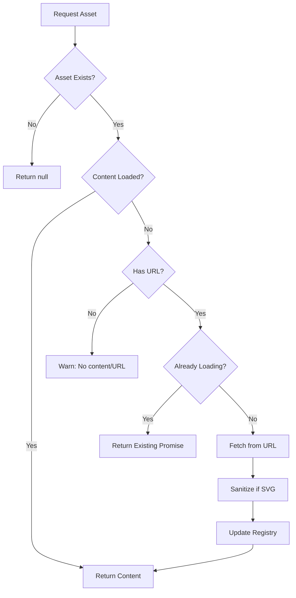

# Asset Manager

**Type:** Singleton  
**Purpose:** External binary/media file management  
**File:** `src/core/assets/AssetManager.js`

## Purpose

AssetManager handles **external binary/media files** that need to be:
- Fetched from URLs or disk
- Lazy-loaded on demand  
- Sanitized and validated
- Cached for performance

**AssetManager is NOT for:**
- ❌ Component metadata (use Component Registry)
- ❌ Style presets (use StylePresetManager)
- ❌ Theme tokens (use ThemeManager)
- ❌ JavaScript objects bundled with code

**Use AssetManager when:**
- ✅ Loading large SVG files (>50KB, like MSD backgrounds)
- ✅ Loading user-provided graphics from /local/
- ✅ Loading external fonts (future)
- ✅ Loading audio files (future)

## Overview

AssetManager is a singleton that manages external asset types with:
- Lazy loading for external assets
- Validation and sanitization
- Pack integration
- Runtime discovery

## Supported Asset Types

| Type | Description | Lazy Load | Sanitize | Max Size | Example |
|------|-------------|-----------|----------|----------|---------|
| `svg` | **External** SVG files | ✅ | ✅ | 2 MB | MSD backgrounds, user graphics |
| `font` | Custom font files | ✅ | ❌ | 500 KB | Custom LCARS fonts |
| `audio` | Sound effects | ✅ | ❌ | 1 MB | Alert sounds |

**Note**: Component definitions (button, slider) are accessed via Component Registry, not AssetManager. They are JavaScript objects bundled with code, not external files.

## Architecture

### AssetRegistry

Each asset type has its own `AssetRegistry` that manages:
- **Storage**: Map of assets by key with content and metadata
- **Loading**: Deduplication of concurrent loads via Promise cache
- **Metadata**: Registration timestamp, size, pack source

### Asset Loading Flow



## Usage

### Access AssetManager

```javascript
const assetManager = window.lcards.core.assetManager;
```

### Get Asset

```javascript
// Synchronous (if cached)
const svg = assetManager.getRegistry('svg').get('ncc-1701-a-blue');

// Async (if needs loading)
const svg = await assetManager.get('svg', 'custom-ship');
```

### Register Asset

```javascript
// Inline content
assetManager.register('svg', 'my-ship', svgContent, {
  pack: 'custom',
  metadata: { ship: 'My Ship' }
});

// External URL (lazy load)
assetManager.register('svg', 'external-ship', null, {
  url: '/local/ship.svg',
  source: 'user'
});
```

### Loading SVGs Dynamically

The `loadSvg(source)` method provides a convenient way to load SVGs with auto-registration:

```javascript
const assetManager = window.lcards.core.assetManager;

// Load builtin SVG (pre-registered by packs)
const builtin = await assetManager.loadSvg('builtin:lcars_master_systems_display_002');

// Load from /local/ (auto-registers)
const local = await assetManager.loadSvg('/local/custom.svg');

// Load from external URL (auto-registers)
const external = await assetManager.loadSvg('https://example.com/graphic.svg');

// Returns null if source is invalid or 'none'
const none = await assetManager.loadSvg('none'); // → null
```

**Auto-registration behavior:**
- Builtin SVGs must be pre-registered by packs
- `/local/` and external URLs are automatically registered on first load
- SVG key is derived from filename (e.g., `/local/custom.svg` → `custom`)
- Subsequent calls use cached content from registry

**Migration from manual loading:**

```javascript
// ❌ OLD: Manual registration + loading
if (!assetManager.getRegistry('svg').has('my-svg')) {
  assetManager.register('svg', 'my-svg', null, {
    url: '/local/my.svg',
    source: 'user'
  });
}
const svg = await assetManager.get('svg', 'my-svg');

// ✅ NEW: Single call with auto-registration
const svg = await assetManager.loadSvg('/local/my.svg');
```

### List Assets

```javascript
// List all SVGs
assetManager.listAssets('svg');
// ['ncc-1701-a-blue', 'ncc-1701-d', 'nx-01']

// List all asset types
assetManager.listTypes();
// ['svg', 'button', 'slider', 'font', 'audio']
```

## Pack Integration

Assets can be distributed via packs with the `svg_assets`, `font_assets`, and `audio_assets` fields:

### Pack Definition Example

```yaml
packs:
  - name: my_ship_pack
    version: 1.0.0
    
    svg_assets:
      # Inline SVG
      my_ship:
        content: |
          <svg viewBox="0 0 800 600">
            <!-- SVG content -->
          </svg>
        metadata:
          ship: "Custom Ship"
      
      # External SVG (lazy loaded)
      external_ship:
        url: "/local/ship.svg"
        metadata:
          ship: "External Ship"
    
    font_assets:
      custom_font:
        url: "/local/fonts/custom.woff2"
        family: "Custom Font"
        weight: 400
    
    audio_assets:
      alert_sound:
        url: "/local/sounds/alert.mp3"
        description: "Alert sound effect"
```

### Pack Registration

PackManager automatically calls `AssetManager.preloadFromPack()` when registering packs:

```javascript
// In PackManager.registerPack()
if ((pack.svg_assets || pack.font_assets || pack.audio_assets) && this.core.assetManager) {
  await this.core.assetManager.preloadFromPack(pack);
}
```

## MSD Card Integration

The MSD card uses AssetManager for SVG loading:

```javascript
// In _getSvgContentForRender()
const assetManager = this._singletons?.assetManager;
const registry = assetManager.getRegistry('svg');

// Sync access if already loaded
const svgContent = registry.get(svgKey);

// Async loading if not cached
assetManager.get('svg', svgKey).then(content => {
  this.requestUpdate();
});
```

### SVG Source Resolution

| Source Pattern | Resolution |
|----------------|------------|
| `builtin:key` | Registered by lcards.js at boot |
| `/local/path.svg` | Registered on-demand, lazy loaded |
| `none` | No SVG (overlay-only mode) |

## Component Registration

Button and slider components are registered at boot:

```javascript
// In lcards.js after core initialization
if (lcardsCore.assetManager) {
  const { registerSliderComponents } = await import('./core/packs/components/sliders/index.js');
  registerSliderComponents(lcardsCore.assetManager);
}
```

This enables unified discovery:

```javascript
// List registered slider components
window.lcards.core.assetManager.listAssets('slider');
// ['basic', 'picard', 'picard-vertical']

// Get component metadata
window.lcards.core.assetManager.getMetadata('slider', 'picard');
```

## Debug API

```javascript
// List all assets by type
window.lcards.core.assetManager.listAssets('svg')
window.lcards.core.assetManager.listAssets('button')
window.lcards.core.assetManager.listAssets('slider')

// Get asset metadata
window.lcards.core.assetManager.getMetadata('svg', 'ncc-1701-a-blue')

// Check if asset exists
window.lcards.core.assetManager.getRegistry('svg').has('my-ship')

// Get all asset types
window.lcards.core.assetManager.listTypes()

// Debug info
window.lcards.core.getDebugInfo().assetManager
```

## Security Features

### SVG Sanitization

All SVG content is automatically sanitized via `sanitizeSvg()`:
- Strips `<script>`, `<iframe>`, `<embed>`, `<object>` tags
- Removes event handlers (onclick, onload, etc.)
- Prevents XSS attacks while preserving visual content

### Size Limits

Asset types enforce maximum sizes:
- **SVG**: 2 MB per file
- **Font**: 500 KB per file
- **Audio**: 1 MB per file

Exceeding limits throws an error during registration.

## Migration from Legacy System

### Old Pattern (window.lcards.assets.svg_templates)

```javascript
// ❌ DEPRECATED
const svg = window.lcards.assets.svg_templates['ncc-1701-a-blue'];
await window.lcards.loadUserSVG('my-ship', '/local/ship.svg');
```

### New Pattern (AssetManager)

```javascript
// ✅ RECOMMENDED
const assetManager = window.lcards.core.assetManager;
const svg = assetManager.getRegistry('svg').get('ncc-1701-a-blue');

// Register and load external
assetManager.register('svg', 'my-ship', null, { url: '/local/ship.svg' });
const content = await assetManager.get('svg', 'my-ship');
```

### Backward Compatibility

Legacy functions remain available for compatibility:
- `window.lcards.getSVGFromCache()` - uses AssetManager internally
- `window.lcards.loadUserSVG()` - still supported
- `window.lcards.assets.svg_templates` - populated by legacy preloadSVGs()

New code should use AssetManager API directly.

## Future Enhancements

- **Button Components**: Migrate button card to use `assetManager.get('button', preset)`
- **Font Loading**: Auto-load fonts from packs via `@font-face` injection
- **Audio Playback**: LCARS computer sounds via AssetManager
- **Asset Versioning**: Cache invalidation and hot reload support
- **CDN Support**: External asset CDN integration
