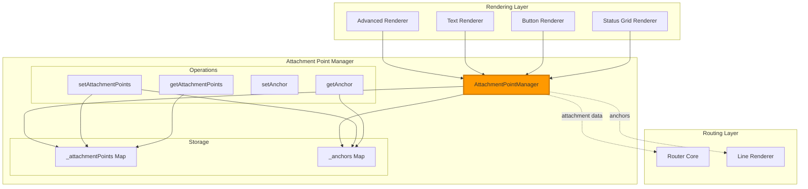
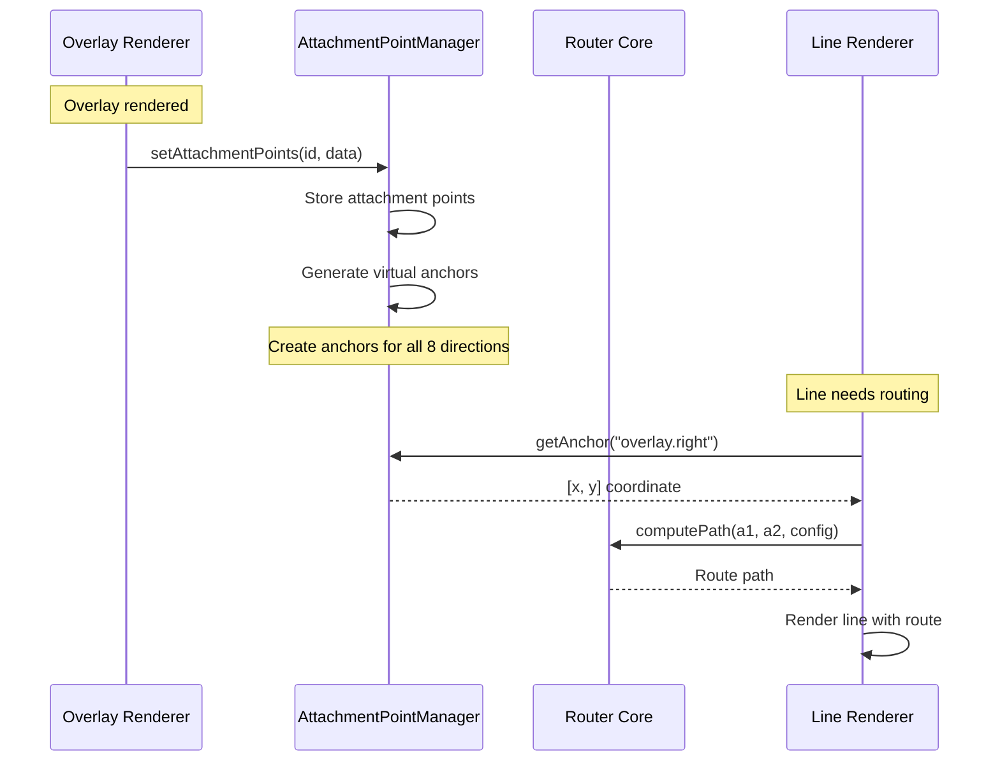

# Attachment Point Manager

> **Attachment point and anchor management system**
> Centralized management of overlay attachment points and dynamic anchors for line routing.

---

## 📋 Table of Contents

1. [Overview](#overview)
2. [Architecture](#architecture)
3. [Core Concepts](#core-concepts)
4. [Attachment Point Structure](#attachment-point-structure)
5. [API Reference](#api-reference)
6. [Usage Patterns](#usage-patterns)
7. [Integration](#integration)
8. [Debugging](#debugging)

---

## Overview

The **Attachment Point Manager** provides centralized management of attachment points and anchors for overlay connections. It serves as the single source of truth for overlay positioning data used by line routing.

### Responsibilities

- ✅ **Attachment point storage** - Store full attachment point data for overlays
- ✅ **8-direction points** - Manage center, cardinal, and corner attachment points
- ✅ **Virtual anchor creation** - Generate anchors from attachment points
- ✅ **Gap adjustment preservation** - Maintain gap-adjusted anchor positions
- ✅ **Consistent API** - Unified interface for reading/writing attachment data
- ✅ **Debug visibility** - Comprehensive logging for troubleshooting

### Key Features

- **Dual storage model** - Separate storage for attachment points and anchors
- **Smart anchor generation** - Automatically creates virtual anchors from attachment points
- **Gap preservation** - Doesn't overwrite explicitly-set gap-adjusted anchors
- **8-direction support** - Full coverage: center, top, bottom, left, right, corners
- **Overlay-centric** - Organized by overlay ID for fast lookups
- **Cache-friendly** - Map-based storage for O(1) access

---

## Architecture

### System Integration



### Data Flow



---

## Core Concepts

### Attachment Points vs Anchors

**Attachment Points:**
- Complete data structure with bbox, center, and 8-direction points
- Stored per overlay ID
- Includes geometric information (width, height, bounds)
- Primary data source

**Anchors:**
- Single [x, y] coordinate for a specific side
- Derived from attachment points
- Can be explicitly set (e.g., gap-adjusted)
- Used directly by line routing

### Terminology

| Term | Definition | Example |
|------|------------|---------|
| **Overlay ID** | Unique identifier for overlay | `"title_overlay"` |
| **Attachment Point** | Full data structure | `{ center, bbox, points }` |
| **Side** | Direction from overlay | `"top"`, `"right"`, `"center"` |
| **Anchor** | Routable coordinate | `[x, y]` |
| **Virtual Anchor** | Anchor ID with side | `"title_overlay.right"` |
| **Gap-Adjusted Anchor** | Explicitly set anchor with gap | `[x+10, y]` |

---

## Attachment Point Structure

### Full Data Structure

```javascript
{
  id: "overlay_id",
  center: [cx, cy],
  bbox: {
    left: x,
    right: x + width,
    top: y,
    bottom: y + height,
    width: width,
    height: height
  },
  points: {
    center: [cx, cy],
    top: [cx, y],
    bottom: [cx, y + height],
    left: [x, cy],
    right: [x + width, cy],
    topLeft: [x, y],
    topRight: [x + width, y],
    bottomLeft: [x, y + height],
    bottomRight: [x + width, y + height]
  }
}
```

### 8-Direction Point Layout

```
     topLeft -------- top -------- topRight
         |                              |
         |                              |
       left          center          right
         |                              |
         |                              |
  bottomLeft ----- bottom ----- bottomRight
```

### Example: Text Overlay at [100, 50], Size [200, 30]

```javascript
{
  id: "temp_display",
  center: [200, 65],  // 100 + 200/2, 50 + 30/2
  bbox: {
    left: 100,
    right: 300,       // 100 + 200
    top: 50,
    bottom: 80,       // 50 + 30
    width: 200,
    height: 30
  },
  points: {
    center: [200, 65],
    top: [200, 50],
    bottom: [200, 80],
    left: [100, 65],
    right: [300, 65],
    topLeft: [100, 50],
    topRight: [300, 50],
    bottomLeft: [100, 80],
    bottomRight: [300, 80]
  }
}
```

**Generated Virtual Anchors:**
- `temp_display` → `[200, 65]` (center)
- `temp_display.top` → `[200, 50]`
- `temp_display.bottom` → `[200, 80]`
- `temp_display.left` → `[100, 65]`
- `temp_display.right` → `[300, 65]`
- `temp_display.topLeft` → `[100, 50]`
- `temp_display.topRight` → `[300, 50]`
- `temp_display.bottomLeft` → `[100, 80]`
- `temp_display.bottomRight` → `[300, 80]`

---

## API Reference

### Constructor

```javascript
new AttachmentPointManager()
```

Creates a new attachment point manager instance.

### Methods

#### `setAttachmentPoints(overlayId, attachmentData)`

Set complete attachment point data for an overlay.

**Parameters:**
- `overlayId` (string) - Overlay identifier
- `attachmentData` (Object) - Full attachment point structure

**Behavior:**
1. Stores attachment data in `_attachmentPoints` Map
2. Generates virtual anchors for all 8 directions
3. Preserves existing gap-adjusted anchors
4. Sets default anchor to center point

**Example:**
```javascript
manager.setAttachmentPoints("title", {
  id: "title",
  center: [200, 50],
  bbox: { left: 100, right: 300, top: 40, bottom: 60, width: 200, height: 20 },
  points: {
    center: [200, 50],
    top: [200, 40],
    bottom: [200, 60],
    left: [100, 50],
    right: [300, 50],
    // ... corners
  }
});
```

#### `getAttachmentPoints(overlayId)`

Get complete attachment point data for an overlay.

**Parameters:**
- `overlayId` (string) - Overlay identifier

**Returns:** Object with attachment data or `null` if not found

**Example:**
```javascript
const data = manager.getAttachmentPoints("title");
console.log(data.center);  // [200, 50]
console.log(data.bbox);    // { left: 100, right: 300, ... }
```

#### `hasAttachmentPoints(overlayId)`

Check if attachment points exist for an overlay.

**Parameters:**
- `overlayId` (string) - Overlay identifier

**Returns:** `boolean` - True if attachment points exist

**Example:**
```javascript
if (manager.hasAttachmentPoints("title")) {
  const data = manager.getAttachmentPoints("title");
}
```

#### `getAttachmentPoint(overlayId, side)`

Get a specific side's attachment point.

**Parameters:**
- `overlayId` (string) - Overlay identifier
- `side` (string) - Side name (default: `"center"`)
  - Valid: `center`, `top`, `bottom`, `left`, `right`, `topLeft`, `topRight`, `bottomLeft`, `bottomRight`

**Returns:** `[x, y]` coordinate array or `null` if not found

**Example:**
```javascript
const rightPoint = manager.getAttachmentPoint("title", "right");
// [300, 50]
```

#### `setAnchor(anchorId, coordinate)`

Set a virtual anchor (for line attachment).

**Parameters:**
- `anchorId` (string) - Anchor identifier (e.g., `"title.right"` or static anchor name)
- `coordinate` (Array) - `[x, y]` coordinate

**Notes:**
- Overwrites existing anchors (logs warning)
- Special logging for `title_overlay.right` with stack trace
- Used for gap-adjusted anchors

**Example:**
```javascript
// Set gap-adjusted anchor (10px gap)
manager.setAnchor("title.right", [310, 50]);

// Set static anchor
manager.setAnchor("header_corner", [50, 50]);
```

#### `getAnchor(anchorId)`

Get an anchor coordinate.

**Parameters:**
- `anchorId` (string) - Anchor identifier

**Returns:** `[x, y]` coordinate array or `null` if not found

**Example:**
```javascript
const anchor = manager.getAnchor("title.right");
// [300, 50] or [310, 50] if gap-adjusted
```

#### `hasAnchor(anchorId)`

Check if an anchor exists.

**Parameters:**
- `anchorId` (string) - Anchor identifier

**Returns:** `boolean` - True if anchor exists

#### `getAllAnchors()`

Get all anchors as an object.

**Returns:** Object mapping anchor IDs to coordinates

**Example:**
```javascript
const allAnchors = manager.getAllAnchors();
// {
//   "title": [200, 50],
//   "title.right": [300, 50],
//   "title.left": [100, 50],
//   ...
// }
```

#### `clear()`

Clear all attachment points and anchors.

**Example:**
```javascript
manager.clear();  // Reset manager state
```

---

## Usage Patterns

### Pattern 1: Renderer Sets Attachment Points

```javascript
class LineOverlay {
  render(overlay, anchors, viewBox, svgContainer) {
    // Calculate overlay bounds based on line points
    const points = overlay.points || [];
    const x = Math.min(...points.map(p => p[0]));
    const y = Math.min(...points.map(p => p[1]));
    const width = Math.max(...points.map(p => p[0])) - x;
    const height = Math.max(...points.map(p => p[1])) - y;

    // Create attachment point data
    const attachmentData = {
      id: overlay.id,
      center: [x + width/2, y + height/2],
      bbox: {
        left: x,
        right: x + width,
        top: y,
        bottom: y + height,
        width,
        height
      },
      points: {
        center: [x + width/2, y + height/2],
        top: [x + width/2, y],
        bottom: [x + width/2, y + height],
        left: [x, y + height/2],
        right: [x + width, y + height/2],
        topLeft: [x, y],
        topRight: [x + width, y],
        bottomLeft: [x, y + height],
        bottomRight: [x + width, y + height]
      }
    };

    // Store in manager
    this.attachmentPointManager.setAttachmentPoints(overlay.id, attachmentData);

    // Render SVG...
    return svgMarkup;
  }
}
```

### Pattern 2: Gap-Adjusted Anchors

```javascript
// After setting base attachment points
const baseRight = manager.getAttachmentPoint("title", "right");
// [300, 50]

// Apply gap adjustment
const gap = 10;
const adjustedRight = [baseRight[0] + gap, baseRight[1]];

// Set gap-adjusted anchor (this preserves the gap)
manager.setAnchor("title.right", adjustedRight);
// [310, 50]

// Now when lines attach to "title.right", they use the gap-adjusted position
```

### Pattern 3: Line Routing with Anchors

```javascript
// Line wants to connect from static anchor to overlay
const line = {
  attach_start: "header_corner",
  attach_to: "title",
  attach_side: "left"
};

// Router resolves anchors
const startAnchor = manager.getAnchor("header_corner");
const endAnchor = manager.getAnchor(`title.left`);

// Compute route
const route = routerCore.computePath(startAnchor, endAnchor, lineConfig);
```

### Pattern 4: Dynamic Anchor Updates

```javascript
// Overlay position changes (e.g., responsive layout)
function updateOverlayPosition(overlayId, newX, newY) {
  const current = manager.getAttachmentPoints(overlayId);

  if (current) {
    // Calculate new attachment points
    const deltaX = newX - current.bbox.left;
    const deltaY = newY - current.bbox.top;

    const updated = {
      ...current,
      center: [current.center[0] + deltaX, current.center[1] + deltaY],
      bbox: {
        ...current.bbox,
        left: newX,
        right: newX + current.bbox.width,
        top: newY,
        bottom: newY + current.bbox.height
      },
      points: Object.fromEntries(
        Object.entries(current.points).map(([side, [x, y]]) => [
          side,
          [x + deltaX, y + deltaY]
        ])
      )
    };

    manager.setAttachmentPoints(overlayId, updated);
  }
}
```

---

## Integration

### With Advanced Renderer

```javascript
class AdvancedRenderer {
  constructor(mountEl, routerCore, systemsManager) {
    this.attachmentPointManager = new AttachmentPointManager();
    // Pass to specialized renderers
  }

  renderOverlay(overlay, anchors, viewBox, svgContainer) {
    // Each renderer sets attachment points
    if (overlay.type === 'line') {
      const markup = LineOverlay.render(overlay, anchors, viewBox, svgContainer);
      return markup;
    }
    
    // Card-based overlays handled by MsdControlsRenderer
    if (overlay.type === 'control') {
      return null; // Delegated to MsdControlsRenderer
    }

    // Attachment points now available for line routing
    return markup;
  }
}
```

### With Router Core

```javascript
class RouterCore {
  constructor(config, anchors, viewBox) {
    this.anchors = anchors;  // Flat anchor object
  }

  resolveAnchor(anchorId, attachmentManager) {
    // Try direct anchor lookup
    if (this.anchors[anchorId]) {
      return this.anchors[anchorId];
    }

    // Try attachment manager
    return attachmentManager.getAnchor(anchorId);
  }
}
```

### Debug Access

```javascript
// Global debug access
window.lcards.debug.msd = {
  pipelineInstance: {
    systemsManager: {
      advancedRenderer: {
        attachmentPointManager: manager
      }
    }
  }
};

// Console usage
const apm = window.lcards.debug.msd.pipelineInstance.systemsManager.advancedRenderer.attachmentPointManager;
console.log(apm.getAttachmentPoints("title"));
console.log(apm.getAllAnchors());
```

---

## Debugging

### Browser Console Access

```javascript
// Get manager instance
const apm = window.lcards.debug.msd.pipelineInstance.systemsManager.advancedRenderer.attachmentPointManager;

// Check if overlay has attachment points
console.log(apm.hasAttachmentPoints("title"));  // true

// Get attachment data
const data = apm.getAttachmentPoints("title");
console.log('Center:', data.center);
console.log('BBox:', data.bbox);
console.log('Points:', data.points);

// Check specific side
const rightPoint = apm.getAttachmentPoint("title", "right");
console.log('Right attachment:', rightPoint);

// Get anchor (may be gap-adjusted)
const rightAnchor = apm.getAnchor("title.right");
console.log('Right anchor:', rightAnchor);

// List all anchors
const allAnchors = apm.getAllAnchors();
console.log('All anchors:', allAnchors);
```

### Common Issues

**Issue: Line not attaching to correct point**
```javascript
// Debug: Check if attachment points exist
const data = apm.getAttachmentPoints(overlayId);
if (!data) {
  console.error('No attachment points for', overlayId);
}

// Debug: Check anchor resolution
const anchorId = `${overlayId}.right`;
const anchor = apm.getAnchor(anchorId);
console.log('Resolved anchor:', anchor);
```

**Issue: Gap adjustment not working**
```javascript
// Debug: Check if gap-adjusted anchor exists
const basePoint = apm.getAttachmentPoint("title", "right");
const anchor = apm.getAnchor("title.right");

if (basePoint && anchor) {
  const gap = anchor[0] - basePoint[0];
  console.log('Gap:', gap);  // Should show gap amount
}
```

**Issue: Anchor overwrite warnings**
```javascript
// Check logs for overwrite warnings
// [AttachmentPointManager] ⚠️ Overwriting anchor title.right: [300,50] → [310,50]

// This indicates an anchor is being set twice
// Check if gap adjustment is happening after base attachment points are set
```

---

## 📚 Related Documentation

- **[Advanced Renderer](advanced-renderer.md)** - Uses attachment points for overlay positioning
- **[Router Core](router-core.md)** - Uses anchors for line routing
- **[Systems Manager](systems-manager.md)** - Initializes attachment point manager

---

**Last Updated:** October 26, 2025
**Version:** 2025.10.1-fuk.42-69
**Source:** `/src/msd/renderer/AttachmentPointManager.js` (260 lines)
