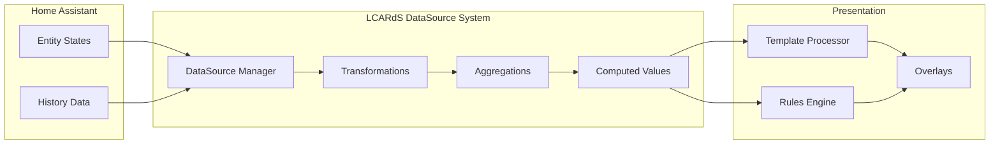
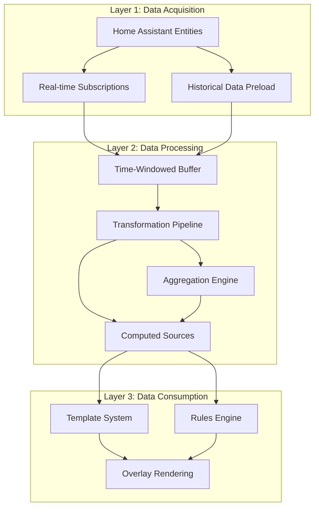
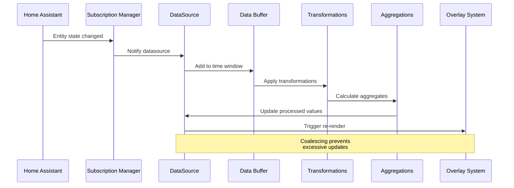
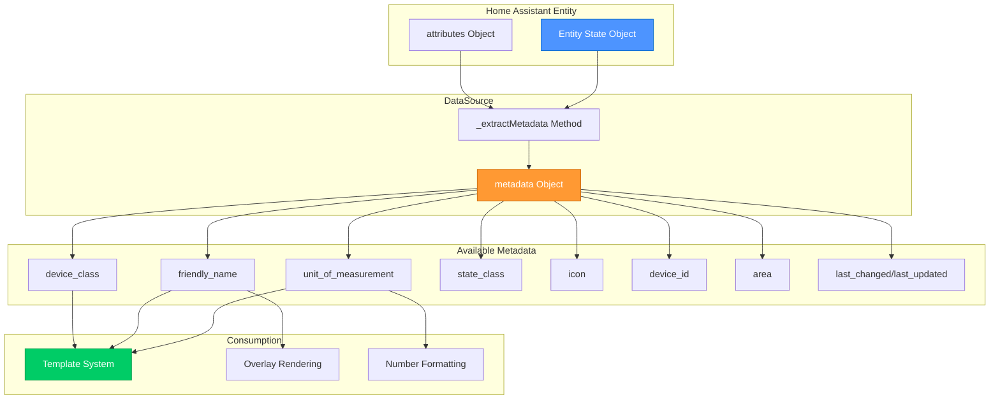
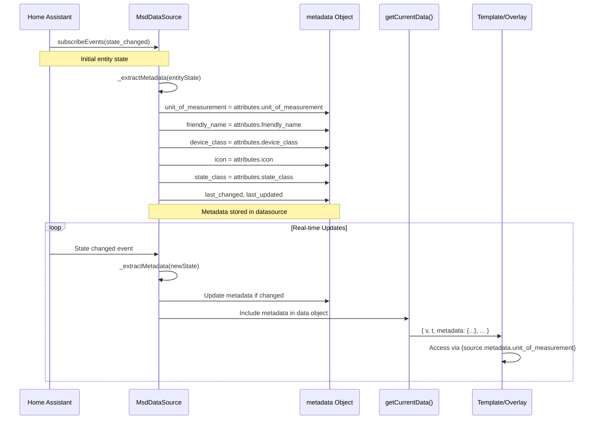
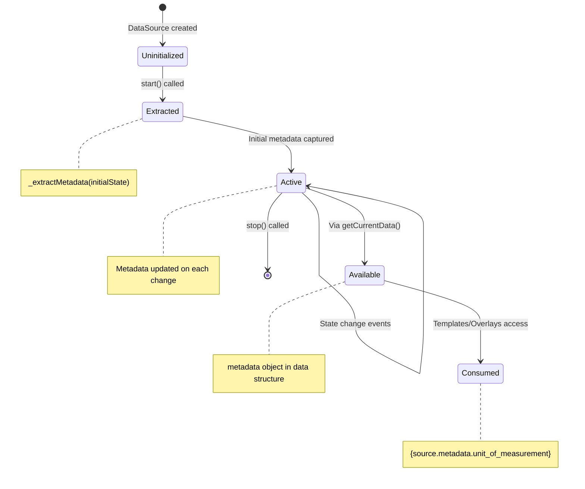
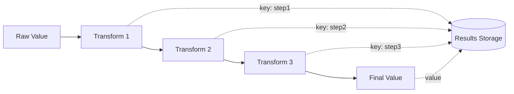
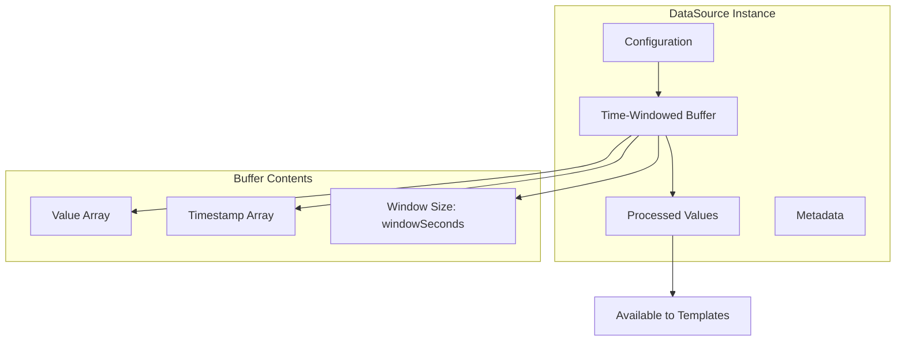

# Data Architecture & DataSource System

> **LCARdS is data-driven at its core**
> Understanding how data flows from Home Assistant through the datasource system to overlays is fundamental to using LCARdS effectively.

---

## 🎯 Core Concept

**Everything in LCARdS is driven by data.** The datasource system sits at the heart of the architecture, transforming Home Assistant entity states into processed, aggregated, and computed values that power dynamic overlays.



---

## 🏗️ Architecture Overview

### Three-Layer Data Flow



### Layer Responsibilities

**Layer 1: Data Acquisition**
- Subscribe to Home Assistant entity state changes
- Preload historical data for time-series analysis
- Handle entity availability and state validation
- Manage subscription lifecycle

**Layer 2: Data Processing**
- Maintain time-windowed data buffers (default 60s, configurable)
- Apply transformation pipelines (unit conversion, scaling, smoothing)
- Calculate aggregations (averages, min/max, rates, trends)
- Generate computed values from multiple sources

**Layer 3: Data Consumption**
- Process templates with datasource values
- Evaluate rules engine conditions
- Provide values for overlay rendering
- Support dot-notation access (`datasource.value`, `datasource.aggregates.avg`)

---

## 📊 DataSource Types

### 1. Entity Sources

Direct subscriptions to Home Assistant entities with optional processing.

```yaml
data_sources:
  temperature:
    type: entity
    entity: sensor.outdoor_temperature
    transformations:
      - type: unit_conversion
        from: "°F"
        to: "°C"
    aggregations:
      - type: moving_average
        window: 300  # 5 minutes
```

**Features:**
- Real-time state updates
- Historical data preloading
- Attribute access
- ⭐ **Nested attribute paths** (`attribute_path: "forecast[0].temperature"`)
- Transformation pipelines
- Aggregation windows

### 2. Computed Sources

Derived values from other datasources using expressions.

```yaml
data_sources:
  heat_index:
    type: computed
    expression: "0.5 * (temp + 61.0 + ((temp-68.0)*1.2) + (humidity*0.094))"
    dependencies:
      temp: temperature
      humidity: humidity_sensor
```

**Features:**
- Multi-source calculations
- JavaScript expressions
- Automatic dependency tracking
- Reactive updates

### 3. Aggregated Sources

Statistical analysis over time windows.

```yaml
data_sources:
  power_stats:
    type: entity
    entity: sensor.power_consumption
    aggregations:
      - type: moving_average
        window: 3600
        key: "hourly_avg"
      - type: rate_of_change
        window: 300
        key: "trend"
```

**Aggregation Types:**
- Moving averages (simple, exponential)
- Min/Max tracking
- Rate of change
- Trend detection
- Duration tracking
- ⭐ **Rolling statistics** (multi-value: min, max, mean, median, quartiles, OHLC)

---

## 🔄 Data Flow Lifecycle



### Detailed Flow Steps

1. **State Change Detection**
   - Home Assistant entity state changes
   - Subscription manager notifies datasource
   - Raw value captured with timestamp

2. **Buffering**
   - Value added to time-windowed buffer
   - Old values outside window removed
   - Buffer size maintained (default 60s)

3. **Transformation**
   - Pipeline processors applied in order
   - Unit conversions, scaling, smoothing
   - Results keyed for template access

4. **Aggregation**
   - Statistical calculations over buffer
   - Moving averages, rates, trends
   - Results keyed for template access

5. **Emission**
   - Coalescing window prevents rapid updates
   - Minimum emit interval enforced
   - Maximum delay ensures freshness

6. **Consumption**
   - Templates resolved with datasource values
   - Rules evaluated with dot-notation access
   - Overlays rendered with processed data

---

## �️ Entity Metadata System

**DataSources automatically capture and propagate entity metadata from Home Assistant.** This metadata system provides access to entity attributes like units, friendly names, device information, and more without manual configuration.

### Metadata Architecture



### Metadata Extraction Flow



### Metadata Object Structure

```typescript
interface DataSourceMetadata {
  // Core attributes from HA entity
  unit_of_measurement: string | null;  // "°C", "kWh", "%", etc.
  device_class: string | null;         // "temperature", "power", etc.
  friendly_name: string | null;        // "Living Room Temperature"
  state_class: string | null;          // "measurement", "total", etc.
  icon: string | null;                 // "mdi:thermometer"

  // Entity identification
  entity_id: string;                   // "sensor.temperature"
  device_id: string | null;            // Device registry ID
  area: string | null;                 // Area/room assignment

  // Timestamps
  last_changed: string;                // ISO 8601 timestamp
  last_updated: string;                // ISO 8601 timestamp
}
```

### Implementation Details

**Extraction Method (`_extractMetadata`):**
```javascript
_extractMetadata(entityState) {
  if (!entityState) return;

  const attributes = entityState.attributes || {};

  // Core metadata
  this.metadata.unit_of_measurement = attributes.unit_of_measurement || null;
  this.metadata.device_class = attributes.device_class || null;
  this.metadata.friendly_name = attributes.friendly_name || entityState.entity_id;
  this.metadata.state_class = attributes.state_class || null;
  this.metadata.icon = attributes.icon || null;

  // Timestamps
  this.metadata.last_changed = entityState.last_changed;
  this.metadata.last_updated = entityState.last_updated;

  // Device and area information (if available)
  if (attributes.device_id) {
    this.metadata.device_id = attributes.device_id;
  }

  // Try to get area from device registry
  if (this.hass?.entities?.[this.cfg.entity]) {
    const entityInfo = this.hass.entities[this.cfg.entity];
    this.metadata.area = entityInfo.area_id || null;
  }
}
```

**Data Propagation:**
Metadata is included in every data emission:

```javascript
getCurrentData() {
  return {
    t: lastPoint.t,
    v: lastPoint.v,
    buffer: this.buffer,
    stats: { ...this._stats },
    transformations: this._getTransformationData(),
    aggregations: this._getAggregationData(),
    entity: this.cfg.entity,
    metadata: { ...this.metadata },  // ✅ Metadata included
    historyReady: this._stats.historyLoaded > 0,
    bufferSize: this.buffer.size(),
    started: this._started
  };
}
```

### Automatic Unit Formatting Integration

The `unit_of_measurement` is automatically used in number formatting:

```javascript
// DataSourceMixin.js
applyNumberFormat(value, formatSpec, dataSourceData?.unit_of_measurement) {
  // Format number according to spec
  const formattedValue = applyFormat(value, formatSpec);

  // Automatically append unit if available
  if (dataSourceData?.unit_of_measurement) {
    return `${formattedValue}${dataSourceData.unit_of_measurement}`;
  }

  return formattedValue;
}
```

**Usage in Text Overlays:**
```javascript
// TextOverlay.js
const unitOfMeasurement = dataSource?.getCurrentData()?.unit_of_measurement;
return DataSourceMixin.applyNumberFormat(numericValue, formatSpec, unitOfMeasurement);
```

### Helper Methods

**Get Display Name:**
```javascript
getDisplayName() {
  return this.metadata.friendly_name || this.cfg.entity;
}
```

Usage:
```javascript
const source = dataSourceManager.getSource('temperature');
console.log(source.getDisplayName());
// Output: "Living Room Temperature" or "sensor.temperature"
```

### Metadata Lifecycle



### Usage Patterns

**Pattern 1: Display Name + Value + Unit**
```javascript
// Template
`{source.metadata.friendly_name}: {source.v:.1f}{source.metadata.unit_of_measurement}`

// Output
"Living Room Temperature: 23.5°C"
```

**Pattern 2: Automatic Unit in Computed Sources**
```javascript
// Computed source doesn't have entity, so no metadata
// Solution: Reference dependency metadata
`Net Power: {net_power.v:.1f}{solar.metadata.unit_of_measurement}`
```

**Pattern 3: Device Class for Icons**
```javascript
// Can use device_class to determine icon
if (metadata.device_class === 'temperature') {
  icon = 'mdi:thermometer';
} else if (metadata.device_class === 'power') {
  icon = 'mdi:flash';
}
```

### Integration Points

**Template System:**
- Metadata available via `{datasource.metadata.property}`
- Used in content, labels, tooltips

**Number Formatting:**
- `unit_of_measurement` automatically appended
- Percentage handling (%)
- Custom unit display

**Overlay Rendering:**
- `friendly_name` for automatic labels
- `icon` for visual indicators
- `device_class` for semantic styling

**Debug Interface:**
- Metadata visible in debug panels
- Inspector shows all metadata properties
- Console access via `source.metadata`

### Configuration Override System

**New Feature:** Users can specify or override metadata in datasource configuration.

**Use Cases:**
1. **Computed Sources** - Specify metadata for sources without entities
2. **Custom Names** - Override auto-captured friendly names
3. **Unit Representation** - Change how units are displayed
4. **Mixed Sources** - Provide consistent metadata for combined data

**Implementation:**

```javascript
// Constructor applies overrides after initialization
if (cfg.metadata) {
  this._applyMetadataOverrides(cfg.metadata);
}

// _applyMetadataOverrides method
_applyMetadataOverrides(metadataConfig) {
  // Track which properties have been explicitly set by user
  this._metadataOverrides = {};

  const supportedProperties = [
    'unit_of_measurement',
    'device_class',
    'friendly_name',
    'state_class',
    'icon',
    'area',
    'device_id'
  ];

  supportedProperties.forEach(prop => {
    if (metadataConfig.hasOwnProperty(prop)) {
      this.metadata[prop] = metadataConfig[prop];
      this._metadataOverrides[prop] = true; // Mark as user-overridden
    }
  });
}

// _extractMetadata respects overrides
_extractMetadata(entityState) {
  // Only extract if not overridden by config
  if (!this._metadataOverrides?.unit_of_measurement) {
    this.metadata.unit_of_measurement = attributes.unit_of_measurement || null;
  }
  // ... similar for other properties
}
```

**Configuration Examples:**

```yaml
# Computed source with metadata
data_sources:
  net_power:
    type: computed
    expression: "solar - consumption"
    dependencies:
      solar: solar
      consumption: consumption
    metadata:
      unit_of_measurement: "W"
      friendly_name: "Net Power Flow"
      device_class: "power"

# Entity with override
data_sources:
  temperature:
    type: entity
    entity: sensor.outdoor_temperature
    metadata:
      friendly_name: "Outside Temp"  # Override entity name
      icon: "mdi:weather-sunny"      # Custom icon
    # unit_of_measurement preserved from entity
```

**Priority Order:**
1. **Config override** (highest) - `cfg.metadata.property`
2. **Entity attributes** (middle) - `entityState.attributes.property`
3. **Fallback** (lowest) - `null` or `entity_id`

### Computed Sources Special Handling

**Issue:** Computed sources don't have entities, so no automatic metadata extraction.

**Solution Patterns:**

```yaml
# Option 1: Manual metadata specification (RECOMMENDED)
data_sources:
  computed:
    type: computed
    expression: "a + b"
    metadata:
      unit_of_measurement: "kWh"
      friendly_name: "Total Power"
      device_class: "power"

# Option 2: Reference dependency metadata
overlays:
  - content: "{computed.v:.1f}{dependency.metadata.unit_of_measurement}"
```

### Performance Considerations

**Metadata Overhead:**
- Extracted once per entity state change
- Config overrides applied once at construction
- Shallow copy on data emission
- Minimal memory footprint (~200 bytes per datasource + ~100 bytes for overrides)
- No impact on update frequency

**Optimization:**
- Metadata only extracted if entity state available
- Override checking via simple boolean flags
- Fallback to entity_id if attributes missing
- Cached in datasource instance

---

## �🎨 Template Integration

### Accessing DataSource Values

Datasources expose values through dot notation in templates:

```yaml
overlays:
  - id: temp_display
    type: text
    content: "{temperature.value}°C"  # Current value

  - id: avg_display
    type: text
    content: "{temperature.aggregates.avg}°C"  # Average

  - id: trend_display
    type: text
    content: "Trend: {temperature.aggregates.trend}"  # Trend
```

### DataSource Properties

**Base Properties:**
- `.v` or `.value` - Current processed value
- `.t` or `.timestamp` - Last update timestamp
- `.entity` - Entity ID
- `.buffer` - Rolling buffer instance
- `.started` - Boolean indicating if datasource is active

**Metadata Properties:**
- `.metadata.unit_of_measurement` - Entity's unit (e.g., "°C", "kWh")
- `.metadata.friendly_name` - Human-readable name
- `.metadata.device_class` - Device type (e.g., "temperature", "power")
- `.metadata.state_class` - State behavior (e.g., "measurement", "total")
- `.metadata.icon` - Entity icon (e.g., "mdi:thermometer")
- `.metadata.entity_id` - Full entity identifier
- `.metadata.device_id` - Device registry ID
- `.metadata.area` - Area/room assignment
- `.metadata.last_changed` - Last state change timestamp
- `.metadata.last_updated` - Last update timestamp

**Transformation Results:**
- `.transformations.<key>` - Named transformation output
- Example: `.transformations.celsius`

**Aggregation Results:**
- `.aggregations.<key>` - Named aggregation output
- Example: `.aggregations.hourly_avg`

**Example Access:**
```javascript
// In templates
{temperature.v}                                    // Current value
{temperature.metadata.unit_of_measurement}         // Unit
{temperature.metadata.friendly_name}               // Display name
{temperature.transformations.celsius}              // Transformed value
{temperature.aggregations.avg}                     // Aggregated value

// In console
const source = window.lcards.debug.msd.systems.dataSourceManager.getSource('temperature');
console.log(source.getCurrentData());
// {
//   t: 1698355200000,
//   v: 23.5,
//   metadata: {
//     unit_of_measurement: "°C",
//     friendly_name: "Living Room Temperature",
//     device_class: "temperature",
//     ...
//   },
//   transformations: { ... },
//   aggregations: { ... }
// }
```

---

## 🔧 Rules Engine Integration

Datasources can be used in rules engine conditions:

```yaml
data_sources:
  temperature:
    type: entity
    entity: sensor.temp
    aggregations:
      - type: moving_average
        window: 600
        key: "avg"

overlays:
  - id: warning_text
    type: text
    content: "High Temp!"
    rules:
      - conditions:
          - datasource: temperature.aggregates.avg
            operator: ">"
            value: 25
        properties:
          style:
            fill: var(--lcars-red)
```

---

## 🎯 Transformation Pipeline

Transformations are applied sequentially, with each transformation's output available to the next:



### Available Transformations

**Unit Conversions:**
- Temperature (°F ↔ °C ↔ K)
- Distance (mi ↔ km ↔ m ↔ ft)
- Speed (mph ↔ km/h ↔ m/s)
- Volume (gal ↔ L ↔ mL)
- Pressure (psi ↔ bar ↔ kPa)
- 50+ predefined conversions

**Scaling:**
- Linear scaling
- Non-linear (exponential, logarithmic, power)
- Clamping
- Normalization

**Smoothing:**
- Simple moving average
- Exponential moving average (EMA)
- Weighted moving average

**Statistical:**
- Standard deviation
- Percentile calculations
- Z-score normalization

**Device-Specific:**
- Brightness (0-255 ↔ 0-100%)
- Volume levels
- Signal strength (dBm ↔ %)
- Battery levels

---

## 📈 Aggregation Engine

Aggregations calculate statistics over time-windowed data:

```yaml
data_sources:
  sensor_stats:
    type: entity
    entity: sensor.data
    windowSeconds: 3600  # 1 hour buffer
    aggregations:
      - type: moving_average
        window: 600        # 10 min average
        key: "avg_10min"

      - type: min_max
        window: 1800       # 30 min min/max
        key: "range_30min"

      - type: rate_of_change
        window: 300        # 5 min rate
        key: "trend_5min"
```

### Aggregation Types

| Type | Output | Use Case |
|------|--------|----------|
| `moving_average` | Single value | Smooth fluctuations |
| `exponential_average` | Single value | Recent values weighted more |
| `min_max` | `{min, max}` | Range tracking |
| `rate_of_change` | Rate value | Trend detection |
| `trend_detection` | Direction/strength | Directional changes |
| `duration_tracker` | Duration value | Time in state |

---

## 🔍 Computed Sources

Combine multiple datasources with JavaScript expressions:

```yaml
data_sources:
  # Source datasources
  temp_f:
    type: entity
    entity: sensor.temperature

  humidity:
    type: entity
    entity: sensor.humidity

  # Computed heat index
  heat_index:
    type: computed
    expression: >
      0.5 * (temp + 61.0 + ((temp - 68.0) * 1.2) + (humid * 0.094))
    dependencies:
      temp: temp_f
      humid: humidity
```

**Features:**
- Automatic dependency tracking
- Reactive updates (recomputes when dependencies change)
- Full JavaScript expression support
- Access to Math library functions

---

## ⚡ Performance Optimization

### Coalescing & Throttling

Prevent excessive updates with smart timing:

```yaml
data_sources:
  fast_sensor:
    type: entity
    entity: sensor.high_frequency
    minEmitMs: 100      # Min 100ms between emissions
    coalesceMs: 50      # Batch updates within 50ms
    maxDelayMs: 500     # Force emit after 500ms
```

**Coalescing:** Batches rapid updates into single emission
**Throttling:** Enforces minimum time between emissions
**Max Delay:** Ensures data freshness

### Window Management

Configure buffer sizes for memory efficiency:

```yaml
data_sources:
  memory_efficient:
    type: entity
    entity: sensor.data
    windowSeconds: 60        # Small window for recent data only
    aggregations:
      - type: moving_average
        window: 30           # Aggregate over 30s only
```

**Best Practices:**
- Use smallest window that meets requirements
- Historical preload only when needed
- Consider update frequency vs. window size

---

## 🗂️ Memory Model



**Memory Characteristics:**
- Runtime-only storage (no persistence)
- Fixed-size circular buffers
- Automatic cleanup of old values
- Efficient timestamp-based lookups

---

## 🔗 System Integration

### With Overlay System

```yaml
data_sources:
  cpu_temp:
    type: entity
    entity: sensor.cpu_temperature

overlays:
  - id: cpu_display
    type: text
    content: "CPU: {cpu_temp.value}°C"
    rules:
      - conditions:
          - datasource: cpu_temp.value
            operator: ">"
            value: 70
        properties:
          style:
            fill: var(--lcars-red)
```

### With Animation System

Datasource values can drive animations:

```yaml
animations:
  - selector: "[data-overlay-id='indicator']"
    trigger:
      type: datasource_change
      datasource: cpu_temp
      threshold: 5  # Trigger on 5° change
    keyframes:
      - fill: var(--lcars-orange)
```

---

## 📚 Key Files

**Core Implementation:**
- `src/msd/datasource/DataSourceManager.js` - Main manager
- `src/msd/datasource/DataSourceMixin.js` - Entity subscriptions
- `src/msd/datasource/processors/` - Transformation processors
- `src/msd/datasource/aggregations/` - Aggregation engines

**Integration Points:**
- `src/msd/utils/TemplateProcessor.js` - Template resolution
- `src/msd/rules/RulesEngine.js` - Rules evaluation
- `src/msd/SystemsManager.js` - Orchestration

---

## 🔗 Related Documentation

### Architecture
- [Architecture Overview](../overview.md)
- [Systems Manager](../components/systems-manager.md)
- [Template Processor](../subsystems/template-processor.md)
- [Rules Engine](../subsystems/rules-engine.md)

### User Documentation
- [DataSource Configuration Guide](../../user-guide/configuration/datasources.md)
- [DataSource Transformations Reference](../../user-guide/configuration/datasource-transformations.md)
- [DataSource Aggregations Reference](../../user-guide/configuration/datasource-aggregations.md)
- [Computed Sources Guide](../../user-guide/configuration/computed-sources.md)
- [DataSource Examples](../../user-guide/examples/datasource-examples.md)

---

**Last Updated:** October 31, 2025
**Version:** 2025.10.1-fuk.42-69
