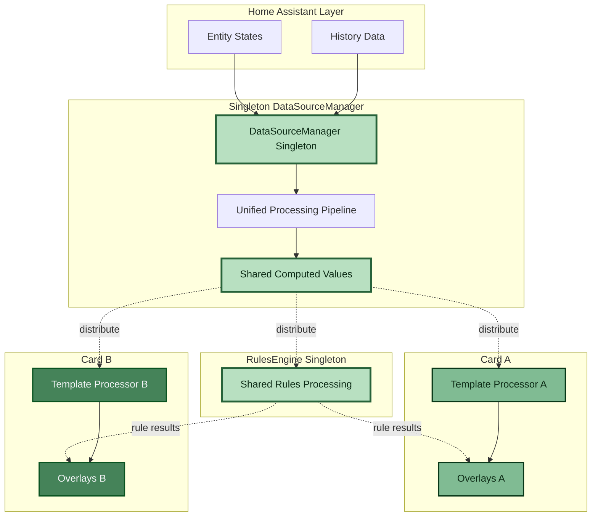
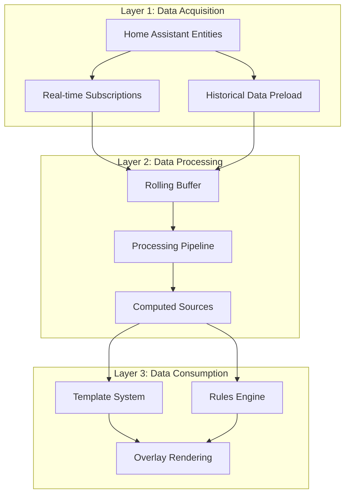
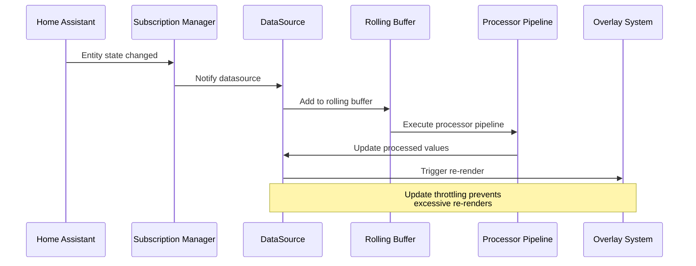
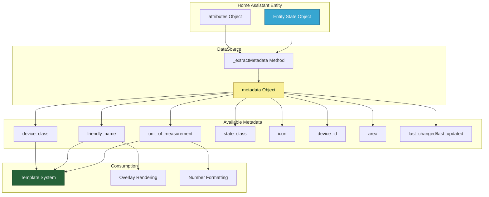
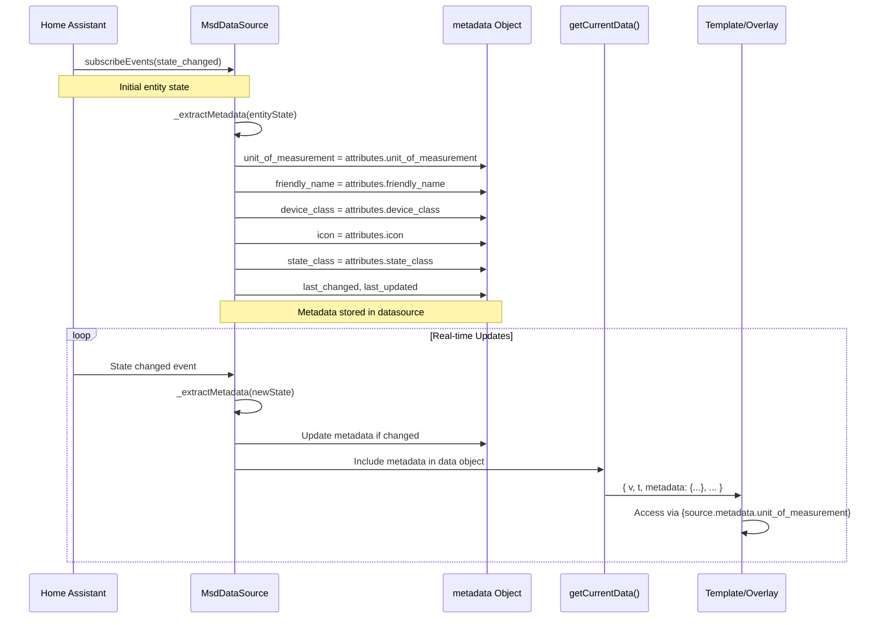
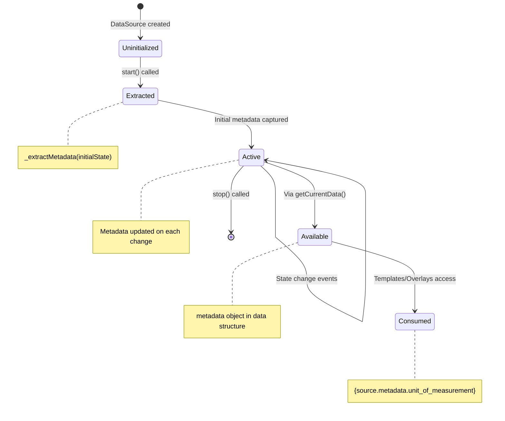
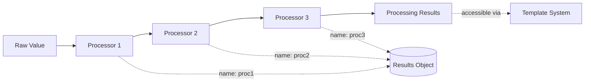
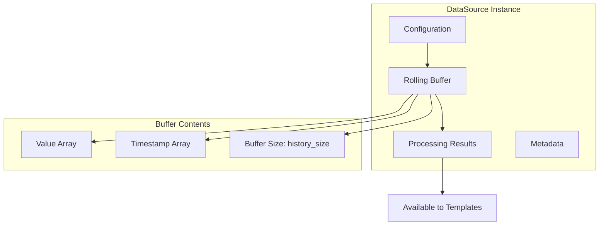

# DataSource System (Singleton)

> **Shared data intelligence across all LCARdS cards**
> Singleton DataSourceManager processes Home Assistant entities once and distributes to all card instances for maximum efficiency.

---

## 🎯 Core Concept

**Everything in LCARdS is driven by shared data intelligence.** The DataSourceManager singleton sits at the heart of the architecture, processing Home Assistant entity states once and distributing processed, aggregated, and computed values to all card instances (both MSD cards and LCARdS Cards) efficiently.



---

## 🏗️ Architecture Overview

### Three-Layer Data Flow



### Layer Responsibilities

**Layer 1: Data Acquisition**
- Subscribe to Home Assistant entity state changes
- Preload historical data for time-series analysis
- Handle entity availability and state validation
- Manage subscription lifecycle

**Layer 2: Data Processing**
- Maintain rolling data buffers with configurable size
- Execute processor pipeline (conversions, scaling, smoothing, statistics, etc.)
- Chain processors with dependency resolution
- Generate computed values from multiple sources

**Layer 3: Data Consumption**
- Process templates with datasource values
- Evaluate rules engine conditions
- Provide values for overlay rendering
- Support dot-notation access (`datasource.value`, `datasource.processing.processor_name`)

---

## 📊 DataSource Types

### 1. Entity Sources

Direct subscriptions to Home Assistant entities with optional processing.

```yaml
data_sources:
  temperature:
    entity_id: sensor.outdoor_temperature
    update_interval: 5  # seconds
    processing:
      celsius:
        type: convert_unit
        from: fahrenheit
        to: celsius
      smoothed:
        type: smooth
        from: celsius
        window: 10  # data points
```

**Features:**
- Real-time state updates
- Historical data preloading
- Attribute access
- ⭐ **Nested attribute paths** (`attribute_path: "forecast[0].temperature"`)
- Unified processing pipeline with 12 processor types
- Processor chaining with dependency resolution

### 2. Computed Sources

Derived values from other datasources using expressions.

```yaml
data_sources:
  heat_index:
    type: computed
    expression: "0.5 * (temp + 61.0 + ((temp-68.0)*1.2) + (humidity*0.094))"
    dependencies:
      temp: temperature
      humidity: humidity_sensor
```

**Features:**
- Multi-source calculations
- JavaScript expressions
- Automatic dependency tracking
- Reactive updates

### 3. Processed Sources

Statistical analysis and transformations over data.

```yaml
data_sources:
  power_stats:
    entity_id: sensor.power_consumption
    history_size: 3600  # 1 hour of data
    processing:
      hourly_avg:
        type: statistics
        window: 3600  # seconds
        output: mean
      trend_5min:
        type: rate
        from: hourly_avg
        window: 300  # seconds
```

**Processor Types:**
- Unit conversions (convert_unit)
- Scaling and normalization (scale)
- Smoothing (smooth)
- Statistical analysis (statistics)
- Rate of change (rate)
- Trend detection (trend)
- Duration tracking (duration)
- Threshold detection (threshold)
- Value clamping (clamp)
- Rounding (round)
- Delta calculation (delta)
- JavaScript expressions (expression)

---

## 🔄 Data Flow Lifecycle



### Detailed Flow Steps

1. **State Change Detection**
   - Home Assistant entity state changes
   - Subscription manager notifies datasource
   - Raw value captured with timestamp

2. **Buffering**
   - Value added to rolling buffer
   - Old values removed when buffer size exceeded
   - Buffer size configurable via `history_size`

3. **Processing**
   - Processor pipeline executed in dependency order
   - Unit conversions, scaling, smoothing, statistics, etc.
   - Each processor can reference previous processors via `from` field

4. **Dependency Resolution**
   - Topological sort determines execution order
   - Circular dependencies detected and reported
   - Processors execute only when dependencies ready

5. **Emission**
   - Update throttling via `update_interval` (seconds)
   - Subscribers notified of data changes
   - Processed values available immediately

6. **Consumption**
   - Templates resolved with datasource values
   - Rules evaluated with dot-notation access
   - Overlays rendered with processed data via `processing.processor_name`

---

## �️ Entity Metadata System

**DataSources automatically capture and propagate entity metadata from Home Assistant.** This metadata system provides access to entity attributes like units, friendly names, device information, and more without manual configuration.

### Metadata Architecture



### Metadata Extraction Flow



### Metadata Object Structure

```typescript
interface DataSourceMetadata {
  // Core attributes from HA entity
  unit_of_measurement: string | null;  // "°C", "kWh", "%", etc.
  device_class: string | null;         // "temperature", "power", etc.
  friendly_name: string | null;        // "Living Room Temperature"
  state_class: string | null;          // "measurement", "total", etc.
  icon: string | null;                 // "mdi:thermometer"

  // Entity identification
  entity_id: string;                   // "sensor.temperature"
  device_id: string | null;            // Device registry ID
  area: string | null;                 // Area/room assignment

  // Timestamps
  last_changed: string;                // ISO 8601 timestamp
  last_updated: string;                // ISO 8601 timestamp
}
```

### Implementation Details

**Extraction Method (`_extractMetadata`):**
```javascript
_extractMetadata(entityState) {
  if (!entityState) return;

  const attributes = entityState.attributes || {};

  // Core metadata
  this.metadata.unit_of_measurement = attributes.unit_of_measurement || null;
  this.metadata.device_class = attributes.device_class || null;
  this.metadata.friendly_name = attributes.friendly_name || entityState.entity_id;
  this.metadata.state_class = attributes.state_class || null;
  this.metadata.icon = attributes.icon || null;

  // Timestamps
  this.metadata.last_changed = entityState.last_changed;
  this.metadata.last_updated = entityState.last_updated;

  // Device and area information (if available)
  if (attributes.device_id) {
    this.metadata.device_id = attributes.device_id;
  }

  // Try to get area from device registry
  if (this.hass?.entities?.[this.cfg.entity]) {
    const entityInfo = this.hass.entities[this.cfg.entity];
    this.metadata.area = entityInfo.area_id || null;
  }
}
```

**Data Propagation:**
Metadata is included in every data emission:

```javascript
getCurrentData() {
  return {
    t: lastPoint.t,
    v: lastPoint.v,
    buffer: this.buffer,
    stats: { ...this._stats },
    processing: this._getProcessingData(),  // ✅ Unified processing results
    entity: this.cfg.entity_id,
    metadata: { ...this.metadata },  // ✅ Metadata included
    historyReady: this._stats.historyLoaded > 0,
    bufferSize: this.buffer.size(),
    started: this._started
  };
}
```

### Automatic Unit Formatting Integration

The `unit_of_measurement` is automatically used in number formatting:

```javascript
// DataSourceMixin.js
applyNumberFormat(value, formatSpec, dataSourceData?.unit_of_measurement) {
  // Format number according to spec
  const formattedValue = applyFormat(value, formatSpec);

  // Automatically append unit if available
  if (dataSourceData?.unit_of_measurement) {
    return `${formattedValue}${dataSourceData.unit_of_measurement}`;
  }

  return formattedValue;
}
```

**Usage in Overlays/Cards:**
```javascript
// In any overlay or card that uses DataSources
const unitOfMeasurement = dataSource?.getCurrentData()?.unit_of_measurement;
return DataSourceMixin.applyNumberFormat(numericValue, formatSpec, unitOfMeasurement);
```

> **Note:** DataSources are a core feature used by ALL LCARdS cards (MSD, LCARdSCards, LCARdS Chart), not just MSD.

### Helper Methods

**Get Display Name:**
```javascript
getDisplayName() {
  return this.metadata.friendly_name || this.cfg.entity;
}
```

Usage:
```javascript
const source = dataSourceManager.getSource('temperature');
console.log(source.getDisplayName());
// Output: "Living Room Temperature" or "sensor.temperature"
```

### Metadata Lifecycle



### Usage Patterns

**Pattern 1: Display Name + Value + Unit**
```javascript
// Template
`{source.metadata.friendly_name}: {source.v:.1f}{source.metadata.unit_of_measurement}`

// Output
"Living Room Temperature: 23.5°C"
```

**Pattern 2: Automatic Unit in Computed Sources**
```javascript
// Computed source doesn't have entity, so no metadata
// Solution: Reference dependency metadata
`Net Power: {net_power.v:.1f}{solar.metadata.unit_of_measurement}`
```

**Pattern 3: Device Class for Icons**
```javascript
// Can use device_class to determine icon
if (metadata.device_class === 'temperature') {
  icon = 'mdi:thermometer';
} else if (metadata.device_class === 'power') {
  icon = 'mdi:flash';
}
```

### Integration Points

**Template System:**
- Metadata available via `{datasource.metadata.property}`
- Used in content, labels, tooltips

**Number Formatting:**
- `unit_of_measurement` automatically appended
- Percentage handling (%)
- Custom unit display

**Overlay Rendering:**
- `friendly_name` for automatic labels
- `icon` for visual indicators
- `device_class` for semantic styling

**Debug Interface:**
- Metadata visible in debug panels
- Inspector shows all metadata properties
- Console access via `source.metadata`

### Configuration Override System

**New Feature:** Users can specify or override metadata in datasource configuration.

**Use Cases:**
1. **Computed Sources** - Specify metadata for sources without entities
2. **Custom Names** - Override auto-captured friendly names
3. **Unit Representation** - Change how units are displayed
4. **Mixed Sources** - Provide consistent metadata for combined data

**Implementation:**

```javascript
// Constructor applies overrides after initialization
if (cfg.metadata) {
  this._applyMetadataOverrides(cfg.metadata);
}

// _applyMetadataOverrides method
_applyMetadataOverrides(metadataConfig) {
  // Track which properties have been explicitly set by user
  this._metadataOverrides = {};

  const supportedProperties = [
    'unit_of_measurement',
    'device_class',
    'friendly_name',
    'state_class',
    'icon',
    'area',
    'device_id'
  ];

  supportedProperties.forEach(prop => {
    if (metadataConfig.hasOwnProperty(prop)) {
      this.metadata[prop] = metadataConfig[prop];
      this._metadataOverrides[prop] = true; // Mark as user-overridden
    }
  });
}

// _extractMetadata respects overrides
_extractMetadata(entityState) {
  // Only extract if not overridden by config
  if (!this._metadataOverrides?.unit_of_measurement) {
    this.metadata.unit_of_measurement = attributes.unit_of_measurement || null;
  }
  // ... similar for other properties
}
```

**Configuration Examples:**

```yaml
# Computed source with metadata
data_sources:
  net_power:
    type: computed
    expression: "solar - consumption"
    dependencies:
      solar: solar
      consumption: consumption
    metadata:
      unit_of_measurement: "W"
      friendly_name: "Net Power Flow"
      device_class: "power"

# Entity with override
data_sources:
  temperature:
    type: entity
    entity: sensor.outdoor_temperature
    metadata:
      friendly_name: "Outside Temp"  # Override entity name
      icon: "mdi:weather-sunny"      # Custom icon
    # unit_of_measurement preserved from entity
```

**Priority Order:**
1. **Config override** (highest) - `cfg.metadata.property`
2. **Entity attributes** (middle) - `entityState.attributes.property`
3. **Fallback** (lowest) - `null` or `entity_id`

### Computed Sources Special Handling

**Issue:** Computed sources don't have entities, so no automatic metadata extraction.

**Solution Patterns:**

```yaml
# Option 1: Manual metadata specification (RECOMMENDED)
data_sources:
  computed:
    type: computed
    expression: "a + b"
    metadata:
      unit_of_measurement: "kWh"
      friendly_name: "Total Power"
      device_class: "power"

# Option 2: Reference dependency metadata
overlays:
  - content: "{computed.v:.1f}{dependency.metadata.unit_of_measurement}"
```

### Performance Considerations

**Metadata Overhead:**
- Extracted once per entity state change
- Config overrides applied once at construction
- Shallow copy on data emission
- Minimal memory footprint (~200 bytes per datasource + ~100 bytes for overrides)
- No impact on update frequency

**Optimization:**
- Metadata only extracted if entity state available
- Override checking via simple boolean flags
- Fallback to entity_id if attributes missing
- Cached in datasource instance

---

## �🎨 Template Integration

### Accessing DataSource Values

Datasources expose values through dot notation in templates:

```yaml
overlays:
  - id: temp_display
    type: text
    content: "{temperature.value}°C"  # Current value

  - id: avg_display
    type: text
    content: "{temperature.aggregates.avg}°C"  # Average

  - id: trend_display
    type: text
    content: "Trend: {temperature.aggregates.trend}"  # Trend
```

### DataSource Properties

**Base Properties:**
- `.v` or `.value` - Current raw value
- `.t` or `.timestamp` - Last update timestamp
- `.entity_id` - Entity ID
- `.buffer` - Rolling buffer instance
- `.started` - Boolean indicating if datasource is active

**Metadata Properties:**
- `.metadata.unit_of_measurement` - Entity's unit (e.g., "°C", "kWh")
- `.metadata.friendly_name` - Human-readable name
- `.metadata.device_class` - Device type (e.g., "temperature", "power")
- `.metadata.state_class` - State behavior (e.g., "measurement", "total")
- `.metadata.icon` - Entity icon (e.g., "mdi:thermometer")
- `.metadata.entity_id` - Full entity identifier
- `.metadata.device_id` - Device registry ID
- `.metadata.area` - Area/room assignment
- `.metadata.last_changed` - Last state change timestamp
- `.metadata.last_updated` - Last update timestamp

**Processing Results:**
- `.processing.<processor_name>` - Named processor output
- Example: `.processing.celsius`, `.processing.smoothed`, `.processing.hourly_avg`

**Example Access:**
```javascript
// In templates
{temperature.v}                                    // Current value
{temperature.metadata.unit_of_measurement}         // Unit
{temperature.metadata.friendly_name}               // Display name
{temperature.processing.celsius}                   // Processed value
{temperature.processing.hourly_avg}                // Statistical processor

// In console
const source = window.lcards.core.dataSourceManager.getSource('temperature');
console.log(source.getCurrentData());
// {
//   t: 1698355200000,
//   v: 23.5,
//   metadata: {
//     unit_of_measurement: "°C",
//     friendly_name: "Living Room Temperature",
//     device_class: "temperature",
//     ...
//   },
//   processing: {
//     celsius: 23.5,
//     smoothed: 23.3,
//     hourly_avg: 23.1
//   }
// }
```

---

## 🔧 Rules Engine Integration

Datasources can be used in rules engine conditions:

```yaml
data_sources:
  temperature:
    entity_id: sensor.temp
    processing:
      hourly_avg:
        type: statistics
        window: 600
        output: mean

overlays:
  - id: warning_text
    type: text
    content: "High Temp!"
    rules:
      - conditions:
          - datasource: temperature.processing.hourly_avg
            operator: ">"
            value: 25
        properties:
          style:
            fill: var(--lcars-red)
```

---

## 🎯 Unified Processing Pipeline

Processors execute in dependency order, with each processor able to reference previous processors:



### Processor Types

LCARdS supports 12 processor types for data transformation and analysis:

**Data Conversion:**
- `convert_unit` - Unit conversions (temperature, distance, speed, volume, pressure)
- `scale` - Linear/non-linear scaling, normalization
- `clamp` - Constrain values to min/max range
- `round` - Round to specified precision

**Statistical Analysis:**
- `statistics` - Calculate mean, median, min, max, sum over window
- `smooth` - Moving average smoothing (simple, exponential, weighted)
- `delta` - Calculate change from previous value
- `rate` - Rate of change over time window

**Analysis & Detection:**
- `trend` - Trend detection (increasing, decreasing, stable)
- `duration` - Time spent in specific state or range
- `threshold` - Detect threshold crossings
- `expression` - Custom JavaScript expressions

### Processing Configuration

```yaml
data_sources:
  temperature:
    entity_id: sensor.outdoor_temp
    processing:
      # Step 1: Convert to Celsius
      celsius:
        type: convert_unit
        from: fahrenheit
        to: celsius

      # Step 2: Smooth the converted value
      smoothed:
        type: smooth
        from: celsius  # Reference previous processor
        window: 10
        method: exponential

      # Step 3: Calculate hourly average
      hourly_avg:
        type: statistics
        from: smoothed
        window: 3600
        output: mean

      # Step 4: Detect trend
      trend:
        type: rate
        from: hourly_avg
        window: 600
```

**Key Features:**
- Processors reference each other via `from` field
- Dependency resolution via topological sort
- Circular dependency detection
- Each processor output accessible via `.processing.processor_name`

---

##  Computed Sources

Combine multiple datasources with JavaScript expressions:

```yaml
data_sources:
  # Source datasources
  temp_f:
    entity_id: sensor.temperature

  humidity:
    entity_id: sensor.humidity

  # Computed heat index
  heat_index:
    type: computed
    expression: >
      0.5 * (temp + 61.0 + ((temp - 68.0) * 1.2) + (humid * 0.094))
    dependencies:
      temp: temp_f
      humid: humidity
```

**Features:**
- Automatic dependency tracking
- Reactive updates (recomputes when dependencies change)
- Full JavaScript expression support
- Access to Math library functions

---

## ⚡ Performance Optimization

### Update Throttling

Control update frequency to prevent excessive re-renders:

```yaml
data_sources:
  fast_sensor:
    entity_id: sensor.high_frequency
    update_interval: 1    # Update at most once per second
```

**Update Interval:** Minimum time (in seconds) between datasource updates. Default is 0 (no throttling).

### Buffer Management

Configure buffer sizes for memory efficiency:

```yaml
data_sources:
  memory_efficient:
    entity_id: sensor.data
    history_size: 100        # Keep last 100 data points
    processing:
      recent_avg:
        type: statistics
        window: 30           # Calculate over last 30 points
        output: mean
```

**Best Practices:**
- Use smallest `history_size` that meets requirements
- Historical preload only when needed (`history.preload: true`)
- Consider update frequency vs. buffer size
- Window-based processors (statistics, smooth, rate) require sufficient history

---

## 🗂️ Memory Model



**Memory Characteristics:**
- Runtime-only storage (no persistence)
- Fixed-size rolling buffers (configurable via `history_size`)
- Automatic cleanup when buffer size exceeded
- Efficient circular buffer implementation
- Processing results cached per update

---

## 🔗 System Integration

### With Overlay System

```yaml
data_sources:
  cpu_temp:
    entity_id: sensor.cpu_temperature

overlays:
  - id: cpu_display
    type: text
    content: "CPU: {cpu_temp.v}°C"
    rules:
      - conditions:
          - datasource: cpu_temp.v
            operator: ">"
            value: 70
        properties:
          style:
            fill: var(--lcars-red)
```

### With Animation System

Datasource values can drive animations:

```yaml
animations:
  - selector: "[data-overlay-id='indicator']"
    trigger:
      type: datasource_change
      datasource: cpu_temp
      threshold: 5  # Trigger on 5° change
    keyframes:
      - fill: var(--lcars-orange)
```

---

## 📚 Key Files

**Core Implementation:**
- `src/core/data-sources/DataSourceManager.js` - Singleton manager
- `src/core/data-sources/DataSource.js` - DataSource class
- `src/core/data-sources/ProcessorManager.js` - Processor execution & dependency resolution
- `src/core/data-sources/processors/` - 12 processor type implementations
- `src/api/DataSourceDebugAPI.js` - Debug console API

**Integration Points:**
- Unified Template System (`src/core/templates/`) - Template resolution
- `src/msd/rules/RulesEngine.js` - Rules evaluation
- `src/msd/MsdCardCoordinator.js` - MSD orchestration
- `src/base/LCARdSCard.js` - LCARdS Card integration

---

## 🔗 Related Documentation

### Architecture
- [Architecture Overview](../overview.md)
- [MSD Card Coordinator](./msd-card-coordinator.md)
- [Rules Engine](./rules-engine.md)

### User Documentation
- [DataSource Configuration Guide](../../user/configuration/datasources.md)
- [Processor Reference](../../user/reference/datasources/processor-reference.md)
- [Computed Sources Guide](../../user/configuration/datasources.md#computed-sources)
- [DataSource Examples](../../user/configuration/datasources.md#examples)

---

**Last Updated:** February 2026
**Version:** v1.16+
