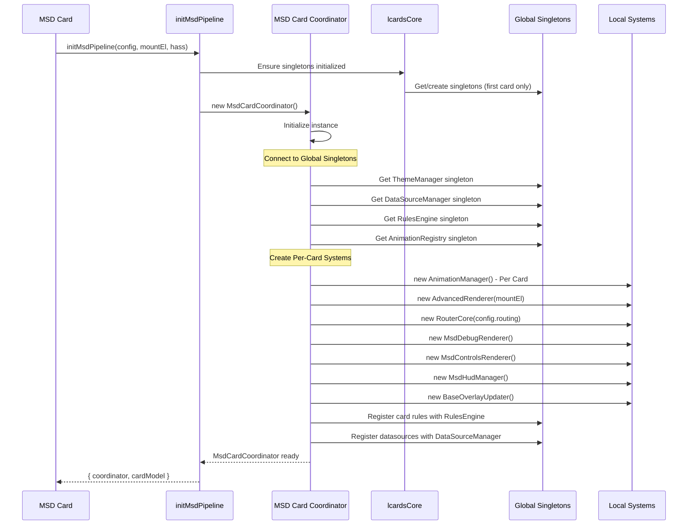
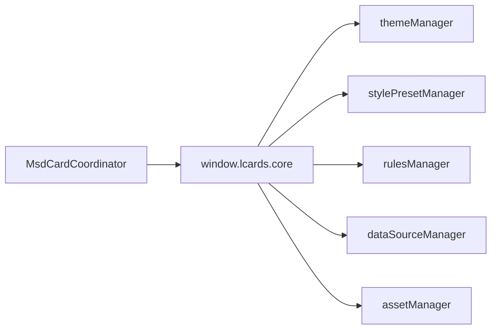

# MSD Card Coordinator

> **Per-card orchestrator for MSD (Master Systems Display) cards**
> Coordinates MSD-specific rendering pipeline, overlays, and routing while bridging to global singleton systems.

---

## 📋 Table of Contents

1. [Overview](#overview)
2. [Architecture](#architecture)
3. [Key Features](#key-features)
4. [Usage](#usage)
5. [API Reference](#api-reference)
6. [Comparison with CoreSystemsManager](#comparison-with-coresystemsmanager)

---

## Overview

**MSD Card Coordinator** is a **per-card instance** that orchestrates the complete MSD rendering pipeline for each MSD card. It manages card-specific rendering systems while connecting to global singleton services for shared intelligence.

**Location**: `src/msd/pipeline/MsdCardCoordinator.js`

**Instantiation**: Once per MSD card instance via `initMsdPipeline()`

**Access Pattern**:
```javascript
// Created during MSD card initialization
const { coordinator } = await initMsdPipeline(config, mountEl, hass);
```

### What MSD Card Coordinator Provides

| Feature | Included |
|---------|----------|
| **Overlay rendering** | ✅ Yes (AdvancedRenderer) |
| **Routing/line paths** | ✅ Yes (RouterCore) |
| **Debug overlays** | ✅ Yes (MsdDebugRenderer) |
| **Control overlays** | ✅ Yes (MsdControlsRenderer) |
| **HUD management** | ✅ Yes (MsdHudManager) |
| **Overlay updates** | ✅ Yes (BaseOverlayUpdater) |
| **Singleton connections** | ✅ Yes (bridges to global systems) |
| Entity state caching | ❌ No (uses DataSourceManager singleton) |
| Entity subscriptions | ❌ No (uses DataSourceManager singleton) |
| Theme management | ❌ No (uses ThemeManager singleton) |
| Rule evaluation | ❌ No (uses RulesEngine singleton) |
| Template processing | ❌ No (uses unified template system from src/core/templates) |

---

## Architecture

### Per-Card Instance Pattern

```mermaid
graph TB
    subgraph "Global Singleton Layer (Shared)"
        DSM[DataSourceManager Singleton]
        RE[RulesEngine Singleton]
        TM[ThemeManager Singleton]
        AR[AnimationRegistry Singleton]
    end

    subgraph "MSD Card A Instance"
        CardA[LCARdS MSD Card A]
        SMA[MSD Card Coordinator A]
        AMA[AnimationManager A - Per Card]
        
        subgraph "Card A Local Systems"
            ARA[AdvancedRenderer A]
            RCA[RouterCore A]
            DRA[MsdDebugRenderer A]
            CRA[MsdControlsRenderer A]
            HMA[MsdHudManager A]
            OUA[BaseOverlayUpdater A]
        end
    end

    subgraph "MSD Card B Instance"
        CardB[LCARdS MSD Card B]
        SMB[MSD Card Coordinator B]
        AMB[AnimationManager B - Per Card]
        
        subgraph "Card B Local Systems"
            ARB[AdvancedRenderer B]
            RCB[RouterCore B]
            DRB[MsdDebugRenderer B]
            CRB[MsdControlsRenderer B]
            HMB[MsdHudManager B]
            OUB[BaseOverlayUpdater B]
        end
    end

    %% Card to MsdCardCoordinator
    CardA --> SMA
    CardB --> SMB

    %% MsdCardCoordinator to Local Systems
    SMA --> ARA
    SMA --> RCA
    SMA --> DRA
    SMA --> CRA
    SMA --> HMA
    SMA --> OUA

    SMB --> ARB
    SMB --> RCB
    SMB --> DRB
    SMB --> CRB
    SMB --> HMB
    SMB --> OUB

    %% MsdCardCoordinator to Singletons (shared)
    SMA -.connects to.-> DSM
    SMA -.connects to.-> RE
    SMA -.connects to.-> TM
    AMA -.uses cache.-> AR

    SMB -.connects to.-> DSM
    SMB -.connects to.-> RE
    SMB -.connects to.-> TM
    AMB -.uses cache.-> AR

    %% Data flow from singletons
    RE -.rule results.-> SMA
    RE -.rule results.-> SMB
    TM -.themes.-> ARA
    TM -.themes.-> ARB
    AMA -.animations.-> ARA
    AMB -.animations.-> ARB

    classDef singleton fill:#b8e0c1,stroke:#266239,stroke-width:3px,color:#0c2a15
    classDef cardSystem fill:#80bb93,stroke:#083717,stroke-width:2px,color:#0c2a15
    classDef localSystem fill:#458359,stroke:#095320,stroke-width:2px,color:#f3f4f7

    class DSM,RE,TM,AR singleton
    class CardA,SMA,CardB,SMB,AMA,AMB cardSystem
    class ARA,RCA,DRA,CRA,HMA,OUA,ARB,RCB,DRB,CRB,HMB,OUB localSystem
```



### Initialization Flow



---

## Key Features

### 1. Advanced Rendering Pipeline

```javascript
// MSD Card Coordinator owns card-specific renderer
const renderer = coordinator.renderer; // AdvancedRenderer instance

// Render card with all overlays
await renderer.render(cardModel);

// Incremental update when entity changes
await renderer.updateOverlay(overlayId, newData);
```

**Rendering Features**:
- SVG overlay generation
- Multi-layer rendering (base, overlays, controls, debug, HUD)
- Incremental updates (only changed overlays)
- Efficient DOM manipulation
- ViewBox scaling and responsive sizing

---

### 2. Line Routing System

```javascript
// MSD Card Coordinator owns card-specific router
const router = coordinator.router; // RouterCore instance

// Calculate line path between overlays
const path = router.calculatePath(
  startPoint,
  endPoint,
  { mode: 'orthogonal', avoidOverlays: true }
);
```

**Routing Features**:
- Auto routing with obstacle avoidance
- Orthogonal (right-angle) paths
- Direct line paths
- Curved Bezier paths
- Dynamic recalculation on overlay movement

---

### 3. Template Processing

Template processing uses the unified template system (`src/core/templates/`):

```javascript
// Cards use card-specific evaluators automatically:
// - UnifiedTemplateEvaluator for LCARdS Cards
// - DataSourceMixin for MSD DataSource templates
// - HATemplateEvaluator for Home Assistant Jinja2 templates

// Templates are evaluated transparently during rendering
// No direct access needed from MsdCardCoordinator
```

**Template Features**:
- Multiple template types (JavaScript, Token, DataSource, Jinja2)
- Automatic detection and parsing via TemplateDetector/TemplateParser
- Card-specific evaluation contexts
- DataSource value substitution
- Safe sandboxed execution

---

### 4. Debug Visualization

```javascript
// MSD-specific debug renderer
const debugRenderer = coordinator.debugRenderer;

// Enable debug overlays
debugRenderer.enable();
debugRenderer.showAttachmentPoints(true);
debugRenderer.showOverlayBounds(true);
```

**Debug Features**:
- Overlay bounding boxes
- Attachment point visualization
- Line routing paths
- Performance metrics
- Configuration inspector

---

### 5. Control Overlays

```javascript
// Interactive control overlay system
const controlsRenderer = coordinator.controlsRenderer;

// Render runtime controls
controlsRenderer.render(cardModel);

// Handle user interactions
controlsRenderer.on('overlaySelected', (overlayId) => {
  console.log('Selected:', overlayId);
});
```

**Control Features**:
- Runtime configuration editor
- Overlay selection and manipulation
- Live preview of changes
- Export modified configuration

---

### 6. HUD Management

```javascript
// Heads-up display overlay manager
const hudManager = coordinator.hudManager;

// Show/hide HUD elements
hudManager.showStatus('Entity count: 42');
hudManager.showAlert('Warning: High temperature');
```

**HUD Features**:
- Status messages
- Alert notifications
- Performance indicators
- System diagnostics

---

### 7. Incremental Overlay Updates

```javascript
// Efficient overlay update system
const overlayUpdater = coordinator.overlayUpdater;

// Update single overlay without full re-render
await overlayUpdater.updateOverlay(overlayId, {
  content: newContent,
  style: { color: 'red' }
});
```

**Update Features**:
- Diff-based updates
- Minimal DOM manipulation
- Batch updates for performance
- Automatic dependency tracking

---

### 8. Singleton Integration

```javascript
// Connect to global singleton systems
coordinator.themeManager = lcardsCore.themeManager;
coordinator.dataSourceManager = lcardsCore.dataSourceManager;
coordinator.rulesEngine = lcardsCore.rulesEngine;
coordinator.animationManager = lcardsCore.animationManager;

// Use singleton services
const color = coordinator.themeManager.getToken('colors.accent.primary');
const entityState = coordinator.dataSourceManager.getValue('light.desk');
```

---

## Integration with Core Singletons

MsdCardCoordinator accesses pre-initialized singletons from `window.lcards.core`:



**Pattern:**
```javascript
class MsdCardCoordinator {
  async initializeSystemsWithPacksFirst(cardModel, config) {
    const core = window.lcards?.core;
    
    // Access (don't create) core singletons
    this.themeManager = core.themeManager;
    this.stylePresetManager = core.stylePresetManager;
    this.rulesManager = core.rulesManager;
    
    // Create MSD-specific systems
    this.advancedRenderer = new AdvancedRenderer(...);
    this.routerCore = new RouterCore(...);
  }
}
```

**Key Facts:**
- ✅ MSD cards never create singletons
- ✅ All intelligence systems come from core
- ✅ Only rendering/routing systems are per-card
- ✅ Singletons initialized once in `src/core/lcards-core.js`

See: [Core Initialization](../core-initialization.md)

---

## Usage

### MSD Card Pattern

```javascript
// src/msd/pipeline/PipelineCore.js
export async function initMsdPipeline(userMsdConfig, mountEl, hass) {
  // Validate configuration
  const { mergedConfig, issues } = await validateAndMergeConfig(userMsdConfig);

  // Create per-card MsdCardCoordinator
  const coordinator = new MsdCardCoordinator();

  // Initialize with pack-based config merging
  await coordinator.initializeSystemsWithPacksFirst(mergedConfig, mountEl, hass);

  // MsdCardCoordinator internally connects to singletons
  // and creates local systems:
  // - coordinator.themeManager = lcardsCore.themeManager (singleton)
  // - coordinator.dataSourceManager = lcardsCore.dataSourceManager (singleton)
  // - coordinator.rulesEngine = lcardsCore.rulesEngine (singleton)
  // - coordinator.renderer = new AdvancedRenderer(...) (local)
  // - coordinator.router = new RouterCore(...) (local)

  // Build card model with overlay processing
  const cardModel = await modelBuilder.build(mergedConfig, coordinator);

  // Register card rules with singleton RulesEngine
  coordinator.rulesEngine.registerCardRules(
    cardModel.rules,
    (ruleResults) => {
      // Callback when rules evaluate
      coordinator.overlayUpdater.applyRuleResults(ruleResults);
    }
  );

  // Render using MsdCardCoordinator's local renderer
  await coordinator.renderer.render(cardModel);

  return { coordinator, cardModel };
}
```

---

### Accessing MSD Card Coordinator

```javascript
// From MSD card instance
class LCARdSMSDCard extends LCARdSNativeCard {
  async initialize() {
    // Initialize MSD pipeline (creates MsdCardCoordinator)
    const result = await initMsdPipeline(
      this.config.msd_config,
      this.shadowRoot,
      this.hass
    );

    this._coordinator = result.coordinator;
    this._cardModel = result.cardModel;
  }

  async update(changedProperties) {
    if (changedProperties.has('hass')) {
      // Update singletons (distributed to all cards)
      lcardsCore.updateHass(this.hass);

      // Incremental update for this card
      await this._coordinator.overlayUpdater.updateFromHass(this.hass);
    }
  }

  disconnectedCallback() {
    // Cleanup card-specific systems
    this._coordinator.dispose();

    // Singletons remain for other cards
    super.disconnectedCallback();
  }
}
```

---

### Runtime Updates

```javascript
// Handle entity state changes
async _handleEntityChange(entityId, newState, oldState) {
  // DataSourceManager singleton processes change
  // RulesEngine singleton evaluates rules
  // MsdCardCoordinator receives rule results via callback

  // Apply incremental updates to this card's overlays
  const affectedOverlays = this._cardModel.getOverlaysUsingEntity(entityId);

  for (const overlay of affectedOverlays) {
    await this._coordinator.overlayUpdater.updateOverlay(
      overlay.id,
      { entityState: newState }
    );
  }
}
```

---

## API Reference

### Constructor

```javascript
new MsdCardCoordinator()
```

**Note**: Created by `initMsdPipeline()`, not directly instantiated.

---

### Methods

#### `initializeSystemsWithPacksFirst(config, mountEl, hass)`

Initialize all MSD systems (local + singleton connections).

```javascript
await coordinator.initializeSystemsWithPacksFirst(mergedConfig, mountEl, hass);
```

**Parameters**:
- `config` (Object) - Merged MSD configuration
- `mountEl` (HTMLElement) - Card mount element (shadow root)
- `hass` (Object) - Home Assistant instance

**Returns**: Promise\<void\>

**Side Effects**:
- Creates local systems (AdvancedRenderer, RouterCore, etc.)
- Connects to global singletons (ThemeManager, RulesEngine, etc.)
- Registers datasources and rules with singletons

---

#### `dispose()`

Clean up card-specific systems.

```javascript
coordinator.dispose();
```

**Returns**: void

**Side Effects**:
- Destroys local rendering systems
- Unregisters from singleton systems
- Releases memory
- Does NOT affect singletons (other cards may still use them)

---

#### `updateHass(hass)`

Update with new HASS instance (distributes to systems).

```javascript
coordinator.updateHass(newHass);
```

**Parameters**:
- `hass` (Object) - Updated Home Assistant instance

**Returns**: void

---

### Properties

| Property | Type | Description |
|----------|------|-------------|
| `renderer` | AdvancedRenderer | Local SVG rendering engine |
| `router` | RouterCore | Local line path calculator |
| `debugRenderer` | MsdDebugRenderer | Local debug overlay system |
| `controlsRenderer` | MsdControlsRenderer | Local control overlay system |
| `hudManager` | MsdHudManager | Local HUD manager |
| `overlayUpdater` | BaseOverlayUpdater | Local incremental update system |
| `themeManager` | ThemeManager | **Singleton** - shared theme system |
| `dataSourceManager` | DataSourceManager | **Singleton** - shared datasource system |
| `rulesEngine` | RulesEngine | **Singleton** - shared rules system |
| `animationManager` | AnimationManager | **Singleton** - shared animation system |

**Note:** Template processing uses the unified template system (`src/core/templates/`) - not a MsdCardCoordinator property.

---

## Comparison with CoreSystemsManager

| Feature | CoreSystemsManager | MSD Card Coordinator |
|---------|-------------------|-------------------|
| **Instantiation** | Singleton (one globally) | Per-card instance |
| **Used By** | LCARdS Cards | MSD cards only |
| **Purpose** | Lightweight entity tracking | Full MSD pipeline orchestration |
| **Overlay Rendering** | ❌ No | ✅ Yes (AdvancedRenderer) |
| **Routing** | ❌ No | ✅ Yes (RouterCore) |
| **Debug Overlays** | ❌ No | ✅ Yes (MsdDebugRenderer) |
| **Control Overlays** | ❌ No | ✅ Yes (MsdControlsRenderer) |
| **HUD Management** | ❌ No | ✅ Yes (MsdHudManager) |
| **Incremental Updates** | ❌ No | ✅ Yes (BaseOverlayUpdater) |
| **Template Processing** | ✅ Yes (cards handle own) | ✅ Yes (via unified template system) |
| **Entity Tracking** | ✅ Yes (direct) | ✅ Yes (via DataSourceManager singleton) |
| **Entity Subscriptions** | ✅ Yes (direct) | ✅ Yes (via DataSourceManager singleton) |
| **Theme Access** | ✅ Via singleton | ✅ Via singleton |
| **Rules Access** | ✅ Via singleton | ✅ Via singleton |
| **Memory Footprint** | ~50 KB (global) | ~150 KB (per card) |
| **Initialization** | `lcardsCore.initialize()` | `initMsdPipeline()` per card |
| **Access Pattern** | `window.lcardsCore.coordinator` | Created per card in pipeline |
| **Cleanup** | Never (singleton) | On card destroy |
| **Singleton Integration** | N/A (is a singleton) | Connects to all singletons |

### When to Use Which

| Card Type | Use CoreSystemsManager | Use MSD Card Coordinator |
|-----------|----------------------|----------------------|
| **LCARdS Cards (button, label, etc.)** | ✅ Yes | ❌ No |
| **MSD Cards (multi-overlay)** | ❌ No | ✅ Yes |

---

## Performance Characteristics

### Memory Usage

**MSD Card Coordinator (Per Card)**:
- AdvancedRenderer: ~40 KB
- RouterCore: ~20 KB
- Debug systems: ~10 KB
- Control systems: ~10 KB
- HUD Manager: ~5 KB
- Overlay registry: ~20 KB
- **Total per MSD card**: ~105-120 KB

**Singleton Systems (Shared)**:
- DataSourceManager: ~80 KB
- RulesEngine: ~50 KB
- ThemeManager: ~40 KB
- AnimationManager: ~30 KB
- **Total shared**: ~200 KB (only created once)

**Comparison**:
- 1 MSD card: ~200 KB (singletons) + ~150 KB (card) = ~350 KB
- 2 MSD cards: ~200 KB (singletons) + ~300 KB (cards) = ~500 KB
- 3 MSD cards: ~200 KB (singletons) + ~450 KB (cards) = ~650 KB

---

### Update Performance

**Per-Card Operations**:
- Incremental overlay update: ~2-5ms per overlay
- Line routing recalculation: ~5-20ms per line
- Template re-evaluation: ~1-3ms per template
- Full re-render: ~50-100ms for 20 overlays

**Singleton Operations (Distributed to All Cards)**:
- Entity state update: ~1ms (shared across all cards)
- Rule evaluation: ~0.5-2ms per rule (results distributed)
- Theme token lookup: ~0.1ms (cached)

---

## Debugging

### Browser Console Access

```javascript
// Access MSD Card Coordinator for a card
const sm = window.lcards.debug.msd.pipelineInstance.coordinator;

// Check local systems
console.log('Renderer:', sm.renderer);
console.log('Router:', sm.router);

// Check singleton connections
console.log('Theme Manager (singleton):', sm.themeManager);
console.log('DataSource Manager (singleton):', sm.dataSourceManager);
console.log('Rules Engine (singleton):', sm.rulesEngine);

// View overlays
const overlays = sm.renderer.getAllOverlays();
console.log('Overlays:', overlays);

// Enable debug renderer
sm.debugRenderer.enable();
sm.debugRenderer.showAttachmentPoints(true);
```

---

### System Health Check

```javascript
// Check if systems are initialized
console.log('Renderer initialized:', !!sm.renderer);
console.log('Router initialized:', !!sm.router);
console.log('Singletons connected:', 
  !!sm.themeManager && 
  !!sm.dataSourceManager && 
  !!sm.rulesEngine
);

// Check overlay count
console.log('Overlay count:', sm.renderer.getOverlayCount());

// Check routing paths
console.log('Active routes:', sm.router.getActiveRoutes());
```

---

## 📚 Related Documentation

- **[CoreSystemsManager](./core-card-coordinator.md)** - Lightweight singleton for LCARdS Cards
- **[Architecture Overview](../overview.md)** - System architecture
- **[Core Initialization](../core-initialization.md)** - Singleton initialization flow ⭐
- **[MSD Card Architecture](../msd-card-architecture.md)** - MSD pipeline overview ⭐
- **[Advanced Renderer](./advanced-renderer.md)** - SVG rendering engine
- **[DataSource System](./datasource-system.md)** - Data processing pipeline
