# LCARdS Pack System

> **The definitive reference for how packs are structured, loaded, distributed, and consumed.**
> Follow this document to add new packs, new component types, and new registries. Deviating from it creates the kind of inconsistency this document exists to prevent.

---

## Overview

A **pack** is a self-contained bundle of data that extends LCARdS. Packs contain style presets, component definitions, themes, rules, animations, or assets. They are loaded at startup by `PackManager`, which distributes each key to the appropriate singleton registry.

**Cardinal rule**: Cards and editors **never** import pack data files directly. They always query a singleton registry (`stylePresetManager`, `componentManager`, `themeManager`, etc.). Packs are the source of truth; registries are the query interface.

---

## Architecture Diagram

```mermaid
flowchart TB
    subgraph BuiltinPacks["Builtin Packs"]
        P1["core\n─────\nsystem version anchor"]:::builtinPacksStyle
        P2["lcards_buttons\n─────\nstyle_presets.button"]:::builtinPacksStyle
        P3["lcards_sliders\n─────\nstyle_presets.slider"]:::builtinPacksStyle
        P4["lcards_elbows\n─────\ncomponents (type: elbow)"]:::builtinPacksStyle
        P5["builtin_themes\n─────\nthemes"]:::builtinPacksStyle
        P6["lcards_sounds_default\n─────\naudio_assets\nsound_schemes"]:::builtinPacksStyle
        P7["lcards_beeps / lcards_alerts\n─────\naudio_assets"]:::builtinPacksStyle
        P8["builtin_msd_backgrounds\n─────\nsvg_assets"]:::builtinPacksStyle
        P9["core_fonts\n─────\nfont_assets"]:::builtinPacksStyle
    end

    subgraph ExternalPacks["External / User Packs"]
        E1["any_pack\n─────\n(any subset of keys)"]:::externalPacksStyle
    end

    subgraph Loader["loadBuiltinPacks.js"]
        LBP[BUILTIN_REGISTRY\nmanifest + loader]
    end

    subgraph PackMgr["PackManager"]
        PM[registerPack\ndistribution hub]
    end

    subgraph Registries["Singleton Registries"]
        TM[ThemeManager]:::coreStyle
        SPM[StylePresetManager]:::coreStyle
        CM[ComponentManager]:::coreStyle
        RE[RulesEngine]:::coreStyle
        SM[SoundManager]:::coreStyle
        AM[AssetManager]:::coreStyle
    end

    BuiltinPacks --> LBP
    ExternalPacks --> PM
    LBP --> PM

    PM -->|themes| TM
    PM -->|style_presets| SPM
    PM -->|components| CM
    PM -->|rules| RE
    PM -->|sound_schemes| SM
    PM -->|audio_assets\nsvg_assets\nfont_assets| AM

    TM & SPM & CM & RE & SM & AM --> Cards([Cards & Editors])

    style BuiltinPacks fill:#2f3749,stroke:#52596e
    style ExternalPacks fill:#2f3749,stroke:#52596e
    style Registries fill:#1e2229,stroke:#2f3749
    style Cards fill:#e7442a,stroke:#ffb399,color:#fff
    style PM fill:#1c3c55,stroke:#37a6d1,color:#fff
    style PackMgr fill:#2f3749,stroke:#52596e
    style Loader fill:#2f3749,stroke:#52596e

    classDef builtinPacksStyle fill:#2a7193,stroke:#67caf0,color:#fff
    classDef externalPacksStyle fill:#ac943b,stroke:#f9ef97,color:#fff
    classDef coreStyle fill:#2f3749,stroke:#52596e
```



---

## Pack Format

Every pack is a plain JavaScript object. All keys are optional — PackManager ignores keys it doesn't recognise and skips empty ones silently.

```js
{
  // ── Required ──────────────────────────────────────────────────────────────
  id:          'my_pack',          // Unique identifier (snake_case)
  version:     '1.0.0',            // Semver string
  name:        'My Pack',          // Human-readable name (shown in Pack Explorer)
  description: 'What this adds',   // One-line description

  // ── Style Presets → StylePresetManager ───────────────────────────────────
  // Named style bundles applied to overlay types.
  // Key is the overlay type; value is { presetName: presetObject, ... }
  style_presets: {
    button: { lozenge: { ... }, barrel: { ... } },
    slider: { pills: { ... }, gauge: { ... } }
  },

  // ── Components → ComponentManager ────────────────────────────────────────
  // Structural component definitions (SVG shells, path generators, zone metadata).
  // Each component MUST have metadata.type declared for type-based lookup.
  components: {
    'header-left': {
      orientation: 'header-left',
      features: ['simple', 'segmented'],
      pathGenerator: (config) => '...',
      metadata: { type: 'elbow', name: 'Header Left', version: '1.0' }
    }
  },

  // ── Themes → ThemeManager ─────────────────────────────────────────────────
  themes: {
    'my-theme': { id: 'my-theme', name: 'My Theme', tokens: { ... } }
  },

  // ── Rules → RulesEngine ───────────────────────────────────────────────────
  rules: [
    { id: 'my_rule', conditions: [...], patches: [...] }
  ],

  // ── Sound Schemes → SoundManager ─────────────────────────────────────────
  // Maps event types to asset keys within this pack.
  sound_schemes: {
    'my_scheme': {
      card_tap:    'my_tap_sound',
      alert_red:   'my_alert_sound',
      alert_clear: null              // null = silence this event
    }
  },

  // ── Audio Assets → AssetManager (+ override picker) ──────────────────────
  audio_assets: {
    'my_tap_sound': { url: '/hacsfiles/my_pack/tap.mp3', description: 'Tap beep' }
  },

  // ── SVG Assets → AssetManager ─────────────────────────────────────────────
  svg_assets: {
    'my_msd': { url: '/hacsfiles/my_pack/msd.svg', metadata: { ... } }
  },

  // ── Font Assets → AssetManager ────────────────────────────────────────────
  font_assets: {
    'my_font': { url: '/hacsfiles/my_pack/font.woff2', displayName: 'My Font', ... }
  }
}
```

---

## Builtin Pack Inventory

| Pack ID | File | Key(s) | Registry |
|---|---|---|---|
| `core` | inline in `loadBuiltinPacks.js` | *(none — version anchor only)* | Pack Explorer |
| `lcards_buttons` | `lcards-buttons-pack.js` | `style_presets.button` | StylePresetManager |
| `lcards_sliders` | `lcards-sliders-pack.js` | `style_presets.slider` | StylePresetManager |
| `lcards_elbows` | `lcards-elbows-pack.js` | `components` (type: `elbow`) | ComponentManager |
| `builtin_themes` | `builtin-themes.js` | `themes` | ThemeManager |
| `lcards_sounds_default` | `lcards-default-sound-scheme.js` | `audio_assets`, `sound_schemes` | AssetManager, SoundManager |
| `lcards_beeps` | `lcards-beeps-pack.js` | `audio_assets` | AssetManager |
| `lcards_alerts` | `lcards-alerts-pack.js` | `audio_assets` | AssetManager |
| `builtin_msd_backgrounds` | `builtin-msd.js` | `svg_assets` | AssetManager |
| `core_fonts` | inline in `loadBuiltinPacks.js` | `font_assets` | AssetManager |
| `lcards_textures` | `lcards-textures-pack.js` | *(metadata only — `SHAPE_TEXTURE_PRESETS` consumed directly by render methods)* | Pack Explorer |

**Always-loaded packs** (regardless of `requested` parameter): `builtin_themes`, `builtin_msd_backgrounds`, `core_fonts`, `lcards_sounds_default`, `lcards_beeps`, `lcards_alerts`, `lcards_elbows`, `lcards_textures`.

---

## File Structure Convention

All pack wrapper files live directly under `src/core/packs/`.
Domain subfolders contain only raw data (presets, components, tokens) that pack wrappers import.

```
src/core/packs/
  loadBuiltinPacks.js               ← manifest + loader ONLY (no pack data)
  externalPackLoader.js
  mergePacks.js
  core_fonts.json
  ── Pack wrappers (all visible at one level) ──────────────────────
  lcards-buttons-pack.js            ← style_presets.button
  lcards-sliders-pack.js            ← style_presets.slider
  lcards-elbows-pack.js             ← components (type: elbow)
  builtin-themes.js                 ← themes
  builtin-msd.js                    ← svg_assets
  lcards-default-sound-scheme.js    ← audio_assets + sound_schemes
  lcards-beeps-pack.js              ← audio_assets
  lcards-alerts-pack.js             ← audio_assets
  ── Raw data (imported by pack wrappers above) ────────────────────
  style-presets/
    buttons/index.js                ← BUTTON_PRESETS
    sliders/index.js                ← SLIDER_PRESETS
  components/
    elbows/index.js                 ← elbowComponents
    sliders/index.js                ← sliderComponents
    dpad/index.js                   ← dpadComponents
    alert/index.js                  ← alertComponents
    buttons/index.js                ← BUTTON_COMPONENTS (metadata only)
    index.js                        ← unified re-export for ComponentManager bootstrap
  themes/
    tokens/lcardsDefaultTokens.js   ← theme token tree
    index.js                        ← re-exports for convenience
  animations/
    index.js                        ← registerBuiltinAnimationPresets()
  example/
    lcards-example-pack.js          ← full-feature template for third-party authors
```

**Rule**: `loadBuiltinPacks.js` imports packs; it does not define them. The only exceptions are `CORE_PACK` (trivial metadata object) and `CORE_FONTS_PACK` (JSON transform that must run at load time).

**Rule**: Pack wrapper files live at the `packs/` root. Never put a pack wrapper inside a domain subfolder.

---

## Registration Flow

```
lcards-core.js _performInitialization():
  1. new ComponentManager() + initialize()   ← loads components/index.js directly
  2. new PackManager(this)
  3. packManager.loadBuiltinPacks([...])
       → loadBuiltinPacks() from loadBuiltinPacks.js
           → returns array of pack objects
       → for each pack: PackManager.registerPack(pack)
           step 1: pack.themes          → ThemeManager.registerThemesFromPack()
           step 2: pack.style_presets   → StylePresetManager.registerPresetsFromPack()
           step 3: pack.rules           → RulesEngine (direct push)
           step 4: pack.audio/svg/font  → AssetManager.preloadFromPack()
           step 5: pack.sound_schemes   → SoundManager.registerSchemes()
           step 6: (animations — cache-on-demand, no registration)
           step 7: pack.components      → ComponentManager.registerComponentsFromPack()
```

Note: ComponentManager initializes from `components/index.js` at step 1 *before* PackManager runs. When a pack with `components` is registered at step 7, it re-registers those components with added `pack` provenance (overwrites, which is intentional). This double-registration is a transitional state — see *Roadmap* below.

---

## Consumer Rules

| Consumer | Correct pattern | Anti-pattern (do not do) |
|---|---|---|
| Card rendering | `window.lcards.core.componentManager.getComponent('header-left')` | `import { getElbowComponent } from '…/elbows/index.js'` |
| Card editor dropdown | `window.lcards.core.stylePresetManager.getAvailablePresets('button')` | `import { BUTTON_COMPONENTS } from '…/buttons/index.js'` |
| Theme token | `window.lcards.core.themeManager.getCurrentTheme()` | Direct token file import |
| Sound asset | `window.lcards.core.soundManager.play('card_tap')` | Direct audio URL reference |

**Why this matters**: Direct imports couple cards to specific files, bypass the pack system, and prevent external packs from overriding or extending definitions. Singleton queries allow any pack to augment the system without touching card code.

---

## How to Add a New Pack

1. **Create the pack file** in the appropriate domain subfolder:
   ```js
   // src/core/packs/sounds/my-pack.js
   export const MY_PACK = {
     id: 'my_pack', name: 'My Pack', version: '1.0.0',
     description: '...',
     audio_assets: { ... }
   };
   ```

2. **Import and register** in `loadBuiltinPacks.js`:
   ```js
   import { MY_PACK } from './sounds/my-pack.js';
   // Add to BUILTIN_REGISTRY:
   my_pack: MY_PACK,
   // Add to alwaysLoad if it should always be present, or leave it
   // as requestable-only
   ```

3. That's it. PackManager distributes the pack keys automatically.

---

## How to Add a New Component Type

1. **Create the component definitions** in a new subfolder:
   ```js
   // src/core/packs/components/mytype/index.js
   export const myTypeComponents = {
     'my-variant': {
       orientation: '…',
       features: ['…'],
       metadata: { type: 'mytype', name: 'My Variant', version: '1.0' },
       // SVG string, render function, or pathGenerator:
       svg: `<svg>…</svg>`
     }
   };
   ```
   > **`metadata.type` is required** — ComponentManager uses it to group components for `getComponentsByType('mytype')`.

2. **Create the pack wrapper**:
   ```js
   // src/core/packs/components/lcards-mytype-pack.js
   import { myTypeComponents } from './mytype/index.js';
   export const LCARDS_MYTYPE_PACK = {
     id: 'lcards_mytype', name: 'LCARdS MyType', version: '1.0.0',
     description: '…',
     components: myTypeComponents
   };
   ```

3. **Register in `loadBuiltinPacks.js`** (import + add to registry + add to `alwaysLoad`).

4. **Add the new type to `components/index.js`** spread:
   ```js
   import { myTypeComponents } from './mytype/index.js';
   export const components = {
     ...existingComponents,
     ...myTypeComponents
   };
   ```
   (This ensures ComponentManager's initial load includes the new type as a fallback — see Roadmap.)

5. **Consumers query via singleton**:
   ```js
   window.lcards.core.componentManager.getComponentsByType('mytype')
   window.lcards.core.componentManager.getComponent('my-variant')
   ```

---

## Public API

| Method | Returns | Description |
|---|---|---|
| `getLoadedPacks()` | `Object[]` | All loaded pack definition objects in registration order |
| `getPack(id)` | `Object\|null` | Specific pack definition by ID string |
| `getPackIds()` | `string[]` | IDs of all loaded packs in load order |
| `registerPack(pack)` | `void` | Register a pack definition object (called at init time) |

---

## Console Access

::: code-group
```javascript [Snapshot]
window.lcards.debug.singleton('packManager')
// → { type: 'PackManager', loadedPacks: 9, packIds: ['core', 'lcards_buttons', ...] }
```
```javascript [Live object]
const pm = window.lcards.core.packManager

pm.getLoadedPacks()      // array of all loaded pack objects
pm.getPack('lcards_buttons')  // specific pack by id
pm.getPackIds()          // ['core', 'lcards_buttons', ...]
```
:::

---

## See Also

- [Component Manager](component-manager.md)
- [Style Preset Manager](style-preset-manager.md)
- [Asset Manager](asset-manager.md)
