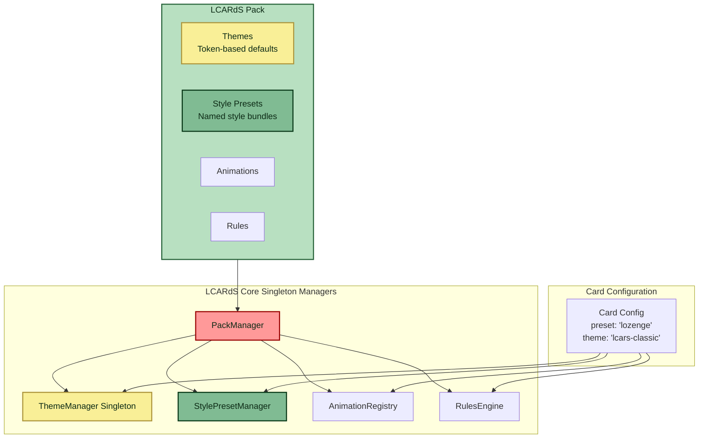
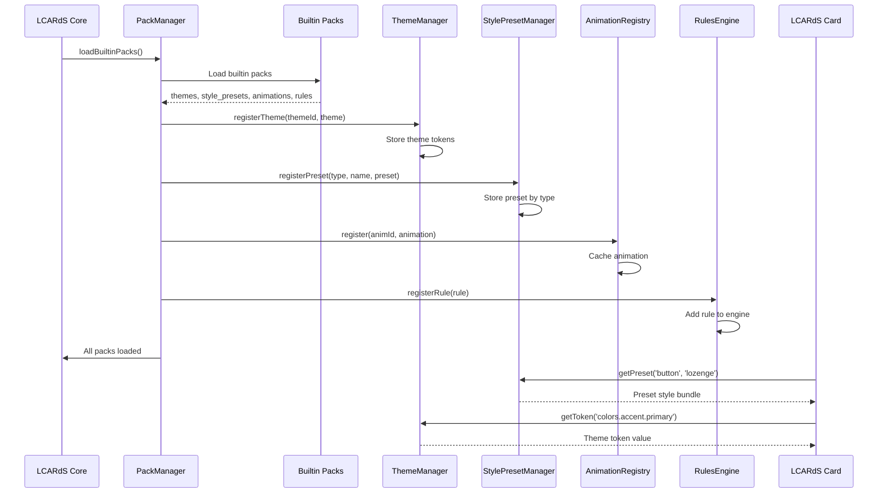

# LCARdS Pack System

> **⚠️ Important Note**: LCARdS v1.22+ removes support for `overlays`, `anchors`, `routing`, `palettes`, and `profiles` fields in pack definitions. These fields are deprecated and will be ignored with a warning. Packs now only support: `style_presets`, `animations`, `rules`, and `themes`.
>
> **Future Enhancement**: Support for user-supplied shapes and component asset registration via packs is planned, but all official assets are currently in static registries. See `src/core/packs/components` and `src/core/packs/shapes`.

---

This document explains the complete structure of LCARdS packs and how themes, style presets, and pack registration work.

## Pack Structure Overview

LCARdS packs contain focused sections for registering assets to core singleton managers:

```javascript
const PACK = {
  id: 'pack_name',
  version: '1.0.0',
  description: 'Pack description',

  // Core pack sections (ONLY these are supported):
  themes: {},          // Theme definitions with tokens (for builtin_themes pack)
  style_presets: {},   // Named style bundles for cards
  animations: [],      // Animation definitions
  rules: [],          // Rule definitions
  
  // ❌ DEPRECATED FIELDS (removed in v1.22+):
  // overlays: [],     // Use core cards instead
  // palettes: {},     // Use theme tokens instead
  // anchors: {},      // MSD-specific, deprecated
  // routing: {},      // MSD-specific, deprecated
  // profiles: [],     // Unused, removed
};
```

### Pack Architecture (Singleton Integration)



### Pack Loading Flow



## Pack Sections Explained

### 1. Themes (builtin_themes pack only)
**Purpose**: Provide complete theme definitions with token-based defaults
**Usage**: Applied automatically via ThemeManager

```javascript
themes: {
  'lcars-classic': {
    id: 'lcars-classic',
    name: 'LCARS Classic',
    description: 'Classic TNG-era LCARS styling',
    tokens: lcarsClassicTokens,  // Token object with all theme values
    cssFile: 'apexcharts-lcars-classic.css'  // Optional ApexCharts CSS
  }
}
```

**Theme Token Structure:**
```javascript
lcarsClassicTokens = {
  // Base design tokens
  colors: {
    accent: { primary: 'var(--lcars-orange)' },
    status: { success: 'var(--lcars-green)' }
  },
  typography: {
    fontSize: { base: 16 },
    fontFamily: { primary: 'Antonio' }
  },
  spacing: {
    scale: { '4': 8 },
    gap: { base: 4 }
  },
  borders: {
    width: { base: 2 },
    radius: { base: 4 }
  },

  // Component-specific defaults
  components: {
    button: {
      background: {
        active: 'var(--lcars-orange)',
        inactive: 'var(--lcars-gray)'
      }
    },
    slider: {
      track: { height: 40 }
    }
  }
}
```

### 2. Style Presets (Named Style Bundles)
**Purpose**: Provide complete, named style configurations for cards
**Usage**: Applied via `preset: "preset_name"` in card config

```javascript
style_presets: {
  button: {
    lozenge: {
      text_layout: 'diagonal',
      label_position: 'top-left',
      value_position: 'bottom-right',
      cell_radius: 34,
      text_padding: 14,
      text_margin: 3,
      normalize_radius: false,
      show_labels: true,
      show_values: true,
      lcars_text_preset: 'lozenge',
      // ANY style property can be included
      cell_color: '#0088ff',
      font_size: 18,
      font_weight: 'bold'
    },
    bullet: {
      text_layout: 'side-by-side',
      label_position: 'left',
      value_position: 'right',
      cell_radius: 38,
      text_padding: 8,
      normalize_radius: true,
      lcars_text_preset: 'bullet'
    }
  }
}
```

### 3. Overlays (Complete Definitions)
**Purpose**: Provide complete, ready-to-use overlay configurations
**Usage**: Merged into user config as actual overlays

```javascript
overlays: [
  {
    id: 'power_status_grid',
    type: 'status_grid',
    position: [100, 100],
    size: [200, 150],
    style: {
      lcars_button_preset: 'lozenge'
    },
    cells: [
      { id: 'power', label: 'PWR', content: '{power.state}' }
    ]
  }
]
```

### 4. Palettes (Color Schemes) - Legacy REMOVED

### 5. Chart Templates (builtin_themes pack only)
**Purpose**: Provide reusable ApexCharts configurations
**Usage**: Referenced in chart overlays via template system

```javascript
chartTemplates: {
  sensor_monitor: {
    style: {
      chart_type: 'line',
      stroke_width: 3,
      smoothing_mode: 'smooth',
      show_grid: true,
      chart_options: {
        stroke: {
          curve: 'smooth',
          colors: ['colors.accent.primary']  // Token reference
        }
      }
    }
  }
}
```

## How Style Presets Work

### 1. Pack Definition
Style presets are defined in the pack's `style_presets` section:

```javascript
style_presets: {
  status_grid: {        // Overlay type
    preset_name: {      // Preset name
      property: value,  // Any style property
      // ...
    }
  }
}
```

### 2. User Application
Users apply presets by specifying the preset name:

```yaml
- id: my_grid
  type: status_grid
  style:
    lcars_button_preset: "preset_name"  # Loads from pack
    custom_override: "value"            # User override
```

### 3. Runtime Resolution
StatusGridRenderer loads and applies the preset:

```javascript
// 1. Load preset from StylePresetManager
const preset = stylePresetManager.getPreset('status_grid', 'preset_name');

// 2. Apply with user override protection
Object.entries(preset).forEach(([property, value]) => {
  if (!userStyle[property]) {           // User didn't specify
    gridStyle[property] = value;        // Apply preset value
  }
  // User value preserved if specified
});
```

## Theme System Integration

### How Themes Provide Defaults

Themes replace the old profile/defaults system:

**Old System (Deprecated):**
```javascript
// Packs had profiles with defaults
profiles: [{
  id: 'cb_button_defaults',
  defaults: {
    status_grid: { text_padding: 12 }
  }
}]
```

**New System (Current):**
```javascript
// Themes have component defaults in tokens
themes: {
  'lcars-classic': {
    tokens: {
      components: {
        statusGrid: {
          textPadding: 'spacing.scale.4'  // Token reference → 8
        }
      }
    }
  }
}
```

### Theme Token Resolution

Themes support **token references** for consistency:

```javascript
// Theme tokens
{
  spacing: {
    scale: { '4': 8 }
  },
  components: {
    statusGrid: {
      textPadding: 'spacing.scale.4'  // References spacing token
    }
  }
}

// Resolution at runtime
ThemeManager.getDefault('statusGrid', 'textPadding', 8)
// → Looks up 'components.statusGrid.textPadding'
// → Finds 'spacing.scale.4'
// → Resolves to spacing.scale.4 = 8
// → Returns 8
```

## Priority Order

When resolving style values, the system uses this priority order:

1. **User Explicit Values** (highest) - Direct style properties
2. **Style Preset Values** (medium) - Applied from pack presets
3. **Theme Component Defaults** (lower) - From active theme tokens
4. **Hardcoded Fallbacks** (lowest) - Last resort values in code

## Example: Complete Flow

### Pack Definition
```javascript
// builtin_themes pack provides theme
themes: {
  'lcars-classic': {
    tokens: {
      spacing: { scale: { '4': 8 } },
      components: {
        statusGrid: { textPadding: 'spacing.scale.4' }  // → 8
      }
    }
  }
}

// lcards_buttons pack provides preset
style_presets: {
  status_grid: {
    lozenge: {
      text_padding: 14,      // Preset overrides theme default
      text_layout: 'diagonal'
    }
  }
}
```

### User Configuration
```yaml
msd:
  theme: "lcars-classic"                # Select theme
  use_packs:
    builtin: ['lcards_buttons']      # Load presets

  overlays:
    - id: my_grid
      type: status_grid
      style:
        lcars_button_preset: "lozenge"  # Apply preset
        font_size: 20                    # User override
        # text_padding not specified    # Will use preset value (14)
        # cell_radius not specified     # Will use theme default
```

### Final Resolution
```javascript
// Final style object:
{
  font_size: 20,          // USER (highest priority)
  text_padding: 14,       // PRESET (medium priority)
  text_layout: 'diagonal', // PRESET (medium priority)
  cell_radius: 4,         // THEME (lower priority, from theme tokens)
  border_width: 1         // HARDCODED FALLBACK (lowest priority)
}
```

## Pack Types

### 1. Theme Pack (builtin_themes)
**Always loaded automatically**
- Provides all available themes
- Contains default theme (`lcars-classic`)
- Includes chart templates and animation presets

### 2. Style Pack (lcards_buttons)
**Loaded on demand**
- Provides style presets (lozenge, bullet, etc.)
- No themes (uses active theme for defaults)
- Focused on specific overlay styling

### 3. Feature Pack (core)
**Core functionality**
- Minimal configuration
- System-level defaults
- Basic anchors and routing

### 4. Custom Packs (user-created)
**External packs**
- Can include any pack sections
- Loaded via URL in `use_packs.external`
- Can provide custom themes, presets, overlays

## Creating Custom Packs

### Example: Custom Theme Pack
```json
{
  "id": "my_themes",
  "version": "1.0.0",
  "themes": {
    "my-dark-theme": {
      "id": "my-dark-theme",
      "name": "My Dark Theme",
      "tokens": {
        "colors": {
          "accent": { "primary": "#00ff00" },
          "ui": { "background": "#000000" }
        },
        "components": {
          "statusGrid": {
            "cellGap": 4,
            "textPadding": 12
          }
        }
      }
    }
  }
}
```

### Example: Custom Style Pack
```json
{
  "id": "my_styles",
  "version": "1.0.0",
  "style_presets": {
    "status_grid": {
      "my-custom-preset": {
        "cell_radius": 20,
        "text_padding": 16,
        "font_weight": "bold",
        "cell_color": "#ff6600"
      }
    }
  }
}
```

## Benefits

- **Modularity**: Packs can be mixed and matched
- **Consistency**: Themes ensure consistent theming across all components
- **Flexibility**: Users can override any value
- **Extensibility**: Packs can define custom themes and presets
- **Maintainability**: Centralized configurations in packs
- **Simplicity**: Clear separation between themes (defaults) and presets (styles)

## Migration from v1.21 and Earlier

### Breaking Changes in v1.22+

**Removed Pack Fields (Deprecated):**
- ❌ `overlays` - Use core LCARdS cards instead
- ❌ `anchors` - MSD-specific positioning, deprecated
- ❌ `routing` - MSD-specific navigation, deprecated
- ❌ `palettes` - Replaced by theme tokens
- ❌ `profiles` - Unused feature, removed

**Supported Pack Fields:**
- ✅ `style_presets` - Named style bundles for cards
- ✅ `animations` - Animation definitions
- ✅ `rules` - Rule definitions  
- ✅ `themes` - Theme token definitions

### Migration Steps for Custom Packs

**1. Remove Obsolete Fields**
```javascript
// ❌ OLD (v1.21 and earlier)
const MY_PACK = {
  id: 'my_pack',
  overlays: [...],
  anchors: {...},
  routing: {...},
  palettes: {...},
  style_presets: {...}
};

// ✅ NEW (v1.22+)
const MY_PACK = {
  id: 'my_pack',
  style_presets: {...},
  animations: [...],
  rules: [...]
};
```

**2. Convert Palettes to Theme Tokens**
```javascript
// ❌ OLD: Palettes
palettes: {
  my_palette: {
    primary: '#ff6600',
    secondary: '#0066ff'
  }
}

// ✅ NEW: Theme Tokens
themes: {
  'my-theme': {
    id: 'my-theme',
    name: 'My Theme',
    tokens: {
      colors: {
        accent: { primary: '#ff6600' },
        secondary: { primary: '#0066ff' }
      }
    }
  }
}
```

**3. Move Styles to Style Presets**
```javascript
// ❌ OLD: Direct overlay definitions in pack
overlays: [
  {
    id: 'my_button',
    type: 'button',
    style: { background: '#ff6600' }
  }
]

// ✅ NEW: Style presets that cards can reference
style_presets: {
  button: {
    'my-orange-button': {
      background: '#ff6600',
      border_radius: 20
    }
  }
}
```

**4. Update Card Configurations**
```yaml
# ❌ OLD: Reference pack overlays
- type: custom:lcards-msd
  config:
    use_packs:
      builtin: ['my_pack']

# ✅ NEW: Use style presets in card config
- type: custom:lcards-button
  config:
    preset: 'my-orange-button'
    entity: light.living_room
```

### Deprecation Warnings

Packs with obsolete fields will log warnings:
```
[PackManager] Pack 'my_pack' contains deprecated fields: overlays, anchors, routing.
These fields are ignored. Use 'themes' for colors and 'style_presets' for styles.
```

These warnings are informational - the pack will still load, but deprecated fields are ignored.

### Getting Help

If you have custom packs and need migration assistance:
1. Check the examples above
2. Review builtin packs in `src/core/packs/loadBuiltinPacks.js`
3. Open an issue on GitHub with your pack structure

---

*Last Updated: January 2026 - LCARdS v1.22+*

**Old:** Profiles in packs provided defaults
**New:** Themes in builtin_themes pack provide defaults via tokens

**Old:** Multiple layers (user, pack, theme, builtin)
**New:** Simplified layers (user > preset > theme > fallback)

**Benefit:** Simpler, more powerful, easier to maintain