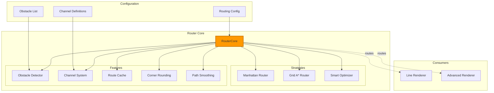
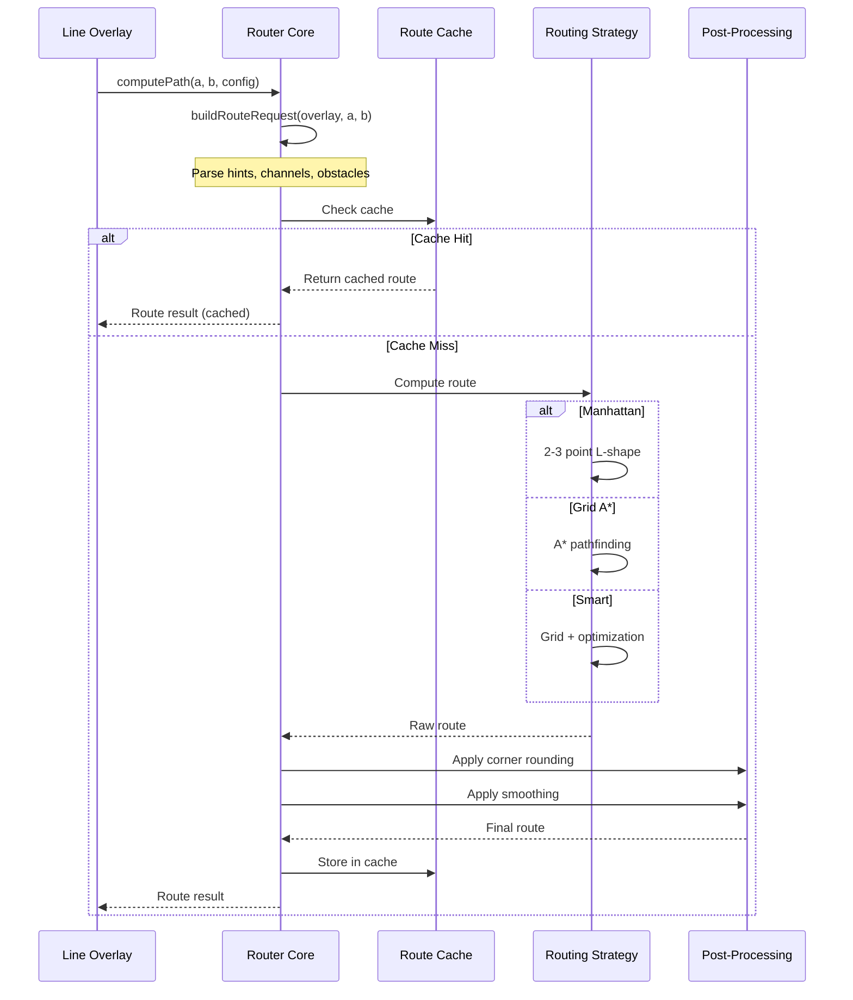

# Router Core

> **Intelligent path routing system**
> Advanced Manhattan and grid-based routing with channel support, obstacle avoidance, and smart path optimization.

---

## 📋 Table of Contents

1. [Overview](#overview)
2. [Architecture](#architecture)
3. [Routing Strategies](#routing-strategies)
4. [Channel System](#channel-system)
5. [Route Configuration](#route-configuration)
6. [API Reference](#api-reference)
7. [Usage Patterns](#usage-patterns)
8. [Performance](#performance)
9. [Debugging](#debugging)

---

## Overview

The **Router Core** provides sophisticated pathfinding for line overlays, supporting multiple routing strategies, obstacle avoidance, and channel-based routing guidance.

### Responsibilities

- ✅ **Path computation** - Calculate optimal routes between anchor points
- ✅ **Obstacle avoidance** - Route around overlays marked as obstacles
- ✅ **Channel routing** - Guide paths through preferred corridors
- ✅ **Multiple strategies** - Manhattan, grid-based A*, and smart optimization
- ✅ **Route caching** - Cache computed routes for performance
- ✅ **Corner rounding** - Apply rounded corners with configurable radius
- ✅ **Path smoothing** - Chaikin smoothing for organic curves

### Key Features

- **3 routing strategies** - Basic Manhattan, grid-based A*, smart optimization
- **Channel system** - Define preferred routing corridors with weights
- **Obstacle awareness** - Automatic obstacle detection from overlays
- **Intelligent caching** - LRU cache with automatic invalidation
- **Direction hints** - Control first and last segment orientation
- **Proximity avoidance** - Soft penalties for passing near obstacles
- **Corner styles** - Miter, round, or bevel corners
- **Path smoothing** - Optional Chaikin smoothing iterations

---

## Architecture

### System Integration



### Data Flow



---

## Routing Strategies

### 1. Manhattan (Basic)

**Simple 2-3 point routing** following axis-aligned segments.

**When to use:**
- Simple point-to-point connections
- No obstacles
- Fast performance needed

**Behavior:**
```
Start [x1, y1]
  ↓
If aligned (x1==x2 or y1==y2):
  → Direct line
Else:
  → 3-point L-shape based on lastMode hint
    - lastMode='xy': vertical final ([x1,y1] → [x2,y1] → [x2,y2])
    - lastMode='yx': horizontal final ([x1,y1] → [x1,y2] → [x2,y2])
```

**Configuration:**
```javascript
{
  route_mode: 'manhattan',  // or omit for auto-detection
  route_mode_last: 'yx'      // Control last segment
}
```

### 2. Grid-Based A*

**Occupancy grid pathfinding** with obstacle avoidance.

**When to use:**
- Obstacles present
- Need automatic obstacle avoidance
- Accept moderate performance cost

**Behavior:**
1. Build occupancy grid from obstacles
2. Apply A* pathfinding on grid
3. Convert grid path to polyline
4. Optional smart refinement

**Configuration:**
```javascript
{
  route_mode: 'grid',
  grid_resolution: 64,      // Grid cell size
  clearance: 10,            // Minimum distance from obstacles
  smart_proximity: 20       // Soft avoidance distance
}
```

**Performance:**
- Grid resolution: 64 → ~400 cells for 400x200 canvas
- A* complexity: O(n log n) where n = cells
- Typical: 5-15ms for complex routes

### 3. Smart Optimization

**Grid-based routing with intelligent path refinement**.

**When to use:**
- Need high-quality routes
- Willing to accept higher performance cost
- Complex obstacle scenarios

**Behavior:**
1. Compute initial grid-based route
2. Detect improvement opportunities (detours)
3. Test alternative segments
4. Keep improvements above threshold
5. Limit refinement iterations

**Configuration:**
```javascript
{
  route_mode: 'smart',
  smart_detour_span: 48,          // Max detour distance
  smart_max_extra_bends: 3,        // Max new bends allowed
  smart_min_improvement: 4,        // Min pixels saved
  smart_max_detours_per_elbow: 4   // Max attempts per bend
}
```

**Performance:**
- Base grid: 5-15ms
- Refinement: +5-20ms depending on complexity
- Typical: 10-35ms total

---

## Channel System

### Concept

**Channels** are preferred routing corridors that guide paths through specific areas.

### Channel Modes

| Mode | Behavior | Use Case |
|------|----------|----------|
| **prefer** | Soft preference for channels | Gentle guidance |
| **avoid** | Penalty for channel use | Keep out zones |
| **force** | Strong push into channels | Strict routing |

### Channel Definition

```javascript
{
  channels: [
    {
      id: "main_corridor",
      rect: [x, y, width, height],
      weight: 0.7  // 0-1, higher = stronger preference
    },
    {
      id: "side_passage",
      rect: [x2, y2, width2, height2],
      weight: 0.5
    }
  ]
}
```

### Channel Configuration

```javascript
// Line overlay channel usage
{
  route_channels: ["main_corridor"],  // Which channels to use
  route_channel_mode: "prefer",       // How to use them
  channel_force_penalty: 800,         // Force mode penalty
  channel_avoid_multiplier: 1.0,      // Avoid mode multiplier
  channel_target_coverage: 0.6,       // Target 60% in channel
  channel_shaping_max_attempts: 12    // Refinement attempts
}
```

### Channel Coverage Calculation

```javascript
// Path segments analyzed for channel overlap
const coverage = segmentsInChannel / totalSegments;

// Penalties/bonuses applied based on mode
if (mode === 'prefer') {
  penalty = (1 - coverage) * channelWeight * 100;
} else if (mode === 'force') {
  penalty = forcePenalty * Math.pow(1 - coverage, 2);
} else if (mode === 'avoid') {
  penalty = coverage * channelWeight * avoidMultiplier * 100;
}
```

---

## Route Configuration

### Direction Hints

Control segment orientation for first and last segments:

```javascript
{
  route_mode: 'xy',       // First segment horizontal (x then y)
  route_mode_last: 'yx'   // Last segment horizontal
}
```

**Auto-detection:**
- If `attach_side` is `left`/`right` → last segment horizontal (`yx`)
- If `attach_side` is `top`/`bottom` → last segment vertical (`xy`)
- Otherwise → geometry-based detection

### Obstacle Configuration

```javascript
// Mark overlay as obstacle
{
  type: 'text',
  obstacle: true  // This overlay blocks routing
}

// Ribbons are automatic obstacles
{
  type: 'ribbon'  // Automatically treated as obstacle
}
```

### Corner Styles

```javascript
{
  corner_style: 'round',  // miter, round, or bevel
  corner_radius: 10       // Radius for round corners
}
```

**Corner Styles:**
- **miter** - Sharp 90° corners (default)
- **round** - Circular arcs at bends
- **bevel** - Straight diagonal cut at bends

### Path Smoothing

```javascript
{
  smoothing_mode: 'chaikin',        // none or chaikin
  smoothing_iterations: 2,           // Number of passes
  smoothing_max_points: 100          // Limit output points
}
```

**Chaikin Algorithm:**
- Iterative corner-cutting subdivision
- Each iteration doubles points
- Creates smooth organic curves
- Applied AFTER corner rounding

---

## API Reference

### Constructor

```javascript
new RouterCore(routingConfig, anchors, viewBox)
```

**Parameters:**
- `routingConfig` (Object) - Routing configuration
- `anchors` (Object) - Anchor coordinate map
- `viewBox` (Array) - `[x, y, width, height]`

### Methods

#### `buildRouteRequest(overlay, a1, a2)`

Build route request with direction hints and configuration.

**Parameters:**
- `overlay` (Object) - Line overlay configuration
- `a1` (Array) - Start anchor `[x, y]`
- `a2` (Array) - End anchor `[x, y]`

**Returns:** Route request object

**Example:**
```javascript
const req = router.buildRouteRequest(lineOverlay, [100, 50], [300, 150]);
console.log(req.modeHint);      // 'xy' or 'yx'
console.log(req.modeHintLast);  // 'xy' or 'yx'
console.log(req.channels);      // ['main_corridor']
```

#### `computePath(request)`

Compute route for given request.

**Parameters:**
- `request` (Object) - Route request from `buildRouteRequest()`

**Returns:** Route result object

**Result Structure:**
```javascript
{
  d: "M100,50 L200,50 L200,150 L300,150",  // SVG path
  pts: [[100,50], [200,50], [200,150], [300,150]],  // Polyline points
  meta: {
    strategy: 'manhattan-basic',  // Strategy used
    cost: 450,                     // Total cost
    segments: 3,                   // Number of segments
    bends: 2,                      // Number of bends
    cache_hit: false,              // From cache?
    hint: {
      first: 'xy',                 // First segment hint
      last: 'yx',                  // Last segment hint
      sourceFirst: 'auto',         // Hint source
      sourceLast: 'attach_side'    // Hint source
    }
  }
}
```

#### `setOverlays(overlays)`

Update obstacle list from overlays.

**Parameters:**
- `overlays` (Array) - List of overlay configurations

**Behavior:**
- Detects overlays with `obstacle: true`
- Detects ribbon overlays (automatic obstacles)
- Rebuilds occupancy grid
- Invalidates route cache

**Example:**
```javascript
router.setOverlays(resolvedModel.overlays);
```

#### `invalidate(id)`

Invalidate route cache.

**Parameters:**
- `id` (string) - Overlay ID to invalidate, or `'*'` for all

**Example:**
```javascript
router.invalidate('*');           // Clear all cache
router.invalidate('divider_line'); // Clear specific overlay routes
```

#### `stats()`

Get router statistics.

**Returns:** Statistics object

**Example:**
```javascript
const stats = router.stats();
console.log(stats);
// {
//   size: 23,          // Cached routes
//   max: 256,          // Max cache size
//   rev: 5,            // Cache revision
//   obstacles: 12,     // Obstacle count
//   obsVersion: 3      // Obstacle version
// }
```

---

## Usage Patterns

### Pattern 1: Basic Line Routing

```javascript
// Simple point-to-point line
const lineOverlay = {
  type: 'line',
  attach_start: 'title.right',
  attach_to: 'button.left',
  style: {
    // No routing config - auto Manhattan
  }
};

// Router automatically:
// 1. Detects aligned/non-aligned
// 2. Chooses Manhattan basic
// 3. Returns 2-3 point route
```

### Pattern 2: Obstacle Avoidance

```javascript
// Define obstacles
const obstacles = [
  { type: 'text', obstacle: true, position: [150, 80], size: [100, 30] },
  { type: 'ribbon', position: [200, 0], size: [4, 200] }
];

// Configure line for grid routing
const lineOverlay = {
  type: 'line',
  attach_start: 'a',
  attach_to: 'b',
  style: {
    route_mode: 'grid',
    grid_resolution: 64,
    clearance: 10
  }
};

// Router:
// 1. Builds occupancy grid
// 2. Marks obstacle cells
// 3. A* pathfinding around obstacles
```

### Pattern 3: Channel-Guided Routing

```javascript
// Define routing channels
const config = {
  routing: {
    channels: [
      { id: 'main', rect: [50, 50, 300, 100], weight: 0.8 },
      { id: 'side', rect: [350, 0, 50, 200], weight: 0.5 }
    ]
  }
};

// Use channels in line
const lineOverlay = {
  type: 'line',
  attach_start: 'header',
  attach_to: 'footer',
  style: {
    route_mode: 'smart',
    route_channels: ['main'],
    route_channel_mode: 'prefer',
    channel_target_coverage: 0.7  // Want 70% in channel
  }
};

// Router:
// 1. Computes base route
// 2. Calculates channel coverage
// 3. Refines path to increase coverage
```

### Pattern 4: Direction-Controlled Routing

```javascript
// Control segment orientation
const lineOverlay = {
  type: 'line',
  attach_start: 'title.right',
  attach_to: 'button',
  attach_side: 'left',
  style: {
    route_mode: 'xy',      // Start horizontal
    route_mode_last: 'yx'  // End horizontal
  }
};

// Result: H → V → H shape
// [x1,y1] → [x2,y1] → [x2,y2] → [x3,y2] → [x3,y3]
```

### Pattern 5: Rounded Corners with Smoothing

```javascript
const lineOverlay = {
  type: 'line',
  attach_start: 'a',
  attach_to: 'b',
  style: {
    route_mode: 'smart',
    corner_style: 'round',
    corner_radius: 12,
    smoothing_mode: 'chaikin',
    smoothing_iterations: 2
  }
};

// Processing:
// 1. Compute base route
// 2. Apply corner arcs (A commands)
// 3. Convert to polyline
// 4. Apply Chaikin smoothing
// 5. Return smooth organic path
```

---

## Performance

### Caching Strategy

**LRU Cache:**
- Max 256 routes cached
- Key includes: anchors, mode, obstacles, channels, config
- Automatic invalidation on obstacle/config change

**Cache Hit Rates:**
- Static dashboards: 80-90%
- Dynamic layouts: 40-60%
- Frequent obstacle changes: 20-40%

### Strategy Performance

| Strategy | Typical Time | Cache Benefit | Use Case |
|----------|--------------|---------------|----------|
| **Manhattan** | 0.1-0.5ms | Low (simple) | Fast basic routing |
| **Grid A*** | 5-15ms | High | Obstacle avoidance |
| **Smart** | 10-35ms | High | Quality routes |

### Optimization Tips

✅ **Use Manhattan for simple routes** - 10-50x faster than grid
✅ **Cache static configurations** - Rebuild routes only on changes
✅ **Limit grid resolution** - 64 is good balance (32=faster, 128=slower)
✅ **Minimize obstacles** - Each obstacle adds grid complexity
✅ **Batch overlay updates** - Update overlays once, not per line
✅ **Use smart selectively** - Apply to important visible lines only

### Performance Monitoring

```javascript
// Enable performance tracking
import { perfGet, perfTime } from './perf/PerfCounters.js';

// Route computation is auto-tracked
const route = router.computePath(request);

// Check metrics
const metrics = perfGet('routing.compute.ms');
console.log('Avg routing time:', metrics.avg, 'ms');
console.log('Total routes:', metrics.count);
```

---

## Debugging

### Browser Console Access

```javascript
// Get router instance
const router = window.lcards.debug.msd.pipelineInstance.systemsManager.routerCore;

// Check router stats
console.log(router.stats());
// { size: 23, max: 256, rev: 5, obstacles: 12, obsVersion: 3 }

// Invalidate cache
router.invalidate('*');

// Build test route
const req = router.buildRouteRequest(lineOverlay, [100, 50], [300, 150]);
console.log('Request:', req);

const route = router.computePath(req);
console.log('Route:', route);
console.log('Path:', route.d);
console.log('Points:', route.pts);
console.log('Meta:', route.meta);
```

### Common Issues

**Issue: Routes not avoiding obstacles**

```javascript
// Debug: Check if obstacles are registered
const stats = router.stats();
console.log('Obstacles:', stats.obstacles);

// Debug: Check grid resolution
console.log('Grid resolution:', router.config.grid_resolution);

// Debug: Try explicit grid mode
lineOverlay.style.route_mode = 'grid';
lineOverlay.style.clearance = 15;
```

**Issue: Routes not following channels**

```javascript
// Debug: Check channel configuration
console.log('Channels:', router._channels);

// Debug: Check channel mode
const req = router.buildRouteRequest(lineOverlay, a1, a2);
console.log('Channel mode:', req.channelMode);
console.log('Requested channels:', req.channels);

// Debug: Increase channel coverage target
lineOverlay.style.channel_target_coverage = 0.8;
```

**Issue: Wrong segment orientation**

```javascript
// Debug: Check direction hints
const req = router.buildRouteRequest(lineOverlay, a1, a2);
console.log('First hint:', req.modeHint, req._hintSourceFirst);
console.log('Last hint:', req.modeHintLast, req._hintSourceLast);

// Fix: Set explicit hints
lineOverlay.style.route_mode = 'xy';
lineOverlay.style.route_mode_last = 'yx';
```

**Issue: Performance problems**

```javascript
// Debug: Check cache hit rate
import { perfGet } from './perf/PerfCounters.js';
const hits = perfGet('routing.cache.hit');
const misses = perfGet('routing.cache.miss');
console.log('Hit rate:', hits.count / (hits.count + misses.count));

// Debug: Check routing times
const times = perfGet('routing.compute.ms');
console.log('Avg time:', times.avg, 'ms');

// Fix: Reduce grid resolution or use Manhattan
config.routing.grid_resolution = 32;
lineOverlay.style.route_mode = 'manhattan';
```

---

## 📚 Related Documentation

- **[Attachment Point Manager](attachment-point-manager.md)** - Provides anchor coordinates
- **[Advanced Renderer](advanced-renderer.md)** - Uses router for line rendering
- **[Systems Manager](systems-manager.md)** - Initializes router core

---

**Last Updated:** October 26, 2025
**Version:** 2025.10.1-fuk.42-69
**Source:** `/src/msd/routing/RouterCore.js` (1,052 lines)
