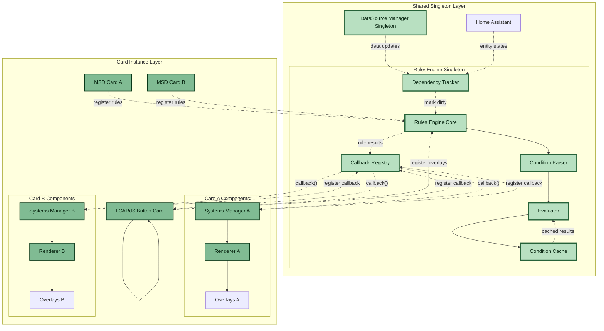
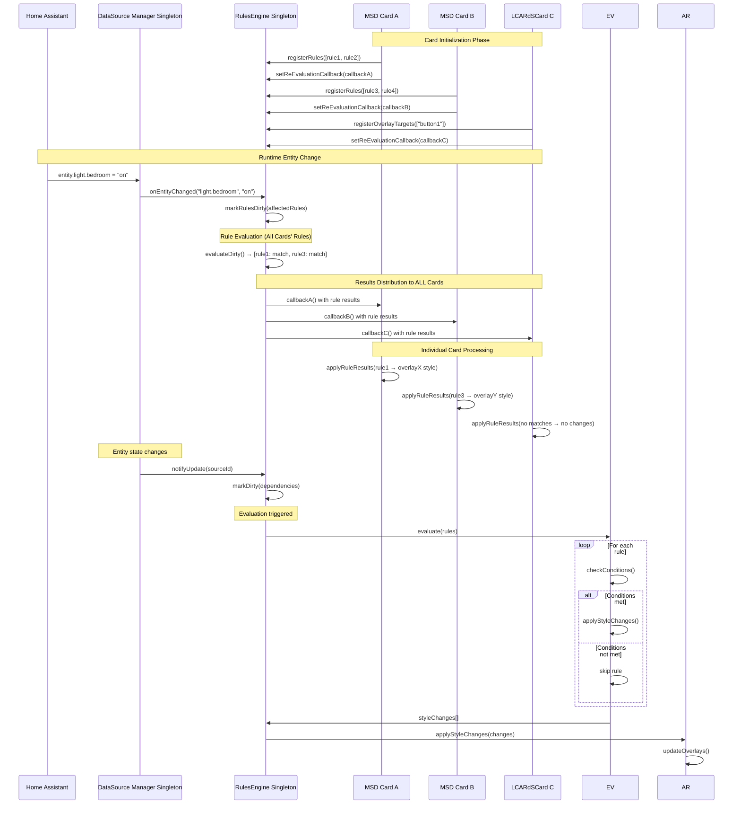

# Rules Engine

> **Conditional logic system for dynamic overlay styling and behavior**
> Evaluate complex conditions and apply style changes based on entity states, time, performance, and more.

---

## 📋 Table of Contents

1. [Overview](#overview)
2. [Architecture](#architecture)
3. [Rule Structure](#rule-structure)
4. [Condition Types](#condition-types)
5. [Rule Composition](#rule-composition)
6. [DataSource Integration](#datasource-integration)
7. [Performance](#performance)
8. [Rule Tracing](#rule-tracing)
9. [Configuration](#configuration)
10. [API Reference](#api-reference)
11. [Examples](#examples)
12. [Troubleshooting](#troubleshooting)

---

## Overview

The **Rules Engine Singleton** provides sophisticated conditional logic for dynamic overlay styling across **all card instances**. As a shared singleton system, it collects rules from all cards (MSD cards and LCARdS Cards) and distributes evaluation results to all registered callbacks, enabling cross-card coordination and resource efficiency.

### Key Features

- ✅ **Singleton architecture** - Single RulesEngine serves all cards
- ✅ **Multi-card support** - Rules from all cards evaluated together
- ✅ **Cross-card targeting** - Rules can affect overlays on any card
- ✅ **Multiple callback registration** - Each card gets rule updates
- ✅ **High-performance evaluation** with shared dependency tracking
- ✅ **Comprehensive condition types** (20+ types)
- ✅ **DataSource integration** with shared transformation access
- ✅ **Rule composition** with logical operators (all/any/not)
- ✅ **Stop semantics** for rule priority control
- ✅ **Real-time tracing** for debugging
- ✅ **Memory-efficient** with compiled condition trees

### Multi-Card Use Cases

- **Cross-card styling** - One card's rule styles overlays on other cards
- **Global alerts** - Emergency states affect all cards simultaneously
- **Coordinated themes** - Theme changes propagate to all cards
- **Shared conditions** - Common conditions evaluated once for all cards
- **Performance optimization** - Single entity subscription for all cards
- **Tag-based targeting** - Rules target overlay tags across all cards

---

## Architecture

### Singleton Multi-Card Integration



### Multi-Card Evaluation Flow



---

## Rule Structure

### Basic Rule

```yaml
rules:
  - id: temp_alert
    when:
      entity: sensor.temperature
      above: 25
    apply:
      overlays:
        temp_display:             # Overlay ID as key
          style:
            color: var(--lcars-red)
```

### Complete Rule Schema

```yaml
rules:
  - id: string                    # Required: Unique identifier

    when:                         # Required: Condition(s)
      # Single condition or composition

    apply:                        # Required: Changes to apply
      overlays:                   # Overlay style changes (object with overlay IDs as keys)
        overlay_id:               # Direct overlay ID
          style:                  # Style overrides
            # ... style properties

        # OR use selectors:
        all:                      # Target all overlays
          style: { ... }
        type:typename:            # Target by type (e.g., type:line)
          style: { ... }
        tag:tagname:              # Target by tag
          style: { ... }
        pattern:regex:            # Target by ID pattern
          style: { ... }
        exclude:                  # Exclude specific IDs
          - overlay_id_1
          - overlay_id_2

      base_svg:                   # Base SVG filter updates (NEW)
        filters: object           # Filter properties
        filter_preset: string     # Or use named preset
        transition: number        # Transition duration (ms)

      profiles:                   # Profile activations
        - profile_name

      animations:                 # Animation triggers
        - animation_id

    stop: boolean                 # Optional: Stop evaluation after this rule
    priority: number              # Optional: Rule priority (higher = first)
    enabled: boolean              # Optional: Enable/disable rule
```

### Overlay Selector Syntax

The `apply.overlays` section uses **object keys** for powerful targeting:

**Direct targeting:**
```yaml
overlays:
  my_overlay_id:      # Key is the overlay ID
    style:
      color: red
```

**Bulk selectors:**
- `all:` - Target all overlays
- `type:typename:` - Target by overlay type (e.g., `type:line:`, `type:button:`)
- `tag:tagname:` - Target by tag (e.g., `tag:alerts:`)
- `pattern:regex:` - Target by ID pattern (e.g., `pattern:^temp_.*:`)
- `exclude: [id1, id2]` - Exclude specific overlay IDs

**Example:**
```yaml
apply:
  overlays:
    type:line:        # All line overlays
      style:
        stroke: red
    tag:alerts:       # All overlays with 'alerts' tag
      style:
        color: yellow
    exclude:          # Except these
      - line_1
      - line_2
```

---

## Base SVG Filters

Rules can dynamically update the base SVG filters based on conditions. Filter configuration is defined in `apply.base_svg`.

### Configuration

**Properties:**
- `filters`: Object with filter properties (optional)
- `filter_preset`: Named preset from theme (optional)
- `transition`: Transition duration in milliseconds (default: 1000)

**Filter Properties:**
- `opacity`: 0.0 to 1.0
- `brightness`: 0.0 to 2.0+ (1.0 = normal)
- `contrast`: 0.0 to 2.0+ (1.0 = normal)
- `grayscale`: 0.0 to 1.0
- `blur`: String with unit (e.g., "2px")
- `sepia`: 0.0 to 1.0
- `hue_rotate`: String with unit (e.g., "90deg")
- `saturate`: 0.0 to 2.0+
- `invert`: 0.0 to 1.0

**Built-in Presets:**
- `none`: `{}` (clears all filters)
- `dimmed`: `{opacity: 0.3, brightness: 0.6}`
- `subtle`: `{opacity: 0.5, brightness: 0.8}`
- `backdrop`: `{opacity: 0.2, blur: "2px"}`
- `faded`: `{opacity: 0.4, contrast: 0.7, saturate: 0.5}`
- `red-alert`: `{opacity: 0.5, hue_rotate: "180deg", saturate: 1.5}`
- `monochrome`: `{grayscale: 1.0, contrast: 1.2}`

**Example: Time-based dimming**
```yaml
rules:
  - id: night_mode
    priority: 100
    when:
      all:
        - entity: sensor.time
        - time_between: "22:00-06:00"
    apply:
      base_svg:
        filters:
          opacity: 0.3
          brightness: 0.6
        transition: 2000

  - id: day_mode
    priority: 90
    when:
      all:
        - entity: sensor.time
        - time_between: "06:00-22:00"
    apply:
      base_svg:
        filters:
          opacity: 0.5
          brightness: 0.8
        transition: 2000
```

**Example: Alert-based filtering with preset**
```yaml
rules:
  - id: critical_alert
    priority: 200
    when:
      entity: binary_sensor.critical_alert
      state: "on"
    apply:
      base_svg:
        filter_preset: "red-alert"
        transition: 500
```

**Example: Combining preset and custom filters**
```yaml
rules:
  - id: away_mode
    when:
      entity: input_boolean.away_mode
      state: "on"
    apply:
      base_svg:
        filter_preset: "dimmed"
        filters:
          grayscale: 0.5  # Override/add to preset
        transition: 1500
```

**Example: Clearing filters (removing all filtering)**
```yaml
rules:
  - id: alert_off
    when:
      entity: binary_sensor.critical_alert
      state: "off"
    apply:
      base_svg:
        filter_preset: "none"  # Clear all filters
        transition: 1000

  # Alternative: use empty filters object
  - id: normal_mode
    when:
      entity: input_boolean.normal_mode
      state: "on"
    apply:
      base_svg:
        filters: {}  # Clear all filters
        transition: 1000
```

---

## Condition Types

### Entity Conditions

#### Entity State

```yaml
when:
  entity: light.living_room
  state: "on"
```

#### Entity Above/Below

```yaml
when:
  entity: sensor.temperature
  above: 25                # Greater than
  below: 30                # Less than
```

#### Entity Between

```yaml
when:
  entity: sensor.humidity
  between: [40, 60]        # 40 <= value <= 60
```

#### Entity Is

```yaml
when:
  entity: binary_sensor.door
  is: "off"                # Explicit state check
```

### DataSource Conditions

Access DataSource values with dot notation:

```yaml
when:
  # Raw value
  source: temperature
  above: 25

  # Transformation
  source: temperature.transformations.celsius
  above: 25

  # Aggregation
  source: temperature.aggregations.avg_1h
  above: 25
```

### Time Conditions

#### Time Range

```yaml
when:
  time:
    after: "08:00"
    before: "22:00"
```

#### Day of Week

```yaml
when:
  time:
    weekday: true          # Monday-Friday
    # or
    day: ["mon", "tue", "wed", "thu", "fri"]
```

#### Specific Date

```yaml
when:
  time:
    date: "2025-12-25"     # Specific date
```

### Performance Conditions

#### FPS Check

```yaml
when:
  performance:
    fps:
      below: 30            # FPS drops below 30
```

#### Memory Check

```yaml
when:
  performance:
    memory:
      above: 80            # Memory usage > 80%
```

### Template Conditions

Template conditions allow JavaScript or Jinja2 expressions for complex logic with full access to Home Assistant states.

#### Detection and Compilation

Templates are detected by their delimiters during condition compilation in `compileConditions.js`:

```javascript
// JavaScript template detection
if (typeof condition === 'string' && condition.trim().startsWith('[[[')) {
  return {
    type: 'js-template',
    code: condition.trim().slice(3, -3).trim(),
    evaluate: (ctx) => evalJavaScript(code, ctx)
  };
}

// Jinja2 template detection
if (typeof condition === 'string' && condition.includes('{{')) {
  return {
    type: 'jinja2-template',
    template: condition,
    evaluate: (ctx) => evalJinja2(template, ctx)
  };
}
```

#### JavaScript Templates

**Syntax:** `[[[return expression]]]` (triple square brackets)

**Evaluation:**
```javascript
function evalJavaScript(code, ctx) {
  const { entity, hass, states } = ctx;

  try {
    // Simple custom-button-card style execution
    const fn = new Function('entity', 'hass', 'states', code);
    const result = fn(entity, hass, states);

    return Boolean(result);
  } catch (error) {
    console.error('JavaScript template error:', error);
    return false;
  }
}
```

**Context Available:**
- `states` - All Home Assistant entity states object
- `hass` - Full Home Assistant object
- `entity` - Current entity (if rule has entity defined)

**Example:**
```yaml
when:
  any:
    - condition: "[[[return states['light.bedroom'].state === 'on']]]"
    - condition: |
        [[[
          const temp = parseFloat(states['sensor.temperature'].state);
          return temp > 25 && temp < 30;
        ]]]
```

#### Jinja2 Templates

**Syntax:** `{{ expression }}` (double curly braces)

**Evaluation:**
```javascript
async function evalJinja2(template, ctx) {
  const { entity, hass } = ctx;

  try {
    // Use UnifiedTemplateEvaluator from template-processor
    const result = await UnifiedTemplateEvaluator.evaluateAsync(
      template,
      entity,
      hass
    );

    // Convert string results to boolean
    if (typeof result === 'string') {
      if (result.toLowerCase() === 'true') return true;
      if (result.toLowerCase() === 'false') return false;
      console.warn('Jinja2 returned non-boolean string:', result);
      return false;
    }

    return Boolean(result);
  } catch (error) {
    console.error('Jinja2 template error:', error);
    return false;
  }
}
```

**Context Available:**
- All Home Assistant template functions (`states()`, `state_attr()`, etc.)
- Time functions (`now()`, `today_at()`, etc.)
- Jinja2 filters (`| float`, `| int`, `| round()`, etc.)

**Example:**
```yaml
when:
  any:
    - condition: "{{ states('light.bedroom') == 'on' }}"
    - condition: "{{ states('sensor.temperature') | float > 25 and states('sensor.temperature') | float < 30 }}"
```

#### Implementation Notes

The implementation is streamlined to match the custom-button-card approach - users write normal JavaScript/Jinja2, no special token syntax needed.

**Debug Logging:**
Both JavaScript and Jinja2 evaluation include debug logging when enabled:
```javascript
console.log('[JS Template] Evaluating:', code);
console.log('[JS Template] Context:', { entity, hass, states });
console.log('[JS Template] Result:', result);

console.log('[Jinja2] Template:', template);
console.log('[Jinja2] Raw result:', result, typeof result);
console.log('[Jinja2] Boolean result:', boolResult);
```

### Custom Conditions

#### Expression

```yaml
when:
  expression: "value > 25 && value < 30"
  context:
    value: sensor.temperature
```

---

## Rule Composition

### Logical Operators

#### All (AND)

All conditions must be true:

```yaml
when:
  all:
    - entity: sensor.temperature
      above: 25
    - entity: sensor.humidity
      above: 60
    - time:
        after: "08:00"
        before: "22:00"
```

#### Any (OR)

At least one condition must be true:

```yaml
when:
  any:
    - entity: sensor.temperature
      above: 30
    - entity: sensor.humidity
      above: 80
    - entity: binary_sensor.window
      state: "on"
```

#### Not (Negation)

Invert a condition:

```yaml
when:
  not:
    entity: light.living_room
    state: "on"
```

### Nested Composition

Complex nested logic:

```yaml
when:
  all:
    - any:
        - entity: sensor.indoor_temp
          above: 25
        - entity: sensor.outdoor_temp
          above: 30

    - not:
        entity: binary_sensor.ac
        state: "on"

    - time:
        after: "10:00"
        before: "22:00"
```

---

## DataSource Integration

### Accessing DataSource Values

```yaml
# Raw value
when:
  source: temperature
  above: 25

# Transformation
when:
  source: temperature.transformations.celsius
  above: 25

# Aggregation
when:
  source: temperature.aggregations.avg_1h
  above: 25

# Computed value
when:
  source: computed.heat_index
  above: 85
```

### Multiple DataSource Conditions

```yaml
when:
  all:
    - source: temp_living.transformations.celsius
      above: 22
    - source: temp_bedroom.transformations.celsius
      above: 20
    - source: temp_outdoor.transformations.celsius
      below: 10
```

### DataSource State Checks

```yaml
when:
  source: motion_sensor
  state: "detected"
```

---

## Performance

### Dependency Tracking

The Rules Engine tracks dependencies and only re-evaluates rules when their dependencies change:

```yaml
rules:
  # Only re-evaluated when sensor.temperature changes
  - id: temp_rule
    when:
      entity: sensor.temperature
      above: 25
    apply:
      overlays:
        temp_display:
          style:
            color: var(--lcars-red)
```

### Condition Caching

Condition results are cached and reused:

```yaml
rules:
  # Both rules use same condition - evaluated once
  - id: rule1
    when:
      entity: sensor.temperature
      above: 25
    apply:
      # ...

  - id: rule2
    when:
      entity: sensor.temperature
      above: 25
    apply:
      # ...
```

### Dirty State Management

Only dirty rules are re-evaluated:

```javascript
// When entity changes
dataSourceManager.on('update', (sourceId) => {
  // Mark rules using this source as dirty
  rulesEngine.markDirty(sourceId);

  // Only evaluate dirty rules
  rulesEngine.evaluateDirty();
});
```

### Stop Semantics

Stop evaluation after a matching rule:

```yaml
rules:
  # High priority - critical alert
  - id: critical_temp
    priority: 100
    when:
      entity: sensor.temperature
      above: 40
    apply:
      overlays:
        temp_display:
          style:
            color: var(--lcars-red)
    stop: true           # Stop after this rule

  # Lower priority - won't be evaluated if critical is matched
  - id: warning_temp
    priority: 50
    when:
      entity: sensor.temperature
      above: 30
    apply:
      overlays:
        temp_display:
          style:
            color: var(--lcars-yellow)
```

---

## Rule Tracing

### Enable Tracing

```yaml
msd_config:
  rules:
    trace_evaluation: true     # Enable rule tracing
```

### Trace Output

```javascript
// Access trace data
const trace = rulesEngine.getTrace();

console.log('Last evaluation:', trace);
// {
//   timestamp: 1234567890,
//   duration: 12.5,
//   rulesEvaluated: 8,
//   rulesMatched: 2,
//   conditions: {
//     evaluated: 24,
//     cached: 16
//   },
//   matches: [
//     {
//       ruleId: 'temp_alert',
//       conditionsMet: true,
//       stylesApplied: 3
//     }
//   ]
// }
```

### Debug Specific Rule

```javascript
// Enable debug for specific rule
rulesEngine.setRuleDebug('temp_alert', true);

// Trigger evaluation
rulesEngine.evaluate();

// Check console for detailed output
```

---

## Configuration

### Basic Rules

```yaml
rules:
  - id: temp_alert
    when:
      entity: sensor.temperature
      above: 25
    apply:
      overlays:
        temp_display:
          style:
            color: var(--lcars-red)
```

### Multiple Style Changes

```yaml
rules:
  - id: high_temp_alert
    when:
      entity: sensor.temperature
      above: 30
    apply:
      overlays:
        temp_display:
          style:
            color: var(--lcars-red)
            font_size: 32px
            border_color: var(--lcars-red)
            border_width: 3px
        warning_icon:
          style:
            color: var(--lcars-red)
            visible: true
```

### Profile Activation

```yaml
rules:
  - id: night_mode
    when:
      time:
        after: "22:00"
    apply:
      profiles:
        - night_mode

  - id: day_mode
    when:
      time:
        after: "08:00"
        before: "22:00"
    apply:
      profiles:
        - day_mode
```

---

## API Reference

### Constructor

```javascript
new RulesEngine(config, options)
```

**Parameters:**
- `config` (Object) - Rules configuration
- `options` (Object) - Engine options

### Methods

#### `initialize(dataSourceManager)`

Initialize with DataSource integration.

```javascript
await rulesEngine.initialize(dataSourceManager);
```

#### `evaluate()`

Evaluate all rules.

```javascript
const changes = rulesEngine.evaluate();
// Returns: Array of style changes
```

#### `evaluateDirty()`

Evaluate only dirty (changed) rules.

```javascript
const changes = rulesEngine.evaluateDirty();
```

#### `markDirty(dependencyId)`

Mark rules as dirty when dependency changes.

```javascript
rulesEngine.markDirty('sensor.temperature');
```

#### `getTrace()`

Get evaluation trace data.

```javascript
const trace = rulesEngine.getTrace();
```

#### `setRuleDebug(ruleId, enabled)`

Enable debug for specific rule.

```javascript
rulesEngine.setRuleDebug('temp_alert', true);
```

---

## Examples

### Example 1: Temperature Alerts

```yaml
data_sources:
  temperature:
    type: entity
    entity: sensor.living_room_temperature

rules:
  # Critical alert (red)
  - id: temp_critical
    priority: 100
    when:
      source: temperature
      above: 35
    apply:
      overlays:
        temp_display:
          style:
            color: var(--lcars-red)
            font_size: 32px
    stop: true

  # Warning (yellow)
  - id: temp_warning
    priority: 50
    when:
      source: temperature
      above: 28
    apply:
      overlays:
        temp_display:
          style:
            color: var(--lcars-yellow)
            font_size: 28px

  # Normal (blue)
  - id: temp_normal
    priority: 1
    when:
      source: temperature
      between: [18, 28]
    apply:
      overlays:
        temp_display:
          style:
            color: var(--lcars-blue)
            font_size: 24px
```

### Example 2: Time-Based Profiles

```yaml
rules:
  # Night mode (dim colors)
  - id: night_mode
    when:
      any:
        - time:
            after: "22:00"
        - time:
            before: "06:00"
    apply:
      profiles:
        - night_mode

  # Day mode (bright colors)
  - id: day_mode
    when:
      time:
        after: "06:00"
        before: "22:00"
    apply:
      profiles:
        - day_mode
```

### Example 3: Multi-Condition Alert

```yaml
rules:
  - id: climate_alert
    when:
      all:
        - source: temperature
          above: 28
        - source: humidity
          above: 70
        - not:
            entity: climate.ac
            state: "on"
    apply:
      overlays:
        climate_warning:
          style:
            color: var(--lcars-red)
            visible: true
```

### Example 4: Base SVG Filter with Actions

```yaml
data_sources:
  cpu_temp:
    type: entity
    entity: sensor.cpu_temperature

rules:
  # Critical temperature - red alert filter
  - id: cpu_critical
    priority: 100
    when:
      source: cpu_temp
      above: 80
    apply:
      actions:
        - type: update_base_svg_filter
          filter_preset: "red-alert"
          transition: 500
      overlays:
        temp_display:
          style:
            color: var(--lcars-red)
            text: "⚠️ CRITICAL: {{ cpu_temp }}°C"

  # Warning temperature - dimmed filter
  - id: cpu_warning
    priority: 50
    when:
      source: cpu_temp
      above: 70
      below: 80
    apply:
      actions:
        - type: update_base_svg_filter
          filters:
            opacity: 0.5
            hue_rotate: "30deg"
          transition: 1000
      overlays:
        temp_display:
          style:
            color: var(--lcars-yellow)
            text: "Warning: {{ cpu_temp }}°C"

  # Normal temperature - clear filters
  - id: cpu_normal
    priority: 10
    when:
      source: cpu_temp
      below: 70
    apply:
      actions:
        - type: update_base_svg_filter
          filters:
            opacity: 0.6
            brightness: 0.9
          transition: 1500
      overlays:
        temp_display:
          style:
            color: var(--lcars-blue)
            text: "Normal: {{ cpu_temp }}°C"
```

---

## Troubleshooting

### Rules Not Evaluating

```javascript
// Check if rules engine is initialized
console.log('Initialized:', rulesEngine.isInitialized);

// Check for errors
const errors = rulesEngine.getErrors();
console.log('Errors:', errors);

// Manually trigger evaluation
rulesEngine.evaluate();
```

### Conditions Always False

```javascript
// Enable tracing
rulesEngine.setOption('trace_evaluation', true);

// Check condition evaluation
const trace = rulesEngine.getTrace();
console.log('Trace:', trace);

// Check entity/source values
console.log('Entity value:', hass.states['sensor.temperature'].state);
```

### Performance Issues

```javascript
// Check evaluation time
const metrics = rulesEngine.getMetrics();
console.log('Average eval time:', metrics.averageEvaluationTime);

// Enable caching
rulesEngine.setOption('cache_conditions', true);

// Reduce rule count or complexity
```

---

## 📚 Related Documentation

- **[DataSource System](datasource-system.md)** - Data integration
- **[Advanced Renderer](advanced-renderer.md)** - Rendering system
- **[Template Processor](template-processor.md)** - Template evaluation
- **[MSD Systems Manager](msd-systems-manager.md)** - System coordination
