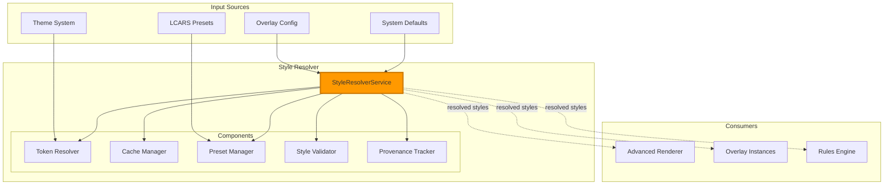
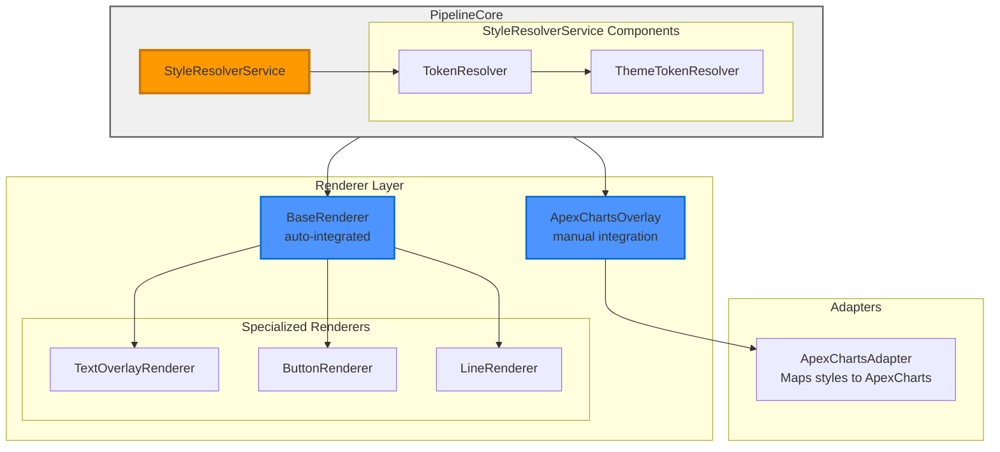
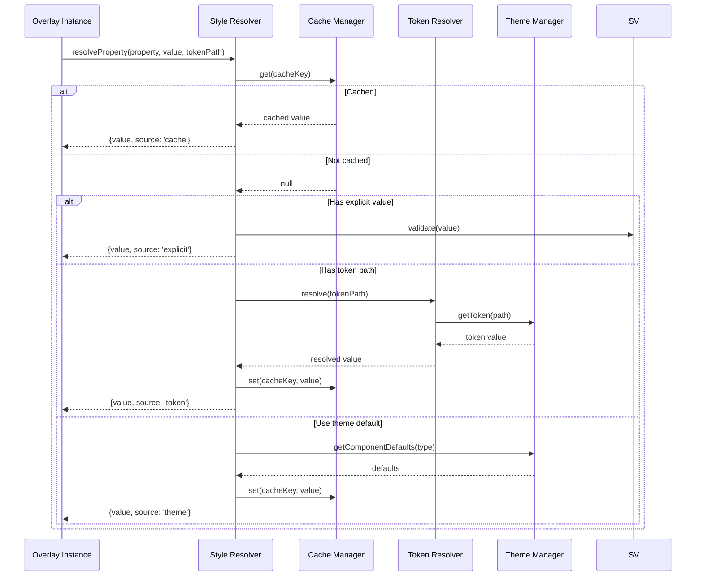

# Style Resolver

> **Centralized style resolution system with theme integration**
> Unified style resolution across all components with intelligent caching, token resolution, and provenance tracking.

---

## 📋 Table of Contents

1. [Overview](#overview)
2. [Architecture](#architecture)
3. [Resolution Priority](#resolution-priority)
4. [Token System](#token-system)
5. [Caching](#caching)
6. [Preset Application](#preset-application)
7. [Configuration](#configuration)
8. [API Reference](#api-reference)
9. [Examples](#examples)
10. [Debugging](#debugging)

---

## Overview

The **Style Resolver** provides centralized style resolution across all MSD components with **singleton theme integration**. It handles token resolution from the singleton ThemeManager, applies intelligent caching for performance, and tracks provenance for debugging.

### Key Features

- ✅ **Multi-tier resolution** - Explicit values, tokens, theme defaults, fallbacks
- ✅ **Singleton theme integration** - Resolve tokens from shared ThemeManager singleton
- ✅ **Multi-Card consistency** - Consistent styling across all cards via shared themes
- ✅ **Token resolution** - Resolve theme tokens using dot notation
- ✅ **Intelligent caching** - Cache resolved values for performance
- ✅ **Preset support** - Apply LCARS style presets
- ✅ **Coordinated theme changes** - Automatic theme change handling across all cards
- ✅ **Provenance tracking** - Track resolution sources for debugging
- ✅ **Validation** - Validate style values

### Integrated Systems

- **ThemeManager Singleton** - Shared token resolution across all cards
- **CacheManager** - Performance optimization
- **PresetManager** - LCARS preset application
- **ProvenanceTracker** - Debugging support
- **StyleValidator** - Value validation

---

## Architecture

### System Integration



### Integration with Renderer Hierarchy



**Integration Points:**

- **PipelineCore** - Creates StyleResolverService during initialization
- **BaseRenderer** - Automatic integration via `this.styleResolver` property
- **TextOverlayRenderer, ButtonRenderer, etc.** - Inherit from BaseRenderer
- **ApexChartsOverlayRenderer** - Manual integration (singleton pattern)
- **ApexChartsAdapter** - Maps resolved styles to ApexCharts options

**Resolution Chain:**

1. **Explicit Value** - Direct value from overlay config (highest priority)
2. **Token Resolution** - Resolve via ThemeTokenResolver
3. **Theme Default** - Component-specific defaults from theme
4. **Preset Value** - From LCARS presets (if applied)
5. **System Fallback** - Hardcoded default (lowest priority)

### Resolution Flow



---

## Resolution Priority

The Style Resolver follows a strict priority chain:

### Priority Chain

```
1. Explicit Value (from overlay config)
   ↓ (if undefined)
2. Token Reference (from theme)
   ↓ (if not found)
3. Theme Component Default
   ↓ (if not found)
4. LCARS Preset Value
   ↓ (if not found)
5. System Fallback
```

### Examples

#### 1. Explicit Value (Highest Priority)

```yaml
overlays:
  - id: temp_display
    type: text
    style:
      color: '#FF0000'    # Explicit - used directly
```

**Result:** `{value: '#FF0000', source: 'explicit'}`

#### 2. Token Reference

```yaml
overlays:
  - id: temp_display
    type: text
    style:
      color: 'colors.accent.primary'    # Token reference
```

**Result:** `{value: '#FF9900', source: 'token_system'}`

#### 3. Theme Default

```yaml
overlays:
  - id: temp_display
    type: text
    style:
      # No color specified - uses theme default
```

**Result:** `{value: '#FFFFFF', source: 'theme_default'}`

#### 4. LCARS Preset

```yaml
overlays:
  - id: control_btn
    type: button
    style:
      lcars_button_preset: 'lozenge'    # Preset applied
      # color not specified - uses preset default
```

**Result:** `{value: '#FF9966', source: 'preset'}`

#### 5. System Fallback

```yaml
overlays:
  - id: unknown
    type: custom
    style:
      # No value, token, theme, or preset available
```

**Result:** `{value: 'transparent', source: 'system_fallback'}`

---

## Token System

### Token Path Format

Tokens use **dot notation** to reference theme values:

```
category.subcategory.property
```

### Token Categories

| Category | Purpose | Examples |
|----------|---------|----------|
| `colors` | Color values | `colors.accent.primary`, `colors.ui.border` |
| `typography` | Font settings | `typography.fontFamily.primary`, `typography.fontSize.xl` |
| `spacing` | Spacing values | `spacing.scale.4`, `spacing.gap.base` |
| `borders` | Border properties | `borders.width.base`, `borders.radius.lg` |
| `effects` | Visual effects | `effects.opacity.muted`, `effects.glow.accent` |
| `animations` | Animation settings | `animations.duration.fast`, `animations.easing.ease` |
| `components` | Component defaults | `components.text.defaultColor` |

### Using Tokens

```yaml
overlays:
  - id: styled_text
    type: text
    position: [100, 100]
    style:
      # Token references
      color: 'colors.accent.primary'
      font_size: 'typography.fontSize.xl'
      font_family: 'typography.fontFamily.primary'

      # Explicit values override tokens
      border_color: '#FF0000'
```

### Token Resolution

The TokenResolver handles token resolution:

```javascript
// Resolve a token path
const value = tokenResolver.resolve('colors.accent.primary');
// Returns: '#FF9900'

// Nested tokens
const fontSize = tokenResolver.resolve('typography.fontSize.xl');
// Returns: '24px'
```

### Token References

Tokens can reference other tokens:

```javascript
// Theme tokens
{
  colors: {
    base: '#FF9900',
    primary: 'colors.base',        // References colors.base
    accent: 'colors.primary'        // References colors.primary (→ colors.base)
  }
}

// Resolution
tokenResolver.resolve('colors.accent');
// Returns: '#FF9900'
```

---

## Caching

### Cache Strategy

The Style Resolver uses intelligent caching to optimize performance:

```javascript
// Cache key generation
const cacheKey = `${property}:${value}:${tokenPath}:${contextHash}`;

// Cache lookup
const cached = cache.get('property', cacheKey);
if (cached) {
  return cached;
}

// Cache storage
cache.set('property', cacheKey, {
  value: resolvedValue,
  source: 'token_system',
  timestamp: Date.now()
});
```

### Cache Invalidation

Cache is automatically invalidated when:

1. **Theme changes** - All caches cleared
2. **Configuration updates** - Affected caches cleared
3. **Cache size limit** - LRU eviction
4. **Manual clear** - Developer-triggered

### Cache Statistics

```javascript
const stats = styleResolver.getCacheStats();
console.log(stats);
// {
//   size: 245,
//   hits: 1234,
//   misses: 156,
//   hitRate: 0.888,
//   tokenResolutions: 89,
//   averageResolutionTime: 0.12
// }
```

### Performance Impact

- **Without cache:** ~0.5-2ms per resolution
- **With cache:** ~0.01ms per resolution
- **Improvement:** 50-200x faster for repeated resolutions

---

## Preset Application

### LCARS Presets

Presets provide predefined style bundles:

```yaml
overlays:
  - id: control_button
    type: button
    style:
      lcars_button_preset: 'lozenge'
      # Preset provides: color, border_radius, padding

      # Override specific properties
      color: '#00FF00'    # Overrides preset color
```

### Available Presets

#### Button Presets

| Preset | Description | Style |
|--------|-------------|-------|
| `lozenge` | Rounded lozenge shape | `border_radius: 20px` |
| `pill` | Full pill shape | `border_radius: 30px` |
| `square` | Sharp corners | `border_radius: 0` |
| `rounded` | Slightly rounded | `border_radius: 8px` |

#### Text Presets

| Preset | Description | Style |
|--------|-------------|-------|
| `heading` | Large heading text | `font_size: 32px, text_transform: uppercase` |
| `label` | Small label text | `font_size: 14px, opacity: 0.8` |
| `value` | Large value display | `font_size: 48px, font_weight: bold` |

### Preset Resolution

```javascript
// Apply preset
const presetStyles = presetManager.apply('lozenge', 'button');
// Returns: {
//   color: '#FF9966',
//   border_radius: 20,
//   padding: '12px 24px'
// }

// Merge with explicit values
const finalStyles = {
  ...presetStyles,
  ...overlay.style    // Explicit values override preset
};
```

---

## Configuration

### Service Configuration

```javascript
const styleResolver = new StyleResolverService(themeManager, {
  // Cache settings
  cacheEnabled: true,
  maxCacheSize: 1000,

  // Debug settings
  debug: false,
  trackProvenance: true,

  // Preset configuration
  presets: {
    button: {
      lozenge: { /* preset styles */ }
    }
  }
});
```

### Theme Integration

```yaml
msd_config:
  theme: lcars-classic    # Active theme

  custom_theme:
    tokens:
      colors:
        primary: '#FF9900'
      typography:
        fontSize:
          xl: '24px'
```

---

## API Reference

### Constructor

```javascript
new StyleResolverService(themeManager, config)
```

**Parameters:**
- `themeManager` (Object) - ThemeManager instance
- `config` (Object) - Configuration options
  - `cacheEnabled` (boolean) - Enable caching (default: true)
  - `maxCacheSize` (number) - Max cache entries (default: 1000)
  - `debug` (boolean) - Enable debug logging (default: false)

### Methods

#### `resolveProperty(options)`

Resolve a single style property.

```javascript
const result = styleResolver.resolveProperty({
  property: 'color',
  value: overlay.style?.color,
  tokenPath: 'colors.primary',
  defaultValue: '#FF9900',
  context: { overlayId: 'my-text', overlayType: 'text' },
  componentType: 'text'
});
```

**Parameters:**
- `options.property` (string) - Property name
- `options.value` (*) - Explicit value from config
- `options.tokenPath` (string) - Token path to resolve
- `options.defaultValue` (*) - Final fallback
- `options.context` (Object) - Resolution context
- `options.componentType` (string) - Component type

**Returns:** Object `{value, source, provenance}`

#### `resolveStyles(overlay, componentType)`

Resolve all styles for an overlay.

```javascript
const styles = styleResolver.resolveStyles(overlay, 'text');
// Returns: {
//   color: {value: '#FF9900', source: 'token'},
//   font_size: {value: '24px', source: 'theme'},
//   ...
// }
```

#### `getCacheStats()`

Get cache statistics.

```javascript
const stats = styleResolver.getCacheStats();
```

**Returns:** Object with cache metrics

#### `clearCache()`

Clear all caches.

```javascript
styleResolver.clearCache();
```

#### `onThemeChange(callback)`

Subscribe to theme changes.

```javascript
const unsubscribe = styleResolver.onThemeChange((themeName, theme) => {
  console.log('Theme changed:', themeName);
});

// Later: unsubscribe()
```

### Properties

| Property | Type | Description |
|----------|------|-------------|
| `themeManager` | ThemeManager | Theme system reference |
| `cache` | CacheManager | Cache manager instance |
| `tokenResolver` | TokenResolver | Token resolution |
| `presetManager` | PresetManager | Preset application |
| `stats` | Object | Resolution statistics |

---

## Examples

### Example 1: Basic Resolution

```javascript
// Resolve color property
const result = styleResolver.resolveProperty({
  property: 'color',
  value: undefined,
  tokenPath: 'colors.accent.primary',
  defaultValue: '#FF9900'
});

console.log(result);
// {
//   value: '#FF9900',
//   source: 'token_system',
//   provenance: {
//     tokenPath: 'colors.accent.primary',
//     resolvedAt: 1234567890
//   }
// }
```

### Example 2: With Explicit Value

```javascript
const result = styleResolver.resolveProperty({
  property: 'color',
  value: '#FF0000',              // Explicit value
  tokenPath: 'colors.primary',   // Ignored (explicit takes priority)
  defaultValue: '#FF9900'
});

console.log(result);
// {
//   value: '#FF0000',
//   source: 'explicit',
//   provenance: { explicit: true }
// }
```

### Example 3: Full Overlay Resolution

```yaml
data_sources:
  temperature:
    type: entity
    entity: sensor.temperature

overlays:
  - id: temp_display
    type: text
    source: temperature
    position: [100, 100]
    style:
      content: "Temperature: {value}°F"
      color: 'colors.accent.primary'
      font_size: 'typography.fontSize.xl'
      font_family: 'typography.fontFamily.primary'
```

**Resolution:**
```javascript
const styles = styleResolver.resolveStyles(overlay, 'text');
// {
//   color: {value: '#FF9900', source: 'token'},
//   font_size: {value: '24px', source: 'token'},
//   font_family: {value: '"Antonio", sans-serif', source: 'token'}
// }
```

---

## Debugging

### Enable Debug Logging

```javascript
styleResolver.config.debug = true;
```

### Browser Console Access

```javascript
// Access StyleResolver
const sr = window.lcards.debug.msd.pipelineInstance.systemsManager.styleResolver;

// Check cache stats
console.log(sr.getCacheStats());

// Resolve property manually
const result = sr.resolveProperty({
  property: 'color',
  tokenPath: 'colors.primary'
});
console.log('Resolved:', result);
```

### Provenance Tracking

```javascript
// Enable provenance tracking
styleResolver.config.trackProvenance = true;

// Check resolution provenance
const result = styleResolver.resolveProperty({
  property: 'color',
  tokenPath: 'colors.accent.primary'
});

console.log('Provenance:', result.provenance);
// {
//   tokenPath: 'colors.accent.primary',
//   resolvedValue: '#FF9900',
//   resolutionTime: 0.12,
//   cacheHit: false,
//   source: 'token_system'
// }
```

### Resolution Sources

Track where each value came from:

```javascript
const styles = styleResolver.resolveStyles(overlay, 'text');

Object.entries(styles).forEach(([prop, result]) => {
  console.log(`${prop}: ${result.value} (${result.source})`);
});
// color: #FF9900 (token_system)
// font_size: 24px (theme_default)
// border_color: transparent (system_fallback)
```

---

## 📚 Related Documentation

- **[Theme System](theme-system.md)** - Theme management
- **[Advanced Renderer](advanced-renderer.md)** - Rendering system
- **[Overlay System](../../user-guide/configuration/overlays/README.md)** - Overlay types

---

**Last Updated:** October 26, 2025
**Version:** 2025.10.1-fuk.42-69
**Source:** `/src/msd/styles/StyleResolverService.js` (565 lines)
**Consolidates:** `user/style-resolution.md` (434 lines), `user/style-resolver-api.md` (181 lines)
