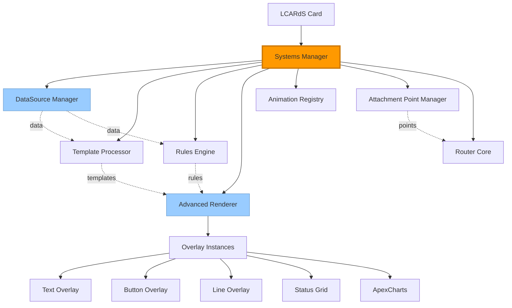
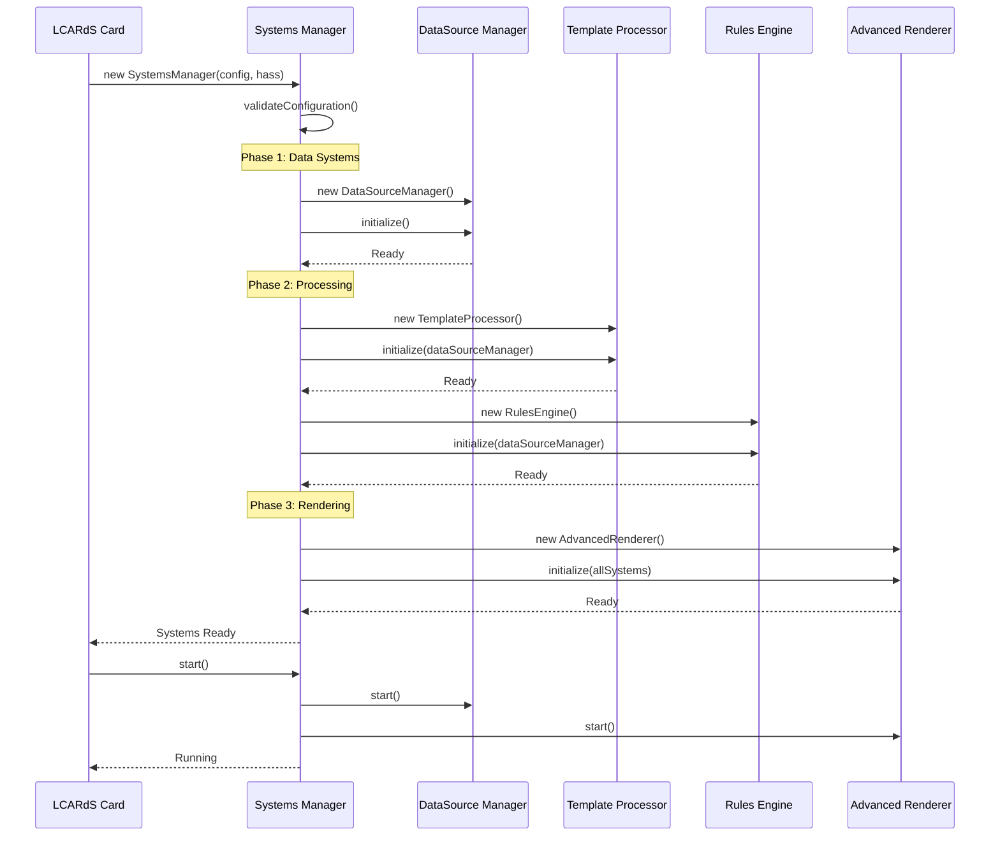

# Systems Manager

> **Central orchestrator for the LCARdS rendering pipeline**
> Manages lifecycle, coordinates subsystems, and provides unified access to all system components.

---

## 📋 Table of Contents

1. [Overview](#overview)
2. [Architecture](#architecture)
3. [Lifecycle Management](#lifecycle-management)
4. [Subsystem Coordination](#subsystem-coordination)
5. [System Access](#system-access)
6. [Configuration](#configuration)
7. [API Reference](#api-reference)
8. [Debugging](#debugging)

---

## Overview

The **SystemsManager** is the central orchestrator that manages the entire LCARdS rendering pipeline. It coordinates all subsystems, manages their lifecycle, and provides a unified interface for accessing system components.

### Responsibilities

- ✅ **Lifecycle management** - Initialize, start, update, and dispose subsystems
- ✅ **Subsystem coordination** - Ensure proper initialization order and dependencies
- ✅ **Unified access** - Single point of access to all system components
- ✅ **Error handling** - Graceful degradation and error recovery
- ✅ **Performance monitoring** - Track system health and performance
- ✅ **Hot reload support** - Handle configuration changes and updates

### Managed Subsystems

The SystemsManager coordinates these key subsystems:

| Subsystem | Purpose | Priority |
|-----------|---------|----------|
| **DataSourceManager** | Entity data processing and buffering | 1 (First) |
| **TemplateProcessor** | Template evaluation and caching | 2 |
| **RulesEngine** | Conditional logic evaluation | 3 |
| **AdvancedRenderer** | Overlay rendering and updates | 4 |
| **AnimationRegistry** | Animation management | 5 |
| **AttachmentPointManager** | Attachment point calculations | 6 |
| **RouterCore** | Path routing calculations | 7 (Last) |

---

## Architecture

### System Hierarchy



### Initialization Flow



---

## Lifecycle Management

### Initialization

The SystemsManager follows a strict initialization sequence:

```javascript
// 1. Construction
const systemsManager = new SystemsManager(config, hass);

// 2. Initialize all subsystems (in order)
await systemsManager.initialize();

// 3. Start active systems
await systemsManager.start();
```

**Initialization phases:**

1. **Validation** - Verify configuration is valid
2. **Data Systems** - Initialize DataSourceManager first
3. **Processing** - Initialize TemplateProcessor and RulesEngine
4. **Rendering** - Initialize AdvancedRenderer and overlay system
5. **Support Systems** - Initialize AnimationRegistry, AttachmentPointManager, RouterCore
6. **Cross-linking** - Connect subsystems with references to each other

### Update Cycle

When configuration changes:

```javascript
// Update with new configuration
await systemsManager.update(newConfig);

// SystemsManager will:
// 1. Diff configuration changes
// 2. Update affected subsystems
// 3. Maintain subscriptions where possible
// 4. Re-render affected overlays
```

### Disposal

Clean shutdown of all systems:

```javascript
// Stop and dispose all subsystems
systemsManager.dispose();

// Automatically:
// 1. Stop all active subscriptions
// 2. Clear data buffers
// 3. Remove event listeners
// 4. Release memory
// 5. Unregister from Home Assistant
```

---

## Subsystem Coordination

### Dependency Management

The SystemsManager ensures subsystems are initialized in the correct order based on dependencies:

```javascript
// Dependency tree
const dependencies = {
  dataSourceManager: [],                    // No dependencies
  templateProcessor: ['dataSourceManager'], // Needs data
  rulesEngine: ['dataSourceManager'],       // Needs data
  advancedRenderer: [                       // Needs everything
    'dataSourceManager',
    'templateProcessor',
    'rulesEngine'
  ]
};
```

### Inter-System Communication

Subsystems communicate through the SystemsManager:

```javascript
// DataSource update triggers rule evaluation
dataSourceManager.on('update', (sourceId) => {
  rulesEngine.markDirty(sourceId);
  rulesEngine.evaluate();
});

// Rule changes trigger rendering updates
rulesEngine.on('rulesChanged', () => {
  advancedRenderer.updateOverlays();
});

// Template changes trigger re-rendering
templateProcessor.on('templateChanged', (templateId) => {
  advancedRenderer.updateOverlaysUsingTemplate(templateId);
});
```

### Error Propagation

Errors in subsystems are caught and handled gracefully:

```javascript
try {
  await dataSourceManager.initialize();
} catch (error) {
  console.error('Failed to initialize DataSourceManager:', error);
  // Continue with degraded functionality
  this.dataSourceManager = null;
}
```

---

## System Access

### Accessing Subsystems

Get references to specific subsystems:

```javascript
// From card instance
const systemsManager = this.systemsManager;

// Access specific subsystems
const dataSourceManager = systemsManager.dataSourceManager;
const advancedRenderer = systemsManager.advancedRenderer;
const rulesEngine = systemsManager.rulesEngine;
```

### Global Debug Access

For debugging, systems are exposed globally:

```javascript
// Access from browser console
window.lcards.debug.msd = {
  pipelineInstance: {
    systemsManager: systemsManager
  }
};

// Access subsystems
const dsm = window.lcards.debug.msd.pipelineInstance.systemsManager.dataSourceManager;
const renderer = window.lcards.debug.msd.pipelineInstance.systemsManager.advancedRenderer;
```

### System State

Check system state:

```javascript
// Check if systems are initialized
if (systemsManager.isInitialized) {
  console.log('Systems ready');
}

// Check if systems are running
if (systemsManager.isRunning) {
  console.log('Systems active');
}

// Get system health
const health = systemsManager.getHealth();
console.log('System health:', health);
```

---

## Configuration

### Basic Configuration

Minimal configuration needed:

```yaml
# SystemsManager is created automatically by the card
# Configuration is passed to subsystems

data_sources:
  # DataSourceManager configuration
  temperature:
    type: entity
    entity: sensor.temperature

overlays:
  # AdvancedRenderer configuration
  - id: temp_display
    type: text
    source: temperature
    position: [100, 100]
```

### Advanced Configuration

Configure subsystem behavior:

```yaml
# Subsystem-specific settings
msd_config:
  # DataSource settings
  data_sources:
    buffer_size: 1000           # Default buffer size
    preload_history: true       # Load historical data
    update_throttle: 100        # Throttle updates (ms)

  # Rendering settings
  renderer:
    incremental_updates: true   # Use incremental rendering
    batch_size: 10              # Batch overlay updates

  # Rules settings
  rules:
    trace_evaluation: false     # Enable rule tracing
    cache_conditions: true      # Cache condition results

  # Performance settings
  performance:
    enable_monitoring: true     # Track performance
    log_slow_operations: true   # Log slow operations
```

---

## API Reference

### Constructor

```javascript
new SystemsManager(config, hass, options)
```

**Parameters:**
- `config` (Object) - Complete MSD configuration
- `hass` (Object) - Home Assistant connection object
- `options` (Object) - Optional settings

**Options:**
```javascript
{
  debug: false,              // Enable debug logging
  enablePerformanceMonitoring: true,
  gracefulDegradation: true  // Continue on subsystem errors
}
```

### Methods

#### `initialize()`

Initialize all subsystems in dependency order.

```javascript
await systemsManager.initialize();
```

**Returns:** Promise\<void\>

#### `start()`

Start active subsystems (DataSource subscriptions, rendering).

```javascript
await systemsManager.start();
```

**Returns:** Promise\<void\>

#### `update(newConfig)`

Update with new configuration.

```javascript
await systemsManager.update(newConfig);
```

**Parameters:**
- `newConfig` (Object) - New MSD configuration

**Returns:** Promise\<void\>

#### `dispose()`

Stop and clean up all subsystems.

```javascript
systemsManager.dispose();
```

**Returns:** void

#### `getSubsystem(name)`

Get reference to a specific subsystem.

```javascript
const dsm = systemsManager.getSubsystem('dataSourceManager');
```

**Parameters:**
- `name` (string) - Subsystem name

**Returns:** Object | null

#### `getHealth()`

Get system health information.

```javascript
const health = systemsManager.getHealth();
// {
//   initialized: true,
//   running: true,
//   subsystems: {
//     dataSourceManager: { status: 'healthy', sources: 5 },
//     advancedRenderer: { status: 'healthy', overlays: 12 },
//     ...
//   }
// }
```

**Returns:** Object

### Properties

| Property | Type | Description |
|----------|------|-------------|
| `isInitialized` | boolean | Whether systems are initialized |
| `isRunning` | boolean | Whether systems are running |
| `config` | Object | Current configuration |
| `hass` | Object | Home Assistant connection |
| `dataSourceManager` | DataSourceManager | DataSource subsystem |
| `templateProcessor` | TemplateProcessor | Template subsystem |
| `rulesEngine` | RulesEngine | Rules subsystem |
| `advancedRenderer` | AdvancedRenderer | Renderer subsystem |
| `animationRegistry` | AnimationRegistry | Animation subsystem |

---

## Debugging

### Browser Console Access

```javascript
// Access SystemsManager
const sm = window.lcards.debug.msd.pipelineInstance.systemsManager;

// Check initialization status
console.log('Initialized:', sm.isInitialized);
console.log('Running:', sm.isRunning);

// Get subsystems
const dsm = sm.dataSourceManager;
const renderer = sm.advancedRenderer;
const rules = sm.rulesEngine;

// Check subsystem status
console.log('DataSources:', dsm.getAllSources().length);
console.log('Overlays:', renderer.getAllOverlays().length);
console.log('Rules:', rules.getAllRules().length);
```

### System Health Check

```javascript
const health = sm.getHealth();

// Check overall status
if (health.initialized && health.running) {
  console.log('✅ Systems healthy');
} else {
  console.log('❌ System issues detected');
}

// Check subsystem details
Object.entries(health.subsystems).forEach(([name, status]) => {
  console.log(`${name}: ${status.status}`);
});
```

### Performance Monitoring

```javascript
// Enable performance monitoring
sm.setOption('enablePerformanceMonitoring', true);

// Get performance metrics
const metrics = sm.getPerformanceMetrics();
console.log('Metrics:', metrics);
// {
//   initializationTime: 150,
//   updateCycles: 42,
//   averageUpdateTime: 8.5,
//   slowOperations: [...]
// }
```

### Troubleshooting

**Systems not initializing:**

```javascript
// Check for initialization errors
const initErrors = sm.getInitializationErrors();
console.log('Init errors:', initErrors);

// Try re-initializing specific subsystem
await sm.reinitializeSubsystem('dataSourceManager');
```

**Systems not updating:**

```javascript
// Check if systems are running
console.log('Running:', sm.isRunning);

// Check if subsystems are active
console.log('DataSources active:', sm.dataSourceManager?.isActive);
console.log('Renderer active:', sm.advancedRenderer?.isActive);

// Manually trigger update
await sm.forceUpdate();
```

---

## 📚 Related Documentation

### Subsystems
- **[DataSource Manager](datasource-system.md)** - Data processing hub
- **[Advanced Renderer](advanced-renderer.md)** - Overlay rendering engine
- **[Rules Engine](rules-engine.md)** - Conditional logic system
- **[Template Processor](template-processor.md)** - Template evaluation
- **[Animation Registry](animation-registry.md)** - Animation management

### Architecture
- **[Architecture Overview](../overview.md)** - System architecture
- **[Pipeline Architecture](../implementation-details/pipeline-architecture.md)** - Data pipeline

---

**Last Updated:** October 26, 2025
**Version:** 2025.10.1-fuk.42-69
