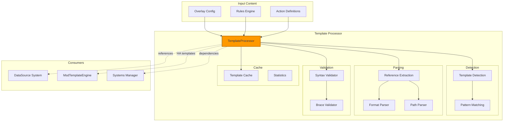
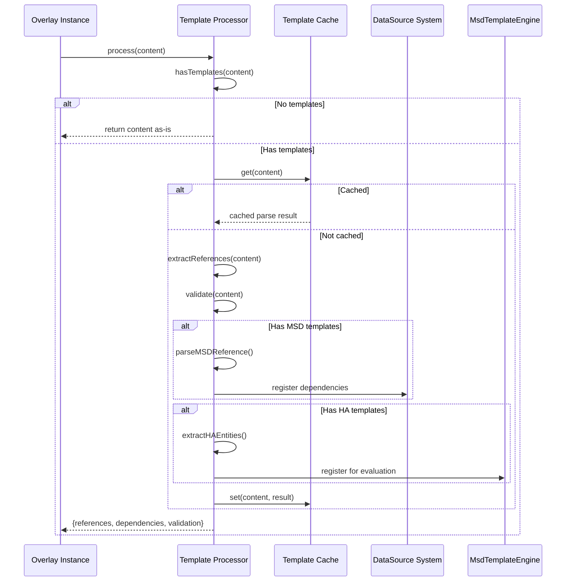

# Template Processor

> **Unified template processing system**
> Centralized detection, parsing, and validation for MSD and Home Assistant templates.

---

## 📋 Table of Contents

1. [Overview](#overview)
2. [Architecture](#architecture)
3. [Template Types](#template-types)
4. [Reference Extraction](#reference-extraction)
5. [Entity Dependencies](#entity-dependencies)
6. [Template Validation](#template-validation)
7. [Caching](#caching)
8. [Configuration](#configuration)
9. [API Reference](#api-reference)
10. [Examples](#examples)
11. [Debugging](#debugging)

---

## Overview

The **Template Processor** provides unified template processing across all MSD components. It detects, parses, and validates both MSD DataSource templates and Home Assistant templates, enabling dynamic content throughout the system.

### Key Features

- ✅ **Dual template support** - MSD `{...}` and Home Assistant `{{...}}` templates
- ✅ **Reference extraction** - Extract DataSource and entity dependencies
- ✅ **Format specification** - Parse format strings (`:format`)
- ✅ **Entity tracking** - Automatic dependency detection for subscriptions
- ✅ **Template validation** - Syntax validation and error detection
- ✅ **Performance caching** - Cache parsed templates for efficiency
- ✅ **Path analysis** - Detect transformations, aggregations, value paths

### Responsibilities

**Template Processor handles:**
- Template detection and identification
- Reference extraction for subscriptions
- Format specification parsing
- Entity dependency tracking
- Template syntax validation
- Template caching

**Does NOT handle:**
- HA template evaluation (delegated to `MsdTemplateEngine`)
- Action context templates (handled by `ActionHelpers`)
- Actual value resolution (delegated to DataSource system)

---

## Architecture

### Two-Layer Template System

LCARdS uses **two complementary template systems** that work together:

**Layer 1: TemplateProcessor (Detection & Parsing)**
- Detects both MSD and HA templates
- Parses template syntax and format specifications
- Extracts references and entity dependencies
- **Does NOT evaluate templates**

**Layer 2: MsdTemplateEngine (HA Template Execution)**
- Evaluates Home Assistant `{{...}}` templates
- Executes HA template functions (`states()`, `state_attr()`)
- Applies filters and formatting (`| round(2)`)
- Manages entity subscriptions
- **Does NOT handle MSD templates**

**Why Both Are Needed:**

```
Input: "Temp: {cpu_temp:.1f}°C, Door: {{states('binary_sensor.door')}}"
         ↓
TemplateProcessor (Detection)
├─ Detects MSD template: {cpu_temp:.1f}
└─ Detects HA template: {{states('binary_sensor.door')}}
         ↓
DataSourceMixin (Orchestration)
├─ MSD template → DataSource resolution: "75.3°C"
└─ HA template → MsdTemplateEngine evaluation: "open"
         ↓
Result: "Temp: 75.3°C, Door: open"
```

**Division of Responsibilities:**

| System | Detection | Parsing | Evaluation |
|--------|-----------|---------|------------|
| **TemplateProcessor** | ✅ Both | ✅ Both | ❌ Neither |
| **MsdTemplateEngine** | ❌ Neither | ❌ Neither | ✅ HA only |
| **DataSourceMixin** | ❌ Neither | ❌ Neither | ✅ MSD only |

### System Integration



### Processing Flow



---

## Template Types

### MSD DataSource Templates

MSD templates use **single braces** `{...}` to reference DataSource values:

```yaml
# Basic DataSource reference
content: "{temperature}"

# DataSource with path
content: "{cpu.temperature}"

# DataSource with format
content: "{temperature:.1f}°F"

# DataSource path with format
content: "{sensor.value:.2f}"
```

**Syntax:**
```
{data_source}                    # Simple reference
{data_source.path}              # Dot-notation path
{data_source:format}            # With format specification
{data_source.path:format}       # Path + format
```

### Home Assistant Templates

HA templates use **double braces** `{{...}}` for Home Assistant entity access:

```yaml
# Basic entity state
content: "{{states('sensor.temperature')}}"

# Entity attribute
content: "{{state_attr('climate.house', 'hvac_action')}}"

# With formatting
content: "{{states('sensor.temp') | float | round(1)}}"

# Conditional logic
content: "{{states('sensor.temp') | float > 25 and 'HOT' or 'OK'}}"
```

**Supported HA Functions:**
- `states('entity_id')` - Get entity state
- `state_attr('entity_id', 'attribute')` - Get attribute value
- `is_state('entity_id', 'state')` - Check state equality
- `has_value('entity_id')` - Check if entity has value

**Supported Filters:**
- `|float` - Convert to float
- `|round(n)` - Round to n decimal places
- `|upper` - Convert to uppercase
- `|lower` - Convert to lowercase
- `|title` - Title case
- `|unit('X')` - Append unit

### Mixed Templates

Both template types can coexist in the same content:

```yaml
content: |
  Inside: {{states('sensor.indoor_temp') | float | round(1)}}°C
  Outside: {outdoor_temp:.1f}°C
  System: {cpu_temp.v:.1f}°C
```

**Processing Order:**
1. HA templates `{{...}}` evaluated first
2. MSD templates `{...}` evaluated second
3. Results merged into final content

---

## Reference Extraction

### Extract All References

The Template Processor extracts all template references from content:

```javascript
const content = "{cpu_temp.v:.1f} and {{states('sensor.temp')}}";
const refs = TemplateProcessor.extractReferences(content);

console.log(refs);
// [
//   {
//     type: 'msd',
//     reference: 'cpu_temp.v:.1f',
//     dataSource: 'cpu_temp',
//     path: 'v',
//     pathType: 'value',
//     format: '.1f'
//   },
//   {
//     type: 'ha',
//     reference: "states('sensor.temp')",
//     expression: "states('sensor.temp')"
//   }
// ]
```

### MSD Reference Parsing

MSD references are parsed into components:

```javascript
// Parse: {cpu_temp.transformations.fahrenheit:.1f}
const parsed = TemplateProcessor._parseMSDReference('cpu_temp.transformations.fahrenheit:.1f');

console.log(parsed);
// {
//   dataSource: 'cpu_temp',
//   path: 'transformations.fahrenheit',
//   pathType: 'transformation',
//   format: '.1f'
// }
```

### Path Types

The processor detects different path types:

| Path Type | Detection | Example |
|-----------|-----------|---------|
| `value` | Simple reference | `{cpu_temp}`, `{sensor.value}` |
| `transformation` | Contains `transformations.` | `{temp.transformations.fahrenheit}` |
| `aggregation` | Contains `aggregations.` | `{sensor.aggregations.avg_5m}` |

---

## Entity Dependencies

### Extract Dependencies

The processor extracts all entity/DataSource dependencies:

```javascript
const content = `
  Temperature: {indoor_temp:.1f}°F
  Humidity: {{states('sensor.humidity')}}%
  CPU: {cpu_temp.v}
`;

const deps = TemplateProcessor.extractEntityDependencies(content);
console.log(deps);
// ['indoor_temp', 'cpu_temp', 'sensor.humidity']
```

### MSD Dependencies

For MSD templates, dependencies are DataSource names:

```javascript
const content = "{cpu_temp.v} {memory.used} {disk.free}";
const deps = TemplateProcessor.extractEntityDependencies(content);
// Returns: ['cpu_temp', 'memory', 'disk']
```

### HA Dependencies

For HA templates, dependencies are entity IDs:

```javascript
const content = "{{states('sensor.temp')}} {{state_attr('climate.hvac', 'action')}}";
const deps = TemplateProcessor.extractEntityDependencies(content);
// Returns: ['sensor.temp', 'climate.hvac']
```

### Subscription Registration

Dependencies are used to register for updates:

```javascript
// Extract dependencies
const deps = TemplateProcessor.extractEntityDependencies(overlay.content);

// Register subscriptions
deps.forEach(dep => {
  systemsManager.subscribe(overlayId, dep, (value) => {
    // Re-render overlay when dependency updates
    overlay.render();
  });
});
```

---

## Template Validation

### Syntax Validation

Validate template syntax before processing:

```javascript
const validation = TemplateProcessor.validate(content);

if (!validation.valid) {
  console.error('Template errors:', validation.errors);
}
```

### Validation Checks

1. **Brace Matching** - Equal opening/closing braces
2. **Template Nesting** - No nested templates
3. **Syntax Errors** - Malformed references

### Examples

#### Valid Templates

```javascript
TemplateProcessor.validate("{temperature}");
// {valid: true, errors: []}

TemplateProcessor.validate("{{states('sensor.temp')}}");
// {valid: true, errors: []}

TemplateProcessor.validate("{temp} and {{states('sensor.temp')}}");
// {valid: true, errors: []}
```

#### Invalid Templates

```javascript
// Unmatched braces
TemplateProcessor.validate("{temperature");
// {
//   valid: false,
//   errors: ["Unmatched braces: 1 opening '{' vs 0 closing '}'"]
// }

// Unmatched HA braces
TemplateProcessor.validate("{{states('sensor.temp')");
// {
//   valid: false,
//   errors: ["Unmatched HA template braces: 1 opening '{{' vs 0 closing '}}'"]
// }

// Nested templates (not supported)
TemplateProcessor.validate("{{states('{entity}')}}");
// {
//   valid: false,
//   errors: ["Nested templates are not supported"]
// }
```

---

## Caching

### Cache Strategy

The Template Processor caches parsed templates for performance:

```javascript
// First parse - cache miss
const refs1 = TemplateProcessor.extractReferences(content);
// Parses and caches result

// Second parse - cache hit
const refs2 = TemplateProcessor.extractReferences(content);
// Returns cached result (much faster)
```

### Cache Statistics

```javascript
const stats = TemplateProcessor.getCacheStats();
console.log(stats);
// {
//   cacheHits: 245,
//   cacheMisses: 23,
//   templatesProcessed: 268,
//   cacheSize: 23,
//   hitRate: 0.914,
//   lastReset: 1234567890
// }
```

### Cache Management

```javascript
// Clear cache manually
TemplateProcessor.clearCache();

// Cache is also cleared on:
// - Theme changes
// - Configuration updates
// - Manual reset
```

### Performance Impact

- **Without cache:** ~0.1-0.5ms per parse
- **With cache:** ~0.001ms per lookup
- **Improvement:** 100-500x faster for repeated templates

---

## Configuration

### Debug Mode

Enable debug logging for template processing:

```javascript
// Enable debug mode
TemplateProcessor.setDebugMode(true);

// Disable debug mode
TemplateProcessor.setDebugMode(false);
```

### Cache Configuration

Cache is enabled by default with automatic management:

```javascript
// Cache is managed internally
// No configuration needed for most use cases

// For advanced control:
const stats = TemplateProcessor.getCacheStats();
if (stats.cacheSize > 1000) {
  TemplateProcessor.clearCache();
}
```

---

## API Reference

### Static Methods

#### `hasTemplates(content)`

Check if content contains any templates.

```javascript
TemplateProcessor.hasTemplates('{temperature}')  // true
TemplateProcessor.hasTemplates('{{states("sensor.temp")}}')  // true
TemplateProcessor.hasTemplates('Plain text')  // false
```

**Parameters:**
- `content` (string) - Content to check

**Returns:** boolean

#### `hasMSDTemplates(content)`

Check if content has MSD templates specifically.

```javascript
TemplateProcessor.hasMSDTemplates('{temperature}')  // true
TemplateProcessor.hasMSDTemplates('{{states("sensor.temp")}}')  // false
```

**Parameters:**
- `content` (string) - Content to check

**Returns:** boolean

#### `hasHATemplates(content)`

Check if content has HA templates specifically.

```javascript
TemplateProcessor.hasHATemplates('{{states("sensor.temp")}}')  // true
TemplateProcessor.hasHATemplates('{temperature}')  // false
```

**Parameters:**
- `content` (string) - Content to check

**Returns:** boolean

#### `extractReferences(content)`

Extract all template references from content.

```javascript
const refs = TemplateProcessor.extractReferences('{cpu_temp.v:.1f}');
// Returns array of reference objects
```

**Parameters:**
- `content` (string) - Content to parse

**Returns:** Array<Object> - Reference objects with:
- `type` ('msd' | 'ha') - Template type
- `reference` (string) - Full reference string
- `dataSource` (string) - DataSource name (MSD only)
- `path` (string) - Dot-notation path (MSD only)
- `pathType` (string) - Path type: 'value' | 'transformation' | 'aggregation'
- `format` (string) - Format specification (MSD only)
- `expression` (string) - HA expression (HA only)

#### `extractEntityDependencies(content)`

Extract all entity/DataSource dependencies.

```javascript
const deps = TemplateProcessor.extractEntityDependencies(
  '{cpu_temp} and {{states("sensor.temp")}}'
);
// Returns: ['cpu_temp', 'sensor.temp']
```

**Parameters:**
- `content` (string) - Content to analyze

**Returns:** Array<string> - Entity/DataSource IDs

#### `validate(content)`

Validate template syntax.

```javascript
const result = TemplateProcessor.validate(content);
// Returns: {valid: boolean, errors: Array<string>}
```

**Parameters:**
- `content` (string) - Content to validate

**Returns:** Object `{valid, errors}`

#### `getCacheStats()`

Get cache statistics.

```javascript
const stats = TemplateProcessor.getCacheStats();
```

**Returns:** Object with:
- `cacheHits` (number) - Cache hit count
- `cacheMisses` (number) - Cache miss count
- `templatesProcessed` (number) - Total templates processed
- `cacheSize` (number) - Current cache size
- `hitRate` (number) - Cache hit rate (0-1)
- `lastReset` (timestamp) - Last cache reset time

#### `clearCache()`

Clear template cache.

```javascript
TemplateProcessor.clearCache();
```

#### `setDebugMode(enabled)`

Enable/disable debug logging.

```javascript
TemplateProcessor.setDebugMode(true);
```

**Parameters:**
- `enabled` (boolean) - Enable debug mode

---

## Examples

### Example 1: Basic MSD Template

```yaml
overlays:
  - id: temp_display
    type: text
    position: [100, 100]
    content: "Temperature: {indoor_temp:.1f}°F"
```

**Processing:**
```javascript
const content = "Temperature: {indoor_temp:.1f}°F";

// Detect templates
TemplateProcessor.hasTemplates(content);  // true
TemplateProcessor.hasMSDTemplates(content);  // true

// Extract references
const refs = TemplateProcessor.extractReferences(content);
// [{
//   type: 'msd',
//   reference: 'indoor_temp:.1f',
//   dataSource: 'indoor_temp',
//   path: null,
//   pathType: 'value',
//   format: '.1f'
// }]

// Extract dependencies
const deps = TemplateProcessor.extractEntityDependencies(content);
// ['indoor_temp']
```

### Example 2: HA Template

```yaml
overlays:
  - id: ha_temp
    type: text
    position: [100, 100]
    content: "Temp: {{states('sensor.temperature') | float | round(1)}}°C"
```

**Processing:**
```javascript
const content = "Temp: {{states('sensor.temperature') | float | round(1)}}°C";

// Detect templates
TemplateProcessor.hasHATemplates(content);  // true

// Extract references
const refs = TemplateProcessor.extractReferences(content);
// [{
//   type: 'ha',
//   reference: "states('sensor.temperature') | float | round(1)",
//   expression: "states('sensor.temperature') | float | round(1)"
// }]

// Extract dependencies
const deps = TemplateProcessor.extractEntityDependencies(content);
// ['sensor.temperature']
```

### Example 3: Mixed Templates

```yaml
overlays:
  - id: mixed_display
    type: text
    position: [100, 100]
    content: |
      Inside: {{states('sensor.indoor_temp') | float | round(1)}}°C
      Outside: {outdoor_temp:.1f}°C
      CPU: {cpu_temp.v:.1f}°C
```

**Processing:**
```javascript
const content = `
  Inside: {{states('sensor.indoor_temp') | float | round(1)}}°C
  Outside: {outdoor_temp:.1f}°C
  CPU: {cpu_temp.v:.1f}°C
`;

// Detect both types
TemplateProcessor.hasHATemplates(content);  // true
TemplateProcessor.hasMSDTemplates(content);  // true

// Extract all dependencies
const deps = TemplateProcessor.extractEntityDependencies(content);
// ['outdoor_temp', 'cpu_temp', 'sensor.indoor_temp']
```

### Example 4: Transformation Path

```yaml
data_sources:
  temperature:
    type: entity
    entity: sensor.temperature_celsius
    transformations:
      fahrenheit:
        type: formula
        expression: "value * 9/5 + 32"

overlays:
  - id: temp_f
    type: text
    content: "{temperature.transformations.fahrenheit:.1f}°F"
```

**Processing:**
```javascript
const content = "{temperature.transformations.fahrenheit:.1f}°F";

const refs = TemplateProcessor.extractReferences(content);
// [{
//   type: 'msd',
//   reference: 'temperature.transformations.fahrenheit:.1f',
//   dataSource: 'temperature',
//   path: 'transformations.fahrenheit',
//   pathType: 'transformation',
//   format: '.1f'
// }]
```

---

## Debugging

### Browser Console Access

```javascript
// Access Template Processor
const tp = window.__templateProcessor;

// Test template detection
tp.hasTemplates('{temperature}');

// Extract references
const refs = tp.extractReferences('{cpu_temp.v:.1f}');
console.log('References:', refs);

// Check dependencies
const deps = tp.extractEntityDependencies('{{states("sensor.temp")}}');
console.log('Dependencies:', deps);

// Validate syntax
const validation = tp.validate(content);
console.log('Validation:', validation);

// Check cache stats
const stats = tp.getCacheStats();
console.log('Cache stats:', stats);
```

### Debug Mode

```javascript
// Enable detailed logging
TemplateProcessor.setDebugMode(true);

// Process templates with logging
const refs = TemplateProcessor.extractReferences(content);
// Logs: [TemplateProcessor] Extracting references from: ...
//       [TemplateProcessor] Found 3 MSD references, 1 HA reference
```

### Common Issues

#### Template Not Detected

```javascript
// Check template markers
const content = "Temperature: {temp}";
console.log('Has templates:', TemplateProcessor.hasTemplates(content));
// If false, check for typos in braces
```

#### Missing Dependencies

```javascript
// Verify dependency extraction
const deps = TemplateProcessor.extractEntityDependencies(content);
console.log('Dependencies:', deps);
// Should include all DataSource/entity IDs
```

#### Validation Errors

```javascript
// Check for syntax errors
const validation = TemplateProcessor.validate(content);
if (!validation.valid) {
  console.error('Template errors:', validation.errors);
  // Fix: Ensure braces are matched
}
```

---

## 📚 Related Documentation

- **[DataSource System](../../user-guide/configuration/datasources/README.md)** - MSD DataSource reference
- **[Home Assistant Templates](../../user/home_assistant_templates.md)** - HA template syntax
- **[Text Overlay](../../user-guide/configuration/overlays/text-overlay.md)** - Template usage in text overlays
- **[Systems Manager](systems-manager.md)** - System orchestration

---

**Last Updated:** October 26, 2025
**Version:** 2025.10.1-fuk.42-69
**Source:** `/src/msd/utils/TemplateProcessor.js` (369 lines)
**Consolidates:** `user/home_assistant_templates.md` (150 lines)
