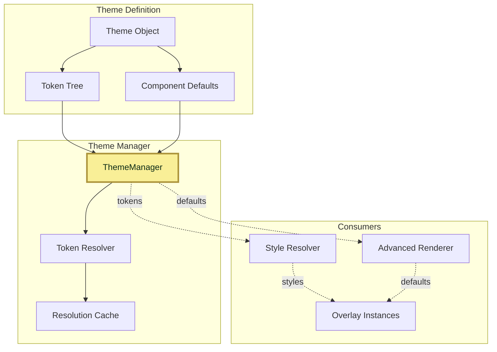
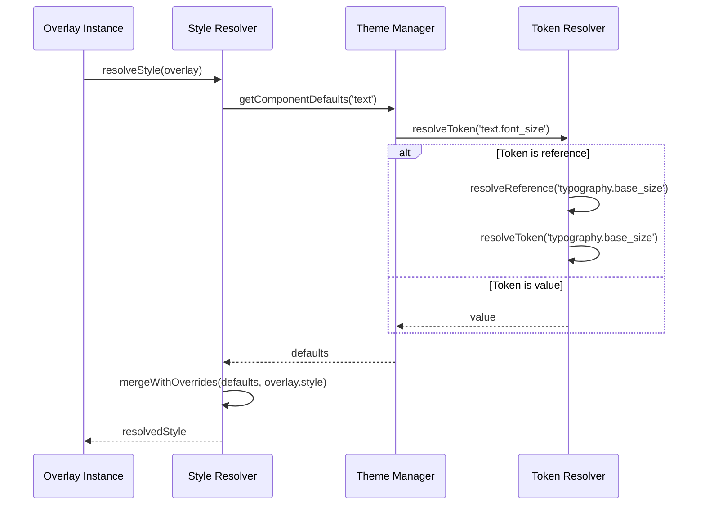

# Theme System (Singleton)

> **Shared theming intelligence across all MSD cards**
> Singleton ThemeManager provides consistent token-based themes, component defaults, and coordinated styling across multiple cards.

---

## 📋 Table of Contents

1. [Overview](#overview)
2. [Architecture](#architecture)
3. [Theme Structure](#theme-structure)
4. [Token System](#token-system)
5. [Component Defaults](#component-defaults)
6. [Theme Selection](#theme-selection)
7. [Custom Themes](#custom-themes)
8. [API Reference](#api-reference)
9. [Examples](#examples)

---

## Overview

The **Theme System** is a **singleton service** that provides unified theming across all MSD cards through a token-based architecture. The ThemeManager singleton ensures consistent styling, coordinated theme changes, and shared component defaults across multiple cards.

### Key Features

- 🌐 **Singleton Architecture** - Single theme manager serves all MSD cards
- ✅ **Multi-Card Consistency** - Theme changes instantly apply to all cards
- ✅ **Token-based defaults** - All values defined in shared theme tokens
- ✅ **Token references** - Tokens can reference other tokens across cards
- ✅ **Component scoping** - Dedicated defaults for each overlay type
- ✅ **Multiple themes** - Built-in themes + custom theme support
- ✅ **Hot-swappable** - Change entire look across all cards with one setting
- ✅ **Cross-Card Theming** - Consistent theming for overlays targeting other cards
- ✅ **Type-safe** - Schema validation for theme tokens
- ✅ **ApexCharts integration** - Custom CSS for chart styling

### Built-in Themes

| Theme | Description | Style |
|-------|-------------|-------|
| **lcars-classic** | TNG-era LCARS | Classic orange/blue |
| **lcars-modern** | Contemporary LCARS | Refined palette |
| **lcars-dark** | Dark mode variant | Muted colors |
| **lcars-voyager** | VOY-era LCARS | Teal accents |

---

## Architecture

### System Integration



### Token Resolution Flow



---

## Theme Structure

### Complete Theme Definition

```javascript
const theme = {
  // Theme metadata
  id: 'lcars-classic',
  name: 'LCARS Classic',
  description: 'Classic TNG-era LCARS styling',

  // Optional: Custom ApexCharts CSS
  cssFile: 'apexcharts-lcars-classic.css',

  // Theme tokens (all values)
  tokens: {
    // Base design tokens
    colors: {
      primary: '#ff9900',
      secondary: '#9999ff',
      accent: '#cc6699',
      text: '#ffffff',
      background: '#000000',

      // Semantic colors
      success: '#99cc99',
      warning: '#ffcc99',
      error: '#ff6666',
      info: '#99ccff'
    },

    typography: {
      base_size: '16px',
      heading_size: '24px',
      label_size: '14px',
      font_family: '"Antonio", sans-serif'
    },

    spacing: {
      xs: 4,
      sm: 8,
      md: 16,
      lg: 24,
      xl: 32
    },

    // Component-specific defaults
    text: {
      font_size: 'typography.base_size',      // Token reference
      color: 'colors.text',                   // Token reference
      font_family: 'typography.font_family',
      text_transform: 'none'
    },

    button: {
      font_size: 'typography.base_size',
      color: 'colors.primary',
      text_color: 'colors.background',
      border_radius: 8
    },

    line: {
      color: 'colors.primary',
      thickness: 2
    },

    control: {
      background: 'colors.background',
      border_radius: 4
    }
  }
};
```

### Minimal Theme

```javascript
const minimalTheme = {
  id: 'my-theme',
  name: 'My Theme',

  tokens: {
    colors: {
      primary: '#ff0000',
      text: '#ffffff'
    },

    // Inherit other defaults from base theme
  }
};
```

---

## Token System

### Token References

Tokens can reference other tokens using dot notation:

```javascript
tokens: {
  colors: {
    primary: '#ff9900',
    accent: 'colors.primary'     // Reference to colors.primary
  },

  text: {
    color: 'colors.primary',     // Resolved to #ff9900
    font_size: 'typography.base_size'
  }
}
```

### Token Resolution

The ThemeManager resolves token references automatically:

```javascript
// Configuration
tokens: {
  colors: {
    primary: '#ff9900'
  },
  text: {
    color: 'colors.primary'
  }
}

// Resolution
const textColor = themeManager.resolveToken('text.color');
// Returns: '#ff9900'
```

### Nested References

```javascript
tokens: {
  colors: {
    base: '#ff9900',
    primary: 'colors.base',
    accent: 'colors.primary'     // Resolves through primary to base
  }
}

const accent = themeManager.resolveToken('colors.accent');
// Returns: '#ff9900'
```

### Computed Values

Some tokens can use computed values:

```javascript
tokens: {
  spacing: {
    base: 16,
    double: '{{ spacing.base * 2 }}',    // Computed: 32
    half: '{{ spacing.base / 2 }}'       // Computed: 8
  }
}
```

---

## Component Defaults

### Accessing Component Defaults

```javascript
// Get all defaults for a component
const textDefaults = themeManager.getComponentDefaults('text');
// {
//   font_size: '16px',
//   color: '#ffffff',
//   font_family: '"Antonio", sans-serif',
//   text_transform: 'none'
// }
```

### Overlay Type Defaults

Each overlay type has dedicated defaults:

#### Line Overlay

```javascript
tokens: {
  line: {
    color: '#ff9900',
    thickness: 2,
    line_cap: 'round'
  }
}
```

#### Control Overlay

```javascript
tokens: {
  control: {
    background: 'transparent',
    border_radius: 4,
    padding: '8px'
  }
}
```

---

## Theme Selection

### In Configuration

```yaml
msd_config:
  theme: lcars-classic           # Built-in theme

  # OR use custom theme
  custom_theme:
    id: my-theme
    name: "My Custom Theme"
    tokens:
      colors:
        primary: '#ff0000'
      # ... more tokens
```

### Via ThemeManager

```javascript
// Switch theme at runtime
themeManager.setTheme('lcars-voyager');

// Or set custom theme
themeManager.setCustomTheme(customThemeObject);
```

### Theme Priority

```
1. Overlay explicit style (highest)
2. Rule-applied style
3. Profile style
4. Theme component defaults
5. Global fallback defaults (lowest)
```

---

## Custom Themes

### Creating a Custom Theme

```javascript
const customTheme = {
  id: 'enterprise-d',
  name: 'Enterprise-D',
  description: 'Galaxy-class starship styling',

  // Optional: Link to custom ApexCharts CSS
  cssFile: 'apexcharts-enterprise-d.css',

  tokens: {
    // Define your color scheme
    colors: {
      primary: '#ff9966',
      secondary: '#6699ff',
      accent: '#cc99ff',
      text: '#ffffff',
      background: '#000000',

      // Alert colors
      success: '#99ff99',
      warning: '#ffcc66',
      error: '#ff6666',
      info: '#99ccff'
    },

    // Typography
    typography: {
      base_size: '18px',
      heading_size: '28px',
      font_family: '"Swiss911", "Arial", sans-serif'
    },

    // Spacing system
    spacing: {
      xs: 4,
      sm: 8,
      md: 16,
      lg: 24,
      xl: 32
    },

    // Component defaults
    text: {
      font_size: 'typography.base_size',
      color: 'colors.text',
      font_family: 'typography.font_family'
    },

    button: {
      font_size: 'typography.base_size',
      color: 'colors.primary',
      text_color: 'colors.background',
      border_radius: 12
    },

    line: {
      color: 'colors.primary',
      thickness: 3
    }
  }
};
```

### Using Custom Theme

```yaml
msd_config:
  custom_theme:
    id: enterprise-d
    name: "Enterprise-D"
    tokens:
      colors:
        primary: '#ff9966'
        secondary: '#6699ff'
      typography:
        base_size: '18px'
      text:
        font_size: 'typography.base_size'
        color: 'colors.text'
```

### Custom ApexCharts Styling

Create a CSS file for chart styling:

```css
/* apexcharts-enterprise-d.css */
.apexcharts-canvas {
  background: transparent;
}

.apexcharts-gridline {
  stroke: #6699ff;
  stroke-opacity: 0.3;
}

.apexcharts-tooltip {
  background: #1a1a2e !important;
  border: 2px solid #ff9966 !important;
  color: #ffffff !important;
}
```

Reference in theme:

```javascript
{
  id: 'enterprise-d',
  cssFile: 'apexcharts-enterprise-d.css',
  tokens: { /* ... */ }
}
```

---

## API Reference

### ThemeManager

#### Constructor

```javascript
new ThemeManager(themes, defaultThemeId)
```

**Parameters:**
- `themes` (Array) - Available themes
- `defaultThemeId` (string) - Default theme ID

#### Methods

##### `setTheme(themeId)`

Switch to a different theme.

```javascript
themeManager.setTheme('lcars-voyager');
```

**Parameters:**
- `themeId` (string) - Theme identifier

##### `setCustomTheme(themeObject)`

Set a custom theme.

```javascript
themeManager.setCustomTheme(customTheme);
```

**Parameters:**
- `themeObject` (Object) - Theme definition

##### `getCurrentTheme()`

Get current theme object.

```javascript
const theme = themeManager.getCurrentTheme();
```

**Returns:** Object

##### `resolveToken(path)`

Resolve a token value by path.

```javascript
const fontSize = themeManager.resolveToken('text.font_size');
```

**Parameters:**
- `path` (string) - Dot-notation path

**Returns:** any

##### `getComponentDefaults(componentType)`

Get default values for a component type.

```javascript
const defaults = themeManager.getComponentDefaults('text');
```

**Parameters:**
- `componentType` (string) - Component type (text, button, line, etc.)

**Returns:** Object

##### `getAllThemes()`

Get list of all available themes.

```javascript
const themes = themeManager.getAllThemes();
// [
//   { id: 'lcars-classic', name: 'LCARS Classic' },
//   { id: 'lcars-modern', name: 'LCARS Modern' },
//   ...
// ]
```

**Returns:** Array

---

## Examples

### Example 1: Using Theme Defaults

```yaml
# Overlays automatically use theme defaults
overlays:
  - id: power_line
    type: line
    attach_start: anchor1.middle-right
    attach_end: anchor2.middle-left
    style:
      # color, stroke_width from theme
      marker_end: arrow

  - id: control_panel
    type: control
    position: [50, 100]
    size: [200, 120]
    card:
      type: custom:lcards-button-card
      entity: light.main
      # Card styling uses theme tokens
```

### Example 2: Overriding Theme Defaults

```yaml
overlays:
  - id: alert_line
    type: line
    points: [[50, 50], [200, 50]]
    style:
      color: var(--lcars-red)      # Override theme default
      stroke_width: 4              # Override theme default
```

### Example 3: Custom Theme

```yaml
msd_config:
  custom_theme:
    id: my-theme
    name: "My Custom Theme"

    tokens:
      colors:
        primary: '#00ff00'
        text: '#ffffff'

      typography:
        base_size: '20px'
        font_family: '"Courier New", monospace'

      text:
        font_size: 'typography.base_size'
        color: 'colors.text'
        font_family: 'typography.font_family'
        text_transform: 'uppercase'

      button:
        color: 'colors.primary'
        font_size: 'typography.base_size'
```

### Example 4: Theme-Aware Conditional Styling

```yaml
rules:
  - id: warning_style
    when:
      entity: sensor.temperature
      above: 30
    apply:
      overlays:
        - id: temp_display
          style:
            color: 'colors.warning'    # From theme
```

---

## 📚 Related Documentation

- **[Style Resolver](style-resolver.md)** - Style resolution system
- **[Advanced Renderer](advanced-renderer.md)** - Rendering system
- **[Overlay System](../../user/configuration/overlays/README.md)** - Overlay types
