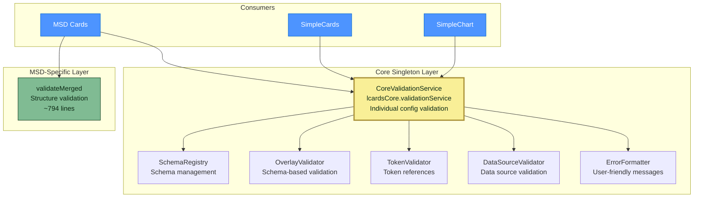
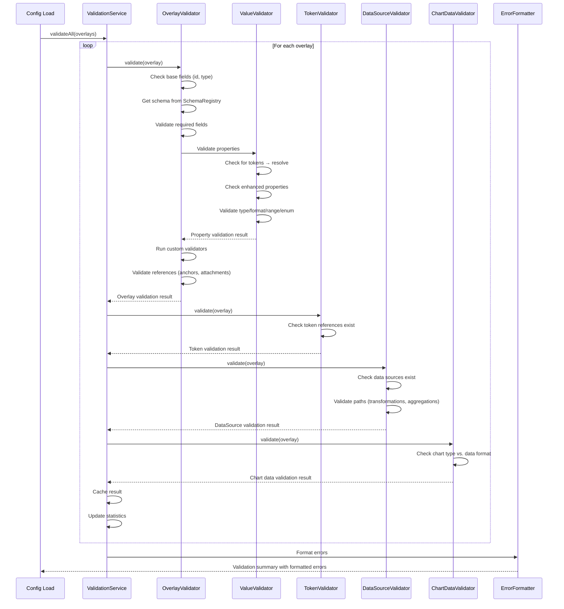

# LCARdS Validation System - Architecture & Developer Guide

## Table of Contents
1. [Overview](#overview)
2. [Dual Validation Architecture](#dual-validation-architecture)
3. [CoreValidationService (Singleton)](#corevalidationservice-singleton)
4. [MSD validateMerged (Structure Validation)](#msd-validatemerged-structure-validation)
5. [Validation Flow](#validation-flow)
6. [Schema System](#schema-system)
7. [Token Resolution](#token-resolution)
8. [Extension Guide](#extension-guide)
9. [API Reference](#api-reference)
10. [Performance Considerations](#performance-considerations)
11. [Future Enhancements](#future-enhancements)

---

## Overview

The LCARdS validation system uses a **dual validation architecture** to provide comprehensive configuration validation:

1. **CoreValidationService** (`lcardsCore.validationService`) - A core singleton that validates individual overlays, cards, tokens, and datasources. Available to ALL LCARdS cards (MSD, SimpleCards, etc.).

2. **validateMerged** (`src/msd/validation/validateMerged.js`) - MSD-specific function that validates the overall MSD configuration structure (anchors, rules, profiles, duplicate IDs, routing).

### Key Features

- 🌐 **Core Singleton Architecture** - Single validation service shared by all LCARdS cards via `lcardsCore.validationService`
- **Universal Availability** - Token validation and datasource validation available for ALL cards (not just MSD)
- **Schema-based validation** - Overlay types have declarative schemas in core
- **Token-aware** - Resolves design tokens from singleton ThemeManager before validation
- **Enhanced properties** - Supports complex object formats (font_size objects, marker objects, etc.)
- **MSD Structure Validation** - Dedicated structure validation for MSD configs via validateMerged
- **Extensible** - Easy to add new overlay types and validators
- **Developer-friendly** - Rich error messages with suggestions and examples

### Design Goals

1. **Catch errors early** - Validate configuration before rendering
2. **Helpful feedback** - Provide actionable error messages with suggestions
3. **Flexible** - Support real-world usage patterns (tokens, enhanced properties, etc.)
4. **Performant** - Cache validation results, minimize overhead
5. **Extensible** - Easy to add new overlay types and validation rules

---

## Dual Validation Architecture



### Validation Responsibilities

| Component | Responsibility | Used By |
|-----------|---------------|---------|
| **CoreValidationService** | Individual overlay/card schemas, tokens, datasources, value types | All LCARdS cards |
| **validateMerged** | MSD config structure: anchors, rules, profiles, duplicate IDs, routing | MSD only |

---

## CoreValidationService (Singleton)

The CoreValidationService is the unified validation system accessible via `lcardsCore.validationService`. It consolidates all individual config validation.

### File Structure

```
src/core/validation-service/
├── index.js               # Main CoreValidationService class
├── SchemaRegistry.js      # Schema management
├── OverlayValidator.js    # Schema-based validation
├── ValueValidator.js      # Type/format/token validation
├── TokenValidator.js      # Theme token validation
├── DataSourceValidator.js # Data source validation
├── ErrorFormatter.js      # Error message formatting
└── schemas/
    ├── index.js           # Schema exports/registration
    ├── common.js          # Common properties (all overlays)
    └── lineOverlay.js     # Line overlay schema
```

### Accessing the Singleton

```javascript
// Access via lcardsCore singleton
const validationService = lcardsCore.validationService;

// Validate an overlay config
const result = validationService.validateOverlay(overlayConfig, context);

// Validate token references
const tokenResult = validationService.validateTokens(config, themeManager);

// Validate datasource references
const dsResult = validationService.validateDataSources(config, dataSourceManager);
```

---

## MSD validateMerged (Structure Validation)

The `validateMerged` function validates MSD-specific configuration structure. It does NOT validate individual overlays (that's CoreValidationService's job).

### File Location

```
src/msd/validation/
└── validateMerged.js     # MSD structure validation (~794 lines)
```

### What validateMerged Validates

- **Config structure** - Overall MSD config object validity
- **Anchors** - Anchor definitions and references
- **Overlays** - Overlay array structure (not individual overlay schemas)
- **Rules** - Rule definitions and references
- **Actions** - Action configurations
- **Animations** - Animation definitions
- **Profiles** - Profile configurations
- **Palettes** - Palette definitions
- **Routing** - Line routing configuration
- **Duplicate IDs** - Ensures unique overlay IDs

### Usage

```javascript
import { validateMerged } from './validation/validateMerged.js';

const issues = validateMerged(msdConfig);
// Returns: { errors: [], warnings: [] }

if (issues.errors.length > 0) {
  console.error('MSD config validation failed:', issues.errors);
}
```

---

## Core Components

### 1. CoreValidationService

**Purpose:** Central singleton orchestrator for all validation operations, accessible via `lcardsCore.validationService`.

**Responsibilities:**
- Coordinate validation across multiple validators
- Manage validation cache for performance
- Integrate with ThemeManager and DataSourceManager singletons
- Collect and format validation statistics
- Provide public API for validation operations

**Key Methods:**
```javascript
// Validate a single overlay
validateOverlay(overlay, context)

// Validate all overlays
validateAll(overlays, context)

// Format errors for display
formatErrors(validationResult)

// Integration with other singletons
setThemeManager(themeManager)
setDataSourceManager(dataSourceManager)

// Management
clear(clearStats)
setCaching(enabled)
getStats()
```

**Accessing the Service:**
```javascript
// Via lcardsCore singleton (recommended)
const validationService = lcardsCore.validationService;

// Validate overlay
const result = validationService.validateOverlay(overlay, { 
  strict: false,
  validateTokens: true,
  validateDataSources: true
});
```

### 2. ValueValidator

**Purpose:** Validate individual values against schema constraints.

**Key Features:**
- **Token resolution** - Detects and resolves design tokens before validation
- **Enhanced properties** - Supports complex object formats
- **Type validation** - Checks types with coercion support
- **Format validation** - Colors, URLs, patterns, etc.
- **Range validation** - Min/max for numbers, min/maxLength for strings
- **Enum validation** - Validates against allowed values

**Token Detection:**
```javascript
// Tokens must:
// 1. Start with a letter (e.g., "colors", "typography")
// 2. Contain at least one dot
// 3. Segments can be alphanumeric (supports "2xl", "4k", etc.)
// Pattern: /^[a-zA-Z][a-zA-Z0-9]*(\.[a-zA-Z0-9]+)+$/

// Valid tokens:
"colors.primary"                 ✅
"typography.fontSize.2xl"        ✅
"spacing.4"                      ✅
"breakpoints.lg"                 ✅

// Invalid:
"2xl"                            ❌ (no namespace)
"typography."                    ❌ (ends with dot)
```

**Enhanced Properties:**
```javascript
// Font size enhancement
font_size: { value: 28, scale: "viewbox", unit: "px" }

// Glow enhancement
glow: { color: "var(--lcars-orange)", blur: 30, intensity: 10 }

// Marker enhancement
marker_end: { type: "diamond", size: "medium", color: "#ff0000", rotate: false }
```

### 3. SchemaRegistry

**Purpose:** Manage validation schemas with inheritance support.

**Features:**
- Register schemas by overlay type
- Common schema inheritance (all overlays inherit base properties)
- Schema merging (type-specific properties override common)
- Query schemas by type

**Schema Structure:**
```javascript
{
  type: 'text',              // Overlay type
  extends: 'common',         // Inherit from common schema
  required: ['text', 'position'], // Required fields

  properties: {              // Property definitions
    text: {
      type: 'string',
      minLength: 1,
      optional: false
    },
    font_size: {
      type: ['number', 'object'], // Multiple types
      min: 6,
      max: 200,
      optional: true
    }
  },

  validators: [              // Custom validators
    (overlay, context) => {
      // Custom validation logic
      return { valid: true, errors: [], warnings: [] };
    }
  ]
}
```

### 4. ChartDataValidator

**Purpose:** Validate chart data format compatibility.

**Key Features:**
- Validates chart type vs. data source format
- Detects mismatches (e.g., rangeArea chart with single-value data)
- Provides actionable suggestions with examples
- Supports all ApexCharts types

**Chart Format Requirements:**
```javascript
// Single value (line, area, bar, column)
{ x: timestamp, y: number }

// Range data (rangeArea, rangeBar)
{ x: timestamp, y: [min, max] }

// OHLC data (candlestick)
{ x: timestamp, y: [open, high, low, close] }

// Distribution data (boxPlot)
{ x: category, y: [min, q1, median, q3, max] }
```

---

## Validation Flow

### High-Level Flow


       └────────────────┘
```

### Detailed Flow - Property Validation

```javascript
// ValueValidator.validate(value, schema, meta)

1. Check for null/undefined
   └──► Return error if not nullable/optional

2. ✅ Check if value is a TOKEN (FIRST!)
   ├──► Match pattern: /^[a-zA-Z][a-zA-Z0-9]*(\.[a-zA-Z0-9]+)+$/
   ├──► If match:
   │    ├──► Resolve via ThemeManager
   │    ├──► If resolved: validate resolved value
   │    └──► If failed: return warning (not error)
   └──► Continue if not a token

3. ✅ Check if value is ENHANCED PROPERTY (SECOND!)
   ├──► Check for object with special structure
   ├──► If enhanced:
   │    ├──► Validate structure
   │    └──► Return (skip normal validation)
   └──► Continue if not enhanced

4. Type validation
   ├──► Check typeof value vs. schema.type
   └──► Return error if mismatch

5. Type-specific validation
   ├──► String: minLength, maxLength, pattern
   ├──► Number: min, max, integer check
   ├──► Array: length, minItems, maxItems, item validation
   └──► Object: nested property validation

6. Enum validation (if schema.enum)
   ├──► Skip if value is object (enhanced property)
   └──► Check if value in allowed values

7. Format validation (if schema.format)
   ├──► color: hex, rgb, rgba, var(--name)
   ├──► url: valid URL format
   └──► pattern: custom regex

8. Return result
   └──► { valid: boolean, errors: [], warnings: [] }
```

---

## Schema System

### Common Schema (Inherited by All)

**File:** `src/core/validation-service/schemas/common.js`

```javascript
{
  required: ['id', 'type'],

  properties: {
    id: { type: 'string', pattern: /^[a-zA-Z0-9_-]+$/ },
    type: { type: 'string' },
    position: { type: ['array', 'string'] }, // [x,y] OR anchor ref
    size: { type: 'array', length: 2, optional: true },
    rotation: { type: 'number', min: -360, max: 360, optional: true },
    opacity: { type: 'number', min: 0, max: 1, optional: true },
    visible: { type: 'boolean', optional: true },
    anchor: { type: 'string', optional: true },
    attach_to: { type: 'string', optional: true },
    style: { type: 'object', optional: true },
    animations: { type: 'array', optional: true },
    rules: { type: 'array', optional: true }
  }
}
```

### Current Overlay Types

MSD supports only **2 overlay types**:

| Type | Description | Renderer |
|------|-------------|----------|
| **line** | SVG line/path overlays | `src/msd/overlays/LineOverlay.js` |
| **card** (control) | Embedded HA cards | `src/msd/controls/MsdControlsRenderer.js` |

**Line Overlay:**
```javascript
{
  type: 'line',
  extends: 'common',
  required: [], // points conditional via custom validator

  properties: {
    points: { type: 'array', minItems: 2, optional: true },
    style: {
      color: { type: 'string', format: 'color' },
      stroke_width: { type: 'number', min: 0.5, max: 50 },
      dash_array: { type: ['string', 'array'] }, // "5,5" or [5,5]
      marker_end: { type: ['string', 'object'] } // "arrow" or {...}
    }
  },

  validators: [
    // Points required UNLESS using attach_to
    (overlay) => overlay.points || overlay.attach_to
  ]
}
```

**Card/Control Overlay:**
```javascript
{
  type: 'control', // or 'card', 'custom:*', 'hui-*', etc.
  extends: 'common',
  required: ['position', 'size'],

  properties: {
    card: { type: 'object', optional: true }, // HA card config
    // Any valid HA card type and configuration
  }
}
```

### Custom Validators

Custom validators provide complex validation logic:

```javascript
validators: [
  // Example: Conditional requirement
  (overlay, context) => {
    if (overlay.type === 'line' && !overlay.points && !overlay.attach_to) {
      return {
        valid: false,
        errors: [{
          field: 'points',
          type: 'required_field',
          message: 'Line requires "points" or "attach_to"',
          severity: 'error',
          suggestion: 'Add points array or use attach_to'
        }]
      };
    }
    return { valid: true };
  },

  // Example: Cross-field validation
  (overlay, context) => {
    if (overlay.start_x > overlay.end_x) {
      return {
        valid: false,
        warnings: [{
          field: 'start_x',
          message: 'start_x is greater than end_x',
          severity: 'warning'
        }]
      };
    }
    return { valid: true };
  }
]
```

---

## Token Resolution

### How Token Resolution Works

1. **Detection:** ValueValidator checks if value matches token pattern
2. **Resolution:** ThemeManager resolves token to actual value
3. **Validation:** Resolved value is validated against schema
4. **Failure Handling:** Resolution failures produce warnings (not errors)

### Token Pattern

```javascript
// Regex: /^[a-zA-Z][a-zA-Z0-9]*(\.[a-zA-Z0-9]+)+$/

// Components:
// ^[a-zA-Z][a-zA-Z0-9]*     First segment: starts with letter
// (\.[a-zA-Z0-9]+)+         Subsequent segments: dot + alphanumeric

// Valid tokens:
"colors.primary"              // Simple namespace
"typography.fontSize.2xl"     // Numeric suffix supported
"spacing.4"                   // Pure numeric suffix
"components.button.hover"     // Deep nesting

// Invalid:
"2xl"                        // Missing namespace
"colors."                    // Trailing dot
".primary"                   // Leading dot
"colors..primary"            // Double dot
```

### Integration with ThemeManager

```javascript
// In ValidationService constructor:
setThemeManager(themeManager) {
  this.tokenValidator = new TokenValidator(themeManager);

  // ✅ CRITICAL: Pass to ValueValidator
  if (this.overlayValidator?.valueValidator) {
    this.overlayValidator.valueValidator.setThemeManager(themeManager);
  }
}

// In ValueValidator:
_validateTokenValue(value, schema, meta) {
  if (!this.themeManager) {
    return { valid: true, warnings: [/* skip validation */] };
  }

  const resolved = this.themeManager.resolveToken(value);

  if (resolved === null || resolved === undefined) {
    return { valid: true, warnings: [/* token exists but failed */] };
  }

  // Validate the resolved value
  return this._validateResolvedValue(resolved, schema, meta);
}
```

### Token Resolution Examples

```javascript
// Input config:
{
  color: "colors.primary",          // Token reference
  font_size: "typography.fontSize.2xl",
  background: "#ff0000"             // Literal value
}

// After resolution:
{
  color: "#ff6600",                 // Resolved from theme
  font_size: 28,                    // Resolved from theme
  background: "#ff0000"             // Unchanged (not a token)
}
```

---

## Extension Guide

### Adding a New Overlay Type

**Step 1: Create Schema File**

Create `src/msd/validation/schemas/myOverlay.js`:

```javascript
export const myOverlaySchema = {
  type: 'myoverlay',
  extends: 'common',

  required: ['position', 'size', 'data'],

  properties: {
    data: {
      type: 'array',
      minItems: 1,
      items: { type: 'number' }
    },

    label: {
      type: 'string',
      optional: true
    },

    style: {
      type: 'object',
      optional: true,
      properties: {
        color: {
          type: 'string',
          format: 'color',
          optional: true
        }
      }
    }
  },

  validators: [
    (overlay, context) => {
      // Custom validation logic
      return { valid: true };
    }
  ]
};
```

**Step 2: Register Schema**

Add to `src/msd/validation/schemas/index.js`:

```javascript
import { myOverlaySchema } from './myOverlay.js';

export function registerAllSchemas(schemaRegistry) {
  // ... existing registrations

  schemaRegistry.register('myoverlay', myOverlaySchema);
}
```

**Step 3: Test**

```javascript
const validation = validationService.validateOverlay({
  id: 'test-my-overlay',
  type: 'myoverlay',
  position: [100, 100],
  size: [200, 200],
  data: [1, 2, 3, 4, 5]
});

console.log(validation.valid); // true or false
console.log(validation.errors);
console.log(validation.warnings);
```

### Adding a Custom Validator

**Method 1: Schema-Level Validator**

```javascript
{
  validators: [
    (overlay, context) => {
      const errors = [];
      const warnings = [];

      // Your validation logic
      if (overlay.start > overlay.end) {
        errors.push({
          field: 'start',
          type: 'logical_error',
          message: 'Start must be less than end',
          severity: 'error'
        });
      }

      return { valid: errors.length === 0, errors, warnings };
    }
  ]
}
```

**Method 2: Standalone Validator Class**

```javascript
export class MyCustomValidator {
  validate(overlay, context) {
    // Validation logic
    return { valid: true, errors: [], warnings: [] };
  }
}

// In ValidationService:
this.customValidator = new MyCustomValidator();

validateOverlay(overlay, context) {
  // ... existing validation

  const customResult = this.customValidator.validate(overlay, context);
  result.errors.push(...customResult.errors);
  result.warnings.push(...customResult.warnings);

  // ... rest of validation
}
```

### Adding a Custom Format Validator

```javascript
// In ValueValidator constructor:
this.formatValidators.set('myformat', this._validateMyFormat.bind(this));

// Add validation method:
_validateMyFormat(value, schema, meta) {
  const result = { valid: true, errors: [] };

  // Your format validation logic
  if (!isValidMyFormat(value)) {
    result.valid = false;
    result.errors.push({
      field: meta.field,
      type: 'invalid_format',
      message: `Invalid format for "${meta.field}"`,
      value: value,
      severity: 'error'
    });
  }

  return result;
}

// Use in schema:
{
  properties: {
    myfield: {
      type: 'string',
      format: 'myformat'
    }
  }
}
```

---

## API Reference

### ValidationService

```javascript
class ValidationService {
  constructor(config)

  // Validation
  validateOverlay(overlay, context): ValidationResult
  validateAll(overlays, context): ValidationSummary

  // Formatting
  formatErrors(validationResult): string

  // Integration
  setThemeManager(themeManager): void
  setDataSourceManager(dataSourceManager): void

  // Management
  clear(clearStats): void
  setCaching(enabled): void
  getStats(): Object
  getDebugInfo(): Object
}

// Types
ValidationResult = {
  valid: boolean,
  errors: Array<Error>,
  warnings: Array<Warning>,
  overlayId: string,
  overlayType: string
}

ValidationSummary = {
  valid: boolean,
  results: Array<ValidationResult>,
  summary: {
    total: number,
    valid: number,
    invalid: number,
    errors: number,
    warnings: number
  }
}

Error = {
  field: string,
  type: string,
  message: string,
  severity: 'error',
  suggestion?: string,
  example?: string,
  helpUrl?: string,
  value?: any
}
```

### Debug Commands

```javascript
// Chart validation
__msdDebug.charts.validate('overlay-id')
__msdDebug.charts.validateAll()
__msdDebug.charts.getFormatSpec('rangeArea')
__msdDebug.charts.listTypes()
__msdDebug.charts.checkCompatibility('overlay-id')

// Full validation
const validation = __msdDebug.pipelineInstance.systemsManager.validationService
validation.validateAll(overlays, context)
validation.getStats()

// Access cached results
__msdDebug.pipelineInstance.config.__validation
```

---

## Performance Considerations

### Validation Caching

```javascript
// Caching is enabled by default
// Cache key: `${overlayId}:${overlayType}`

validationService.setCaching(true);  // Enable
validationService.setCaching(false); // Disable

// Clear cache
validationService.clear(false); // Keep stats
validationService.clear(true);  // Clear stats too
```

### Optimization Tips

1. **Cache validation results** - Don't re-validate unchanged overlays
2. **Skip optional validations** - Disable token/data source validation if not needed
3. **Batch validation** - Use `validateAll()` instead of multiple `validateOverlay()` calls
4. **Lazy validation** - Only validate on config changes, not on every render
5. **Async validation** - For expensive validators (future enhancement)

### Performance Statistics

```javascript
validationService.getStats()
// Returns:
{
  validated: 150,           // Total overlays validated
  errors: 5,                // Overlays with errors
  warnings: 12,             // Overlays with warnings
  skipped: 0,               // Skipped validations
  tokenValidations: 120,    // Token validations performed
  dataSourceValidations: 45,// Data source validations
  cacheSize: 150,           // Cached results
  cacheEnabled: true        // Cache status
}
```

---

## Future Enhancements

### User-Facing Error Display

**Outstanding Question:** How to surface validation errors to users?

**Current Options:**
1. **Debug Console** - `__msdDebug` commands (developer-only)
2. **SVG Overlay Text** - Error messages rendered in SVG (limited space)
3. **HUD Issues Panel** - Dashboard panel showing validation issues (needs implementation)

**Proposed Solutions:**
1. **Validation Panel** - Dedicated panel/modal showing all validation results
   - Filterable by overlay type, severity
   - Clickable errors that highlight affected overlays
   - Links to documentation
   - Copy error details for support

2. **Overlay Badges** - Visual indicators on problematic overlays
   - Red badge for errors
   - Yellow badge for warnings
   - Tooltip showing error details
   - Click to open validation panel

3. **Config Integration** - Link validation errors back to YAML source
   - Show line numbers
   - Suggest fixes
   - "Fix it" button for common issues

4. **Validation Summary** - Global indicator
   - Badge showing error/warning count
   - Color-coded (green/yellow/red)
   - Click to open validation panel

**Implementation Considerations:**
- Don't block rendering (validation runs but doesn't stop display)
- Provide "strict mode" option to block rendering on errors
- Support both developer and end-user error messages
- Integrate with existing HUD/debug infrastructure

### Async Validation

Support async validators for expensive operations:

```javascript
validators: [
  async (overlay, context) => {
    const data = await fetchSomeData();
    return { valid: isValid(data), errors: [] };
  }
]

// Usage:
const result = await validationService.validateOverlayAsync(overlay);
```

### Validation Profiles

Different validation levels for different use cases:

```javascript
validationService.setProfile('development'); // Strict, all validations
validationService.setProfile('production');  // Errors only, skip warnings
validationService.setProfile('minimal');     // Required fields only
```

### Schema Versioning

Support multiple schema versions for backwards compatibility:

```javascript
{
  type: 'text',
  version: '2.0',
  extends: 'common@2.0',
  deprecated: {
    text_colour: 'text_color' // Rename mapping
  }
}
```

---

## References

### Core Validation Service
- [CoreValidationService](../../../src/core/validation-service/index.js) - Main singleton service
- [SchemaRegistry](../../../src/core/validation-service/SchemaRegistry.js) - Schema management
- [OverlayValidator](../../../src/core/validation-service/OverlayValidator.js) - Schema-based validation
- [ValueValidator](../../../src/core/validation-service/ValueValidator.js) - Type/format validation
- [TokenValidator](../../../src/core/validation-service/TokenValidator.js) - Token validation
- [DataSourceValidator](../../../src/core/validation-service/DataSourceValidator.js) - Datasource validation
- [Schemas](../../../src/core/validation-service/schemas/) - Schema definitions

### MSD Structure Validation
- [validateMerged](../../../src/msd/validation/validateMerged.js) - MSD config structure validation

### User Documentation
- [Validation Guide](../../user/advanced/validation_guide.md) - User-facing validation documentation

---

*Last Updated: 2025-11-24*
*Version: 2.0 - Post-Architecture Refactor*