# Systems Architecture

The diagram below shows how LCARdS cards, core singletons, and Home Assistant relate at runtime.

```mermaid
graph LR
    subgraph HA["Home Assistant"]
        HACore[HA Core]
        subgraph Integration["custom_components/lcards/ (HACS Integration)"]
            IntPy["Python backend\nasync_setup / setup_entry\nWebSocket API"]:::integrationStyle
        end
    end

    subgraph CORE["LCARdS Core (window.lcards.core.*)"]
        direction LR
        CoreIntSvc[Integration Service]:::coreStyle
        CoreRules[Rules Engine]:::coreStyle
        CoreThemes[Theme Manager]:::coreStyle
        CoreData[Data Source Manager]:::coreStyle
        CoreSystemsMgr[Systems Manager]:::coreStyle
        CoreAnim[Animation Manager]:::coreStyle
        CoreOther[...other core systems]:::coreStyle
    end

    subgraph DASHBOARD["Dashboard"]
        Button([LCARdS Button Card]):::lcardsStyle
        Elbow(["LCARdS Elbow Card"]):::lcardsStyle
        Slider([LCARdS Slider Card]):::lcardsStyle
        Chart([LCARdS Chart Card]):::lcardsStyle
        Grid([LCARdS Data Grid Card]):::lcardsStyle
        AlertOverlay([LCARdS Alert Overlay Card]):::lcardsStyle
        subgraph MSD[LCARdS MSD Card]
            Card1([HA Cards]):::lcardsStyle
            MSDLCARdS([LCARdS Cards]):::lcardsStyle
        end
    end

    IntPy 0@-..->|"injects lcards.js"| CORE
    HACore 1@-..-CoreSystems
    IntPy 2@-..->|"lcards/info WS"| CoreIntSvc
    CoreIntSvc 3@-.- CoreRules
    CORE 4@-...- Button
    CORE 5@-.- Slider
    CORE 6@-.- Chart
    CORE 7@-.- Elbow
    CORE 8@-.- Grid
    CORE 9@-.- AlertOverlay
    CORE 10@-.- MSD
    CORE 11@-.- MSDLCARdS

    0@{ animate: slow }
    1@{ animate: slow }
    2@{ animate: slow }
    3@{ animate: slow }
    4@{ animate: slow }
    5@{ animate: slow }
    6@{ animate: slow }
    7@{ animate: slow }
    8@{ animate: slow }
    9@{ animate: slow }
    10@{ animate: slow }
    11@{ animate: slow }

    linkStyle 0,2 stroke:#37a6d1,stroke-width:3px
    linkStyle 1,3,4,5,6,7,8,9,10,11 stroke:#00eeee,stroke-width:3px

    classDef lcardsStyle fill:#ffb399,stroke:#e7442a,color:#000
    classDef coreStyle fill:#6d748c,stroke:#d2d5df
    classDef integrationStyle fill:#1c3c55,stroke:#37a6d1,color:#fff

    style HA fill:#162535,stroke:#37a6d1,color:#fff
    style Integration fill:#1c3c55,stroke:#37a6d1,color:#fff
    style HACore fill:#37a6d1,stroke:#93e1ff,color:#fff

    style CORE fill:#1e2229,stroke:#2f3749

    style DASHBOARD fill:#2f3749,stroke:#52596e
    style MSD fill:#e7442a,stroke:#ffb399,color:#fff
```

---

## Core Services

These services start on page load and become accessible to all LCARdS cards via **`window.lcards.core.*`**. Cards interact with them transparently — they do not need to implement any of this themselves.

| Service | `window.lcards.core.*` | What it does |
|---|---|---|
| **Integration Service** | `integrationService` | Probes the HA Python backend on startup; sets `available` flag so other services can gate on backend APIs. Falls back gracefully when the integration is absent. |
| **Systems Manager** | `systemsManager` | Centralised entity state subscriptions; cards register interest and receive smart push notifications — no duplicate subscriptions |
| **DataSource Manager** | `dataSourceManager` | Named data buffers tied to entities; records history, runs processing pipelines (moving average, min/max, aggregation) and notifies subscribers |
| **Rules Engine** | `rulesManager` | Evaluates conditions and hot-patches LCARd styles at runtime; target any card by tag, type, or ID |
| **Theme Manager** | `themeManager` | Token-based theming (colours, spacing, borders, and more); resolves theme tokens in any card field |
| **Alert Mode** | `alertMode` | Coordinated alert states (green / red / yellow / blue / gray / black); drives palette shifts, triggers sounds, driven by `input_select.lcards_alert_mode` |
| **Animation Manager** | `animationManager` | Coordinates Anime.js v4 animations; provides built-in configurable presets or accepts custom anime.js parameters |
| **Sound Manager** | `soundManager` | LCARS-style audio feedback for card interactions and UI events; configurable scheme with per-event overrides |
| **Style Preset Manager** | `stylePresetManager` | Central registry of named style presets for buttons, sliders, elbows; consumed from packs |
| **Component Manager** | `componentManager` | Registry of SVG component definitions (D-pad, Alert, custom shapes) used in button component mode |
| **Asset Manager** | `assetManager` | Loads and caches SVG and font assets for use across cards |
| **Pack Manager** | `packManager` | Loads and distributes content from packs (themes, presets, animations, assets, etc.) to appropriate managers at startup |
| **Helper Manager** | `helperManager` | Manages LCARdS and HA-LCARS `input_*` helper entities; auto-create from LCARdS Config Panel |

**Template Support** — any text field in any card supports four syntaxes:
JavaScript `[[[return ...]]]`, LCARdS tokens `{entity.state}` / `{theme:colors.card.button}`, DataSource `{ds:sensor_name}`, and Jinja2 `{{states("sensor.temp")}}` (Jinja2 evaluated by HA server).

---

## Pack System

Packs are the extensibility mechanism that distributes themes, presets, animations, and assets to the core managers.

```mermaid
flowchart TB
    subgraph BuiltinPacks["<b>Builtin Packs</b>"]
        P1["lcards_buttons<br/>v2026.x.y<br/><br/><code>- style_presets [buttons]</code>"]:::builtinPacksStyle
        P2["lcards_sliders<br/>v2026.x.y<br/><br/><code>- style_presets [sliders]</code>"]:::builtinPacksStyle
        P3["builtin_themes<br/>v2026.x.y<br/><br/><code>- themes</code>"]:::builtinPacksStyle
        P4["lcars_fx<br/>v2026.x.y<br/><br/><code>- animations<br/>- rules</code>"]:::builtinPacksStyle
    end

    subgraph ExternalPacks["<b>External/User Packs</b>"]
        E1["ds9_pack<br/>v2.0.0<br/><br/><code>- themes<br/>- style_presets<br/>- svg_assets<br/>- animations</code>"]:::externalPacksStyle
        E2["voyager_pack<br/>v1.5.0<br/><br/><code>- themes<br/>- font_assets<br/>- rules</code>"]:::externalPacksStyle
        E3["msd_collection<br/>v1.0.0<br/><br/><code>- svg_assets<br/>- animations</code>"]:::externalPacksStyle
    end

    subgraph PackMgr["<b>PackManager</b>"]
        PM[Pack Loader &<br/>Content Distributor]
    end

    subgraph CoreSystems["<b>Core Systems</b>"]
        TM[ThemeManager<br/>Theme tokens]:::coreStyle
        SPM[StylePresetManager<br/>Button & slider presets]:::coreStyle
        AR[AnimationRegistry<br/>Animation definitions]:::coreStyle
        RE[RulesEngine<br/>Conditional rules]:::coreStyle
        AM[AssetManager<br/>SVG & font assets]:::coreStyle
    end

    P1 0@--- PM
    P2 1@--- PM
    P3 2@--- PM
    P4 3@--- PM
    E1 4@--- PM
    E2 5@--- PM
    E3 6@--- PM

    PM 7@---|themes| TM
    PM 8@---|style_presets| SPM
    PM 9@---|animations| AR
    PM 10@---|rules| RE
    PM 11@---|svg_assets<br/>font_assets| AM

    TM 12@-.- Cards([LCARdS Cards])
    SPM 13@-.- Cards
    AR 14@-.- Cards
    RE 15@-.- Cards
    AM 16@-.- Cards

    0@{ animate: slow }
    1@{ animate: slow }
    2@{ animate: slow }
    3@{ animate: slow }
    4@{ animate: slow }
    5@{ animate: slow }
    6@{ animate: slow }
    7@{ animate: slow }
    8@{ animate: slow }
    9@{ animate: slow }
    10@{ animate: slow }
    11@{ animate: slow }
    12@{ animate: slow }
    13@{ animate: slow }
    14@{ animate: slow }
    15@{ animate: slow }
    16@{ animate: slow }

    linkStyle 0,1,2,3 stroke:#67caf0,stroke-width:3px
    linkStyle 4,5,6 stroke:#f9ef97,stroke-width:3px
    linkStyle 7,8,9,10,11 stroke:#00eeee,stroke-width:3px,color:#fff
    linkStyle 12,13,14,15,16 stroke:#ffb399,stroke-width:3px

    style BuiltinPacks fill:#2f3749,stroke:#52596e
    style ExternalPacks fill:#2f3749,stroke:#52596e
    style CoreSystems fill:#1e2229,stroke:#2f3749
    style Cards fill:#e7442a,stroke:#ffb399,color:#fff
    style PM fill:#1c3c55,stroke:#37a6d1,color:#fff
    style PackMgr fill:#2f3749,stroke:#52596e

    classDef builtinPacksStyle fill:#2a7193,stroke:#67caf0,color:#fff
    classDef externalPacksStyle fill:#ac943b,stroke:#f9ef97,color:#fff
    classDef coreStyle fill:#2f3749,stroke:#52596e
```

See [Pack System](subsystems/pack-system.md) for the full developer reference.

---

## Further Reading

- [HA Integration Architecture](ha-integration.md)
- [Integration Service](subsystems/integration-service.md)
- [Pack System](subsystems/pack-system.md)
- [Background Animation System](subsystems/background-animation-system.md)
- [Shape Texture System](subsystems/shape-texture-system.md)
- [Sound System](subsystems/sound-system.md)
