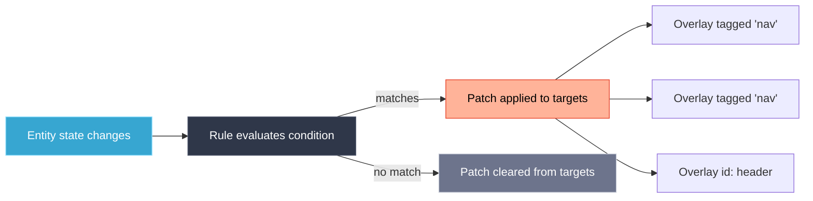

# Rules Engine

Rules let you apply style changes to groups of cards based on entity state — without touching each card individually. A single rule can update dozens of overlays at once.

---

## Concept

A rule watches one or more entities. When a condition matches, it pushes a **patch** to all targeted overlays. When the condition no longer matches, the patch is removed.



---

## Where Rules Live

Rules are defined in the `rules` array of any card config, or in content packs. You manage them from the **Rules** tab in any card editor.

---

## Rule Structure

Every rule requires `id`, `when`, and `apply`. All other fields are optional.

```yaml
rules:
  - id: my-rule               # Required: unique identifier
    priority: 10              # Optional: higher wins (default 0)
    enabled: true             # Optional: disable without deleting (default true)
    stop: false               # Optional: stop evaluating lower-priority rules (default false)
    when:                     # Required: condition(s) to evaluate
      entity: binary_sensor.motion_hallway
      state: "on"
    apply:                    # Required: what to change when condition matches
      overlays:
        tag:nav:              # Selector: all overlays tagged 'nav'
          style:
            color: "{theme:colors.ui.primary}"
        header-card:          # Selector: overlay with this exact ID
          style:
            card:
              color:
                background: "#1a1a2e"
```

---

## Conditions (`when`)

A `when` block evaluates to true or false. The simplest form is a single entity check; complex logic uses `all`/`any`/`not` to compose conditions.

### Entity State

```yaml
when:
  entity: light.bedroom
  state: "on"
```

### Numeric Comparisons

```yaml
# Greater than
when:
  entity: sensor.temperature
  above: 25

# Less than
when:
  entity: sensor.humidity
  below: 30

# Range (above AND below in one condition)
when:
  all:
    - entity: sensor.temperature
      above: 18
    - entity: sensor.temperature
      below: 26
```

### All Condition Operators

| Operator | Type | Description |
|----------|------|-------------|
| `state` | string | Exact state match (`state: "on"`) — alias for `equals` |
| `equals` | string/number | Exact equality |
| `not_equals` | string/number | Inequality |
| `above` | number | Numeric state strictly greater than value |
| `below` | number | Numeric state strictly less than value |
| `in` | array | State is one of the listed values |
| `not_in` | array | State is none of the listed values |
| `regex` | string | State matches regular expression |
| `attribute` | string | Watch attribute instead of state (pair with an operator) |

### Entity Attribute Check

```yaml
when:
  entity: light.living_room
  attribute: brightness
  above: 128
```

### Logical Operators

```yaml
# AND — all must match
when:
  all:
    - entity: binary_sensor.door
      state: "on"
    - entity: input_boolean.night_mode
      state: "on"

# OR — at least one must match
when:
  any:
    - entity: sensor.temperature
      above: 30
    - entity: binary_sensor.alert
      state: "on"

# NOT — invert a condition
when:
  not:
    entity: light.bedroom
    state: "on"
```

Operators nest freely:

```yaml
when:
  all:
    - any:
        - entity: sensor.indoor_temp
          above: 25
        - entity: sensor.outdoor_temp
          above: 30
    - not:
        entity: climate.ac
        state: "on"
```

### Template Conditions

Use JavaScript (`[[[…]]]`) or Jinja2 (`{{…}}`) expressions for arbitrary logic. Return a truthy value to match.

```yaml
# JavaScript
when:
  condition: "[[[return states['sensor.temperature'].state > 25]]]"

# Jinja2
when:
  condition: "{{ states('sensor.temperature') | float > 25 }}"

# Explicit keys (alternative to 'condition:')
when:
  javascript: "return states['light.bedroom'].state === 'on'"
  # or
  jinja2: "{{ states('light.bedroom') == 'on' }}"
```

### Time Conditions

```yaml
# Time range — "HH:MM-HH:MM" (wraps past midnight automatically)
when:
  time_between: "22:00-06:00"

# Day of week
when:
  weekday_in: [mon, tue, wed, thu, fri]   # sat, sun also valid

# Combine with entity trigger so rules re-evaluate each minute
when:
  all:
    - entity: sensor.time          # triggers on every minute change
    - time_between: "22:00-06:00"
```

> **Note:** The Rules Engine is reactive — it only re-evaluates when an entity it references changes. Add `sensor.time` to purely time-based rules so they are checked every minute.

### Sun Elevation

```yaml
when:
  sun_elevation:
    below: 0    # Below horizon (night)
```

---

## Apply Block (`apply`)

### Overlay Patches

The `apply.overlays` object maps **selectors** to patch objects. Selectors are the keys; the value is any overlay config fragment to merge.

```yaml
apply:
  overlays:
    my-overlay-id:          # Direct ID — exact match
      style:
        color: var(--lcars-red)

    tag:alert:              # Tag selector — all overlays tagged 'alert'
      style:
        color: var(--lcars-alert-red)

    type:gauge:             # Type selector — all overlays of type 'gauge'
      style:
        opacity: 1

    pattern:^temp_.*:       # Regex pattern — overlays whose ID matches
      style:
        color: var(--lcars-yellow)

    all:                    # Wildcard — every registered overlay
      style:
        opacity: 0.5
    exclude: [header, nav]  # Exclude specific IDs from 'all' or tag/type/pattern selectors
```

Multiple selectors in one rule are applied in order; later selectors' style keys override earlier ones for the same overlay.

Patch values support all template types (`{entity.state}`, `[[[JS]]]`, `{{jinja}}`):

```yaml
apply:
  overlays:
    temp-display:
      style:
        color: "[[[return parseFloat(states['sensor.temperature'].state) > 30 ? 'var(--lcars-red)' : 'var(--lcars-blue)']]]"
```

### Base SVG Filters (MSD cards)

```yaml
apply:
  base_svg:
    filter_preset: "red-alert"   # Named preset
    filters:                     # Or custom filter properties
      opacity: 0.3
      brightness: 0.7
      blur: "2px"
      grayscale: 0.5
      hue_rotate: "90deg"
      sepia: 0.3
      saturate: 0.8
      contrast: 1.2
      invert: 0.1
    transition: 1500             # Transition duration in ms (default 300)
```

Built-in presets: `none` (clear), `dimmed`, `subtle`, `backdrop`, `faded`, `red-alert`, `monochrome`.

Use `filter_preset: "none"` or `filters: {}` to clear all filters.

### Animations

Target by **direct ID** using `overlay:` (matches the card's `id:` field):

```yaml
apply:
  animations:
    - overlay: my-button-id    # Target a specific card by its id: value
      preset: blink
      loop: true               # Loop until rule unmatches
      params:                  # Preset-specific parameters
        duration: 1000
        max_scale: 1.1
```

Target by **tag** to affect multiple cards at once:

```yaml
apply:
  animations:
    - tag: alert-buttons       # All overlays tagged 'alert-buttons'
      preset: alert_pulse
      loop: true
      duration: 800            # ms
      delay: 0                 # ms before start
      easing: easeInOutQuad
      params:
        speed: 2
        color: "#ff4400"
```

Animation selectors (mutually exclusive, evaluated in order): `overlay` (direct ID), `tag`, `type`, `pattern` (regex).

Animations started by a rule are **automatically stopped** when the rule unmatches.

### Profiles

```yaml
apply:
  profiles:
    - night_mode
    - dim_displays
```

---

## Priority

Higher `priority` wins when multiple rules would patch the same overlay property. Default is `0`. Rules are evaluated in descending priority order.

```yaml
rules:
  - id: normal-style
    priority: 0
    when:
      entity: sensor.temperature
      below: 25
    apply:
      overlays:
        temp-display:
          style:
            color: var(--lcars-blue)

  - id: alert-override
    priority: 100              # This wins when active
    when:
      entity: sensor.temperature
      above: 30
    apply:
      overlays:
        temp-display:
          style:
            color: var(--lcars-red)
```

Use `stop: true` to prevent lower-priority rules from being evaluated at all once a rule matches:

```yaml
rules:
  - id: critical-alert
    priority: 100
    stop: true                 # No lower-priority rules run if this matches
    when:
      entity: binary_sensor.emergency
      state: "on"
    apply:
      overlays:
        all:
          style:
            color: var(--lcars-alert-red)
```

---

## Tagging Overlays

Add `tags` to any overlay so rules can target it with `tag:` selectors:

```yaml
# MSD overlay
overlays:
  - id: nav-button-1
    type: button
    tags: [nav, main-panel]

# Non-MSD card
type: custom:lcards-button
tags: [nav, main-panel]
```

---

## Complete Examples

### Temperature Alert

```yaml
rules:
  - id: temp-critical
    priority: 100
    stop: true
    when:
      entity: sensor.temperature
      above: 30
    apply:
      overlays:
        temp-display:
          style:
            color: var(--lcars-red)
      base_svg:
        filter_preset: red-alert
        transition: 500

  - id: temp-warning
    priority: 50
    when:
      entity: sensor.temperature
      above: 25
    apply:
      overlays:
        temp-display:
          style:
            color: var(--lcars-yellow)

  - id: temp-normal
    priority: 10
    when:
      entity: sensor.temperature
      below: 25
    apply:
      overlays:
        temp-display:
          style:
            color: var(--lcars-blue)
```

### Day/Night Mode (time-based)

```yaml
rules:
  - id: night-mode
    priority: 100
    when:
      all:
        - entity: sensor.time       # retriggers every minute
        - time_between: "22:00-06:00"
    apply:
      base_svg:
        filter_preset: dimmed
        transition: 2000
      overlays:
        tag:nav:
          style:
            opacity: 0.5

  - id: day-mode
    priority: 90
    when:
      all:
        - entity: sensor.time
        - time_between: "06:00-22:00"
    apply:
      base_svg:
        filter_preset: "none"
        transition: 2000
      overlays:
        tag:nav:
          style:
            opacity: 1
```

### Multi-condition with Animations

```yaml
rules:
  - id: climate-critical
    priority: 100
    stop: true
    when:
      all:
        - entity: sensor.temperature
          above: 28
        - entity: sensor.humidity
          above: 70
        - not:
            entity: climate.ac
            state: "on"
    apply:
      overlays:
        tag:status:
          style:
            color: var(--lcars-red)
      animations:
        - tag: status
          preset: alert_pulse
          loop: true
      base_svg:
        filter_preset: red-alert
        transition: 500
```

---

## Viewing Active Rules

In any card editor, the **Rules** tab shows:
- All rules currently in the system
- Which rules are currently active (condition matched)
- Which patches are being applied to this overlay

From the browser console:

```javascript
const rm = window.lcards.core.rulesManager;
rm.getAllRules()                     // all registered rules
rm.getTrace()                        // detailed evaluation trace
rm.getRecentMatches(30000)           // matches in the last 30 s
rm.getRuleTrace('my-rule-id', 20)    // history for one rule
```

---

## See Also

- [Rule-Based Animations](../../architecture/animations/rule-based-animations.md)
- [Architecture: Rules Engine](../../architecture/subsystems/rules-engine.md)

---
