# What is LCARdS?

**A unified card system for Home Assistant inspired by the iconic Star Trek LCARS interfaces.
Build your own LCARS-style dashboards and Master Systems Display (MSD) with realistic controls, reactivity and animations.**

---

LCARdS is the evolution of dedicated LCARS-inspired cards for Home Assistant.
It originates from, and supersedes the [CB-LCARS](https://github.com/snootched/cb-lcars) project. LCARdS is meant to accompany and complement [**HA-LCARS themes**](https://github.com/th3jesta/ha-lcars).

Although deployed and used as individual custom cards, LCARdS is built upon common core components that aim to provide a more complete and cohesive LCARS-like dashboard experience.

- **Unified architecture** — Each LCARd shares core services that centralise data sources, provide a cross-card rules engine, theme tokens, sounds, a coordinated animation framework, and much more.
- **State-aware styling** — Cards respond dynamically to entity states via a rules engine that hot-patches styles across multiple cards simultaneously — including coordinated alert modes.
- **Built to animate** — Embedded Anime.js v4 enables per-element animations on any SVG shape, line, or text — driven by entity state or triggered globally.
- **Living data** — Entities can be subscribed, buffered, and processed (moving averages, min/max, history) and referenced in any card field using a flexible four-syntax template system.
- **Extensible by design** — Themes, button presets, animations, and other assets can be distributed via a content pack system.

---

## Core Architecture

LCARdS is built on **Lit** web components and embeds **[Anime.js v4](https://animejs.com)** for animations and **[ApexCharts](https://apexcharts.com)** for charting. Each LCARd shares a common set of core services that work behind the scenes — the cards do not need to implement any of this themselves:

```mermaid
graph LR
    subgraph HA["Home Assistant"]
        HACore[HA Core]
    end

    subgraph CORE["LCARdS Core"]
       subgraph CoreSystems["window.lcards.core.*"]
            direction LR
            CoreRules[Rules Engine]:::coreStyle
            CoreThemes[Theme Manager]:::coreStyle
            CoreData[Data Source Manager]:::coreStyle
            CoreSystemsMgr[Systems Manager]:::coreStyle
            CoreAnim[Animation Manager]:::coreStyle
            CoreOther[...other core systems]:::coreStyle
        end
    end

    subgraph DASHBOARD["Dashboard"]
        Button([LCARdS Button Card]):::lcardsStyle
        Elbow(["LCARdS Elbow Card"]):::lcardsStyle
        Slider([LCARdS Slider Card]):::lcardsStyle
        Chart([LCARdS Chart Card]):::lcardsStyle
        Grid([LCARdS Data Grid Card]):::lcardsStyle
        AlertOverlay([LCARdS Alert Overlay Card]):::lcardsStyle
        subgraph MSD[LCARdS MSD Card]
            Card1([HA Cards]):::lcardsStyle
            MSDLCARdS([LCARdS Cards]):::lcardsStyle
        end
    end

    HACore 0@-..-CoreSystems
    CoreSystems 1@-...- Button
    CoreSystems 2@-.- Slider
    CoreSystems 3@-.- Chart
    CoreSystems 4@-.- Elbow
    CoreSystems 5@-.- Grid
    CoreSystems 6@-.- AlertOverlay
    CoreSystems 7@-.- MSD
    CoreSystems 8@-.- MSDLCARdS

    0@{ animate: slow }
    1@{ animate: slow }
    2@{ animate: slow }
    3@{ animate: slow }
    4@{ animate: slow }
    5@{ animate: slow }
    6@{ animate: slow }
    7@{ animate: slow }
    8@{ animate: slow }

    linkStyle 0,1,2,3,4,5,6,7,8 stroke:#00eeee,stroke-width:3px

    classDef lcardsStyle fill:#ffb399,stroke:#e7442a,color:#000
    classDef coreStyle fill:#6d748c,stroke:#d2d5df

    style HA fill:#1c3c55,stroke:#37a6d1,color:#fff
    style HACore fill:#37a6d1,stroke:#93e1ff,color:#fff

    style CORE fill:#1e2229,stroke:#2f3749
    style CoreSystems fill:#2f3749,stroke:#52596e

    style DASHBOARD fill:#2f3749,stroke:#52596e
    style MSD fill:#e7442a,stroke:#ffb399,color:#fff
```

---

## Core Services

These core services start on page load and become accessible for use by all LCARdS cards on the dashboard view.
Interaction is behind the scenes, but all the core systems APIs are accessible via **`window.lcards.core.*`**

| Service | What it does |
|---|---|
| **Systems Manager** | Centralised entity state subscriptions; LCARdS cards register interest and receive smart push notifications — no duplicate subscriptions |
| **DataSource Manager** | Named data buffers tied to entities; records history, runs processing pipelines (moving average, min/max, aggregation) and notifies subscribers |
| **Rules Engine** | Evaluates conditions and hot-patches LCARd styles at runtime; target any LCARd by tag, type, or ID |
| **Theme Manager** | Token-based theming (colours, spacing, borders, and more); resolves theme tokens in any LCARd field |
| **Alert Mode** | Coordinated alert states (green / red / yellow / blue / gray / black); drives visual colour palette shifts and triggers sounds; driven by a HA helper that can be used in automations |
| **Animation Manager** | Coordinates Anime.js v4 animations used by LCARdS; provides a built-in library of configurable presets, or bring your own anime.js parameters |
| **Sound Manager** | LCARS-style audio feedback for card interactions and UI events; configurable scheme with per-event overrides |
| **Style Preset Manager** | Central registry of named style presets for buttons, sliders, elbows, and more; consumed from packs |
| **Component Manager** | Registry of SVG component definitions (D-pad, Alert, custom shapes) used in button component mode |
| **Asset Manager** | Loads and caches SVG and font assets for use across cards |
| **Pack Manager** | Loads and distributes content from packs (themes, presets, animations, assets, etc.) to the appropriate managers at startup |
| **Helper Manager** | Manages LCARdS and HA-LCARS `input_*` helper entities (alert mode selector, sound config, sizing helpers); auto-create any helper from LCARdS Config Panel |

**Template Support** — any text field in any card supports four syntaxes:
JavaScript `[[[return ...]]]`, LCARdS tokens `{entity.state}` / `{theme:colors.card.button}`, DataSource `{ds:sensor_name}`, and Jinja2 `{{states("sensor.temp")}}` (Jinja2 is evaluated by HA server).

---

## Built to Extend

LCARdS has an extensible architecture that enables **customisation and community contribution** via a pack system.

```mermaid
flowchart TB
    subgraph BuiltinPacks["<b>Builtin Packs</b>"]
        P1["lcards_buttons<br/>v2026.x.y<br/><br/><code>- style_presets [buttons]</code>"]:::builtinPacksStyle
        P2["lcards_sliders<br/>v2026.x.y<br/><br/><code>- style_presets [sliders]</code>"]:::builtinPacksStyle
        P3["builtin_themes<br/>v2026.x.y<br/><br/><code>- themes</code>"]:::builtinPacksStyle
        P4["lcars_fx<br/>v2026.x.y<br/><br/><code>- animations<br/>- rules</code>"]:::builtinPacksStyle
    end

    subgraph ExternalPacks["<b>External/User Packs</b>"]
        E1["ds9_pack<br/>v2.0.0<br/><br/><code>- themes<br/>- style_presets<br/>- svg_assets<br/>- animations</code>"]:::externalPacksStyle
        E2["voyager_pack<br/>v1.5.0<br/><br/><code>- themes<br/>- font_assets<br/>- rules</code>"]:::externalPacksStyle
        E3["msd_collection<br/>v1.0.0<br/><br/><code>- svg_assets<br/>- animations</code>"]:::externalPacksStyle
    end

    subgraph PackMgr["<b>PackManager</b>"]
        PM[Pack Loader &<br/>Content Distributor]
    end

    subgraph CoreSystems["<b>Core Systems</b>"]
        TM[ThemeManager<br/>Theme tokens]:::coreStyle
        SPM[StylePresetManager<br/>Button & slider presets]:::coreStyle
        AR[AnimationRegistry<br/>Animation definitions]:::coreStyle
        RE[RulesEngine<br/>Conditional rules]:::coreStyle
        AM[AssetManager<br/>SVG & font assets]:::coreStyle
    end

    P1 0@--- PM
    P2 1@--- PM
    P3 2@--- PM
    P4 3@--- PM
    E1 4@--- PM
    E2 5@--- PM
    E3 6@--- PM

    PM 7@---|themes| TM
    PM 8@---|style_presets| SPM
    PM 9@---|animations| AR
    PM 10@---|rules| RE
    PM 11@---|svg_assets<br/>font_assets| AM

    TM 12@-.- Cards([LCARdS Cards])
    SPM 13@-.- Cards
    AR 14@-.- Cards
    RE 15@-.- Cards
    AM 16@-.- Cards

    0@{ animate: slow }
    1@{ animate: slow }
    2@{ animate: slow }
    3@{ animate: slow }
    4@{ animate: slow }
    5@{ animate: slow }
    6@{ animate: slow }
    7@{ animate: slow }
    8@{ animate: slow }
    9@{ animate: slow }
    10@{ animate: slow }
    11@{ animate: slow }
    12@{ animate: slow }
    13@{ animate: slow }
    14@{ animate: slow }
    15@{ animate: slow }
    16@{ animate: slow }

    linkStyle 0,1,2,3 stroke:#67caf0,stroke-width:3px
    linkStyle 4,5,6 stroke:#f9ef97,stroke-width:3px
    linkStyle 7,8,9,10,11 stroke:#00eeee,stroke-width:3px,color:#fff
    linkStyle 12,13,14,15,16 stroke:#ffb399,stroke-width:3px

    style BuiltinPacks fill:#2f3749,stroke:#52596e
    style ExternalPacks fill:#2f3749,stroke:#52596e
    style CoreSystems fill:#1e2229,stroke:#2f3749
    style Cards fill:#e7442a,stroke:#ffb399,color:#fff
    style PM fill:#1c3c55,stroke:#37a6d1,color:#fff
    style PackMgr fill:#2f3749,stroke:#52596e

    classDef builtinPacksStyle fill:#2a7193,stroke:#67caf0,color:#fff
    classDef externalPacksStyle fill:#ac943b,stroke:#f9ef97,color:#fff
    classDef coreStyle fill:#2f3749,stroke:#52596e
```

**Key concepts:**

- **Packs are content distribution units** containing any combination of: `themes`, `style_presets`, `animations`, `rules`, `svg_assets`, `font_assets`, and future types.
- **Single packs can contain multiple content types** (e.g., `lcards_buttons` has both style_presets and components)
- **PackManager orchestrates the merge and distribution** at core initialisation — registering content to appropriate managers
- **Cards consume from managers**, not packs directly — enabling clean separation from the cards
- **Community extensibility** — custom packs will be able to extend LCARdS with new themes, button styles, animations, and more

See [Pack System](../architecture/subsystems/pack-system.md) for technical details.
