# LCARdS

**A unified card system for Home Assistant inspired by the iconic Star Trek LCARS interfaces.
Build your own LCARS-style dashboards and Master Systems Display (MSD) with realistic controls, reactivity and animations.**

!!! warning "Work in progress"
    LCARdS is a work in progress and not a fully commissioned Starfleet product — expect some tribbles!
    This is a **hobby** project. It is not professional software and should be used for personal use only.

---

## Quick Navigation

-   :material-rocket-launch:{ .lg .middle } **Getting Started**

    ---

    Install LCARdS and understand how it works.

    [:octicons-arrow-right-24: What is LCARdS?](getting-started/what-is-lcards.md)
    [:octicons-arrow-right-24: Installation](getting-started/installation.md)
    [:octicons-arrow-right-24: Coming from CB-LCARS](getting-started/cb-lcars-migration.md)

-   :material-cards:{ .lg .middle } **The Cards**

    ---

    Buttons, elbows, sliders, charts, data grids, MSD, and more.

    [:octicons-arrow-right-24: Button](user/cards/button/README.md)
    [:octicons-arrow-right-24: MSD](user/cards/msd/README.md)
    [:octicons-arrow-right-24: Slider](user/cards/slider/README.md)
    [:octicons-arrow-right-24: Chart](user/cards/chart/README.md)

-   :material-cog:{ .lg .middle } **Core Concepts**

    ---

    Templates, data sources, rules, themes, and actions.

    [:octicons-arrow-right-24: Data Sources](core/datasources/README.md)
    [:octicons-arrow-right-24: Rules](core/rules/README.md)
    [:octicons-arrow-right-24: Themes](core/themes/README.md)
    [:octicons-arrow-right-24: Templates](core/templates/README.md)

-   :material-sitemap:{ .lg .middle } **Architecture**

    ---

    Understand the rendering pipeline, subsystems, and design patterns.

    [:octicons-arrow-right-24: Systems Overview](architecture/systems-arch.md)
    [:octicons-arrow-right-24: Subsystems](architecture/subsystems/pack-system.md)

---

## What is LCARdS?

LCARdS is the evolution of dedicated LCARS-inspired cards for Home Assistant.
It originates from, and supersedes the [CB-LCARS](https://github.com/snootched/cb-lcars) project, and is designed to accompany and complement [**HA-LCARS themes**](https://github.com/th3jesta/ha-lcars).

Although deployed and used as individual custom cards, LCARdS is built upon common core components that provide a more complete and cohesive LCARS-like dashboard experience.

- **Unified architecture** — Each LCARd shares core services that centralise data sources, provide a cross-card rules engine, theme tokens, sounds, a coordinated animation framework, and much more.
- **State-aware styling** — Cards respond dynamically to entity states via a rules engine that hot-patches styles across multiple cards simultaneously — including coordinated alert modes.
- **Built to animate** — Embedded Anime.js v4 enables per-element animations on any SVG shape, line, or text — driven by entity state or triggered globally.
- **Living data** — Entities can be subscribed, buffered, and processed (moving averages, min/max, history) and referenced in any card field via a flexible four-syntax template system.
- **Extensible by design** — Themes, button presets, animations, and other assets can be distributed via a content pack system.

---

## Core Architecture

LCARdS is built on **Lit** web components and embeds **[Anime.js v4](https://animejs.com)** for animations and **[ApexCharts](https://apexcharts.com)** for charting. Each LCARd shares a common set of core services that work behind the scenes:

```mermaid
graph LR
    subgraph HA["Home Assistant"]
        HACore[HA Core]
    end

    subgraph CORE["LCARdS Core"]
       subgraph CoreSystems["window.lcards.core.*"]
            direction LR
            CoreRules[Rules Engine]:::coreStyle
            CoreThemes[Theme Manager]:::coreStyle
            CoreData[Data Source Manager]:::coreStyle
            CoreSystemsMgr[Systems Manager]:::coreStyle
            CoreAnim[Animation Manager]:::coreStyle
            CoreOther[...other core systems]:::coreStyle
        end
    end

    subgraph DASHBOARD["Dashboard"]
        Button([LCARdS Button Card]):::lcardsStyle
        Elbow(["LCARdS Elbow Card"]):::lcardsStyle
        Slider([LCARdS Slider Card]):::lcardsStyle
        Chart([LCARdS Chart Card]):::lcardsStyle
        Grid([LCARdS Data Grid Card]):::lcardsStyle
        AlertOverlay([LCARdS Alert Overlay Card]):::lcardsStyle
        subgraph MSD[LCARdS MSD Card]
            Card1([HA Cards]):::lcardsStyle
            MSDLCARdS([LCARdS Cards]):::lcardsStyle
        end
    end

    HACore 0@-..-CoreSystems
    CoreSystems 1@-...- Button
    CoreSystems 2@-.- Slider
    CoreSystems 3@-.- Chart
    CoreSystems 4@-.- Elbow
    CoreSystems 5@-.- Grid
    CoreSystems 6@-.- AlertOverlay
    CoreSystems 7@-.- MSD
    CoreSystems 8@-.- MSDLCARdS

    0@{ animate: slow }
    1@{ animate: slow }
    2@{ animate: slow }
    3@{ animate: slow }
    4@{ animate: slow }
    5@{ animate: slow }
    6@{ animate: slow }
    7@{ animate: slow }
    8@{ animate: slow }

    linkStyle 0,1,2,3,4,5,6,7,8 stroke:#00eeee,stroke-width:3px

    classDef lcardsStyle fill:#ffb399,stroke:#e7442a,color:#000
    classDef coreStyle fill:#6d748c,stroke:#d2d5df

    style HA fill:#1c3c55,stroke:#37a6d1,color:#fff
    style HACore fill:#37a6d1,stroke:#93e1ff,color:#fff

    style CORE fill:#1e2229,stroke:#2f3749
    style CoreSystems fill:#2f3749,stroke:#52596e

    style DASHBOARD fill:#2f3749,stroke:#52596e
    style MSD fill:#e7442a,stroke:#ffb399,color:#fff
```

See [What is LCARdS?](getting-started/what-is-lcards.md) for the full core services table and pack system diagrams.

---

## The Fleet

=== "Button"

    **`lcards-button`** — All standard LCARS buttons, plus advanced multi-segment controls.

    - Built-in preset library: lozenge, bullet, capped, outline, pill, text, and more
    - **Component mode** — embed SVG components (D-pad, Alert, custom shapes) with per-segment interactivity
    - Canvas-based **background animations** — stackable layers with zoom and pan
    - Rules Engine integration — styles hot-patched at runtime

    [Button Documentation](user/cards/button/README.md)

=== "Elbow"

    **`lcards-elbow`** — Classic LCARS corner designs.

    - Built-in presets: `header-left`, `header-right`, `footer-left`, `footer-right`
    - **Simple** and **segmented** (Picard-style double elbow) styles
    - Authentic LCARS arc geometry or diagonal-cut corners with configurable angle
    - Symbiont support — embed other HA cards inside the elbow area

    [Elbow Documentation](user/cards/elbow/README.md)

=== "Slider"

    **`lcards-slider`** — Interactive sliders for display and control.

    - Built-in presets: **pills** (segmented bar) and **gauge** (ruler with tick marks)
    - Horizontal and vertical orientations with independent fill inversion
    - Separate min/max for display range vs. control range
    - Domain auto-detection — interactive for controllable domains, display-only for sensors

    [Slider Documentation](user/cards/slider/README.md)

=== "Data Grid"

    **`lcards-data-grid`** — LCARS data grids with cascade animations.

    - **Data mode** — real entity states, attributes, or template values
    - **Decorative mode** — cascading generated data for aesthetics
    - LCARS-style cascade animation with built-in speed presets
    - CSS Grid layout with full style cascading

    [Data Grid Documentation](user/cards/data-grid/README.md)

=== "Chart"

    **`lcards-chart`** — LCARdS integrated charting via ApexCharts.

    - 15+ chart types: line, area, bar, pie, scatter, heatmap, radar, and more
    - Single entity, multi-entity, or DataSource with processor buffers
    - Moving averages, min/max, rolling statistics from DataSource integration

    [Chart Documentation](user/cards/chart/README.md)

=== "MSD"

    **`lcards-msd`** — Master Systems Display canvas.

    - Embed any HA card as a positioned **control overlay**
    - **Line overlays** — SVG lines with smart routing and avoid-obstacle algorithms
    - **Studio Editor** — visual configuration with live preview and drag-to-reposition
    - Animate lines independently with rules

    [MSD Documentation](user/cards/msd/README.md)

=== "Alert Overlay"

    **`lcards-alert-overlay`** — Full-screen dashboard overlay reacting to alert state.

    - Activates automatically on `input_select.lcards_alert_mode` change
    - Full-screen backdrop with blur + tint layers
    - Configurable per-condition content card, position, and size
    - Portal rendering — appended to `document.body` above all HA stacking

    [Alert Overlay Documentation](user/cards/alert-overlay/README.md)

---

## Key Platform Features

=== "🚨 Alert Mode"

    Coordinated dashboard-wide states — more than a colour change:

    - Full palette transform across every dashboard element
    - Sound plays automatically
    - Alert Overlay activates with backdrop and content card
    - Rules-driven per-card animations (opt-in)
    - HA helper stays in sync for automation integration

    Available levels: `green` · `yellow` · `red` · `blue` · `gray` · `black`

    [Alert Mode](core/alert-mode.md)

=== "🔗 Rules Engine"

    Define rules once — apply across many cards simultaneously:

    - Target cards by **type**, **tag**, or **ID**
    - **Patch any style property** — colour, opacity, border, text
    - Changes are **instant and reactive** to entity state
    - Example: turn all `engineering` tagged indicators red when an alarm fires

    [Rules Engine](core/rules/README.md)

=== "📊 DataSource Pipelines"

    Richer data than plain entity state:

    - Subscribe to any HA entity and **buffer values over time**
    - **Processing pipelines** — moving average, min/max, aggregation, custom transforms
    - `{ds:name}` template syntax — charts, labels, sliders, and rules all share one source
    - Stored in browser session; no HA server recording required

    [DataSources](core/datasources/README.md)

=== "🎨 Configuration Studios"

    Immersive UI-based configuration:

    - **Live WYSIWYG** preview with instant feedback
    - **Schema-backed YAML** tab with inline auto-complete and validation
    - **Main Engineering tab** — data sources, rules browser, theme token browser, provenance tracking
    - **Provenance tracking** — see which system contributed each config value at runtime

    [Config Panel](user/config-panel.md)

---

!!! info "Source & Community"
    LCARdS is open source. Browse the code, report issues, and contribute at
    **[github.com/snootched/lcards](https://github.com/snootched/lcards)**
