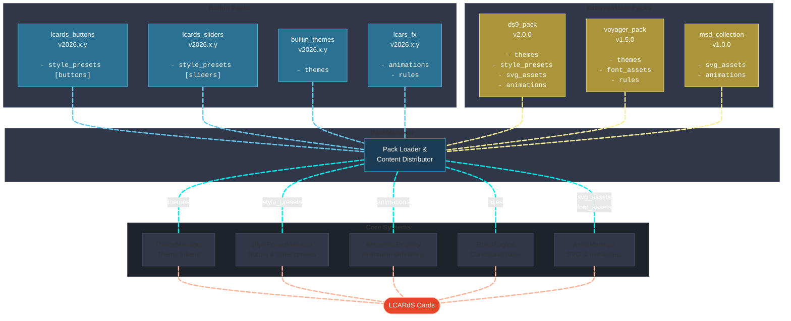

```mermaid
flowchart TB
    subgraph BuiltinPacks["<b>Builtin Packs</b>"]
        P1["lcards_buttons<br/>v2026.x.y<br/><br/><code>- style_presets [buttons]</code>"]:::builtinPacksStyle
        P2["lcards_sliders<br/>v2026.x.y<br/><br/><code>- style_presets [sliders]</code>"]:::builtinPacksStyle
        P3["builtin_themes<br/>v2026.x.y<br/><br/><code>- themes</code>"]:::builtinPacksStyle
        P4["lcars_fx<br/>v2026.x.y<br/><br/><code>- animations<br/>- rules</code>"]:::builtinPacksStyle
    end

    subgraph ExternalPacks["<b>External/User Packs</b>"]
        E1["ds9_pack<br/>v2.0.0<br/><br/><code>- themes<br/>- style_presets<br/>- svg_assets<br/>- animations</code>"]:::externalPacksStyle
        E2["voyager_pack<br/>v1.5.0<br/><br/><code>- themes<br/>- font_assets<br/>- rules</code>"]:::externalPacksStyle
        E3["msd_collection<br/>v1.0.0<br/><br/><code>- svg_assets<br/>- animations</code>"]:::externalPacksStyle
    end

    subgraph PackMgr["<b>PackManager</b>"]
        PM[Pack Loader &<br/>Content Distributor]
    end

    subgraph CoreSystems["<b>Core Systems</b>"]
        TM[ThemeManager<br/>Theme tokens]:::coreStyle
        SPM[StylePresetManager<br/>Button & slider presets]:::coreStyle
        AR[AnimationRegistry<br/>Animation definitions]:::coreStyle
        RE[RulesEngine<br/>Conditional rules]:::coreStyle
        AM[AssetManager<br/>SVG & font assets]:::coreStyle
    end

    P1 0@--- PM
    P2 1@--- PM
    P3 2@--- PM
    P4 3@--- PM
    E1 4@--- PM
    E2 5@--- PM
    E3 6@--- PM

    PM 7@---|themes| TM
    PM 8@---|style_presets| SPM
    PM 9@---|animations| AR
    PM 10@---|rules| RE
    PM 11@---|svg_assets<br/>font_assets| AM

    TM 12@-.- Cards([LCARdS Cards])
    SPM 13@-.- Cards
    AR 14@-.- Cards
    RE 15@-.- Cards
    AM 16@-.- Cards


    0@{ animate: slow }
    1@{ animate: slow }
    2@{ animate: slow }
    3@{ animate: slow }
    4@{ animate: slow }
    5@{ animate: slow }
    6@{ animate: slow }
    7@{ animate: slow }
    8@{ animate: slow }
    9@{ animate: slow }
    10@{ animate: slow }
    11@{ animate: slow }
    12@{ animate: slow }
    13@{ animate: slow }
    14@{ animate: slow }
    15@{ animate: slow }
    16@{ animate: slow }

    linkStyle 0,1,2,3 stroke:#67caf0,stroke-width:3px
    linkStyle 4,5,6 stroke:#f9ef97,stroke-width:3px
    linkStyle 7,8,9,10,11 stroke:#00eeee,stroke-width:3px,color:#fff
    linkStyle 12,13,14,15,16 stroke:#ffb399,stroke-width:3px

    style BuiltinPacks fill:#2f3749,stroke:#52596e
    style ExternalPacks fill:#2f3749,stroke:#52596e
    style CoreSystems fill:#1e2229,stroke:#2f3749
    style Cards fill:#e7442a,stroke:#ffb399,color:#fff
    style PM fill:#1c3c55,stroke:#37a6d1,color:#fff
    style PackMgr fill:#2f3749,stroke:#52596e

    classDef builtinPacksStyle fill:#2a7193,stroke:#67caf0,color:#fff
    classDef externalPacksStyle fill:#ac943b,stroke:#f9ef97,color:#fff
    classDef coreStyle fill:#2f3749,stroke:#52596e
```
