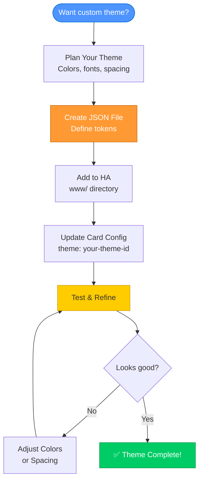
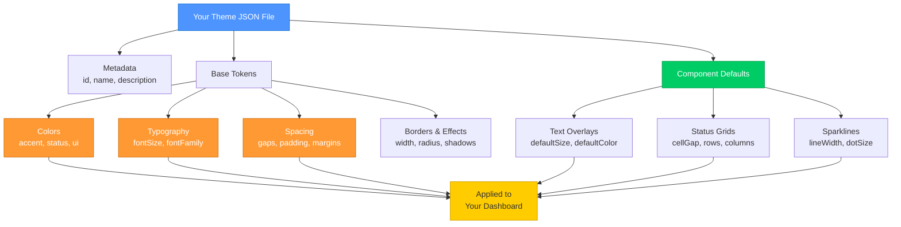

# Creating Custom LCARS Themes - Tutorial

This tutorial will guide you through creating your own custom LCARS theme for the MSD system, from basic concepts to a complete working theme.

## 🎨 Theme Creation Workflow



**Steps Overview:**
1. **Plan** - Decide on colors, fonts, and design goals
2. **Create** - Write JSON file with theme tokens
3. **Register** - Place file in Home Assistant
4. **Configure** - Reference theme in card config
5. **Test** - View and refine your theme

---

## Table of Contents

1. [Prerequisites](#prerequisites)
2. [Understanding Themes](#understanding-themes)
3. [Creating Your First Theme](#creating-your-first-theme)
4. [Testing Your Theme](#testing-your-theme)
5. [Advanced Customization](#advanced-customization)
6. [Examples](#examples)
7. [Troubleshooting](#troubleshooting)

---

## Prerequisites

Before you begin, you should have:

- ✅ LCARdS MSD system installed in Home Assistant
- ✅ Basic understanding of JSON format
- ✅ Text editor for creating theme files
- ✅ Access to Home Assistant's `/local/` directory

**Recommended but optional:**
- Understanding of CSS color values
- Familiarity with LCARS design principles

---

## Understanding Themes

### What is a Theme?

A theme in MSD defines:
- **Colors** - All color values used in overlays
- **Typography** - Font sizes, families, and text styling
- **Spacing** - Gaps, padding, and layout spacing
- **Component Defaults** - Default values for each overlay type

### Theme Structure at a Glance



**Structure Explanation:**
```
Theme
├── Metadata (name, description)
├── Base Tokens
│   ├── Colors
│   ├── Typography
│   ├── Spacing
│   └── Borders/Effects
└── Component Defaults
    ├── Text overlays
    ├── Status grids
    └── Sparklines
```

### Why Use Custom Themes?

- 🎨 **Match your ship's aesthetic** - DS9, Voyager, Enterprise variants
- ♿ **Accessibility** - High contrast, larger fonts
- 🌈 **Personal preference** - Your favorite color scheme
- 🎭 **Mood-based** - Different themes for different times/modes

---

## Creating Your First Theme

Let's create a simple custom theme called "Enterprise-D Blue" with a blue color scheme.

### Step 1: Create the Theme File

Create a new file called `enterprise-d-blue-theme.json` in Home Assistant's `/config/www/` directory:

```json
{
  "id": "my_custom_themes",
  "version": "1.0.0",
  "description": "My custom LCARS themes",
  "themes": {
    "enterprise-d-blue": {
      "id": "enterprise-d-blue",
      "name": "Enterprise-D Blue",
      "description": "Blue-themed LCARS interface inspired by TNG Enterprise-D",
      "tokens": {
        "colors": {
          "accent": {
            "primary": "#5599FF",
            "secondary": "#88BBFF",
            "tertiary": "#AACCFF"
          },
          "status": {
            "success": "#00FF88",
            "warning": "#FFCC00",
            "danger": "#FF4444",
            "info": "#5599FF",
            "unknown": "#888888"
          },
          "ui": {
            "foreground": "#FFFFFF",
            "background": "#000000",
            "border": "#5599FF",
            "disabled": "#555555"
          }
        },
        "typography": {
          "fontSize": {
            "base": 16,
            "sm": 14,
            "lg": 18,
            "xl": 24
          },
          "fontFamily": {
            "primary": "Antonio, Helvetica Neue, sans-serif"
          }
        },
        "spacing": {
          "scale": {
            "4": 8,
            "8": 16
          },
          "gap": {
            "sm": 2,
            "base": 4,
            "lg": 8
          }
        },
        "borders": {
          "width": {
            "base": 2,
            "thin": 1
          },
          "radius": {
            "base": 4,
            "lg": 8
          }
        },
        "components": {
          "statusGrid": {
            "cellGap": 4,
            "textPadding": 10,
            "rows": 3,
            "columns": 4
          },
          "text": {
            "defaultSize": 16,
            "defaultColor": "#FFFFFF"
          }
        }
      }
    }
  }
}
```

### Step 2: Load Your Theme

Add your theme pack to your MSD configuration:

```yaml
msd:
  theme: "enterprise-d-blue"  # Select your custom theme
  use_packs:
    builtin: ['core', 'cb_lcars_buttons']
    external:
      - url: "/local/enterprise-d-blue-theme.json"  # Load your theme pack

  overlays:
    - id: test_text
      type: text
      text: "Enterprise-D Blue Theme"
      position: [100, 100]
```

### Step 3: Reload and Test

1. Save your MSD YAML configuration
2. Reload Home Assistant's Lovelace UI
3. Your custom theme should now be active!

**What you should see:**
- Blue accent colors instead of orange
- Custom spacing and sizing
- Your theme name in debug logs

---

## Testing Your Theme

### Using Browser Developer Tools

Open your browser's developer console and check theme status:

```javascript
// Check if theme loaded
const theme = window.lcards.theme;
console.log('Active theme:', theme.getActiveTheme());
// Should show: { id: 'enterprise-d-blue', name: 'Enterprise-D Blue', ... }

// Check specific token values
console.log('Primary color:', theme.tokens.colors.accent.primary);
// Should show: "#5599FF"

// Test component default
console.log('Grid cell gap:', theme.getDefault('statusGrid', 'cellGap', 0));
// Should show: 4
```

### Visual Testing Checklist

Create test overlays to verify your theme:

```yaml
overlays:
  # Test text overlay
  - id: text_test
    type: text
    text: "Text Test"
    position: [50, 50]
    # Should use your theme's text defaults

  # Test status grid
  - id: grid_test
    type: status_grid
    position: [50, 100]
    size: [200, 150]
    cells:
      - id: cell1
        label: "Test"
    # Should use your theme's grid defaults

  # Test with explicit colors
  - id: color_test
    type: text
    text: "Colored Text"
    position: [50, 300]
    style:
      color: "colors.accent.primary"  # Reference your theme token
```

---

## Advanced Customization

### Using Token References

Token references make your theme more maintainable by allowing tokens to reference other tokens:

```json
{
  "tokens": {
    "colors": {
      "accent": {
        "primary": "#5599FF"
      }
    },
    "components": {
      "statusGrid": {
        "defaultCellColor": "colors.accent.primary"  // References the token above
      }
    }
  }
}
```

**Benefits:**
- Change one color, update all references automatically
- More maintainable and consistent
- Easier to create theme variations

### Example: Smart Token Usage

```json
{
  "tokens": {
    "spacing": {
      "gap": {
        "base": 4,
        "sm": 2,
        "lg": 8
      }
    },
    "components": {
      "statusGrid": {
        "cellGap": "spacing.gap.base",      // Uses base gap
        "textPadding": "spacing.gap.lg"     // Uses larger gap
      },
      "text": {
        "bracket": {
          "gap": "spacing.gap.base"         // Consistent with grid
        }
      }
    }
  }
}
```

### Computed Color Values

Create color variants using color functions:

```json
{
  "tokens": {
    "colors": {
      "accent": {
        "primary": "#5599FF",
        "primaryDark": "darken(colors.accent.primary, 0.2)",
        "primaryLight": "lighten(colors.accent.primary, 0.2)",
        "primaryMuted": "alpha(colors.accent.primary, 0.6)"
      }
    }
  }
}
```

**Available color functions:**
- `darken(color, amount)` - Darken by percentage (0-1)
- `lighten(color, amount)` - Lighten by percentage (0-1)
- `saturate(color, amount)` - Increase saturation
- `desaturate(color, amount)` - Decrease saturation
- `alpha(color, opacity)` - Set opacity (0-1)

### Creating Theme Variants

Create multiple themes in one file:

```json
{
  "id": "my_theme_collection",
  "themes": {
    "enterprise-d-day": {
      "id": "enterprise-d-day",
      "name": "Enterprise-D (Day Mode)",
      "tokens": {
        "colors": {
          "ui": {
            "background": "#1a1a1a",
            "foreground": "#FFFFFF"
          }
        }
      }
    },
    "enterprise-d-night": {
      "id": "enterprise-d-night",
      "name": "Enterprise-D (Night Mode)",
      "tokens": {
        "colors": {
          "ui": {
            "background": "#000000",
            "foreground": "#CCCCCC"
          }
        }
      }
    }
  }
}
```

---

## Examples

### Example 1: High Contrast Accessibility Theme

Perfect for users who need better visibility:

```json
{
  "themes": {
    "high-contrast-lcars": {
      "id": "high-contrast-lcars",
      "name": "LCARS High Contrast",
      "description": "Maximum contrast for accessibility",
      "tokens": {
        "colors": {
          "accent": {
            "primary": "#FFFF00",
            "secondary": "#00FFFF"
          },
          "status": {
            "success": "#00FF00",
            "danger": "#FF0000"
          },
          "ui": {
            "foreground": "#FFFFFF",
            "background": "#000000",
            "border": "#FFFFFF"
          }
        },
        "typography": {
          "fontSize": {
            "base": 20,
            "lg": 24,
            "xl": 32
          },
          "fontWeight": {
            "normal": "bold"
          }
        },
        "borders": {
          "width": {
            "base": 3,
            "thin": 2
          }
        },
        "components": {
          "statusGrid": {
            "textPadding": 16,
            "cellGap": 6
          }
        }
      }
    }
  }
}
```

### Example 2: Voyager Purple Theme

Inspired by USS Voyager's color scheme:

```json
{
  "themes": {
    "voyager-purple": {
      "id": "voyager-purple",
      "name": "USS Voyager Purple",
      "description": "Purple-themed interface inspired by Voyager",
      "tokens": {
        "colors": {
          "accent": {
            "primary": "#BB88FF",
            "secondary": "#8855CC",
            "tertiary": "#CC99FF"
          },
          "status": {
            "success": "#88FF88",
            "warning": "#FFBB00",
            "danger": "#FF6666",
            "info": "#BB88FF"
          },
          "ui": {
            "foreground": "#EECCFF",
            "background": "#000000",
            "border": "#8855CC"
          }
        },
        "components": {
          "statusGrid": {
            "defaultCellColor": "colors.accent.primary",
            "borderColor": "colors.accent.secondary"
          }
        }
      }
    }
  }
}
```

### Example 3: Minimal Modern Theme

Clean, minimal design for modern aesthetics:

```json
{
  "themes": {
    "minimal-modern": {
      "id": "minimal-modern",
      "name": "Minimal Modern LCARS",
      "description": "Clean, minimal LCARS design",
      "tokens": {
        "colors": {
          "accent": {
            "primary": "#0088FF",
            "secondary": "#00AAFF"
          },
          "ui": {
            "foreground": "#FFFFFF",
            "background": "#0A0A0A",
            "border": "#333333"
          }
        },
        "typography": {
          "fontSize": {
            "base": 14,
            "sm": 12
          }
        },
        "spacing": {
          "gap": {
            "base": 2,
            "sm": 1
          }
        },
        "borders": {
          "radius": {
            "base": 2,
            "lg": 4
          },
          "width": {
            "base": 1
          }
        },
        "components": {
          "statusGrid": {
            "cellGap": 1,
            "textPadding": 8
          }
        }
      }
    }
  }
}
```

---

## Troubleshooting

### Theme Not Loading

**Problem:** Theme doesn't appear or defaults are used instead

**Solution:**
```javascript
// Check if theme pack loaded
console.log('Loaded packs:', window.lcards.debug.msd?.pipelineInstance?.config?.__provenance?.merge_order);

// Check theme availability
console.log('Available themes:', window.lcards.theme.listThemes());
```

**Common causes:**
- ❌ Typo in theme ID
- ❌ JSON syntax error (check console for errors)
- ❌ File not in correct directory (`/config/www/`)
- ❌ Theme pack not in `use_packs.external`

### Colors Not Appearing

**Problem:** Custom colors not showing up

**Solution:**
```javascript
// Verify color tokens loaded
console.log('Color tokens:', window.lcards.theme.tokens.colors);

// Check specific color
console.log('Primary color:', window.lcards.theme.tokens.colors.accent.primary);
```

**Common causes:**
- ❌ Token path incorrect (check spelling)
- ❌ CSS color format invalid
- ❌ Token reference not resolving

### Component Defaults Not Applied

**Problem:** Overlays not using theme defaults

**Solution:**
```javascript
// Test component default resolution
console.log('Cell gap:', window.lcards.theme.getDefault('statusGrid', 'cellGap', -1));
// If -1, default not found

// Check component structure
console.log('StatusGrid defaults:', window.lcards.theme.tokens.components.statusGrid);
```

**Common causes:**
- ❌ Component name incorrect (must be camelCase: `statusGrid` not `status_grid`)
- ❌ Property name incorrect
- ❌ Missing `components` section in theme

### JSON Syntax Errors

**Problem:** Theme file won't load due to JSON errors

**Solution:**
- Use a JSON validator (https://jsonlint.com/)
- Check for:
  - Missing commas
  - Extra commas (before closing braces)
  - Missing quotes around strings
  - Unmatched braces `{}`

**Example of common errors:**
```json
// ❌ WRONG - Missing comma
{
  "colors": {
    "primary": "#FF0000"
    "secondary": "#00FF00"
  }
}

// ✅ CORRECT
{
  "colors": {
    "primary": "#FF0000",
    "secondary": "#00FF00"
  }
}
```

---

## Best Practices

### 1. Start Simple

Begin with a minimal theme and add complexity:

```json
{
  "themes": {
    "my-simple-theme": {
      "id": "my-simple-theme",
      "name": "My Simple Theme",
      "tokens": {
        "colors": {
          "accent": { "primary": "#FF9900" }
        },
        "components": {
          "statusGrid": {
            "cellGap": 4
          }
        }
      }
    }
  }
}
```

Test this first, then add more properties.

### 2. Use Token References

Make your theme maintainable:

```json
// ✅ GOOD - Using references
{
  "spacing": {
    "gap": { "base": 4 }
  },
  "components": {
    "statusGrid": {
      "cellGap": "spacing.gap.base"
    }
  }
}

// ❌ BAD - Hardcoding everywhere
{
  "components": {
    "statusGrid": { "cellGap": 4 },
    "text": { "bracket": { "gap": 4 } }
  }
}
```

### 3. Test with Real Overlays

Don't just test in isolation - use your actual dashboard:

```yaml
overlays:
  # Use various overlay types
  - type: text
    # ...
  - type: status_grid
    # ...
  - type: sparkline
    # ...
```

### 4. Keep a Changelog

Document your theme changes:

```json
{
  "themes": {
    "my-theme": {
      "version": "1.1.0",
      "changelog": [
        "1.1.0 - Increased text padding for better readability",
        "1.0.0 - Initial release"
      ]
    }
  }
}
```

---

## Next Steps

Now that you've created your first theme:

1. 📚 **Read the Token Reference Card** - Learn all available tokens
2. 🎨 **Experiment with variants** - Try different color schemes
3. 🔍 **Study built-in themes** - Look at lcarsClassicTokens.js for examples
4. 🚀 **Share your theme** - Consider sharing with the community
5. 🎭 **Create theme packs** - Bundle multiple related themes

---

## Resources

- **Token Reference Card** - Quick lookup for all tokens
- **Theme System Reference** - Complete technical documentation
- **Built-in Themes** - `src/msd/packs/builtin_themes/`
- **Home Assistant Forums** - Share and discuss themes

---

Happy theming! May your LCARS interface be ever vibrant! 🖖✨