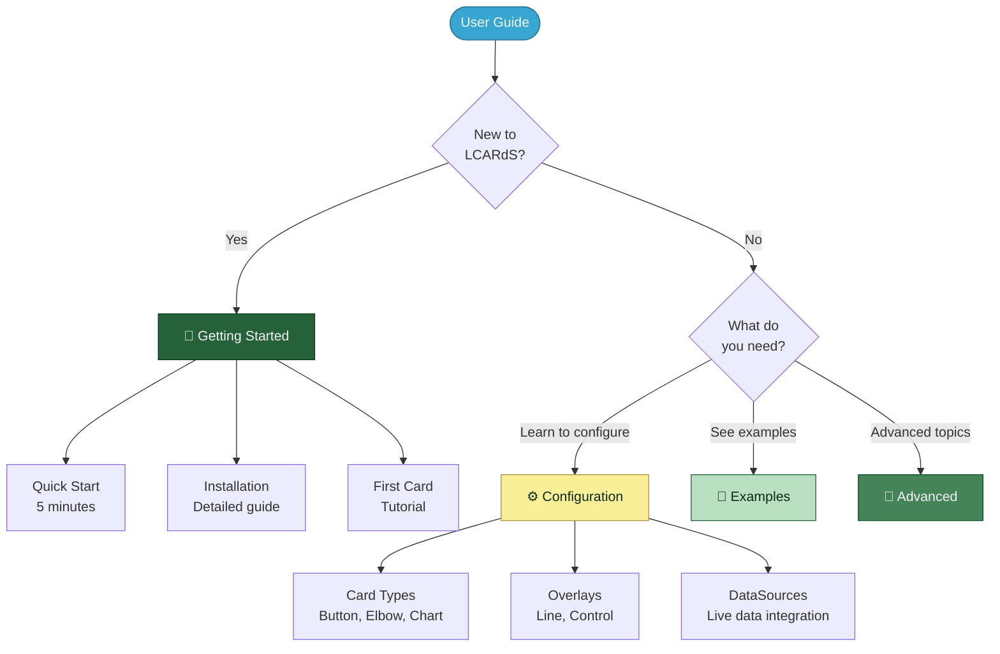

# LCARdS User Guide

> **Complete guide to creating LCARS dashboards**
> Everything you need to build beautiful, functional LCARS interfaces in Home Assistant.

---

## 🎯 Quick Navigation

---

## 🚀 Getting Started

**New to LCARdS?** Start here:

| If you want to... | Go here |
|-------------------|---------|
| ⚡ **Get started fast** | [Quick Start](getting-started/quickstart.md) - 5 minute setup |
| 📦 **Install LCARdS** | [Installation Guide](getting-started/installation.md) - HACS or manual |
| 🎓 **Learn step-by-step** | [First Card Tutorial](getting-started/first-card.md) - Build your first card |

---

## ⚙️ Configuration

Learn how to configure every aspect of LCARdS.

### Card Types

**Native LCARdS cards** for standalone use:

| Card Type | Description | Guide |
|-----------|-------------|-------|
| 🔘 **lcards-button** | SVG-based button card | [Button Reference](configuration/button-quick-reference.md) |
| 🔲 **lcards-elbow** | LCARS elbow/corner designs | [Elbow Reference](configuration/elbow-button-quick-reference.md) |
| 📊 **lcards-chart** | ApexCharts integration | [Chart Guide](configuration/cards/chart.md) |
| 🎚️ **lcards-slider** | Interactive sliders/gauges | Coming soon |
| 🖥️ **lcards-msd-card** | Master Systems Display | [MSD Controls](advanced/msd-controls.md) |

### Overlay System (MSD)

**Overlays** are visual elements on your MSD dashboard:

| Overlay Type | Description | Guide |
|--------------|-------------|-------|
| ➖ **Line** | Connect overlays visually | [Line Overlay](configuration/overlays/line-overlay.md) |
| 🎮 **Control** | Embed any HA card | [Control Overlay](configuration/overlays/control-overlay.md) |

See [Overlay System Guide](configuration/overlays/README.md) for complete overview.

### Data Integration

| Topic | Description | Guide |
|-------|-------------|-------|
| 📡 **DataSources** | Connect to Home Assistant entities | [DataSources](configuration/datasources.md) |
| 🔄 **Transformations** | Process data (50+ conversions) | [Transformations](configuration/datasource-transformations.md) |
| 📊 **Aggregations** | Statistical analysis | [Aggregations](configuration/datasource-aggregations.md) |
| 🧮 **Computed Sources** | Multi-source calculations | [Computed Sources](configuration/computed-sources.md) |

### Rules & Templates

| Topic | Guide |
|-------|-------|
| 📜 **Rules Engine** | [Rules Guide](configuration/rules.md) |
| 📝 **Template Conditions** | [Template Conditions](configuration/template-conditions.md) |
| 🎯 **Bulk Selectors** | [Bulk Overlay Selectors](configuration/bulk-overlay-selectors.md) |

---

## 🎨 Examples

Copy-paste ready configurations:

- **[DataSource Examples](examples/datasource-examples.md)** - Temperature monitoring, power dashboards, environmental sensors

---

## 🔧 Advanced Topics

Deep dives into LCARdS features:

### System Understanding

| Topic | Guide |
|-------|-------|
| 🎨 **Theme Creation** | [Theme Tutorial](advanced/theme_creation_tutorial.md) |
| ⚖️ **Configuration Layers** | [Configuration Layers](advanced/configuration-layers.md) |
| 🎯 **Style Priority** | [Style Priority](advanced/style-priority.md) |
| ✅ **Validation** | [Validation Guide](advanced/validation_guide.md) |
| 🔑 **Theme Tokens** | [Token Reference](advanced/token_reference_card.md) |
| 🎮 **MSD Controls** | [MSD Controls](advanced/msd-controls.md) |
| 🔍 **Console Help** | [Console Reference](advanced/console-help-quick-ref.md) |

---

## 📚 Reference

Detailed reference documentation:

| Topic | Guide |
|-------|-------|
| 🎬 **Animations** | [Animation Guide](guides/animations.md) |
| 🎭 **Animation Presets** | [Animation Presets](reference/animation-presets.md) |
| 📊 **Bar Label Presets** | [Bar Labels](reference/bar-label-presets.md) |
| 🧩 **Component Presets** | [Components](reference/component-presets.md) |
| 🔀 **Segment Animations** | [Segment Guide](reference/segment-animation-guide.md) |
| 📦 **Segment Entity States** | [Entity States](reference/segment-entity-states-quick-reference.md) |
| 🔲 **Segmented Elbow** | [Anatomy Guide](configuration/segmented-elbow-anatomy.md) |
| 🖼️ **SVG Filters** | [SVG Filters](configuration/base-svg-filters.md) |

---

## 📋 All Guides by Directory

### 🚀 Getting Started
- [quickstart.md](getting-started/quickstart.md) - 5-minute setup
- [installation.md](getting-started/installation.md) - Complete installation
- [first-card.md](getting-started/first-card.md) - Tutorial

### ⚙️ Configuration

**Cards:**
- [button-quick-reference.md](configuration/button-quick-reference.md) - Button card
- [elbow-button-quick-reference.md](configuration/elbow-button-quick-reference.md) - Elbow card
- [chart.md](configuration/cards/chart.md) - Chart card

**Overlays:**
- [README.md](configuration/overlays/README.md) - System overview
- [line-overlay.md](configuration/overlays/line-overlay.md) - Line overlays
- [control-overlay.md](configuration/overlays/control-overlay.md) - Control overlays

**Data:**
- [datasources.md](configuration/datasources.md) - Main guide
- [datasource-transformations.md](configuration/datasource-transformations.md) - Transformations
- [datasource-aggregations.md](configuration/datasource-aggregations.md) - Aggregations
- [computed-sources.md](configuration/computed-sources.md) - Computed sources

**Other:**
- [rules.md](configuration/rules.md) - Rules engine
- [template-conditions.md](configuration/template-conditions.md) - Templates
- [bulk-overlay-selectors.md](configuration/bulk-overlay-selectors.md) - Bulk selectors
- [segmented-elbow-anatomy.md](configuration/segmented-elbow-anatomy.md) - Elbow anatomy
- [segmented-elbow-simple-guide.md](configuration/segmented-elbow-simple-guide.md) - Elbow guide
- [base-svg-filters.md](configuration/base-svg-filters.md) - SVG filters

### 🎨 Examples
- [datasource-examples.md](examples/datasource-examples.md) - Data examples

### 🔧 Advanced
- [README.md](advanced/README.md) - Advanced topics hub
- [theme_creation_tutorial.md](advanced/theme_creation_tutorial.md) - Themes
- [configuration-layers.md](advanced/configuration-layers.md) - Configuration layers
- [style-priority.md](advanced/style-priority.md) - Style resolution
- [validation_guide.md](advanced/validation_guide.md) - Validation
- [msd-controls.md](advanced/msd-controls.md) - Controls
- [token_reference_card.md](advanced/token_reference_card.md) - Tokens
- [console-help-quick-ref.md](advanced/console-help-quick-ref.md) - Console help

### 📖 Guides & Reference
- [animations.md](guides/animations.md) - Animations guide
- [animation-presets.md](reference/animation-presets.md) - Animation presets
- [bar-label-presets.md](reference/bar-label-presets.md) - Bar labels
- [component-presets.md](reference/component-presets.md) - Components
- [segment-animation-guide.md](reference/segment-animation-guide.md) - Segment animations
- [segment-entity-states-quick-reference.md](reference/segment-entity-states-quick-reference.md) - Entity states

---

## 🆘 Getting Help

| Problem | Solution |
|---------|----------|
| Card not loading | Check [Installation Guide](getting-started/installation.md) |
| Entity not updating | See [DataSources Guide](configuration/datasources.md) |
| Style not applying | Review [Style Priority](advanced/style-priority.md) |
| YAML errors | Check [Validation Guide](advanced/validation_guide.md) |

**Resources:**
- 📖 **This User Guide** - Comprehensive documentation
- 🏗️ **[Architecture Docs](../architecture/)** - System design (for developers)
- 🐛 **[GitHub Issues](https://github.com/snootched/LCARdS/issues)** - Bug reports, questions

---

**Welcome to LCARdS!** 🖖

Start your journey with the [Quick Start Guide](getting-started/quickstart.md) and build your own LCARS interface today!

---

**Navigation:**
- 🏠 [Main Documentation](../README.md)
- 🏗️ [Architecture Docs](../architecture/)
