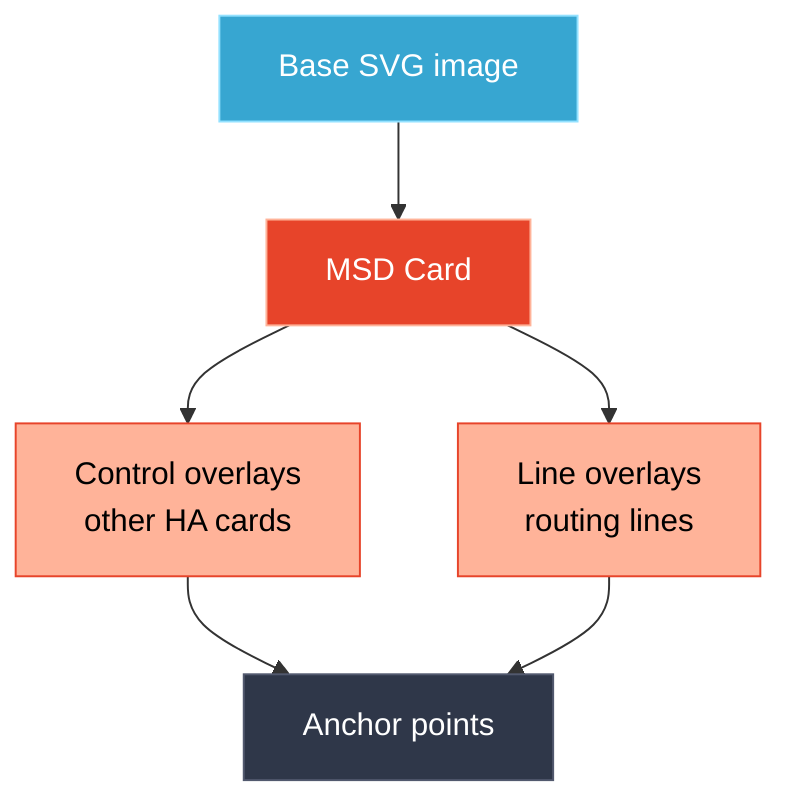

# MSD Card

`custom:lcards-msd`

The Master Systems Display card renders a base SVG image (your ship, floor plan, or any diagram) and overlays interactive controls and animated routing lines on top. It's the centerpiece of an LCARS dashboard.

---

## Concept



The card is best configured through the **MSD Studio Editor** — the visual editor with drag-and-drop overlay placement and live preview.

---

## Quick Start

```yaml
type: custom:lcards-msd
msd:
  base_svg:
    source: builtin:ncc-1701-a-blue
  anchors:
    bridge: [50, 15]
    engineering: [50, 65]
  overlays:
    - id: warp-core
      type: control
      anchor: engineering
      card:
        type: custom:lcards-slider
        entity: input_number.warp_power
        preset: pills-basic
    - id: conn-line
      type: line
      from: bridge
      to: engineering
```

---

## Top-Level Structure

```yaml
type: custom:lcards-msd
id: my-msd               # Optional card ID for rule targeting
tags: [msd, main]        # Optional tags
msd:
  base_svg: ...
  view_box: auto
  anchors: {}
  overlays: []
  routing: {}
  channels: {}
```

---

## `msd.base_svg`

| Option | Type | Description |
|--------|------|-------------|
| `source` | string | SVG source: `builtin:name`, `/local/path.svg`, or `none` |
| `filter_preset` | string | CSS filter preset: `dimmed`, `subtle`, `backdrop`, `faded`, `monochrome`, `none` |
| `filters` | list | Custom CSS/SVG filters |

Built-in SVGs are provided by packs. Browse available options in the card editor.

```yaml
base_svg:
  source: builtin:ncc-1701-a-blue
  filter_preset: dimmed
```

---

## `msd.view_box`

Defines the SVG coordinate system. Use `auto` to extract from the base SVG, or specify manually:

```yaml
view_box: auto               # Extract from base_svg
view_box: [0, 0, 1000, 600]  # [minX, minY, width, height]
```

---

## `msd.anchors`

Named points in SVG coordinates. Overlays and lines reference anchors by name.

```yaml
anchors:
  bridge: [500, 90]
  engineering: [500, 380]
  shuttlebay: [500, 520]
  sickbay: [200, 200]
```

Anchors accept pixel values or percentages:

```yaml
anchors:
  center: ["50%", "50%"]
```

---

## Overlays

Each overlay has a type: `control` or `line`.

### Control Overlays

Embed any HA card positioned by anchor:

```yaml
overlays:
  - id: warp-status
    type: control
    anchor: engineering        # Anchor name (centers the card on this point)
    # Or explicit position:
    # position: [450, 350]
    # size: [200, 80]          # Width x height in px
    card:
      type: custom:lcards-button
      entity: input_boolean.warp_enabled
      preset: lozenge
      text:
        name:
          content: Warp Core
```

> [!NOTE]
> Any HA card type works as a control overlay — not just LCARdS cards.

### Line Overlays

Routing lines between anchor points. Lines are automatically routed to avoid controls.

```yaml
overlays:
  - id: power-line
    type: line
    from: bridge
    to: engineering
    style:
      color: "#FF9900"
      width: 2
```

#### Line Options

| Option | Type | Description |
|--------|------|-------------|
| `from` | string / coords | Start anchor name or `[x, y]` |
| `to` | string / coords | End anchor name or `[x, y]` |
| `route` | string | `auto`, `manhattan`, `smart`, `grid`, `direct`, `manual` |
| `waypoints` | list | Intermediate points `[[x,y], ...]` for manual routing |
| `route_hint` | string | Initial direction: `xy` (horiz first), `yx` (vert first) |
| `corner_style` | string | `miter`, `round`, `bevel` |
| `corner_radius` | number | Rounding radius for round corners |
| `route_channels` | list | Channel IDs this line should use |
| `style.color` | string | Line color |
| `style.width` | number | Line width in px |
| `style.dash` | string | SVG stroke-dasharray |
| `animations` | list | Line animations |

---

## Routing

Global routing settings for all lines:

```yaml
routing:
  default_mode: manhattan      # manhattan | smart | grid | auto
  auto_upgrade_simple_lines: true
  clearance: 10                # Obstacle clearance in px
  smoothing_mode: chaikin      # none | chaikin
  smoothing_iterations: 2
```

---

## Channels

Define routing corridors to bundle or separate lines:

```yaml
channels:
  spine:
    bounds: [480, 100, 40, 400]  # [x, y, width, height]
    mode: prefer                  # prefer | avoid | force
    direction: vertical
    line_spacing: 6               # Gap between bundled lines
```

Lines opt in to a channel with `route_channels: [spine]`.

---

## Examples

### Minimal ship diagram

```yaml
type: custom:lcards-msd
msd:
  base_svg:
    source: builtin:ncc-1701-a-blue
  anchors:
    bridge: [500, 80]
    main: [500, 300]
  overlays:
    - id: alert
      type: control
      anchor: bridge
      card:
        type: custom:lcards-button
        component: alert
        entity: input_select.lcards_alert_mode
    - id: status-line
      type: line
      from: bridge
      to: main
      style:
        color: "{theme:palette.moonlight}"
        width: 1.5
```

### Floor plan with room controls

```yaml
type: custom:lcards-msd
msd:
  base_svg:
    source: /local/floorplan.svg
    filter_preset: dimmed
  view_box: [0, 0, 1200, 800]
  anchors:
    living: [300, 400]
    kitchen: [700, 250]
    bedroom: [1000, 400]
  overlays:
    - id: living-light
      type: control
      anchor: living
      card:
        type: custom:lcards-button
        entity: light.living_room
        preset: lozenge
    - id: kitchen-light
      type: control
      anchor: kitchen
      card:
        type: custom:lcards-button
        entity: light.kitchen
        preset: lozenge
```

---

## Debug Mode

Enable visual debugging to see anchors and routing:

```yaml
msd:
  debug:
    enabled: true
    show_anchors: true
    show_routing: false
```

---

## Related

- [Button card](../button/README.md)
- [Slider card](../slider/README.md)
- [Rules Engine](../../core/rules/README.md)
- [Animations](../../core/animations.md)
