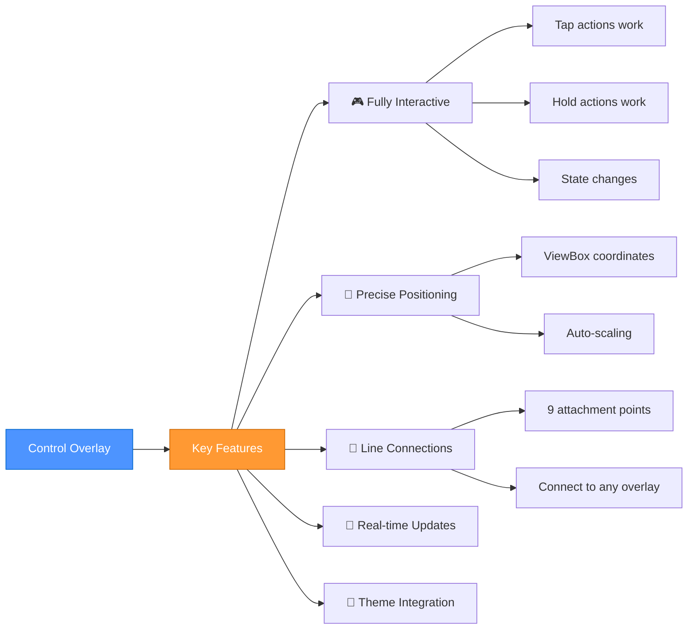
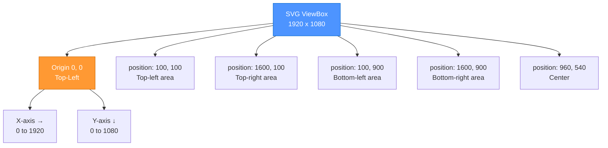
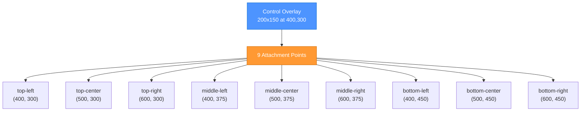
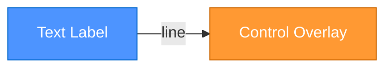
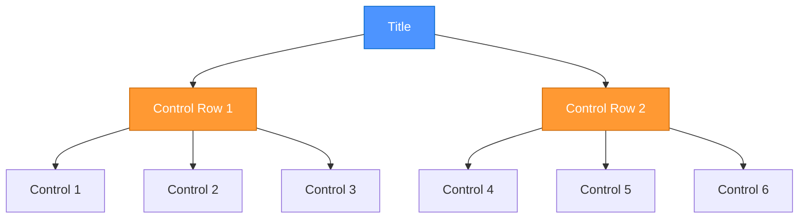

# Control Overlay - Embedding Home Assistant Cards

> **Use any Home Assistant card as an MSD overlay**
> Embed interactive HA cards with full functionality and line connector support

---

## 📋 Table of Contents

1. [Overview](#overview)
2. [Quick Start](#quick-start)
3. [Basic Configuration](#basic-configuration)
4. [Card Types](#card-types)
5. [Positioning & Sizing](#positioning--sizing)
6. [Line Connections](#line-connections)
7. [Advanced Examples](#advanced-examples)
8. [Common Patterns](#common-patterns)
9. [Troubleshooting](#troubleshooting)
10. [Best Practices](#best-practices)

---

## Overview

The **control overlay** type allows you to embed any Home Assistant card (custom or built-in) directly into your MSD canvas. These embedded cards work exactly like they would standalone, but with the added benefit of precise positioning, line connections, and integration with MSD features.

### What You Can Embed

- ✅ **LCARdS Cards** - All LCARdS card types
- ✅ **Custom Cards** - mini-graph-card, apexcharts-card, etc.
- ✅ **Built-in HA Cards** - button, light, entities, gauge, etc.
- ✅ **Complex Cards** - picture-elements, grid, conditional, etc.

### Key Features



---

## Quick Start

### Minimal Example

```yaml
type: custom:lcards-msd-card
  msd:
    overlays:
      - type: control
        id: my_light_control
        card:
          type: button
          config:
            entity: light.living_room
            name: "Living Room"
            show_icon: true
            tap_action:
              action: toggle
        position: [100, 100]
        size: [200, 100]
```

**Result:** A standard Home Assistant button card positioned at coordinates (100, 100) with size 200×100.

---

## Basic Configuration

### Configuration Structure

```mermaid
graph TD
    Overlay[Control Overlay] --> Type[type: control]
    Overlay --> ID[id: unique_id]
    Overlay --> Card[card: ...]
    Overlay --> Pos[position: x, y]
    Overlay --> Size[size: width, height]

    Card --> CardType[type: card-type]
    Card --> CardConfig[config: {...}]

    CardType --> Custom[custom:card-name]
    CardType --> Builtin[built-in-type]

    CardConfig --> Entity[entity]
    CardConfig --> Actions[tap_action, etc.]
    CardConfig --> Options[card-specific options]

    style Overlay fill:#4d94ff,stroke:#0066cc,color:#fff
    style Card fill:#ff9933,stroke:#cc6600,color:#fff
    style CardConfig fill:#00cc66,stroke:#009944,color:#fff
```

### Required Properties

| Property | Type | Description | Example |
|----------|------|-------------|---------|
| `type` | string | Must be `control` | `control` |
| `id` | string | Unique identifier | `light_control_1` |
| `card` | object | Card definition | See below |
| `position` | array | `[x, y]` coordinates | `[100, 200]` |
| `size` | array | `[width, height]` dimensions | `[200, 150]` |

### Optional Properties

| Property | Type | Description | Default |
|----------|------|-------------|---------|
| `z_index` | number | Layering order | `1000` |
| `visible` | boolean | Show/hide overlay | `true` |

---

## Card Types

### LCARdS Cards

Embed any LCARdS button or custom card:

```yaml
- type: control
  id: lcars_button
  card:
    type: custom:lcards-button-card
    config:
      lcards_card_type: lcards-button-lozenge
      show_label: true
      variables:
        label: "WARP DRIVE"
        entity: switch.warp_drive
      tap_action:
        action: toggle
  position: [1200, 120]
  size: [200, 180]
```

**Benefits of LCARdS Cards:**
- Perfect styling match with LCARS theme
- Advanced features like multi-tap actions
- Custom shapes and effects

### Built-in Home Assistant Cards

Use standard HA cards with simplified syntax:

```yaml
# Button Card
- type: control
  id: button_control
  card:
    type: button
    config:
      entity: light.bedroom
      name: "Bedroom"
      icon: mdi:lightbulb
      show_name: true
      show_icon: true
      tap_action:
        action: toggle
  position: [400, 200]
  size: [150, 80]

# Light Card
- type: control
  id: light_control
  card:
    type: light
    config:
      entity: light.kitchen
      name: "Kitchen Light"
  position: [600, 200]
  size: [200, 120]

# Entities Card
- type: control
  id: entities_control
  card:
    type: entities
    config:
      entities:
        - light.living_room
        - light.bedroom
        - light.kitchen
      title: "All Lights"
  position: [100, 400]
  size: [300, 200]
```

### Custom Cards

Embed popular custom cards:

```yaml
# mini-graph-card
- type: control
  id: temp_graph
  card:
    type: custom:mini-graph-card
    config:
      entities:
        - sensor.temperature
      hours_to_show: 24
      line_width: 2
      font_size: 75
  position: [800, 100]
  size: [400, 250]

# apexcharts-card
- type: control
  id: power_chart
  card:
    type: custom:apexcharts-card
    config:
      graph_span: 24h
      series:
        - entity: sensor.power_consumption
          name: Power
      apex_config:
        chart:
          height: 200
  position: [100, 700]
  size: [500, 250]
```

---

## Positioning & Sizing

### Coordinate System

Control overlays use the **MSD viewBox coordinate system** (typically 1920×1080):



### Position Guidelines

```yaml
# Top area
position: [100, 100]    # Top-left
position: [960, 100]    # Top-center
position: [1700, 100]   # Top-right

# Middle area
position: [100, 500]    # Middle-left
position: [960, 500]    # Center
position: [1700, 500]   # Middle-right

# Bottom area
position: [100, 900]    # Bottom-left
position: [960, 900]    # Bottom-center
position: [1700, 900]   # Bottom-right
```

### Sizing Best Practices

| Card Type | Recommended Size | Notes |
|-----------|------------------|-------|
| **Button** | `[150, 80]` | Standard button |
| **Button (large)** | `[200, 120]` | Larger touch target |
| **Light** | `[200, 120]` | With brightness slider |
| **Entities (3-5)** | `[300, 200]` | Small entity list |
| **Entities (6-10)** | `[300, 350]` | Medium list |
| **Graph** | `[400, 250]` | Readable chart |
| **LCARdS Button** | `[200, 180]` | LCARS lozenge |

---

## Line Connections

### 9-Point Attachment System

Control overlays support the same **9-point attachment system** as other overlays:



### Connecting Lines to Controls

```yaml
overlays:
  # Control overlay
  - type: control
    id: light_control
    card:
      type: button
      config:
        entity: light.bedroom
        name: "Bedroom"
    position: [400, 200]
    size: [150, 80]

  # Text label
  - type: text
    id: label
    text: "LIGHTING"
    position: [200, 200]
    size: [150, 40]

  # Line connecting label to control
  - type: line
    id: connector
    anchor_to: label
    anchor_side: middle-right
    attach_to: light_control
    attach_side: middle-left
    style:
      stroke: var(--lcars-blue)
      stroke_width: 2
```

**Result:** A line connects from the right side of the "LIGHTING" label to the left side of the button card.

### Multiple Connections Example

```yaml
overlays:
  # Central control
  - type: control
    id: main_control
    card:
      type: entities
      config:
        entities:
          - light.living_room
          - light.bedroom
          - light.kitchen
        title: "Light Control"
    position: [800, 400]
    size: [300, 200]

  # Status indicators
  - type: text
    id: status_1
    text: "ACTIVE"
    position: [500, 450]

  - type: text
    id: status_2
    text: "ON"
    position: [500, 500]

  - type: text
    id: status_3
    text: "DIM"
    position: [500, 550]

  # Lines from indicators to control
  - type: line
    anchor_to: status_1
    anchor_side: middle-right
    attach_to: main_control
    attach_side: middle-left

  - type: line
    anchor_to: status_2
    anchor_side: middle-right
    attach_to: main_control
    attach_side: middle-left

  - type: line
    anchor_to: status_3
    anchor_side: middle-right
    attach_to: main_control
    attach_side: middle-left
```

---

## Advanced Examples

### Dashboard Panel with Graph and Controls

```yaml
overlays:
  # Panel title
  - type: text
    id: panel_title
    text: "ENVIRONMENTAL CONTROL"
    position: [100, 50]
    style:
      font_size: 24
      color: var(--lcars-orange)

  # Temperature graph
  - type: control
    id: temp_graph
    card:
      type: custom:mini-graph-card
      config:
        entities:
          - sensor.temperature
          - sensor.humidity
        hours_to_show: 12
        line_width: 2
        animate: true
    position: [100, 100]
    size: [600, 300]

  # Climate control card
  - type: control
    id: climate_control
    card:
      type: thermostat
      config:
        entity: climate.living_room
    position: [750, 100]
    size: [300, 300]

  # Quick buttons
  - type: control
    id: fan_button
    card:
      type: button
      config:
        entity: switch.fan
        name: "Fan"
        icon: mdi:fan
        tap_action:
          action: toggle
    position: [1100, 100]
    size: [150, 100]

  - type: control
    id: humidifier_button
    card:
      type: button
      config:
        entity: switch.humidifier
        name: "Humidifier"
        icon: mdi:air-humidifier
        tap_action:
          action: toggle
    position: [1100, 220]
    size: [150, 100]

  # Connecting lines
  - type: line
    anchor_to: panel_title
    anchor_side: bottom-center
    attach_to: temp_graph
    attach_side: top-center

  - type: line
    anchor_to: temp_graph
    anchor_side: middle-right
    attach_to: climate_control
    attach_side: middle-left
```

### LCARS-Style Control Panel

```yaml
overlays:
  # Section header
  - type: button
    id: header
    text: "SHIP SYSTEMS"
    position: [100, 100]
    size: [300, 80]
    style_preset: lcars-header

  # LCARdS control buttons
  - type: control
    id: warp_control
    card:
      type: custom:lcards-button-card
      config:
        lcards_card_type: lcards-button-lozenge
        variables:
          label: "WARP DRIVE"
          entity: switch.warp_drive
        tap_action:
          action: toggle
    position: [100, 200]
    size: [200, 180]

  - type: control
    id: shields_control
    card:
      type: custom:lcards-button-card
      config:
        lcards_card_type: lcards-button-lozenge
        variables:
          label: "SHIELDS"
          entity: switch.shields
        tap_action:
          action: toggle
    position: [320, 200]
    size: [200, 180]

  - type: control
    id: weapons_control
    card:
      type: custom:lcards-button-card
      config:
        lcards_card_type: lcards-button-lozenge
        variables:
          label: "WEAPONS"
          entity: switch.weapons
        tap_action:
          action: toggle
    position: [540, 200]
    size: [200, 180]

  # Status display
  - type: control
    id: status_entities
    card:
      type: entities
      config:
        entities:
          - entity: sensor.warp_speed
            name: "Warp Speed"
          - entity: sensor.shield_strength
            name: "Shield Strength"
          - entity: sensor.weapon_charge
            name: "Weapon Charge"
        title: "System Status"
    position: [100, 400]
    size: [640, 200]
```

---

## Common Patterns

### Pattern 1: Label with Control



```yaml
- type: text
  id: label
  text: "BEDROOM LIGHT"
  position: [100, 200]

- type: control
  id: control
  card:
    type: button
    config:
      entity: light.bedroom
  position: [300, 200]
  size: [150, 80]

- type: line
  anchor_to: label
  attach_to: control
```

### Pattern 2: Control Grid



```yaml
# Title
- type: text
  id: title
  text: "LIGHTING CONTROL"
  position: [100, 50]

# Row 1
- type: control
  id: light_1
  card: { type: button, config: { entity: light.room_1 } }
  position: [100, 120]
  size: [150, 80]

- type: control
  id: light_2
  card: { type: button, config: { entity: light.room_2 } }
  position: [270, 120]
  size: [150, 80]

- type: control
  id: light_3
  card: { type: button, config: { entity: light.room_3 } }
  position: [440, 120]
  size: [150, 80]

# Row 2
- type: control
  id: light_4
  card: { type: button, config: { entity: light.room_4 } }
  position: [100, 220]
  size: [150, 80]

- type: control
  id: light_5
  card: { type: button, config: { entity: light.room_5 } }
  position: [270, 220]
  size: [150, 80]

- type: control
  id: light_6
  card: { type: button, config: { entity: light.room_6 } }
  position: [440, 220]
  size: [150, 80]
```

### Pattern 3: Graph with Status Indicators

```yaml
# Main graph
- type: control
  id: main_graph
  card:
    type: custom:mini-graph-card
    config:
      entities: [sensor.temperature]
  position: [100, 100]
  size: [600, 300]

# Min indicator
- type: text
  id: min_label
  text: "MIN"
  position: [750, 150]

- type: line
  anchor_to: min_label
  attach_to: main_graph
  attach_side: bottom-left

# Max indicator
- type: text
  id: max_label
  text: "MAX"
  position: [750, 250]

- type: line
  anchor_to: max_label
  attach_to: main_graph
  attach_side: top-left

# Current indicator
- type: text
  id: current_label
  text: "NOW"
  position: [750, 350]

- type: line
  anchor_to: current_label
  attach_to: main_graph
  attach_side: middle-right
```

---

## Troubleshooting

### Common Issues

| Issue | Cause | Solution |
|-------|-------|----------|
| **Card not appearing** | Custom card not loaded | Check card is installed in HACS |
| **Card not interactive** | HASS context not applied | Check browser console for errors |
| **Wrong position** | Coordinates outside viewBox | Use values within 0-1920, 0-1080 |
| **Card cut off** | Size too small | Increase `size` dimensions |
| **Lines not connecting** | Wrong overlay ID | Verify `attach_to` matches control `id` |
| **Card styling issues** | Theme conflicts | Check card's theme compatibility |

### Debug Steps

1. **Check Browser Console**
   ```
   Look for: [MsdControlsRenderer] logs
   ```

2. **Verify Card Loading**
   ```javascript
   // In browser console
   customElements.get('mini-graph-card')  // Should return constructor
   ```

3. **Inspect Control Element**
   ```javascript
   // In browser console
   window.lcards.debug.msd.systems.controlsRenderer.controlElements
   ```

4. **Check HASS Context**
   ```javascript
   // In browser console
   window.lcards.debug.msd.systems.controlsRenderer.hass
   ```

5. **View Attachment Points**
   - Enable debug mode
   - Look for red dots showing attachment points

---

## Best Practices

### ✅ Do's

- ✅ Use descriptive IDs (`temp_graph` not `control1`)
- ✅ Group related controls visually
- ✅ Use consistent sizing for similar controls
- ✅ Test interactivity after adding controls
- ✅ Use line connections to show relationships
- ✅ Choose appropriate card types for your data
- ✅ Keep control sizes reasonable (not too small)

### ❌ Don'ts

- ❌ Don't overlap controls (unless intentional)
- ❌ Don't make controls too small to interact with
- ❌ Don't use complex cards for simple tasks
- ❌ Don't forget to set `entity` in card config
- ❌ Don't use identical IDs for different controls
- ❌ Don't position controls outside viewBox
- ❌ Don't skip testing tap actions

### Performance Tips

- Keep control count reasonable (<20 per canvas)
- Use simpler cards when possible
- Avoid heavy animations in embedded cards
- Test on target devices (mobile, tablets)
- Monitor memory usage with many controls

---

## Summary

Control overlays provide a powerful way to integrate Home Assistant cards into your MSD canvas. Key points:

- **Any HA Card Works** - Custom or built-in
- **Precise Positioning** - ViewBox coordinate system
- **Full Interactivity** - All actions work normally
- **Line Connections** - 9-point attachment system
- **Easy Configuration** - Familiar card syntax

Start with simple button cards, then progress to graphs, entities, and complex layouts as you become comfortable with positioning and connections.

---

**Related Documentation:**
- [Line Overlay](line-overlay.md) - Connecting overlays with lines
- [Button Overlay](button-overlay.md) - Native MSD buttons
- [Text Overlay](text-overlay.md) - Labels and indicators
- [Architecture: Control System](../../architecture/subsystems/control-overlay-system.md) - Technical details
