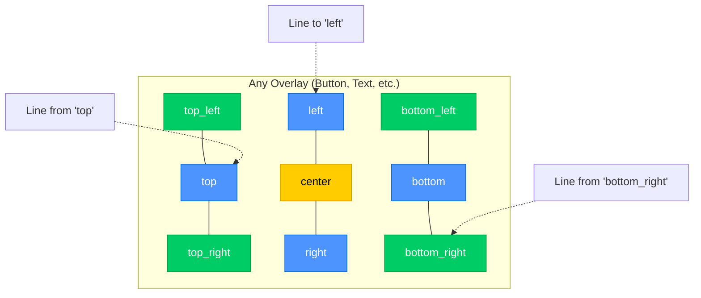
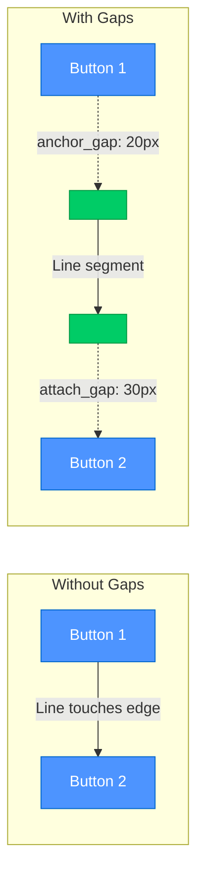
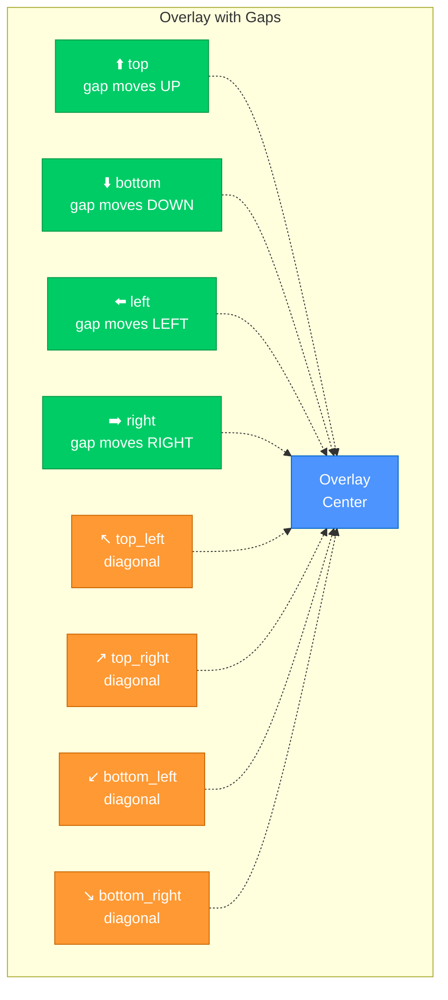

# Line Overlay Configuration Guide

> **Connect overlays with lines for visual relationships**
> Draw lines between overlays using automatic or manual routing with precise control over attachment points and gaps.

---

## 📋 Table of Contents

1. [Overview](#overview)
2. [Quick Start](#quick-start)
3. [Core Configuration](#core-configuration)
4. [Attachment Points](#attachment-points)
5. [Gap System](#gap-system)
6. [Routing Modes](#routing-modes)
7. [Styling](#styling)
8. [Advanced Features](#advanced-features)
9. [Complete Property Reference](#complete-property-reference)
10. [Real-World Examples](#real-world-examples)
11. [Troubleshooting](#troubleshooting)

---

## Overview

The **Line Overlay** connects other overlays with visual lines, creating diagrams, flowcharts, and visual relationships in your dashboard.

✅ **Flexible attachment** - Connect to any side of any overlay
✅ **Automatic routing** - Smart pathfinding around obstacles
✅ **Gap system** - Precise control over line offsets (anchor_gap, attach_gap)
✅ **Multiple routing modes** - Auto, direct, orthogonal, curved
✅ **Rich styling** - Colors, widths, dashes, arrows, animations
✅ **DataSource integration** - Dynamic styling based on data
✅ **Auto-attach** - Automatically determines best attachment sides
✅ **Virtual anchors** - Pre-computed attachment points with gap offsets

### When to Use Line Overlays

- **Flowcharts** - Connect process steps or decision points
- **System diagrams** - Show relationships between components
- **Status connections** - Visual links between related sensors
- **Navigation paths** - Guide user attention between UI elements
- **Data flow** - Illustrate how data moves through system

---

## Quick Start

### Minimal Configuration

The absolute minimum needed to connect two overlays:

```yaml
overlays:
  - id: control1
    type: control
    position: [100, 100]
    size: [120, 40]
    card:
      type: custom:lcards-button-card
      entity: light.living_room

  - id: control2
    type: control
    position: [300, 100]
    size: [120, 40]
    card:
      type: custom:lcards-button-card
      entity: light.kitchen

  - id: line1
    type: line
    anchor: control1          # Source overlay
    attach_to: control2       # Destination overlay
```

**Result:** A line connecting control1 to control2 with automatic routing.

### With Gaps

Add spacing from overlay edges:

```yaml
overlays:
  - id: line_with_gaps
    type: line
    anchor: control1
    anchor_gap: 20           # 20px offset from control1
    attach_to: control2
    attach_gap: 20           # 20px offset from button2
    style:
      stroke: var(--lcars-orange)
      stroke-width: 2
```

**Result:** Line with 20px spacing on both ends.

### Specific Sides

Control which sides to attach to:

```yaml
overlays:
  - id: line_specific_sides
    type: line
    anchor: button1
    anchor_side: right       # Connect to right side of button1
    attach_to: button2
    attach_side: left        # Connect to left side of button2
    route: direct            # Straight line
    style:
      stroke: var(--lcars-blue)
      stroke-width: 3
```

**Result:** Straight line from right of button1 to left of button2.

---

## Core Configuration

### Attachment Point System

Every overlay has **9 attachment points** where lines can connect:



**Available Sides:**
- **Edges**: `top`, `bottom`, `left`, `right`
- **Corners**: `top_left`, `top_right`, `bottom_left`, `bottom_right`
- **Center**: `center` (middle of overlay)

**Auto-determination:** If you don't specify sides, LCARdS automatically picks the closest sides between overlays.

### Required Properties

Every line overlay must have these properties:

| Property | Type | Description | Example |
|----------|------|-------------|---------|
| `id` | string | Unique identifier | `"line1"` |
| `type` | string | Must be `"line"` | `"line"` |
| `anchor` | string | Source overlay ID | `"button1"` |
| `attach_to` | string | Destination overlay ID | `"button2"` |

### Optional Core Properties

| Property | Type | Description | Default |
|----------|------|-------------|---------|
| `anchor_side` | string | Source attachment side | Auto-determined |
| `attach_side` | string | Destination attachment side | Auto-determined |
| `anchor_gap` | number | Offset from source (px) | `0` |
| `attach_gap` | number | Offset from destination (px) | `0` |
| `route` | string | Routing mode | `"auto"` |

### Basic Example

```yaml
overlays:
  - id: connection_line
    type: line
    anchor: source_button
    anchor_side: right
    anchor_gap: 15
    attach_to: dest_button
    attach_side: left
    attach_gap: 15
    route: auto
    style:
      stroke: var(--lcars-white)
      stroke-width: 2
```

---

## Attachment Points

Line overlays attach to specific **sides** of overlays. The attachment point system automatically calculates the best connection point on each side.

### Available Sides

Lines can attach to any side of an overlay:

| Side | Description | Center Point |
|------|-------------|--------------|
| `left` | Left edge | Middle of left side |
| `right` | Right edge | Middle of right side |
| `top` | Top edge | Middle of top side |
| `bottom` | Bottom edge | Middle of bottom side |
| `center` | Center point | Exact center of overlay |

### Auto-Attach

If you omit `anchor_side` or `attach_side`, the system **automatically determines** the best sides based on overlay positions:

```yaml
overlays:
  - id: auto_line
    type: line
    anchor: button1
    # anchor_side: auto-determined based on positions
    attach_to: button2
    # attach_side: auto-determined based on positions
```

**How auto-attach works:**
1. Calculates vector between overlay centers
2. Determines which sides are closest
3. Chooses sides that create shortest path

### Manual Attachment

For precise control, specify both sides:

```yaml
overlays:
  - id: manual_line
    type: line
    anchor: button1
    anchor_side: bottom      # Force bottom of button1
    attach_to: button2
    attach_side: top         # Force top of button2
```

### Attachment Point Examples

```yaml
# Horizontal connection (left to right)
- id: horizontal
  type: line
  anchor: source
  anchor_side: right
  attach_to: dest
  attach_side: left

# Vertical connection (top to bottom)
- id: vertical
  type: line
  anchor: source
  anchor_side: bottom
  attach_to: dest
  attach_side: top

# Diagonal connection
- id: diagonal
  type: line
  anchor: source
  anchor_side: bottom-right  # Corner attachment
  attach_to: dest
  attach_side: top-left

# To center
- id: to_center
  type: line
  anchor: source
  anchor_side: right
  attach_to: dest
  attach_side: center        # Connect to exact center
```

---

## Gap System

The **gap system** provides precise control over line offsets from overlay edges using `anchor_gap` and `attach_gap`.

### How Gaps Work



**Gap Behavior:**
- **`anchor_gap`**: Pushes line **away from** source overlay
- **`attach_gap`**: Pulls line **away from** destination overlay
- **Direction**: Always moves outward/perpendicular from attachment side
- **Units**: Pixels (px)

### Gap Direction by Side



### Overview

- **`anchor_gap`**: Offset at the **source** (starting point) of the line
- **`attach_gap`**: Offset at the **destination** (ending point) of the line

Both gaps are specified in **pixels** and move the line **away** from the overlay.

### Visual Example

```
Without gaps:
┌─────────┐                    ┌─────────┐
│ button1 ├────────────────────┤ button2 │
└─────────┘                    └─────────┘

With anchor_gap: 20, attach_gap: 30:
┌─────────┐                          ┌─────────┐
│ button1 │   ─────────────────────  │ button2 │
└─────────┘                          └─────────┘
          ^20px                   30px^
```

### Basic Gap Usage

```yaml
overlays:
  - id: gap_line
    type: line
    anchor: button1
    anchor_gap: 20           # 20px from button1
    attach_to: button2
    attach_gap: 30           # 30px from button2
```

### Directional Behavior

Gaps move **outward** from the overlay based on the attachment side:

| Side | Gap Direction |
|------|---------------|
| `left` | Leftward (negative X) |
| `right` | Rightward (positive X) |
| `top` | Upward (negative Y) |
| `bottom` | Downward (positive Y) |

**Example:**
```yaml
- id: button1
  type: button
  position: [100, 100]
  size: [200, 50]

- id: gap_example
  type: line
  anchor: button1
  anchor_side: right       # Attaches to right side
  anchor_gap: 30           # 30px to the RIGHT (away from button)
  attach_to: button2
```

### Asymmetric Gaps

For different horizontal and vertical offsets:

```yaml
overlays:
  - id: asymmetric_line
    type: line
    anchor: button1
    anchor_gap_x: 30         # 30px horizontal offset
    anchor_gap_y: 10         # 10px vertical offset
    attach_to: button2
    attach_gap_x: 20
    attach_gap_y: 15
```

**Note:** `anchor_gap_x` and `anchor_gap_y` override `anchor_gap` for their respective axes.

### Gap Use Cases

#### 1. Visual Breathing Room
```yaml
anchor_gap: 10
attach_gap: 10
# Creates clean spacing around line connections
```

#### 2. Connector Dots/Arrows
```yaml
anchor_gap: 15    # Room for decorative endpoint elements
attach_gap: 15
```

#### 3. Multi-Line Offsets
```yaml
# Parallel lines with different gaps
- id: line1
  anchor_gap: 10
  attach_gap: 10

- id: line2
  anchor_gap: 20   # Further offset
  attach_gap: 20
```

#### 4. Status Indicators
```yaml
# Clear of status indicator on button
anchor_side: left
anchor_gap: 35    # Clear of 30px status indicator + 5px padding
```

### Complete Gap Example

```yaml
overlays:
  - id: source
    type: button
    position: [100, 100]
    size: [160, 60]
    label: "SOURCE"
    style:
      color: var(--lcars-orange)
      lcars_corners: true

  - id: dest
    type: button
    position: [400, 200]
    size: [160, 60]
    label: "DESTINATION"
    style:
      color: var(--lcars-blue)
      lcars_corners: true

  - id: connection
    type: line
    anchor: source
    anchor_side: right
    anchor_gap: 25           # 25px from source button
    attach_to: dest
    attach_side: left
    attach_gap: 25           # 25px from dest button
    route: auto
    style:
      stroke: var(--lcars-white)
      stroke-width: 2
      stroke-dasharray: "5,5"
```

---

## Routing Modes

Lines support multiple routing algorithms to control path generation.

```mermaid
graph TD
    A[Source Overlay]
    B[Destination Overlay]

    subgraph "Direct"
        A1[A] ---|Straight line| B1[B]
    end

    subgraph "Orthogonal"
        A2[A] -->|Right angle| Mid1[ ]
        Mid1 -->|Right angle| B2[B]
    end

    subgraph "Auto"
        A3[A] -.->|Finds best path| Avoid[Avoids obstacles]
        Avoid -.-> B3[B]
    end

    subgraph "Curved"
        A4[A] ~~~|Smooth bezier| B4[B]
    end

    style A1 fill:#4d94ff,stroke:#0066cc,color:#fff
    style A2 fill:#4d94ff,stroke:#0066cc,color:#fff
    style A3 fill:#4d94ff,stroke:#0066cc,color:#fff
    style A4 fill:#4d94ff,stroke:#0066cc,color:#fff
    style B1 fill:#00cc66,stroke:#009944,color:#fff
    style B2 fill:#00cc66,stroke:#009944,color:#fff
    style B3 fill:#00cc66,stroke:#009944,color:#fff
    style B4 fill:#00cc66,stroke:#009944,color:#fff
```



### Available Modes

| Mode | Description | Use Case |
|------|-------------|----------|
| `auto` | Smart pathfinding with obstacle avoidance | General connections |
| `direct` | Straight line between points | Simple, clear relationships |
| `orthogonal` | Right-angle turns only | Flowcharts, diagrams |
| `curved` | Smooth bezier curves | Organic, flowing connections |

### Auto Routing (Default)

Intelligent pathfinding that avoids overlays:

```yaml
route: auto              # Default if omitted
```

**Features:**
- Automatically routes around obstacles
- Finds shortest valid path
- Respects overlay boundaries
- Dynamic recalculation on layout changes

### Direct Routing

Straight line from source to destination:

```yaml
route: direct
```

**Best for:**
- Simple connections
- When no obstacles between points
- Emphasizing direct relationships

### Orthogonal Routing

Right-angle (90°) turns only:

```yaml
route: orthogonal
```

**Best for:**
- Technical diagrams
- Flowcharts
- Circuit-like layouts
- Clean, professional appearance

### Curved Routing

Smooth bezier curves:

```yaml
route: curved
```

**Best for:**
- Organic, flowing designs
- Reducing visual clutter
- Artistic layouts

### Routing Examples

```yaml
overlays:
  # Auto routing (smart pathfinding)
  - id: auto_line
    type: line
    anchor: button1
    attach_to: button2
    route: auto
    style:
      stroke: var(--lcars-blue)
      stroke-width: 2

  # Direct line (straight)
  - id: direct_line
    type: line
    anchor: button3
    attach_to: button4
    route: direct
    style:
      stroke: var(--lcars-orange)
      stroke-width: 2

  # Orthogonal (right angles)
  - id: ortho_line
    type: line
    anchor: button5
    attach_to: button6
    route: orthogonal
    style:
      stroke: var(--lcars-green)
      stroke-width: 2

  # Curved (bezier)
  - id: curved_line
    type: line
    anchor: button7
    attach_to: button8
    route: curved
    style:
      stroke: var(--lcars-purple)
      stroke-width: 2
```

---

## Styling

Line overlays support comprehensive SVG styling options.

### Basic Styling

```yaml
style:
  stroke: var(--lcars-orange)    # Line color
  stroke-width: 2                # Line thickness
  opacity: 1.0                   # Transparency (0-1)
```

### Stroke Styles

#### Solid Lines
```yaml
style:
  stroke: var(--lcars-blue)
  stroke-width: 3
```

#### Dashed Lines
```yaml
style:
  stroke-dasharray: "5,5"        # 5px dash, 5px gap
  # or
  stroke-dasharray: "10,3,3,3"   # Complex pattern
```

#### Dotted Lines
```yaml
style:
  stroke-dasharray: "2,4"        # Small dots with spacing
  stroke-linecap: round          # Rounded dots
```

### Line Caps & Joins

```yaml
style:
  stroke-linecap: round          # round, square, butt
  stroke-linejoin: round         # round, miter, bevel
```

**Line caps (endpoints):**
- `round` - Rounded ends
- `square` - Square extends beyond endpoint
- `butt` - Flat at exact endpoint (default)

**Line joins (corners):**
- `round` - Rounded corners
- `miter` - Sharp corners (default)
- `bevel` - Beveled corners

### Arrows & Markers

Line overlays support rich marker configuration with multiple shapes, custom sizing, and independent fill/stroke colors:

```yaml
style:
  marker_start:
    type: arrow              # Shape type
    size: medium             # small | medium | large | custom
    fill: '#ff6600'          # Fill color (optional, inherits line color)
    stroke: '#000000'        # Outline color (optional)
    stroke_width: 1          # Outline thickness (optional)

  marker_end:
    type: dot
    size: large
    fill: 'var(--lcars-orange)'
```

**Available marker types:**
- `arrow` - Filled triangle pointing in line direction
- `dot` - Filled circle
- `diamond` - Filled diamond shape
- `square` - Filled square
- `triangle` - Filled triangle (pointing forward)
- `line` - Orthogonal line (perpendicular bar)
- `rect` - Outlined rectangle (stroke only, no fill)

**Size presets:**
- `small`: 4px viewBox
- `medium`: 6px viewBox (default)
- `large`: 10px viewBox
- `custom`: Use `custom_size` property for pixel-based sizing

**Custom size example:**
```yaml
style:
  marker_end:
    type: arrow
    size: custom
    custom_size: 15          # 15px marker
    fill: 'var(--lcars-red)'
    stroke: '#000'
    stroke_width: 2
```

**Color properties:**
- `fill`: Primary marker color (defaults to line color if not specified)
- `stroke`: Optional outline color (defaults to 'none')
- `stroke_width`: Outline thickness in pixels (defaults to 0)

**Note:** The `line` and `rect` marker types are particularly useful for creating terminal indicators or boundary markers in technical diagrams.

### Colors

```yaml
style:
  # LCARS theme colors
  stroke: var(--lcars-orange)
  # or hex
  stroke: "#FF9900"
  # or rgb
  stroke: "rgb(255, 153, 0)"
  # or rgba (with transparency)
  stroke: "rgba(255, 153, 0, 0.8)"
```

### Gradients

Create gradient lines:

```yaml
style:
  stroke: url(#lineGradient)
  stroke-width: 3

# Define gradient in defs
defs:
  - id: lineGradient
    type: linearGradient
    x1: "0%"
    y1: "0%"
    x2: "100%"
    y2: "0%"
    stops:
      - offset: "0%"
        color: var(--lcars-orange)
      - offset: "100%"
        color: var(--lcars-red)
```

### Glow Effects

Add glow to lines:

```yaml
style:
  stroke: var(--lcars-blue)
  stroke-width: 2
  filter: url(#glow)

# Define glow filter
defs:
  - id: glow
    type: filter
    content: |
      <feGaussianBlur stdDeviation="2" result="coloredBlur"/>
      <feMerge>
        <feMergeNode in="coloredBlur"/>
        <feMergeNode in="SourceGraphic"/>
      </feMerge>
```

### Complete Styling Example

```yaml
overlays:
  - id: styled_line
    type: line
    anchor: source
    anchor_gap: 20
    attach_to: dest
    attach_gap: 20
    route: auto
    style:
      # Basic styling
      stroke: var(--lcars-orange)
      stroke-width: 3
      opacity: 0.9

      # Dashed pattern
      stroke-dasharray: "8,4"

      # Rounded ends and corners
      stroke-linecap: round
      stroke-linejoin: round

      # Arrow at end
      marker-end: url(#arrow)
```

---

## Advanced Features

### DataSource Integration

Make line styling dynamic based on data:

```yaml
data_sources:
  connection_status:
    type: entity
    entity: binary_sensor.connection_active

overlays:
  - id: dynamic_line
    type: line
    anchor: source
    attach_to: dest
    style:
      # Color based on status
      stroke: >
        {connection_status == 'on' ?
         'var(--lcars-green)' :
         'var(--lcars-red)'}

      # Width based on status
      stroke-width: >
        {connection_status == 'on' ? 3 : 1}

      # Solid when active, dashed when inactive
      stroke-dasharray: >
        {connection_status == 'on' ?
         'none' :
         '5,5'}
```

### Animated Lines

Create animated dashed lines:

```yaml
style:
  stroke-dasharray: "10,5"
  animation: dash 1s linear infinite

# CSS animation
animations:
  dash:
    keyframes:
      from:
        stroke-dashoffset: 0
      to:
        stroke-dashoffset: 15
```

### Multi-Segment Lines

Create lines with multiple waypoints:

```yaml
overlays:
  - id: multi_segment
    type: line
    points:
      - anchor: button1
        side: right
      - waypoint: [300, 150]
      - waypoint: [300, 250]
      - attach_to: button2
        side: left
    style:
      stroke: var(--lcars-blue)
      stroke-width: 2
```

### Conditional Lines

Show/hide lines based on conditions:

```yaml
overlays:
  - id: conditional_line
    type: line
    anchor: source
    attach_to: dest
    conditions:
      - entity: binary_sensor.show_connection
        state: "on"
    style:
      stroke: var(--lcars-orange)
```

---

## Complete Property Reference

### Line Overlay Schema

```yaml
overlays:
  - id: string                    # Required: Unique identifier
    type: line                    # Required: Must be "line"
    anchor: string                # Required: Source overlay ID
    attach_to: string             # Required: Destination overlay ID

    # Attachment Configuration
    anchor_side: string           # Optional: Source side (default: auto)
    attach_side: string           # Optional: Destination side (default: auto)

    # Gap System
    anchor_gap: number            # Optional: Source offset in pixels (default: 0)
    attach_gap: number            # Optional: Destination offset in pixels (default: 0)
    anchor_gap_x: number          # Optional: Source horizontal offset
    anchor_gap_y: number          # Optional: Source vertical offset
    attach_gap_x: number          # Optional: Destination horizontal offset
    attach_gap_y: number          # Optional: Destination vertical offset

    # Routing
    route: string                 # Optional: Routing mode (default: "auto")
                                  # Options: auto, direct, orthogonal, curved

    # Styling
    style:                        # Optional styling
      # Basic Stroke
      stroke: string              # Line color (default: var(--lcars-white))
      stroke-width: number        # Line thickness (default: 2)
      opacity: number             # Transparency 0-1 (default: 1.0)

      # Stroke Pattern
      stroke-dasharray: string    # Dash pattern (default: none)
      stroke-dashoffset: number   # Dash pattern offset (default: 0)

      # Line Caps & Joins
      stroke-linecap: string      # Cap style: round, square, butt (default: butt)
      stroke-linejoin: string     # Join style: round, miter, bevel (default: miter)
      stroke-miterlimit: number   # Miter limit (default: 4)

      # Markers
      marker-start: string        # Start marker: url(#id)
      marker-mid: string          # Middle markers: url(#id)
      marker-end: string          # End marker: url(#id)

      # Effects
      filter: string              # SVG filter: url(#id)

      # Animation
      animation: string           # CSS animation
      transition: string          # CSS transition
```

### Available Sides

```yaml
# Standard sides
anchor_side: left
anchor_side: right
anchor_side: top
anchor_side: bottom
anchor_side: center

# Corner sides
anchor_side: top-left
anchor_side: top-right
anchor_side: bottom-left
anchor_side: bottom-right
```

### Routing Modes

```yaml
route: auto          # Smart pathfinding (default)
route: direct        # Straight line
route: orthogonal    # Right-angle turns
route: curved        # Bezier curves
```

---

## Real-World Examples

### Example 1: Simple Flowchart

```yaml
overlays:
  # Start node
  - id: start_node
    type: button
    position: [100, 100]
    size: [120, 50]
    label: "START"
    style:
      color: var(--lcars-green)
      lcars_corners: true

  # Process node
  - id: process_node
    type: button
    position: [100, 200]
    size: [120, 50]
    label: "PROCESS"
    style:
      color: var(--lcars-blue)
      lcars_corners: true

  # End node
  - id: end_node
    type: button
    position: [100, 300]
    size: [120, 50]
    label: "END"
    style:
      color: var(--lcars-red)
      lcars_corners: true

  # Connections
  - id: line1
    type: line
    anchor: start_node
    anchor_side: bottom
    anchor_gap: 10
    attach_to: process_node
    attach_side: top
    attach_gap: 10
    route: direct
    style:
      stroke: var(--lcars-white)
      stroke-width: 2
      marker-end: url(#arrow)

  - id: line2
    type: line
    anchor: process_node
    anchor_side: bottom
    anchor_gap: 10
    attach_to: end_node
    attach_side: top
    attach_gap: 10
    route: direct
    style:
      stroke: var(--lcars-white)
      stroke-width: 2
      marker-end: url(#arrow)
```

### Example 2: System Diagram

```yaml
data_sources:
  server_status:
    type: entity
    entity: binary_sensor.server_online

  database_status:
    type: entity
    entity: binary_sensor.database_online

overlays:
  # Server
  - id: server
    type: button
    position: [100, 100]
    size: [140, 60]
    label: "SERVER"
    content: "{server_status == 'on' ? 'ONLINE' : 'OFFLINE'}"
    style:
      color: var(--lcars-blue)

  # Database
  - id: database
    type: button
    position: [400, 100]
    size: [140, 60]
    label: "DATABASE"
    content: "{database_status == 'on' ? 'ONLINE' : 'OFFLINE'}"
    style:
      color: var(--lcars-orange)

  # Dynamic connection
  - id: connection
    type: line
    anchor: server
    anchor_side: right
    anchor_gap: 20
    attach_to: database
    attach_side: left
    attach_gap: 20
    route: auto
    style:
      # Green when both online, red otherwise
      stroke: >
        {server_status == 'on' && database_status == 'on' ?
         'var(--lcars-green)' :
         'var(--lcars-red)'}
      stroke-width: 3

      # Solid when active, dashed when inactive
      stroke-dasharray: >
        {server_status == 'on' && database_status == 'on' ?
         'none' :
         '5,5'}

      marker-end: url(#arrow)
```

### Example 3: Multi-Path Router

```yaml
overlays:
  # Central hub
  - id: hub
    type: button
    position: [300, 200]
    size: [100, 100]
    label: "HUB"
    style:
      color: var(--lcars-purple)
      lcars_corners: true

  # Connected nodes
  - id: node1
    type: button
    position: [100, 50]
    size: [80, 40]
    label: "NODE 1"

  - id: node2
    type: button
    position: [500, 50]
    size: [80, 40]
    label: "NODE 2"

  - id: node3
    type: button
    position: [100, 350]
    size: [80, 40]
    label: "NODE 3"

  - id: node4
    type: button
    position: [500, 350]
    size: [80, 40]
    label: "NODE 4"

  # Lines to hub
  - id: line1
    type: line
    anchor: node1
    anchor_gap: 10
    attach_to: hub
    attach_gap: 10
    route: auto
    style:
      stroke: var(--lcars-blue)
      stroke-width: 2

  - id: line2
    type: line
    anchor: node2
    anchor_gap: 10
    attach_to: hub
    attach_gap: 10
    route: auto
    style:
      stroke: var(--lcars-green)
      stroke-width: 2

  - id: line3
    type: line
    anchor: node3
    anchor_gap: 10
    attach_to: hub
    attach_gap: 10
    route: auto
    style:
      stroke: var(--lcars-orange)
      stroke-width: 2

  - id: line4
    type: line
    anchor: node4
    anchor_gap: 10
    attach_to: hub
    attach_gap: 10
    route: auto
    style:
      stroke: var(--lcars-red)
      stroke-width: 2
```

### Example 4: Network Topology

```yaml
data_sources:
  router_traffic:
    type: entity
    entity: sensor.router_throughput
    transformations:
      - type: unit_conversion
        conversion: "bytes_to_mbps"
        key: "mbps"

overlays:
  # Internet
  - id: internet
    type: button
    position: [50, 100]
    size: [120, 50]
    label: "INTERNET"
    style:
      color: var(--lcars-blue)

  # Router
  - id: router
    type: button
    position: [250, 100]
    size: [120, 50]
    label: "ROUTER"
    content: "{router_traffic.transformations.mbps:.0f} Mbps"
    style:
      color: var(--lcars-orange)

  # Switch
  - id: switch
    type: button
    position: [450, 100]
    size: [120, 50]
    label: "SWITCH"
    style:
      color: var(--lcars-green)

  # Devices
  - id: device1
    type: button
    position: [350, 200]
    size: [100, 40]
    label: "PC"

  - id: device2
    type: button
    position: [470, 200]
    size: [100, 40]
    label: "NAS"

  - id: device3
    type: button
    position: [590, 200]
    size: [100, 40]
    label: "IOT"

  # Main connections
  - id: inet_router
    type: line
    anchor: internet
    anchor_side: right
    anchor_gap: 15
    attach_to: router
    attach_side: left
    attach_gap: 15
    route: direct
    style:
      stroke: var(--lcars-blue)
      stroke-width: 3
      marker-end: url(#arrow)

  - id: router_switch
    type: line
    anchor: router
    anchor_side: right
    anchor_gap: 15
    attach_to: switch
    attach_side: left
    attach_gap: 15
    route: direct
    style:
      stroke: var(--lcars-orange)
      stroke-width: 3
      marker-end: url(#arrow)

  # Device connections (orthogonal routing)
  - id: switch_pc
    type: line
    anchor: switch
    anchor_side: bottom
    anchor_gap: 15
    attach_to: device1
    attach_side: top
    attach_gap: 10
    route: orthogonal
    style:
      stroke: var(--lcars-green)
      stroke-width: 2

  - id: switch_nas
    type: line
    anchor: switch
    anchor_side: bottom
    anchor_gap: 15
    attach_to: device2
    attach_side: top
    attach_gap: 10
    route: orthogonal
    style:
      stroke: var(--lcars-green)
      stroke-width: 2

  - id: switch_iot
    type: line
    anchor: switch
    anchor_side: bottom
    anchor_gap: 15
    attach_to: device3
    attach_side: top
    attach_gap: 10
    route: orthogonal
    style:
      stroke: var(--lcars-green)
      stroke-width: 2
```

---

## Troubleshooting

### Line Not Showing

**Symptoms:** Line doesn't appear on dashboard

**Solutions:**
1. ✅ Verify both `anchor` and `attach_to` overlay IDs exist
2. ✅ Check that overlays are rendered (lines can't connect to invisible overlays)
3. ✅ Verify line has a `stroke` color defined
4. ✅ Check `stroke-width` is greater than 0
5. ✅ Ensure line isn't hidden behind other overlays (z-index)

```javascript
// Debug line existence
const line = document.querySelector('[data-overlay-id="my_line"]');
console.log('Line element:', line);
console.log('Stroke:', line?.getAttribute('stroke'));
console.log('Stroke-width:', line?.getAttribute('stroke-width'));
```

### Gap Not Applied

**Symptoms:** Line connects directly to overlay edge, ignoring gap

**Solutions:**
1. ✅ Verify gap property spelling: `anchor_gap` or `anchorGap`
2. ✅ Check gap value is a number (not string)
3. ✅ Ensure gap value is greater than 0
4. ✅ Verify attachment side is not `center` (gaps don't apply to center)

```yaml
# Correct
anchor_gap: 20

# Also correct (camelCase)
anchorGap: 20

# Won't work - center has no direction
anchor_side: center
anchor_gap: 20  # Ignored
```

### Gap Goes Wrong Direction

**Symptoms:** Gap moves line toward overlay instead of away

**Solutions:**
1. ✅ Check attachment side is correct
2. ✅ Explicitly set `anchor_side` or `attach_side`
3. ✅ Verify gap value is positive (negative gaps go inward)

```yaml
# Force specific side
anchor: button1
anchor_side: right    # Force right side
anchor_gap: 20        # Will move rightward (away from button)
```

### Line Routing Issues

**Symptoms:** Line takes strange path or doesn't avoid obstacles

**Solutions:**
1. ✅ Try different routing mode (`direct`, `orthogonal`, `auto`)
2. ✅ Check for overlapping overlays blocking path
3. ✅ Verify attachment points are valid
4. ✅ Use manual waypoints for complex paths

```yaml
# Try simpler routing
route: direct        # Bypass auto-routing

# Or use manual waypoints
points:
  - anchor: source
  - waypoint: [300, 150]
  - waypoint: [300, 250]
  - attach_to: dest
```

### Line Not Updating

**Symptoms:** Line doesn't update when overlays move

**Solutions:**
1. ✅ Verify overlays trigger re-render on position change
2. ✅ Check console for attachment point errors
3. ✅ Ensure font stabilization has completed
4. ✅ Force re-render with layout change

```javascript
// Debug attachment points
const apm = window.lcards.debug.msd?.pipelineInstance?.systemsManager?.attachmentPointManager;
console.log('Attachment points:', apm?.getAllAttachmentPoints());
```

### Styling Not Applied

**Symptoms:** Line styling doesn't match configuration

**Solutions:**
1. ✅ Check CSS variable availability (`var(--lcars-*)`)
2. ✅ Verify color syntax (needs quotes in YAML)
3. ✅ Test with simple colors first (`"#FF0000"`)
4. ✅ Check for CSS conflicts or overrides

```yaml
# Correct color syntax
stroke: "var(--lcars-orange)"

# Or hex
stroke: "#FF9900"
```

### Debug Commands

#### Inspect Lines

```javascript
// Find all lines
const lines = document.querySelectorAll('[data-overlay-type="line"]');
console.log('Found lines:', lines.length);

// Check specific line
const line = document.querySelector('[data-overlay-id="my_line"]');
console.log('Line details:', {
  id: line.getAttribute('data-overlay-id'),
  stroke: line.getAttribute('stroke'),
  width: line.getAttribute('stroke-width'),
  d: line.getAttribute('d')
});
```

#### Check Attachment Points

```javascript
// Access attachment point manager
const apm = window.lcards.debug.msd?.pipelineInstance?.systemsManager?.attachmentPointManager;

// List all attachment points
console.log('All points:', apm?.getAllAttachmentPoints());

// Check specific overlay
console.log('Button1 points:', apm?.getAttachmentPoints('button1'));
```

#### Test Gap Application

```javascript
// Check if gaps are applied
const line = document.querySelector('[data-overlay-id="my_line"]');
console.log('Line config:', {
  anchor_gap: line.dataset.anchorGap,
  attach_gap: line.dataset.attachGap
});
```

---

## 📚 Related Documentation

- **[Control Overlay](control-overlay.md)** - Connect control overlays with lines
- **[Overlay System Guide](README.md)** - Overview of all overlay types
