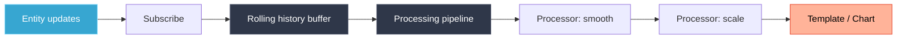

# DataSources

DataSources give cards access to entity history, real-time updates, and processed values — beyond the plain current state that HA cards normally see.

---

## What They Do

A DataSource subscribes to an entity, optionally preloads history, and runs values through a processing pipeline. Results are available in templates as `{ds:name}` or as chart series.



---

## Basic Usage

Define `data_sources` on any card. Each key is a name you choose:

```yaml
data_sources:
  temp:
    entity: sensor.temperature
    history:
      hours: 6
```

Use in a text template:

```yaml
text:
  value:
    content: "{ds:temp:.1f}°C"
```

Use as a chart series:

```yaml
type: custom:lcards-chart
data_sources:
  temp:
    entity: sensor.temperature
source: temp
chart_type: area
```

---

## Configuration Options

```yaml
data_sources:
  my_source:
    entity: sensor.power_usage      # Required — entity to track
    attribute: current              # Optional — track attribute instead of state
    update_interval: 500            # Throttle updates (ms, default: 100)
    history:
      hours: 24                     # Preload 24 hours of history
      # days: 7                     # Or use days (1–7)
    processing:
      # Named processors — each stores results in its own buffer
      kilowatts:
        type: scale
        input_range: [0, 1000]
        output_range: [0, 1]
      smoothed:
        type: smooth
        from: kilowatts             # Chain from previous processor
        method: exponential
        alpha: 0.3
      rounded:
        type: round
        from: smoothed
        precision: 2
```

### Top-Level Fields

| Field | Type | Description |
|-------|------|-------------|
| `entity` | string | Entity ID to subscribe to |
| `attribute` | string | Attribute to track instead of state |
| `update_interval` | number | Min ms between updates (throttle) |
| `history.hours` | number | Hours of history to preload (1–168) |
| `history.days` | number | Days of history to preload (1–7) |
| `processing` | object | Named processing pipeline steps |

---

## Processors

Each processor transforms data and stores results under its name. Processors can be chained with `from`.

| Processor | Purpose | Key params |
|-----------|---------|------------|
| `convert_unit` | Convert between unit types | `from`, `to` (e.g. `c`/`f`) |
| `scale` | Map from one range to another | `input_range`, `output_range` |
| `smooth` | Smooth noisy values | `method` (`exponential`, `moving_avg`), `alpha`, `window` |
| `round` | Round to decimal places | `precision` |
| `expression` | Custom JS expression | `expression` (uses `value`, `history`) |
| `clamp` | Clamp to min/max | `min`, `max` |
| `rate` | Rate of change per unit time | `period` |
| `trend` | Linear trend direction | — |
| `delta` | Difference from previous value | — |
| `statistics` | Min/max/avg/std | `window` |
| `threshold` | On/off based on threshold | `above`, `below` |

```yaml
processing:
  # Convert Celsius to Fahrenheit
  fahrenheit:
    type: convert_unit
    from: c
    to: f

  # Smooth the converted value
  smooth_f:
    type: smooth
    from: fahrenheit
    method: exponential
    alpha: 0.2
```

---

## Accessing Values in Templates

```yaml
# Current value from primary buffer
"{ds:temp}"

# With format specifier (Python-style)
"{ds:temp:.1f}°C"      # 1 decimal
"{ds:temp:.0f}"        # No decimals
"{ds:temp:>6.2f}"      # Right-aligned, 2 decimals

# From a specific processor buffer
"{datasource:temp.fahrenheit:.0f}°F"
```

---

## DataSources in Charts

For chart series, use `buffer` to select which data series to plot:

```yaml
sources:
  - datasource: temp
    buffer: main           # Raw entity history (default)
  - datasource: temp
    buffer: smoothed       # From 'smoothed' processor
```

For time-series aggregation (multiple historical stats), use `rolling_statistics_series`:

```yaml
data_sources:
  power:
    entity: sensor.power
    processing:
      hourly:
        type: rolling_statistics_series
        stats: [min, max, avg]
        window: 1h
        max_points: 24

sources:
  - datasource: power
    buffer: aggregation.hourly
```

---

## Related

- [Templates](../templates/README.md)
- [Chart card](../../cards/chart/README.md)
