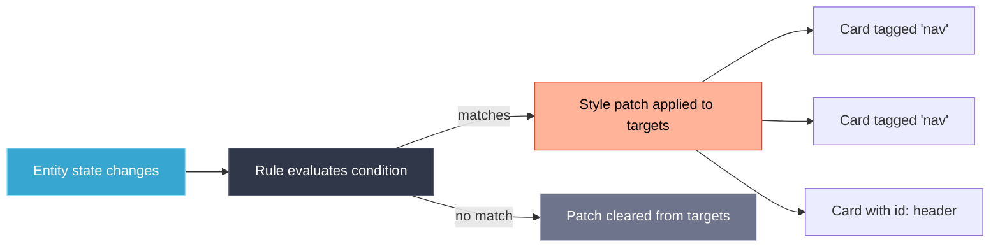

# Rules Engine

Rules let you apply style changes to groups of cards based on entity state — without touching each card individually. A single rule can update dozens of cards at once.

---

## Concept

A rule watches one or more entities. When a condition matches, it pushes a **style patch** to all targeted cards. When the condition no longer matches, the patch is removed.



---

## Where Rules Live

Rules are defined in content packs or directly in the LCARdS config helper. You manage them from the **Rules** tab in any card editor, or through the [Config Panel](../../config-panel.md).

---

## Rule Structure

```yaml
rules:
  - id: my-rule
    name: Nav highlight on motion
    priority: 10
    conditions:
      - entity: binary_sensor.motion_hallway
        state: "on"
    targets:
      tags: [nav]           # All cards with this tag
      ids: [header-card]    # Specific card IDs
      types: [button]       # All cards of a type
    style:
      border:
        color: "{theme:color.ui.active}"
      card:
        color:
          background: "#1a1a2e"
```

---

## Conditions

| Field | Description |
|-------|-------------|
| `entity` | Entity ID to watch |
| `state` | Match exact state string (e.g. `"on"`, `"home"`) |
| `above` | Numeric state greater than or equal to value |
| `below` | Numeric state less than value |
| `attribute` | Watch an attribute instead of state |
| `template` | Jinja2 expression — rule fires when it returns `true` |

Multiple conditions in the same rule are **AND**ed together. Use multiple rules for OR logic.

```yaml
conditions:
  - entity: binary_sensor.door
    state: "on"
  - entity: input_boolean.night_mode
    state: "on"
```

---

## Targets

| Field | Description |
|-------|-------------|
| `tags` | List of tags — targets all cards with any of these tags |
| `ids` | List of specific card IDs |
| `types` | Card types: `button`, `slider`, `elbow`, `chart`, `data-grid`, `msd` |

Targets are combined: a card matching any target receives the patch.

### Tagging Cards

Add tags to any card in its config:

```yaml
type: custom:lcards-button
tags: [nav, main-panel]
```

---

## Style Patches

The `style` block in a rule follows the same structure as card-level `style`. Only the specified properties are overridden — other styles are untouched.

```yaml
style:
  border:
    color: "#FF0000"
    width: 3
  card:
    color:
      background:
        default: "#200000"
        active: "#3a0000"
```

---

## Priority

When multiple rules target the same card, higher `priority` values win. Default priority is `0`.

```yaml
rules:
  - id: base-style
    priority: 0
    ...
  - id: alert-override
    priority: 100   # This wins when active
    ...
```

---

## Viewing Active Rules

In any card editor, the **Rules** tab shows:
- All rules currently in the system
- Which rules are currently active (condition matched)
- Which patches are being applied to this card

---

## Related

- [Templates](../templates/README.md)
- [Config Panel](../../config-panel.md)
