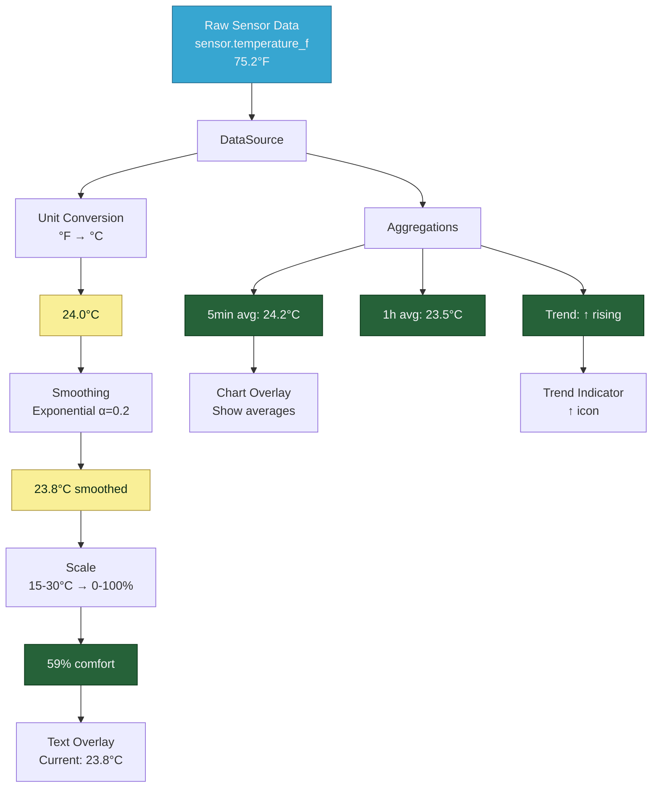

# DataSource Examples Collection

> **Complete, copy-paste-ready configurations**
> Real-world examples combining transformations, aggregations, computed sources, overlays, and rules for common use cases.

---

## 🎯 Example Flow Visualization

These examples demonstrate how datasources transform raw data into processed values for display:



**What These Examples Show:**
- ✅ **Transformations** - Convert units, smooth noise, scale values
- ✅ **Aggregations** - Calculate averages, trends, statistics
- ✅ **Computed Sources** - Combine multiple sensors with formulas
- ✅ **Overlays** - Display processed data on your dashboard
- ✅ **Real-world patterns** - Copy-paste and customize

---

## 📋 Table of Contents

1. [Using DataSource Metadata](#using-datasource-metadata)
2. [Temperature Monitoring System](#temperature-monitoring-system)
3. [Power & Energy Dashboard](#power--energy-dashboard)
4. [Environmental Monitor](#environmental-monitor)
5. [Smart Home Control](#smart-home-control)
6. [Solar Production Tracker](#solar-production-tracker)
7. [HVAC Optimization](#hvac-optimization)

---

## �️ Using DataSource Metadata

**Every datasource automatically captures entity metadata** from Home Assistant. This example shows how to leverage metadata for dynamic, maintainable configurations.

### Why Use Metadata?

- ✅ **No hardcoding** - Units and names come from HA
- ✅ **Self-documenting** - Overlays show actual entity names
- ✅ **Flexible** - Change entity, config adapts automatically
- ✅ **Less maintenance** - One source of truth (HA)

### Example: Multi-Sensor Dashboard with Metadata

```yaml
type: custom:lcards-msd-card

msd:
  # DataSources automatically capture metadata
  data_sources:
    temperature:
      type: entity
      entity: sensor.living_room_temperature
      # Metadata auto-captured:
      #   - friendly_name: "Living Room Temperature"
      #   - unit_of_measurement: "°C"
      #   - device_class: "temperature"
      #   - icon: "mdi:thermometer"

    humidity:
      type: entity
      entity: sensor.living_room_humidity
      # Metadata auto-captured:
      #   - friendly_name: "Living Room Humidity"
      #   - unit_of_measurement: "%"
      #   - device_class: "humidity"

    pressure:
      type: entity
      entity: sensor.barometric_pressure
      # Metadata auto-captured:
      #   - friendly_name: "Barometric Pressure"
      #   - unit_of_measurement: "hPa"
      #   - device_class: "pressure"

    power:
      type: entity
      entity: sensor.home_power
      # Metadata auto-captured:
      #   - friendly_name: "Home Power Consumption"
      #   - unit_of_measurement: "W"
      #   - device_class: "power"

  overlays:
    # Panel header
    - type: text
      id: header
      content: "ENVIRONMENTAL MONITOR"
      position: [100, 50]
      style:
        font_size: 28
        color: var(--lcars-orange)
        font_weight: bold

    # Temperature Section
    # Label uses friendly_name from metadata
    - type: text
      id: temp_label
      content: "{temperature.metadata.friendly_name}"
      position: [100, 120]
      style:
        font_size: 16
        color: var(--lcars-blue)

    # Value uses automatic unit from metadata
    - type: text
      id: temp_value
      content: "{temperature.v:.1f}{temperature.metadata.unit_of_measurement}"
      position: [100, 150]
      style:
        font_size: 32
        font_weight: bold

    # Device class for context
    - type: text
      id: temp_type
      content: "Type: {temperature.metadata.device_class}"
      position: [100, 190]
      style:
        font_size: 12
        color: var(--lcars-gray)

    # Humidity Section
    - type: text
      id: humidity_label
      content: "{humidity.metadata.friendly_name}"
      position: [450, 120]
      style:
        font_size: 16
        color: var(--lcars-blue)

    - type: text
      id: humidity_value
      content: "{humidity.v:.0f}{humidity.metadata.unit_of_measurement}"
      position: [450, 150]
      style:
        font_size: 32
        font_weight: bold

    # Pressure Section
    - type: text
      id: pressure_label
      content: "{pressure.metadata.friendly_name}"
      position: [800, 120]
      style:
        font_size: 16
        color: var(--lcars-blue)

    - type: text
      id: pressure_value
      content: "{pressure.v:.1f}{pressure.metadata.unit_of_measurement}"
      position: [800, 150]
      style:
        font_size: 32
        font_weight: bold

    # Power Section with Icon
    - type: text
      id: power_label
      content: "{power.metadata.friendly_name}"
      position: [1150, 120]
      style:
        font_size: 16
        color: var(--lcars-blue)

    - type: text
      id: power_value
      content: "{power.v:.0f}{power.metadata.unit_of_measurement}"
      position: [1150, 150]
      style:
        font_size: 32
        font_weight: bold
        color: >
          
            var(--lcars-red)
          
            var(--lcars-orange)
          
            var(--lcars-green)
          

    # Entity IDs (for debugging)
    - type: text
      id: debug_info
      content: "Entities: {temperature.metadata.entity_id} | {humidity.metadata.entity_id}"
      position: [100, 900]
      style:
        font_size: 10
        color: var(--lcars-dark-gray)
```

### What This Example Shows

**Automatic Labels:**
```yaml
content: "{temperature.metadata.friendly_name}"
# Output: "Living Room Temperature" (from HA entity)
# ✅ No hardcoding, automatically updates if you rename entity
```

**Automatic Units:**
```yaml
content: "{temperature.v:.1f}{temperature.metadata.unit_of_measurement}"
# Output: "23.5°C"
# ✅ Unit comes from entity, adapts if you change it in HA
```

**Device Class for Context:**
```yaml
content: "Type: {temperature.metadata.device_class}"
# Output: "Type: temperature"
# ✅ Helps identify sensor type programmatically
```

### Pattern: Reusable Sensor Display

Create a consistent pattern for all sensors:

```yaml
# Template for any sensor
- type: text
  content: "{SENSOR.metadata.friendly_name}"  # Label
  style:
    font_size: 16
    color: var(--lcars-blue)

- type: text
  content: "{SENSOR.v:.1f}{SENSOR.metadata.unit_of_measurement}"  # Value + Unit
  style:
    font_size: 32
    font_weight: bold
```

**Benefits:**
- Copy-paste pattern for each sensor
- All sensors display consistently
- Easy to maintain and update

### Metadata with Computed Sources

**Challenge:** Computed sources don't have entities, so no auto-metadata.

**Solution 1: Manual metadata override (BEST)**

```yaml
data_sources:
  solar:
    type: entity
    entity: sensor.solar_power
    # Has metadata.unit_of_measurement: "W"

  consumption:
    type: entity
    entity: sensor.home_power
    # Has metadata.unit_of_measurement: "W"

  net_power:
    type: computed
    expression: "solar - consumption"
    dependencies:
      solar: solar
      consumption: consumption
    # ✅ NEW: Specify metadata directly
    metadata:
      unit_of_measurement: "W"
      friendly_name: "Net Power Flow"
      device_class: "power"
      icon: "mdi:transmission-tower"

overlays:
  # Now has full metadata support! ✅
  - type: text
    content: "{net_power.metadata.friendly_name}: {net_power.v:.0f}{net_power.metadata.unit_of_measurement}"
    # Output: "Net Power Flow: 500W" ✅
```

**Solution 2: Reference dependency metadata**

```yaml
overlays:
  # Use dependency's metadata
  - type: text
    content: "Net: {net_power.v:.0f}{solar.metadata.unit_of_measurement}"
    #                                  ↑ Reference solar's unit
    # Output: "Net: 500W" ✅
```

### Advanced: Conditional Display Based on Metadata

```yaml
overlays:
  - type: text
    content: >
      
        {power.v / 1000:.2f} kW
      
        {power.v:.1f}{power.metadata.unit_of_measurement}
      
    # Converts watts to kilowatts if needed
```

### Key Takeaways

| Feature | Without Metadata | With Metadata |
|---------|------------------|---------------|
| **Label** | `content: "Temperature"` | `content: "{temp.metadata.friendly_name}"` |
| **Unit** | `content: "{temp.v:.1f}°C"` | `content: "{temp.v:.1f}{temp.metadata.unit_of_measurement}"` |
| **Maintenance** | Update every overlay if entity changes | Update only entity_id in datasource |
| **Flexibility** | Hardcoded per entity | Adapts automatically |

**Best Practice:** Always use metadata for units and names. Only hardcode when you need custom display names different from HA.

---

## �🌡️ Temperature Monitoring System

Complete temperature monitoring with unit conversion, smoothing, trends, and alerts.

### Configuration

```yaml
data_sources:
  # Main outdoor temperature sensor
  outdoor_temp:
    type: entity
    entity: sensor.outdoor_temperature_f
    windowSeconds: 3600  # 1 hour buffer
    transformations:
      # Convert Fahrenheit to Celsius
      - type: unit_conversion
        from: "°F"
        to: "°C"
        key: "celsius"

      # Smooth to reduce sensor noise
      - type: smooth
        method: "exponential"
        alpha: 0.2  # Heavy smoothing
        key: "smoothed"

      # Scale to comfort percentage (15-30°C = 0-100%)
      - type: scale
        input_range: [15, 30]
        output_range: [0, 100]
        clamp: true
        key: "comfort_pct"

    aggregations:
      # 5-minute average
      short_avg:
        window: "5m"
        key: "avg_5m"

      # 1-hour average
      medium_avg:
        window: "1h"
        key: "avg_1h"

      # Daily statistics
      daily_stats:
        min: true
        max: true
        avg: true
        window: "24h"
        key: "daily"

      # Trend detection
      recent_trend:
        samples: 10
        threshold: 0.05  # 0.05°C per sample
        key: "trend"

      # Track time in comfort zone
      comfort_duration:
        condition: "range"
        range: [20, 25]  # 20-25°C comfort zone
        units: "hours"
        key: "comfort_time"

  # Indoor temperature
  indoor_temp:
    type: entity
    entity: sensor.indoor_temperature
    windowSeconds: 3600
    transformations:
      - type: smooth
        method: "exponential"
        alpha: 0.3
        key: "smoothed"
    aggregations:
      moving_average:
        window: "15m"
        key: "avg_15m"

  # Temperature difference (computed)
  temp_difference:
    type: computed
    inputs:
      - sensor.outdoor_temperature_f
      - sensor.indoor_temperature
    expression: >
      (inputs[0] - 32) * 5/9 - inputs[1]
    transformations:
      - type: smooth
        method: "moving_average"
        window_size: 3
        key: "smoothed"

overlays:
  # Main temperature display
  - id: temp_display
    type: text
    x: 100
    y: 100
    content: |
      🌡️ Temperature Monitor

      Outdoor: {outdoor_temp.transformations.celsius:.1f}°C
      Smoothed: {outdoor_temp.transformations.smoothed:.1f}°C
      5min Avg: {outdoor_temp.aggregations.avg_5m.value:.1f}°C
      1hour Avg: {outdoor_temp.aggregations.avg_1h.value:.1f}°C

      Daily Range:
      Min: {outdoor_temp.aggregations.daily.min:.1f}°C
      Max: {outdoor_temp.aggregations.daily.max:.1f}°C
      Avg: {outdoor_temp.aggregations.daily.avg:.1f}°C

      Trend: {outdoor_temp.aggregations.trend.direction}
      Comfort: {outdoor_temp.transformations.comfort_pct:.0f}%
      Time in Zone: {outdoor_temp.aggregations.comfort_time.current:.1f}h

      Indoor: {indoor_temp.transformations.smoothed:.1f}°C
      Difference: {temp_difference.transformations.smoothed:+.1f}°C
    style:
      fill: var(--lcars-white)
      fontSize: 14px

  # Temperature sparkline (raw)
  - id: temp_sparkline_raw
    type: sparkline
    x: 100
    y: 350
    width: 300
    height: 60
    source: outdoor_temp
    style:
      stroke: var(--lcars-blue)
      strokeWidth: 2

  # Temperature sparkline (celsius)
  - id: temp_sparkline_celsius
    type: sparkline
    x: 100
    y: 420
    width: 300
    height: 60
    source: outdoor_temp.transformations.celsius
    style:
      stroke: var(--lcars-orange)
      strokeWidth: 2

  # Temperature sparkline (smoothed)
  - id: temp_sparkline_smooth
    type: sparkline
    x: 100
    y: 490
    width: 300
    height: 60
    source: outdoor_temp.transformations.smoothed
    style:
      stroke: var(--lcars-green)
      strokeWidth: 2

rules:
  # High temperature alert
  - id: high_temp_alert
    priority: 100
    when:
      all:
        # 5-minute average above 35°C
        - entity: outdoor_temp.aggregations.avg_5m.value
          above: 35
        # Trend is increasing
        - entity: outdoor_temp.aggregations.trend.direction
          equals: "increasing"
    apply:
      overlays:
        - id: temp_display
          style:
            fill: var(--lcars-red)
        - id: temp_sparkline_smooth
          style:
            stroke: var(--lcars-red)

  # Low temperature warning
  - id: low_temp_warning
    priority: 90
    when:
      any:
        - entity: outdoor_temp.transformations.celsius
          below: 0
        - entity: outdoor_temp.aggregations.avg_1h.value
          below: 5
    apply:
      overlays:
        - id: temp_display
          style:
            fill: var(--lcars-blue)

  # Comfort zone indicator
  - id: comfort_zone
    priority: 50
    when:
      all:
        - entity: outdoor_temp.transformations.celsius
          above: 20
        - entity: outdoor_temp.transformations.celsius
          below: 25
    apply:
      overlays:
        - id: temp_display
          style:
            fill: var(--lcars-green)
```

### Key Features

✅ **Multi-unit support** (Fahrenheit → Celsius)
✅ **Noise reduction** (exponential smoothing)
✅ **Multiple time windows** (5m, 1h, 24h)
✅ **Trend detection** (increasing/decreasing/stable)
✅ **Comfort zone tracking** (time spent 20-25°C)
✅ **Indoor/outdoor comparison**
✅ **Visual feedback** (color changes based on conditions)
✅ **Multiple sparklines** (raw, converted, smoothed)

---

## ⚡ Power & Energy Dashboard

Comprehensive energy monitoring with cost calculation, peak tracking, and efficiency analysis.

### Configuration

```yaml
data_sources:
  # Main power meter
  house_power:
    type: entity
    entity: sensor.house_power_watts
    windowSeconds: 3600
    transformations:
      # Convert to kilowatts
      - type: unit_conversion
        conversion: "w_to_kw"
        key: "kilowatts"

      # Smooth rapid fluctuations
      - type: smooth
        method: "moving_average"
        window_size: 5
        key: "smoothed"

      # Scale to percentage of circuit capacity (max 10kW)
      - type: scale
        input_range: [0, 10000]
        output_range: [0, 100]
        key: "capacity_pct"

    aggregations:
      # 15-minute average
      moving_average:
        window: "15m"
        key: "avg_15m"

      # Hourly peak tracking
      hourly_peak:
        min: false
        max: true
        avg: true
        window: "1h"
        key: "hourly"

      # Rate of change (W/minute)
      rate_of_change:
        unit: "per_minute"
        smoothing: true
        key: "rate"

      # High usage duration (above 3kW)
      high_usage:
        condition: "above"
        threshold: 3000
        units: "minutes"
        key: "high_time"

      # Session statistics
      session_stats:
        key: "session"

  # Individual circuits
  hvac_power:
    type: entity
    entity: sensor.hvac_power
    transformations:
      - type: unit_conversion
        conversion: "w_to_kw"
        key: "kw"

  appliances_power:
    type: entity
    entity: sensor.appliances_power
    transformations:
      - type: unit_conversion
        conversion: "w_to_kw"
        key: "kw"

  lighting_power:
    type: entity
    entity: sensor.lighting_power
    transformations:
      - type: unit_conversion
        conversion: "w_to_kw"
        key: "kw"

  # Total power (computed verification)
  total_computed:
    type: computed
    inputs:
      - sensor.hvac_power
      - sensor.appliances_power
      - sensor.lighting_power
    expression: "inputs[0] + inputs[1] + inputs[2]"
    transformations:
      - type: unit_conversion
        conversion: "w_to_kw"
        key: "kw"

  # Power cost (computed)
  power_cost:
    type: computed
    inputs:
      - sensor.house_power_watts
      - input_number.electricity_rate  # $/kWh
    expression: "(inputs[0] / 1000) * inputs[1]"
    aggregations:
      session_stats:
        key: "session"

  # Efficiency ratio
  hvac_efficiency:
    type: computed
    inputs:
      - sensor.hvac_power
      - sensor.house_power_watts
    expression: "(inputs[0] / inputs[1]) * 100"
    transformations:
      - type: smooth
        method: "exponential"
        alpha: 0.3
        key: "smoothed"

overlays:
  # Main power dashboard
  - id: power_dashboard
    type: text
    x: 500
    y: 100
    content: |
      ⚡ Power Monitor

      Current Usage
      Total: {house_power.transformations.kilowatts:.2f} kW
      15min Avg: {house_power.aggregations.avg_15m.value:.2f} kW
      Capacity: {house_power.transformations.capacity_pct:.0f}%

      Rate: {house_power.aggregations.rate.rate:+.0f} W/min
      Direction: {house_power.aggregations.rate.direction}

      Hourly Stats
      Peak: {house_power.aggregations.hourly.max:.2f} kW
      Average: {house_power.aggregations.hourly.avg:.2f} kW

      High Usage: {house_power.aggregations.high_time.current:.0f} min

      Breakdown
      HVAC: {hvac_power.transformations.kw:.2f} kW ({hvac_efficiency.transformations.smoothed:.0f}%)
      Appliances: {appliances_power.transformations.kw:.2f} kW
      Lighting: {lighting_power.transformations.kw:.2f} kW

      Cost
      Current: ${power_cost.value:.3f}/hour
      Today: ${power_cost.aggregations.session.sum:.2f}

      Session Peak: {house_power.aggregations.session.max:.2f} kW
    style:
      fill: var(--lcars-white)
      fontSize: 14px

  # Power sparkline
  - id: power_sparkline
    type: sparkline
    x: 500
    y: 450
    width: 400
    height: 80
    source: house_power.transformations.smoothed
    style:
      stroke: var(--lcars-blue)
      strokeWidth: 2

rules:
  # High power alert
  - id: high_power_alert
    priority: 100
    when:
      all:
        # Current usage above 8kW
        - entity: house_power.transformations.kilowatts
          above: 8
        # Rate increasing rapidly
        - entity: house_power.aggregations.rate.rate
          above: 100  # More than 100W/min increase
    apply:
      overlays:
        - id: power_dashboard
          style:
            fill: var(--lcars-red)
        - id: power_sparkline
          style:
            stroke: var(--lcars-red)
            strokeWidth: 3

  # Approaching capacity warning
  - id: capacity_warning
    priority: 90
    when:
      any:
        - entity: house_power.transformations.capacity_pct
          above: 80
        - entity: house_power.aggregations.hourly.max
          above: 9
    apply:
      overlays:
        - id: power_dashboard
          style:
            fill: var(--lcars-orange)

  # Efficient operation
  - id: efficient_operation
    priority: 50
    when:
      all:
        - entity: house_power.transformations.kilowatts
          below: 2
        - entity: house_power.aggregations.rate.direction
          equals: "stable"
    apply:
      overlays:
        - id: power_dashboard
          style:
            fill: var(--lcars-green)
```

### Key Features

✅ **Real-time power monitoring** (watts → kilowatts)
✅ **Circuit breakdown** (HVAC, appliances, lighting)
✅ **Peak tracking** (hourly and session)
✅ **Rate of change** (detect rapid increases)
✅ **Duration tracking** (time above threshold)
✅ **Cost calculation** (real-time and cumulative)
✅ **Efficiency analysis** (HVAC percentage)
✅ **Capacity monitoring** (percentage of max)
✅ **Multi-level alerts** (critical, warning, efficient)

---

## 🌤️ Environmental Monitor

Multi-sensor environmental monitoring with weather calculations and comfort analysis.

### Configuration

```yaml
data_sources:
  # Temperature sensor
  temperature:
    type: entity
    entity: sensor.temperature
    windowSeconds: 3600
    transformations:
      - type: smooth
        method: "exponential"
        alpha: 0.2
        key: "smoothed"
    aggregations:
      moving_average:
        window: "30m"
        key: "avg_30m"
      recent_trend:
        samples: 10
        threshold: 0.05
        key: "trend"

  # Humidity sensor
  humidity:
    type: entity
    entity: sensor.humidity
    windowSeconds: 3600
    transformations:
      - type: smooth
        method: "exponential"
        alpha: 0.2
        key: "smoothed"
    aggregations:
      moving_average:
        window: "30m"
        key: "avg_30m"
      min_max:
        window: "1h"
        key: "hourly"

  # Pressure sensor
  pressure:
    type: entity
    entity: sensor.pressure
    windowSeconds: 3600
    transformations:
      - type: unit_conversion
        conversion: "hpa_to_inhg"
        key: "inches"
    aggregations:
      rate_of_change:
        unit: "per_hour"
        key: "rate"
      recent_trend:
        samples: 5
        threshold: 0.1
        key: "trend"

  # Air quality
  air_quality:
    type: entity
    entity: sensor.air_quality_pm25
    transformations:
      - type: smooth
        method: "median"
        window_size: 3
        key: "filtered"
      - type: statistical
        method: "z_score"
        window_size: 30
        key: "anomaly"

  # Heat index (computed)
  heat_index:
    type: computed
    inputs:
      - sensor.temperature
      - sensor.humidity
    expression: >
      0.5 * (inputs[0] + 61.0 +
      ((inputs[0] - 68.0) * 1.2) +
      (inputs[1] * 0.094))
    transformations:
      - type: unit_conversion
        from: "°F"
        to: "°C"
        key: "celsius"

  # Dew point (computed)
  dew_point:
    type: computed
    inputs:
      - sensor.temperature
      - sensor.humidity
    expression: >
      inputs[0] - ((100 - inputs[1]) / 5.0)
    transformations:
      - type: smooth
        method: "exponential"
        alpha: 0.3
        key: "smoothed"

  # Comfort score (computed, 0-100)
  comfort_score:
    type: computed
    inputs:
      - sensor.temperature
      - sensor.humidity
      - sensor.air_quality_pm25
    expression: >
      Math.max(0, Math.min(100,
        100 -
        Math.abs(22 - inputs[0]) * 5 -
        Math.abs(50 - inputs[1]) * 0.5 -
        Math.max(0, (inputs[2] - 35) * 0.5)
      ))
    aggregations:
      moving_average:
        window: "1h"
        key: "avg_1h"
      min_max:
        window: "24h"
        key: "daily"

overlays:
  # Environmental dashboard
  - id: env_dashboard
    type: text
    x: 900
    y: 100
    content: |
      🌤️ Environmental Monitor

      Temperature: {temperature.transformations.smoothed:.1f}°C
      30min Avg: {temperature.aggregations.avg_30m.value:.1f}°C
      Trend: {temperature.aggregations.trend.direction}

      Humidity: {humidity.transformations.smoothed:.0f}%
      30min Avg: {humidity.aggregations.avg_30m.value:.0f}%
      Hourly Range: {humidity.aggregations.hourly.min:.0f}-{humidity.aggregations.hourly.max:.0f}%

      Pressure: {pressure.transformations.inches:.2f} inHg
      Rate: {pressure.aggregations.rate.rate:+.2f} hPa/h
      Trend: {pressure.aggregations.trend.direction}

      Air Quality: {air_quality.transformations.filtered:.0f} µg/m³
      Status: {air_quality.transformations.anomaly:.1f}σ

      Calculated
      Heat Index: {heat_index.transformations.celsius:.1f}°C
      Dew Point: {dew_point.transformations.smoothed:.1f}°C

      Comfort Score: {comfort_score.value:.0f}/100
      Hourly Avg: {comfort_score.aggregations.avg_1h.value:.0f}/100
      Today: {comfort_score.aggregations.daily.min:.0f}-{comfort_score.aggregations.daily.max:.0f}
    style:
      fill: var(--lcars-white)
      fontSize: 14px

  # Comfort score sparkline
  - id: comfort_sparkline
    type: sparkline
    x: 900
    y: 450
    width: 350
    height: 70
    source: comfort_score
    style:
      stroke: var(--lcars-purple)
      strokeWidth: 2

rules:
  # Weather change alert (dropping pressure)
  - id: weather_change
    priority: 100
    when:
      all:
        - entity: pressure.aggregations.rate.rate
          below: -2  # Dropping more than 2 hPa/hour
        - entity: humidity.aggregations.avg_30m.value
          above: 70
    apply:
      overlays:
        - id: env_dashboard
          style:
            fill: var(--lcars-orange)

  # Poor air quality alert
  - id: poor_air_quality
    priority: 90
    when:
      any:
        - entity: air_quality.transformations.filtered
          above: 55  # Unhealthy for sensitive groups
        - entity: air_quality.transformations.anomaly
          above: 2  # Anomaly detected
    apply:
      overlays:
        - id: env_dashboard
          style:
            fill: var(--lcars-red)

  # Optimal conditions
  - id: optimal_conditions
    priority: 50
    when:
      all:
        - entity: comfort_score.value
          above: 80
        - entity: air_quality.transformations.filtered
          below: 35
    apply:
      overlays:
        - id: env_dashboard
          style:
            fill: var(--lcars-green)
```

### Key Features

✅ **Multi-sensor monitoring** (temperature, humidity, pressure, air quality)
✅ **Weather calculations** (heat index, dew point)
✅ **Comfort scoring** (multi-factor analysis)
✅ **Trend detection** (temperature, pressure, trends)
✅ **Anomaly detection** (air quality z-score)
✅ **Weather predictions** (pressure rate changes)
✅ **Time-windowed analysis** (30m, 1h, 24h)
✅ **Comfort optimization** (visual feedback on conditions)

---

## 🏠 Smart Home Control

Advanced device control with state tracking, activity monitoring, and automation feedback.

### Configuration

```yaml
data_sources:
  # Living room lights
  living_lights:
    type: entity
    entity: light.living_room
    windowSeconds: 7200  # 2 hours
    transformations:
      # Convert brightness (0-255) to percentage
      - type: unit_conversion
        conversion: "ha_brightness_to_percent"
        key: "brightness_pct"

      # Normalize state to numeric (on=1, off=0)
      - type: expression
        expression: "value === 'on' ? 1 : 0"
        key: "state_numeric"

    aggregations:
      # Track on/off durations
      on_duration:
        condition: "above"
        threshold: 0.5  # Consider 'on' when numeric > 0.5
        units: "minutes"
        key: "on_time"

      # Daily statistics
      daily_stats:
        min: true
        max: true
        avg: true
        window: "24h"
        key: "daily"

      # Session tracking
      session_stats:
        key: "session"

  # Thermostat
  thermostat:
    type: entity
    entity: climate.main_thermostat
    windowSeconds: 3600
    transformations:
      # Extract current temperature
      - type: expression
        expression: "parseFloat(value.current_temperature)"
        key: "current_temp"

      # Extract target temperature
      - type: expression
        expression: "parseFloat(value.temperature)"
        key: "target_temp"

      # Calculate temperature difference
      - type: expression
        expression: "Math.abs(value.temperature - value.current_temperature)"
        input_source: "value"
        key: "temp_diff"

    aggregations:
      # Track heating/cooling cycles
      cycle_duration:
        condition: "above"
        threshold: 0.5
        units: "minutes"
        key: "cycle_time"

  # Motion sensors
  motion_activity:
    type: entity
    entity: binary_sensor.motion_living_room
    windowSeconds: 3600
    transformations:
      # Convert on/off to 1/0
      - type: expression
        expression: "value === 'on' ? 1 : 0"
        key: "numeric"

    aggregations:
      # Activity level (percentage of time with motion)
      moving_average:
        window: "15m"
        key: "activity_15m"

      # Motion duration tracking
      motion_duration:
        condition: "above"
        threshold: 0.5
        units: "minutes"
        key: "motion_time"

      # Recent trend
      recent_trend:
        samples: 10
        threshold: 0.1
        key: "trend"

  # Door sensor
  door_state:
    type: entity
    entity: binary_sensor.front_door
    windowSeconds: 3600
    transformations:
      - type: expression
        expression: "value === 'on' ? 1 : 0"
        key: "numeric"

    aggregations:
      # Count door openings (changes from 0 to 1)
      rate_of_change:
        unit: "per_hour"
        key: "open_rate"

      # Duration open
      open_duration:
        condition: "above"
        threshold: 0.5
        units: "minutes"
        key: "open_time"

  # Total activity score (computed)
  activity_score:
    type: computed
    inputs:
      - binary_sensor.motion_living_room
      - binary_sensor.motion_kitchen
      - binary_sensor.motion_bedroom
      - binary_sensor.front_door
    expression: >
      inputs.reduce((sum, state) =>
        sum + (state === 'on' ? 1 : 0), 0
      ) * 25
    aggregations:
      moving_average:
        window: "30m"
        key: "avg_30m"
      session_stats:
        key: "session"

  # Lighting efficiency (computed)
  lighting_efficiency:
    type: computed
    inputs:
      - light.living_room
      - binary_sensor.motion_living_room
    expression: >
      inputs[0] === 'on' && inputs[1] === 'on' ? 100 :
      inputs[0] === 'off' && inputs[1] === 'off' ? 100 :
      50
    aggregations:
      moving_average:
        window: "1h"
        key: "avg_1h"

overlays:
  # Smart home control panel
  - id: smart_home_panel
    type: text
    x: 100
    y: 600
    content: |
      🏠 Smart Home Status

      Living Room Lights
      State: {living_lights.value}
      Brightness: {living_lights.transformations.brightness_pct:.0f}%
      On Time: {living_lights.aggregations.on_time.current:.0f} min
      Today: {living_lights.aggregations.daily.avg:.0f}% avg

      Thermostat
      Current: {thermostat.transformations.current_temp:.1f}°C
      Target: {thermostat.transformations.target_temp:.1f}°C
      Difference: {thermostat.transformations.temp_diff:.1f}°C
      Cycle Time: {thermostat.aggregations.cycle_time.current:.0f} min

      Activity
      Motion (15m): {motion_activity.aggregations.activity_15m.value:.0f}%
      Motion Time: {motion_activity.aggregations.motion_time.current:.0f} min
      Trend: {motion_activity.aggregations.trend.direction}

      Door
      Status: {door_state.value}
      Open Rate: {door_state.aggregations.open_rate.rate:.1f}/hour
      Open Time: {door_state.aggregations.open_time.current:.0f} min

      Overall
      Activity Score: {activity_score.value:.0f}/100
      30min Avg: {activity_score.aggregations.avg_30m.value:.0f}/100
      Peak: {activity_score.aggregations.session.max:.0f}

      Lighting Efficiency: {lighting_efficiency.aggregations.avg_1h.value:.0f}%
    style:
      fill: var(--lcars-white)
      fontSize: 14px

  # Activity sparkline
  - id: activity_sparkline
    type: sparkline
    x: 100
    y: 950
    width: 350
    height: 60
    source: activity_score
    style:
      stroke: var(--lcars-purple)
      strokeWidth: 2

rules:
  # High activity mode
  - id: high_activity
    priority: 100
    when:
      all:
        - entity: activity_score.value
          above: 75
        - entity: motion_activity.aggregations.trend.direction
          equals: "increasing"
    apply:
      overlays:
        - id: smart_home_panel
          style:
            fill: var(--lcars-green)
        - id: activity_sparkline
          style:
            stroke: var(--lcars-green)

  # Door left open warning
  - id: door_open_warning
    priority: 90
    when:
      any:
        - entity: door_state.aggregations.open_time.current
          above: 10  # Open for more than 10 minutes
    apply:
      overlays:
        - id: smart_home_panel
          style:
            fill: var(--lcars-orange)

  # Lights on without motion (inefficiency)
  - id: light_inefficiency
    priority: 80
    when:
      all:
        - entity: living_lights.value
          equals: "on"
        - entity: motion_activity.aggregations.activity_15m.value
          below: 10
    apply:
      overlays:
        - id: smart_home_panel
          style:
            fill: var(--lcars-blue)

  # Away mode (no activity)
  - id: away_mode
    priority: 50
    when:
      all:
        - entity: activity_score.value
          below: 25
        - entity: motion_activity.aggregations.motion_time.current
          below: 5
    apply:
      overlays:
        - id: smart_home_panel
          style:
            fill: var(--lcars-gray)
```

### Key Features

✅ **Multi-device tracking** (lights, thermostat, motion, doors)
✅ **State normalization** (convert on/off to numeric)
✅ **Duration tracking** (how long devices are on/active)
✅ **Activity scoring** (multi-sensor activity level)
✅ **Efficiency metrics** (lighting efficiency based on motion)
✅ **Door monitoring** (open rate, duration warnings)
✅ **HVAC tracking** (temperature difference, cycle time)
✅ **Automation feedback** (visual indicators for modes)
✅ **Multi-level alerts** (high activity, warnings, away mode)

---

## ☀️ Solar Production Tracker

Complete solar energy monitoring with production analysis, efficiency tracking, and savings calculation.

### Configuration

```yaml
data_sources:
  # Solar panel production
  solar_production:
    type: entity
    entity: sensor.solar_power_watts
    windowSeconds: 3600
    transformations:
      # Convert to kilowatts
      - type: unit_conversion
        conversion: "w_to_kw"
        key: "kilowatts"

      # Smooth rapid fluctuations
      - type: smooth
        method: "moving_average"
        window_size: 5
        key: "smoothed"

    aggregations:
      # 15-minute average
      moving_average:
        window: "15m"
        key: "avg_15m"

      # Hourly statistics
      hourly_stats:
        min: true
        max: true
        avg: true
        window: "1h"
        key: "hourly"

      # Daily statistics
      daily_stats:
        min: true
        max: true
        avg: true
        window: "24h"
        key: "daily"

      # Rate of change
      rate_of_change:
        unit: "per_minute"
        smoothing: true
        key: "rate"

      # Session statistics
      session_stats:
        key: "session"

  # Solar irradiance
  solar_irradiance:
    type: entity
    entity: sensor.solar_irradiance
    windowSeconds: 3600
    transformations:
      - type: smooth
        method: "exponential"
        alpha: 0.3
        key: "smoothed"

  # House consumption
  house_consumption:
    type: entity
    entity: sensor.house_power_watts
    windowSeconds: 3600
    transformations:
      - type: unit_conversion
        conversion: "w_to_kw"
        key: "kilowatts"

    aggregations:
      moving_average:
        window: "15m"
        key: "avg_15m"

  # Grid import/export
  grid_power:
    type: entity
    entity: sensor.grid_power_watts
    windowSeconds: 3600
    transformations:
      - type: unit_conversion
        conversion: "w_to_kw"
        key: "kilowatts"

  # Solar efficiency (computed, %)
  solar_efficiency:
    type: computed
    inputs:
      - sensor.solar_power_watts
      - sensor.solar_irradiance
    expression: >
      inputs[1] > 0 ? (inputs[0] / (inputs[1] * 10)) * 100 : 0
    transformations:
      - type: smooth
        method: "exponential"
        alpha: 0.3
        key: "smoothed"

    aggregations:
      moving_average:
        window: "1h"
        key: "avg_1h"
      daily_stats:
        min: true
        max: true
        avg: true
        window: "24h"
        key: "daily"

  # Self-consumption rate (computed, %)
  self_consumption:
    type: computed
    inputs:
      - sensor.solar_power_watts
      - sensor.house_power_watts
    expression: >
      inputs[0] > 0 ?
        Math.min(100, (Math.min(inputs[0], inputs[1]) / inputs[0]) * 100) : 0
    transformations:
      - type: smooth
        method: "moving_average"
        window_size: 5
        key: "smoothed"

    aggregations:
      moving_average:
        window: "1h"
        key: "avg_1h"

  # Net power (computed, positive = exporting)
  net_power:
    type: computed
    inputs:
      - sensor.solar_power_watts
      - sensor.house_power_watts
    expression: "(inputs[0] - inputs[1]) / 1000"
    transformations:
      - type: smooth
        method: "exponential"
        alpha: 0.3
        key: "smoothed"

  # Energy savings (computed, $/hour)
  energy_savings:
    type: computed
    inputs:
      - sensor.solar_power_watts
      - input_number.electricity_rate  # $/kWh
    expression: "(inputs[0] / 1000) * inputs[1]"
    aggregations:
      session_stats:
        key: "session"

  # Peak production percentage (computed)
  peak_percentage:
    type: computed
    inputs:
      - sensor.solar_power_watts
      - input_number.solar_panel_capacity  # Max watts
    expression: "(inputs[0] / inputs[1]) * 100"
    transformations:
      - type: smooth
        method: "exponential"
        alpha: 0.2
        key: "smoothed"

overlays:
  # Solar dashboard
  - id: solar_dashboard
    type: text
    x: 500
    y: 600
    content: |
      ☀️ Solar Production Tracker

      Current Production
      Power: {solar_production.transformations.kilowatts:.2f} kW
      15min Avg: {solar_production.aggregations.avg_15m.value:.2f} kW
      Rate: {solar_production.aggregations.rate.rate:+.0f} W/min

      Hourly Stats
      Min: {solar_production.aggregations.hourly.min:.2f} kW
      Max: {solar_production.aggregations.hourly.max:.2f} kW
      Avg: {solar_production.aggregations.hourly.avg:.2f} kW

      Daily Stats
      Min: {solar_production.aggregations.daily.min:.2f} kW
      Max: {solar_production.aggregations.daily.max:.2f} kW
      Avg: {solar_production.aggregations.daily.avg:.2f} kW
      Peak: {solar_production.aggregations.session.max:.2f} kW

      Efficiency
      Current: {solar_efficiency.transformations.smoothed:.1f}%
      Hourly Avg: {solar_efficiency.aggregations.avg_1h.value:.1f}%
      Today: {solar_efficiency.aggregations.daily.avg:.1f}%
      Peak Today: {solar_efficiency.aggregations.daily.max:.1f}%

      Usage
      Consumption: {house_consumption.transformations.kilowatts:.2f} kW
      Self-Use: {self_consumption.transformations.smoothed:.0f}%
      Net Power: {net_power.transformations.smoothed:+.2f} kW
      Grid: {grid_power.transformations.kilowatts:+.2f} kW

      Performance
      Peak %: {peak_percentage.transformations.smoothed:.0f}%
      Irradiance: {solar_irradiance.transformations.smoothed:.0f} W/m²

      Savings
      Current: ${energy_savings.value:.3f}/hour
      Today: ${energy_savings.aggregations.session.sum:.2f}
    style:
      fill: var(--lcars-white)
      fontSize: 14px

  # Production sparkline
  - id: solar_sparkline
    type: sparkline
    x: 500
    y: 1050
    width: 400
    height: 80
    source: solar_production.transformations.smoothed
    style:
      stroke: var(--lcars-orange)
      strokeWidth: 2

  # Efficiency sparkline
  - id: efficiency_sparkline
    type: sparkline
    x: 500
    y: 1150
    width: 400
    height: 60
    source: solar_efficiency.transformations.smoothed
    style:
      stroke: var(--lcars-yellow)
      strokeWidth: 2

rules:
  # Peak production
  - id: peak_production
    priority: 100
    when:
      all:
        - entity: peak_percentage.transformations.smoothed
          above: 80
        - entity: solar_efficiency.transformations.smoothed
          above: 15
    apply:
      overlays:
        - id: solar_dashboard
          style:
            fill: var(--lcars-green)
        - id: solar_sparkline
          style:
            stroke: var(--lcars-green)
            strokeWidth: 3

  # Exporting to grid
  - id: exporting_power
    priority: 90
    when:
      any:
        - entity: net_power.transformations.smoothed
          above: 1  # Exporting more than 1kW
    apply:
      overlays:
        - id: solar_dashboard
          style:
            fill: var(--lcars-blue)

  # Low efficiency warning
  - id: low_efficiency
    priority: 80
    when:
      all:
        - entity: solar_irradiance.transformations.smoothed
          above: 500  # Good sunlight
        - entity: solar_efficiency.transformations.smoothed
          below: 10  # But low efficiency
    apply:
      overlays:
        - id: solar_dashboard
          style:
            fill: var(--lcars-orange)
        - id: efficiency_sparkline
          style:
            stroke: var(--lcars-orange)

  # Night mode
  - id: night_mode
    priority: 50
    when:
      all:
        - entity: solar_production.transformations.kilowatts
          below: 0.01
        - entity: solar_irradiance.transformations.smoothed
          below: 10
    apply:
      overlays:
        - id: solar_dashboard
          style:
            fill: var(--lcars-gray)
```

### Key Features

✅ **Production monitoring** (real-time, 15m, hourly, daily)
✅ **Efficiency calculation** (power vs irradiance)
✅ **Self-consumption tracking** (how much solar used directly)
✅ **Net power analysis** (import/export to grid)
✅ **Savings calculation** (real-time and cumulative $)
✅ **Peak performance tracking** (percentage of capacity)
✅ **Rate of change** (production trends)
✅ **Multi-timeframe statistics** (hourly, daily, session)
✅ **Visual feedback** (peak, exporting, low efficiency, night)
✅ **Dual sparklines** (production + efficiency)

---

## ❄️ HVAC Optimization

Advanced HVAC monitoring with efficiency analysis, cycle tracking, and comfort optimization.

### Configuration

```yaml
data_sources:
  # Thermostat main
  hvac_thermostat:
    type: entity
    entity: climate.main_thermostat
    windowSeconds: 7200  # 2 hours
    transformations:
      # Extract current temperature
      - type: expression
        expression: "parseFloat(value.current_temperature)"
        key: "current_temp"

      # Extract target temperature
      - type: expression
        expression: "parseFloat(value.temperature)"
        key: "target_temp"

      # Calculate delta (target - current)
      - type: expression
        expression: "value.temperature - value.current_temperature"
        input_source: "value"
        key: "temp_delta"

      # Extract HVAC action
      - type: expression
        expression: "value.hvac_action"
        key: "action"

      # Action to numeric (heating=1, cooling=-1, idle=0)
      - type: expression
        expression: >
          value.hvac_action === 'heating' ? 1 :
          value.hvac_action === 'cooling' ? -1 : 0
        input_source: "value"
        key: "action_numeric"

    aggregations:
      # Heating cycle duration
      heating_duration:
        condition: "above"
        threshold: 0.5  # Action numeric > 0.5
        units: "minutes"
        key: "heating_time"

      # Cooling cycle duration
      cooling_duration:
        condition: "below"
        threshold: -0.5  # Action numeric < -0.5
        units: "minutes"
        key: "cooling_time"

      # Idle duration
      idle_duration:
        condition: "range"
        range: [-0.4, 0.4]
        units: "minutes"
        key: "idle_time"

      # Session statistics
      session_stats:
        key: "session"

  # HVAC power consumption
  hvac_power:
    type: entity
    entity: sensor.hvac_power
    windowSeconds: 3600
    transformations:
      - type: unit_conversion
        conversion: "w_to_kw"
        key: "kilowatts"

      - type: smooth
        method: "moving_average"
        window_size: 3
        key: "smoothed"

    aggregations:
      moving_average:
        window: "15m"
        key: "avg_15m"

      hourly_stats:
        min: true
        max: true
        avg: true
        window: "1h"
        key: "hourly"

      session_stats:
        key: "session"

  # Outdoor temperature
  outdoor_temp:
    type: entity
    entity: sensor.outdoor_temperature
    windowSeconds: 3600
    transformations:
      - type: smooth
        method: "exponential"
        alpha: 0.2
        key: "smoothed"

    aggregations:
      moving_average:
        window: "30m"
        key: "avg_30m"

  # Indoor humidity
  indoor_humidity:
    type: entity
    entity: sensor.indoor_humidity
    windowSeconds: 3600
    transformations:
      - type: smooth
        method: "exponential"
        alpha: 0.2
        key: "smoothed"

  # HVAC efficiency (computed)
  hvac_efficiency:
    type: computed
    inputs:
      - climate.main_thermostat
      - sensor.hvac_power
    expression: >
      Math.abs(inputs[0].temperature - inputs[0].current_temperature) > 0 ?
        100 / (1 + Math.abs(inputs[0].temperature - inputs[0].current_temperature) * (inputs[1] / 1000)) :
        100
    transformations:
      - type: smooth
        method: "exponential"
        alpha: 0.3
        key: "smoothed"

      - type: scale
        input_range: [0, 100]
        output_range: [0, 100]
        clamp: true
        key: "scaled"

    aggregations:
      moving_average:
        window: "1h"
        key: "avg_1h"

  # Heating/Cooling efficiency ratio
  efficiency_ratio:
    type: computed
    inputs:
      - climate.main_thermostat
      - sensor.outdoor_temperature
    expression: >
      Math.abs(inputs[0].current_temperature - inputs[1]) > 0 ?
        Math.abs(inputs[0].temperature - inputs[0].current_temperature) /
        Math.abs(inputs[0].current_temperature - inputs[1]) * 100 :
        100
    transformations:
      - type: smooth
        method: "moving_average"
        window_size: 5
        key: "smoothed"

  # Comfort score (computed)
  comfort_score:
    type: computed
    inputs:
      - climate.main_thermostat
      - sensor.indoor_humidity
    expression: >
      100 -
      Math.abs(22 - inputs[0].current_temperature) * 10 -
      Math.abs(50 - inputs[1]) * 0.5
    transformations:
      - type: scale
        input_range: [0, 100]
        output_range: [0, 100]
        clamp: true
        key: "scaled"

    aggregations:
      moving_average:
        window: "30m"
        key: "avg_30m"

      min_max:
        window: "24h"
        key: "daily"

  # Energy cost (computed)
  hvac_cost:
    type: computed
    inputs:
      - sensor.hvac_power
      - input_number.electricity_rate
    expression: "(inputs[0] / 1000) * inputs[1]"
    aggregations:
      session_stats:
        key: "session"

  # Duty cycle (computed, %)
  duty_cycle:
    type: computed
    inputs:
      - climate.main_thermostat
    expression: >
      inputs[0].hvac_action === 'idle' ? 0 : 100
    aggregations:
      moving_average:
        window: "1h"
        samples: 60
        key: "avg_1h"

overlays:
  # HVAC dashboard
  - id: hvac_dashboard
    type: text
    x: 900
    y: 600
    content: |
      ❄️ HVAC Optimization

      Thermostat
      Current: {hvac_thermostat.transformations.current_temp:.1f}°C
      Target: {hvac_thermostat.transformations.target_temp:.1f}°C
      Delta: {hvac_thermostat.transformations.temp_delta:+.1f}°C
      Action: {hvac_thermostat.transformations.action}

      Cycle Times (This Hour)
      Heating: {hvac_thermostat.aggregations.heating_time.current:.0f} min
      Cooling: {hvac_thermostat.aggregations.cooling_time.current:.0f} min
      Idle: {hvac_thermostat.aggregations.idle_time.current:.0f} min
      Duty Cycle: {duty_cycle.aggregations.avg_1h.value:.0f}%

      Power Consumption
      Current: {hvac_power.transformations.kilowatts:.2f} kW
      15min Avg: {hvac_power.aggregations.avg_15m.value:.2f} kW
      Hourly Avg: {hvac_power.aggregations.hourly.avg:.2f} kW
      Peak: {hvac_power.aggregations.hourly.max:.2f} kW

      Environment
      Outdoor: {outdoor_temp.transformations.smoothed:.1f}°C
      Humidity: {indoor_humidity.transformations.smoothed:.0f}%

      Efficiency
      HVAC Efficiency: {hvac_efficiency.transformations.smoothed:.0f}%
      Hourly Avg: {hvac_efficiency.aggregations.avg_1h.value:.0f}%
      Ratio: {efficiency_ratio.transformations.smoothed:.0f}%

      Comfort
      Score: {comfort_score.transformations.scaled:.0f}/100
      30min Avg: {comfort_score.aggregations.avg_30m.value:.0f}/100
      Today: {comfort_score.aggregations.daily.min:.0f}-{comfort_score.aggregations.daily.max:.0f}

      Cost
      Current: ${hvac_cost.value:.3f}/hour
      Today: ${hvac_cost.aggregations.session.sum:.2f}
      Total: ${hvac_cost.aggregations.session.sum:.2f}
    style:
      fill: var(--lcars-white)
      fontSize: 14px

  # Power consumption sparkline
  - id: hvac_power_sparkline
    type: sparkline
    x: 900
    y: 1050
    width: 350
    height: 70
    source: hvac_power.transformations.smoothed
    style:
      stroke: var(--lcars-red)
      strokeWidth: 2

  # Efficiency sparkline
  - id: hvac_efficiency_sparkline
    type: sparkline
    x: 900
    y: 1140
    width: 350
    height: 70
    source: hvac_efficiency.transformations.smoothed
    style:
      stroke: var(--lcars-blue)
      strokeWidth: 2

  # Comfort sparkline
  - id: comfort_sparkline
    type: sparkline
    x: 900
    y: 1230
    width: 350
    height: 70
    source: comfort_score.transformations.scaled
    style:
      stroke: var(--lcars-green)
      strokeWidth: 2

rules:
  # High efficiency operation
  - id: high_efficiency
    priority: 100
    when:
      all:
        - entity: hvac_efficiency.transformations.smoothed
          above: 70
        - entity: comfort_score.transformations.scaled
          above: 80
    apply:
      overlays:
        - id: hvac_dashboard
          style:
            fill: var(--lcars-green)
        - id: hvac_efficiency_sparkline
          style:
            stroke: var(--lcars-green)

  # High power usage alert
  - id: high_power_alert
    priority: 90
    when:
      all:
        - entity: hvac_power.aggregations.avg_15m.value
          above: 3.5
        - entity: duty_cycle.aggregations.avg_1h.value
          above: 80
    apply:
      overlays:
        - id: hvac_dashboard
          style:
            fill: var(--lcars-orange)
        - id: hvac_power_sparkline
          style:
            stroke: var(--lcars-orange)
            strokeWidth: 3

  # Low efficiency warning
  - id: low_efficiency_warning
    priority: 80
    when:
      any:
        - entity: hvac_efficiency.transformations.smoothed
          below: 40
        - entity: efficiency_ratio.transformations.smoothed
          below: 30
    apply:
      overlays:
        - id: hvac_dashboard
          style:
            fill: var(--lcars-red)

  # Comfort zone achieved
  - id: comfort_achieved
    priority: 50
    when:
      all:
        - entity: hvac_thermostat.transformations.temp_delta
          above: -0.5
        - entity: hvac_thermostat.transformations.temp_delta
          below: 0.5
        - entity: comfort_score.transformations.scaled
          above: 85
    apply:
      overlays:
        - id: hvac_dashboard
          style:
            fill: var(--lcars-blue)
        - id: comfort_sparkline
          style:
            stroke: var(--lcars-blue)
```

### Key Features

✅ **Multi-state tracking** (heating, cooling, idle cycles)
✅ **Duty cycle analysis** (percentage of time active)
✅ **Power consumption** (real-time, 15m, hourly)
✅ **Efficiency calculation** (multi-factor analysis)
✅ **Efficiency ratio** (indoor vs outdoor delta)
✅ **Comfort scoring** (temperature + humidity)
✅ **Cost tracking** (real-time and cumulative $)
✅ **Cycle duration tracking** (heating/cooling/idle time)
✅ **Environmental monitoring** (outdoor temp, indoor humidity)
✅ **Triple sparklines** (power, efficiency, comfort)
✅ **Multi-level optimization** (efficient, warning, alert modes)

---

## 📚 Related Documentation

- [DataSources Configuration Guide](../configuration/datasources.md)
- [Transformation Reference](../configuration/datasource-transformations.md)
- [Aggregation Reference](../configuration/datasource-aggregations.md)
- [Computed Sources Guide](../configuration/computed-sources.md)

---

**Last Updated:** October 26, 2025
**Version:** 2025.10.1-fuk.42-69
